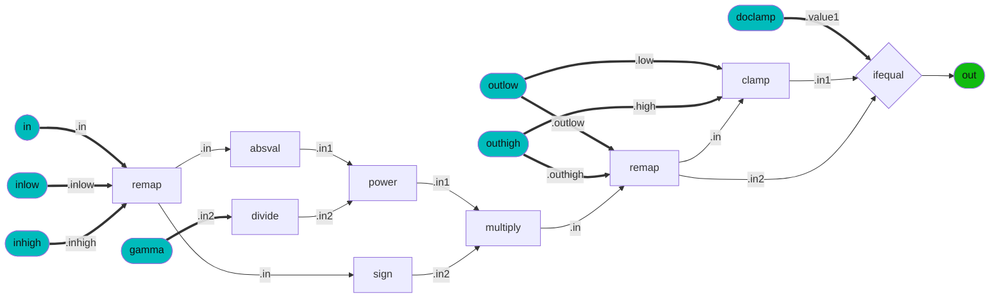

```mermaid
graph LR; 
    NG_range_vector2_N_switch_vector2{ifequal} --> NG_range_vector2_out([out])
    style NG_range_vector2_out fill:#1b1, color:#111
    NG_range_vector2_doclampINT([doclamp]) ==.value1==> NG_range_vector2_N_switch_vector2[ifequal]
    style NG_range_vector2_doclampINT fill:#0bb, color:#111
    NG_range_vector2_N_clamp_vector2[clamp] --".in1"--> NG_range_vector2_N_switch_vector2{ifequal}
    NG_range_vector2_outlowINT([outlow]) ==.low==> NG_range_vector2_N_clamp_vector2[clamp]
    style NG_range_vector2_outlowINT fill:#0bb, color:#111
    NG_range_vector2_outhighINT([outhigh]) ==.high==> NG_range_vector2_N_clamp_vector2[clamp]
    style NG_range_vector2_outhighINT fill:#0bb, color:#111
    NG_range_vector2_N_remap2_vector2[remap] --".in"--> NG_range_vector2_N_clamp_vector2[clamp]
    NG_range_vector2_outlowINT([outlow]) ==.outlow==> NG_range_vector2_N_remap2_vector2[remap]
    style NG_range_vector2_outlowINT fill:#0bb, color:#111
    NG_range_vector2_outhighINT([outhigh]) ==.outhigh==> NG_range_vector2_N_remap2_vector2[remap]
    style NG_range_vector2_outhighINT fill:#0bb, color:#111
    NG_range_vector2_N_gamma_vector2[multiply] --".in"--> NG_range_vector2_N_remap2_vector2[remap]
    NG_range_vector2_N_pow_vector2[power] --".in1"--> NG_range_vector2_N_gamma_vector2[multiply]
    NG_range_vector2_N_abs_vector2[absval] --".in1"--> NG_range_vector2_N_pow_vector2[power]
    NG_range_vector2_N_remap1_vector2[remap] --".in"--> NG_range_vector2_N_abs_vector2[absval]
    NG_range_vector2_inINT([in]) ==.in==> NG_range_vector2_N_remap1_vector2[remap]
    style NG_range_vector2_inINT fill:#0bb, color:#111
    NG_range_vector2_inlowINT([inlow]) ==.inlow==> NG_range_vector2_N_remap1_vector2[remap]
    style NG_range_vector2_inlowINT fill:#0bb, color:#111
    NG_range_vector2_inhighINT([inhigh]) ==.inhigh==> NG_range_vector2_N_remap1_vector2[remap]
    style NG_range_vector2_inhighINT fill:#0bb, color:#111
    NG_range_vector2_N_recip_vector2[divide] --".in2"--> NG_range_vector2_N_pow_vector2[power]
    NG_range_vector2_gammaINT([gamma]) ==.in2==> NG_range_vector2_N_recip_vector2[divide]
    style NG_range_vector2_gammaINT fill:#0bb, color:#111
    NG_range_vector2_N_sign_vector2[sign] --".in2"--> NG_range_vector2_N_gamma_vector2[multiply]
    NG_range_vector2_N_remap1_vector2[remap] --".in"--> NG_range_vector2_N_sign_vector2[sign]
    NG_range_vector2_N_remap2_vector2[remap] --".in2"--> NG_range_vector2_N_switch_vector2{ifequal}
```
