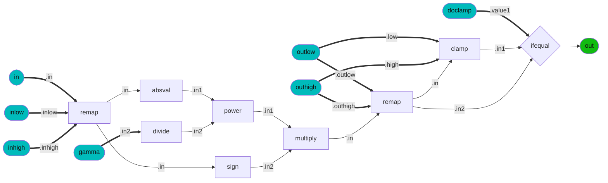

```mermaid
graph LR; 
    NG_range_vector4FA_N_switch_vector4FA{ifequal} --> NG_range_vector4FA_out([out])
    style NG_range_vector4FA_out fill:#1b1, color:#111
    NG_range_vector4FA_doclampINT([doclamp]) ==.value1==> NG_range_vector4FA_N_switch_vector4FA[ifequal]
    style NG_range_vector4FA_doclampINT fill:#0bb, color:#111
    NG_range_vector4FA_N_clamp_vector4FA[clamp] --".in1"--> NG_range_vector4FA_N_switch_vector4FA{ifequal}
    NG_range_vector4FA_outlowINT([outlow]) ==.low==> NG_range_vector4FA_N_clamp_vector4FA[clamp]
    style NG_range_vector4FA_outlowINT fill:#0bb, color:#111
    NG_range_vector4FA_outhighINT([outhigh]) ==.high==> NG_range_vector4FA_N_clamp_vector4FA[clamp]
    style NG_range_vector4FA_outhighINT fill:#0bb, color:#111
    NG_range_vector4FA_N_remap2_vector4FA[remap] --".in"--> NG_range_vector4FA_N_clamp_vector4FA[clamp]
    NG_range_vector4FA_outlowINT([outlow]) ==.outlow==> NG_range_vector4FA_N_remap2_vector4FA[remap]
    style NG_range_vector4FA_outlowINT fill:#0bb, color:#111
    NG_range_vector4FA_outhighINT([outhigh]) ==.outhigh==> NG_range_vector4FA_N_remap2_vector4FA[remap]
    style NG_range_vector4FA_outhighINT fill:#0bb, color:#111
    NG_range_vector4FA_N_gamma_vector4FA[multiply] --".in"--> NG_range_vector4FA_N_remap2_vector4FA[remap]
    NG_range_vector4FA_N_pow_vector4FA[power] --".in1"--> NG_range_vector4FA_N_gamma_vector4FA[multiply]
    NG_range_vector4FA_N_abs_vector4FA[absval] --".in1"--> NG_range_vector4FA_N_pow_vector4FA[power]
    NG_range_vector4FA_N_remap1_vector4FA[remap] --".in"--> NG_range_vector4FA_N_abs_vector4FA[absval]
    NG_range_vector4FA_inINT([in]) ==.in==> NG_range_vector4FA_N_remap1_vector4FA[remap]
    style NG_range_vector4FA_inINT fill:#0bb, color:#111
    NG_range_vector4FA_inlowINT([inlow]) ==.inlow==> NG_range_vector4FA_N_remap1_vector4FA[remap]
    style NG_range_vector4FA_inlowINT fill:#0bb, color:#111
    NG_range_vector4FA_inhighINT([inhigh]) ==.inhigh==> NG_range_vector4FA_N_remap1_vector4FA[remap]
    style NG_range_vector4FA_inhighINT fill:#0bb, color:#111
    NG_range_vector4FA_N_recip_vector4FA[divide] --".in2"--> NG_range_vector4FA_N_pow_vector4FA[power]
    NG_range_vector4FA_gammaINT([gamma]) ==.in2==> NG_range_vector4FA_N_recip_vector4FA[divide]
    style NG_range_vector4FA_gammaINT fill:#0bb, color:#111
    NG_range_vector4FA_N_sign_vector4FA[sign] --".in2"--> NG_range_vector4FA_N_gamma_vector4FA[multiply]
    NG_range_vector4FA_N_remap1_vector4FA[remap] --".in"--> NG_range_vector4FA_N_sign_vector4FA[sign]
    NG_range_vector4FA_N_remap2_vector4FA[remap] --".in2"--> NG_range_vector4FA_N_switch_vector4FA{ifequal}
```
