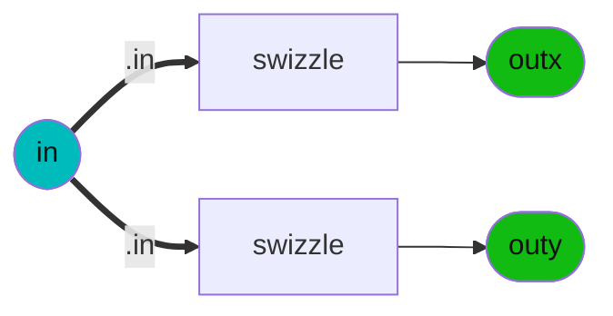

```mermaid
graph LR; 
    NG_separate2_vector2_N_x_vector2[swizzle] --> NG_separate2_vector2_outx([outx])
    style NG_separate2_vector2_outx fill:#1b1, color:#111
    NG_separate2_vector2_inINT([in]) ==.in==> NG_separate2_vector2_N_x_vector2[swizzle]
    style NG_separate2_vector2_inINT fill:#0bb, color:#111
    NG_separate2_vector2_N_y_vector2[swizzle] --> NG_separate2_vector2_outy([outy])
    style NG_separate2_vector2_outy fill:#1b1, color:#111
    NG_separate2_vector2_inINT([in]) ==.in==> NG_separate2_vector2_N_y_vector2[swizzle]
    style NG_separate2_vector2_inINT fill:#0bb, color:#111
```
