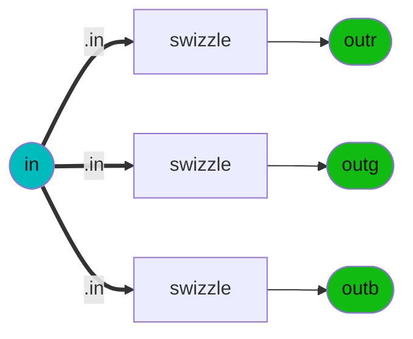

```mermaid
graph LR; 
    NG_separate3_color3_N_r_color3[swizzle] --> NG_separate3_color3_outr([outr])
    style NG_separate3_color3_outr fill:#1b1, color:#111
    NG_separate3_color3_inINT([in]) ==.in==> NG_separate3_color3_N_r_color3[swizzle]
    style NG_separate3_color3_inINT fill:#0bb, color:#111
    NG_separate3_color3_N_g_color3[swizzle] --> NG_separate3_color3_outg([outg])
    style NG_separate3_color3_outg fill:#1b1, color:#111
    NG_separate3_color3_inINT([in]) ==.in==> NG_separate3_color3_N_g_color3[swizzle]
    style NG_separate3_color3_inINT fill:#0bb, color:#111
    NG_separate3_color3_N_b_color3[swizzle] --> NG_separate3_color3_outb([outb])
    style NG_separate3_color3_outb fill:#1b1, color:#111
    NG_separate3_color3_inINT([in]) ==.in==> NG_separate3_color3_N_b_color3[swizzle]
    style NG_separate3_color3_inINT fill:#0bb, color:#111
```
