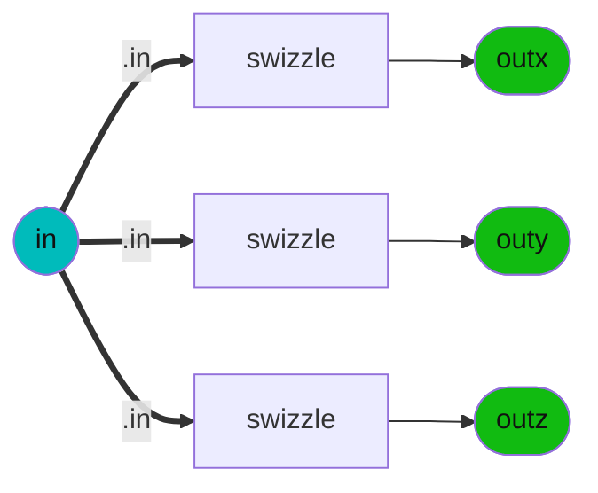

```mermaid
graph LR; 
    NG_separate3_vector3_N_x_vector3[swizzle] --> NG_separate3_vector3_outx([outx])
    style NG_separate3_vector3_outx fill:#1b1, color:#111
    NG_separate3_vector3_inINT([in]) ==.in==> NG_separate3_vector3_N_x_vector3[swizzle]
    style NG_separate3_vector3_inINT fill:#0bb, color:#111
    NG_separate3_vector3_N_y_vector3[swizzle] --> NG_separate3_vector3_outy([outy])
    style NG_separate3_vector3_outy fill:#1b1, color:#111
    NG_separate3_vector3_inINT([in]) ==.in==> NG_separate3_vector3_N_y_vector3[swizzle]
    style NG_separate3_vector3_inINT fill:#0bb, color:#111
    NG_separate3_vector3_N_z_vector3[swizzle] --> NG_separate3_vector3_outz([outz])
    style NG_separate3_vector3_outz fill:#1b1, color:#111
    NG_separate3_vector3_inINT([in]) ==.in==> NG_separate3_vector3_N_z_vector3[swizzle]
    style NG_separate3_vector3_inINT fill:#0bb, color:#111
```
