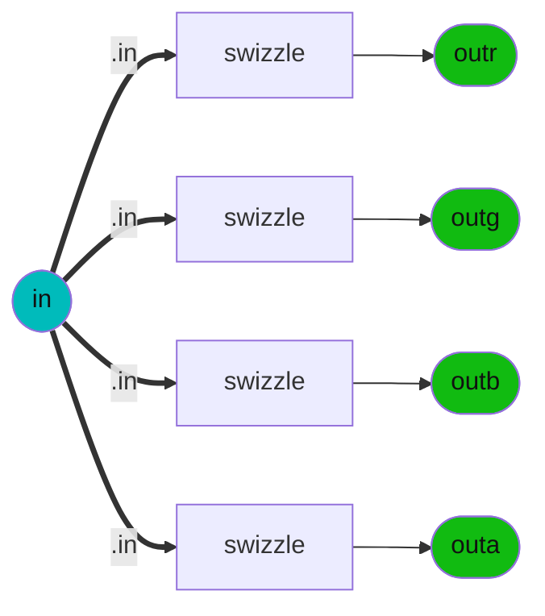

```mermaid
graph LR; 
    NG_separate4_color4_N_r_color4[swizzle] --> NG_separate4_color4_outr([outr])
    style NG_separate4_color4_outr fill:#1b1, color:#111
    NG_separate4_color4_inINT([in]) ==.in==> NG_separate4_color4_N_r_color4[swizzle]
    style NG_separate4_color4_inINT fill:#0bb, color:#111
    NG_separate4_color4_N_g_color4[swizzle] --> NG_separate4_color4_outg([outg])
    style NG_separate4_color4_outg fill:#1b1, color:#111
    NG_separate4_color4_inINT([in]) ==.in==> NG_separate4_color4_N_g_color4[swizzle]
    style NG_separate4_color4_inINT fill:#0bb, color:#111
    NG_separate4_color4_N_b_color4[swizzle] --> NG_separate4_color4_outb([outb])
    style NG_separate4_color4_outb fill:#1b1, color:#111
    NG_separate4_color4_inINT([in]) ==.in==> NG_separate4_color4_N_b_color4[swizzle]
    style NG_separate4_color4_inINT fill:#0bb, color:#111
    NG_separate4_color4_N_a_color4[swizzle] --> NG_separate4_color4_outa([outa])
    style NG_separate4_color4_outa fill:#1b1, color:#111
    NG_separate4_color4_inINT([in]) ==.in==> NG_separate4_color4_N_a_color4[swizzle]
    style NG_separate4_color4_inINT fill:#0bb, color:#111
```
