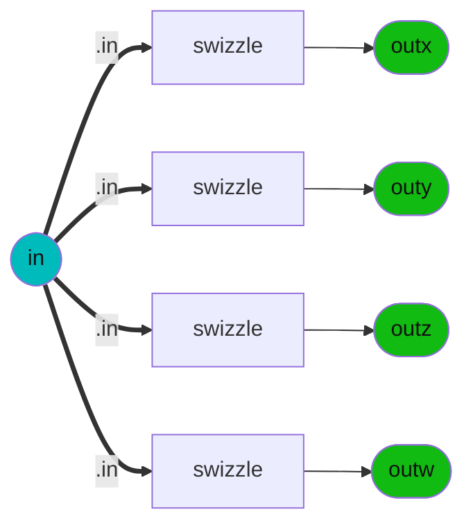

```mermaid
graph LR; 
    NG_separate4_vector4_N_x_vector4[swizzle] --> NG_separate4_vector4_outx([outx])
    style NG_separate4_vector4_outx fill:#1b1, color:#111
    NG_separate4_vector4_inINT([in]) ==.in==> NG_separate4_vector4_N_x_vector4[swizzle]
    style NG_separate4_vector4_inINT fill:#0bb, color:#111
    NG_separate4_vector4_N_y_vector4[swizzle] --> NG_separate4_vector4_outy([outy])
    style NG_separate4_vector4_outy fill:#1b1, color:#111
    NG_separate4_vector4_inINT([in]) ==.in==> NG_separate4_vector4_N_y_vector4[swizzle]
    style NG_separate4_vector4_inINT fill:#0bb, color:#111
    NG_separate4_vector4_N_z_vector4[swizzle] --> NG_separate4_vector4_outz([outz])
    style NG_separate4_vector4_outz fill:#1b1, color:#111
    NG_separate4_vector4_inINT([in]) ==.in==> NG_separate4_vector4_N_z_vector4[swizzle]
    style NG_separate4_vector4_inINT fill:#0bb, color:#111
    NG_separate4_vector4_N_w_vector4[swizzle] --> NG_separate4_vector4_outw([outw])
    style NG_separate4_vector4_outw fill:#1b1, color:#111
    NG_separate4_vector4_inINT([in]) ==.in==> NG_separate4_vector4_N_w_vector4[swizzle]
    style NG_separate4_vector4_inINT fill:#0bb, color:#111
```
