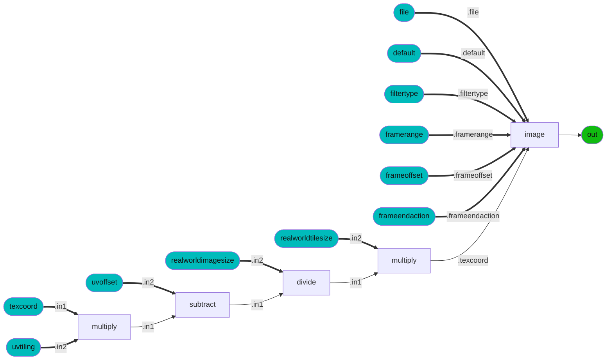

```mermaid
graph LR; 
    NG_tiledimage_color3_N_img_color3[image] --> NG_tiledimage_color3_out([out])
    style NG_tiledimage_color3_out fill:#1b1, color:#111
    NG_tiledimage_color3_fileINT([file]) ==.file==> NG_tiledimage_color3_N_img_color3[image]
    style NG_tiledimage_color3_fileINT fill:#0bb, color:#111
    NG_tiledimage_color3_dfaultINT([default]) ==.default==> NG_tiledimage_color3_N_img_color3[image]
    style NG_tiledimage_color3_dfaultINT fill:#0bb, color:#111
    NG_tiledimage_color3_filtertypeINT([filtertype]) ==.filtertype==> NG_tiledimage_color3_N_img_color3[image]
    style NG_tiledimage_color3_filtertypeINT fill:#0bb, color:#111
    NG_tiledimage_color3_framerangeINT([framerange]) ==.framerange==> NG_tiledimage_color3_N_img_color3[image]
    style NG_tiledimage_color3_framerangeINT fill:#0bb, color:#111
    NG_tiledimage_color3_frameoffsetINT([frameoffset]) ==.frameoffset==> NG_tiledimage_color3_N_img_color3[image]
    style NG_tiledimage_color3_frameoffsetINT fill:#0bb, color:#111
    NG_tiledimage_color3_frameendactionINT([frameendaction]) ==.frameendaction==> NG_tiledimage_color3_N_img_color3[image]
    style NG_tiledimage_color3_frameendactionINT fill:#0bb, color:#111
    NG_tiledimage_color3_N_multtilesize_color3[multiply] --".texcoord"--> NG_tiledimage_color3_N_img_color3[image]
    NG_tiledimage_color3_realworldtilesizeINT([realworldtilesize]) ==.in2==> NG_tiledimage_color3_N_multtilesize_color3[multiply]
    style NG_tiledimage_color3_realworldtilesizeINT fill:#0bb, color:#111
    NG_tiledimage_color3_N_divtilesize_color3[divide] --".in1"--> NG_tiledimage_color3_N_multtilesize_color3[multiply]
    NG_tiledimage_color3_realworldimagesizeINT([realworldimagesize]) ==.in2==> NG_tiledimage_color3_N_divtilesize_color3[divide]
    style NG_tiledimage_color3_realworldimagesizeINT fill:#0bb, color:#111
    NG_tiledimage_color3_N_sub_color3[subtract] --".in1"--> NG_tiledimage_color3_N_divtilesize_color3[divide]
    NG_tiledimage_color3_uvoffsetINT([uvoffset]) ==.in2==> NG_tiledimage_color3_N_sub_color3[subtract]
    style NG_tiledimage_color3_uvoffsetINT fill:#0bb, color:#111
    NG_tiledimage_color3_N_mult_color3[multiply] --".in1"--> NG_tiledimage_color3_N_sub_color3[subtract]
    NG_tiledimage_color3_texcoordINT([texcoord]) ==.in1==> NG_tiledimage_color3_N_mult_color3[multiply]
    style NG_tiledimage_color3_texcoordINT fill:#0bb, color:#111
    NG_tiledimage_color3_uvtilingINT([uvtiling]) ==.in2==> NG_tiledimage_color3_N_mult_color3[multiply]
    style NG_tiledimage_color3_uvtilingINT fill:#0bb, color:#111
```
