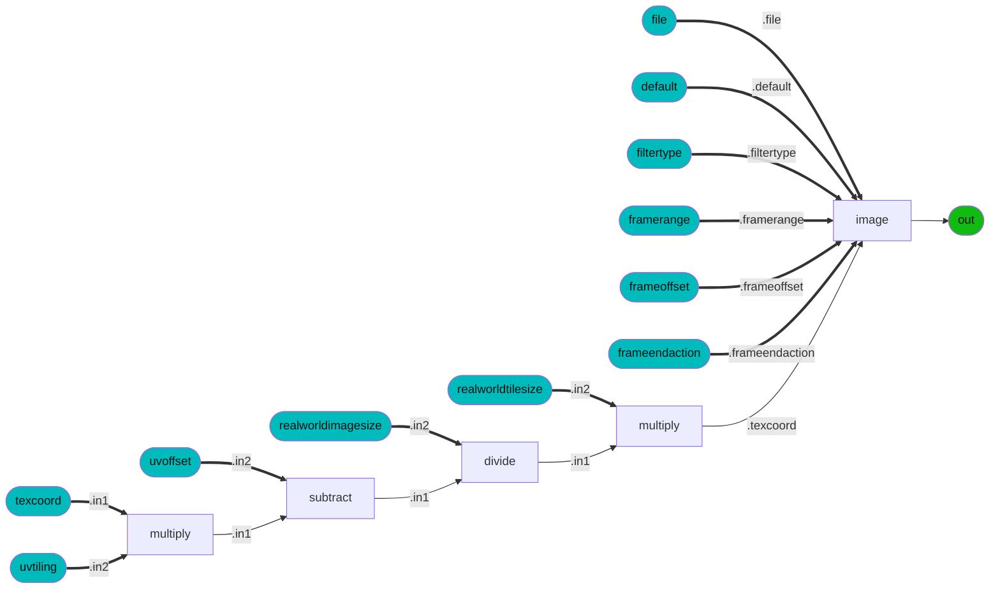

```mermaid
graph LR; 
    NG_tiledimage_color4_N_img_color4[image] --> NG_tiledimage_color4_out([out])
    style NG_tiledimage_color4_out fill:#1b1, color:#111
    NG_tiledimage_color4_fileINT([file]) ==.file==> NG_tiledimage_color4_N_img_color4[image]
    style NG_tiledimage_color4_fileINT fill:#0bb, color:#111
    NG_tiledimage_color4_dfaultINT([default]) ==.default==> NG_tiledimage_color4_N_img_color4[image]
    style NG_tiledimage_color4_dfaultINT fill:#0bb, color:#111
    NG_tiledimage_color4_filtertypeINT([filtertype]) ==.filtertype==> NG_tiledimage_color4_N_img_color4[image]
    style NG_tiledimage_color4_filtertypeINT fill:#0bb, color:#111
    NG_tiledimage_color4_framerangeINT([framerange]) ==.framerange==> NG_tiledimage_color4_N_img_color4[image]
    style NG_tiledimage_color4_framerangeINT fill:#0bb, color:#111
    NG_tiledimage_color4_frameoffsetINT([frameoffset]) ==.frameoffset==> NG_tiledimage_color4_N_img_color4[image]
    style NG_tiledimage_color4_frameoffsetINT fill:#0bb, color:#111
    NG_tiledimage_color4_frameendactionINT([frameendaction]) ==.frameendaction==> NG_tiledimage_color4_N_img_color4[image]
    style NG_tiledimage_color4_frameendactionINT fill:#0bb, color:#111
    NG_tiledimage_color4_N_multtilesize_color4[multiply] --".texcoord"--> NG_tiledimage_color4_N_img_color4[image]
    NG_tiledimage_color4_realworldtilesizeINT([realworldtilesize]) ==.in2==> NG_tiledimage_color4_N_multtilesize_color4[multiply]
    style NG_tiledimage_color4_realworldtilesizeINT fill:#0bb, color:#111
    NG_tiledimage_color4_N_divtilesize_color4[divide] --".in1"--> NG_tiledimage_color4_N_multtilesize_color4[multiply]
    NG_tiledimage_color4_realworldimagesizeINT([realworldimagesize]) ==.in2==> NG_tiledimage_color4_N_divtilesize_color4[divide]
    style NG_tiledimage_color4_realworldimagesizeINT fill:#0bb, color:#111
    NG_tiledimage_color4_N_sub_color4[subtract] --".in1"--> NG_tiledimage_color4_N_divtilesize_color4[divide]
    NG_tiledimage_color4_uvoffsetINT([uvoffset]) ==.in2==> NG_tiledimage_color4_N_sub_color4[subtract]
    style NG_tiledimage_color4_uvoffsetINT fill:#0bb, color:#111
    NG_tiledimage_color4_N_mult_color4[multiply] --".in1"--> NG_tiledimage_color4_N_sub_color4[subtract]
    NG_tiledimage_color4_texcoordINT([texcoord]) ==.in1==> NG_tiledimage_color4_N_mult_color4[multiply]
    style NG_tiledimage_color4_texcoordINT fill:#0bb, color:#111
    NG_tiledimage_color4_uvtilingINT([uvtiling]) ==.in2==> NG_tiledimage_color4_N_mult_color4[multiply]
    style NG_tiledimage_color4_uvtilingINT fill:#0bb, color:#111
```
