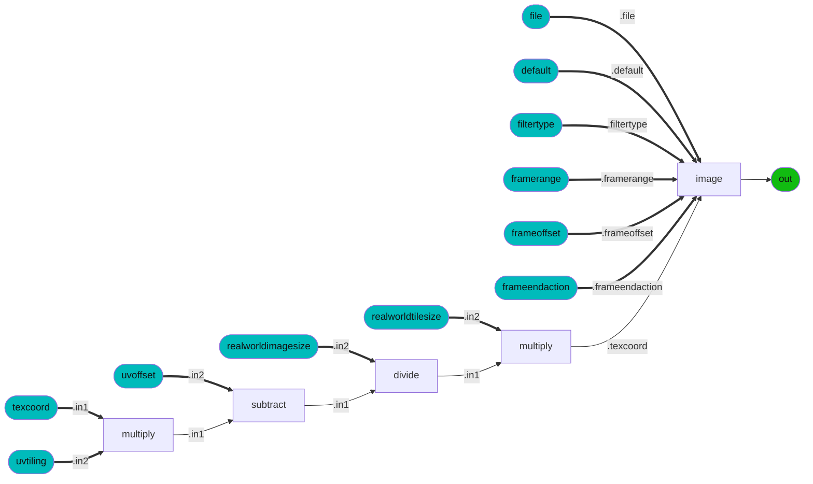

```mermaid
graph LR; 
    NG_tiledimage_float_N_img_float[image] --> NG_tiledimage_float_out([out])
    style NG_tiledimage_float_out fill:#1b1, color:#111
    NG_tiledimage_float_fileINT([file]) ==.file==> NG_tiledimage_float_N_img_float[image]
    style NG_tiledimage_float_fileINT fill:#0bb, color:#111
    NG_tiledimage_float_dfaultINT([default]) ==.default==> NG_tiledimage_float_N_img_float[image]
    style NG_tiledimage_float_dfaultINT fill:#0bb, color:#111
    NG_tiledimage_float_filtertypeINT([filtertype]) ==.filtertype==> NG_tiledimage_float_N_img_float[image]
    style NG_tiledimage_float_filtertypeINT fill:#0bb, color:#111
    NG_tiledimage_float_framerangeINT([framerange]) ==.framerange==> NG_tiledimage_float_N_img_float[image]
    style NG_tiledimage_float_framerangeINT fill:#0bb, color:#111
    NG_tiledimage_float_frameoffsetINT([frameoffset]) ==.frameoffset==> NG_tiledimage_float_N_img_float[image]
    style NG_tiledimage_float_frameoffsetINT fill:#0bb, color:#111
    NG_tiledimage_float_frameendactionINT([frameendaction]) ==.frameendaction==> NG_tiledimage_float_N_img_float[image]
    style NG_tiledimage_float_frameendactionINT fill:#0bb, color:#111
    NG_tiledimage_float_N_multtilesize_float[multiply] --".texcoord"--> NG_tiledimage_float_N_img_float[image]
    NG_tiledimage_float_realworldtilesizeINT([realworldtilesize]) ==.in2==> NG_tiledimage_float_N_multtilesize_float[multiply]
    style NG_tiledimage_float_realworldtilesizeINT fill:#0bb, color:#111
    NG_tiledimage_float_N_divtilesize_float[divide] --".in1"--> NG_tiledimage_float_N_multtilesize_float[multiply]
    NG_tiledimage_float_realworldimagesizeINT([realworldimagesize]) ==.in2==> NG_tiledimage_float_N_divtilesize_float[divide]
    style NG_tiledimage_float_realworldimagesizeINT fill:#0bb, color:#111
    NG_tiledimage_float_N_sub_float[subtract] --".in1"--> NG_tiledimage_float_N_divtilesize_float[divide]
    NG_tiledimage_float_uvoffsetINT([uvoffset]) ==.in2==> NG_tiledimage_float_N_sub_float[subtract]
    style NG_tiledimage_float_uvoffsetINT fill:#0bb, color:#111
    NG_tiledimage_float_N_mult_float[multiply] --".in1"--> NG_tiledimage_float_N_sub_float[subtract]
    NG_tiledimage_float_texcoordINT([texcoord]) ==.in1==> NG_tiledimage_float_N_mult_float[multiply]
    style NG_tiledimage_float_texcoordINT fill:#0bb, color:#111
    NG_tiledimage_float_uvtilingINT([uvtiling]) ==.in2==> NG_tiledimage_float_N_mult_float[multiply]
    style NG_tiledimage_float_uvtilingINT fill:#0bb, color:#111
```
