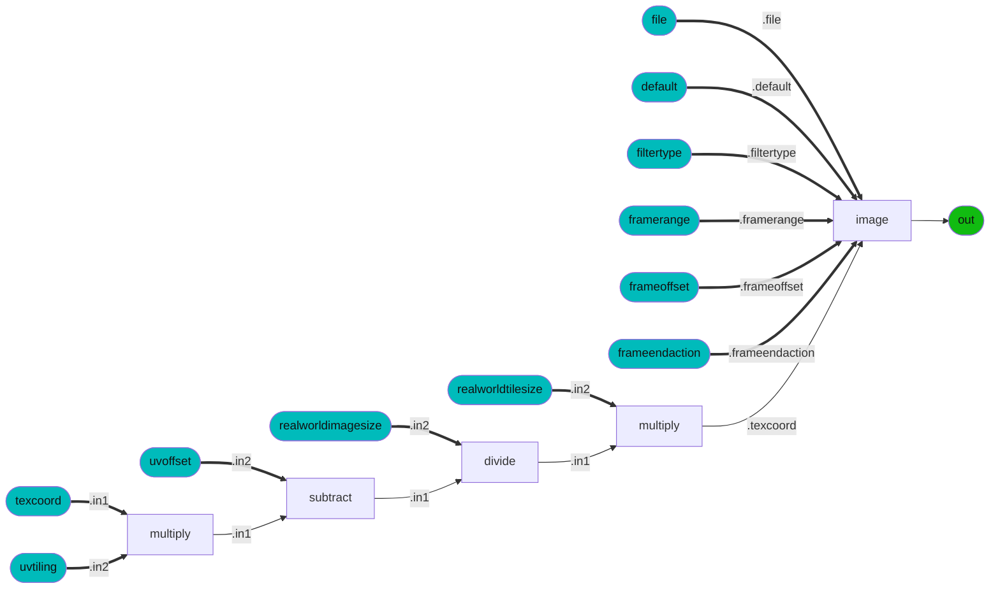

```mermaid
graph LR; 
    NG_tiledimage_vector2_N_img_vector2[image] --> NG_tiledimage_vector2_out([out])
    style NG_tiledimage_vector2_out fill:#1b1, color:#111
    NG_tiledimage_vector2_fileINT([file]) ==.file==> NG_tiledimage_vector2_N_img_vector2[image]
    style NG_tiledimage_vector2_fileINT fill:#0bb, color:#111
    NG_tiledimage_vector2_dfaultINT([default]) ==.default==> NG_tiledimage_vector2_N_img_vector2[image]
    style NG_tiledimage_vector2_dfaultINT fill:#0bb, color:#111
    NG_tiledimage_vector2_filtertypeINT([filtertype]) ==.filtertype==> NG_tiledimage_vector2_N_img_vector2[image]
    style NG_tiledimage_vector2_filtertypeINT fill:#0bb, color:#111
    NG_tiledimage_vector2_framerangeINT([framerange]) ==.framerange==> NG_tiledimage_vector2_N_img_vector2[image]
    style NG_tiledimage_vector2_framerangeINT fill:#0bb, color:#111
    NG_tiledimage_vector2_frameoffsetINT([frameoffset]) ==.frameoffset==> NG_tiledimage_vector2_N_img_vector2[image]
    style NG_tiledimage_vector2_frameoffsetINT fill:#0bb, color:#111
    NG_tiledimage_vector2_frameendactionINT([frameendaction]) ==.frameendaction==> NG_tiledimage_vector2_N_img_vector2[image]
    style NG_tiledimage_vector2_frameendactionINT fill:#0bb, color:#111
    NG_tiledimage_vector2_N_multtilesize_vector2[multiply] --".texcoord"--> NG_tiledimage_vector2_N_img_vector2[image]
    NG_tiledimage_vector2_realworldtilesizeINT([realworldtilesize]) ==.in2==> NG_tiledimage_vector2_N_multtilesize_vector2[multiply]
    style NG_tiledimage_vector2_realworldtilesizeINT fill:#0bb, color:#111
    NG_tiledimage_vector2_N_divtilesize_vector2[divide] --".in1"--> NG_tiledimage_vector2_N_multtilesize_vector2[multiply]
    NG_tiledimage_vector2_realworldimagesizeINT([realworldimagesize]) ==.in2==> NG_tiledimage_vector2_N_divtilesize_vector2[divide]
    style NG_tiledimage_vector2_realworldimagesizeINT fill:#0bb, color:#111
    NG_tiledimage_vector2_N_sub_vector2[subtract] --".in1"--> NG_tiledimage_vector2_N_divtilesize_vector2[divide]
    NG_tiledimage_vector2_uvoffsetINT([uvoffset]) ==.in2==> NG_tiledimage_vector2_N_sub_vector2[subtract]
    style NG_tiledimage_vector2_uvoffsetINT fill:#0bb, color:#111
    NG_tiledimage_vector2_N_mult_vector2[multiply] --".in1"--> NG_tiledimage_vector2_N_sub_vector2[subtract]
    NG_tiledimage_vector2_texcoordINT([texcoord]) ==.in1==> NG_tiledimage_vector2_N_mult_vector2[multiply]
    style NG_tiledimage_vector2_texcoordINT fill:#0bb, color:#111
    NG_tiledimage_vector2_uvtilingINT([uvtiling]) ==.in2==> NG_tiledimage_vector2_N_mult_vector2[multiply]
    style NG_tiledimage_vector2_uvtilingINT fill:#0bb, color:#111
```
