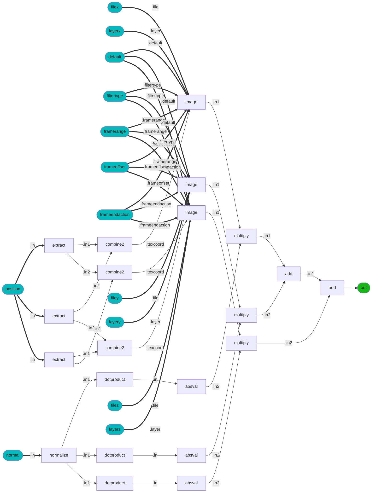

```mermaid
graph LR; 
    NG_triplanarprojection_color3_N_add2_color3[add] --> NG_triplanarprojection_color3_out([out])
    style NG_triplanarprojection_color3_out fill:#1b1, color:#111
    NG_triplanarprojection_color3_N_add1_color3[add] --".in1"--> NG_triplanarprojection_color3_N_add2_color3[add]
    NG_triplanarprojection_color3_N_nX_color3[multiply] --".in1"--> NG_triplanarprojection_color3_N_add1_color3[add]
    NG_triplanarprojection_color3_N_imgX_color3[image] --".in1"--> NG_triplanarprojection_color3_N_nX_color3[multiply]
    NG_triplanarprojection_color3_filexINT([filex]) ==.file==> NG_triplanarprojection_color3_N_imgX_color3[image]
    style NG_triplanarprojection_color3_filexINT fill:#0bb, color:#111
    NG_triplanarprojection_color3_layerxINT([layerx]) ==.layer==> NG_triplanarprojection_color3_N_imgX_color3[image]
    style NG_triplanarprojection_color3_layerxINT fill:#0bb, color:#111
    NG_triplanarprojection_color3_dfaultINT([default]) ==.default==> NG_triplanarprojection_color3_N_imgX_color3[image]
    style NG_triplanarprojection_color3_dfaultINT fill:#0bb, color:#111
    NG_triplanarprojection_color3_filtertypeINT([filtertype]) ==.filtertype==> NG_triplanarprojection_color3_N_imgX_color3[image]
    style NG_triplanarprojection_color3_filtertypeINT fill:#0bb, color:#111
    NG_triplanarprojection_color3_framerangeINT([framerange]) ==.framerange==> NG_triplanarprojection_color3_N_imgX_color3[image]
    style NG_triplanarprojection_color3_framerangeINT fill:#0bb, color:#111
    NG_triplanarprojection_color3_frameoffsetINT([frameoffset]) ==.frameoffset==> NG_triplanarprojection_color3_N_imgX_color3[image]
    style NG_triplanarprojection_color3_frameoffsetINT fill:#0bb, color:#111
    NG_triplanarprojection_color3_frameendactionINT([frameendaction]) ==.frameendaction==> NG_triplanarprojection_color3_N_imgX_color3[image]
    style NG_triplanarprojection_color3_frameendactionINT fill:#0bb, color:#111
    NG_triplanarprojection_color3_N_vecYZ_color3[combine2] --".texcoord"--> NG_triplanarprojection_color3_N_imgX_color3[image]
    NG_triplanarprojection_color3_N_extY_color3[extract] --".in1"--> NG_triplanarprojection_color3_N_vecYZ_color3[combine2]
    NG_triplanarprojection_color3_positionINT([position]) ==.in==> NG_triplanarprojection_color3_N_extY_color3[extract]
    style NG_triplanarprojection_color3_positionINT fill:#0bb, color:#111
    NG_triplanarprojection_color3_N_extZ_color3[extract] --".in2"--> NG_triplanarprojection_color3_N_vecYZ_color3[combine2]
    NG_triplanarprojection_color3_positionINT([position]) ==.in==> NG_triplanarprojection_color3_N_extZ_color3[extract]
    style NG_triplanarprojection_color3_positionINT fill:#0bb, color:#111
    NG_triplanarprojection_color3_N_blendX_color3[absval] --".in2"--> NG_triplanarprojection_color3_N_nX_color3[multiply]
    NG_triplanarprojection_color3_N_dotX_color3[dotproduct] --".in"--> NG_triplanarprojection_color3_N_blendX_color3[absval]
    NG_triplanarprojection_color3_N_norm_color3[normalize] --".in1"--> NG_triplanarprojection_color3_N_dotX_color3[dotproduct]
    NG_triplanarprojection_color3_normalINT([normal]) ==.in==> NG_triplanarprojection_color3_N_norm_color3[normalize]
    style NG_triplanarprojection_color3_normalINT fill:#0bb, color:#111
    NG_triplanarprojection_color3_N_nY_color3[multiply] --".in2"--> NG_triplanarprojection_color3_N_add1_color3[add]
    NG_triplanarprojection_color3_N_imgY_color3[image] --".in1"--> NG_triplanarprojection_color3_N_nY_color3[multiply]
    NG_triplanarprojection_color3_fileyINT([filey]) ==.file==> NG_triplanarprojection_color3_N_imgY_color3[image]
    style NG_triplanarprojection_color3_fileyINT fill:#0bb, color:#111
    NG_triplanarprojection_color3_layeryINT([layery]) ==.layer==> NG_triplanarprojection_color3_N_imgY_color3[image]
    style NG_triplanarprojection_color3_layeryINT fill:#0bb, color:#111
    NG_triplanarprojection_color3_dfaultINT([default]) ==.default==> NG_triplanarprojection_color3_N_imgY_color3[image]
    style NG_triplanarprojection_color3_dfaultINT fill:#0bb, color:#111
    NG_triplanarprojection_color3_filtertypeINT([filtertype]) ==.filtertype==> NG_triplanarprojection_color3_N_imgY_color3[image]
    style NG_triplanarprojection_color3_filtertypeINT fill:#0bb, color:#111
    NG_triplanarprojection_color3_framerangeINT([framerange]) ==.framerange==> NG_triplanarprojection_color3_N_imgY_color3[image]
    style NG_triplanarprojection_color3_framerangeINT fill:#0bb, color:#111
    NG_triplanarprojection_color3_frameoffsetINT([frameoffset]) ==.frameoffset==> NG_triplanarprojection_color3_N_imgY_color3[image]
    style NG_triplanarprojection_color3_frameoffsetINT fill:#0bb, color:#111
    NG_triplanarprojection_color3_frameendactionINT([frameendaction]) ==.frameendaction==> NG_triplanarprojection_color3_N_imgY_color3[image]
    style NG_triplanarprojection_color3_frameendactionINT fill:#0bb, color:#111
    NG_triplanarprojection_color3_N_vecXZ_color3[combine2] --".texcoord"--> NG_triplanarprojection_color3_N_imgY_color3[image]
    NG_triplanarprojection_color3_N_extX_color3[extract] --".in1"--> NG_triplanarprojection_color3_N_vecXZ_color3[combine2]
    NG_triplanarprojection_color3_positionINT([position]) ==.in==> NG_triplanarprojection_color3_N_extX_color3[extract]
    style NG_triplanarprojection_color3_positionINT fill:#0bb, color:#111
    NG_triplanarprojection_color3_N_extZ_color3[extract] --".in2"--> NG_triplanarprojection_color3_N_vecXZ_color3[combine2]
    NG_triplanarprojection_color3_N_blendY_color3[absval] --".in2"--> NG_triplanarprojection_color3_N_nY_color3[multiply]
    NG_triplanarprojection_color3_N_dotY_color3[dotproduct] --".in"--> NG_triplanarprojection_color3_N_blendY_color3[absval]
    NG_triplanarprojection_color3_N_norm_color3[normalize] --".in1"--> NG_triplanarprojection_color3_N_dotY_color3[dotproduct]
    NG_triplanarprojection_color3_N_nZ_color3[multiply] --".in2"--> NG_triplanarprojection_color3_N_add2_color3[add]
    NG_triplanarprojection_color3_N_imgZ_color3[image] --".in1"--> NG_triplanarprojection_color3_N_nZ_color3[multiply]
    NG_triplanarprojection_color3_filezINT([filez]) ==.file==> NG_triplanarprojection_color3_N_imgZ_color3[image]
    style NG_triplanarprojection_color3_filezINT fill:#0bb, color:#111
    NG_triplanarprojection_color3_layerzINT([layerz]) ==.layer==> NG_triplanarprojection_color3_N_imgZ_color3[image]
    style NG_triplanarprojection_color3_layerzINT fill:#0bb, color:#111
    NG_triplanarprojection_color3_dfaultINT([default]) ==.default==> NG_triplanarprojection_color3_N_imgZ_color3[image]
    style NG_triplanarprojection_color3_dfaultINT fill:#0bb, color:#111
    NG_triplanarprojection_color3_filtertypeINT([filtertype]) ==.filtertype==> NG_triplanarprojection_color3_N_imgZ_color3[image]
    style NG_triplanarprojection_color3_filtertypeINT fill:#0bb, color:#111
    NG_triplanarprojection_color3_framerangeINT([framerange]) ==.framerange==> NG_triplanarprojection_color3_N_imgZ_color3[image]
    style NG_triplanarprojection_color3_framerangeINT fill:#0bb, color:#111
    NG_triplanarprojection_color3_frameoffsetINT([frameoffset]) ==.frameoffset==> NG_triplanarprojection_color3_N_imgZ_color3[image]
    style NG_triplanarprojection_color3_frameoffsetINT fill:#0bb, color:#111
    NG_triplanarprojection_color3_frameendactionINT([frameendaction]) ==.frameendaction==> NG_triplanarprojection_color3_N_imgZ_color3[image]
    style NG_triplanarprojection_color3_frameendactionINT fill:#0bb, color:#111
    NG_triplanarprojection_color3_N_vecXY_color3[combine2] --".texcoord"--> NG_triplanarprojection_color3_N_imgZ_color3[image]
    NG_triplanarprojection_color3_N_extX_color3[extract] --".in1"--> NG_triplanarprojection_color3_N_vecXY_color3[combine2]
    NG_triplanarprojection_color3_N_extY_color3[extract] --".in2"--> NG_triplanarprojection_color3_N_vecXY_color3[combine2]
    NG_triplanarprojection_color3_N_blendZ_color3[absval] --".in2"--> NG_triplanarprojection_color3_N_nZ_color3[multiply]
    NG_triplanarprojection_color3_N_dotZ_color3[dotproduct] --".in"--> NG_triplanarprojection_color3_N_blendZ_color3[absval]
    NG_triplanarprojection_color3_N_norm_color3[normalize] --".in1"--> NG_triplanarprojection_color3_N_dotZ_color3[dotproduct]
```
