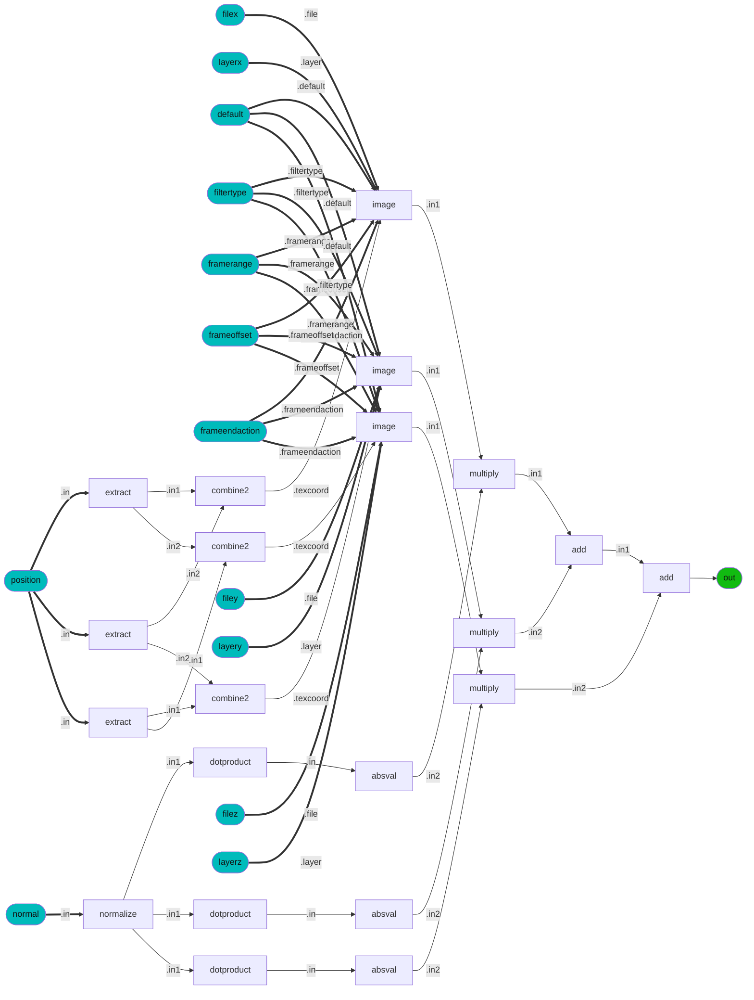

```mermaid
graph LR; 
    NG_triplanarprojection_color4_N_add2_color4[add] --> NG_triplanarprojection_color4_out([out])
    style NG_triplanarprojection_color4_out fill:#1b1, color:#111
    NG_triplanarprojection_color4_N_add1_color4[add] --".in1"--> NG_triplanarprojection_color4_N_add2_color4[add]
    NG_triplanarprojection_color4_N_nX_color4[multiply] --".in1"--> NG_triplanarprojection_color4_N_add1_color4[add]
    NG_triplanarprojection_color4_N_imgX_color4[image] --".in1"--> NG_triplanarprojection_color4_N_nX_color4[multiply]
    NG_triplanarprojection_color4_filexINT([filex]) ==.file==> NG_triplanarprojection_color4_N_imgX_color4[image]
    style NG_triplanarprojection_color4_filexINT fill:#0bb, color:#111
    NG_triplanarprojection_color4_layerxINT([layerx]) ==.layer==> NG_triplanarprojection_color4_N_imgX_color4[image]
    style NG_triplanarprojection_color4_layerxINT fill:#0bb, color:#111
    NG_triplanarprojection_color4_dfaultINT([default]) ==.default==> NG_triplanarprojection_color4_N_imgX_color4[image]
    style NG_triplanarprojection_color4_dfaultINT fill:#0bb, color:#111
    NG_triplanarprojection_color4_filtertypeINT([filtertype]) ==.filtertype==> NG_triplanarprojection_color4_N_imgX_color4[image]
    style NG_triplanarprojection_color4_filtertypeINT fill:#0bb, color:#111
    NG_triplanarprojection_color4_framerangeINT([framerange]) ==.framerange==> NG_triplanarprojection_color4_N_imgX_color4[image]
    style NG_triplanarprojection_color4_framerangeINT fill:#0bb, color:#111
    NG_triplanarprojection_color4_frameoffsetINT([frameoffset]) ==.frameoffset==> NG_triplanarprojection_color4_N_imgX_color4[image]
    style NG_triplanarprojection_color4_frameoffsetINT fill:#0bb, color:#111
    NG_triplanarprojection_color4_frameendactionINT([frameendaction]) ==.frameendaction==> NG_triplanarprojection_color4_N_imgX_color4[image]
    style NG_triplanarprojection_color4_frameendactionINT fill:#0bb, color:#111
    NG_triplanarprojection_color4_N_vecYZ_color4[combine2] --".texcoord"--> NG_triplanarprojection_color4_N_imgX_color4[image]
    NG_triplanarprojection_color4_N_extY_color4[extract] --".in1"--> NG_triplanarprojection_color4_N_vecYZ_color4[combine2]
    NG_triplanarprojection_color4_positionINT([position]) ==.in==> NG_triplanarprojection_color4_N_extY_color4[extract]
    style NG_triplanarprojection_color4_positionINT fill:#0bb, color:#111
    NG_triplanarprojection_color4_N_extZ_color4[extract] --".in2"--> NG_triplanarprojection_color4_N_vecYZ_color4[combine2]
    NG_triplanarprojection_color4_positionINT([position]) ==.in==> NG_triplanarprojection_color4_N_extZ_color4[extract]
    style NG_triplanarprojection_color4_positionINT fill:#0bb, color:#111
    NG_triplanarprojection_color4_N_blendX_color4[absval] --".in2"--> NG_triplanarprojection_color4_N_nX_color4[multiply]
    NG_triplanarprojection_color4_N_dotX_color4[dotproduct] --".in"--> NG_triplanarprojection_color4_N_blendX_color4[absval]
    NG_triplanarprojection_color4_N_norm_color4[normalize] --".in1"--> NG_triplanarprojection_color4_N_dotX_color4[dotproduct]
    NG_triplanarprojection_color4_normalINT([normal]) ==.in==> NG_triplanarprojection_color4_N_norm_color4[normalize]
    style NG_triplanarprojection_color4_normalINT fill:#0bb, color:#111
    NG_triplanarprojection_color4_N_nY_color4[multiply] --".in2"--> NG_triplanarprojection_color4_N_add1_color4[add]
    NG_triplanarprojection_color4_N_imgY_color4[image] --".in1"--> NG_triplanarprojection_color4_N_nY_color4[multiply]
    NG_triplanarprojection_color4_fileyINT([filey]) ==.file==> NG_triplanarprojection_color4_N_imgY_color4[image]
    style NG_triplanarprojection_color4_fileyINT fill:#0bb, color:#111
    NG_triplanarprojection_color4_layeryINT([layery]) ==.layer==> NG_triplanarprojection_color4_N_imgY_color4[image]
    style NG_triplanarprojection_color4_layeryINT fill:#0bb, color:#111
    NG_triplanarprojection_color4_dfaultINT([default]) ==.default==> NG_triplanarprojection_color4_N_imgY_color4[image]
    style NG_triplanarprojection_color4_dfaultINT fill:#0bb, color:#111
    NG_triplanarprojection_color4_filtertypeINT([filtertype]) ==.filtertype==> NG_triplanarprojection_color4_N_imgY_color4[image]
    style NG_triplanarprojection_color4_filtertypeINT fill:#0bb, color:#111
    NG_triplanarprojection_color4_framerangeINT([framerange]) ==.framerange==> NG_triplanarprojection_color4_N_imgY_color4[image]
    style NG_triplanarprojection_color4_framerangeINT fill:#0bb, color:#111
    NG_triplanarprojection_color4_frameoffsetINT([frameoffset]) ==.frameoffset==> NG_triplanarprojection_color4_N_imgY_color4[image]
    style NG_triplanarprojection_color4_frameoffsetINT fill:#0bb, color:#111
    NG_triplanarprojection_color4_frameendactionINT([frameendaction]) ==.frameendaction==> NG_triplanarprojection_color4_N_imgY_color4[image]
    style NG_triplanarprojection_color4_frameendactionINT fill:#0bb, color:#111
    NG_triplanarprojection_color4_N_vecXZ_color4[combine2] --".texcoord"--> NG_triplanarprojection_color4_N_imgY_color4[image]
    NG_triplanarprojection_color4_N_extX_color4[extract] --".in1"--> NG_triplanarprojection_color4_N_vecXZ_color4[combine2]
    NG_triplanarprojection_color4_positionINT([position]) ==.in==> NG_triplanarprojection_color4_N_extX_color4[extract]
    style NG_triplanarprojection_color4_positionINT fill:#0bb, color:#111
    NG_triplanarprojection_color4_N_extZ_color4[extract] --".in2"--> NG_triplanarprojection_color4_N_vecXZ_color4[combine2]
    NG_triplanarprojection_color4_N_blendY_color4[absval] --".in2"--> NG_triplanarprojection_color4_N_nY_color4[multiply]
    NG_triplanarprojection_color4_N_dotY_color4[dotproduct] --".in"--> NG_triplanarprojection_color4_N_blendY_color4[absval]
    NG_triplanarprojection_color4_N_norm_color4[normalize] --".in1"--> NG_triplanarprojection_color4_N_dotY_color4[dotproduct]
    NG_triplanarprojection_color4_N_nZ_color4[multiply] --".in2"--> NG_triplanarprojection_color4_N_add2_color4[add]
    NG_triplanarprojection_color4_N_imgZ_color4[image] --".in1"--> NG_triplanarprojection_color4_N_nZ_color4[multiply]
    NG_triplanarprojection_color4_filezINT([filez]) ==.file==> NG_triplanarprojection_color4_N_imgZ_color4[image]
    style NG_triplanarprojection_color4_filezINT fill:#0bb, color:#111
    NG_triplanarprojection_color4_layerzINT([layerz]) ==.layer==> NG_triplanarprojection_color4_N_imgZ_color4[image]
    style NG_triplanarprojection_color4_layerzINT fill:#0bb, color:#111
    NG_triplanarprojection_color4_dfaultINT([default]) ==.default==> NG_triplanarprojection_color4_N_imgZ_color4[image]
    style NG_triplanarprojection_color4_dfaultINT fill:#0bb, color:#111
    NG_triplanarprojection_color4_filtertypeINT([filtertype]) ==.filtertype==> NG_triplanarprojection_color4_N_imgZ_color4[image]
    style NG_triplanarprojection_color4_filtertypeINT fill:#0bb, color:#111
    NG_triplanarprojection_color4_framerangeINT([framerange]) ==.framerange==> NG_triplanarprojection_color4_N_imgZ_color4[image]
    style NG_triplanarprojection_color4_framerangeINT fill:#0bb, color:#111
    NG_triplanarprojection_color4_frameoffsetINT([frameoffset]) ==.frameoffset==> NG_triplanarprojection_color4_N_imgZ_color4[image]
    style NG_triplanarprojection_color4_frameoffsetINT fill:#0bb, color:#111
    NG_triplanarprojection_color4_frameendactionINT([frameendaction]) ==.frameendaction==> NG_triplanarprojection_color4_N_imgZ_color4[image]
    style NG_triplanarprojection_color4_frameendactionINT fill:#0bb, color:#111
    NG_triplanarprojection_color4_N_vecXY_color4[combine2] --".texcoord"--> NG_triplanarprojection_color4_N_imgZ_color4[image]
    NG_triplanarprojection_color4_N_extX_color4[extract] --".in1"--> NG_triplanarprojection_color4_N_vecXY_color4[combine2]
    NG_triplanarprojection_color4_N_extY_color4[extract] --".in2"--> NG_triplanarprojection_color4_N_vecXY_color4[combine2]
    NG_triplanarprojection_color4_N_blendZ_color4[absval] --".in2"--> NG_triplanarprojection_color4_N_nZ_color4[multiply]
    NG_triplanarprojection_color4_N_dotZ_color4[dotproduct] --".in"--> NG_triplanarprojection_color4_N_blendZ_color4[absval]
    NG_triplanarprojection_color4_N_norm_color4[normalize] --".in1"--> NG_triplanarprojection_color4_N_dotZ_color4[dotproduct]
```
