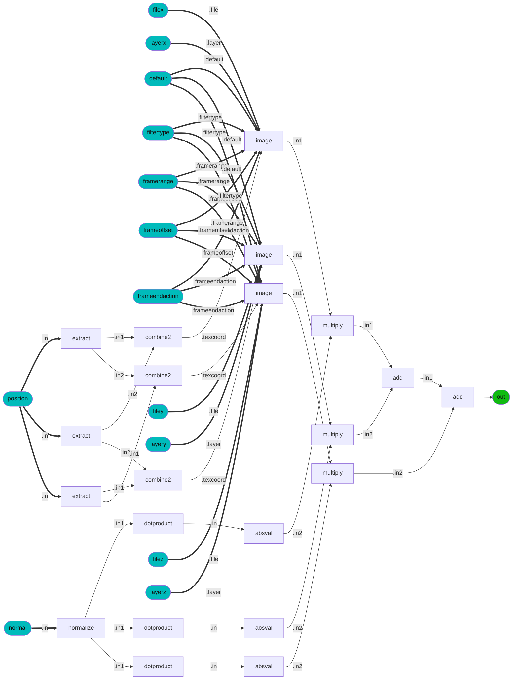

```mermaid
graph LR; 
    NG_triplanarprojection_float_N_add2_float[add] --> NG_triplanarprojection_float_out([out])
    style NG_triplanarprojection_float_out fill:#1b1, color:#111
    NG_triplanarprojection_float_N_add1_float[add] --".in1"--> NG_triplanarprojection_float_N_add2_float[add]
    NG_triplanarprojection_float_N_nX_float[multiply] --".in1"--> NG_triplanarprojection_float_N_add1_float[add]
    NG_triplanarprojection_float_N_imgX_float[image] --".in1"--> NG_triplanarprojection_float_N_nX_float[multiply]
    NG_triplanarprojection_float_filexINT([filex]) ==.file==> NG_triplanarprojection_float_N_imgX_float[image]
    style NG_triplanarprojection_float_filexINT fill:#0bb, color:#111
    NG_triplanarprojection_float_layerxINT([layerx]) ==.layer==> NG_triplanarprojection_float_N_imgX_float[image]
    style NG_triplanarprojection_float_layerxINT fill:#0bb, color:#111
    NG_triplanarprojection_float_dfaultINT([default]) ==.default==> NG_triplanarprojection_float_N_imgX_float[image]
    style NG_triplanarprojection_float_dfaultINT fill:#0bb, color:#111
    NG_triplanarprojection_float_filtertypeINT([filtertype]) ==.filtertype==> NG_triplanarprojection_float_N_imgX_float[image]
    style NG_triplanarprojection_float_filtertypeINT fill:#0bb, color:#111
    NG_triplanarprojection_float_framerangeINT([framerange]) ==.framerange==> NG_triplanarprojection_float_N_imgX_float[image]
    style NG_triplanarprojection_float_framerangeINT fill:#0bb, color:#111
    NG_triplanarprojection_float_frameoffsetINT([frameoffset]) ==.frameoffset==> NG_triplanarprojection_float_N_imgX_float[image]
    style NG_triplanarprojection_float_frameoffsetINT fill:#0bb, color:#111
    NG_triplanarprojection_float_frameendactionINT([frameendaction]) ==.frameendaction==> NG_triplanarprojection_float_N_imgX_float[image]
    style NG_triplanarprojection_float_frameendactionINT fill:#0bb, color:#111
    NG_triplanarprojection_float_N_vecYZ_float[combine2] --".texcoord"--> NG_triplanarprojection_float_N_imgX_float[image]
    NG_triplanarprojection_float_N_extY_float[extract] --".in1"--> NG_triplanarprojection_float_N_vecYZ_float[combine2]
    NG_triplanarprojection_float_positionINT([position]) ==.in==> NG_triplanarprojection_float_N_extY_float[extract]
    style NG_triplanarprojection_float_positionINT fill:#0bb, color:#111
    NG_triplanarprojection_float_N_extZ_float[extract] --".in2"--> NG_triplanarprojection_float_N_vecYZ_float[combine2]
    NG_triplanarprojection_float_positionINT([position]) ==.in==> NG_triplanarprojection_float_N_extZ_float[extract]
    style NG_triplanarprojection_float_positionINT fill:#0bb, color:#111
    NG_triplanarprojection_float_N_blendX_float[absval] --".in2"--> NG_triplanarprojection_float_N_nX_float[multiply]
    NG_triplanarprojection_float_N_dotX_float[dotproduct] --".in"--> NG_triplanarprojection_float_N_blendX_float[absval]
    NG_triplanarprojection_float_N_norm_float[normalize] --".in1"--> NG_triplanarprojection_float_N_dotX_float[dotproduct]
    NG_triplanarprojection_float_normalINT([normal]) ==.in==> NG_triplanarprojection_float_N_norm_float[normalize]
    style NG_triplanarprojection_float_normalINT fill:#0bb, color:#111
    NG_triplanarprojection_float_N_nY_float[multiply] --".in2"--> NG_triplanarprojection_float_N_add1_float[add]
    NG_triplanarprojection_float_N_imgY_float[image] --".in1"--> NG_triplanarprojection_float_N_nY_float[multiply]
    NG_triplanarprojection_float_fileyINT([filey]) ==.file==> NG_triplanarprojection_float_N_imgY_float[image]
    style NG_triplanarprojection_float_fileyINT fill:#0bb, color:#111
    NG_triplanarprojection_float_layeryINT([layery]) ==.layer==> NG_triplanarprojection_float_N_imgY_float[image]
    style NG_triplanarprojection_float_layeryINT fill:#0bb, color:#111
    NG_triplanarprojection_float_dfaultINT([default]) ==.default==> NG_triplanarprojection_float_N_imgY_float[image]
    style NG_triplanarprojection_float_dfaultINT fill:#0bb, color:#111
    NG_triplanarprojection_float_filtertypeINT([filtertype]) ==.filtertype==> NG_triplanarprojection_float_N_imgY_float[image]
    style NG_triplanarprojection_float_filtertypeINT fill:#0bb, color:#111
    NG_triplanarprojection_float_framerangeINT([framerange]) ==.framerange==> NG_triplanarprojection_float_N_imgY_float[image]
    style NG_triplanarprojection_float_framerangeINT fill:#0bb, color:#111
    NG_triplanarprojection_float_frameoffsetINT([frameoffset]) ==.frameoffset==> NG_triplanarprojection_float_N_imgY_float[image]
    style NG_triplanarprojection_float_frameoffsetINT fill:#0bb, color:#111
    NG_triplanarprojection_float_frameendactionINT([frameendaction]) ==.frameendaction==> NG_triplanarprojection_float_N_imgY_float[image]
    style NG_triplanarprojection_float_frameendactionINT fill:#0bb, color:#111
    NG_triplanarprojection_float_N_vecXZ_float[combine2] --".texcoord"--> NG_triplanarprojection_float_N_imgY_float[image]
    NG_triplanarprojection_float_N_extX_float[extract] --".in1"--> NG_triplanarprojection_float_N_vecXZ_float[combine2]
    NG_triplanarprojection_float_positionINT([position]) ==.in==> NG_triplanarprojection_float_N_extX_float[extract]
    style NG_triplanarprojection_float_positionINT fill:#0bb, color:#111
    NG_triplanarprojection_float_N_extZ_float[extract] --".in2"--> NG_triplanarprojection_float_N_vecXZ_float[combine2]
    NG_triplanarprojection_float_N_blendY_float[absval] --".in2"--> NG_triplanarprojection_float_N_nY_float[multiply]
    NG_triplanarprojection_float_N_dotY_float[dotproduct] --".in"--> NG_triplanarprojection_float_N_blendY_float[absval]
    NG_triplanarprojection_float_N_norm_float[normalize] --".in1"--> NG_triplanarprojection_float_N_dotY_float[dotproduct]
    NG_triplanarprojection_float_N_nZ_float[multiply] --".in2"--> NG_triplanarprojection_float_N_add2_float[add]
    NG_triplanarprojection_float_N_imgZ_float[image] --".in1"--> NG_triplanarprojection_float_N_nZ_float[multiply]
    NG_triplanarprojection_float_filezINT([filez]) ==.file==> NG_triplanarprojection_float_N_imgZ_float[image]
    style NG_triplanarprojection_float_filezINT fill:#0bb, color:#111
    NG_triplanarprojection_float_layerzINT([layerz]) ==.layer==> NG_triplanarprojection_float_N_imgZ_float[image]
    style NG_triplanarprojection_float_layerzINT fill:#0bb, color:#111
    NG_triplanarprojection_float_dfaultINT([default]) ==.default==> NG_triplanarprojection_float_N_imgZ_float[image]
    style NG_triplanarprojection_float_dfaultINT fill:#0bb, color:#111
    NG_triplanarprojection_float_filtertypeINT([filtertype]) ==.filtertype==> NG_triplanarprojection_float_N_imgZ_float[image]
    style NG_triplanarprojection_float_filtertypeINT fill:#0bb, color:#111
    NG_triplanarprojection_float_framerangeINT([framerange]) ==.framerange==> NG_triplanarprojection_float_N_imgZ_float[image]
    style NG_triplanarprojection_float_framerangeINT fill:#0bb, color:#111
    NG_triplanarprojection_float_frameoffsetINT([frameoffset]) ==.frameoffset==> NG_triplanarprojection_float_N_imgZ_float[image]
    style NG_triplanarprojection_float_frameoffsetINT fill:#0bb, color:#111
    NG_triplanarprojection_float_frameendactionINT([frameendaction]) ==.frameendaction==> NG_triplanarprojection_float_N_imgZ_float[image]
    style NG_triplanarprojection_float_frameendactionINT fill:#0bb, color:#111
    NG_triplanarprojection_float_N_vecXY_float[combine2] --".texcoord"--> NG_triplanarprojection_float_N_imgZ_float[image]
    NG_triplanarprojection_float_N_extX_float[extract] --".in1"--> NG_triplanarprojection_float_N_vecXY_float[combine2]
    NG_triplanarprojection_float_N_extY_float[extract] --".in2"--> NG_triplanarprojection_float_N_vecXY_float[combine2]
    NG_triplanarprojection_float_N_blendZ_float[absval] --".in2"--> NG_triplanarprojection_float_N_nZ_float[multiply]
    NG_triplanarprojection_float_N_dotZ_float[dotproduct] --".in"--> NG_triplanarprojection_float_N_blendZ_float[absval]
    NG_triplanarprojection_float_N_norm_float[normalize] --".in1"--> NG_triplanarprojection_float_N_dotZ_float[dotproduct]
```
