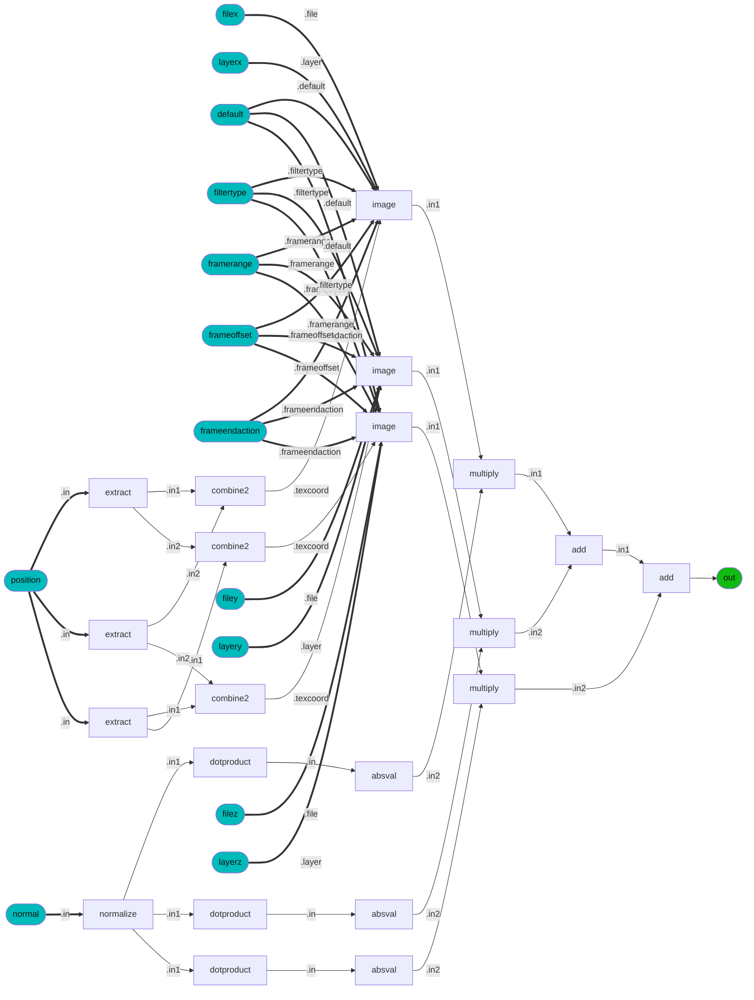

```mermaid
graph LR; 
    NG_triplanarprojection_vector2_N_add2_vector2[add] --> NG_triplanarprojection_vector2_out([out])
    style NG_triplanarprojection_vector2_out fill:#1b1, color:#111
    NG_triplanarprojection_vector2_N_add1_vector2[add] --".in1"--> NG_triplanarprojection_vector2_N_add2_vector2[add]
    NG_triplanarprojection_vector2_N_nX_vector2[multiply] --".in1"--> NG_triplanarprojection_vector2_N_add1_vector2[add]
    NG_triplanarprojection_vector2_N_imgX_vector2[image] --".in1"--> NG_triplanarprojection_vector2_N_nX_vector2[multiply]
    NG_triplanarprojection_vector2_filexINT([filex]) ==.file==> NG_triplanarprojection_vector2_N_imgX_vector2[image]
    style NG_triplanarprojection_vector2_filexINT fill:#0bb, color:#111
    NG_triplanarprojection_vector2_layerxINT([layerx]) ==.layer==> NG_triplanarprojection_vector2_N_imgX_vector2[image]
    style NG_triplanarprojection_vector2_layerxINT fill:#0bb, color:#111
    NG_triplanarprojection_vector2_dfaultINT([default]) ==.default==> NG_triplanarprojection_vector2_N_imgX_vector2[image]
    style NG_triplanarprojection_vector2_dfaultINT fill:#0bb, color:#111
    NG_triplanarprojection_vector2_filtertypeINT([filtertype]) ==.filtertype==> NG_triplanarprojection_vector2_N_imgX_vector2[image]
    style NG_triplanarprojection_vector2_filtertypeINT fill:#0bb, color:#111
    NG_triplanarprojection_vector2_framerangeINT([framerange]) ==.framerange==> NG_triplanarprojection_vector2_N_imgX_vector2[image]
    style NG_triplanarprojection_vector2_framerangeINT fill:#0bb, color:#111
    NG_triplanarprojection_vector2_frameoffsetINT([frameoffset]) ==.frameoffset==> NG_triplanarprojection_vector2_N_imgX_vector2[image]
    style NG_triplanarprojection_vector2_frameoffsetINT fill:#0bb, color:#111
    NG_triplanarprojection_vector2_frameendactionINT([frameendaction]) ==.frameendaction==> NG_triplanarprojection_vector2_N_imgX_vector2[image]
    style NG_triplanarprojection_vector2_frameendactionINT fill:#0bb, color:#111
    NG_triplanarprojection_vector2_N_vecYZ_vector2[combine2] --".texcoord"--> NG_triplanarprojection_vector2_N_imgX_vector2[image]
    NG_triplanarprojection_vector2_N_extY_vector2[extract] --".in1"--> NG_triplanarprojection_vector2_N_vecYZ_vector2[combine2]
    NG_triplanarprojection_vector2_positionINT([position]) ==.in==> NG_triplanarprojection_vector2_N_extY_vector2[extract]
    style NG_triplanarprojection_vector2_positionINT fill:#0bb, color:#111
    NG_triplanarprojection_vector2_N_extZ_vector2[extract] --".in2"--> NG_triplanarprojection_vector2_N_vecYZ_vector2[combine2]
    NG_triplanarprojection_vector2_positionINT([position]) ==.in==> NG_triplanarprojection_vector2_N_extZ_vector2[extract]
    style NG_triplanarprojection_vector2_positionINT fill:#0bb, color:#111
    NG_triplanarprojection_vector2_N_blendX_vector2[absval] --".in2"--> NG_triplanarprojection_vector2_N_nX_vector2[multiply]
    NG_triplanarprojection_vector2_N_dotX_vector2[dotproduct] --".in"--> NG_triplanarprojection_vector2_N_blendX_vector2[absval]
    NG_triplanarprojection_vector2_N_norm_vector2[normalize] --".in1"--> NG_triplanarprojection_vector2_N_dotX_vector2[dotproduct]
    NG_triplanarprojection_vector2_normalINT([normal]) ==.in==> NG_triplanarprojection_vector2_N_norm_vector2[normalize]
    style NG_triplanarprojection_vector2_normalINT fill:#0bb, color:#111
    NG_triplanarprojection_vector2_N_nY_vector2[multiply] --".in2"--> NG_triplanarprojection_vector2_N_add1_vector2[add]
    NG_triplanarprojection_vector2_N_imgY_vector2[image] --".in1"--> NG_triplanarprojection_vector2_N_nY_vector2[multiply]
    NG_triplanarprojection_vector2_fileyINT([filey]) ==.file==> NG_triplanarprojection_vector2_N_imgY_vector2[image]
    style NG_triplanarprojection_vector2_fileyINT fill:#0bb, color:#111
    NG_triplanarprojection_vector2_layeryINT([layery]) ==.layer==> NG_triplanarprojection_vector2_N_imgY_vector2[image]
    style NG_triplanarprojection_vector2_layeryINT fill:#0bb, color:#111
    NG_triplanarprojection_vector2_dfaultINT([default]) ==.default==> NG_triplanarprojection_vector2_N_imgY_vector2[image]
    style NG_triplanarprojection_vector2_dfaultINT fill:#0bb, color:#111
    NG_triplanarprojection_vector2_filtertypeINT([filtertype]) ==.filtertype==> NG_triplanarprojection_vector2_N_imgY_vector2[image]
    style NG_triplanarprojection_vector2_filtertypeINT fill:#0bb, color:#111
    NG_triplanarprojection_vector2_framerangeINT([framerange]) ==.framerange==> NG_triplanarprojection_vector2_N_imgY_vector2[image]
    style NG_triplanarprojection_vector2_framerangeINT fill:#0bb, color:#111
    NG_triplanarprojection_vector2_frameoffsetINT([frameoffset]) ==.frameoffset==> NG_triplanarprojection_vector2_N_imgY_vector2[image]
    style NG_triplanarprojection_vector2_frameoffsetINT fill:#0bb, color:#111
    NG_triplanarprojection_vector2_frameendactionINT([frameendaction]) ==.frameendaction==> NG_triplanarprojection_vector2_N_imgY_vector2[image]
    style NG_triplanarprojection_vector2_frameendactionINT fill:#0bb, color:#111
    NG_triplanarprojection_vector2_N_vecXZ_vector2[combine2] --".texcoord"--> NG_triplanarprojection_vector2_N_imgY_vector2[image]
    NG_triplanarprojection_vector2_N_extX_vector2[extract] --".in1"--> NG_triplanarprojection_vector2_N_vecXZ_vector2[combine2]
    NG_triplanarprojection_vector2_positionINT([position]) ==.in==> NG_triplanarprojection_vector2_N_extX_vector2[extract]
    style NG_triplanarprojection_vector2_positionINT fill:#0bb, color:#111
    NG_triplanarprojection_vector2_N_extZ_vector2[extract] --".in2"--> NG_triplanarprojection_vector2_N_vecXZ_vector2[combine2]
    NG_triplanarprojection_vector2_N_blendY_vector2[absval] --".in2"--> NG_triplanarprojection_vector2_N_nY_vector2[multiply]
    NG_triplanarprojection_vector2_N_dotY_vector2[dotproduct] --".in"--> NG_triplanarprojection_vector2_N_blendY_vector2[absval]
    NG_triplanarprojection_vector2_N_norm_vector2[normalize] --".in1"--> NG_triplanarprojection_vector2_N_dotY_vector2[dotproduct]
    NG_triplanarprojection_vector2_N_nZ_vector2[multiply] --".in2"--> NG_triplanarprojection_vector2_N_add2_vector2[add]
    NG_triplanarprojection_vector2_N_imgZ_vector2[image] --".in1"--> NG_triplanarprojection_vector2_N_nZ_vector2[multiply]
    NG_triplanarprojection_vector2_filezINT([filez]) ==.file==> NG_triplanarprojection_vector2_N_imgZ_vector2[image]
    style NG_triplanarprojection_vector2_filezINT fill:#0bb, color:#111
    NG_triplanarprojection_vector2_layerzINT([layerz]) ==.layer==> NG_triplanarprojection_vector2_N_imgZ_vector2[image]
    style NG_triplanarprojection_vector2_layerzINT fill:#0bb, color:#111
    NG_triplanarprojection_vector2_dfaultINT([default]) ==.default==> NG_triplanarprojection_vector2_N_imgZ_vector2[image]
    style NG_triplanarprojection_vector2_dfaultINT fill:#0bb, color:#111
    NG_triplanarprojection_vector2_filtertypeINT([filtertype]) ==.filtertype==> NG_triplanarprojection_vector2_N_imgZ_vector2[image]
    style NG_triplanarprojection_vector2_filtertypeINT fill:#0bb, color:#111
    NG_triplanarprojection_vector2_framerangeINT([framerange]) ==.framerange==> NG_triplanarprojection_vector2_N_imgZ_vector2[image]
    style NG_triplanarprojection_vector2_framerangeINT fill:#0bb, color:#111
    NG_triplanarprojection_vector2_frameoffsetINT([frameoffset]) ==.frameoffset==> NG_triplanarprojection_vector2_N_imgZ_vector2[image]
    style NG_triplanarprojection_vector2_frameoffsetINT fill:#0bb, color:#111
    NG_triplanarprojection_vector2_frameendactionINT([frameendaction]) ==.frameendaction==> NG_triplanarprojection_vector2_N_imgZ_vector2[image]
    style NG_triplanarprojection_vector2_frameendactionINT fill:#0bb, color:#111
    NG_triplanarprojection_vector2_N_vecXY_vector2[combine2] --".texcoord"--> NG_triplanarprojection_vector2_N_imgZ_vector2[image]
    NG_triplanarprojection_vector2_N_extX_vector2[extract] --".in1"--> NG_triplanarprojection_vector2_N_vecXY_vector2[combine2]
    NG_triplanarprojection_vector2_N_extY_vector2[extract] --".in2"--> NG_triplanarprojection_vector2_N_vecXY_vector2[combine2]
    NG_triplanarprojection_vector2_N_blendZ_vector2[absval] --".in2"--> NG_triplanarprojection_vector2_N_nZ_vector2[multiply]
    NG_triplanarprojection_vector2_N_dotZ_vector2[dotproduct] --".in"--> NG_triplanarprojection_vector2_N_blendZ_vector2[absval]
    NG_triplanarprojection_vector2_N_norm_vector2[normalize] --".in1"--> NG_triplanarprojection_vector2_N_dotZ_vector2[dotproduct]
```
