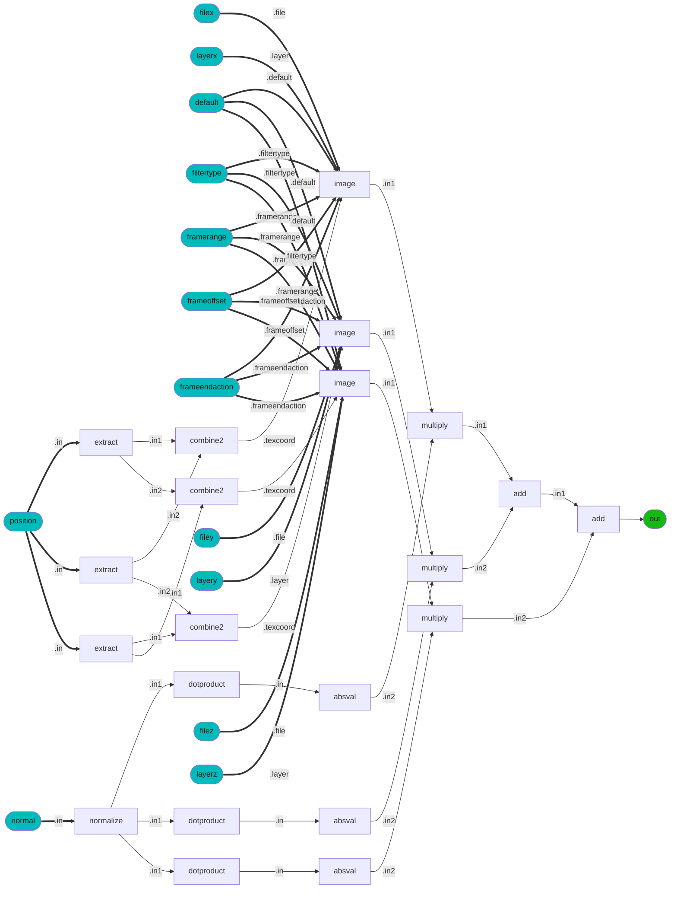

```mermaid
graph LR; 
    NG_triplanarprojection_vector3_N_add2_vector3[add] --> NG_triplanarprojection_vector3_out([out])
    style NG_triplanarprojection_vector3_out fill:#1b1, color:#111
    NG_triplanarprojection_vector3_N_add1_vector3[add] --".in1"--> NG_triplanarprojection_vector3_N_add2_vector3[add]
    NG_triplanarprojection_vector3_N_nX_vector3[multiply] --".in1"--> NG_triplanarprojection_vector3_N_add1_vector3[add]
    NG_triplanarprojection_vector3_N_imgX_vector3[image] --".in1"--> NG_triplanarprojection_vector3_N_nX_vector3[multiply]
    NG_triplanarprojection_vector3_filexINT([filex]) ==.file==> NG_triplanarprojection_vector3_N_imgX_vector3[image]
    style NG_triplanarprojection_vector3_filexINT fill:#0bb, color:#111
    NG_triplanarprojection_vector3_layerxINT([layerx]) ==.layer==> NG_triplanarprojection_vector3_N_imgX_vector3[image]
    style NG_triplanarprojection_vector3_layerxINT fill:#0bb, color:#111
    NG_triplanarprojection_vector3_dfaultINT([default]) ==.default==> NG_triplanarprojection_vector3_N_imgX_vector3[image]
    style NG_triplanarprojection_vector3_dfaultINT fill:#0bb, color:#111
    NG_triplanarprojection_vector3_filtertypeINT([filtertype]) ==.filtertype==> NG_triplanarprojection_vector3_N_imgX_vector3[image]
    style NG_triplanarprojection_vector3_filtertypeINT fill:#0bb, color:#111
    NG_triplanarprojection_vector3_framerangeINT([framerange]) ==.framerange==> NG_triplanarprojection_vector3_N_imgX_vector3[image]
    style NG_triplanarprojection_vector3_framerangeINT fill:#0bb, color:#111
    NG_triplanarprojection_vector3_frameoffsetINT([frameoffset]) ==.frameoffset==> NG_triplanarprojection_vector3_N_imgX_vector3[image]
    style NG_triplanarprojection_vector3_frameoffsetINT fill:#0bb, color:#111
    NG_triplanarprojection_vector3_frameendactionINT([frameendaction]) ==.frameendaction==> NG_triplanarprojection_vector3_N_imgX_vector3[image]
    style NG_triplanarprojection_vector3_frameendactionINT fill:#0bb, color:#111
    NG_triplanarprojection_vector3_N_vecYZ_vector3[combine2] --".texcoord"--> NG_triplanarprojection_vector3_N_imgX_vector3[image]
    NG_triplanarprojection_vector3_N_extY_vector3[extract] --".in1"--> NG_triplanarprojection_vector3_N_vecYZ_vector3[combine2]
    NG_triplanarprojection_vector3_positionINT([position]) ==.in==> NG_triplanarprojection_vector3_N_extY_vector3[extract]
    style NG_triplanarprojection_vector3_positionINT fill:#0bb, color:#111
    NG_triplanarprojection_vector3_N_extZ_vector3[extract] --".in2"--> NG_triplanarprojection_vector3_N_vecYZ_vector3[combine2]
    NG_triplanarprojection_vector3_positionINT([position]) ==.in==> NG_triplanarprojection_vector3_N_extZ_vector3[extract]
    style NG_triplanarprojection_vector3_positionINT fill:#0bb, color:#111
    NG_triplanarprojection_vector3_N_blendX_vector3[absval] --".in2"--> NG_triplanarprojection_vector3_N_nX_vector3[multiply]
    NG_triplanarprojection_vector3_N_dotX_vector3[dotproduct] --".in"--> NG_triplanarprojection_vector3_N_blendX_vector3[absval]
    NG_triplanarprojection_vector3_N_norm_vector3[normalize] --".in1"--> NG_triplanarprojection_vector3_N_dotX_vector3[dotproduct]
    NG_triplanarprojection_vector3_normalINT([normal]) ==.in==> NG_triplanarprojection_vector3_N_norm_vector3[normalize]
    style NG_triplanarprojection_vector3_normalINT fill:#0bb, color:#111
    NG_triplanarprojection_vector3_N_nY_vector3[multiply] --".in2"--> NG_triplanarprojection_vector3_N_add1_vector3[add]
    NG_triplanarprojection_vector3_N_imgY_vector3[image] --".in1"--> NG_triplanarprojection_vector3_N_nY_vector3[multiply]
    NG_triplanarprojection_vector3_fileyINT([filey]) ==.file==> NG_triplanarprojection_vector3_N_imgY_vector3[image]
    style NG_triplanarprojection_vector3_fileyINT fill:#0bb, color:#111
    NG_triplanarprojection_vector3_layeryINT([layery]) ==.layer==> NG_triplanarprojection_vector3_N_imgY_vector3[image]
    style NG_triplanarprojection_vector3_layeryINT fill:#0bb, color:#111
    NG_triplanarprojection_vector3_dfaultINT([default]) ==.default==> NG_triplanarprojection_vector3_N_imgY_vector3[image]
    style NG_triplanarprojection_vector3_dfaultINT fill:#0bb, color:#111
    NG_triplanarprojection_vector3_filtertypeINT([filtertype]) ==.filtertype==> NG_triplanarprojection_vector3_N_imgY_vector3[image]
    style NG_triplanarprojection_vector3_filtertypeINT fill:#0bb, color:#111
    NG_triplanarprojection_vector3_framerangeINT([framerange]) ==.framerange==> NG_triplanarprojection_vector3_N_imgY_vector3[image]
    style NG_triplanarprojection_vector3_framerangeINT fill:#0bb, color:#111
    NG_triplanarprojection_vector3_frameoffsetINT([frameoffset]) ==.frameoffset==> NG_triplanarprojection_vector3_N_imgY_vector3[image]
    style NG_triplanarprojection_vector3_frameoffsetINT fill:#0bb, color:#111
    NG_triplanarprojection_vector3_frameendactionINT([frameendaction]) ==.frameendaction==> NG_triplanarprojection_vector3_N_imgY_vector3[image]
    style NG_triplanarprojection_vector3_frameendactionINT fill:#0bb, color:#111
    NG_triplanarprojection_vector3_N_vecXZ_vector3[combine2] --".texcoord"--> NG_triplanarprojection_vector3_N_imgY_vector3[image]
    NG_triplanarprojection_vector3_N_extX_vector3[extract] --".in1"--> NG_triplanarprojection_vector3_N_vecXZ_vector3[combine2]
    NG_triplanarprojection_vector3_positionINT([position]) ==.in==> NG_triplanarprojection_vector3_N_extX_vector3[extract]
    style NG_triplanarprojection_vector3_positionINT fill:#0bb, color:#111
    NG_triplanarprojection_vector3_N_extZ_vector3[extract] --".in2"--> NG_triplanarprojection_vector3_N_vecXZ_vector3[combine2]
    NG_triplanarprojection_vector3_N_blendY_vector3[absval] --".in2"--> NG_triplanarprojection_vector3_N_nY_vector3[multiply]
    NG_triplanarprojection_vector3_N_dotY_vector3[dotproduct] --".in"--> NG_triplanarprojection_vector3_N_blendY_vector3[absval]
    NG_triplanarprojection_vector3_N_norm_vector3[normalize] --".in1"--> NG_triplanarprojection_vector3_N_dotY_vector3[dotproduct]
    NG_triplanarprojection_vector3_N_nZ_vector3[multiply] --".in2"--> NG_triplanarprojection_vector3_N_add2_vector3[add]
    NG_triplanarprojection_vector3_N_imgZ_vector3[image] --".in1"--> NG_triplanarprojection_vector3_N_nZ_vector3[multiply]
    NG_triplanarprojection_vector3_filezINT([filez]) ==.file==> NG_triplanarprojection_vector3_N_imgZ_vector3[image]
    style NG_triplanarprojection_vector3_filezINT fill:#0bb, color:#111
    NG_triplanarprojection_vector3_layerzINT([layerz]) ==.layer==> NG_triplanarprojection_vector3_N_imgZ_vector3[image]
    style NG_triplanarprojection_vector3_layerzINT fill:#0bb, color:#111
    NG_triplanarprojection_vector3_dfaultINT([default]) ==.default==> NG_triplanarprojection_vector3_N_imgZ_vector3[image]
    style NG_triplanarprojection_vector3_dfaultINT fill:#0bb, color:#111
    NG_triplanarprojection_vector3_filtertypeINT([filtertype]) ==.filtertype==> NG_triplanarprojection_vector3_N_imgZ_vector3[image]
    style NG_triplanarprojection_vector3_filtertypeINT fill:#0bb, color:#111
    NG_triplanarprojection_vector3_framerangeINT([framerange]) ==.framerange==> NG_triplanarprojection_vector3_N_imgZ_vector3[image]
    style NG_triplanarprojection_vector3_framerangeINT fill:#0bb, color:#111
    NG_triplanarprojection_vector3_frameoffsetINT([frameoffset]) ==.frameoffset==> NG_triplanarprojection_vector3_N_imgZ_vector3[image]
    style NG_triplanarprojection_vector3_frameoffsetINT fill:#0bb, color:#111
    NG_triplanarprojection_vector3_frameendactionINT([frameendaction]) ==.frameendaction==> NG_triplanarprojection_vector3_N_imgZ_vector3[image]
    style NG_triplanarprojection_vector3_frameendactionINT fill:#0bb, color:#111
    NG_triplanarprojection_vector3_N_vecXY_vector3[combine2] --".texcoord"--> NG_triplanarprojection_vector3_N_imgZ_vector3[image]
    NG_triplanarprojection_vector3_N_extX_vector3[extract] --".in1"--> NG_triplanarprojection_vector3_N_vecXY_vector3[combine2]
    NG_triplanarprojection_vector3_N_extY_vector3[extract] --".in2"--> NG_triplanarprojection_vector3_N_vecXY_vector3[combine2]
    NG_triplanarprojection_vector3_N_blendZ_vector3[absval] --".in2"--> NG_triplanarprojection_vector3_N_nZ_vector3[multiply]
    NG_triplanarprojection_vector3_N_dotZ_vector3[dotproduct] --".in"--> NG_triplanarprojection_vector3_N_blendZ_vector3[absval]
    NG_triplanarprojection_vector3_N_norm_vector3[normalize] --".in1"--> NG_triplanarprojection_vector3_N_dotZ_vector3[dotproduct]
```
