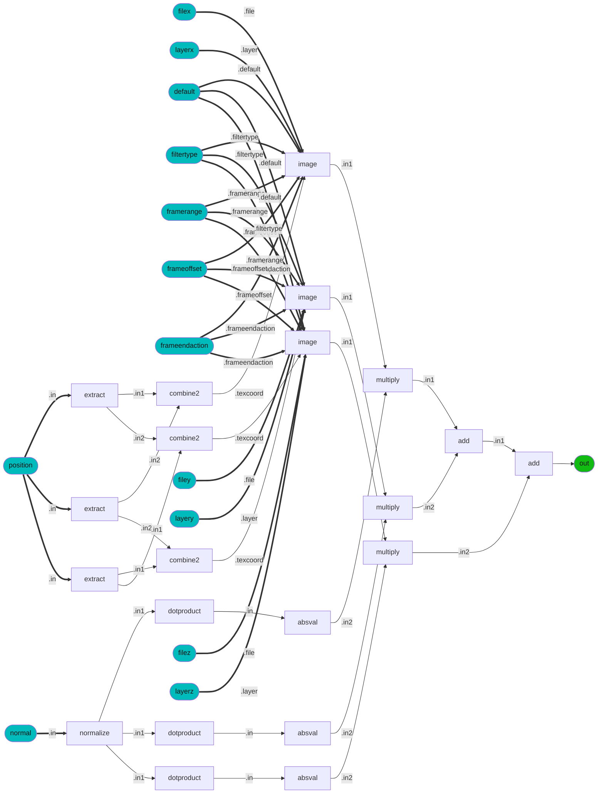

```mermaid
graph LR; 
    NG_triplanarprojection_vector4_N_add2_vector4[add] --> NG_triplanarprojection_vector4_out([out])
    style NG_triplanarprojection_vector4_out fill:#1b1, color:#111
    NG_triplanarprojection_vector4_N_add1_vector4[add] --".in1"--> NG_triplanarprojection_vector4_N_add2_vector4[add]
    NG_triplanarprojection_vector4_N_nX_vector4[multiply] --".in1"--> NG_triplanarprojection_vector4_N_add1_vector4[add]
    NG_triplanarprojection_vector4_N_imgX_vector4[image] --".in1"--> NG_triplanarprojection_vector4_N_nX_vector4[multiply]
    NG_triplanarprojection_vector4_filexINT([filex]) ==.file==> NG_triplanarprojection_vector4_N_imgX_vector4[image]
    style NG_triplanarprojection_vector4_filexINT fill:#0bb, color:#111
    NG_triplanarprojection_vector4_layerxINT([layerx]) ==.layer==> NG_triplanarprojection_vector4_N_imgX_vector4[image]
    style NG_triplanarprojection_vector4_layerxINT fill:#0bb, color:#111
    NG_triplanarprojection_vector4_dfaultINT([default]) ==.default==> NG_triplanarprojection_vector4_N_imgX_vector4[image]
    style NG_triplanarprojection_vector4_dfaultINT fill:#0bb, color:#111
    NG_triplanarprojection_vector4_filtertypeINT([filtertype]) ==.filtertype==> NG_triplanarprojection_vector4_N_imgX_vector4[image]
    style NG_triplanarprojection_vector4_filtertypeINT fill:#0bb, color:#111
    NG_triplanarprojection_vector4_framerangeINT([framerange]) ==.framerange==> NG_triplanarprojection_vector4_N_imgX_vector4[image]
    style NG_triplanarprojection_vector4_framerangeINT fill:#0bb, color:#111
    NG_triplanarprojection_vector4_frameoffsetINT([frameoffset]) ==.frameoffset==> NG_triplanarprojection_vector4_N_imgX_vector4[image]
    style NG_triplanarprojection_vector4_frameoffsetINT fill:#0bb, color:#111
    NG_triplanarprojection_vector4_frameendactionINT([frameendaction]) ==.frameendaction==> NG_triplanarprojection_vector4_N_imgX_vector4[image]
    style NG_triplanarprojection_vector4_frameendactionINT fill:#0bb, color:#111
    NG_triplanarprojection_vector4_N_vecYZ_vector4[combine2] --".texcoord"--> NG_triplanarprojection_vector4_N_imgX_vector4[image]
    NG_triplanarprojection_vector4_N_extY_vector4[extract] --".in1"--> NG_triplanarprojection_vector4_N_vecYZ_vector4[combine2]
    NG_triplanarprojection_vector4_positionINT([position]) ==.in==> NG_triplanarprojection_vector4_N_extY_vector4[extract]
    style NG_triplanarprojection_vector4_positionINT fill:#0bb, color:#111
    NG_triplanarprojection_vector4_N_extZ_vector4[extract] --".in2"--> NG_triplanarprojection_vector4_N_vecYZ_vector4[combine2]
    NG_triplanarprojection_vector4_positionINT([position]) ==.in==> NG_triplanarprojection_vector4_N_extZ_vector4[extract]
    style NG_triplanarprojection_vector4_positionINT fill:#0bb, color:#111
    NG_triplanarprojection_vector4_N_blendX_vector4[absval] --".in2"--> NG_triplanarprojection_vector4_N_nX_vector4[multiply]
    NG_triplanarprojection_vector4_N_dotX_vector4[dotproduct] --".in"--> NG_triplanarprojection_vector4_N_blendX_vector4[absval]
    NG_triplanarprojection_vector4_N_norm_vector4[normalize] --".in1"--> NG_triplanarprojection_vector4_N_dotX_vector4[dotproduct]
    NG_triplanarprojection_vector4_normalINT([normal]) ==.in==> NG_triplanarprojection_vector4_N_norm_vector4[normalize]
    style NG_triplanarprojection_vector4_normalINT fill:#0bb, color:#111
    NG_triplanarprojection_vector4_N_nY_vector4[multiply] --".in2"--> NG_triplanarprojection_vector4_N_add1_vector4[add]
    NG_triplanarprojection_vector4_N_imgY_vector4[image] --".in1"--> NG_triplanarprojection_vector4_N_nY_vector4[multiply]
    NG_triplanarprojection_vector4_fileyINT([filey]) ==.file==> NG_triplanarprojection_vector4_N_imgY_vector4[image]
    style NG_triplanarprojection_vector4_fileyINT fill:#0bb, color:#111
    NG_triplanarprojection_vector4_layeryINT([layery]) ==.layer==> NG_triplanarprojection_vector4_N_imgY_vector4[image]
    style NG_triplanarprojection_vector4_layeryINT fill:#0bb, color:#111
    NG_triplanarprojection_vector4_dfaultINT([default]) ==.default==> NG_triplanarprojection_vector4_N_imgY_vector4[image]
    style NG_triplanarprojection_vector4_dfaultINT fill:#0bb, color:#111
    NG_triplanarprojection_vector4_filtertypeINT([filtertype]) ==.filtertype==> NG_triplanarprojection_vector4_N_imgY_vector4[image]
    style NG_triplanarprojection_vector4_filtertypeINT fill:#0bb, color:#111
    NG_triplanarprojection_vector4_framerangeINT([framerange]) ==.framerange==> NG_triplanarprojection_vector4_N_imgY_vector4[image]
    style NG_triplanarprojection_vector4_framerangeINT fill:#0bb, color:#111
    NG_triplanarprojection_vector4_frameoffsetINT([frameoffset]) ==.frameoffset==> NG_triplanarprojection_vector4_N_imgY_vector4[image]
    style NG_triplanarprojection_vector4_frameoffsetINT fill:#0bb, color:#111
    NG_triplanarprojection_vector4_frameendactionINT([frameendaction]) ==.frameendaction==> NG_triplanarprojection_vector4_N_imgY_vector4[image]
    style NG_triplanarprojection_vector4_frameendactionINT fill:#0bb, color:#111
    NG_triplanarprojection_vector4_N_vecXZ_vector4[combine2] --".texcoord"--> NG_triplanarprojection_vector4_N_imgY_vector4[image]
    NG_triplanarprojection_vector4_N_extX_vector4[extract] --".in1"--> NG_triplanarprojection_vector4_N_vecXZ_vector4[combine2]
    NG_triplanarprojection_vector4_positionINT([position]) ==.in==> NG_triplanarprojection_vector4_N_extX_vector4[extract]
    style NG_triplanarprojection_vector4_positionINT fill:#0bb, color:#111
    NG_triplanarprojection_vector4_N_extZ_vector4[extract] --".in2"--> NG_triplanarprojection_vector4_N_vecXZ_vector4[combine2]
    NG_triplanarprojection_vector4_N_blendY_vector4[absval] --".in2"--> NG_triplanarprojection_vector4_N_nY_vector4[multiply]
    NG_triplanarprojection_vector4_N_dotY_vector4[dotproduct] --".in"--> NG_triplanarprojection_vector4_N_blendY_vector4[absval]
    NG_triplanarprojection_vector4_N_norm_vector4[normalize] --".in1"--> NG_triplanarprojection_vector4_N_dotY_vector4[dotproduct]
    NG_triplanarprojection_vector4_N_nZ_vector4[multiply] --".in2"--> NG_triplanarprojection_vector4_N_add2_vector4[add]
    NG_triplanarprojection_vector4_N_imgZ_vector4[image] --".in1"--> NG_triplanarprojection_vector4_N_nZ_vector4[multiply]
    NG_triplanarprojection_vector4_filezINT([filez]) ==.file==> NG_triplanarprojection_vector4_N_imgZ_vector4[image]
    style NG_triplanarprojection_vector4_filezINT fill:#0bb, color:#111
    NG_triplanarprojection_vector4_layerzINT([layerz]) ==.layer==> NG_triplanarprojection_vector4_N_imgZ_vector4[image]
    style NG_triplanarprojection_vector4_layerzINT fill:#0bb, color:#111
    NG_triplanarprojection_vector4_dfaultINT([default]) ==.default==> NG_triplanarprojection_vector4_N_imgZ_vector4[image]
    style NG_triplanarprojection_vector4_dfaultINT fill:#0bb, color:#111
    NG_triplanarprojection_vector4_filtertypeINT([filtertype]) ==.filtertype==> NG_triplanarprojection_vector4_N_imgZ_vector4[image]
    style NG_triplanarprojection_vector4_filtertypeINT fill:#0bb, color:#111
    NG_triplanarprojection_vector4_framerangeINT([framerange]) ==.framerange==> NG_triplanarprojection_vector4_N_imgZ_vector4[image]
    style NG_triplanarprojection_vector4_framerangeINT fill:#0bb, color:#111
    NG_triplanarprojection_vector4_frameoffsetINT([frameoffset]) ==.frameoffset==> NG_triplanarprojection_vector4_N_imgZ_vector4[image]
    style NG_triplanarprojection_vector4_frameoffsetINT fill:#0bb, color:#111
    NG_triplanarprojection_vector4_frameendactionINT([frameendaction]) ==.frameendaction==> NG_triplanarprojection_vector4_N_imgZ_vector4[image]
    style NG_triplanarprojection_vector4_frameendactionINT fill:#0bb, color:#111
    NG_triplanarprojection_vector4_N_vecXY_vector4[combine2] --".texcoord"--> NG_triplanarprojection_vector4_N_imgZ_vector4[image]
    NG_triplanarprojection_vector4_N_extX_vector4[extract] --".in1"--> NG_triplanarprojection_vector4_N_vecXY_vector4[combine2]
    NG_triplanarprojection_vector4_N_extY_vector4[extract] --".in2"--> NG_triplanarprojection_vector4_N_vecXY_vector4[combine2]
    NG_triplanarprojection_vector4_N_blendZ_vector4[absval] --".in2"--> NG_triplanarprojection_vector4_N_nZ_vector4[multiply]
    NG_triplanarprojection_vector4_N_dotZ_vector4[dotproduct] --".in"--> NG_triplanarprojection_vector4_N_blendZ_vector4[absval]
    NG_triplanarprojection_vector4_N_norm_vector4[normalize] --".in1"--> NG_triplanarprojection_vector4_N_dotZ_vector4[dotproduct]
```
