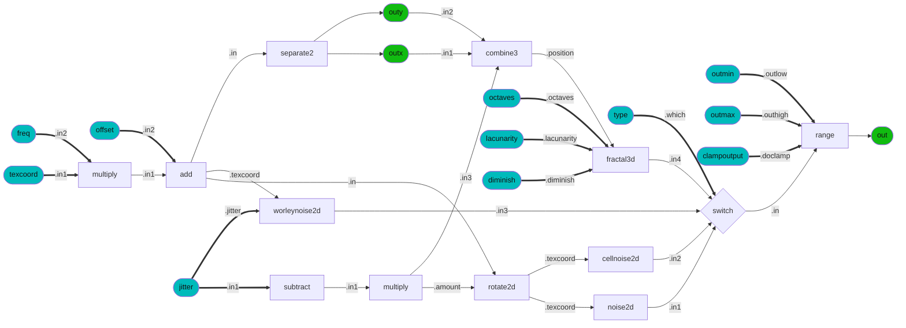

```mermaid
graph LR; 
    NG_unifiednoise2d_float_N_range[range] --> NG_unifiednoise2d_float_out([out])
    style NG_unifiednoise2d_float_out fill:#1b1, color:#111
    NG_unifiednoise2d_float_outminINT([outmin]) ==.outlow==> NG_unifiednoise2d_float_N_range[range]
    style NG_unifiednoise2d_float_outminINT fill:#0bb, color:#111
    NG_unifiednoise2d_float_outmaxINT([outmax]) ==.outhigh==> NG_unifiednoise2d_float_N_range[range]
    style NG_unifiednoise2d_float_outmaxINT fill:#0bb, color:#111
    NG_unifiednoise2d_float_clampoutputINT([clampoutput]) ==.doclamp==> NG_unifiednoise2d_float_N_range[range]
    style NG_unifiednoise2d_float_clampoutputINT fill:#0bb, color:#111
    NG_unifiednoise2d_float_N_switch_type{switch} --".in"--> NG_unifiednoise2d_float_N_range[range]
    NG_unifiednoise2d_float_typeINT([type]) ==.which==> NG_unifiednoise2d_float_N_switch_type[switch]
    style NG_unifiednoise2d_float_typeINT fill:#0bb, color:#111
    NG_unifiednoise2d_float_N_perlin_noise2d[noise2d] --".in1"--> NG_unifiednoise2d_float_N_switch_type{switch}
    NG_unifiednoise2d_float_N_apply_cell_jitter[rotate2d] --".texcoord"--> NG_unifiednoise2d_float_N_perlin_noise2d[noise2d]
    NG_unifiednoise2d_float_N_apply_offset[add] --".in"--> NG_unifiednoise2d_float_N_apply_cell_jitter[rotate2d]
    NG_unifiednoise2d_float_offsetINT([offset]) ==.in2==> NG_unifiednoise2d_float_N_apply_offset[add]
    style NG_unifiednoise2d_float_offsetINT fill:#0bb, color:#111
    NG_unifiednoise2d_float_N_apply_freq[multiply] --".in1"--> NG_unifiednoise2d_float_N_apply_offset[add]
    NG_unifiednoise2d_float_texcoordINT([texcoord]) ==.in1==> NG_unifiednoise2d_float_N_apply_freq[multiply]
    style NG_unifiednoise2d_float_texcoordINT fill:#0bb, color:#111
    NG_unifiednoise2d_float_freqINT([freq]) ==.in2==> NG_unifiednoise2d_float_N_apply_freq[multiply]
    style NG_unifiednoise2d_float_freqINT fill:#0bb, color:#111
    NG_unifiednoise2d_float_N_cell_jitter_mult[multiply] --".amount"--> NG_unifiednoise2d_float_N_apply_cell_jitter[rotate2d]
    NG_unifiednoise2d_float_N_jitter_minus_1[subtract] --".in1"--> NG_unifiednoise2d_float_N_cell_jitter_mult[multiply]
    NG_unifiednoise2d_float_jitterINT([jitter]) ==.in1==> NG_unifiednoise2d_float_N_jitter_minus_1[subtract]
    style NG_unifiednoise2d_float_jitterINT fill:#0bb, color:#111
    NG_unifiednoise2d_float_N_cellnoise2d[cellnoise2d] --".in2"--> NG_unifiednoise2d_float_N_switch_type{switch}
    NG_unifiednoise2d_float_N_apply_cell_jitter[rotate2d] --".texcoord"--> NG_unifiednoise2d_float_N_cellnoise2d[cellnoise2d]
    NG_unifiednoise2d_float_N_worleynoise2d[worleynoise2d] --".in3"--> NG_unifiednoise2d_float_N_switch_type{switch}
    NG_unifiednoise2d_float_jitterINT([jitter]) ==.jitter==> NG_unifiednoise2d_float_N_worleynoise2d[worleynoise2d]
    style NG_unifiednoise2d_float_jitterINT fill:#0bb, color:#111
    NG_unifiednoise2d_float_N_apply_offset[add] --".texcoord"--> NG_unifiednoise2d_float_N_worleynoise2d[worleynoise2d]
    NG_unifiednoise2d_float_N_fractal3d[fractal3d] --".in4"--> NG_unifiednoise2d_float_N_switch_type{switch}
    NG_unifiednoise2d_float_octavesINT([octaves]) ==.octaves==> NG_unifiednoise2d_float_N_fractal3d[fractal3d]
    style NG_unifiednoise2d_float_octavesINT fill:#0bb, color:#111
    NG_unifiednoise2d_float_lacunarityINT([lacunarity]) ==.lacunarity==> NG_unifiednoise2d_float_N_fractal3d[fractal3d]
    style NG_unifiednoise2d_float_lacunarityINT fill:#0bb, color:#111
    NG_unifiednoise2d_float_diminishINT([diminish]) ==.diminish==> NG_unifiednoise2d_float_N_fractal3d[fractal3d]
    style NG_unifiednoise2d_float_diminishINT fill:#0bb, color:#111
    NG_unifiednoise2d_float_N_combine_with_jitter[combine3] --".position"--> NG_unifiednoise2d_float_N_fractal3d[fractal3d]
    NG_unifiednoise2d_float_N_separate[separate2] --> NG_unifiednoise2d_float_NG_unifiednoise2d_float_N_separateoutx([outx])
    style NG_unifiednoise2d_float_NG_unifiednoise2d_float_N_separateoutx fill:#1b1, color:#111
    NG_unifiednoise2d_float_NG_unifiednoise2d_float_N_separateoutx --".in1"--> NG_unifiednoise2d_float_N_combine_with_jitter[combine3]
    NG_unifiednoise2d_float_N_apply_offset[add] --".in"--> NG_unifiednoise2d_float_N_separate[separate2]
    NG_unifiednoise2d_float_N_separate[separate2] --> NG_unifiednoise2d_float_NG_unifiednoise2d_float_N_separateouty([outy])
    style NG_unifiednoise2d_float_NG_unifiednoise2d_float_N_separateouty fill:#1b1, color:#111
    NG_unifiednoise2d_float_NG_unifiednoise2d_float_N_separateouty --".in2"--> NG_unifiednoise2d_float_N_combine_with_jitter[combine3]
    NG_unifiednoise2d_float_N_cell_jitter_mult[multiply] --".in3"--> NG_unifiednoise2d_float_N_combine_with_jitter[combine3]
```
