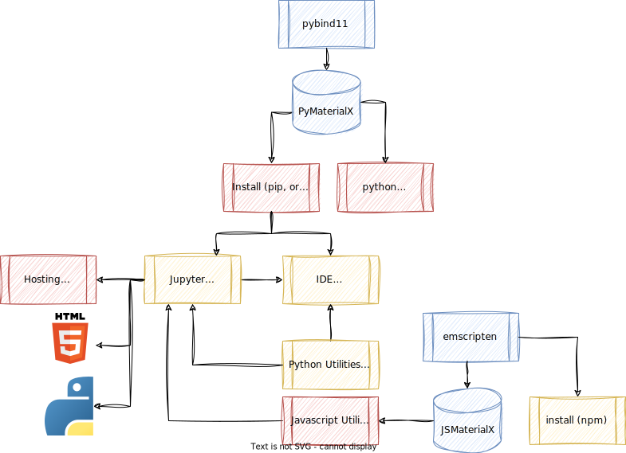

## 1. Introduction

Insight into how this site was generated is shown here to demonstrate
how a user can enhance documentation and learning workflows for
MaterialX by adding tools on top of MaterialX itself. The following
color coding is used in the diagrams provided:

-   Red: Items not available in core or not started yet
-   Orange: Items in progress
-   Blue: Items which are available as part of MaterialX core
-   Green: Items available as additional tools

Note that something like `Doxygen` was tried but not used as it was
not flexible enough to generated the customizations required of an
shader node library. One alternative was to generate actual C++ or
Python classes for node definitions and run Doxygen. This is a possible
project but is not being pursued at the current time.

## 2. Documentation Generation

### Overview

The following diagram outlines the setup for generating documentation
from MaterialX. The main utilities were written using the Python
wrappers for MaterialX:

-   **Diagram generation (`mxgraph`)**: This can produce Mermaid or
    GraphViz dot diagrams based on MaterialX input. The standard library
    graphs are generated this way, but any MaterialX graph can be used
    as input.

-   **Sampling graphs for rendering (`genMaterialsFromDefs`)**: All
    definitions in the MaterialX library had instance graphs created as
    separate MaterialX files. These were fed into \`test-render\` from
    the OSL core distribution and the built in GLSL renderer. Note that
    any renderer can be used.

-   **Documentation and indexing generation (`mxdoclib`)**: This
    extracted al data from the MaterialX definition libraries to
    generate all library pages. Both Markdown and HTML output is
    supported.

    Dependents such as `Bootstrap`, `Mermaid` and `Google Fonts`
    are automatically included.

These utilities are accessible from the "Tools" section of this site
and added to MaterialX core distribution.

\

### Web Utilities

A number of Javascript utilities were written to handle:

-   **Graph Rendering**: Additional Javascript logic is added as part of
    the generation process. Interactive Mermaid graph (svg) generation
    from text was added as the performance cost to generate all hundreds
    of graphs can slow down page load speed. It was additionally
    necessary to workaround a Bootstrap / Mermaid issue where graphs
    under hidden elements don`t render properly \-- in which case all
    tab sections on documentation pages require dynamic generation. The
    same logic is used for the `Graph Visualizer` utility.
-   **Graph Copying / Saving**: Graph text copying utilities were added
    to allow extraction of the mermaid text and for conversion from
    Mermaid text to SVG.

## 3. Learning Environment

### Overview

For API learning, the proposed setup is shown below. This initiative is
still under review but the intent will be to host interactive tutorials
using MaterialX via Jupyter notebooks. Native notebooks, as well as
generated HTML and Python versions are available for download. The
latter is for usage as non-interactive references which are accessible
under the "Examples" menu.

Local interactive sessions can run using these notebooks currently. with
the aim to host these remotely via something like `Google Colab`.

The hope is to connect with USD or other standards via Python.

A parallel track is possible with Javascript, with access to the Javascript API via npm.

