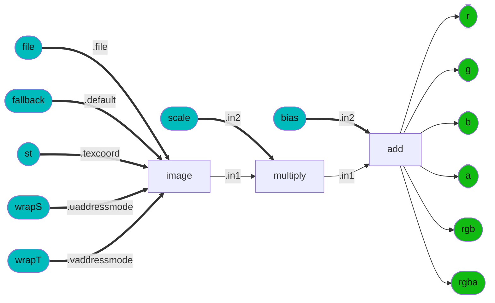
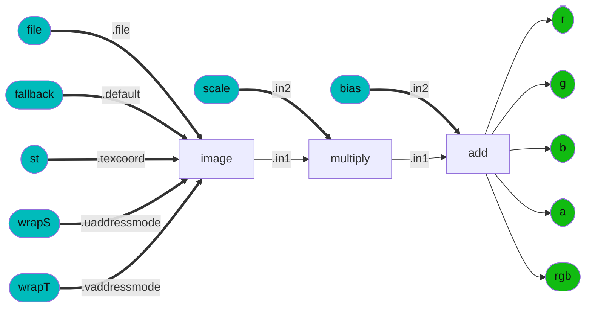
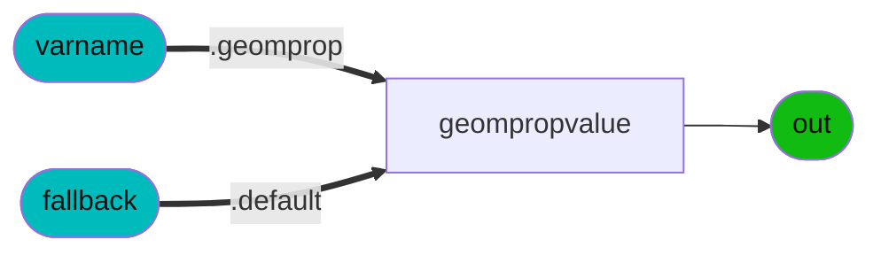
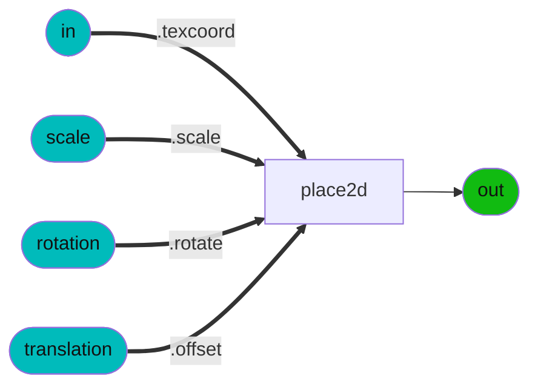
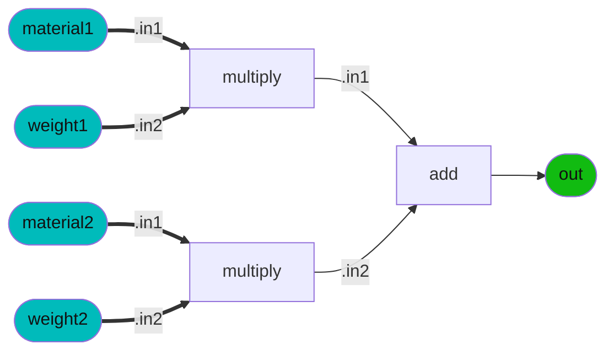

### Node Group: adjustment
* [colorcorrect](#colorcorrect) [contrast](#contrast) [curveadjust](#curveadjust) [hsvadjust](#hsvadjust) [hsvtorgb](#hsvtorgb) [luminance](#luminance) [range](#range) [remap](#remap) [rgbtohsv](#rgbtohsv) [saturate](#saturate) [smoothstep](#smoothstep) 
---------
### Node Group: application
* [frame](#frame) [time](#time) 
---------
### Node Group: channel
* [combine2](#combine2) [combine3](#combine3) [combine4](#combine4) [convert](#convert) [extract](#extract) [separate2](#separate2) [separate3](#separate3) [separate4](#separate4) [swizzle](#swizzle) 
---------
### Node Group: compositing
* [burn](#burn) [difference](#difference) [disjointover](#disjointover) [dodge](#dodge) [in](#in) [inside](#inside) [mask](#mask) [matte](#matte) [minus](#minus) [mix](#mix) [out](#out) [outside](#outside) [over](#over) [overlay](#overlay) [plus](#plus) [premult](#premult) [screen](#screen) [unpremult](#unpremult) 
---------
### Node Group: conditional
* [ifequal](#ifequal) [ifgreater](#ifgreater) [ifgreatereq](#ifgreatereq) [switch](#switch) 
---------
### Node Group: convolution2d
* [blur](#blur) [heighttonormal](#heighttonormal) 
---------
### Node Group: geometric
* [UsdPrimvarReader](#UsdPrimvarReader) [bitangent](#bitangent) [bump](#bump) [geomcolor](#geomcolor) [geompropvalue](#geompropvalue) [normal](#normal) [position](#position) [tangent](#tangent) [texcoord](#texcoord) 
---------
### Node Group: global
* [ambientocclusion](#ambientocclusion) 
---------
### Node Group: light
* [directional_light](#directional_light) [point_light](#point_light) [spot_light](#spot_light) 
---------
### Node Group: material
* [surfacematerial](#surfacematerial) [volumematerial](#volumematerial) 
---------
### Node Group: math
* [UsdTransform2d](#UsdTransform2d) [absval](#absval) [acos](#acos) [add](#add) [arrayappend](#arrayappend) [asin](#asin) [atan2](#atan2) [ceil](#ceil) [clamp](#clamp) [cos](#cos) [crossproduct](#crossproduct) [determinant](#determinant) [divide](#divide) [dotproduct](#dotproduct) [exp](#exp) [floor](#floor) [invert](#invert) [invertmatrix](#invertmatrix) [ln](#ln) [magnitude](#magnitude) [max](#max) [min](#min) [modulo](#modulo) [multiply](#multiply) [normalize](#normalize) [normalmap](#normalmap) [place2d](#place2d) [power](#power) [rotate2d](#rotate2d) [rotate3d](#rotate3d) [sign](#sign) [sin](#sin) [sqrt](#sqrt) [subtract](#subtract) [tan](#tan) [transformmatrix](#transformmatrix) [transformnormal](#transformnormal) [transformpoint](#transformpoint) [transformvector](#transformvector) [transpose](#transpose) 
---------
### Node Group: organization
* [dot](#dot) 
---------
### Node Group: pbr
* [LamaAdd](#LamaAdd) [LamaConductor](#LamaConductor) [LamaDielectric](#LamaDielectric) [LamaDiffuse](#LamaDiffuse) [LamaEmission](#LamaEmission) [LamaLayer](#LamaLayer) [LamaMix](#LamaMix) [LamaSSS](#LamaSSS) [LamaSheen](#LamaSheen) [LamaTranslucent](#LamaTranslucent) [UsdPreviewSurface](#UsdPreviewSurface) [absorption_vdf](#absorption_vdf) [add](#add) [anisotropic_vdf](#anisotropic_vdf) [artistic_ior](#artistic_ior) [blackbody](#blackbody) [burley_diffuse_bsdf](#burley_diffuse_bsdf) [conductor_bsdf](#conductor_bsdf) [conical_edf](#conical_edf) [dielectric_bsdf](#dielectric_bsdf) [disney_brdf_2012](#disney_brdf_2012) [disney_bsdf_2015](#disney_bsdf_2015) [displacement](#displacement) [generalized_schlick_bsdf](#generalized_schlick_bsdf) [glossiness_anisotropy](#glossiness_anisotropy) [gltf_pbr](#gltf_pbr) [layer](#layer) [light](#light) [measured_edf](#measured_edf) [mix](#mix) [multiply](#multiply) [oren_nayar_diffuse_bsdf](#oren_nayar_diffuse_bsdf) [roughness_anisotropy](#roughness_anisotropy) [roughness_dual](#roughness_dual) [sheen_bsdf](#sheen_bsdf) [standard_surface](#standard_surface) [subsurface_bsdf](#subsurface_bsdf) [surface](#surface) [thin_film_bsdf](#thin_film_bsdf) [thin_surface](#thin_surface) [translucent_bsdf](#translucent_bsdf) [uniform_edf](#uniform_edf) [volume](#volume) 
---------
### Node Group: procedural
* [constant](#constant) 
---------
### Node Group: procedural2d
* [cellnoise2d](#cellnoise2d) [noise2d](#noise2d) [ramp4](#ramp4) [ramplr](#ramplr) [ramptb](#ramptb) [splitlr](#splitlr) [splittb](#splittb) [unifiednoise2d](#unifiednoise2d) [worleynoise2d](#worleynoise2d) 
---------
### Node Group: procedural3d
* [cellnoise3d](#cellnoise3d) [fractal3d](#fractal3d) [noise3d](#noise3d) [unifiednoise3d](#unifiednoise3d) [worleynoise3d](#worleynoise3d) 
---------
### Node Group: shader
* [surface_unlit](#surface_unlit) 
---------
### Node Group: texture2d
* [UsdUVTexture](#UsdUVTexture) [gltf_colorimage](#gltf_colorimage) [gltf_image](#gltf_image) [gltf_iridescence_thickness](#gltf_iridescence_thickness) [gltf_normalmap](#gltf_normalmap) [image](#image) [tiledimage](#tiledimage) 
---------
### Node Group: texture3d
* [triplanarprojection](#triplanarprojection) 
---------
### Node Group: undefined
* [LamaMix](#LamaMix) [standard_surface_to_UsdPreviewSurface](#standard_surface_to_UsdPreviewSurface) [standard_surface_to_gltf_pbr](#standard_surface_to_gltf_pbr) 
---------
 
### Node: *disney_brdf_2012*
<details><summary>ND_disney_brdf_2012_surface</summary>
<p>
 
* *Nodedef*: ND_disney_brdf_2012_surface
* *Type*: surfaceshader
* *Node Group*: pbr
* *Version*: 1.0. Is default: False
* *Doc*: UNDOCUMENTED
* *Implementation*: Non-graph
 

| Name | Type | Default Value | UI name | UI min | UI max | UI Soft Min | UI Soft Max | UI step | UI group | UI Advanced | Doc | Uniform |
| ---- | ---- | ---- | ---- | ---- | ---- | ---- | ---- | ---- | ---- | ---- | ---- | ---- |
| **baseColor** | color3 | 0.16, 0.16, 0.16 |  |  |  |  |  |  |  |  |  |  |
| **metallic** | float | 0.0 |  |  |  |  |  |  |  |  |  |  |
| **subsurface** | float | 0.0 |  |  |  |  |  |  |  |  |  |  |
| **specular** | float | 0.5 |  |  |  |  |  |  |  |  |  |  |
| **roughness** | float | 0.5 |  |  |  |  |  |  |  |  |  |  |
| **specularTint** | float | 0.0 |  |  |  |  |  |  |  |  |  |  |
| **anisotropic** | float | 0.0 |  |  |  |  |  |  |  |  |  |  |
| **sheen** | float | 0.0 |  |  |  |  |  |  |  |  |  |  |
| **sheenTint** | float | 0.5 |  |  |  |  |  |  |  |  |  |  |
| **clearcoat** | float | 0.0 |  |  |  |  |  |  |  |  |  |  |
| **clearcoatGloss** | float | 1.0 |  |  |  |  |  |  |  |  |  |  |
| *out* | surfaceshader | None |  |  |  |  |  |  |  |  |  |  |
</p></details>
 
### Node: *disney_bsdf_2015*
<details><summary>ND_disney_bsdf_2015_surface</summary>
<p>
 
* *Nodedef*: ND_disney_bsdf_2015_surface
* *Type*: surfaceshader
* *Node Group*: pbr
* *Version*: 1.0. Is default: False
* *Doc*: UNDOCUMENTED
* *Implementation*: Non-graph
 

| Name | Type | Default Value | UI name | UI min | UI max | UI Soft Min | UI Soft Max | UI step | UI group | UI Advanced | Doc | Uniform |
| ---- | ---- | ---- | ---- | ---- | ---- | ---- | ---- | ---- | ---- | ---- | ---- | ---- |
| **baseColor** | color3 | 0.16, 0.16, 0.16 |  |  |  |  |  |  |  |  |  |  |
| **metallic** | float | 0.0 |  |  |  |  |  |  |  |  |  |  |
| **roughness** | float | 0.5 |  |  |  |  |  |  |  |  |  |  |
| **anisotropic** | float | 0.0 |  |  |  |  |  |  |  |  |  |  |
| **specularTint** | float | 0.0 |  |  |  |  |  |  |  |  |  |  |
| **sheen** | float | 0.0 |  |  |  |  |  |  |  |  |  |  |
| **sheenTint** | float | 0.5 |  |  |  |  |  |  |  |  |  |  |
| **clearcoat** | float | 0.0 |  |  |  |  |  |  |  |  |  |  |
| **clearcoatGloss** | float | 1.0 |  |  |  |  |  |  |  |  |  |  |
| **specTrans** | float | 0.0 |  |  |  |  |  |  |  |  |  |  |
| **ior** | float | 1.5 |  |  |  |  |  |  |  |  |  |  |
| **scatterDistance** | vector3 | 0, 0, 0 |  |  |  |  |  |  |  |  |  |  |
| **flatness** | float | 0.0 |  |  |  |  |  |  |  |  |  |  |
| **diffTrans** | float | 0.0 |  |  |  |  |  |  |  |  |  |  |
| **thin** | boolean | False |  |  |  |  |  |  |  |  |  | true |
| *out* | surfaceshader | None |  |  |  |  |  |  |  |  |  |  |
</p></details>
 
### Node: *gltf_pbr*
<details><summary>ND_gltf_pbr_surfaceshader</summary>
<p>
 
* *Nodedef*: ND_gltf_pbr_surfaceshader
* *Type*: surfaceshader
* *Node Group*: pbr
* *Version*: 2.0.1. Is default: True
* *Doc*: glTF PBR
* *Nodegraph*: IMPL_gltf_pbr_surfaceshader


```mermaid
graph LR; 
    IMPL_gltf_pbr_surfaceshader_shader_constructor[surface] --> IMPL_gltf_pbr_surfaceshader_out([out])
    style IMPL_gltf_pbr_surfaceshader_out fill:#1b1, color:#111
    IMPL_gltf_pbr_surfaceshader_clearcoat_layer[layer] --".bsdf"--> IMPL_gltf_pbr_surfaceshader_shader_constructor[surface]
    IMPL_gltf_pbr_surfaceshader_clearcoat_bsdf[dielectric_bsdf] --".top"--> IMPL_gltf_pbr_surfaceshader_clearcoat_layer[layer]
    IMPL_gltf_pbr_surfaceshader_clearcoatINT([clearcoat]) ==.weight==> IMPL_gltf_pbr_surfaceshader_clearcoat_bsdf[dielectric_bsdf]
    style IMPL_gltf_pbr_surfaceshader_clearcoatINT fill:#0bb, color:#111
    IMPL_gltf_pbr_surfaceshader_clearcoat_normalINT([clearcoat_normal]) ==.normal==> IMPL_gltf_pbr_surfaceshader_clearcoat_bsdf[dielectric_bsdf]
    style IMPL_gltf_pbr_surfaceshader_clearcoat_normalINT fill:#0bb, color:#111
    IMPL_gltf_pbr_surfaceshader_tangentINT([tangent]) ==.tangent==> IMPL_gltf_pbr_surfaceshader_clearcoat_bsdf[dielectric_bsdf]
    style IMPL_gltf_pbr_surfaceshader_tangentINT fill:#0bb, color:#111
    IMPL_gltf_pbr_surfaceshader_clearcoat_roughness_uv[roughness_anisotropy] --".roughness"--> IMPL_gltf_pbr_surfaceshader_clearcoat_bsdf[dielectric_bsdf]
    IMPL_gltf_pbr_surfaceshader_clearcoat_roughnessINT([clearcoat_roughness]) ==.roughness==> IMPL_gltf_pbr_surfaceshader_clearcoat_roughness_uv[roughness_anisotropy]
    style IMPL_gltf_pbr_surfaceshader_clearcoat_roughnessINT fill:#0bb, color:#111
    IMPL_gltf_pbr_surfaceshader_sheen_layer[layer] --".base"--> IMPL_gltf_pbr_surfaceshader_clearcoat_layer[layer]
    IMPL_gltf_pbr_surfaceshader_sheen_bsdf[sheen_bsdf] --".top"--> IMPL_gltf_pbr_surfaceshader_sheen_layer[layer]
    IMPL_gltf_pbr_surfaceshader_normalINT([normal]) ==.normal==> IMPL_gltf_pbr_surfaceshader_sheen_bsdf[sheen_bsdf]
    style IMPL_gltf_pbr_surfaceshader_normalINT fill:#0bb, color:#111
    IMPL_gltf_pbr_surfaceshader_sheen_intensity[max] --".weight"--> IMPL_gltf_pbr_surfaceshader_sheen_bsdf[sheen_bsdf]
    IMPL_gltf_pbr_surfaceshader_sheen_color_max_rg[max] --".in1"--> IMPL_gltf_pbr_surfaceshader_sheen_intensity[max]
    IMPL_gltf_pbr_surfaceshader_sheen_color_r[extract] --".in1"--> IMPL_gltf_pbr_surfaceshader_sheen_color_max_rg[max]
    IMPL_gltf_pbr_surfaceshader_sheen_colorINT([sheen_color]) ==.in==> IMPL_gltf_pbr_surfaceshader_sheen_color_r[extract]
    style IMPL_gltf_pbr_surfaceshader_sheen_colorINT fill:#0bb, color:#111
    IMPL_gltf_pbr_surfaceshader_sheen_color_g[extract] --".in2"--> IMPL_gltf_pbr_surfaceshader_sheen_color_max_rg[max]
    IMPL_gltf_pbr_surfaceshader_sheen_colorINT([sheen_color]) ==.in==> IMPL_gltf_pbr_surfaceshader_sheen_color_g[extract]
    style IMPL_gltf_pbr_surfaceshader_sheen_colorINT fill:#0bb, color:#111
    IMPL_gltf_pbr_surfaceshader_sheen_color_b[extract] --".in2"--> IMPL_gltf_pbr_surfaceshader_sheen_intensity[max]
    IMPL_gltf_pbr_surfaceshader_sheen_colorINT([sheen_color]) ==.in==> IMPL_gltf_pbr_surfaceshader_sheen_color_b[extract]
    style IMPL_gltf_pbr_surfaceshader_sheen_colorINT fill:#0bb, color:#111
    IMPL_gltf_pbr_surfaceshader_sheen_color_normalized[divide] --".color"--> IMPL_gltf_pbr_surfaceshader_sheen_bsdf[sheen_bsdf]
    IMPL_gltf_pbr_surfaceshader_sheen_colorINT([sheen_color]) ==.in1==> IMPL_gltf_pbr_surfaceshader_sheen_color_normalized[divide]
    style IMPL_gltf_pbr_surfaceshader_sheen_colorINT fill:#0bb, color:#111
    IMPL_gltf_pbr_surfaceshader_sheen_intensity[max] --".in2"--> IMPL_gltf_pbr_surfaceshader_sheen_color_normalized[divide]
    IMPL_gltf_pbr_surfaceshader_sheen_roughness_sq[multiply] --".roughness"--> IMPL_gltf_pbr_surfaceshader_sheen_bsdf[sheen_bsdf]
    IMPL_gltf_pbr_surfaceshader_sheen_roughnessINT([sheen_roughness]) ==.in1==> IMPL_gltf_pbr_surfaceshader_sheen_roughness_sq[multiply]
    style IMPL_gltf_pbr_surfaceshader_sheen_roughnessINT fill:#0bb, color:#111
    IMPL_gltf_pbr_surfaceshader_sheen_roughnessINT([sheen_roughness]) ==.in2==> IMPL_gltf_pbr_surfaceshader_sheen_roughness_sq[multiply]
    style IMPL_gltf_pbr_surfaceshader_sheen_roughnessINT fill:#0bb, color:#111
    IMPL_gltf_pbr_surfaceshader_base_mix[mix] --".base"--> IMPL_gltf_pbr_surfaceshader_sheen_layer[layer]
    IMPL_gltf_pbr_surfaceshader_metallicINT([metallic]) ==.mix==> IMPL_gltf_pbr_surfaceshader_base_mix[mix]
    style IMPL_gltf_pbr_surfaceshader_metallicINT fill:#0bb, color:#111
    IMPL_gltf_pbr_surfaceshader_mix_iridescent_dielectric_bsdf[mix] --".bg"--> IMPL_gltf_pbr_surfaceshader_base_mix[mix]
    IMPL_gltf_pbr_surfaceshader_iridescenceINT([iridescence]) ==.mix==> IMPL_gltf_pbr_surfaceshader_mix_iridescent_dielectric_bsdf[mix]
    style IMPL_gltf_pbr_surfaceshader_iridescenceINT fill:#0bb, color:#111
    IMPL_gltf_pbr_surfaceshader_dielectric_bsdf[layer] --".bg"--> IMPL_gltf_pbr_surfaceshader_mix_iridescent_dielectric_bsdf[mix]
    IMPL_gltf_pbr_surfaceshader_reflection_bsdf[generalized_schlick_bsdf] --".top"--> IMPL_gltf_pbr_surfaceshader_dielectric_bsdf[layer]
    IMPL_gltf_pbr_surfaceshader_normalINT([normal]) ==.normal==> IMPL_gltf_pbr_surfaceshader_reflection_bsdf[generalized_schlick_bsdf]
    style IMPL_gltf_pbr_surfaceshader_normalINT fill:#0bb, color:#111
    IMPL_gltf_pbr_surfaceshader_tangentINT([tangent]) ==.tangent==> IMPL_gltf_pbr_surfaceshader_reflection_bsdf[generalized_schlick_bsdf]
    style IMPL_gltf_pbr_surfaceshader_tangentINT fill:#0bb, color:#111
    IMPL_gltf_pbr_surfaceshader_dielectric_f0[multiply] --".color0"--> IMPL_gltf_pbr_surfaceshader_reflection_bsdf[generalized_schlick_bsdf]
    IMPL_gltf_pbr_surfaceshader_specularINT([specular]) ==.in2==> IMPL_gltf_pbr_surfaceshader_dielectric_f0[multiply]
    style IMPL_gltf_pbr_surfaceshader_specularINT fill:#0bb, color:#111
    IMPL_gltf_pbr_surfaceshader_clamped_dielectric_f0_from_ior_specular_color[min] --".in1"--> IMPL_gltf_pbr_surfaceshader_dielectric_f0[multiply]
    IMPL_gltf_pbr_surfaceshader_dielectric_f0_from_ior_specular_color[multiply] --".in1"--> IMPL_gltf_pbr_surfaceshader_clamped_dielectric_f0_from_ior_specular_color[min]
    IMPL_gltf_pbr_surfaceshader_specular_colorINT([specular_color]) ==.in1==> IMPL_gltf_pbr_surfaceshader_dielectric_f0_from_ior_specular_color[multiply]
    style IMPL_gltf_pbr_surfaceshader_specular_colorINT fill:#0bb, color:#111
    IMPL_gltf_pbr_surfaceshader_dielectric_f0_from_ior[multiply] --".in2"--> IMPL_gltf_pbr_surfaceshader_dielectric_f0_from_ior_specular_color[multiply]
    IMPL_gltf_pbr_surfaceshader_ior_div[divide] --".in1"--> IMPL_gltf_pbr_surfaceshader_dielectric_f0_from_ior[multiply]
    IMPL_gltf_pbr_surfaceshader_one_minus_ior[subtract] --".in1"--> IMPL_gltf_pbr_surfaceshader_ior_div[divide]
    IMPL_gltf_pbr_surfaceshader_iorINT([ior]) ==.in2==> IMPL_gltf_pbr_surfaceshader_one_minus_ior[subtract]
    style IMPL_gltf_pbr_surfaceshader_iorINT fill:#0bb, color:#111
    IMPL_gltf_pbr_surfaceshader_one_plus_ior[add] --".in2"--> IMPL_gltf_pbr_surfaceshader_ior_div[divide]
    IMPL_gltf_pbr_surfaceshader_iorINT([ior]) ==.in2==> IMPL_gltf_pbr_surfaceshader_one_plus_ior[add]
    style IMPL_gltf_pbr_surfaceshader_iorINT fill:#0bb, color:#111
    IMPL_gltf_pbr_surfaceshader_ior_div[divide] --".in2"--> IMPL_gltf_pbr_surfaceshader_dielectric_f0_from_ior[multiply]
    IMPL_gltf_pbr_surfaceshader_dielectric_f90[multiply] --".color90"--> IMPL_gltf_pbr_surfaceshader_reflection_bsdf[generalized_schlick_bsdf]
    IMPL_gltf_pbr_surfaceshader_specularINT([specular]) ==.in2==> IMPL_gltf_pbr_surfaceshader_dielectric_f90[multiply]
    style IMPL_gltf_pbr_surfaceshader_specularINT fill:#0bb, color:#111
    IMPL_gltf_pbr_surfaceshader_roughness_uv[roughness_anisotropy] --".roughness"--> IMPL_gltf_pbr_surfaceshader_reflection_bsdf[generalized_schlick_bsdf]
    IMPL_gltf_pbr_surfaceshader_roughnessINT([roughness]) ==.roughness==> IMPL_gltf_pbr_surfaceshader_roughness_uv[roughness_anisotropy]
    style IMPL_gltf_pbr_surfaceshader_roughnessINT fill:#0bb, color:#111
    IMPL_gltf_pbr_surfaceshader_transmission_mix[mix] --".base"--> IMPL_gltf_pbr_surfaceshader_dielectric_bsdf[layer]
    IMPL_gltf_pbr_surfaceshader_transmissionINT([transmission]) ==.mix==> IMPL_gltf_pbr_surfaceshader_transmission_mix[mix]
    style IMPL_gltf_pbr_surfaceshader_transmissionINT fill:#0bb, color:#111
    IMPL_gltf_pbr_surfaceshader_diffuse_bsdf[oren_nayar_diffuse_bsdf] --".bg"--> IMPL_gltf_pbr_surfaceshader_transmission_mix[mix]
    IMPL_gltf_pbr_surfaceshader_base_colorINT([base_color]) ==.color==> IMPL_gltf_pbr_surfaceshader_diffuse_bsdf[oren_nayar_diffuse_bsdf]
    style IMPL_gltf_pbr_surfaceshader_base_colorINT fill:#0bb, color:#111
    IMPL_gltf_pbr_surfaceshader_normalINT([normal]) ==.normal==> IMPL_gltf_pbr_surfaceshader_diffuse_bsdf[oren_nayar_diffuse_bsdf]
    style IMPL_gltf_pbr_surfaceshader_normalINT fill:#0bb, color:#111
    IMPL_gltf_pbr_surfaceshader_transmission_bsdf[dielectric_bsdf] --".fg"--> IMPL_gltf_pbr_surfaceshader_transmission_mix[mix]
    IMPL_gltf_pbr_surfaceshader_base_colorINT([base_color]) ==.tint==> IMPL_gltf_pbr_surfaceshader_transmission_bsdf[dielectric_bsdf]
    style IMPL_gltf_pbr_surfaceshader_base_colorINT fill:#0bb, color:#111
    IMPL_gltf_pbr_surfaceshader_iorINT([ior]) ==.ior==> IMPL_gltf_pbr_surfaceshader_transmission_bsdf[dielectric_bsdf]
    style IMPL_gltf_pbr_surfaceshader_iorINT fill:#0bb, color:#111
    IMPL_gltf_pbr_surfaceshader_normalINT([normal]) ==.normal==> IMPL_gltf_pbr_surfaceshader_transmission_bsdf[dielectric_bsdf]
    style IMPL_gltf_pbr_surfaceshader_normalINT fill:#0bb, color:#111
    IMPL_gltf_pbr_surfaceshader_tangentINT([tangent]) ==.tangent==> IMPL_gltf_pbr_surfaceshader_transmission_bsdf[dielectric_bsdf]
    style IMPL_gltf_pbr_surfaceshader_tangentINT fill:#0bb, color:#111
    IMPL_gltf_pbr_surfaceshader_roughness_uv[roughness_anisotropy] --".roughness"--> IMPL_gltf_pbr_surfaceshader_transmission_bsdf[dielectric_bsdf]
    IMPL_gltf_pbr_surfaceshader_iridescent_dielectric_bsdf[layer] --".fg"--> IMPL_gltf_pbr_surfaceshader_mix_iridescent_dielectric_bsdf[mix]
    IMPL_gltf_pbr_surfaceshader_dielectric_thinfilm_bsdf[thin_film_bsdf] --".top"--> IMPL_gltf_pbr_surfaceshader_iridescent_dielectric_bsdf[layer]
    IMPL_gltf_pbr_surfaceshader_iridescence_thicknessINT([iridescence_thickness]) ==.thickness==> IMPL_gltf_pbr_surfaceshader_dielectric_thinfilm_bsdf[thin_film_bsdf]
    style IMPL_gltf_pbr_surfaceshader_iridescence_thicknessINT fill:#0bb, color:#111
    IMPL_gltf_pbr_surfaceshader_iridescence_iorINT([iridescence_ior]) ==.ior==> IMPL_gltf_pbr_surfaceshader_dielectric_thinfilm_bsdf[thin_film_bsdf]
    style IMPL_gltf_pbr_surfaceshader_iridescence_iorINT fill:#0bb, color:#111
    IMPL_gltf_pbr_surfaceshader_tf_dielectric_bsdf[layer] --".base"--> IMPL_gltf_pbr_surfaceshader_iridescent_dielectric_bsdf[layer]
    IMPL_gltf_pbr_surfaceshader_tf_reflection_bsdf[generalized_schlick_bsdf] --".top"--> IMPL_gltf_pbr_surfaceshader_tf_dielectric_bsdf[layer]
    IMPL_gltf_pbr_surfaceshader_normalINT([normal]) ==.normal==> IMPL_gltf_pbr_surfaceshader_tf_reflection_bsdf[generalized_schlick_bsdf]
    style IMPL_gltf_pbr_surfaceshader_normalINT fill:#0bb, color:#111
    IMPL_gltf_pbr_surfaceshader_tangentINT([tangent]) ==.tangent==> IMPL_gltf_pbr_surfaceshader_tf_reflection_bsdf[generalized_schlick_bsdf]
    style IMPL_gltf_pbr_surfaceshader_tangentINT fill:#0bb, color:#111
    IMPL_gltf_pbr_surfaceshader_dielectric_f0[multiply] --".color0"--> IMPL_gltf_pbr_surfaceshader_tf_reflection_bsdf[generalized_schlick_bsdf]
    IMPL_gltf_pbr_surfaceshader_dielectric_f90[multiply] --".color90"--> IMPL_gltf_pbr_surfaceshader_tf_reflection_bsdf[generalized_schlick_bsdf]
    IMPL_gltf_pbr_surfaceshader_roughness_uv[roughness_anisotropy] --".roughness"--> IMPL_gltf_pbr_surfaceshader_tf_reflection_bsdf[generalized_schlick_bsdf]
    IMPL_gltf_pbr_surfaceshader_tf_transmission_mix[mix] --".base"--> IMPL_gltf_pbr_surfaceshader_tf_dielectric_bsdf[layer]
    IMPL_gltf_pbr_surfaceshader_transmissionINT([transmission]) ==.mix==> IMPL_gltf_pbr_surfaceshader_tf_transmission_mix[mix]
    style IMPL_gltf_pbr_surfaceshader_transmissionINT fill:#0bb, color:#111
    IMPL_gltf_pbr_surfaceshader_tf_diffuse_bsdf[oren_nayar_diffuse_bsdf] --".bg"--> IMPL_gltf_pbr_surfaceshader_tf_transmission_mix[mix]
    IMPL_gltf_pbr_surfaceshader_base_colorINT([base_color]) ==.color==> IMPL_gltf_pbr_surfaceshader_tf_diffuse_bsdf[oren_nayar_diffuse_bsdf]
    style IMPL_gltf_pbr_surfaceshader_base_colorINT fill:#0bb, color:#111
    IMPL_gltf_pbr_surfaceshader_normalINT([normal]) ==.normal==> IMPL_gltf_pbr_surfaceshader_tf_diffuse_bsdf[oren_nayar_diffuse_bsdf]
    style IMPL_gltf_pbr_surfaceshader_normalINT fill:#0bb, color:#111
    IMPL_gltf_pbr_surfaceshader_tf_transmission_bsdf[dielectric_bsdf] --".fg"--> IMPL_gltf_pbr_surfaceshader_tf_transmission_mix[mix]
    IMPL_gltf_pbr_surfaceshader_base_colorINT([base_color]) ==.tint==> IMPL_gltf_pbr_surfaceshader_tf_transmission_bsdf[dielectric_bsdf]
    style IMPL_gltf_pbr_surfaceshader_base_colorINT fill:#0bb, color:#111
    IMPL_gltf_pbr_surfaceshader_iorINT([ior]) ==.ior==> IMPL_gltf_pbr_surfaceshader_tf_transmission_bsdf[dielectric_bsdf]
    style IMPL_gltf_pbr_surfaceshader_iorINT fill:#0bb, color:#111
    IMPL_gltf_pbr_surfaceshader_normalINT([normal]) ==.normal==> IMPL_gltf_pbr_surfaceshader_tf_transmission_bsdf[dielectric_bsdf]
    style IMPL_gltf_pbr_surfaceshader_normalINT fill:#0bb, color:#111
    IMPL_gltf_pbr_surfaceshader_tangentINT([tangent]) ==.tangent==> IMPL_gltf_pbr_surfaceshader_tf_transmission_bsdf[dielectric_bsdf]
    style IMPL_gltf_pbr_surfaceshader_tangentINT fill:#0bb, color:#111
    IMPL_gltf_pbr_surfaceshader_roughness_uv[roughness_anisotropy] --".roughness"--> IMPL_gltf_pbr_surfaceshader_tf_transmission_bsdf[dielectric_bsdf]
    IMPL_gltf_pbr_surfaceshader_mix_iridescent_metal_bsdf[mix] --".fg"--> IMPL_gltf_pbr_surfaceshader_base_mix[mix]
    IMPL_gltf_pbr_surfaceshader_iridescenceINT([iridescence]) ==.mix==> IMPL_gltf_pbr_surfaceshader_mix_iridescent_metal_bsdf[mix]
    style IMPL_gltf_pbr_surfaceshader_iridescenceINT fill:#0bb, color:#111
    IMPL_gltf_pbr_surfaceshader_metal_bsdf[generalized_schlick_bsdf] --".bg"--> IMPL_gltf_pbr_surfaceshader_mix_iridescent_metal_bsdf[mix]
    IMPL_gltf_pbr_surfaceshader_base_colorINT([base_color]) ==.color0==> IMPL_gltf_pbr_surfaceshader_metal_bsdf[generalized_schlick_bsdf]
    style IMPL_gltf_pbr_surfaceshader_base_colorINT fill:#0bb, color:#111
    IMPL_gltf_pbr_surfaceshader_normalINT([normal]) ==.normal==> IMPL_gltf_pbr_surfaceshader_metal_bsdf[generalized_schlick_bsdf]
    style IMPL_gltf_pbr_surfaceshader_normalINT fill:#0bb, color:#111
    IMPL_gltf_pbr_surfaceshader_tangentINT([tangent]) ==.tangent==> IMPL_gltf_pbr_surfaceshader_metal_bsdf[generalized_schlick_bsdf]
    style IMPL_gltf_pbr_surfaceshader_tangentINT fill:#0bb, color:#111
    IMPL_gltf_pbr_surfaceshader_roughness_uv[roughness_anisotropy] --".roughness"--> IMPL_gltf_pbr_surfaceshader_metal_bsdf[generalized_schlick_bsdf]
    IMPL_gltf_pbr_surfaceshader_iridescent_metal_bsdf[layer] --".fg"--> IMPL_gltf_pbr_surfaceshader_mix_iridescent_metal_bsdf[mix]
    IMPL_gltf_pbr_surfaceshader_metal_thinfilm_bsdf[thin_film_bsdf] --".top"--> IMPL_gltf_pbr_surfaceshader_iridescent_metal_bsdf[layer]
    IMPL_gltf_pbr_surfaceshader_iridescence_thicknessINT([iridescence_thickness]) ==.thickness==> IMPL_gltf_pbr_surfaceshader_metal_thinfilm_bsdf[thin_film_bsdf]
    style IMPL_gltf_pbr_surfaceshader_iridescence_thicknessINT fill:#0bb, color:#111
    IMPL_gltf_pbr_surfaceshader_iridescence_iorINT([iridescence_ior]) ==.ior==> IMPL_gltf_pbr_surfaceshader_metal_thinfilm_bsdf[thin_film_bsdf]
    style IMPL_gltf_pbr_surfaceshader_iridescence_iorINT fill:#0bb, color:#111
    IMPL_gltf_pbr_surfaceshader_tf_metal_bsdf[generalized_schlick_bsdf] --".base"--> IMPL_gltf_pbr_surfaceshader_iridescent_metal_bsdf[layer]
    IMPL_gltf_pbr_surfaceshader_base_colorINT([base_color]) ==.color0==> IMPL_gltf_pbr_surfaceshader_tf_metal_bsdf[generalized_schlick_bsdf]
    style IMPL_gltf_pbr_surfaceshader_base_colorINT fill:#0bb, color:#111
    IMPL_gltf_pbr_surfaceshader_normalINT([normal]) ==.normal==> IMPL_gltf_pbr_surfaceshader_tf_metal_bsdf[generalized_schlick_bsdf]
    style IMPL_gltf_pbr_surfaceshader_normalINT fill:#0bb, color:#111
    IMPL_gltf_pbr_surfaceshader_tangentINT([tangent]) ==.tangent==> IMPL_gltf_pbr_surfaceshader_tf_metal_bsdf[generalized_schlick_bsdf]
    style IMPL_gltf_pbr_surfaceshader_tangentINT fill:#0bb, color:#111
    IMPL_gltf_pbr_surfaceshader_roughness_uv[roughness_anisotropy] --".roughness"--> IMPL_gltf_pbr_surfaceshader_tf_metal_bsdf[generalized_schlick_bsdf]
    IMPL_gltf_pbr_surfaceshader_emission[uniform_edf] --".edf"--> IMPL_gltf_pbr_surfaceshader_shader_constructor[surface]
    IMPL_gltf_pbr_surfaceshader_emission_color[multiply] --".color"--> IMPL_gltf_pbr_surfaceshader_emission[uniform_edf]
    IMPL_gltf_pbr_surfaceshader_emissiveINT([emissive]) ==.in1==> IMPL_gltf_pbr_surfaceshader_emission_color[multiply]
    style IMPL_gltf_pbr_surfaceshader_emissiveINT fill:#0bb, color:#111
    IMPL_gltf_pbr_surfaceshader_emissive_strengthINT([emissive_strength]) ==.in2==> IMPL_gltf_pbr_surfaceshader_emission_color[multiply]
    style IMPL_gltf_pbr_surfaceshader_emissive_strengthINT fill:#0bb, color:#111
    IMPL_gltf_pbr_surfaceshader_opacity{ifequal} --".opacity"--> IMPL_gltf_pbr_surfaceshader_shader_constructor[surface]
    IMPL_gltf_pbr_surfaceshader_alpha_modeINT([alpha_mode]) ==.value1==> IMPL_gltf_pbr_surfaceshader_opacity[ifequal]
    style IMPL_gltf_pbr_surfaceshader_alpha_modeINT fill:#0bb, color:#111
    IMPL_gltf_pbr_surfaceshader_opacity_mask{ifequal} --".in2"--> IMPL_gltf_pbr_surfaceshader_opacity{ifequal}
    IMPL_gltf_pbr_surfaceshader_alpha_modeINT([alpha_mode]) ==.value1==> IMPL_gltf_pbr_surfaceshader_opacity_mask[ifequal]
    style IMPL_gltf_pbr_surfaceshader_alpha_modeINT fill:#0bb, color:#111
    IMPL_gltf_pbr_surfaceshader_alphaINT([alpha]) ==.in2==> IMPL_gltf_pbr_surfaceshader_opacity_mask[ifequal]
    style IMPL_gltf_pbr_surfaceshader_alphaINT fill:#0bb, color:#111
    IMPL_gltf_pbr_surfaceshader_opacity_mask_cutoff{ifgreatereq} --".in1"--> IMPL_gltf_pbr_surfaceshader_opacity_mask{ifequal}
    IMPL_gltf_pbr_surfaceshader_alphaINT([alpha]) ==.value1==> IMPL_gltf_pbr_surfaceshader_opacity_mask_cutoff[ifgreatereq]
    style IMPL_gltf_pbr_surfaceshader_alphaINT fill:#0bb, color:#111
    IMPL_gltf_pbr_surfaceshader_alpha_cutoffINT([alpha_cutoff]) ==.value2==> IMPL_gltf_pbr_surfaceshader_opacity_mask_cutoff[ifgreatereq]
    style IMPL_gltf_pbr_surfaceshader_alpha_cutoffINT fill:#0bb, color:#111

```
 

| Name | Type | Default Value | UI name | UI min | UI max | UI Soft Min | UI Soft Max | UI step | UI group | UI Advanced | Doc | Uniform |
| ---- | ---- | ---- | ---- | ---- | ---- | ---- | ---- | ---- | ---- | ---- | ---- | ---- |
| **base_color** | color3 | 1, 1, 1 | Base Color | 0, 0, 0 | 1, 1, 1 |  |  |  | Base |  |  |  |
| **metallic** | float | 1.0 | Metallic | 0 | 1 |  |  |  | Base |  |  |  |
| **roughness** | float | 1.0 | Roughness | 0 | 1 |  |  |  | Base |  |  |  |
| **normal** | vector3 | None | Normal |  |  |  |  |  | Base |  |  |  |
| **tangent** | vector3 | None | Tangent |  |  |  |  |  | Base |  |  |  |
| **occlusion** | float | 1.0 | Occlusion | 0 | 1 |  |  |  | Base |  |  |  |
| **transmission** | float | 0.0 | Transmission | 0 | 1 |  |  |  | Base |  |  |  |
| **specular** | float | 1.0 | Specular | 0 | 1 |  |  |  | Base |  |  |  |
| **specular_color** | color3 | 1, 1, 1 | Specular Color | 0, 0, 0 |  |  | 1, 1, 1 |  | Base |  |  |  |
| **ior** | float | 1.5 | Index of Refraction | 1 |  |  | 3 |  | Base |  |  | true |
| **alpha** | float | 1.0 | Alpha | 0 | 1 |  |  |  | Alpha |  |  |  |
| **alpha_mode** | integer | 0 | Alpha Mode |  |  |  |  |  | Alpha |  |  | true |
| **alpha_cutoff** | float | 0.5 | Alpha Cutoff | 0 | 1 |  |  |  | Alpha |  |  | true |
| **iridescence** | float | 0.0 | Iridescence | 0 | 1 |  |  |  | Iridescence |  |  |  |
| **iridescence_ior** | float | 1.3 | Iridescence Index of Refraction | 1 |  |  | 3 |  | Iridescence |  |  | true |
| **iridescence_thickness** | float | 100.0 | Iridescence Thickness | 0 |  | 100 | 400 |  | Iridescence |  |  |  |
| **sheen_color** | color3 | 0, 0, 0 | Sheen Color | 0, 0, 0 | 1, 1, 1 |  |  |  | Sheen |  |  |  |
| **sheen_roughness** | float | 0.0 | Sheen Roughness | 0 | 1 |  |  |  | Sheen |  |  |  |
| **clearcoat** | float | 0.0 | Clearcoat | 0 | 1 |  |  |  | Clearcoat |  |  |  |
| **clearcoat_roughness** | float | 0.0 | Clearcoat Roughness | 0 | 1 |  |  |  | Clearcoat |  |  |  |
| **clearcoat_normal** | vector3 | None | Clearcoat Normal |  |  |  |  |  | Clearcoat |  |  |  |
| **emissive** | color3 | 0, 0, 0 | Emissive | 0, 0, 0 | 1, 1, 1 |  |  |  | Emission |  |  |  |
| **emissive_strength** | float | 1.0 | Emissive Strength | 0 |  |  |  |  | Emission |  |  | true |
| **thickness** | float | 0.0 | Thickness | 0 |  |  |  |  | Volume |  |  | false |
| **attenuation_distance** | float | None | Attenuation Distance | 0 |  |  |  |  | Volume |  |  | true |
| **attenuation_color** | color3 | 1, 1, 1 | Attenuation Color | 0, 0, 0 | 1, 1, 1 |  |  |  | Volume |  |  | true |
| *out* | surfaceshader | None |  |  |  |  |  |  |  |  |  |  |
</p></details>
 
### Node: *gltf_colorimage*
<details><summary>ND_gltf_colorimage</summary>
<p>
 
* *Nodedef*: ND_gltf_colorimage
* *Type*: multioutput
* *Node Group*: texture2d
* *Version*: 1.0. Is default: True
* *Doc*: UNDOCUMENTED
* *Nodegraph*: NG_gltf_colorimage


```mermaid
graph LR; 
    NG_gltf_colorimage_combine_color[combine3] --> NG_gltf_colorimage_outcolor([outcolor])
    style NG_gltf_colorimage_outcolor fill:#1b1, color:#111
    NG_gltf_colorimage_separate_color[separate4] --> NG_gltf_colorimage_NG_gltf_colorimage_separate_coloroutr([outr])
    style NG_gltf_colorimage_NG_gltf_colorimage_separate_coloroutr fill:#1b1, color:#111
    NG_gltf_colorimage_NG_gltf_colorimage_separate_coloroutr --".in1"--> NG_gltf_colorimage_combine_color[combine3]
    NG_gltf_colorimage_modulate_geomcolor[multiply] --".in"--> NG_gltf_colorimage_separate_color[separate4]
    NG_gltf_colorimage_geomcolorINT([geomcolor]) ==.in2==> NG_gltf_colorimage_modulate_geomcolor[multiply]
    style NG_gltf_colorimage_geomcolorINT fill:#0bb, color:#111
    NG_gltf_colorimage_modulate_color[multiply] --".in1"--> NG_gltf_colorimage_modulate_geomcolor[multiply]
    NG_gltf_colorimage_colorINT([color]) ==.in1==> NG_gltf_colorimage_modulate_color[multiply]
    style NG_gltf_colorimage_colorINT fill:#0bb, color:#111
    NG_gltf_colorimage_image[gltf_image] --".in2"--> NG_gltf_colorimage_modulate_color[multiply]
    NG_gltf_colorimage_fileINT([file]) ==.file==> NG_gltf_colorimage_image[gltf_image]
    style NG_gltf_colorimage_fileINT fill:#0bb, color:#111
    NG_gltf_colorimage_dfaultINT([default]) ==.default==> NG_gltf_colorimage_image[gltf_image]
    style NG_gltf_colorimage_dfaultINT fill:#0bb, color:#111
    NG_gltf_colorimage_uvindexINT([uvindex]) ==.uvindex==> NG_gltf_colorimage_image[gltf_image]
    style NG_gltf_colorimage_uvindexINT fill:#0bb, color:#111
    NG_gltf_colorimage_pivotINT([pivot]) ==.pivot==> NG_gltf_colorimage_image[gltf_image]
    style NG_gltf_colorimage_pivotINT fill:#0bb, color:#111
    NG_gltf_colorimage_scaleINT([scale]) ==.scale==> NG_gltf_colorimage_image[gltf_image]
    style NG_gltf_colorimage_scaleINT fill:#0bb, color:#111
    NG_gltf_colorimage_rotateINT([rotate]) ==.rotate==> NG_gltf_colorimage_image[gltf_image]
    style NG_gltf_colorimage_rotateINT fill:#0bb, color:#111
    NG_gltf_colorimage_offsetINT([offset]) ==.offset==> NG_gltf_colorimage_image[gltf_image]
    style NG_gltf_colorimage_offsetINT fill:#0bb, color:#111
    NG_gltf_colorimage_filtertypeINT([filtertype]) ==.filtertype==> NG_gltf_colorimage_image[gltf_image]
    style NG_gltf_colorimage_filtertypeINT fill:#0bb, color:#111
    NG_gltf_colorimage_separate_color[separate4] --> NG_gltf_colorimage_NG_gltf_colorimage_separate_coloroutg([outg])
    style NG_gltf_colorimage_NG_gltf_colorimage_separate_coloroutg fill:#1b1, color:#111
    NG_gltf_colorimage_NG_gltf_colorimage_separate_coloroutg --".in2"--> NG_gltf_colorimage_combine_color[combine3]
    NG_gltf_colorimage_separate_color[separate4] --> NG_gltf_colorimage_NG_gltf_colorimage_separate_coloroutb([outb])
    style NG_gltf_colorimage_NG_gltf_colorimage_separate_coloroutb fill:#1b1, color:#111
    NG_gltf_colorimage_NG_gltf_colorimage_separate_coloroutb --".in3"--> NG_gltf_colorimage_combine_color[combine3]
    NG_gltf_colorimage_separate_alpha[dot] --> NG_gltf_colorimage_outa([outa])
    style NG_gltf_colorimage_outa fill:#1b1, color:#111
    NG_gltf_colorimage_separate_color[separate4] --> NG_gltf_colorimage_NG_gltf_colorimage_separate_colorouta([outa])
    style NG_gltf_colorimage_NG_gltf_colorimage_separate_colorouta fill:#1b1, color:#111
    NG_gltf_colorimage_NG_gltf_colorimage_separate_colorouta --".in"--> NG_gltf_colorimage_separate_alpha[dot]

```
 

| Name | Type | Default Value | UI name | UI min | UI max | UI Soft Min | UI Soft Max | UI step | UI group | UI Advanced | Doc | Uniform |
| ---- | ---- | ---- | ---- | ---- | ---- | ---- | ---- | ---- | ---- | ---- | ---- | ---- |
| **file** | filename |  |  |  |  |  |  |  | Image |  |  | true |
| **default** | color4 | 0, 0, 0, 0 |  |  |  |  |  |  | Image |  |  |  |
| **uvindex** | integer | 0 |  |  |  |  |  |  | Image |  |  | true |
| **pivot** | vector2 | 0, 1 |  |  |  |  |  |  | Image |  |  |  |
| **scale** | vector2 | 1, 1 |  |  |  |  |  |  | Image |  |  |  |
| **rotate** | float | 0.0 |  | 0 | 360 |  |  |  | Image |  |  |  |
| **offset** | vector2 | 0, 0 |  |  |  |  |  |  | Image |  |  |  |
| **operationorder** | integer | 1 |  |  |  |  |  |  | Image |  |  |  |
| **uaddressmode** | string | periodic |  |  |  |  |  |  | Image |  |  | true |
| **vaddressmode** | string | periodic |  |  |  |  |  |  | Image |  |  | true |
| **filtertype** | string | linear |  |  |  |  |  |  | Image |  |  | true |
| **color** | color4 | 1, 1, 1, 1 |  |  |  |  |  |  | Color |  |  |  |
| **geomcolor** | color4 | 1, 1, 1, 1 | Geometry Color |  |  |  |  |  | Color |  |  |  |
| *outcolor* | color3 | 0, 0, 0 |  |  |  |  |  |  |  |  |  |  |
| *outa* | float | 0.0 |  |  |  |  |  |  |  |  |  |  |
</p></details>
 
### Node: *gltf_image*
<details><summary>ND_gltf_image_color3_color3_1_0</summary>
<p>
 
* *Nodedef*: ND_gltf_image_color3_color3_1_0
* *Type*: color3
* *Node Group*: texture2d
* *Version*: 1.0. Is default: True
* *Doc*: UNDOCUMENTED
* *Nodegraph*: NG_NG_gltf_image_color3_color3_1_0


```mermaid
graph LR; 
    NG_NG_gltf_image_color3_color3_1_0_scale_image[multiply] --> NG_NG_gltf_image_color3_color3_1_0_out([out])
    style NG_NG_gltf_image_color3_color3_1_0_out fill:#1b1, color:#111
    NG_NG_gltf_image_color3_color3_1_0_factorINT([factor]) ==.in1==> NG_NG_gltf_image_color3_color3_1_0_scale_image[multiply]
    style NG_NG_gltf_image_color3_color3_1_0_factorINT fill:#0bb, color:#111
    NG_NG_gltf_image_color3_color3_1_0_image[image] --".in2"--> NG_NG_gltf_image_color3_color3_1_0_scale_image[multiply]
    NG_NG_gltf_image_color3_color3_1_0_fileINT([file]) ==.file==> NG_NG_gltf_image_color3_color3_1_0_image[image]
    style NG_NG_gltf_image_color3_color3_1_0_fileINT fill:#0bb, color:#111
    NG_NG_gltf_image_color3_color3_1_0_dfaultINT([default]) ==.default==> NG_NG_gltf_image_color3_color3_1_0_image[image]
    style NG_NG_gltf_image_color3_color3_1_0_dfaultINT fill:#0bb, color:#111
    NG_NG_gltf_image_color3_color3_1_0_uaddressmodeINT([uaddressmode]) ==.uaddressmode==> NG_NG_gltf_image_color3_color3_1_0_image[image]
    style NG_NG_gltf_image_color3_color3_1_0_uaddressmodeINT fill:#0bb, color:#111
    NG_NG_gltf_image_color3_color3_1_0_vaddressmodeINT([vaddressmode]) ==.vaddressmode==> NG_NG_gltf_image_color3_color3_1_0_image[image]
    style NG_NG_gltf_image_color3_color3_1_0_vaddressmodeINT fill:#0bb, color:#111
    NG_NG_gltf_image_color3_color3_1_0_filtertypeINT([filtertype]) ==.filtertype==> NG_NG_gltf_image_color3_color3_1_0_image[image]
    style NG_NG_gltf_image_color3_color3_1_0_filtertypeINT fill:#0bb, color:#111
    NG_NG_gltf_image_color3_color3_1_0_place2d[place2d] --".texcoord"--> NG_NG_gltf_image_color3_color3_1_0_image[image]
    NG_NG_gltf_image_color3_color3_1_0_pivotINT([pivot]) ==.pivot==> NG_NG_gltf_image_color3_color3_1_0_place2d[place2d]
    style NG_NG_gltf_image_color3_color3_1_0_pivotINT fill:#0bb, color:#111
    NG_NG_gltf_image_color3_color3_1_0_operationorderINT([operationorder]) ==.operationorder==> NG_NG_gltf_image_color3_color3_1_0_place2d[place2d]
    style NG_NG_gltf_image_color3_color3_1_0_operationorderINT fill:#0bb, color:#111
    NG_NG_gltf_image_color3_color3_1_0_texcoord1[texcoord] --".texcoord"--> NG_NG_gltf_image_color3_color3_1_0_place2d[place2d]
    NG_NG_gltf_image_color3_color3_1_0_uvindexINT([uvindex]) ==.index==> NG_NG_gltf_image_color3_color3_1_0_texcoord1[texcoord]
    style NG_NG_gltf_image_color3_color3_1_0_uvindexINT fill:#0bb, color:#111
    NG_NG_gltf_image_color3_color3_1_0_invert_scale[divide] --".scale"--> NG_NG_gltf_image_color3_color3_1_0_place2d[place2d]
    NG_NG_gltf_image_color3_color3_1_0_scaleINT([scale]) ==.in2==> NG_NG_gltf_image_color3_color3_1_0_invert_scale[divide]
    style NG_NG_gltf_image_color3_color3_1_0_scaleINT fill:#0bb, color:#111
    NG_NG_gltf_image_color3_color3_1_0_negate_rotate[multiply] --".rotate"--> NG_NG_gltf_image_color3_color3_1_0_place2d[place2d]
    NG_NG_gltf_image_color3_color3_1_0_rotateINT([rotate]) ==.in1==> NG_NG_gltf_image_color3_color3_1_0_negate_rotate[multiply]
    style NG_NG_gltf_image_color3_color3_1_0_rotateINT fill:#0bb, color:#111
    NG_NG_gltf_image_color3_color3_1_0_negate_offset[multiply] --".offset"--> NG_NG_gltf_image_color3_color3_1_0_place2d[place2d]
    NG_NG_gltf_image_color3_color3_1_0_offsetINT([offset]) ==.in1==> NG_NG_gltf_image_color3_color3_1_0_negate_offset[multiply]
    style NG_NG_gltf_image_color3_color3_1_0_offsetINT fill:#0bb, color:#111

```
 

| Name | Type | Default Value | UI name | UI min | UI max | UI Soft Min | UI Soft Max | UI step | UI group | UI Advanced | Doc | Uniform |
| ---- | ---- | ---- | ---- | ---- | ---- | ---- | ---- | ---- | ---- | ---- | ---- | ---- |
| **file** | filename |  |  |  |  |  |  |  |  |  |  | true |
| **factor** | color3 | 1, 1, 1 |  |  |  |  |  |  |  |  |  |  |
| **default** | color3 | 0, 0, 0 |  |  |  |  |  |  |  |  |  |  |
| **uvindex** | integer | 0 |  |  |  |  |  |  |  |  |  | true |
| **pivot** | vector2 | 0, 1 |  |  |  |  |  |  |  |  |  |  |
| **scale** | vector2 | 1, 1 |  |  |  |  |  |  |  |  |  |  |
| **rotate** | float | 0.0 |  | 0 | 360 |  |  |  |  |  |  |  |
| **offset** | vector2 | 0, 0 |  |  |  |  |  |  |  |  |  |  |
| **operationorder** | integer | 0 |  |  |  |  |  |  |  |  |  |  |
| **uaddressmode** | string | periodic |  |  |  |  |  |  |  |  |  | true |
| **vaddressmode** | string | periodic |  |  |  |  |  |  |  |  |  | true |
| **filtertype** | string | linear |  |  |  |  |  |  |  |  |  | true |
| *out* | color3 | 0, 0, 0 |  |  |  |  |  |  |  |  |  |  |
</p></details>
 
<details><summary>ND_gltf_image_color4_color4_1_0</summary>
<p>
 
* *Nodedef*: ND_gltf_image_color4_color4_1_0
* *Type*: color4
* *Node Group*: texture2d
* *Version*: 1.0. Is default: True
* *Doc*: UNDOCUMENTED
* *Nodegraph*: NG_gltf_image_color4_color4_1_0


```mermaid
graph LR; 
    NG_gltf_image_color4_color4_1_0_scale_image[multiply] --> NG_gltf_image_color4_color4_1_0_out([out])
    style NG_gltf_image_color4_color4_1_0_out fill:#1b1, color:#111
    NG_gltf_image_color4_color4_1_0_factorINT([factor]) ==.in1==> NG_gltf_image_color4_color4_1_0_scale_image[multiply]
    style NG_gltf_image_color4_color4_1_0_factorINT fill:#0bb, color:#111
    NG_gltf_image_color4_color4_1_0_image[image] --".in2"--> NG_gltf_image_color4_color4_1_0_scale_image[multiply]
    NG_gltf_image_color4_color4_1_0_fileINT([file]) ==.file==> NG_gltf_image_color4_color4_1_0_image[image]
    style NG_gltf_image_color4_color4_1_0_fileINT fill:#0bb, color:#111
    NG_gltf_image_color4_color4_1_0_dfaultINT([default]) ==.default==> NG_gltf_image_color4_color4_1_0_image[image]
    style NG_gltf_image_color4_color4_1_0_dfaultINT fill:#0bb, color:#111
    NG_gltf_image_color4_color4_1_0_uaddressmodeINT([uaddressmode]) ==.uaddressmode==> NG_gltf_image_color4_color4_1_0_image[image]
    style NG_gltf_image_color4_color4_1_0_uaddressmodeINT fill:#0bb, color:#111
    NG_gltf_image_color4_color4_1_0_vaddressmodeINT([vaddressmode]) ==.vaddressmode==> NG_gltf_image_color4_color4_1_0_image[image]
    style NG_gltf_image_color4_color4_1_0_vaddressmodeINT fill:#0bb, color:#111
    NG_gltf_image_color4_color4_1_0_filtertypeINT([filtertype]) ==.filtertype==> NG_gltf_image_color4_color4_1_0_image[image]
    style NG_gltf_image_color4_color4_1_0_filtertypeINT fill:#0bb, color:#111
    NG_gltf_image_color4_color4_1_0_place2d[place2d] --".texcoord"--> NG_gltf_image_color4_color4_1_0_image[image]
    NG_gltf_image_color4_color4_1_0_pivotINT([pivot]) ==.pivot==> NG_gltf_image_color4_color4_1_0_place2d[place2d]
    style NG_gltf_image_color4_color4_1_0_pivotINT fill:#0bb, color:#111
    NG_gltf_image_color4_color4_1_0_operationorderINT([operationorder]) ==.operationorder==> NG_gltf_image_color4_color4_1_0_place2d[place2d]
    style NG_gltf_image_color4_color4_1_0_operationorderINT fill:#0bb, color:#111
    NG_gltf_image_color4_color4_1_0_texcoord1[texcoord] --".texcoord"--> NG_gltf_image_color4_color4_1_0_place2d[place2d]
    NG_gltf_image_color4_color4_1_0_uvindexINT([uvindex]) ==.index==> NG_gltf_image_color4_color4_1_0_texcoord1[texcoord]
    style NG_gltf_image_color4_color4_1_0_uvindexINT fill:#0bb, color:#111
    NG_gltf_image_color4_color4_1_0_invert_scale[divide] --".scale"--> NG_gltf_image_color4_color4_1_0_place2d[place2d]
    NG_gltf_image_color4_color4_1_0_scaleINT([scale]) ==.in2==> NG_gltf_image_color4_color4_1_0_invert_scale[divide]
    style NG_gltf_image_color4_color4_1_0_scaleINT fill:#0bb, color:#111
    NG_gltf_image_color4_color4_1_0_negate_rotate[multiply] --".rotate"--> NG_gltf_image_color4_color4_1_0_place2d[place2d]
    NG_gltf_image_color4_color4_1_0_rotateINT([rotate]) ==.in1==> NG_gltf_image_color4_color4_1_0_negate_rotate[multiply]
    style NG_gltf_image_color4_color4_1_0_rotateINT fill:#0bb, color:#111
    NG_gltf_image_color4_color4_1_0_negate_offset[multiply] --".offset"--> NG_gltf_image_color4_color4_1_0_place2d[place2d]
    NG_gltf_image_color4_color4_1_0_offsetINT([offset]) ==.in1==> NG_gltf_image_color4_color4_1_0_negate_offset[multiply]
    style NG_gltf_image_color4_color4_1_0_offsetINT fill:#0bb, color:#111

```
 

| Name | Type | Default Value | UI name | UI min | UI max | UI Soft Min | UI Soft Max | UI step | UI group | UI Advanced | Doc | Uniform |
| ---- | ---- | ---- | ---- | ---- | ---- | ---- | ---- | ---- | ---- | ---- | ---- | ---- |
| **file** | filename |  |  |  |  |  |  |  |  |  |  | true |
| **factor** | color4 | 1, 1, 1, 1 |  |  |  |  |  |  |  |  |  |  |
| **default** | color4 | 0, 0, 0, 0 |  |  |  |  |  |  |  |  |  |  |
| **uvindex** | integer | 0 |  |  |  |  |  |  |  |  |  | true |
| **pivot** | vector2 | 0, 1 |  |  |  |  |  |  |  |  |  |  |
| **scale** | vector2 | 1, 1 |  |  |  |  |  |  |  |  |  |  |
| **rotate** | float | 0.0 |  | 0 | 360 |  |  |  |  |  |  |  |
| **offset** | vector2 | 0, 0 |  |  |  |  |  |  |  |  |  |  |
| **operationorder** | integer | 1 |  |  |  |  |  |  |  |  |  |  |
| **uaddressmode** | string | periodic |  |  |  |  |  |  |  |  |  | true |
| **vaddressmode** | string | periodic |  |  |  |  |  |  |  |  |  | true |
| **filtertype** | string | linear |  |  |  |  |  |  |  |  |  | true |
| *out* | color4 | 0, 0, 0, 0 |  |  |  |  |  |  |  |  |  |  |
</p></details>
 
<details><summary>ND_gltf_image_float_float_1_0</summary>
<p>
 
* *Nodedef*: ND_gltf_image_float_float_1_0
* *Type*: float
* *Node Group*: texture2d
* *Version*: 1.0. Is default: True
* *Doc*: UNDOCUMENTED
* *Nodegraph*: NG_gltf_image_float_float_1_0


```mermaid
graph LR; 
    NG_gltf_image_float_float_1_0_scale_image[multiply] --> NG_gltf_image_float_float_1_0_out([out])
    style NG_gltf_image_float_float_1_0_out fill:#1b1, color:#111
    NG_gltf_image_float_float_1_0_factorINT([factor]) ==.in1==> NG_gltf_image_float_float_1_0_scale_image[multiply]
    style NG_gltf_image_float_float_1_0_factorINT fill:#0bb, color:#111
    NG_gltf_image_float_float_1_0_image[image] --".in2"--> NG_gltf_image_float_float_1_0_scale_image[multiply]
    NG_gltf_image_float_float_1_0_fileINT([file]) ==.file==> NG_gltf_image_float_float_1_0_image[image]
    style NG_gltf_image_float_float_1_0_fileINT fill:#0bb, color:#111
    NG_gltf_image_float_float_1_0_dfaultINT([default]) ==.default==> NG_gltf_image_float_float_1_0_image[image]
    style NG_gltf_image_float_float_1_0_dfaultINT fill:#0bb, color:#111
    NG_gltf_image_float_float_1_0_uaddressmodeINT([uaddressmode]) ==.uaddressmode==> NG_gltf_image_float_float_1_0_image[image]
    style NG_gltf_image_float_float_1_0_uaddressmodeINT fill:#0bb, color:#111
    NG_gltf_image_float_float_1_0_vaddressmodeINT([vaddressmode]) ==.vaddressmode==> NG_gltf_image_float_float_1_0_image[image]
    style NG_gltf_image_float_float_1_0_vaddressmodeINT fill:#0bb, color:#111
    NG_gltf_image_float_float_1_0_filtertypeINT([filtertype]) ==.filtertype==> NG_gltf_image_float_float_1_0_image[image]
    style NG_gltf_image_float_float_1_0_filtertypeINT fill:#0bb, color:#111
    NG_gltf_image_float_float_1_0_place2d[place2d] --".texcoord"--> NG_gltf_image_float_float_1_0_image[image]
    NG_gltf_image_float_float_1_0_pivotINT([pivot]) ==.pivot==> NG_gltf_image_float_float_1_0_place2d[place2d]
    style NG_gltf_image_float_float_1_0_pivotINT fill:#0bb, color:#111
    NG_gltf_image_float_float_1_0_operationorderINT([operationorder]) ==.operationorder==> NG_gltf_image_float_float_1_0_place2d[place2d]
    style NG_gltf_image_float_float_1_0_operationorderINT fill:#0bb, color:#111
    NG_gltf_image_float_float_1_0_texcoord1[texcoord] --".texcoord"--> NG_gltf_image_float_float_1_0_place2d[place2d]
    NG_gltf_image_float_float_1_0_uvindexINT([uvindex]) ==.index==> NG_gltf_image_float_float_1_0_texcoord1[texcoord]
    style NG_gltf_image_float_float_1_0_uvindexINT fill:#0bb, color:#111
    NG_gltf_image_float_float_1_0_invert_scale[divide] --".scale"--> NG_gltf_image_float_float_1_0_place2d[place2d]
    NG_gltf_image_float_float_1_0_scaleINT([scale]) ==.in2==> NG_gltf_image_float_float_1_0_invert_scale[divide]
    style NG_gltf_image_float_float_1_0_scaleINT fill:#0bb, color:#111
    NG_gltf_image_float_float_1_0_negate_rotate[multiply] --".rotate"--> NG_gltf_image_float_float_1_0_place2d[place2d]
    NG_gltf_image_float_float_1_0_rotateINT([rotate]) ==.in1==> NG_gltf_image_float_float_1_0_negate_rotate[multiply]
    style NG_gltf_image_float_float_1_0_rotateINT fill:#0bb, color:#111
    NG_gltf_image_float_float_1_0_negate_offset[multiply] --".offset"--> NG_gltf_image_float_float_1_0_place2d[place2d]
    NG_gltf_image_float_float_1_0_offsetINT([offset]) ==.in1==> NG_gltf_image_float_float_1_0_negate_offset[multiply]
    style NG_gltf_image_float_float_1_0_offsetINT fill:#0bb, color:#111

```
 

| Name | Type | Default Value | UI name | UI min | UI max | UI Soft Min | UI Soft Max | UI step | UI group | UI Advanced | Doc | Uniform |
| ---- | ---- | ---- | ---- | ---- | ---- | ---- | ---- | ---- | ---- | ---- | ---- | ---- |
| **file** | filename |  |  |  |  |  |  |  |  |  |  | true |
| **factor** | float | 1.0 |  |  |  |  |  |  |  |  |  |  |
| **default** | float | 0.0 |  |  |  |  |  |  |  |  |  |  |
| **uvindex** | integer | 0 |  |  |  |  |  |  |  |  |  | true |
| **pivot** | vector2 | 0, 1 |  |  |  |  |  |  |  |  |  |  |
| **scale** | vector2 | 1, 1 |  |  |  |  |  |  |  |  |  |  |
| **rotate** | float | 0.0 |  | 0 | 360 |  |  |  |  |  |  |  |
| **offset** | vector2 | 0, 0 |  |  |  |  |  |  |  |  |  |  |
| **operationorder** | integer | 0 |  |  |  |  |  |  |  |  |  |  |
| **uaddressmode** | string | periodic |  |  |  |  |  |  |  |  |  | true |
| **vaddressmode** | string | periodic |  |  |  |  |  |  |  |  |  | true |
| **filtertype** | string | linear |  |  |  |  |  |  |  |  |  | true |
| *out* | float | 0.0 |  |  |  |  |  |  |  |  |  |  |
</p></details>
 
<details><summary>ND_gltf_image_vector3_vector3_1_0</summary>
<p>
 
* *Nodedef*: ND_gltf_image_vector3_vector3_1_0
* *Type*: vector3
* *Node Group*: texture2d
* *Version*: 1.0. Is default: True
* *Doc*: UNDOCUMENTED
* *Nodegraph*: NG_gltf_image_vector3_vector3_1_0


```mermaid
graph LR; 
    NG_gltf_image_vector3_vector3_1_0_image[image] --> NG_gltf_image_vector3_vector3_1_0_out([out])
    style NG_gltf_image_vector3_vector3_1_0_out fill:#1b1, color:#111
    NG_gltf_image_vector3_vector3_1_0_fileINT([file]) ==.file==> NG_gltf_image_vector3_vector3_1_0_image[image]
    style NG_gltf_image_vector3_vector3_1_0_fileINT fill:#0bb, color:#111
    NG_gltf_image_vector3_vector3_1_0_dfaultINT([default]) ==.default==> NG_gltf_image_vector3_vector3_1_0_image[image]
    style NG_gltf_image_vector3_vector3_1_0_dfaultINT fill:#0bb, color:#111
    NG_gltf_image_vector3_vector3_1_0_uaddressmodeINT([uaddressmode]) ==.uaddressmode==> NG_gltf_image_vector3_vector3_1_0_image[image]
    style NG_gltf_image_vector3_vector3_1_0_uaddressmodeINT fill:#0bb, color:#111
    NG_gltf_image_vector3_vector3_1_0_vaddressmodeINT([vaddressmode]) ==.vaddressmode==> NG_gltf_image_vector3_vector3_1_0_image[image]
    style NG_gltf_image_vector3_vector3_1_0_vaddressmodeINT fill:#0bb, color:#111
    NG_gltf_image_vector3_vector3_1_0_filtertypeINT([filtertype]) ==.filtertype==> NG_gltf_image_vector3_vector3_1_0_image[image]
    style NG_gltf_image_vector3_vector3_1_0_filtertypeINT fill:#0bb, color:#111
    NG_gltf_image_vector3_vector3_1_0_place2d[place2d] --".texcoord"--> NG_gltf_image_vector3_vector3_1_0_image[image]
    NG_gltf_image_vector3_vector3_1_0_pivotINT([pivot]) ==.pivot==> NG_gltf_image_vector3_vector3_1_0_place2d[place2d]
    style NG_gltf_image_vector3_vector3_1_0_pivotINT fill:#0bb, color:#111
    NG_gltf_image_vector3_vector3_1_0_operationorderINT([operationorder]) ==.operationorder==> NG_gltf_image_vector3_vector3_1_0_place2d[place2d]
    style NG_gltf_image_vector3_vector3_1_0_operationorderINT fill:#0bb, color:#111
    NG_gltf_image_vector3_vector3_1_0_texcoord1[texcoord] --".texcoord"--> NG_gltf_image_vector3_vector3_1_0_place2d[place2d]
    NG_gltf_image_vector3_vector3_1_0_uvindexINT([uvindex]) ==.index==> NG_gltf_image_vector3_vector3_1_0_texcoord1[texcoord]
    style NG_gltf_image_vector3_vector3_1_0_uvindexINT fill:#0bb, color:#111
    NG_gltf_image_vector3_vector3_1_0_invert_scale[divide] --".scale"--> NG_gltf_image_vector3_vector3_1_0_place2d[place2d]
    NG_gltf_image_vector3_vector3_1_0_scaleINT([scale]) ==.in2==> NG_gltf_image_vector3_vector3_1_0_invert_scale[divide]
    style NG_gltf_image_vector3_vector3_1_0_scaleINT fill:#0bb, color:#111
    NG_gltf_image_vector3_vector3_1_0_negate_rotate[multiply] --".rotate"--> NG_gltf_image_vector3_vector3_1_0_place2d[place2d]
    NG_gltf_image_vector3_vector3_1_0_rotateINT([rotate]) ==.in1==> NG_gltf_image_vector3_vector3_1_0_negate_rotate[multiply]
    style NG_gltf_image_vector3_vector3_1_0_rotateINT fill:#0bb, color:#111
    NG_gltf_image_vector3_vector3_1_0_negate_offset[multiply] --".offset"--> NG_gltf_image_vector3_vector3_1_0_place2d[place2d]
    NG_gltf_image_vector3_vector3_1_0_offsetINT([offset]) ==.in1==> NG_gltf_image_vector3_vector3_1_0_negate_offset[multiply]
    style NG_gltf_image_vector3_vector3_1_0_offsetINT fill:#0bb, color:#111

```
 

| Name | Type | Default Value | UI name | UI min | UI max | UI Soft Min | UI Soft Max | UI step | UI group | UI Advanced | Doc | Uniform |
| ---- | ---- | ---- | ---- | ---- | ---- | ---- | ---- | ---- | ---- | ---- | ---- | ---- |
| **file** | filename |  |  |  |  |  |  |  |  |  |  | true |
| **default** | vector3 | 0, 0, 0 |  |  |  |  |  |  |  |  |  |  |
| **uvindex** | integer | 0 |  |  |  |  |  |  |  |  |  | true |
| **pivot** | vector2 | 0, 1 |  |  |  |  |  |  |  |  |  |  |
| **scale** | vector2 | 1, 1 |  |  |  |  |  |  |  |  |  |  |
| **rotate** | float | 0.0 |  | 0 | 360 |  |  |  |  |  |  |  |
| **offset** | vector2 | 0, 0 |  |  |  |  |  |  |  |  |  |  |
| **operationorder** | integer | 0 |  |  |  |  |  |  |  |  |  |  |
| **uaddressmode** | string | periodic |  |  |  |  |  |  |  |  |  | true |
| **vaddressmode** | string | periodic |  |  |  |  |  |  |  |  |  | true |
| **filtertype** | string | linear |  |  |  |  |  |  |  |  |  | true |
| *out* | vector3 | 0, 0, 0 |  |  |  |  |  |  |  |  |  |  |
</p></details>
 
### Node: *gltf_normalmap*
<details><summary>ND_gltf_normalmap_vector3_1_0</summary>
<p>
 
* *Nodedef*: ND_gltf_normalmap_vector3_1_0
* *Type*: vector3
* *Node Group*: texture2d
* *Version*: 1.0. Is default: True
* *Doc*: UNDOCUMENTED
* *Nodegraph*: NG_gltf_normalmap_vector3_1_0


```mermaid
graph LR; 
    NG_gltf_normalmap_vector3_1_0_normalmap[normalmap] --> NG_gltf_normalmap_vector3_1_0_out([out])
    style NG_gltf_normalmap_vector3_1_0_out fill:#1b1, color:#111
    NG_gltf_normalmap_vector3_1_0_image[image] --".in"--> NG_gltf_normalmap_vector3_1_0_normalmap[normalmap]
    NG_gltf_normalmap_vector3_1_0_fileINT([file]) ==.file==> NG_gltf_normalmap_vector3_1_0_image[image]
    style NG_gltf_normalmap_vector3_1_0_fileINT fill:#0bb, color:#111
    NG_gltf_normalmap_vector3_1_0_dfaultINT([default]) ==.default==> NG_gltf_normalmap_vector3_1_0_image[image]
    style NG_gltf_normalmap_vector3_1_0_dfaultINT fill:#0bb, color:#111
    NG_gltf_normalmap_vector3_1_0_uaddressmodeINT([uaddressmode]) ==.uaddressmode==> NG_gltf_normalmap_vector3_1_0_image[image]
    style NG_gltf_normalmap_vector3_1_0_uaddressmodeINT fill:#0bb, color:#111
    NG_gltf_normalmap_vector3_1_0_vaddressmodeINT([vaddressmode]) ==.vaddressmode==> NG_gltf_normalmap_vector3_1_0_image[image]
    style NG_gltf_normalmap_vector3_1_0_vaddressmodeINT fill:#0bb, color:#111
    NG_gltf_normalmap_vector3_1_0_filtertypeINT([filtertype]) ==.filtertype==> NG_gltf_normalmap_vector3_1_0_image[image]
    style NG_gltf_normalmap_vector3_1_0_filtertypeINT fill:#0bb, color:#111
    NG_gltf_normalmap_vector3_1_0_place2d[place2d] --".texcoord"--> NG_gltf_normalmap_vector3_1_0_image[image]
    NG_gltf_normalmap_vector3_1_0_pivotINT([pivot]) ==.pivot==> NG_gltf_normalmap_vector3_1_0_place2d[place2d]
    style NG_gltf_normalmap_vector3_1_0_pivotINT fill:#0bb, color:#111
    NG_gltf_normalmap_vector3_1_0_operationorderINT([operationorder]) ==.operationorder==> NG_gltf_normalmap_vector3_1_0_place2d[place2d]
    style NG_gltf_normalmap_vector3_1_0_operationorderINT fill:#0bb, color:#111
    NG_gltf_normalmap_vector3_1_0_texcoord1[texcoord] --".texcoord"--> NG_gltf_normalmap_vector3_1_0_place2d[place2d]
    NG_gltf_normalmap_vector3_1_0_uvindexINT([uvindex]) ==.index==> NG_gltf_normalmap_vector3_1_0_texcoord1[texcoord]
    style NG_gltf_normalmap_vector3_1_0_uvindexINT fill:#0bb, color:#111
    NG_gltf_normalmap_vector3_1_0_invert_scale[divide] --".scale"--> NG_gltf_normalmap_vector3_1_0_place2d[place2d]
    NG_gltf_normalmap_vector3_1_0_scaleINT([scale]) ==.in2==> NG_gltf_normalmap_vector3_1_0_invert_scale[divide]
    style NG_gltf_normalmap_vector3_1_0_scaleINT fill:#0bb, color:#111
    NG_gltf_normalmap_vector3_1_0_negate_rotate[multiply] --".rotate"--> NG_gltf_normalmap_vector3_1_0_place2d[place2d]
    NG_gltf_normalmap_vector3_1_0_rotateINT([rotate]) ==.in1==> NG_gltf_normalmap_vector3_1_0_negate_rotate[multiply]
    style NG_gltf_normalmap_vector3_1_0_rotateINT fill:#0bb, color:#111
    NG_gltf_normalmap_vector3_1_0_negate_offset[multiply] --".offset"--> NG_gltf_normalmap_vector3_1_0_place2d[place2d]
    NG_gltf_normalmap_vector3_1_0_offsetINT([offset]) ==.in1==> NG_gltf_normalmap_vector3_1_0_negate_offset[multiply]
    style NG_gltf_normalmap_vector3_1_0_offsetINT fill:#0bb, color:#111

```
 

| Name | Type | Default Value | UI name | UI min | UI max | UI Soft Min | UI Soft Max | UI step | UI group | UI Advanced | Doc | Uniform |
| ---- | ---- | ---- | ---- | ---- | ---- | ---- | ---- | ---- | ---- | ---- | ---- | ---- |
| **file** | filename |  |  |  |  |  |  |  |  |  |  | true |
| **default** | vector3 | 0.5, 0.5, 1 |  |  |  |  |  |  |  |  |  |  |
| **uvindex** | integer | 0 |  |  |  |  |  |  |  |  |  | true |
| **pivot** | vector2 | 0, 1 |  |  |  |  |  |  |  |  |  |  |
| **scale** | vector2 | 1, 1 |  |  |  |  |  |  |  |  |  |  |
| **rotate** | float | 0.0 |  | 0 | 360 |  |  |  |  |  |  |  |
| **offset** | vector2 | 0, 0 |  |  |  |  |  |  |  |  |  |  |
| **operationorder** | integer | 0 |  |  |  |  |  |  |  |  |  |  |
| **uaddressmode** | string | periodic |  |  |  |  |  |  |  |  |  | true |
| **vaddressmode** | string | periodic |  |  |  |  |  |  |  |  |  | true |
| **filtertype** | string | linear |  |  |  |  |  |  |  |  |  | true |
| *out* | vector3 | 0, 0, 0 |  |  |  |  |  |  |  |  |  |  |
</p></details>
 
### Node: *gltf_iridescence_thickness*
<details><summary>ND_gltf_iridescence_thickness_float_1_0</summary>
<p>
 
* *Nodedef*: ND_gltf_iridescence_thickness_float_1_0
* *Type*: float
* *Node Group*: texture2d
* *Version*: 1.0. Is default: True
* *Doc*: UNDOCUMENTED
* *Nodegraph*: NG_gltf_iridescence_thickness_float_1_0


```mermaid
graph LR; 
    NG_gltf_iridescence_thickness_float_1_0_mixThickness[mix] --> NG_gltf_iridescence_thickness_float_1_0_out([out])
    style NG_gltf_iridescence_thickness_float_1_0_out fill:#1b1, color:#111
    NG_gltf_iridescence_thickness_float_1_0_thicknessMinINT([thicknessMin]) ==.fg==> NG_gltf_iridescence_thickness_float_1_0_mixThickness[mix]
    style NG_gltf_iridescence_thickness_float_1_0_thicknessMinINT fill:#0bb, color:#111
    NG_gltf_iridescence_thickness_float_1_0_thicknessMaxINT([thicknessMax]) ==.bg==> NG_gltf_iridescence_thickness_float_1_0_mixThickness[mix]
    style NG_gltf_iridescence_thickness_float_1_0_thicknessMaxINT fill:#0bb, color:#111
    NG_gltf_iridescence_thickness_float_1_0_extract[extract] --".mix"--> NG_gltf_iridescence_thickness_float_1_0_mixThickness[mix]
    NG_gltf_iridescence_thickness_float_1_0_thickness_image[gltf_image] --".in"--> NG_gltf_iridescence_thickness_float_1_0_extract[extract]
    NG_gltf_iridescence_thickness_float_1_0_fileINT([file]) ==.file==> NG_gltf_iridescence_thickness_float_1_0_thickness_image[gltf_image]
    style NG_gltf_iridescence_thickness_float_1_0_fileINT fill:#0bb, color:#111
    NG_gltf_iridescence_thickness_float_1_0_dfaultINT([default]) ==.default==> NG_gltf_iridescence_thickness_float_1_0_thickness_image[gltf_image]
    style NG_gltf_iridescence_thickness_float_1_0_dfaultINT fill:#0bb, color:#111
    NG_gltf_iridescence_thickness_float_1_0_uvindexINT([uvindex]) ==.uvindex==> NG_gltf_iridescence_thickness_float_1_0_thickness_image[gltf_image]
    style NG_gltf_iridescence_thickness_float_1_0_uvindexINT fill:#0bb, color:#111
    NG_gltf_iridescence_thickness_float_1_0_pivotINT([pivot]) ==.pivot==> NG_gltf_iridescence_thickness_float_1_0_thickness_image[gltf_image]
    style NG_gltf_iridescence_thickness_float_1_0_pivotINT fill:#0bb, color:#111
    NG_gltf_iridescence_thickness_float_1_0_scaleINT([scale]) ==.scale==> NG_gltf_iridescence_thickness_float_1_0_thickness_image[gltf_image]
    style NG_gltf_iridescence_thickness_float_1_0_scaleINT fill:#0bb, color:#111
    NG_gltf_iridescence_thickness_float_1_0_rotateINT([rotate]) ==.rotate==> NG_gltf_iridescence_thickness_float_1_0_thickness_image[gltf_image]
    style NG_gltf_iridescence_thickness_float_1_0_rotateINT fill:#0bb, color:#111
    NG_gltf_iridescence_thickness_float_1_0_offsetINT([offset]) ==.offset==> NG_gltf_iridescence_thickness_float_1_0_thickness_image[gltf_image]
    style NG_gltf_iridescence_thickness_float_1_0_offsetINT fill:#0bb, color:#111
    NG_gltf_iridescence_thickness_float_1_0_uaddressmodeINT([uaddressmode]) ==.uaddressmode==> NG_gltf_iridescence_thickness_float_1_0_thickness_image[gltf_image]
    style NG_gltf_iridescence_thickness_float_1_0_uaddressmodeINT fill:#0bb, color:#111
    NG_gltf_iridescence_thickness_float_1_0_vaddressmodeINT([vaddressmode]) ==.vaddressmode==> NG_gltf_iridescence_thickness_float_1_0_thickness_image[gltf_image]
    style NG_gltf_iridescence_thickness_float_1_0_vaddressmodeINT fill:#0bb, color:#111
    NG_gltf_iridescence_thickness_float_1_0_filtertypeINT([filtertype]) ==.filtertype==> NG_gltf_iridescence_thickness_float_1_0_thickness_image[gltf_image]
    style NG_gltf_iridescence_thickness_float_1_0_filtertypeINT fill:#0bb, color:#111

```
 

| Name | Type | Default Value | UI name | UI min | UI max | UI Soft Min | UI Soft Max | UI step | UI group | UI Advanced | Doc | Uniform |
| ---- | ---- | ---- | ---- | ---- | ---- | ---- | ---- | ---- | ---- | ---- | ---- | ---- |
| **file** | filename |  |  |  |  |  |  |  | Image |  |  | true |
| **default** | vector3 | 0, 0, 0 |  |  |  |  |  |  | Image |  |  |  |
| **uvindex** | integer | 0 |  |  |  |  |  |  | Image |  |  | true |
| **pivot** | vector2 | 0, 0 |  |  |  |  |  |  | Image |  |  |  |
| **scale** | vector2 | 1, 1 |  |  |  |  |  |  | Image |  |  |  |
| **rotate** | float | 0.0 |  |  |  |  |  |  | Image |  |  |  |
| **offset** | vector2 | 0, 0 |  |  |  |  |  |  | Image |  |  |  |
| **uaddressmode** | string | periodic |  |  |  |  |  |  | Image |  |  | true |
| **vaddressmode** | string | periodic |  |  |  |  |  |  | Image |  |  | true |
| **filtertype** | string | linear |  |  |  |  |  |  | Image |  |  | true |
| **thicknessMin** | float | 100.0 |  |  |  |  |  |  | Thickness |  |  |  |
| **thicknessMax** | float | 400.0 |  |  |  |  |  |  | Thickness |  |  |  |
| *out* | float | 0.0 |  |  |  |  |  |  |  |  |  |  |
</p></details>
 
### Node: *standard_surface*
<details><summary>ND_standard_surface_surfaceshader</summary>
<p>
 
* *Nodedef*: ND_standard_surface_surfaceshader
* *Type*: surfaceshader
* *Node Group*: pbr
* *Version*: 1.0.1. Is default: True
- *Inherits From*: ND_standard_surface_surfaceshader_100
* *Doc*: Autodesk standard surface shader
* *Nodegraph*: NG_standard_surface_surfaceshader_100


```mermaid
graph LR; 
    NG_standard_surface_surfaceshader_100_shader_constructor[surface] --> NG_standard_surface_surfaceshader_100_out([out])
    style NG_standard_surface_surfaceshader_100_out fill:#1b1, color:#111
    NG_standard_surface_surfaceshader_100_coat_layer[layer] --".bsdf"--> NG_standard_surface_surfaceshader_100_shader_constructor[surface]
    NG_standard_surface_surfaceshader_100_coat_bsdf[dielectric_bsdf] --".top"--> NG_standard_surface_surfaceshader_100_coat_layer[layer]
    NG_standard_surface_surfaceshader_100_coatINT([coat]) ==.weight==> NG_standard_surface_surfaceshader_100_coat_bsdf[dielectric_bsdf]
    style NG_standard_surface_surfaceshader_100_coatINT fill:#0bb, color:#111
    NG_standard_surface_surfaceshader_100_coat_IORINT([coat_IOR]) ==.ior==> NG_standard_surface_surfaceshader_100_coat_bsdf[dielectric_bsdf]
    style NG_standard_surface_surfaceshader_100_coat_IORINT fill:#0bb, color:#111
    NG_standard_surface_surfaceshader_100_coat_normalINT([coat_normal]) ==.normal==> NG_standard_surface_surfaceshader_100_coat_bsdf[dielectric_bsdf]
    style NG_standard_surface_surfaceshader_100_coat_normalINT fill:#0bb, color:#111
    NG_standard_surface_surfaceshader_100_coat_roughness_vector[roughness_anisotropy] --".roughness"--> NG_standard_surface_surfaceshader_100_coat_bsdf[dielectric_bsdf]
    NG_standard_surface_surfaceshader_100_coat_roughnessINT([coat_roughness]) ==.roughness==> NG_standard_surface_surfaceshader_100_coat_roughness_vector[roughness_anisotropy]
    style NG_standard_surface_surfaceshader_100_coat_roughnessINT fill:#0bb, color:#111
    NG_standard_surface_surfaceshader_100_coat_anisotropyINT([coat_anisotropy]) ==.anisotropy==> NG_standard_surface_surfaceshader_100_coat_roughness_vector[roughness_anisotropy]
    style NG_standard_surface_surfaceshader_100_coat_anisotropyINT fill:#0bb, color:#111
    NG_standard_surface_surfaceshader_100_coat_tangent{ifgreater} --".tangent"--> NG_standard_surface_surfaceshader_100_coat_bsdf[dielectric_bsdf]
    NG_standard_surface_surfaceshader_100_coat_anisotropyINT([coat_anisotropy]) ==.value1==> NG_standard_surface_surfaceshader_100_coat_tangent[ifgreater]
    style NG_standard_surface_surfaceshader_100_coat_anisotropyINT fill:#0bb, color:#111
    NG_standard_surface_surfaceshader_100_tangentINT([tangent]) ==.in2==> NG_standard_surface_surfaceshader_100_coat_tangent[ifgreater]
    style NG_standard_surface_surfaceshader_100_tangentINT fill:#0bb, color:#111
    NG_standard_surface_surfaceshader_100_coat_tangent_rotate_normalize[normalize] --".in1"--> NG_standard_surface_surfaceshader_100_coat_tangent{ifgreater}
    NG_standard_surface_surfaceshader_100_coat_tangent_rotate[rotate3d] --".in"--> NG_standard_surface_surfaceshader_100_coat_tangent_rotate_normalize[normalize]
    NG_standard_surface_surfaceshader_100_tangentINT([tangent]) ==.in==> NG_standard_surface_surfaceshader_100_coat_tangent_rotate[rotate3d]
    style NG_standard_surface_surfaceshader_100_tangentINT fill:#0bb, color:#111
    NG_standard_surface_surfaceshader_100_coat_normalINT([coat_normal]) ==.axis==> NG_standard_surface_surfaceshader_100_coat_tangent_rotate[rotate3d]
    style NG_standard_surface_surfaceshader_100_coat_normalINT fill:#0bb, color:#111
    NG_standard_surface_surfaceshader_100_coat_tangent_rotate_degree[multiply] --".amount"--> NG_standard_surface_surfaceshader_100_coat_tangent_rotate[rotate3d]
    NG_standard_surface_surfaceshader_100_coat_rotationINT([coat_rotation]) ==.in1==> NG_standard_surface_surfaceshader_100_coat_tangent_rotate_degree[multiply]
    style NG_standard_surface_surfaceshader_100_coat_rotationINT fill:#0bb, color:#111
    NG_standard_surface_surfaceshader_100_thin_film_layer_attenuated[multiply] --".base"--> NG_standard_surface_surfaceshader_100_coat_layer[layer]
    NG_standard_surface_surfaceshader_100_thin_film_layer[layer] --".in1"--> NG_standard_surface_surfaceshader_100_thin_film_layer_attenuated[multiply]
    NG_standard_surface_surfaceshader_100_thin_film_bsdf[thin_film_bsdf] --".top"--> NG_standard_surface_surfaceshader_100_thin_film_layer[layer]
    NG_standard_surface_surfaceshader_100_thin_film_thicknessINT([thin_film_thickness]) ==.thickness==> NG_standard_surface_surfaceshader_100_thin_film_bsdf[thin_film_bsdf]
    style NG_standard_surface_surfaceshader_100_thin_film_thicknessINT fill:#0bb, color:#111
    NG_standard_surface_surfaceshader_100_thin_film_IORINT([thin_film_IOR]) ==.ior==> NG_standard_surface_surfaceshader_100_thin_film_bsdf[thin_film_bsdf]
    style NG_standard_surface_surfaceshader_100_thin_film_IORINT fill:#0bb, color:#111
    NG_standard_surface_surfaceshader_100_metalness_mix[mix] --".base"--> NG_standard_surface_surfaceshader_100_thin_film_layer[layer]
    NG_standard_surface_surfaceshader_100_metalnessINT([metalness]) ==.mix==> NG_standard_surface_surfaceshader_100_metalness_mix[mix]
    style NG_standard_surface_surfaceshader_100_metalnessINT fill:#0bb, color:#111
    NG_standard_surface_surfaceshader_100_metal_bsdf[conductor_bsdf] --".fg"--> NG_standard_surface_surfaceshader_100_metalness_mix[mix]
    NG_standard_surface_surfaceshader_100_normalINT([normal]) ==.normal==> NG_standard_surface_surfaceshader_100_metal_bsdf[conductor_bsdf]
    style NG_standard_surface_surfaceshader_100_normalINT fill:#0bb, color:#111
    NG_standard_surface_surfaceshader_100_artistic_ior[artistic_ior] --> NG_standard_surface_surfaceshader_100_NG_standard_surface_surfaceshader_100_artistic_iorior([ior])
    style NG_standard_surface_surfaceshader_100_NG_standard_surface_surfaceshader_100_artistic_iorior fill:#1b1, color:#111
    NG_standard_surface_surfaceshader_100_NG_standard_surface_surfaceshader_100_artistic_iorior --".ior"--> NG_standard_surface_surfaceshader_100_metal_bsdf[conductor_bsdf]
    NG_standard_surface_surfaceshader_100_metal_reflectivity[multiply] --".reflectivity"--> NG_standard_surface_surfaceshader_100_artistic_ior[artistic_ior]
    NG_standard_surface_surfaceshader_100_base_colorINT([base_color]) ==.in1==> NG_standard_surface_surfaceshader_100_metal_reflectivity[multiply]
    style NG_standard_surface_surfaceshader_100_base_colorINT fill:#0bb, color:#111
    NG_standard_surface_surfaceshader_100_baseINT([base]) ==.in2==> NG_standard_surface_surfaceshader_100_metal_reflectivity[multiply]
    style NG_standard_surface_surfaceshader_100_baseINT fill:#0bb, color:#111
    NG_standard_surface_surfaceshader_100_metal_edgecolor[multiply] --".edge_color"--> NG_standard_surface_surfaceshader_100_artistic_ior[artistic_ior]
    NG_standard_surface_surfaceshader_100_specular_colorINT([specular_color]) ==.in1==> NG_standard_surface_surfaceshader_100_metal_edgecolor[multiply]
    style NG_standard_surface_surfaceshader_100_specular_colorINT fill:#0bb, color:#111
    NG_standard_surface_surfaceshader_100_specularINT([specular]) ==.in2==> NG_standard_surface_surfaceshader_100_metal_edgecolor[multiply]
    style NG_standard_surface_surfaceshader_100_specularINT fill:#0bb, color:#111
    NG_standard_surface_surfaceshader_100_artistic_ior[artistic_ior] --> NG_standard_surface_surfaceshader_100_NG_standard_surface_surfaceshader_100_artistic_iorextinction([extinction])
    style NG_standard_surface_surfaceshader_100_NG_standard_surface_surfaceshader_100_artistic_iorextinction fill:#1b1, color:#111
    NG_standard_surface_surfaceshader_100_NG_standard_surface_surfaceshader_100_artistic_iorextinction --".extinction"--> NG_standard_surface_surfaceshader_100_metal_bsdf[conductor_bsdf]
    NG_standard_surface_surfaceshader_100_main_roughness[roughness_anisotropy] --".roughness"--> NG_standard_surface_surfaceshader_100_metal_bsdf[conductor_bsdf]
    NG_standard_surface_surfaceshader_100_specular_anisotropyINT([specular_anisotropy]) ==.anisotropy==> NG_standard_surface_surfaceshader_100_main_roughness[roughness_anisotropy]
    style NG_standard_surface_surfaceshader_100_specular_anisotropyINT fill:#0bb, color:#111
    NG_standard_surface_surfaceshader_100_coat_affected_roughness[mix] --".roughness"--> NG_standard_surface_surfaceshader_100_main_roughness[roughness_anisotropy]
    NG_standard_surface_surfaceshader_100_specular_roughnessINT([specular_roughness]) ==.bg==> NG_standard_surface_surfaceshader_100_coat_affected_roughness[mix]
    style NG_standard_surface_surfaceshader_100_specular_roughnessINT fill:#0bb, color:#111
    NG_standard_surface_surfaceshader_100_coat_affect_roughness_multiply2[multiply] --".mix"--> NG_standard_surface_surfaceshader_100_coat_affected_roughness[mix]
    NG_standard_surface_surfaceshader_100_coat_roughnessINT([coat_roughness]) ==.in2==> NG_standard_surface_surfaceshader_100_coat_affect_roughness_multiply2[multiply]
    style NG_standard_surface_surfaceshader_100_coat_roughnessINT fill:#0bb, color:#111
    NG_standard_surface_surfaceshader_100_coat_affect_roughness_multiply1[multiply] --".in1"--> NG_standard_surface_surfaceshader_100_coat_affect_roughness_multiply2[multiply]
    NG_standard_surface_surfaceshader_100_coat_affect_roughnessINT([coat_affect_roughness]) ==.in1==> NG_standard_surface_surfaceshader_100_coat_affect_roughness_multiply1[multiply]
    style NG_standard_surface_surfaceshader_100_coat_affect_roughnessINT fill:#0bb, color:#111
    NG_standard_surface_surfaceshader_100_coatINT([coat]) ==.in2==> NG_standard_surface_surfaceshader_100_coat_affect_roughness_multiply1[multiply]
    style NG_standard_surface_surfaceshader_100_coatINT fill:#0bb, color:#111
    NG_standard_surface_surfaceshader_100_main_tangent{ifgreater} --".tangent"--> NG_standard_surface_surfaceshader_100_metal_bsdf[conductor_bsdf]
    NG_standard_surface_surfaceshader_100_specular_anisotropyINT([specular_anisotropy]) ==.value1==> NG_standard_surface_surfaceshader_100_main_tangent[ifgreater]
    style NG_standard_surface_surfaceshader_100_specular_anisotropyINT fill:#0bb, color:#111
    NG_standard_surface_surfaceshader_100_tangentINT([tangent]) ==.in2==> NG_standard_surface_surfaceshader_100_main_tangent[ifgreater]
    style NG_standard_surface_surfaceshader_100_tangentINT fill:#0bb, color:#111
    NG_standard_surface_surfaceshader_100_tangent_rotate_normalize[normalize] --".in1"--> NG_standard_surface_surfaceshader_100_main_tangent{ifgreater}
    NG_standard_surface_surfaceshader_100_tangent_rotate[rotate3d] --".in"--> NG_standard_surface_surfaceshader_100_tangent_rotate_normalize[normalize]
    NG_standard_surface_surfaceshader_100_tangentINT([tangent]) ==.in==> NG_standard_surface_surfaceshader_100_tangent_rotate[rotate3d]
    style NG_standard_surface_surfaceshader_100_tangentINT fill:#0bb, color:#111
    NG_standard_surface_surfaceshader_100_normalINT([normal]) ==.axis==> NG_standard_surface_surfaceshader_100_tangent_rotate[rotate3d]
    style NG_standard_surface_surfaceshader_100_normalINT fill:#0bb, color:#111
    NG_standard_surface_surfaceshader_100_tangent_rotate_degree[multiply] --".amount"--> NG_standard_surface_surfaceshader_100_tangent_rotate[rotate3d]
    NG_standard_surface_surfaceshader_100_specular_rotationINT([specular_rotation]) ==.in1==> NG_standard_surface_surfaceshader_100_tangent_rotate_degree[multiply]
    style NG_standard_surface_surfaceshader_100_specular_rotationINT fill:#0bb, color:#111
    NG_standard_surface_surfaceshader_100_specular_layer[layer] --".bg"--> NG_standard_surface_surfaceshader_100_metalness_mix[mix]
    NG_standard_surface_surfaceshader_100_specular_bsdf[dielectric_bsdf] --".top"--> NG_standard_surface_surfaceshader_100_specular_layer[layer]
    NG_standard_surface_surfaceshader_100_specularINT([specular]) ==.weight==> NG_standard_surface_surfaceshader_100_specular_bsdf[dielectric_bsdf]
    style NG_standard_surface_surfaceshader_100_specularINT fill:#0bb, color:#111
    NG_standard_surface_surfaceshader_100_specular_colorINT([specular_color]) ==.tint==> NG_standard_surface_surfaceshader_100_specular_bsdf[dielectric_bsdf]
    style NG_standard_surface_surfaceshader_100_specular_colorINT fill:#0bb, color:#111
    NG_standard_surface_surfaceshader_100_specular_IORINT([specular_IOR]) ==.ior==> NG_standard_surface_surfaceshader_100_specular_bsdf[dielectric_bsdf]
    style NG_standard_surface_surfaceshader_100_specular_IORINT fill:#0bb, color:#111
    NG_standard_surface_surfaceshader_100_normalINT([normal]) ==.normal==> NG_standard_surface_surfaceshader_100_specular_bsdf[dielectric_bsdf]
    style NG_standard_surface_surfaceshader_100_normalINT fill:#0bb, color:#111
    NG_standard_surface_surfaceshader_100_main_roughness[roughness_anisotropy] --".roughness"--> NG_standard_surface_surfaceshader_100_specular_bsdf[dielectric_bsdf]
    NG_standard_surface_surfaceshader_100_main_tangent{ifgreater} --".tangent"--> NG_standard_surface_surfaceshader_100_specular_bsdf[dielectric_bsdf]
    NG_standard_surface_surfaceshader_100_transmission_mix[mix] --".base"--> NG_standard_surface_surfaceshader_100_specular_layer[layer]
    NG_standard_surface_surfaceshader_100_transmissionINT([transmission]) ==.mix==> NG_standard_surface_surfaceshader_100_transmission_mix[mix]
    style NG_standard_surface_surfaceshader_100_transmissionINT fill:#0bb, color:#111
    NG_standard_surface_surfaceshader_100_transmission_bsdf[dielectric_bsdf] --".fg"--> NG_standard_surface_surfaceshader_100_transmission_mix[mix]
    NG_standard_surface_surfaceshader_100_transmission_colorINT([transmission_color]) ==.tint==> NG_standard_surface_surfaceshader_100_transmission_bsdf[dielectric_bsdf]
    style NG_standard_surface_surfaceshader_100_transmission_colorINT fill:#0bb, color:#111
    NG_standard_surface_surfaceshader_100_specular_IORINT([specular_IOR]) ==.ior==> NG_standard_surface_surfaceshader_100_transmission_bsdf[dielectric_bsdf]
    style NG_standard_surface_surfaceshader_100_specular_IORINT fill:#0bb, color:#111
    NG_standard_surface_surfaceshader_100_normalINT([normal]) ==.normal==> NG_standard_surface_surfaceshader_100_transmission_bsdf[dielectric_bsdf]
    style NG_standard_surface_surfaceshader_100_normalINT fill:#0bb, color:#111
    NG_standard_surface_surfaceshader_100_transmission_roughness[roughness_anisotropy] --".roughness"--> NG_standard_surface_surfaceshader_100_transmission_bsdf[dielectric_bsdf]
    NG_standard_surface_surfaceshader_100_specular_anisotropyINT([specular_anisotropy]) ==.anisotropy==> NG_standard_surface_surfaceshader_100_transmission_roughness[roughness_anisotropy]
    style NG_standard_surface_surfaceshader_100_specular_anisotropyINT fill:#0bb, color:#111
    NG_standard_surface_surfaceshader_100_coat_affected_transmission_roughness[mix] --".roughness"--> NG_standard_surface_surfaceshader_100_transmission_roughness[roughness_anisotropy]
    NG_standard_surface_surfaceshader_100_transmission_roughness_clamped[clamp] --".bg"--> NG_standard_surface_surfaceshader_100_coat_affected_transmission_roughness[mix]
    NG_standard_surface_surfaceshader_100_transmission_roughness_add[add] --".in"--> NG_standard_surface_surfaceshader_100_transmission_roughness_clamped[clamp]
    NG_standard_surface_surfaceshader_100_specular_roughnessINT([specular_roughness]) ==.in1==> NG_standard_surface_surfaceshader_100_transmission_roughness_add[add]
    style NG_standard_surface_surfaceshader_100_specular_roughnessINT fill:#0bb, color:#111
    NG_standard_surface_surfaceshader_100_transmission_extra_roughnessINT([transmission_extra_roughness]) ==.in2==> NG_standard_surface_surfaceshader_100_transmission_roughness_add[add]
    style NG_standard_surface_surfaceshader_100_transmission_extra_roughnessINT fill:#0bb, color:#111
    NG_standard_surface_surfaceshader_100_coat_affect_roughness_multiply2[multiply] --".mix"--> NG_standard_surface_surfaceshader_100_coat_affected_transmission_roughness[mix]
    NG_standard_surface_surfaceshader_100_main_tangent{ifgreater} --".tangent"--> NG_standard_surface_surfaceshader_100_transmission_bsdf[dielectric_bsdf]
    NG_standard_surface_surfaceshader_100_sheen_layer[layer] --".bg"--> NG_standard_surface_surfaceshader_100_transmission_mix[mix]
    NG_standard_surface_surfaceshader_100_sheen_bsdf[sheen_bsdf] --".top"--> NG_standard_surface_surfaceshader_100_sheen_layer[layer]
    NG_standard_surface_surfaceshader_100_sheenINT([sheen]) ==.weight==> NG_standard_surface_surfaceshader_100_sheen_bsdf[sheen_bsdf]
    style NG_standard_surface_surfaceshader_100_sheenINT fill:#0bb, color:#111
    NG_standard_surface_surfaceshader_100_sheen_colorINT([sheen_color]) ==.color==> NG_standard_surface_surfaceshader_100_sheen_bsdf[sheen_bsdf]
    style NG_standard_surface_surfaceshader_100_sheen_colorINT fill:#0bb, color:#111
    NG_standard_surface_surfaceshader_100_sheen_roughnessINT([sheen_roughness]) ==.roughness==> NG_standard_surface_surfaceshader_100_sheen_bsdf[sheen_bsdf]
    style NG_standard_surface_surfaceshader_100_sheen_roughnessINT fill:#0bb, color:#111
    NG_standard_surface_surfaceshader_100_normalINT([normal]) ==.normal==> NG_standard_surface_surfaceshader_100_sheen_bsdf[sheen_bsdf]
    style NG_standard_surface_surfaceshader_100_normalINT fill:#0bb, color:#111
    NG_standard_surface_surfaceshader_100_subsurface_mix[mix] --".base"--> NG_standard_surface_surfaceshader_100_sheen_layer[layer]
    NG_standard_surface_surfaceshader_100_subsurfaceINT([subsurface]) ==.mix==> NG_standard_surface_surfaceshader_100_subsurface_mix[mix]
    style NG_standard_surface_surfaceshader_100_subsurfaceINT fill:#0bb, color:#111
    NG_standard_surface_surfaceshader_100_selected_subsurface_bsdf[mix] --".fg"--> NG_standard_surface_surfaceshader_100_subsurface_mix[mix]
    NG_standard_surface_surfaceshader_100_translucent_bsdf[translucent_bsdf] --".fg"--> NG_standard_surface_surfaceshader_100_selected_subsurface_bsdf[mix]
    NG_standard_surface_surfaceshader_100_normalINT([normal]) ==.normal==> NG_standard_surface_surfaceshader_100_translucent_bsdf[translucent_bsdf]
    style NG_standard_surface_surfaceshader_100_normalINT fill:#0bb, color:#111
    NG_standard_surface_surfaceshader_100_coat_affected_subsurface_color[power] --".color"--> NG_standard_surface_surfaceshader_100_translucent_bsdf[translucent_bsdf]
    NG_standard_surface_surfaceshader_100_subsurface_color_nonnegative[max] --".in1"--> NG_standard_surface_surfaceshader_100_coat_affected_subsurface_color[power]
    NG_standard_surface_surfaceshader_100_subsurface_colorINT([subsurface_color]) ==.in1==> NG_standard_surface_surfaceshader_100_subsurface_color_nonnegative[max]
    style NG_standard_surface_surfaceshader_100_subsurface_colorINT fill:#0bb, color:#111
    NG_standard_surface_surfaceshader_100_coat_gamma[add] --".in2"--> NG_standard_surface_surfaceshader_100_coat_affected_subsurface_color[power]
    NG_standard_surface_surfaceshader_100_coat_gamma_multiply[multiply] --".in1"--> NG_standard_surface_surfaceshader_100_coat_gamma[add]
    NG_standard_surface_surfaceshader_100_coat_affect_colorINT([coat_affect_color]) ==.in2==> NG_standard_surface_surfaceshader_100_coat_gamma_multiply[multiply]
    style NG_standard_surface_surfaceshader_100_coat_affect_colorINT fill:#0bb, color:#111
    NG_standard_surface_surfaceshader_100_coat_clamped[clamp] --".in1"--> NG_standard_surface_surfaceshader_100_coat_gamma_multiply[multiply]
    NG_standard_surface_surfaceshader_100_coatINT([coat]) ==.in==> NG_standard_surface_surfaceshader_100_coat_clamped[clamp]
    style NG_standard_surface_surfaceshader_100_coatINT fill:#0bb, color:#111
    NG_standard_surface_surfaceshader_100_subsurface_bsdf[subsurface_bsdf] --".bg"--> NG_standard_surface_surfaceshader_100_selected_subsurface_bsdf[mix]
    NG_standard_surface_surfaceshader_100_subsurface_anisotropyINT([subsurface_anisotropy]) ==.anisotropy==> NG_standard_surface_surfaceshader_100_subsurface_bsdf[subsurface_bsdf]
    style NG_standard_surface_surfaceshader_100_subsurface_anisotropyINT fill:#0bb, color:#111
    NG_standard_surface_surfaceshader_100_normalINT([normal]) ==.normal==> NG_standard_surface_surfaceshader_100_subsurface_bsdf[subsurface_bsdf]
    style NG_standard_surface_surfaceshader_100_normalINT fill:#0bb, color:#111
    NG_standard_surface_surfaceshader_100_coat_affected_subsurface_color[power] --".color"--> NG_standard_surface_surfaceshader_100_subsurface_bsdf[subsurface_bsdf]
    NG_standard_surface_surfaceshader_100_subsurface_radius_scaled[multiply] --".radius"--> NG_standard_surface_surfaceshader_100_subsurface_bsdf[subsurface_bsdf]
    NG_standard_surface_surfaceshader_100_subsurface_scaleINT([subsurface_scale]) ==.in2==> NG_standard_surface_surfaceshader_100_subsurface_radius_scaled[multiply]
    style NG_standard_surface_surfaceshader_100_subsurface_scaleINT fill:#0bb, color:#111
    NG_standard_surface_surfaceshader_100_subsurface_radius_vector[convert] --".in1"--> NG_standard_surface_surfaceshader_100_subsurface_radius_scaled[multiply]
    NG_standard_surface_surfaceshader_100_subsurface_radiusINT([subsurface_radius]) ==.in==> NG_standard_surface_surfaceshader_100_subsurface_radius_vector[convert]
    style NG_standard_surface_surfaceshader_100_subsurface_radiusINT fill:#0bb, color:#111
    NG_standard_surface_surfaceshader_100_subsurface_selector[convert] --".mix"--> NG_standard_surface_surfaceshader_100_selected_subsurface_bsdf[mix]
    NG_standard_surface_surfaceshader_100_thin_walledINT([thin_walled]) ==.in==> NG_standard_surface_surfaceshader_100_subsurface_selector[convert]
    style NG_standard_surface_surfaceshader_100_thin_walledINT fill:#0bb, color:#111
    NG_standard_surface_surfaceshader_100_diffuse_bsdf[oren_nayar_diffuse_bsdf] --".bg"--> NG_standard_surface_surfaceshader_100_subsurface_mix[mix]
    NG_standard_surface_surfaceshader_100_baseINT([base]) ==.weight==> NG_standard_surface_surfaceshader_100_diffuse_bsdf[oren_nayar_diffuse_bsdf]
    style NG_standard_surface_surfaceshader_100_baseINT fill:#0bb, color:#111
    NG_standard_surface_surfaceshader_100_diffuse_roughnessINT([diffuse_roughness]) ==.roughness==> NG_standard_surface_surfaceshader_100_diffuse_bsdf[oren_nayar_diffuse_bsdf]
    style NG_standard_surface_surfaceshader_100_diffuse_roughnessINT fill:#0bb, color:#111
    NG_standard_surface_surfaceshader_100_normalINT([normal]) ==.normal==> NG_standard_surface_surfaceshader_100_diffuse_bsdf[oren_nayar_diffuse_bsdf]
    style NG_standard_surface_surfaceshader_100_normalINT fill:#0bb, color:#111
    NG_standard_surface_surfaceshader_100_coat_affected_diffuse_color[power] --".color"--> NG_standard_surface_surfaceshader_100_diffuse_bsdf[oren_nayar_diffuse_bsdf]
    NG_standard_surface_surfaceshader_100_base_color_nonnegative[max] --".in1"--> NG_standard_surface_surfaceshader_100_coat_affected_diffuse_color[power]
    NG_standard_surface_surfaceshader_100_base_colorINT([base_color]) ==.in1==> NG_standard_surface_surfaceshader_100_base_color_nonnegative[max]
    style NG_standard_surface_surfaceshader_100_base_colorINT fill:#0bb, color:#111
    NG_standard_surface_surfaceshader_100_coat_gamma[add] --".in2"--> NG_standard_surface_surfaceshader_100_coat_affected_diffuse_color[power]
    NG_standard_surface_surfaceshader_100_coat_attenuation[mix] --".in2"--> NG_standard_surface_surfaceshader_100_thin_film_layer_attenuated[multiply]
    NG_standard_surface_surfaceshader_100_coat_colorINT([coat_color]) ==.fg==> NG_standard_surface_surfaceshader_100_coat_attenuation[mix]
    style NG_standard_surface_surfaceshader_100_coat_colorINT fill:#0bb, color:#111
    NG_standard_surface_surfaceshader_100_coatINT([coat]) ==.mix==> NG_standard_surface_surfaceshader_100_coat_attenuation[mix]
    style NG_standard_surface_surfaceshader_100_coatINT fill:#0bb, color:#111
    NG_standard_surface_surfaceshader_100_emission_edf[uniform_edf] --".edf"--> NG_standard_surface_surfaceshader_100_shader_constructor[surface]
    NG_standard_surface_surfaceshader_100_emission_weight_attenuated[multiply] --".color"--> NG_standard_surface_surfaceshader_100_emission_edf[uniform_edf]
    NG_standard_surface_surfaceshader_100_emission_weight[multiply] --".in1"--> NG_standard_surface_surfaceshader_100_emission_weight_attenuated[multiply]
    NG_standard_surface_surfaceshader_100_emission_colorINT([emission_color]) ==.in1==> NG_standard_surface_surfaceshader_100_emission_weight[multiply]
    style NG_standard_surface_surfaceshader_100_emission_colorINT fill:#0bb, color:#111
    NG_standard_surface_surfaceshader_100_emissionINT([emission]) ==.in2==> NG_standard_surface_surfaceshader_100_emission_weight[multiply]
    style NG_standard_surface_surfaceshader_100_emissionINT fill:#0bb, color:#111
    NG_standard_surface_surfaceshader_100_coat_emission_attenuation[mix] --".in2"--> NG_standard_surface_surfaceshader_100_emission_weight_attenuated[multiply]
    NG_standard_surface_surfaceshader_100_coat_colorINT([coat_color]) ==.fg==> NG_standard_surface_surfaceshader_100_coat_emission_attenuation[mix]
    style NG_standard_surface_surfaceshader_100_coat_colorINT fill:#0bb, color:#111
    NG_standard_surface_surfaceshader_100_coatINT([coat]) ==.mix==> NG_standard_surface_surfaceshader_100_coat_emission_attenuation[mix]
    style NG_standard_surface_surfaceshader_100_coatINT fill:#0bb, color:#111
    NG_standard_surface_surfaceshader_100_opacity_luminance[luminance] --".r -> .opacity"--> NG_standard_surface_surfaceshader_100_shader_constructor[surface]
    NG_standard_surface_surfaceshader_100_opacityINT([opacity]) ==.in==> NG_standard_surface_surfaceshader_100_opacity_luminance[luminance]
    style NG_standard_surface_surfaceshader_100_opacityINT fill:#0bb, color:#111

```
 

| Name | Type | Default Value | UI name | UI min | UI max | UI Soft Min | UI Soft Max | UI step | UI group | UI Advanced | Doc | Uniform |
| ---- | ---- | ---- | ---- | ---- | ---- | ---- | ---- | ---- | ---- | ---- | ---- | ---- |
| **base** | float | 1.0 | Base | 0.0 | 1.0 |  |  |  | Base |  | Multiplier on the intensity of the diffuse reflection. |  |
| **base_color** | color3 | 0.8, 0.8, 0.8 | Base Color | 0,0,0 | 1,1,1 |  |  |  | Base |  | Color of the diffuse reflection. |  |
</p></details>
 
<details><summary>ND_standard_surface_surfaceshader_100</summary>
<p>
 
* *Nodedef*: ND_standard_surface_surfaceshader_100
* *Type*: surfaceshader
* *Node Group*: pbr
* *Version*: 1.0.0. Is default: False
* *Doc*: Autodesk standard surface shader
* *Nodegraph*: NG_standard_surface_surfaceshader_100


```mermaid
graph LR; 
    NG_standard_surface_surfaceshader_100_shader_constructor[surface] --> NG_standard_surface_surfaceshader_100_out([out])
    style NG_standard_surface_surfaceshader_100_out fill:#1b1, color:#111
    NG_standard_surface_surfaceshader_100_coat_layer[layer] --".bsdf"--> NG_standard_surface_surfaceshader_100_shader_constructor[surface]
    NG_standard_surface_surfaceshader_100_coat_bsdf[dielectric_bsdf] --".top"--> NG_standard_surface_surfaceshader_100_coat_layer[layer]
    NG_standard_surface_surfaceshader_100_coatINT([coat]) ==.weight==> NG_standard_surface_surfaceshader_100_coat_bsdf[dielectric_bsdf]
    style NG_standard_surface_surfaceshader_100_coatINT fill:#0bb, color:#111
    NG_standard_surface_surfaceshader_100_coat_IORINT([coat_IOR]) ==.ior==> NG_standard_surface_surfaceshader_100_coat_bsdf[dielectric_bsdf]
    style NG_standard_surface_surfaceshader_100_coat_IORINT fill:#0bb, color:#111
    NG_standard_surface_surfaceshader_100_coat_normalINT([coat_normal]) ==.normal==> NG_standard_surface_surfaceshader_100_coat_bsdf[dielectric_bsdf]
    style NG_standard_surface_surfaceshader_100_coat_normalINT fill:#0bb, color:#111
    NG_standard_surface_surfaceshader_100_coat_roughness_vector[roughness_anisotropy] --".roughness"--> NG_standard_surface_surfaceshader_100_coat_bsdf[dielectric_bsdf]
    NG_standard_surface_surfaceshader_100_coat_roughnessINT([coat_roughness]) ==.roughness==> NG_standard_surface_surfaceshader_100_coat_roughness_vector[roughness_anisotropy]
    style NG_standard_surface_surfaceshader_100_coat_roughnessINT fill:#0bb, color:#111
    NG_standard_surface_surfaceshader_100_coat_anisotropyINT([coat_anisotropy]) ==.anisotropy==> NG_standard_surface_surfaceshader_100_coat_roughness_vector[roughness_anisotropy]
    style NG_standard_surface_surfaceshader_100_coat_anisotropyINT fill:#0bb, color:#111
    NG_standard_surface_surfaceshader_100_coat_tangent{ifgreater} --".tangent"--> NG_standard_surface_surfaceshader_100_coat_bsdf[dielectric_bsdf]
    NG_standard_surface_surfaceshader_100_coat_anisotropyINT([coat_anisotropy]) ==.value1==> NG_standard_surface_surfaceshader_100_coat_tangent[ifgreater]
    style NG_standard_surface_surfaceshader_100_coat_anisotropyINT fill:#0bb, color:#111
    NG_standard_surface_surfaceshader_100_tangentINT([tangent]) ==.in2==> NG_standard_surface_surfaceshader_100_coat_tangent[ifgreater]
    style NG_standard_surface_surfaceshader_100_tangentINT fill:#0bb, color:#111
    NG_standard_surface_surfaceshader_100_coat_tangent_rotate_normalize[normalize] --".in1"--> NG_standard_surface_surfaceshader_100_coat_tangent{ifgreater}
    NG_standard_surface_surfaceshader_100_coat_tangent_rotate[rotate3d] --".in"--> NG_standard_surface_surfaceshader_100_coat_tangent_rotate_normalize[normalize]
    NG_standard_surface_surfaceshader_100_tangentINT([tangent]) ==.in==> NG_standard_surface_surfaceshader_100_coat_tangent_rotate[rotate3d]
    style NG_standard_surface_surfaceshader_100_tangentINT fill:#0bb, color:#111
    NG_standard_surface_surfaceshader_100_coat_normalINT([coat_normal]) ==.axis==> NG_standard_surface_surfaceshader_100_coat_tangent_rotate[rotate3d]
    style NG_standard_surface_surfaceshader_100_coat_normalINT fill:#0bb, color:#111
    NG_standard_surface_surfaceshader_100_coat_tangent_rotate_degree[multiply] --".amount"--> NG_standard_surface_surfaceshader_100_coat_tangent_rotate[rotate3d]
    NG_standard_surface_surfaceshader_100_coat_rotationINT([coat_rotation]) ==.in1==> NG_standard_surface_surfaceshader_100_coat_tangent_rotate_degree[multiply]
    style NG_standard_surface_surfaceshader_100_coat_rotationINT fill:#0bb, color:#111
    NG_standard_surface_surfaceshader_100_thin_film_layer_attenuated[multiply] --".base"--> NG_standard_surface_surfaceshader_100_coat_layer[layer]
    NG_standard_surface_surfaceshader_100_thin_film_layer[layer] --".in1"--> NG_standard_surface_surfaceshader_100_thin_film_layer_attenuated[multiply]
    NG_standard_surface_surfaceshader_100_thin_film_bsdf[thin_film_bsdf] --".top"--> NG_standard_surface_surfaceshader_100_thin_film_layer[layer]
    NG_standard_surface_surfaceshader_100_thin_film_thicknessINT([thin_film_thickness]) ==.thickness==> NG_standard_surface_surfaceshader_100_thin_film_bsdf[thin_film_bsdf]
    style NG_standard_surface_surfaceshader_100_thin_film_thicknessINT fill:#0bb, color:#111
    NG_standard_surface_surfaceshader_100_thin_film_IORINT([thin_film_IOR]) ==.ior==> NG_standard_surface_surfaceshader_100_thin_film_bsdf[thin_film_bsdf]
    style NG_standard_surface_surfaceshader_100_thin_film_IORINT fill:#0bb, color:#111
    NG_standard_surface_surfaceshader_100_metalness_mix[mix] --".base"--> NG_standard_surface_surfaceshader_100_thin_film_layer[layer]
    NG_standard_surface_surfaceshader_100_metalnessINT([metalness]) ==.mix==> NG_standard_surface_surfaceshader_100_metalness_mix[mix]
    style NG_standard_surface_surfaceshader_100_metalnessINT fill:#0bb, color:#111
    NG_standard_surface_surfaceshader_100_metal_bsdf[conductor_bsdf] --".fg"--> NG_standard_surface_surfaceshader_100_metalness_mix[mix]
    NG_standard_surface_surfaceshader_100_normalINT([normal]) ==.normal==> NG_standard_surface_surfaceshader_100_metal_bsdf[conductor_bsdf]
    style NG_standard_surface_surfaceshader_100_normalINT fill:#0bb, color:#111
    NG_standard_surface_surfaceshader_100_artistic_ior[artistic_ior] --> NG_standard_surface_surfaceshader_100_NG_standard_surface_surfaceshader_100_artistic_iorior([ior])
    style NG_standard_surface_surfaceshader_100_NG_standard_surface_surfaceshader_100_artistic_iorior fill:#1b1, color:#111
    NG_standard_surface_surfaceshader_100_NG_standard_surface_surfaceshader_100_artistic_iorior --".ior"--> NG_standard_surface_surfaceshader_100_metal_bsdf[conductor_bsdf]
    NG_standard_surface_surfaceshader_100_metal_reflectivity[multiply] --".reflectivity"--> NG_standard_surface_surfaceshader_100_artistic_ior[artistic_ior]
    NG_standard_surface_surfaceshader_100_base_colorINT([base_color]) ==.in1==> NG_standard_surface_surfaceshader_100_metal_reflectivity[multiply]
    style NG_standard_surface_surfaceshader_100_base_colorINT fill:#0bb, color:#111
    NG_standard_surface_surfaceshader_100_baseINT([base]) ==.in2==> NG_standard_surface_surfaceshader_100_metal_reflectivity[multiply]
    style NG_standard_surface_surfaceshader_100_baseINT fill:#0bb, color:#111
    NG_standard_surface_surfaceshader_100_metal_edgecolor[multiply] --".edge_color"--> NG_standard_surface_surfaceshader_100_artistic_ior[artistic_ior]
    NG_standard_surface_surfaceshader_100_specular_colorINT([specular_color]) ==.in1==> NG_standard_surface_surfaceshader_100_metal_edgecolor[multiply]
    style NG_standard_surface_surfaceshader_100_specular_colorINT fill:#0bb, color:#111
    NG_standard_surface_surfaceshader_100_specularINT([specular]) ==.in2==> NG_standard_surface_surfaceshader_100_metal_edgecolor[multiply]
    style NG_standard_surface_surfaceshader_100_specularINT fill:#0bb, color:#111
    NG_standard_surface_surfaceshader_100_artistic_ior[artistic_ior] --> NG_standard_surface_surfaceshader_100_NG_standard_surface_surfaceshader_100_artistic_iorextinction([extinction])
    style NG_standard_surface_surfaceshader_100_NG_standard_surface_surfaceshader_100_artistic_iorextinction fill:#1b1, color:#111
    NG_standard_surface_surfaceshader_100_NG_standard_surface_surfaceshader_100_artistic_iorextinction --".extinction"--> NG_standard_surface_surfaceshader_100_metal_bsdf[conductor_bsdf]
    NG_standard_surface_surfaceshader_100_main_roughness[roughness_anisotropy] --".roughness"--> NG_standard_surface_surfaceshader_100_metal_bsdf[conductor_bsdf]
    NG_standard_surface_surfaceshader_100_specular_anisotropyINT([specular_anisotropy]) ==.anisotropy==> NG_standard_surface_surfaceshader_100_main_roughness[roughness_anisotropy]
    style NG_standard_surface_surfaceshader_100_specular_anisotropyINT fill:#0bb, color:#111
    NG_standard_surface_surfaceshader_100_coat_affected_roughness[mix] --".roughness"--> NG_standard_surface_surfaceshader_100_main_roughness[roughness_anisotropy]
    NG_standard_surface_surfaceshader_100_specular_roughnessINT([specular_roughness]) ==.bg==> NG_standard_surface_surfaceshader_100_coat_affected_roughness[mix]
    style NG_standard_surface_surfaceshader_100_specular_roughnessINT fill:#0bb, color:#111
    NG_standard_surface_surfaceshader_100_coat_affect_roughness_multiply2[multiply] --".mix"--> NG_standard_surface_surfaceshader_100_coat_affected_roughness[mix]
    NG_standard_surface_surfaceshader_100_coat_roughnessINT([coat_roughness]) ==.in2==> NG_standard_surface_surfaceshader_100_coat_affect_roughness_multiply2[multiply]
    style NG_standard_surface_surfaceshader_100_coat_roughnessINT fill:#0bb, color:#111
    NG_standard_surface_surfaceshader_100_coat_affect_roughness_multiply1[multiply] --".in1"--> NG_standard_surface_surfaceshader_100_coat_affect_roughness_multiply2[multiply]
    NG_standard_surface_surfaceshader_100_coat_affect_roughnessINT([coat_affect_roughness]) ==.in1==> NG_standard_surface_surfaceshader_100_coat_affect_roughness_multiply1[multiply]
    style NG_standard_surface_surfaceshader_100_coat_affect_roughnessINT fill:#0bb, color:#111
    NG_standard_surface_surfaceshader_100_coatINT([coat]) ==.in2==> NG_standard_surface_surfaceshader_100_coat_affect_roughness_multiply1[multiply]
    style NG_standard_surface_surfaceshader_100_coatINT fill:#0bb, color:#111
    NG_standard_surface_surfaceshader_100_main_tangent{ifgreater} --".tangent"--> NG_standard_surface_surfaceshader_100_metal_bsdf[conductor_bsdf]
    NG_standard_surface_surfaceshader_100_specular_anisotropyINT([specular_anisotropy]) ==.value1==> NG_standard_surface_surfaceshader_100_main_tangent[ifgreater]
    style NG_standard_surface_surfaceshader_100_specular_anisotropyINT fill:#0bb, color:#111
    NG_standard_surface_surfaceshader_100_tangentINT([tangent]) ==.in2==> NG_standard_surface_surfaceshader_100_main_tangent[ifgreater]
    style NG_standard_surface_surfaceshader_100_tangentINT fill:#0bb, color:#111
    NG_standard_surface_surfaceshader_100_tangent_rotate_normalize[normalize] --".in1"--> NG_standard_surface_surfaceshader_100_main_tangent{ifgreater}
    NG_standard_surface_surfaceshader_100_tangent_rotate[rotate3d] --".in"--> NG_standard_surface_surfaceshader_100_tangent_rotate_normalize[normalize]
    NG_standard_surface_surfaceshader_100_tangentINT([tangent]) ==.in==> NG_standard_surface_surfaceshader_100_tangent_rotate[rotate3d]
    style NG_standard_surface_surfaceshader_100_tangentINT fill:#0bb, color:#111
    NG_standard_surface_surfaceshader_100_normalINT([normal]) ==.axis==> NG_standard_surface_surfaceshader_100_tangent_rotate[rotate3d]
    style NG_standard_surface_surfaceshader_100_normalINT fill:#0bb, color:#111
    NG_standard_surface_surfaceshader_100_tangent_rotate_degree[multiply] --".amount"--> NG_standard_surface_surfaceshader_100_tangent_rotate[rotate3d]
    NG_standard_surface_surfaceshader_100_specular_rotationINT([specular_rotation]) ==.in1==> NG_standard_surface_surfaceshader_100_tangent_rotate_degree[multiply]
    style NG_standard_surface_surfaceshader_100_specular_rotationINT fill:#0bb, color:#111
    NG_standard_surface_surfaceshader_100_specular_layer[layer] --".bg"--> NG_standard_surface_surfaceshader_100_metalness_mix[mix]
    NG_standard_surface_surfaceshader_100_specular_bsdf[dielectric_bsdf] --".top"--> NG_standard_surface_surfaceshader_100_specular_layer[layer]
    NG_standard_surface_surfaceshader_100_specularINT([specular]) ==.weight==> NG_standard_surface_surfaceshader_100_specular_bsdf[dielectric_bsdf]
    style NG_standard_surface_surfaceshader_100_specularINT fill:#0bb, color:#111
    NG_standard_surface_surfaceshader_100_specular_colorINT([specular_color]) ==.tint==> NG_standard_surface_surfaceshader_100_specular_bsdf[dielectric_bsdf]
    style NG_standard_surface_surfaceshader_100_specular_colorINT fill:#0bb, color:#111
    NG_standard_surface_surfaceshader_100_specular_IORINT([specular_IOR]) ==.ior==> NG_standard_surface_surfaceshader_100_specular_bsdf[dielectric_bsdf]
    style NG_standard_surface_surfaceshader_100_specular_IORINT fill:#0bb, color:#111
    NG_standard_surface_surfaceshader_100_normalINT([normal]) ==.normal==> NG_standard_surface_surfaceshader_100_specular_bsdf[dielectric_bsdf]
    style NG_standard_surface_surfaceshader_100_normalINT fill:#0bb, color:#111
    NG_standard_surface_surfaceshader_100_main_roughness[roughness_anisotropy] --".roughness"--> NG_standard_surface_surfaceshader_100_specular_bsdf[dielectric_bsdf]
    NG_standard_surface_surfaceshader_100_main_tangent{ifgreater} --".tangent"--> NG_standard_surface_surfaceshader_100_specular_bsdf[dielectric_bsdf]
    NG_standard_surface_surfaceshader_100_transmission_mix[mix] --".base"--> NG_standard_surface_surfaceshader_100_specular_layer[layer]
    NG_standard_surface_surfaceshader_100_transmissionINT([transmission]) ==.mix==> NG_standard_surface_surfaceshader_100_transmission_mix[mix]
    style NG_standard_surface_surfaceshader_100_transmissionINT fill:#0bb, color:#111
    NG_standard_surface_surfaceshader_100_transmission_bsdf[dielectric_bsdf] --".fg"--> NG_standard_surface_surfaceshader_100_transmission_mix[mix]
    NG_standard_surface_surfaceshader_100_transmission_colorINT([transmission_color]) ==.tint==> NG_standard_surface_surfaceshader_100_transmission_bsdf[dielectric_bsdf]
    style NG_standard_surface_surfaceshader_100_transmission_colorINT fill:#0bb, color:#111
    NG_standard_surface_surfaceshader_100_specular_IORINT([specular_IOR]) ==.ior==> NG_standard_surface_surfaceshader_100_transmission_bsdf[dielectric_bsdf]
    style NG_standard_surface_surfaceshader_100_specular_IORINT fill:#0bb, color:#111
    NG_standard_surface_surfaceshader_100_normalINT([normal]) ==.normal==> NG_standard_surface_surfaceshader_100_transmission_bsdf[dielectric_bsdf]
    style NG_standard_surface_surfaceshader_100_normalINT fill:#0bb, color:#111
    NG_standard_surface_surfaceshader_100_transmission_roughness[roughness_anisotropy] --".roughness"--> NG_standard_surface_surfaceshader_100_transmission_bsdf[dielectric_bsdf]
    NG_standard_surface_surfaceshader_100_specular_anisotropyINT([specular_anisotropy]) ==.anisotropy==> NG_standard_surface_surfaceshader_100_transmission_roughness[roughness_anisotropy]
    style NG_standard_surface_surfaceshader_100_specular_anisotropyINT fill:#0bb, color:#111
    NG_standard_surface_surfaceshader_100_coat_affected_transmission_roughness[mix] --".roughness"--> NG_standard_surface_surfaceshader_100_transmission_roughness[roughness_anisotropy]
    NG_standard_surface_surfaceshader_100_transmission_roughness_clamped[clamp] --".bg"--> NG_standard_surface_surfaceshader_100_coat_affected_transmission_roughness[mix]
    NG_standard_surface_surfaceshader_100_transmission_roughness_add[add] --".in"--> NG_standard_surface_surfaceshader_100_transmission_roughness_clamped[clamp]
    NG_standard_surface_surfaceshader_100_specular_roughnessINT([specular_roughness]) ==.in1==> NG_standard_surface_surfaceshader_100_transmission_roughness_add[add]
    style NG_standard_surface_surfaceshader_100_specular_roughnessINT fill:#0bb, color:#111
    NG_standard_surface_surfaceshader_100_transmission_extra_roughnessINT([transmission_extra_roughness]) ==.in2==> NG_standard_surface_surfaceshader_100_transmission_roughness_add[add]
    style NG_standard_surface_surfaceshader_100_transmission_extra_roughnessINT fill:#0bb, color:#111
    NG_standard_surface_surfaceshader_100_coat_affect_roughness_multiply2[multiply] --".mix"--> NG_standard_surface_surfaceshader_100_coat_affected_transmission_roughness[mix]
    NG_standard_surface_surfaceshader_100_main_tangent{ifgreater} --".tangent"--> NG_standard_surface_surfaceshader_100_transmission_bsdf[dielectric_bsdf]
    NG_standard_surface_surfaceshader_100_sheen_layer[layer] --".bg"--> NG_standard_surface_surfaceshader_100_transmission_mix[mix]
    NG_standard_surface_surfaceshader_100_sheen_bsdf[sheen_bsdf] --".top"--> NG_standard_surface_surfaceshader_100_sheen_layer[layer]
    NG_standard_surface_surfaceshader_100_sheenINT([sheen]) ==.weight==> NG_standard_surface_surfaceshader_100_sheen_bsdf[sheen_bsdf]
    style NG_standard_surface_surfaceshader_100_sheenINT fill:#0bb, color:#111
    NG_standard_surface_surfaceshader_100_sheen_colorINT([sheen_color]) ==.color==> NG_standard_surface_surfaceshader_100_sheen_bsdf[sheen_bsdf]
    style NG_standard_surface_surfaceshader_100_sheen_colorINT fill:#0bb, color:#111
    NG_standard_surface_surfaceshader_100_sheen_roughnessINT([sheen_roughness]) ==.roughness==> NG_standard_surface_surfaceshader_100_sheen_bsdf[sheen_bsdf]
    style NG_standard_surface_surfaceshader_100_sheen_roughnessINT fill:#0bb, color:#111
    NG_standard_surface_surfaceshader_100_normalINT([normal]) ==.normal==> NG_standard_surface_surfaceshader_100_sheen_bsdf[sheen_bsdf]
    style NG_standard_surface_surfaceshader_100_normalINT fill:#0bb, color:#111
    NG_standard_surface_surfaceshader_100_subsurface_mix[mix] --".base"--> NG_standard_surface_surfaceshader_100_sheen_layer[layer]
    NG_standard_surface_surfaceshader_100_subsurfaceINT([subsurface]) ==.mix==> NG_standard_surface_surfaceshader_100_subsurface_mix[mix]
    style NG_standard_surface_surfaceshader_100_subsurfaceINT fill:#0bb, color:#111
    NG_standard_surface_surfaceshader_100_selected_subsurface_bsdf[mix] --".fg"--> NG_standard_surface_surfaceshader_100_subsurface_mix[mix]
    NG_standard_surface_surfaceshader_100_translucent_bsdf[translucent_bsdf] --".fg"--> NG_standard_surface_surfaceshader_100_selected_subsurface_bsdf[mix]
    NG_standard_surface_surfaceshader_100_normalINT([normal]) ==.normal==> NG_standard_surface_surfaceshader_100_translucent_bsdf[translucent_bsdf]
    style NG_standard_surface_surfaceshader_100_normalINT fill:#0bb, color:#111
    NG_standard_surface_surfaceshader_100_coat_affected_subsurface_color[power] --".color"--> NG_standard_surface_surfaceshader_100_translucent_bsdf[translucent_bsdf]
    NG_standard_surface_surfaceshader_100_subsurface_color_nonnegative[max] --".in1"--> NG_standard_surface_surfaceshader_100_coat_affected_subsurface_color[power]
    NG_standard_surface_surfaceshader_100_subsurface_colorINT([subsurface_color]) ==.in1==> NG_standard_surface_surfaceshader_100_subsurface_color_nonnegative[max]
    style NG_standard_surface_surfaceshader_100_subsurface_colorINT fill:#0bb, color:#111
    NG_standard_surface_surfaceshader_100_coat_gamma[add] --".in2"--> NG_standard_surface_surfaceshader_100_coat_affected_subsurface_color[power]
    NG_standard_surface_surfaceshader_100_coat_gamma_multiply[multiply] --".in1"--> NG_standard_surface_surfaceshader_100_coat_gamma[add]
    NG_standard_surface_surfaceshader_100_coat_affect_colorINT([coat_affect_color]) ==.in2==> NG_standard_surface_surfaceshader_100_coat_gamma_multiply[multiply]
    style NG_standard_surface_surfaceshader_100_coat_affect_colorINT fill:#0bb, color:#111
    NG_standard_surface_surfaceshader_100_coat_clamped[clamp] --".in1"--> NG_standard_surface_surfaceshader_100_coat_gamma_multiply[multiply]
    NG_standard_surface_surfaceshader_100_coatINT([coat]) ==.in==> NG_standard_surface_surfaceshader_100_coat_clamped[clamp]
    style NG_standard_surface_surfaceshader_100_coatINT fill:#0bb, color:#111
    NG_standard_surface_surfaceshader_100_subsurface_bsdf[subsurface_bsdf] --".bg"--> NG_standard_surface_surfaceshader_100_selected_subsurface_bsdf[mix]
    NG_standard_surface_surfaceshader_100_subsurface_anisotropyINT([subsurface_anisotropy]) ==.anisotropy==> NG_standard_surface_surfaceshader_100_subsurface_bsdf[subsurface_bsdf]
    style NG_standard_surface_surfaceshader_100_subsurface_anisotropyINT fill:#0bb, color:#111
    NG_standard_surface_surfaceshader_100_normalINT([normal]) ==.normal==> NG_standard_surface_surfaceshader_100_subsurface_bsdf[subsurface_bsdf]
    style NG_standard_surface_surfaceshader_100_normalINT fill:#0bb, color:#111
    NG_standard_surface_surfaceshader_100_coat_affected_subsurface_color[power] --".color"--> NG_standard_surface_surfaceshader_100_subsurface_bsdf[subsurface_bsdf]
    NG_standard_surface_surfaceshader_100_subsurface_radius_scaled[multiply] --".radius"--> NG_standard_surface_surfaceshader_100_subsurface_bsdf[subsurface_bsdf]
    NG_standard_surface_surfaceshader_100_subsurface_scaleINT([subsurface_scale]) ==.in2==> NG_standard_surface_surfaceshader_100_subsurface_radius_scaled[multiply]
    style NG_standard_surface_surfaceshader_100_subsurface_scaleINT fill:#0bb, color:#111
    NG_standard_surface_surfaceshader_100_subsurface_radius_vector[convert] --".in1"--> NG_standard_surface_surfaceshader_100_subsurface_radius_scaled[multiply]
    NG_standard_surface_surfaceshader_100_subsurface_radiusINT([subsurface_radius]) ==.in==> NG_standard_surface_surfaceshader_100_subsurface_radius_vector[convert]
    style NG_standard_surface_surfaceshader_100_subsurface_radiusINT fill:#0bb, color:#111
    NG_standard_surface_surfaceshader_100_subsurface_selector[convert] --".mix"--> NG_standard_surface_surfaceshader_100_selected_subsurface_bsdf[mix]
    NG_standard_surface_surfaceshader_100_thin_walledINT([thin_walled]) ==.in==> NG_standard_surface_surfaceshader_100_subsurface_selector[convert]
    style NG_standard_surface_surfaceshader_100_thin_walledINT fill:#0bb, color:#111
    NG_standard_surface_surfaceshader_100_diffuse_bsdf[oren_nayar_diffuse_bsdf] --".bg"--> NG_standard_surface_surfaceshader_100_subsurface_mix[mix]
    NG_standard_surface_surfaceshader_100_baseINT([base]) ==.weight==> NG_standard_surface_surfaceshader_100_diffuse_bsdf[oren_nayar_diffuse_bsdf]
    style NG_standard_surface_surfaceshader_100_baseINT fill:#0bb, color:#111
    NG_standard_surface_surfaceshader_100_diffuse_roughnessINT([diffuse_roughness]) ==.roughness==> NG_standard_surface_surfaceshader_100_diffuse_bsdf[oren_nayar_diffuse_bsdf]
    style NG_standard_surface_surfaceshader_100_diffuse_roughnessINT fill:#0bb, color:#111
    NG_standard_surface_surfaceshader_100_normalINT([normal]) ==.normal==> NG_standard_surface_surfaceshader_100_diffuse_bsdf[oren_nayar_diffuse_bsdf]
    style NG_standard_surface_surfaceshader_100_normalINT fill:#0bb, color:#111
    NG_standard_surface_surfaceshader_100_coat_affected_diffuse_color[power] --".color"--> NG_standard_surface_surfaceshader_100_diffuse_bsdf[oren_nayar_diffuse_bsdf]
    NG_standard_surface_surfaceshader_100_base_color_nonnegative[max] --".in1"--> NG_standard_surface_surfaceshader_100_coat_affected_diffuse_color[power]
    NG_standard_surface_surfaceshader_100_base_colorINT([base_color]) ==.in1==> NG_standard_surface_surfaceshader_100_base_color_nonnegative[max]
    style NG_standard_surface_surfaceshader_100_base_colorINT fill:#0bb, color:#111
    NG_standard_surface_surfaceshader_100_coat_gamma[add] --".in2"--> NG_standard_surface_surfaceshader_100_coat_affected_diffuse_color[power]
    NG_standard_surface_surfaceshader_100_coat_attenuation[mix] --".in2"--> NG_standard_surface_surfaceshader_100_thin_film_layer_attenuated[multiply]
    NG_standard_surface_surfaceshader_100_coat_colorINT([coat_color]) ==.fg==> NG_standard_surface_surfaceshader_100_coat_attenuation[mix]
    style NG_standard_surface_surfaceshader_100_coat_colorINT fill:#0bb, color:#111
    NG_standard_surface_surfaceshader_100_coatINT([coat]) ==.mix==> NG_standard_surface_surfaceshader_100_coat_attenuation[mix]
    style NG_standard_surface_surfaceshader_100_coatINT fill:#0bb, color:#111
    NG_standard_surface_surfaceshader_100_emission_edf[uniform_edf] --".edf"--> NG_standard_surface_surfaceshader_100_shader_constructor[surface]
    NG_standard_surface_surfaceshader_100_emission_weight_attenuated[multiply] --".color"--> NG_standard_surface_surfaceshader_100_emission_edf[uniform_edf]
    NG_standard_surface_surfaceshader_100_emission_weight[multiply] --".in1"--> NG_standard_surface_surfaceshader_100_emission_weight_attenuated[multiply]
    NG_standard_surface_surfaceshader_100_emission_colorINT([emission_color]) ==.in1==> NG_standard_surface_surfaceshader_100_emission_weight[multiply]
    style NG_standard_surface_surfaceshader_100_emission_colorINT fill:#0bb, color:#111
    NG_standard_surface_surfaceshader_100_emissionINT([emission]) ==.in2==> NG_standard_surface_surfaceshader_100_emission_weight[multiply]
    style NG_standard_surface_surfaceshader_100_emissionINT fill:#0bb, color:#111
    NG_standard_surface_surfaceshader_100_coat_emission_attenuation[mix] --".in2"--> NG_standard_surface_surfaceshader_100_emission_weight_attenuated[multiply]
    NG_standard_surface_surfaceshader_100_coat_colorINT([coat_color]) ==.fg==> NG_standard_surface_surfaceshader_100_coat_emission_attenuation[mix]
    style NG_standard_surface_surfaceshader_100_coat_colorINT fill:#0bb, color:#111
    NG_standard_surface_surfaceshader_100_coatINT([coat]) ==.mix==> NG_standard_surface_surfaceshader_100_coat_emission_attenuation[mix]
    style NG_standard_surface_surfaceshader_100_coatINT fill:#0bb, color:#111
    NG_standard_surface_surfaceshader_100_opacity_luminance[luminance] --".r -> .opacity"--> NG_standard_surface_surfaceshader_100_shader_constructor[surface]
    NG_standard_surface_surfaceshader_100_opacityINT([opacity]) ==.in==> NG_standard_surface_surfaceshader_100_opacity_luminance[luminance]
    style NG_standard_surface_surfaceshader_100_opacityINT fill:#0bb, color:#111

```
 

| Name | Type | Default Value | UI name | UI min | UI max | UI Soft Min | UI Soft Max | UI step | UI group | UI Advanced | Doc | Uniform |
| ---- | ---- | ---- | ---- | ---- | ---- | ---- | ---- | ---- | ---- | ---- | ---- | ---- |
| **base** | float | 0.8 | Base | 0.0 | 1.0 |  |  |  | Base |  | Multiplier on the intensity of the diffuse reflection. |  |
| **base_color** | color3 | 1, 1, 1 | Base Color | 0,0,0 | 1,1,1 |  |  |  | Base |  | Color of the diffuse reflection. |  |
| **diffuse_roughness** | float | 0.0 | Diffuse Roughness | 0.0 | 1.0 |  |  |  | Base | true | Roughness of the diffuse reflection. Higher values cause the surface to appear flatter and darker. |  |
| **metalness** | float | 0.0 | Metalness | 0.0 | 1.0 |  |  |  | Base |  | Specifies how metallic the material appears. At its maximum, the surface behaves like a metal, using fully specular reflection and complex fresnel. |  |
| **specular** | float | 1.0 | Specular | 0.0 | 1.0 |  |  |  | Specular |  | Multiplier on the intensity of the specular reflection. |  |
| **specular_color** | color3 | 1, 1, 1 | Specular Color | 0,0,0 | 1,1,1 |  |  |  | Specular |  | Color tint on the specular reflection. |  |
| **specular_roughness** | float | 0.2 | Specular Roughness | 0.0 | 1.0 |  |  |  | Specular |  | The roughness of the specular reflection. Lower numbers produce sharper reflections, higher numbers produce blurrier reflections. |  |
| **specular_IOR** | float | 1.5 | Index of Refraction | 0.0 |  | 1.0 | 3.0 |  | Specular |  | Index of refraction for specular reflection. |  |
| **specular_anisotropy** | float | 0.0 | Specular Anisotropy | 0.0 | 1.0 |  |  |  | Specular | true | The directional bias of reflected and transmitted light resulting in materials appearing rougher or glossier in certain directions. |  |
| **specular_rotation** | float | 0.0 | Specular Rotation | 0.0 | 1.0 |  |  |  | Specular | true | Rotation of the axis of specular anisotropy around the surface normal. |  |
| **transmission** | float | 0.0 | Transmission | 0.0 | 1.0 |  |  |  | Transmission | true | Transmission of light through the surface for materials such as glass or water. The greater the value the more transparent the material. |  |
| **transmission_color** | color3 | 1, 1, 1 | Transmission Color | 0,0,0 | 1,1,1 |  |  |  | Transmission | true | Color tint on the transmitted light. |  |
| **transmission_depth** | float | 0.0 | Transmission Depth | 0.0 |  |  | 100.0 |  | Transmission | true | Specifies the distance light travels inside the material before its becomes exactly the transmission color according to Beer's law. |  |
| **transmission_scatter** | color3 | 0, 0, 0 | Transmission Scatter | 0,0,0 | 1,1,1 |  |  |  | Transmission | true | Scattering coefficient of the interior medium. Suitable for a large body of liquid or one that is fairly thick, such as an ocean, honey, ice, or frosted glass. |  |
| **transmission_scatter_anisotropy** | float | 0.0 | Transmission Anisotropy | 0.0 | 1.0 |  |  |  | Transmission | true | The amount of directional bias, or anisotropy, of the scattering. |  |
| **transmission_dispersion** | float | 0.0 | Transmission Dispersion | 0.0 |  |  | 100.0 |  | Transmission | true | Dispersion amount, describing how much the index of refraction varies across wavelengths. |  |
| **transmission_extra_roughness** | float | 0.0 | Transmission Roughness | -1.0 | 1.0 | 0.0 |  |  | Transmission | true | Additional roughness on top of specular roughness. Positive values blur refractions more than reflections, and negative values blur refractions less. |  |
| **subsurface** | float | 0.0 | Subsurface | 0.0 | 1.0 |  |  |  | Subsurface | true | The blend between diffuse reflection and subsurface scattering. A value of 1.0 indicates full subsurface scattering and a value 0 for diffuse reflection only. |  |
| **subsurface_color** | color3 | 1, 1, 1 | Subsurface Color | 0,0,0 | 1,1,1 |  |  |  | Subsurface | true | The color of the subsurface scattering effect. |  |
| **subsurface_radius** | color3 | 1, 1, 1 | Subsurface Radius | 0,0,0 | 1,1,1 |  |  |  | Subsurface | true | The mean free path. The distance which light can travel before being scattered inside the surface. |  |
| **subsurface_scale** | float | 1.0 | Subsurface Scale | 0.0 |  |  | 10.0 |  | Subsurface | true | Scalar weight for the subsurface radius value. |  |
| **subsurface_anisotropy** | float | 0.0 | Subsurface Anisotropy | -1.0 | 1.0 |  |  |  | Subsurface | true | The direction of subsurface scattering. 0 scatters light evenly, positive values scatter forward and negative values scatter backward. |  |
| **sheen** | float | 0.0 | Sheen | 0.0 | 1.0 |  |  |  | Sheen | true | The weight of a sheen layer that can be used to approximate microfibers or fabrics such as velvet and satin. |  |
| **sheen_color** | color3 | 1, 1, 1 | Sheen Color | 0,0,0 | 1,1,1 |  |  |  | Sheen | true | The color of the sheen layer. |  |
| **sheen_roughness** | float | 0.3 | Sheen Roughness | 0.0 | 1.0 |  |  |  | Sheen | true | The roughness of the sheen layer. |  |
| **coat** | float | 0.0 | Coat | 0.0 | 1.0 |  |  |  | Coat |  | The weight of a reflective clear-coat layer on top of the material. Use for materials such as car paint or an oily layer. |  |
| **coat_color** | color3 | 1, 1, 1 | Coat Color | 0,0,0 | 1,1,1 |  |  |  | Coat |  | The color of the clear-coat layer's transparency. |  |
| **coat_roughness** | float | 0.1 | Coat Roughness | 0.0 | 1.0 |  |  |  | Coat |  | The roughness of the clear-coat reflections. The lower the value, the sharper the reflection. |  |
| **coat_anisotropy** | float | 0.0 | Coat Anisotropy | 0.0 | 1.0 |  |  |  | Coat | true | The amount of directional bias, or anisotropy, of the clear-coat layer. |  |
| **coat_rotation** | float | 0.0 | Coat Rotation | 0.0 | 1.0 |  |  |  | Coat | true | The rotation of the anisotropic effect of the clear-coat layer. |  |
| **coat_IOR** | float | 1.5 | Coat Index of Refraction | 0.0 |  | 1.0 | 3.0 |  | Coat |  | The index of refraction of the clear-coat layer. |  |
| **coat_normal** | vector3 | None | Coat normal |  |  |  |  |  | Coat |  | Input normal for clear-coat layer |  |
| **coat_affect_color** | float | 0.0 | Coat Affect Color | 0 | 1 |  |  |  | Coat | true | Controls the saturation of diffuse reflection and subsurface scattering below the clear-coat. |  |
| **coat_affect_roughness** | float | 0.0 | Coat Affect Roughness | 0 | 1 |  |  |  | Coat | true | Controls the roughness of the specular reflection in the layers below the clear-coat. |  |
| **thin_film_thickness** | float | 0.0 | Thin Film Thickness | 0.0 |  |  | 2000.0 |  | Thin Film | true | The thickness of the thin film layer on a surface. Use for materials such as multitone car paint or soap bubbles. |  |
| **thin_film_IOR** | float | 1.5 | Thin Film Index of Refraction | 0.0 |  | 1.0 | 3.0 |  | Thin Film | true | The index of refraction of the medium surrounding the material. |  |
| **emission** | float | 0.0 | Emission | 0.0 |  |  | 1.0 |  | Emission |  | The amount of emitted incandescent light. |  |
| **emission_color** | color3 | 1, 1, 1 | Emission Color | 0,0,0 | 1,1,1 |  |  |  | Emission |  | The color of the emitted light. |  |
| **opacity** | color3 | 1, 1, 1 | Opacity | 0,0,0 | 1,1,1 |  |  |  | Geometry |  | The opacity of the entire material. |  |
| **thin_walled** | boolean | False | Thin Walled |  |  |  |  |  | Geometry | true | If true the surface is double-sided and represents an infinitely thin shell. Suitable for thin objects such as tree leaves or paper. |  |
| **normal** | vector3 | None | Normal |  |  |  |  |  | Geometry |  | Input geometric normal |  |
| **tangent** | vector3 | None | Tangent Input |  |  |  |  |  | Geometry |  | Input geometric tangent |  |
| *out* | surfaceshader | None |  |  |  |  |  |  |  |  |  |  |
</p></details>
 
### Node: *UsdPreviewSurface*
<details><summary>ND_UsdPreviewSurface_surfaceshader</summary>
<p>
 
* *Nodedef*: ND_UsdPreviewSurface_surfaceshader
* *Type*: surfaceshader
* *Node Group*: pbr
* *Version*: 2.3. Is default: True
* *Doc*: USD preview surface shader
* *Nodegraph*: IMP_UsdPreviewSurface_surfaceshader


```mermaid
graph LR; 
    IMP_UsdPreviewSurface_surfaceshader_surface_constructor[surface] --> IMP_UsdPreviewSurface_surfaceshader_out([out])
    style IMP_UsdPreviewSurface_surfaceshader_out fill:#1b1, color:#111
    IMP_UsdPreviewSurface_surfaceshader_coat_bsdf[layer] --".bsdf"--> IMP_UsdPreviewSurface_surfaceshader_surface_constructor[surface]
    IMP_UsdPreviewSurface_surfaceshader_coat_dielectric_bsdf[generalized_schlick_bsdf] --".top"--> IMP_UsdPreviewSurface_surfaceshader_coat_bsdf[layer]
    IMP_UsdPreviewSurface_surfaceshader_clearcoatINT([clearcoat]) ==.weight==> IMP_UsdPreviewSurface_surfaceshader_coat_dielectric_bsdf[generalized_schlick_bsdf]
    style IMP_UsdPreviewSurface_surfaceshader_clearcoatINT fill:#0bb, color:#111
    IMP_UsdPreviewSurface_surfaceshader_coat_F0[convert] --".color0"--> IMP_UsdPreviewSurface_surfaceshader_coat_dielectric_bsdf[generalized_schlick_bsdf]
    IMP_UsdPreviewSurface_surfaceshader_R_sq[multiply] --".in"--> IMP_UsdPreviewSurface_surfaceshader_coat_F0[convert]
    IMP_UsdPreviewSurface_surfaceshader_R[divide] --".in1"--> IMP_UsdPreviewSurface_surfaceshader_R_sq[multiply]
    IMP_UsdPreviewSurface_surfaceshader_one_minus_ior[subtract] --".in1"--> IMP_UsdPreviewSurface_surfaceshader_R[divide]
    IMP_UsdPreviewSurface_surfaceshader_iorINT([ior]) ==.in2==> IMP_UsdPreviewSurface_surfaceshader_one_minus_ior[subtract]
    style IMP_UsdPreviewSurface_surfaceshader_iorINT fill:#0bb, color:#111
    IMP_UsdPreviewSurface_surfaceshader_one_plus_ior[add] --".in2"--> IMP_UsdPreviewSurface_surfaceshader_R[divide]
    IMP_UsdPreviewSurface_surfaceshader_iorINT([ior]) ==.in2==> IMP_UsdPreviewSurface_surfaceshader_one_plus_ior[add]
    style IMP_UsdPreviewSurface_surfaceshader_iorINT fill:#0bb, color:#111
    IMP_UsdPreviewSurface_surfaceshader_R[divide] --".in2"--> IMP_UsdPreviewSurface_surfaceshader_R_sq[multiply]
    IMP_UsdPreviewSurface_surfaceshader_coat_roughness[roughness_anisotropy] --".roughness"--> IMP_UsdPreviewSurface_surfaceshader_coat_dielectric_bsdf[generalized_schlick_bsdf]
    IMP_UsdPreviewSurface_surfaceshader_clearcoatRoughnessINT([clearcoatRoughness]) ==.roughness==> IMP_UsdPreviewSurface_surfaceshader_coat_roughness[roughness_anisotropy]
    style IMP_UsdPreviewSurface_surfaceshader_clearcoatRoughnessINT fill:#0bb, color:#111
    IMP_UsdPreviewSurface_surfaceshader_surface_normal[normalmap] --".normal"--> IMP_UsdPreviewSurface_surfaceshader_coat_dielectric_bsdf[generalized_schlick_bsdf]
    IMP_UsdPreviewSurface_surfaceshader_bias_normal[add] --".in"--> IMP_UsdPreviewSurface_surfaceshader_surface_normal[normalmap]
    IMP_UsdPreviewSurface_surfaceshader_scale_normal[multiply] --".in1"--> IMP_UsdPreviewSurface_surfaceshader_bias_normal[add]
    IMP_UsdPreviewSurface_surfaceshader_normalINT([normal]) ==.in1==> IMP_UsdPreviewSurface_surfaceshader_scale_normal[multiply]
    style IMP_UsdPreviewSurface_surfaceshader_normalINT fill:#0bb, color:#111
    IMP_UsdPreviewSurface_surfaceshader_workflow_selector_bsdf[mix] --".base"--> IMP_UsdPreviewSurface_surfaceshader_coat_bsdf[layer]
    IMP_UsdPreviewSurface_surfaceshader_specular_workflow_bsdf[layer] --".fg"--> IMP_UsdPreviewSurface_surfaceshader_workflow_selector_bsdf[mix]
    IMP_UsdPreviewSurface_surfaceshader_specular_bsdf1[generalized_schlick_bsdf] --".top"--> IMP_UsdPreviewSurface_surfaceshader_specular_workflow_bsdf[layer]
    IMP_UsdPreviewSurface_surfaceshader_specularColorINT([specularColor]) ==.color0==> IMP_UsdPreviewSurface_surfaceshader_specular_bsdf1[generalized_schlick_bsdf]
    style IMP_UsdPreviewSurface_surfaceshader_specularColorINT fill:#0bb, color:#111
    IMP_UsdPreviewSurface_surfaceshader_specular_roughness[roughness_anisotropy] --".roughness"--> IMP_UsdPreviewSurface_surfaceshader_specular_bsdf1[generalized_schlick_bsdf]
    IMP_UsdPreviewSurface_surfaceshader_roughnessINT([roughness]) ==.roughness==> IMP_UsdPreviewSurface_surfaceshader_specular_roughness[roughness_anisotropy]
    style IMP_UsdPreviewSurface_surfaceshader_roughnessINT fill:#0bb, color:#111
    IMP_UsdPreviewSurface_surfaceshader_surface_normal[normalmap] --".normal"--> IMP_UsdPreviewSurface_surfaceshader_specular_bsdf1[generalized_schlick_bsdf]
    IMP_UsdPreviewSurface_surfaceshader_transmission_mix[mix] --".base"--> IMP_UsdPreviewSurface_surfaceshader_specular_workflow_bsdf[layer]
    IMP_UsdPreviewSurface_surfaceshader_opacityINT([opacity]) ==.mix==> IMP_UsdPreviewSurface_surfaceshader_transmission_mix[mix]
    style IMP_UsdPreviewSurface_surfaceshader_opacityINT fill:#0bb, color:#111
    IMP_UsdPreviewSurface_surfaceshader_diffuse_bsdf[oren_nayar_diffuse_bsdf] --".fg"--> IMP_UsdPreviewSurface_surfaceshader_transmission_mix[mix]
    IMP_UsdPreviewSurface_surfaceshader_diffuseColorINT([diffuseColor]) ==.color==> IMP_UsdPreviewSurface_surfaceshader_diffuse_bsdf[oren_nayar_diffuse_bsdf]
    style IMP_UsdPreviewSurface_surfaceshader_diffuseColorINT fill:#0bb, color:#111
    IMP_UsdPreviewSurface_surfaceshader_diffuse_bsdf_weight[mix] --".weight"--> IMP_UsdPreviewSurface_surfaceshader_diffuse_bsdf[oren_nayar_diffuse_bsdf]
    IMP_UsdPreviewSurface_surfaceshader_inverse_metalness[subtract] --".bg"--> IMP_UsdPreviewSurface_surfaceshader_diffuse_bsdf_weight[mix]
    IMP_UsdPreviewSurface_surfaceshader_metallicINT([metallic]) ==.in2==> IMP_UsdPreviewSurface_surfaceshader_inverse_metalness[subtract]
    style IMP_UsdPreviewSurface_surfaceshader_metallicINT fill:#0bb, color:#111
    IMP_UsdPreviewSurface_surfaceshader_use_specular_workflow_float[convert] --".mix"--> IMP_UsdPreviewSurface_surfaceshader_diffuse_bsdf_weight[mix]
    IMP_UsdPreviewSurface_surfaceshader_useSpecularWorkflowINT([useSpecularWorkflow]) ==.in==> IMP_UsdPreviewSurface_surfaceshader_use_specular_workflow_float[convert]
    style IMP_UsdPreviewSurface_surfaceshader_useSpecularWorkflowINT fill:#0bb, color:#111
    IMP_UsdPreviewSurface_surfaceshader_surface_normal[normalmap] --".normal"--> IMP_UsdPreviewSurface_surfaceshader_diffuse_bsdf[oren_nayar_diffuse_bsdf]
    IMP_UsdPreviewSurface_surfaceshader_transmission_bsdf[dielectric_bsdf] --".bg"--> IMP_UsdPreviewSurface_surfaceshader_transmission_mix[mix]
    IMP_UsdPreviewSurface_surfaceshader_iorINT([ior]) ==.ior==> IMP_UsdPreviewSurface_surfaceshader_transmission_bsdf[dielectric_bsdf]
    style IMP_UsdPreviewSurface_surfaceshader_iorINT fill:#0bb, color:#111
    IMP_UsdPreviewSurface_surfaceshader_surface_normal[normalmap] --".normal"--> IMP_UsdPreviewSurface_surfaceshader_transmission_bsdf[dielectric_bsdf]
    IMP_UsdPreviewSurface_surfaceshader_metalness_workflow_bsdf[mix] --".bg"--> IMP_UsdPreviewSurface_surfaceshader_workflow_selector_bsdf[mix]
    IMP_UsdPreviewSurface_surfaceshader_metallicINT([metallic]) ==.mix==> IMP_UsdPreviewSurface_surfaceshader_metalness_workflow_bsdf[mix]
    style IMP_UsdPreviewSurface_surfaceshader_metallicINT fill:#0bb, color:#111
    IMP_UsdPreviewSurface_surfaceshader_metalness_metal_bsdf[conductor_bsdf] --".fg"--> IMP_UsdPreviewSurface_surfaceshader_metalness_workflow_bsdf[mix]
    IMP_UsdPreviewSurface_surfaceshader_artistic_ior[artistic_ior] --> IMP_UsdPreviewSurface_surfaceshader_IMP_UsdPreviewSurface_surfaceshader_artistic_iorior([ior])
    style IMP_UsdPreviewSurface_surfaceshader_IMP_UsdPreviewSurface_surfaceshader_artistic_iorior fill:#1b1, color:#111
    IMP_UsdPreviewSurface_surfaceshader_IMP_UsdPreviewSurface_surfaceshader_artistic_iorior --".ior"--> IMP_UsdPreviewSurface_surfaceshader_metalness_metal_bsdf[conductor_bsdf]
    IMP_UsdPreviewSurface_surfaceshader_diffuseColorINT([diffuseColor]) ==.reflectivity==> IMP_UsdPreviewSurface_surfaceshader_artistic_ior[artistic_ior]
    style IMP_UsdPreviewSurface_surfaceshader_diffuseColorINT fill:#0bb, color:#111
    IMP_UsdPreviewSurface_surfaceshader_diffuseColorINT([diffuseColor]) ==.edge_color==> IMP_UsdPreviewSurface_surfaceshader_artistic_ior[artistic_ior]
    style IMP_UsdPreviewSurface_surfaceshader_diffuseColorINT fill:#0bb, color:#111
    IMP_UsdPreviewSurface_surfaceshader_artistic_ior[artistic_ior] --> IMP_UsdPreviewSurface_surfaceshader_IMP_UsdPreviewSurface_surfaceshader_artistic_iorextinction([extinction])
    style IMP_UsdPreviewSurface_surfaceshader_IMP_UsdPreviewSurface_surfaceshader_artistic_iorextinction fill:#1b1, color:#111
    IMP_UsdPreviewSurface_surfaceshader_IMP_UsdPreviewSurface_surfaceshader_artistic_iorextinction --".extinction"--> IMP_UsdPreviewSurface_surfaceshader_metalness_metal_bsdf[conductor_bsdf]
    IMP_UsdPreviewSurface_surfaceshader_specular_roughness[roughness_anisotropy] --".roughness"--> IMP_UsdPreviewSurface_surfaceshader_metalness_metal_bsdf[conductor_bsdf]
    IMP_UsdPreviewSurface_surfaceshader_surface_normal[normalmap] --".normal"--> IMP_UsdPreviewSurface_surfaceshader_metalness_metal_bsdf[conductor_bsdf]
    IMP_UsdPreviewSurface_surfaceshader_metalness_specular_bsdf[layer] --".bg"--> IMP_UsdPreviewSurface_surfaceshader_metalness_workflow_bsdf[mix]
    IMP_UsdPreviewSurface_surfaceshader_specular_bsdf2[generalized_schlick_bsdf] --".top"--> IMP_UsdPreviewSurface_surfaceshader_metalness_specular_bsdf[layer]
    IMP_UsdPreviewSurface_surfaceshader_F0[mix] --".color0"--> IMP_UsdPreviewSurface_surfaceshader_specular_bsdf2[generalized_schlick_bsdf]
    IMP_UsdPreviewSurface_surfaceshader_metallicINT([metallic]) ==.mix==> IMP_UsdPreviewSurface_surfaceshader_F0[mix]
    style IMP_UsdPreviewSurface_surfaceshader_metallicINT fill:#0bb, color:#111
    IMP_UsdPreviewSurface_surfaceshader_specular_color_metallic[mix] --".fg"--> IMP_UsdPreviewSurface_surfaceshader_F0[mix]
    IMP_UsdPreviewSurface_surfaceshader_diffuseColorINT([diffuseColor]) ==.fg==> IMP_UsdPreviewSurface_surfaceshader_specular_color_metallic[mix]
    style IMP_UsdPreviewSurface_surfaceshader_diffuseColorINT fill:#0bb, color:#111
    IMP_UsdPreviewSurface_surfaceshader_metallicINT([metallic]) ==.mix==> IMP_UsdPreviewSurface_surfaceshader_specular_color_metallic[mix]
    style IMP_UsdPreviewSurface_surfaceshader_metallicINT fill:#0bb, color:#111
    IMP_UsdPreviewSurface_surfaceshader_specular_color_metallic_R_sq[multiply] --".bg"--> IMP_UsdPreviewSurface_surfaceshader_F0[mix]
    IMP_UsdPreviewSurface_surfaceshader_specular_color_metallic[mix] --".in1"--> IMP_UsdPreviewSurface_surfaceshader_specular_color_metallic_R_sq[multiply]
    IMP_UsdPreviewSurface_surfaceshader_R_sq[multiply] --".in2"--> IMP_UsdPreviewSurface_surfaceshader_specular_color_metallic_R_sq[multiply]
    IMP_UsdPreviewSurface_surfaceshader_specular_color_metallic[mix] --".color90"--> IMP_UsdPreviewSurface_surfaceshader_specular_bsdf2[generalized_schlick_bsdf]
    IMP_UsdPreviewSurface_surfaceshader_specular_roughness[roughness_anisotropy] --".roughness"--> IMP_UsdPreviewSurface_surfaceshader_specular_bsdf2[generalized_schlick_bsdf]
    IMP_UsdPreviewSurface_surfaceshader_surface_normal[normalmap] --".normal"--> IMP_UsdPreviewSurface_surfaceshader_specular_bsdf2[generalized_schlick_bsdf]
    IMP_UsdPreviewSurface_surfaceshader_transmission_mix[mix] --".base"--> IMP_UsdPreviewSurface_surfaceshader_metalness_specular_bsdf[layer]
    IMP_UsdPreviewSurface_surfaceshader_use_specular_workflow_float[convert] --".mix"--> IMP_UsdPreviewSurface_surfaceshader_workflow_selector_bsdf[mix]
    IMP_UsdPreviewSurface_surfaceshader_emission_edf[uniform_edf] --".edf"--> IMP_UsdPreviewSurface_surfaceshader_surface_constructor[surface]
    IMP_UsdPreviewSurface_surfaceshader_emissiveColorINT([emissiveColor]) ==.color==> IMP_UsdPreviewSurface_surfaceshader_emission_edf[uniform_edf]
    style IMP_UsdPreviewSurface_surfaceshader_emissiveColorINT fill:#0bb, color:#111
    IMP_UsdPreviewSurface_surfaceshader_cutout_opacity{ifgreatereq} --".opacity"--> IMP_UsdPreviewSurface_surfaceshader_surface_constructor[surface]
    IMP_UsdPreviewSurface_surfaceshader_opacityThresholdINT([opacityThreshold]) ==.value2==> IMP_UsdPreviewSurface_surfaceshader_cutout_opacity[ifgreatereq]
    style IMP_UsdPreviewSurface_surfaceshader_opacityThresholdINT fill:#0bb, color:#111
    IMP_UsdPreviewSurface_surfaceshader_opacity_clamped[clamp] --".value1"--> IMP_UsdPreviewSurface_surfaceshader_cutout_opacity{ifgreatereq}
    IMP_UsdPreviewSurface_surfaceshader_opacityINT([opacity]) ==.in==> IMP_UsdPreviewSurface_surfaceshader_opacity_clamped[clamp]
    style IMP_UsdPreviewSurface_surfaceshader_opacityINT fill:#0bb, color:#111

```
 

| Name | Type | Default Value | UI name | UI min | UI max | UI Soft Min | UI Soft Max | UI step | UI group | UI Advanced | Doc | Uniform |
| ---- | ---- | ---- | ---- | ---- | ---- | ---- | ---- | ---- | ---- | ---- | ---- | ---- |
| **diffuseColor** | color3 | 0.18, 0.18, 0.18 |  | 0,0,0 | 1,1,1 |  |  |  |  |  |  |  |
| **emissiveColor** | color3 | 0, 0, 0 |  | 0,0,0 |  |  | 1,1,1 |  |  |  |  |  |
| **useSpecularWorkflow** | integer | 0 |  |  |  |  |  |  |  |  |  |  |
| **specularColor** | color3 | 0, 0, 0 |  | 0,0,0 | 1,1,1 |  |  |  |  |  |  |  |
| **metallic** | float | 0.0 |  | 0.0 | 1.0 |  |  |  |  |  |  |  |
| **roughness** | float | 0.5 |  | 0.0 | 1.0 |  |  |  |  |  |  |  |
| **clearcoat** | float | 0.0 |  | 0.0 | 1.0 |  |  |  |  |  |  |  |
| **clearcoatRoughness** | float | 0.01 |  | 0.0 | 1.0 |  |  |  |  |  |  |  |
| **opacity** | float | 1.0 |  | 0.0 | 1.0 |  |  |  |  |  |  |  |
| **opacityThreshold** | float | 0.0 |  | 0.0 | 1.0 |  |  |  |  |  |  |  |
| **ior** | float | 1.5 |  | 0.0 |  | 1.0 | 3.0 |  |  |  |  |  |
| **normal** | vector3 | 0, 0, 1 |  |  |  |  |  |  |  |  |  |  |
| **displacement** | float | 0.0 |  |  |  |  |  |  |  |  |  |  |
| **occlusion** | float | 1.0 |  | 0.0 | 1.0 |  |  |  |  |  |  |  |
| *out* | surfaceshader | None |  |  |  |  |  |  |  |  |  |  |
</p></details>
 
### Node: *UsdUVTexture*
<details><summary>ND_UsdUVTexture</summary>
<p>
 
* *Nodedef*: ND_UsdUVTexture
* *Type*: multioutput
* *Node Group*: texture2d
* *Version*: 2.2. Is default: False
- *Inherits From*: ND_UsdUVTexture_23
* *Doc*: UNDOCUMENTED
* *Nodegraph*: IMP_UsdUVTexture_22



 

| Name | Type | Default Value | UI name | UI min | UI max | UI Soft Min | UI Soft Max | UI step | UI group | UI Advanced | Doc | Uniform |
| ---- | ---- | ---- | ---- | ---- | ---- | ---- | ---- | ---- | ---- | ---- | ---- | ---- |
| *r* | float | None |  |  |  |  |  |  |  |  |  |  |
| *g* | float | None |  |  |  |  |  |  |  |  |  |  |
| *b* | float | None |  |  |  |  |  |  |  |  |  |  |
| *a* | float | None |  |  |  |  |  |  |  |  |  |  |
| *rgb* | color3 | None |  |  |  |  |  |  |  |  |  |  |
| *rgba* | color4 | None |  |  |  |  |  |  |  |  |  |  |
</p></details>
 
<details><summary>ND_UsdUVTexture_23</summary>
<p>
 
* *Nodedef*: ND_UsdUVTexture_23
* *Type*: multioutput
* *Node Group*: texture2d
* *Version*: 2.3. Is default: True
* *Doc*: UNDOCUMENTED
* *Nodegraph*: IMP_UsdUVTexture_23



 

| Name | Type | Default Value | UI name | UI min | UI max | UI Soft Min | UI Soft Max | UI step | UI group | UI Advanced | Doc | Uniform |
| ---- | ---- | ---- | ---- | ---- | ---- | ---- | ---- | ---- | ---- | ---- | ---- | ---- |
| **file** | filename | None |  |  |  |  |  |  |  |  |  | true |
| **st** | vector2 | None |  |  |  |  |  |  |  |  |  |  |
| **wrapS** | string | periodic |  |  |  |  |  |  |  |  |  | true |
| **wrapT** | string | periodic |  |  |  |  |  |  |  |  |  | true |
| **fallback** | color4 | 0, 0, 0, 1 |  |  |  |  |  |  |  |  |  |  |
| **scale** | color4 | 1, 1, 1, 1 |  |  |  |  |  |  |  |  |  | true |
| **bias** | color4 | 0, 0, 0, 0 |  |  |  |  |  |  |  |  |  | true |
| *r* | float | None |  |  |  |  |  |  |  |  |  |  |
| *g* | float | None |  |  |  |  |  |  |  |  |  |  |
| *b* | float | None |  |  |  |  |  |  |  |  |  |  |
| *a* | float | None |  |  |  |  |  |  |  |  |  |  |
| *rgb* | color3 | None |  |  |  |  |  |  |  |  |  |  |
</p></details>
 
### Node: *UsdPrimvarReader*
<details><summary>ND_UsdPrimvarReader_integer</summary>
<p>
 
* *Nodedef*: ND_UsdPrimvarReader_integer
* *Type*: integer
* *Node Group*: geometric
* *Version*: 1.0. Is default: False
* *Doc*: UNDOCUMENTED
* *Nodegraph*: IMP_UsdPrimvarReader_integer


 

| Name | Type | Default Value | UI name | UI min | UI max | UI Soft Min | UI Soft Max | UI step | UI group | UI Advanced | Doc | Uniform |
| ---- | ---- | ---- | ---- | ---- | ---- | ---- | ---- | ---- | ---- | ---- | ---- | ---- |
| **varname** | string | None |  |  |  |  |  |  |  |  |  | true |
| **fallback** | integer | 0 |  |  |  |  |  |  |  |  |  |  |
| *out* | integer | None |  |  |  |  |  |  |  |  |  |  |
</p></details>
 
<details><summary>ND_UsdPrimvarReader_boolean</summary>
<p>
 
* *Nodedef*: ND_UsdPrimvarReader_boolean
* *Type*: boolean
* *Node Group*: geometric
* *Version*: 1.0. Is default: False
* *Doc*: UNDOCUMENTED
* *Nodegraph*: IMP_UsdPrimvarReader_boolean


 

| Name | Type | Default Value | UI name | UI min | UI max | UI Soft Min | UI Soft Max | UI step | UI group | UI Advanced | Doc | Uniform |
| ---- | ---- | ---- | ---- | ---- | ---- | ---- | ---- | ---- | ---- | ---- | ---- | ---- |
| **varname** | string | None |  |  |  |  |  |  |  |  |  | true |
| **fallback** | boolean | False |  |  |  |  |  |  |  |  |  |  |
| *out* | boolean | None |  |  |  |  |  |  |  |  |  |  |
</p></details>
 
<details><summary>ND_UsdPrimvarReader_string</summary>
<p>
 
* *Nodedef*: ND_UsdPrimvarReader_string
* *Type*: string
* *Node Group*: geometric
* *Version*: 1.0. Is default: False
* *Doc*: UNDOCUMENTED
* *Nodegraph*: IMP_UsdPrimvarReader_string



 

| Name | Type | Default Value | UI name | UI min | UI max | UI Soft Min | UI Soft Max | UI step | UI group | UI Advanced | Doc | Uniform |
| ---- | ---- | ---- | ---- | ---- | ---- | ---- | ---- | ---- | ---- | ---- | ---- | ---- |
| **varname** | string | None |  |  |  |  |  |  |  |  |  | true |
| **fallback** | string |  |  |  |  |  |  |  |  |  |  |  |
| *out* | string | None |  |  |  |  |  |  |  |  |  |  |
</p></details>
 
<details><summary>ND_UsdPrimvarReader_float</summary>
<p>
 
* *Nodedef*: ND_UsdPrimvarReader_float
* *Type*: float
* *Node Group*: geometric
* *Version*: 1.0. Is default: False
* *Doc*: UNDOCUMENTED
* *Nodegraph*: IMP_UsdPrimvarReader_float


 

| Name | Type | Default Value | UI name | UI min | UI max | UI Soft Min | UI Soft Max | UI step | UI group | UI Advanced | Doc | Uniform |
| ---- | ---- | ---- | ---- | ---- | ---- | ---- | ---- | ---- | ---- | ---- | ---- | ---- |
| **varname** | string | None |  |  |  |  |  |  |  |  |  | true |
| **fallback** | float | 0.0 |  |  |  |  |  |  |  |  |  |  |
| *out* | float | None |  |  |  |  |  |  |  |  |  |  |
</p></details>
 
<details><summary>ND_UsdPrimvarReader_vector2</summary>
<p>
 
* *Nodedef*: ND_UsdPrimvarReader_vector2
* *Type*: vector2
* *Node Group*: geometric
* *Version*: 1.0. Is default: False
* *Doc*: UNDOCUMENTED
* *Nodegraph*: IMP_UsdPrimvarReader_vector2


 

| Name | Type | Default Value | UI name | UI min | UI max | UI Soft Min | UI Soft Max | UI step | UI group | UI Advanced | Doc | Uniform |
| ---- | ---- | ---- | ---- | ---- | ---- | ---- | ---- | ---- | ---- | ---- | ---- | ---- |
| **varname** | string | None |  |  |  |  |  |  |  |  |  | true |
| **fallback** | vector2 | 0, 0 |  |  |  |  |  |  |  |  |  |  |
| *out* | vector2 | None |  |  |  |  |  |  |  |  |  |  |
</p></details>
 
<details><summary>ND_UsdPrimvarReader_vector3</summary>
<p>
 
* *Nodedef*: ND_UsdPrimvarReader_vector3
* *Type*: vector3
* *Node Group*: geometric
* *Version*: 1.0. Is default: False
* *Doc*: UNDOCUMENTED
* *Nodegraph*: IMP_UsdPrimvarReader_vector3


 

| Name | Type | Default Value | UI name | UI min | UI max | UI Soft Min | UI Soft Max | UI step | UI group | UI Advanced | Doc | Uniform |
| ---- | ---- | ---- | ---- | ---- | ---- | ---- | ---- | ---- | ---- | ---- | ---- | ---- |
| **varname** | string | None |  |  |  |  |  |  |  |  |  | true |
| **fallback** | vector3 | 0, 0, 0 |  |  |  |  |  |  |  |  |  |  |
| *out* | vector3 | None |  |  |  |  |  |  |  |  |  |  |
</p></details>
 
<details><summary>ND_UsdPrimvarReader_vector4</summary>
<p>
 
* *Nodedef*: ND_UsdPrimvarReader_vector4
* *Type*: vector4
* *Node Group*: geometric
* *Version*: 1.0. Is default: False
* *Doc*: UNDOCUMENTED
* *Nodegraph*: IMP_UsdPrimvarReader_vector4


 

| Name | Type | Default Value | UI name | UI min | UI max | UI Soft Min | UI Soft Max | UI step | UI group | UI Advanced | Doc | Uniform |
| ---- | ---- | ---- | ---- | ---- | ---- | ---- | ---- | ---- | ---- | ---- | ---- | ---- |
| **varname** | string | None |  |  |  |  |  |  |  |  |  | true |
| **fallback** | vector4 | 0, 0, 0, 0 |  |  |  |  |  |  |  |  |  |  |
| *out* | vector4 | None |  |  |  |  |  |  |  |  |  |  |
</p></details>
 
### Node: *UsdTransform2d*
<details><summary>ND_UsdTransform2d</summary>
<p>
 
* *Nodedef*: ND_UsdTransform2d
* *Type*: vector2
* *Node Group*: math
* *Version*: 1.0. Is default: False
* *Doc*: UNDOCUMENTED
* *Nodegraph*: IMP_UsdTransform2d



 

| Name | Type | Default Value | UI name | UI min | UI max | UI Soft Min | UI Soft Max | UI step | UI group | UI Advanced | Doc | Uniform |
| ---- | ---- | ---- | ---- | ---- | ---- | ---- | ---- | ---- | ---- | ---- | ---- | ---- |
| **in** | vector2 | None |  |  |  |  |  |  |  |  |  |  |
| **rotation** | float | 0.0 |  |  |  |  |  |  |  |  |  |  |
| **scale** | vector2 | 1, 1 |  |  |  |  |  |  |  |  |  |  |
| **translation** | vector2 | 0, 0 |  |  |  |  |  |  |  |  |  |  |
| *out* | vector2 | None |  |  |  |  |  |  |  |  |  |  |
</p></details>
 
### Node: *LamaAdd*
<details><summary>ND_lama_add_bsdf</summary>
<p>
 
* *Nodedef*: ND_lama_add_bsdf
* *Type*: BSDF
* *Node Group*: pbr
* *Version*: 1.0. Is default: True
* *Doc*: UNDOCUMENTED
* *Nodegraph*: NG_lama_add_bsdf


 

| Name | Type | Default Value | UI name | UI min | UI max | UI Soft Min | UI Soft Max | UI step | UI group | UI Advanced | Doc | Uniform |
| ---- | ---- | ---- | ---- | ---- | ---- | ---- | ---- | ---- | ---- | ---- | ---- | ---- |
| **material1** | BSDF | None | Material 1 |  |  |  |  |  |  |  | First material to add. |  |
| **material2** | BSDF | None | Material 2 |  |  |  |  |  |  |  | Second material to add. |  |
| **weight1** | float | 1.0 | Weight 1 | 0.0 | 1.0 |  |  |  |  |  | Weight of the first material. |  |
| **weight2** | float | 0.0 | Weight 2 | 0.0 | 1.0 |  |  |  |  |  | Weight of the second material. |  |
| *out* | BSDF | None |  |  |  |  |  |  |  |  |  |  |
</p></details>
 
<details><summary>ND_lama_add_edf</summary>
<p>
 
* *Nodedef*: ND_lama_add_edf
* *Type*: EDF
* *Node Group*: pbr
* *Version*: 1.0. Is default: True
* *Doc*: UNDOCUMENTED
* *Nodegraph*: NG_lama_add_edf



 

| Name | Type | Default Value | UI name | UI min | UI max | UI Soft Min | UI Soft Max | UI step | UI group | UI Advanced | Doc | Uniform |
| ---- | ---- | ---- | ---- | ---- | ---- | ---- | ---- | ---- | ---- | ---- | ---- | ---- |
| **material1** | EDF | None | Material 1 |  |  |  |  |  |  |  | First material to add. |  |
| **material2** | EDF | None | Material 2 |  |  |  |  |  |  |  | Second material to add. |  |
| **weight1** | float | 1.0 | Weight 1 | 0.0 | 1.0 |  |  |  |  |  | Weight of the first material. |  |
| **weight2** | float | 0.0 | Weight 2 | 0.0 | 1.0 |  |  |  |  |  | Weight of the second material. |  |
| *out* | EDF | None |  |  |  |  |  |  |  |  |  |  |
</p></details>
 
### Node: *LamaConductor*
<details><summary>ND_lama_conductor</summary>
<p>
 
* *Nodedef*: ND_lama_conductor
* *Type*: BSDF
* *Node Group*: pbr
* *Version*: 1.0. Is default: True
* *Doc*: Lama conductor
* *Nodegraph*: IMPL_lama_conductor


```mermaid
graph LR; 
    IMPL_lama_conductor_tinted_bsdf[multiply] --> IMPL_lama_conductor_out([out])
    style IMPL_lama_conductor_out fill:#1b1, color:#111
    IMPL_lama_conductor_tintINT([tint]) ==.in2==> IMPL_lama_conductor_tinted_bsdf[multiply]
    style IMPL_lama_conductor_tintINT fill:#0bb, color:#111
    IMPL_lama_conductor_thin_film_conductor_bsdf[layer] --".in1"--> IMPL_lama_conductor_tinted_bsdf[multiply]
    IMPL_lama_conductor_thin_film_bsdf[thin_film_bsdf] --".top"--> IMPL_lama_conductor_thin_film_conductor_bsdf[layer]
    IMPL_lama_conductor_iridescenceThicknessINT([iridescenceThickness]) ==.thickness==> IMPL_lama_conductor_thin_film_bsdf[thin_film_bsdf]
    style IMPL_lama_conductor_iridescenceThicknessINT fill:#0bb, color:#111
    IMPL_lama_conductor_iridescence_relative_ior[divide] --".ior"--> IMPL_lama_conductor_thin_film_bsdf[thin_film_bsdf]
    IMPL_lama_conductor_iridescenceIORINT([iridescenceIOR]) ==.in1==> IMPL_lama_conductor_iridescence_relative_ior[divide]
    style IMPL_lama_conductor_iridescenceIORINT fill:#0bb, color:#111
    IMPL_lama_conductor_exteriorIORINT([exteriorIOR]) ==.in2==> IMPL_lama_conductor_iridescence_relative_ior[divide]
    style IMPL_lama_conductor_exteriorIORINT fill:#0bb, color:#111
    IMPL_lama_conductor_conductor_bsdf[conductor_bsdf] --".base"--> IMPL_lama_conductor_thin_film_conductor_bsdf[layer]
    IMPL_lama_conductor_normalINT([normal]) ==.normal==> IMPL_lama_conductor_conductor_bsdf[conductor_bsdf]
    style IMPL_lama_conductor_normalINT fill:#0bb, color:#111
    IMPL_lama_conductor_relative_eta[divide] --".ior"--> IMPL_lama_conductor_conductor_bsdf[conductor_bsdf]
    IMPL_lama_conductor_eta_switch{switch} --".in1"--> IMPL_lama_conductor_relative_eta[divide]
    IMPL_lama_conductor_fresnelModeINT([fresnelMode]) ==.which==> IMPL_lama_conductor_eta_switch[switch]
    style IMPL_lama_conductor_fresnelModeINT fill:#0bb, color:#111
    IMPL_lama_conductor_convert_ior[convert] --".in1"--> IMPL_lama_conductor_eta_switch{switch}
    IMPL_lama_conductor_IORINT([IOR]) ==.in==> IMPL_lama_conductor_convert_ior[convert]
    style IMPL_lama_conductor_IORINT fill:#0bb, color:#111
    IMPL_lama_conductor_artistic_ior[artistic_ior] --> IMPL_lama_conductor_IMPL_lama_conductor_artistic_iorior([ior])
    style IMPL_lama_conductor_IMPL_lama_conductor_artistic_iorior fill:#1b1, color:#111
    IMPL_lama_conductor_IMPL_lama_conductor_artistic_iorior --".in2"--> IMPL_lama_conductor_eta_switch{switch}
    IMPL_lama_conductor_reflectivityINT([reflectivity]) ==.reflectivity==> IMPL_lama_conductor_artistic_ior[artistic_ior]
    style IMPL_lama_conductor_reflectivityINT fill:#0bb, color:#111
    IMPL_lama_conductor_edgeColorINT([edgeColor]) ==.edge_color==> IMPL_lama_conductor_artistic_ior[artistic_ior]
    style IMPL_lama_conductor_edgeColorINT fill:#0bb, color:#111
    IMPL_lama_conductor_exterior_ior_switch{ifgreater} --".in2"--> IMPL_lama_conductor_relative_eta[divide]
    IMPL_lama_conductor_iridescenceIORINT([iridescenceIOR]) ==.in1==> IMPL_lama_conductor_exterior_ior_switch[ifgreater]
    style IMPL_lama_conductor_iridescenceIORINT fill:#0bb, color:#111
    IMPL_lama_conductor_exteriorIORINT([exteriorIOR]) ==.in2==> IMPL_lama_conductor_exterior_ior_switch[ifgreater]
    style IMPL_lama_conductor_exteriorIORINT fill:#0bb, color:#111
    IMPL_lama_conductor_iridescenceThicknessINT([iridescenceThickness]) ==.value1==> IMPL_lama_conductor_exterior_ior_switch[ifgreater]
    style IMPL_lama_conductor_iridescenceThicknessINT fill:#0bb, color:#111
    IMPL_lama_conductor_relative_kappa[divide] --".extinction"--> IMPL_lama_conductor_conductor_bsdf[conductor_bsdf]
    IMPL_lama_conductor_kappa_switch{switch} --".in1"--> IMPL_lama_conductor_relative_kappa[divide]
    IMPL_lama_conductor_fresnelModeINT([fresnelMode]) ==.which==> IMPL_lama_conductor_kappa_switch[switch]
    style IMPL_lama_conductor_fresnelModeINT fill:#0bb, color:#111
    IMPL_lama_conductor_convert_extinction[convert] --".in1"--> IMPL_lama_conductor_kappa_switch{switch}
    IMPL_lama_conductor_extinctionINT([extinction]) ==.in==> IMPL_lama_conductor_convert_extinction[convert]
    style IMPL_lama_conductor_extinctionINT fill:#0bb, color:#111
    IMPL_lama_conductor_artistic_ior[artistic_ior] --> IMPL_lama_conductor_IMPL_lama_conductor_artistic_iorextinction([extinction])
    style IMPL_lama_conductor_IMPL_lama_conductor_artistic_iorextinction fill:#1b1, color:#111
    IMPL_lama_conductor_IMPL_lama_conductor_artistic_iorextinction --".in2"--> IMPL_lama_conductor_kappa_switch{switch}
    IMPL_lama_conductor_exterior_ior_switch{ifgreater} --".in2"--> IMPL_lama_conductor_relative_kappa[divide]
    IMPL_lama_conductor_roughness_anisotropic_squared_clamped[max] --".roughness"--> IMPL_lama_conductor_conductor_bsdf[conductor_bsdf]
    IMPL_lama_conductor_roughness_anisotropic_squared[power] --".in1"--> IMPL_lama_conductor_roughness_anisotropic_squared_clamped[max]
    IMPL_lama_conductor_roughness_linear[combine2] --".in1"--> IMPL_lama_conductor_roughness_anisotropic_squared[power]
    IMPL_lama_conductor_roughnessINT([roughness]) ==.in1==> IMPL_lama_conductor_roughness_linear[combine2]
    style IMPL_lama_conductor_roughnessINT fill:#0bb, color:#111
    IMPL_lama_conductor_roughness_bitangent_clamped[clamp] --".in2"--> IMPL_lama_conductor_roughness_linear[combine2]
    IMPL_lama_conductor_roughness_bitangent[add] --".in"--> IMPL_lama_conductor_roughness_bitangent_clamped[clamp]
    IMPL_lama_conductor_roughnessINT([roughness]) ==.in1==> IMPL_lama_conductor_roughness_bitangent[add]
    style IMPL_lama_conductor_roughnessINT fill:#0bb, color:#111
    IMPL_lama_conductor_roughness_additional[multiply] --".in2"--> IMPL_lama_conductor_roughness_bitangent[add]
    IMPL_lama_conductor_anisotropyINT([anisotropy]) ==.in1==> IMPL_lama_conductor_roughness_additional[multiply]
    style IMPL_lama_conductor_anisotropyINT fill:#0bb, color:#111
    IMPL_lama_conductor_delta{ifgreatereq} --".in2"--> IMPL_lama_conductor_roughness_additional[multiply]
    IMPL_lama_conductor_roughnessINT([roughness]) ==.in2==> IMPL_lama_conductor_delta[ifgreatereq]
    style IMPL_lama_conductor_roughnessINT fill:#0bb, color:#111
    IMPL_lama_conductor_anisotropyINT([anisotropy]) ==.value1==> IMPL_lama_conductor_delta[ifgreatereq]
    style IMPL_lama_conductor_anisotropyINT fill:#0bb, color:#111
    IMPL_lama_conductor_roughness_inverse[subtract] --".in1"--> IMPL_lama_conductor_delta{ifgreatereq}
    IMPL_lama_conductor_roughnessINT([roughness]) ==.in2==> IMPL_lama_conductor_roughness_inverse[subtract]
    style IMPL_lama_conductor_roughnessINT fill:#0bb, color:#111
    IMPL_lama_conductor_tangent_rotate_normalize[normalize] --".tangent"--> IMPL_lama_conductor_conductor_bsdf[conductor_bsdf]
    IMPL_lama_conductor_tangent_rotate[rotate3d] --".in"--> IMPL_lama_conductor_tangent_rotate_normalize[normalize]
    IMPL_lama_conductor_anisotropyDirectionINT([anisotropyDirection]) ==.in==> IMPL_lama_conductor_tangent_rotate[rotate3d]
    style IMPL_lama_conductor_anisotropyDirectionINT fill:#0bb, color:#111
    IMPL_lama_conductor_normalINT([normal]) ==.axis==> IMPL_lama_conductor_tangent_rotate[rotate3d]
    style IMPL_lama_conductor_normalINT fill:#0bb, color:#111
    IMPL_lama_conductor_tangent_rotate_degree[multiply] --".amount"--> IMPL_lama_conductor_tangent_rotate[rotate3d]
    IMPL_lama_conductor_anisotropyRotationINT([anisotropyRotation]) ==.in1==> IMPL_lama_conductor_tangent_rotate_degree[multiply]
    style IMPL_lama_conductor_anisotropyRotationINT fill:#0bb, color:#111

```
 

| Name | Type | Default Value | UI name | UI min | UI max | UI Soft Min | UI Soft Max | UI step | UI group | UI Advanced | Doc | Uniform |
| ---- | ---- | ---- | ---- | ---- | ---- | ---- | ---- | ---- | ---- | ---- | ---- | ---- |
| **tint** | color3 | 1, 1, 1 | Tint |  |  |  |  |  | Main |  | Overall color multiplier. It should be used with parcimony, as a non-white value breaks physicality. The prefered way to define the color of a conductor is through the Fresnel attributes right below. |  |
| **fresnelMode** | integer | 0 | Fresnel Mode |  |  |  |  |  | Main |  | Fresnel mode | true |
| **IOR** | vector3 | 0.18, 0.42, 1.37 | IOR |  |  |  |  |  | Main |  | Index of refraction (often denoted by eta), defining the color reflected by the surface in the normal direction. |  |
| **extinction** | vector3 | 3.42, 2.35, 1.77 | Extinction |  |  |  |  |  | Main |  | Extinction coefficient (often denoted by kappa), influencing how the reflected color curve evolves between its value in the normal direction (or 0 degree), and 1 when reaching 90 degrees. A null value does not deviate the curve at all. |  |
| **reflectivity** | color3 | 0.945, 0.7772, 0.3737 | Reflectivity |  |  |  |  |  | Main |  | Color reflected by the surface in the normal direction. |  |
| **edgeColor** | color3 | 0.9979, 0.9813, 0.7523 | Edge Color |  |  |  |  |  | Main |  | Indicates how the reflected color curve evolves between its value in the normal direction (or 0 degree), and 1 when reaching 90 degrees. Note that this color is unlikely to be reached, and just bends the curve towards it when reaching grazing angles. A null value does not deviate the curve at all. |  |
| **roughness** | float | 0.1 | Roughness | 0.0 | 1.0 |  |  |  | Main |  | Micro-facet distribution roughness. |  |
| **normal** | vector3 | None | Normal |  |  |  |  |  | Main |  | Shading normal, typically defined by bump or normal mapping. Defaults to the smooth surface normal if not set. |  |
| **anisotropy** | float | 0.0 | Anisotropy | -1.0 | 1.0 |  |  |  | Anisotropy |  | Defines the amount of anisotropy, changing the co-tangent axis roughness from the original value to 1 (or to 0 with a negative value). |  |
| **anisotropyDirection** | vector3 | None | Direction |  |  |  |  |  | Anisotropy |  | Overrides the surface tangent as the anisotropy direction. |  |
| **anisotropyRotation** | float | 0.0 | Rotation |  |  |  |  |  | Anisotropy |  | Rotates the anisotropy direction (possibly overriden by the previous attribute) around the normal, from 0 to 360 degrees. |  |
| **iridescenceThickness** | float | 0.0 | Thickness | 0.0 |  |  | 200.0 |  | Iridescence |  | Thin film thickness in nanometers, driving the iridescent effect. |  |
| **iridescenceIOR** | float | 1.5 | IOR | 1.0 | 3.0 |  |  |  | Iridescence |  | Thin film index of refraction, driving the iridescent effect. |  |
| **exteriorIOR** | float | 1.0 | Exterior IOR | 1.0 | 3.0 |  |  |  | Advanced |  | Defines what the IOR of the exterior medium is (can be either the outside medium, eg. air or water, or in case of a layered material, the top layer medium, like plexiglass or varnish). |  |
| *out* | BSDF | None |  |  |  |  |  |  |  |  |  |  |
</p></details>
 
### Node: *LamaDielectric*
<details><summary>ND_lama_dielectric</summary>
<p>
 
* *Nodedef*: ND_lama_dielectric
* *Type*: BSDF
* *Node Group*: pbr
* *Version*: 1.0. Is default: True
* *Doc*: Lama dielectric
* *Nodegraph*: IMPL_lama_dielectric


```mermaid
graph LR; 
    IMPL_lama_dielectric_dielectric_bsdf[layer] --> IMPL_lama_dielectric_out([out])
    style IMPL_lama_dielectric_out fill:#1b1, color:#111
    IMPL_lama_dielectric_reflection_bsdf[dielectric_bsdf] --".top"--> IMPL_lama_dielectric_dielectric_bsdf[layer]
    IMPL_lama_dielectric_reflectionTintINT([reflectionTint]) ==.tint==> IMPL_lama_dielectric_reflection_bsdf[dielectric_bsdf]
    style IMPL_lama_dielectric_reflectionTintINT fill:#0bb, color:#111
    IMPL_lama_dielectric_normalINT([normal]) ==.normal==> IMPL_lama_dielectric_reflection_bsdf[dielectric_bsdf]
    style IMPL_lama_dielectric_normalINT fill:#0bb, color:#111
    IMPL_lama_dielectric_relative_ior[divide] --".ior"--> IMPL_lama_dielectric_reflection_bsdf[dielectric_bsdf]
    IMPL_lama_dielectric_exteriorIORINT([exteriorIOR]) ==.in2==> IMPL_lama_dielectric_relative_ior[divide]
    style IMPL_lama_dielectric_exteriorIORINT fill:#0bb, color:#111
    IMPL_lama_dielectric_fresnel_mode_switch{switch} --".in1"--> IMPL_lama_dielectric_relative_ior[divide]
    IMPL_lama_dielectric_IORINT([IOR]) ==.in1==> IMPL_lama_dielectric_fresnel_mode_switch[switch]
    style IMPL_lama_dielectric_IORINT fill:#0bb, color:#111
    IMPL_lama_dielectric_fresnelModeINT([fresnelMode]) ==.which==> IMPL_lama_dielectric_fresnel_mode_switch[switch]
    style IMPL_lama_dielectric_fresnelModeINT fill:#0bb, color:#111
    IMPL_lama_dielectric_artistic_ior[artistic_ior] --> IMPL_lama_dielectric_IMPL_lama_dielectric_artistic_iorior([ior])
    style IMPL_lama_dielectric_IMPL_lama_dielectric_artistic_iorior fill:#1b1, color:#111
    IMPL_lama_dielectric_IMPL_lama_dielectric_artistic_iorior --".r -> .in2"--> IMPL_lama_dielectric_fresnel_mode_switch{switch}
    IMPL_lama_dielectric_reflectivity_color[convert] --".reflectivity"--> IMPL_lama_dielectric_artistic_ior[artistic_ior]
    IMPL_lama_dielectric_reflectivityINT([reflectivity]) ==.in==> IMPL_lama_dielectric_reflectivity_color[convert]
    style IMPL_lama_dielectric_reflectivityINT fill:#0bb, color:#111
    IMPL_lama_dielectric_roughness_anisotropic_squared_clamped[max] --".roughness"--> IMPL_lama_dielectric_reflection_bsdf[dielectric_bsdf]
    IMPL_lama_dielectric_roughness_anisotropic_squared[power] --".in1"--> IMPL_lama_dielectric_roughness_anisotropic_squared_clamped[max]
    IMPL_lama_dielectric_roughness_linear[combine2] --".in1"--> IMPL_lama_dielectric_roughness_anisotropic_squared[power]
    IMPL_lama_dielectric_roughnessINT([roughness]) ==.in1==> IMPL_lama_dielectric_roughness_linear[combine2]
    style IMPL_lama_dielectric_roughnessINT fill:#0bb, color:#111
    IMPL_lama_dielectric_roughness_bitangent_clamped[clamp] --".in2"--> IMPL_lama_dielectric_roughness_linear[combine2]
    IMPL_lama_dielectric_roughness_bitangent[add] --".in"--> IMPL_lama_dielectric_roughness_bitangent_clamped[clamp]
    IMPL_lama_dielectric_roughnessINT([roughness]) ==.in1==> IMPL_lama_dielectric_roughness_bitangent[add]
    style IMPL_lama_dielectric_roughnessINT fill:#0bb, color:#111
    IMPL_lama_dielectric_roughness_additional[multiply] --".in2"--> IMPL_lama_dielectric_roughness_bitangent[add]
    IMPL_lama_dielectric_anisotropyINT([anisotropy]) ==.in1==> IMPL_lama_dielectric_roughness_additional[multiply]
    style IMPL_lama_dielectric_anisotropyINT fill:#0bb, color:#111
    IMPL_lama_dielectric_delta{ifgreatereq} --".in2"--> IMPL_lama_dielectric_roughness_additional[multiply]
    IMPL_lama_dielectric_roughnessINT([roughness]) ==.in2==> IMPL_lama_dielectric_delta[ifgreatereq]
    style IMPL_lama_dielectric_roughnessINT fill:#0bb, color:#111
    IMPL_lama_dielectric_anisotropyINT([anisotropy]) ==.value1==> IMPL_lama_dielectric_delta[ifgreatereq]
    style IMPL_lama_dielectric_anisotropyINT fill:#0bb, color:#111
    IMPL_lama_dielectric_roughness_inverse[subtract] --".in1"--> IMPL_lama_dielectric_delta{ifgreatereq}
    IMPL_lama_dielectric_roughnessINT([roughness]) ==.in2==> IMPL_lama_dielectric_roughness_inverse[subtract]
    style IMPL_lama_dielectric_roughnessINT fill:#0bb, color:#111
    IMPL_lama_dielectric_tangent_rotate_normalize[normalize] --".tangent"--> IMPL_lama_dielectric_reflection_bsdf[dielectric_bsdf]
    IMPL_lama_dielectric_tangent_rotate[rotate3d] --".in"--> IMPL_lama_dielectric_tangent_rotate_normalize[normalize]
    IMPL_lama_dielectric_directionINT([direction]) ==.in==> IMPL_lama_dielectric_tangent_rotate[rotate3d]
    style IMPL_lama_dielectric_directionINT fill:#0bb, color:#111
    IMPL_lama_dielectric_normalINT([normal]) ==.axis==> IMPL_lama_dielectric_tangent_rotate[rotate3d]
    style IMPL_lama_dielectric_normalINT fill:#0bb, color:#111
    IMPL_lama_dielectric_tangent_rotate_degree_offset[subtract] --".amount"--> IMPL_lama_dielectric_tangent_rotate[rotate3d]
    IMPL_lama_dielectric_tangent_rotate_degree[multiply] --".in1"--> IMPL_lama_dielectric_tangent_rotate_degree_offset[subtract]
    IMPL_lama_dielectric_rotationINT([rotation]) ==.in1==> IMPL_lama_dielectric_tangent_rotate_degree[multiply]
    style IMPL_lama_dielectric_rotationINT fill:#0bb, color:#111
    IMPL_lama_dielectric_transmission_layer[layer] --".base"--> IMPL_lama_dielectric_dielectric_bsdf[layer]
    IMPL_lama_dielectric_transmission_bsdf[dielectric_bsdf] --".top"--> IMPL_lama_dielectric_transmission_layer[layer]
    IMPL_lama_dielectric_transmissionTintINT([transmissionTint]) ==.tint==> IMPL_lama_dielectric_transmission_bsdf[dielectric_bsdf]
    style IMPL_lama_dielectric_transmissionTintINT fill:#0bb, color:#111
    IMPL_lama_dielectric_normalINT([normal]) ==.normal==> IMPL_lama_dielectric_transmission_bsdf[dielectric_bsdf]
    style IMPL_lama_dielectric_normalINT fill:#0bb, color:#111
    IMPL_lama_dielectric_relative_ior[divide] --".ior"--> IMPL_lama_dielectric_transmission_bsdf[dielectric_bsdf]
    IMPL_lama_dielectric_roughness_anisotropic_squared_clamped[max] --".roughness"--> IMPL_lama_dielectric_transmission_bsdf[dielectric_bsdf]
    IMPL_lama_dielectric_tangent_rotate_normalize[normalize] --".tangent"--> IMPL_lama_dielectric_transmission_bsdf[dielectric_bsdf]
    IMPL_lama_dielectric_interior_vdf[anisotropic_vdf] --".base"--> IMPL_lama_dielectric_transmission_layer[layer]
    IMPL_lama_dielectric_scatterAnisotropyINT([scatterAnisotropy]) ==.anisotropy==> IMPL_lama_dielectric_interior_vdf[anisotropic_vdf]
    style IMPL_lama_dielectric_scatterAnisotropyINT fill:#0bb, color:#111
    IMPL_lama_dielectric_absorption_vector[convert] --".absorption"--> IMPL_lama_dielectric_interior_vdf[anisotropic_vdf]
    IMPL_lama_dielectric_absorption[divide] --".in"--> IMPL_lama_dielectric_absorption_vector[convert]
    IMPL_lama_dielectric_absorptionColorINT([absorptionColor]) ==.in1==> IMPL_lama_dielectric_absorption[divide]
    style IMPL_lama_dielectric_absorptionColorINT fill:#0bb, color:#111
    IMPL_lama_dielectric_absorptionRadiusINT([absorptionRadius]) ==.in2==> IMPL_lama_dielectric_absorption[divide]
    style IMPL_lama_dielectric_absorptionRadiusINT fill:#0bb, color:#111
    IMPL_lama_dielectric_scatter_vector[convert] --".scattering"--> IMPL_lama_dielectric_interior_vdf[anisotropic_vdf]
    IMPL_lama_dielectric_scatterColorINT([scatterColor]) ==.in==> IMPL_lama_dielectric_scatter_vector[convert]
    style IMPL_lama_dielectric_scatterColorINT fill:#0bb, color:#111

```
 

| Name | Type | Default Value | UI name | UI min | UI max | UI Soft Min | UI Soft Max | UI step | UI group | UI Advanced | Doc | Uniform |
| ---- | ---- | ---- | ---- | ---- | ---- | ---- | ---- | ---- | ---- | ---- | ---- | ---- |
| **reflectionTint** | color3 | 1, 1, 1 | Reflection Tint |  |  |  |  |  | Main |  | Color multiplier for external reflection. It should be used with parcimony, as a non-white value breaks physicality. |  |
| **transmissionTint** | color3 | 1, 1, 1 | Transmission Tint |  |  |  |  |  | Main |  | Color multiplier for rays going inside the medium (covers external transmission and internal reflection). It should be used with parcimony, as a non-white value breaks physicality. The prefered way to define the color of a dielectric is through the Interior attributes right below. |  |
| **fresnelMode** | integer | 0 | Fresnel Mode |  |  |  |  |  | Main |  | Fresnel mode | true |
| **IOR** | float | 1.5 | IOR | 1.0 | 3.0 |  |  |  | Main |  | Index of refraction (often denoted by eta), defining the amount reflected by the surface in the normal direction, and how the rays are bent by refraction. |  |
| **reflectivity** | float | 0.04 | Reflectivity |  |  |  |  |  | Main |  | Reflectivity |  |
| **roughness** | float | 0.1 | Roughness | 0.0 | 1.0 |  |  |  | Main |  | Micro-facet distribution roughness. |  |
| **normal** | vector3 | None | Normal |  |  |  |  |  | Main |  | Shading normal, typically defined by bump or normal mapping. Defaults to the smooth surface normal if not set. |  |
| **anisotropy** | float | 0.0 | Anisotropy | -1.0 | 1.0 |  |  |  | Anisotropy |  | Defines the amount of anisotropy, changing the co-tangent axis roughness from the original value to 1 (or to 0 with a negative value). |  |
| **direction** | vector3 | None | Direction |  |  |  |  |  | Anisotropy |  | Overrides the surface tangent as the anisotropy direction. |  |
| **rotation** | float | 0.0 | Rotation |  |  |  |  |  | Anisotropy |  | Rotates the anisotropy direction (possibly overriden by the previous attribute) around the normal, from 0 to 360 degrees. |  |
| **exteriorIOR** | float | 1.0 | Exterior IOR | 1.0 | 3.0 |  |  |  | Advanced |  | Defines what the IOR of the exterior medium is (can be either the outside medium, eg. air or water, or in case of a layered material, the top layer medium, like plexiglass or varnish). |  |
| **absorptionColor** | color3 | 1, 1, 1 | Absorption Color |  |  |  |  |  | Interior |  | Absorption color |  |
| **absorptionRadius** | float | 1.0 | Absorption Radius |  |  |  |  |  | Interior |  | Absorption radius |  |
| **scatterColor** | color3 | 0, 0, 0 | Scatter Color |  |  |  |  |  | Interior |  | Scatter color |  |
| **scatterAnisotropy** | float | 0.0 | Scatter Anisotropy | -1.0 | 1.0 |  |  |  | Interior |  | Scatter anisotropy |  |
| *out* | BSDF | None |  |  |  |  |  |  |  |  |  |  |
</p></details>
 
### Node: *LamaDiffuse*
<details><summary>ND_lama_diffuse</summary>
<p>
 
* *Nodedef*: ND_lama_diffuse
* *Type*: BSDF
* *Node Group*: pbr
* *Version*: 1.0. Is default: True
* *Doc*: UNDOCUMENTED
* *Nodegraph*: NG_lama_diffuse


```mermaid
graph LR; 
    NG_lama_diffuse_oren_nayar[oren_nayar_diffuse_bsdf] --> NG_lama_diffuse_out([out])
    style NG_lama_diffuse_out fill:#1b1, color:#111
    NG_lama_diffuse_colorINT([color]) ==.color==> NG_lama_diffuse_oren_nayar[oren_nayar_diffuse_bsdf]
    style NG_lama_diffuse_colorINT fill:#0bb, color:#111
    NG_lama_diffuse_normalINT([normal]) ==.normal==> NG_lama_diffuse_oren_nayar[oren_nayar_diffuse_bsdf]
    style NG_lama_diffuse_normalINT fill:#0bb, color:#111
    NG_lama_diffuse_half_roughness_squared[multiply] --".roughness"--> NG_lama_diffuse_oren_nayar[oren_nayar_diffuse_bsdf]
    NG_lama_diffuse_roughness_squared[multiply] --".in1"--> NG_lama_diffuse_half_roughness_squared[multiply]
    NG_lama_diffuse_roughnessINT([roughness]) ==.in1==> NG_lama_diffuse_roughness_squared[multiply]
    style NG_lama_diffuse_roughnessINT fill:#0bb, color:#111
    NG_lama_diffuse_roughnessINT([roughness]) ==.in2==> NG_lama_diffuse_roughness_squared[multiply]
    style NG_lama_diffuse_roughnessINT fill:#0bb, color:#111

```
 

| Name | Type | Default Value | UI name | UI min | UI max | UI Soft Min | UI Soft Max | UI step | UI group | UI Advanced | Doc | Uniform |
| ---- | ---- | ---- | ---- | ---- | ---- | ---- | ---- | ---- | ---- | ---- | ---- | ---- |
| **color** | color3 | 0.18, 0.18, 0.18 | Color |  |  |  |  |  |  |  | Diffuse color (aka albedo), defining what ratio of light is reflected for each color channel. |  |
| **roughness** | float | 0.0 | Roughness | 0.0 | 1.0 |  |  |  |  |  | Micro-facet distribution (Oren-Nayar) roughness. |  |
| **normal** | vector3 | None | Normal |  |  |  |  |  |  |  | Shading normal, typically defined by bump or normal mapping. Defaults to the smooth surface normal if not set. |  |
| **energyCompensation** | float | 1.0 | Energy Compensation | 0.0 | 1.0 |  |  |  | Advanced |  | Indicates how much energy should be added to compensate for the loss inherent to the Oren-Nayar model, ranging from no compensation at all, to the expected energy from multiple scattering between the micro-facets. This prevents overly dark results when roughness is high. | true |
| **lobeName** | string | diffuse | Lobe Name |  |  |  |  |  | Advanced |  | Defines the name that can be used in LPE AOVs for this lobe. | true |
| **matte** | string |  | Matte |  |  |  |  |  | Advanced |  | Defines the name that can be used by the matte system, to output the weight of this lobe in the final material as an AOV. | true |
| *out* | BSDF | None |  |  |  |  |  |  |  |  |  |  |
</p></details>
 
### Node: *LamaEmission*
<details><summary>ND_lama_emission</summary>
<p>
 
* *Nodedef*: ND_lama_emission
* *Type*: EDF
* *Node Group*: pbr
* *Version*: 1.0. Is default: True
* *Doc*: Lama emission
* *Nodegraph*: IMPL_lama_emission


```mermaid
graph LR; 
    IMPL_lama_emission_emission[uniform_edf] --> IMPL_lama_emission_out([out])
    style IMPL_lama_emission_out fill:#1b1, color:#111
    IMPL_lama_emission_colorINT([color]) ==.color==> IMPL_lama_emission_emission[uniform_edf]
    style IMPL_lama_emission_colorINT fill:#0bb, color:#111

```
 

| Name | Type | Default Value | UI name | UI min | UI max | UI Soft Min | UI Soft Max | UI step | UI group | UI Advanced | Doc | Uniform |
| ---- | ---- | ---- | ---- | ---- | ---- | ---- | ---- | ---- | ---- | ---- | ---- | ---- |
| **color** | color3 | 1, 1, 1 | Color |  |  |  |  |  | Main |  | Color being uniformly emitted in all directions above the surface. |  |
| *out* | EDF | None |  |  |  |  |  |  |  |  |  |  |
</p></details>
 
### Node: *LamaLayer*
<details><summary>ND_lama_layer_bsdf</summary>
<p>
 
* *Nodedef*: ND_lama_layer_bsdf
* *Type*: BSDF
* *Node Group*: pbr
* *Version*: 1.0. Is default: True
* *Doc*: UNDOCUMENTED
* *Nodegraph*: NG_lama_layer_bsdf


```mermaid
graph LR; 
    NG_lama_layer_bsdf_layer[layer] --> NG_lama_layer_bsdf_out([out])
    style NG_lama_layer_bsdf_out fill:#1b1, color:#111
    NG_lama_layer_bsdf_materialBaseINT([materialBase]) ==.base==> NG_lama_layer_bsdf_layer[layer]
    style NG_lama_layer_bsdf_materialBaseINT fill:#0bb, color:#111
    NG_lama_layer_bsdf_mul[multiply] --".top"--> NG_lama_layer_bsdf_layer[layer]
    NG_lama_layer_bsdf_materialTopINT([materialTop]) ==.in1==> NG_lama_layer_bsdf_mul[multiply]
    style NG_lama_layer_bsdf_materialTopINT fill:#0bb, color:#111
    NG_lama_layer_bsdf_topMixINT([topMix]) ==.in2==> NG_lama_layer_bsdf_mul[multiply]
    style NG_lama_layer_bsdf_topMixINT fill:#0bb, color:#111

```
 

| Name | Type | Default Value | UI name | UI min | UI max | UI Soft Min | UI Soft Max | UI step | UI group | UI Advanced | Doc | Uniform |
| ---- | ---- | ---- | ---- | ---- | ---- | ---- | ---- | ---- | ---- | ---- | ---- | ---- |
| **materialTop** | BSDF | None | Material Top |  |  |  |  |  |  |  | Material used for the top slab. If not set, the base material will be used by itself. |  |
| **materialBase** | BSDF | None | Material Base |  |  |  |  |  |  |  | Base material, right under the top one. |  |
| **topMix** | float | 1.0 | Top Mix | 0.0 | 1.0 |  |  |  |  |  | Defines how visible the top material is. |  |
| **topThickness** | float | 0.0 | Top Thickness | 0.0 |  |  |  |  |  |  | Thickness of the top slab. It is only relevant for interior effects associated with the top material, such as absorption. If the top material is itself a layer node, this value is passed on to its base component. And if the top material is a mix or add, this value is passed on to both child materials. |  |
| *out* | BSDF | None |  |  |  |  |  |  |  |  |  |  |
</p></details>
 
### Node: *LamaMix*
<details><summary>ND_lama_mix_bsdf</summary>
<p>
 
* *Nodedef*: ND_lama_mix_bsdf
* *Type*: BSDF
* *Node Group*: pbr
* *Version*: 1.0. Is default: True
* *Doc*: UNDOCUMENTED
* *Nodegraph*: NG_lama_mix_bsdf


```mermaid
graph LR; 
    NG_lama_mix_bsdf_mix[mix] --> NG_lama_mix_bsdf_out([out])
    style NG_lama_mix_bsdf_out fill:#1b1, color:#111
    NG_lama_mix_bsdf_material2INT([material2]) ==.fg==> NG_lama_mix_bsdf_mix[mix]
    style NG_lama_mix_bsdf_material2INT fill:#0bb, color:#111
    NG_lama_mix_bsdf_material1INT([material1]) ==.bg==> NG_lama_mix_bsdf_mix[mix]
    style NG_lama_mix_bsdf_material1INT fill:#0bb, color:#111
    NG_lama_mix_bsdf_mixINT([mix]) ==.mix==> NG_lama_mix_bsdf_mix[mix]
    style NG_lama_mix_bsdf_mixINT fill:#0bb, color:#111

```
 

| Name | Type | Default Value | UI name | UI min | UI max | UI Soft Min | UI Soft Max | UI step | UI group | UI Advanced | Doc | Uniform |
| ---- | ---- | ---- | ---- | ---- | ---- | ---- | ---- | ---- | ---- | ---- | ---- | ---- |
| **material1** | BSDF | None | Material 1 |  |  |  |  |  |  |  | First material to mix. |  |
| **material2** | BSDF | None | Material 2 |  |  |  |  |  |  |  | Second material to mix. |  |
| **mix** | float | 0.0 |  | 0.0 | 1.0 |  |  |  |  |  | Defines the balance between the two materials, ranging from 0 (Material 1 only) to 1 (Material 2 only). Can also be seen as a Material 2 over Material 1 mask. |  |
| *out* | BSDF | None |  |  |  |  |  |  |  |  |  |  |
</p></details>
 
<details><summary>ND_lama_mix_edf</summary>
<p>
 
* *Nodedef*: ND_lama_mix_edf
* *Type*: EDF
* *Node Group*: none
* *Version*: 1.0. Is default: False
* *Doc*: UNDOCUMENTED
* *Nodegraph*: NG_lama_mix_edf


```mermaid
graph LR; 
    NG_lama_mix_edf_mix[mix] --> NG_lama_mix_edf_out([out])
    style NG_lama_mix_edf_out fill:#1b1, color:#111
    NG_lama_mix_edf_material2INT([material2]) ==.fg==> NG_lama_mix_edf_mix[mix]
    style NG_lama_mix_edf_material2INT fill:#0bb, color:#111
    NG_lama_mix_edf_material1INT([material1]) ==.bg==> NG_lama_mix_edf_mix[mix]
    style NG_lama_mix_edf_material1INT fill:#0bb, color:#111
    NG_lama_mix_edf_mixINT([mix]) ==.mix==> NG_lama_mix_edf_mix[mix]
    style NG_lama_mix_edf_mixINT fill:#0bb, color:#111

```
 

| Name | Type | Default Value | UI name | UI min | UI max | UI Soft Min | UI Soft Max | UI step | UI group | UI Advanced | Doc | Uniform |
| ---- | ---- | ---- | ---- | ---- | ---- | ---- | ---- | ---- | ---- | ---- | ---- | ---- |
| **material1** | EDF | None | Material 1 |  |  |  |  |  |  |  | First material to mix. |  |
| **material2** | EDF | None | Material 2 |  |  |  |  |  |  |  | Second material to mix. |  |
| **mix** | float | 0.0 |  | 0.0 | 1.0 |  |  |  |  |  | Defines the balance between the two materials, ranging from 0 (Material 1 only) to 1 (Material 2 only). Can also be seen as a Material 2 over Material 1 mask. |  |
| *out* | EDF | None |  |  |  |  |  |  |  |  |  |  |
</p></details>
 
### Node: *LamaSheen*
<details><summary>ND_lama_sheen</summary>
<p>
 
* *Nodedef*: ND_lama_sheen
* *Type*: BSDF
* *Node Group*: pbr
* *Version*: 1.0. Is default: True
* *Doc*: Lama sheen
* *Nodegraph*: IMPL_lama_sheen


```mermaid
graph LR; 
    IMPL_lama_sheen_sheen_bsdf[sheen_bsdf] --> IMPL_lama_sheen_out([out])
    style IMPL_lama_sheen_out fill:#1b1, color:#111
    IMPL_lama_sheen_colorINT([color]) ==.color==> IMPL_lama_sheen_sheen_bsdf[sheen_bsdf]
    style IMPL_lama_sheen_colorINT fill:#0bb, color:#111
    IMPL_lama_sheen_normalINT([normal]) ==.normal==> IMPL_lama_sheen_sheen_bsdf[sheen_bsdf]
    style IMPL_lama_sheen_normalINT fill:#0bb, color:#111
    IMPL_lama_sheen_roughness_squared[power] --".roughness"--> IMPL_lama_sheen_sheen_bsdf[sheen_bsdf]
    IMPL_lama_sheen_roughness_remapped[add] --".in1"--> IMPL_lama_sheen_roughness_squared[power]
    IMPL_lama_sheen_roughness_compressed[multiply] --".in1"--> IMPL_lama_sheen_roughness_remapped[add]
    IMPL_lama_sheen_roughnessINT([roughness]) ==.in1==> IMPL_lama_sheen_roughness_compressed[multiply]
    style IMPL_lama_sheen_roughnessINT fill:#0bb, color:#111

```
 

| Name | Type | Default Value | UI name | UI min | UI max | UI Soft Min | UI Soft Max | UI step | UI group | UI Advanced | Doc | Uniform |
| ---- | ---- | ---- | ---- | ---- | ---- | ---- | ---- | ---- | ---- | ---- | ---- | ---- |
| **color** | color3 | 1, 1, 1 | Color |  |  |  |  |  | Main |  | Amount of sheen to add, per channel. When this node is used as top material in a stack, the more sheen is added, the less energy will be transmitted to the base material. |  |
| **roughness** | float | 0.1 | Roughness | 0.0 | 1.0 |  |  |  | Main |  | Roughness of the sheen effect. Very rough sheen can be used to create a rough diffuse look (when combined with a diffuse node by a stack or mix). |  |
| **normal** | vector3 | None | Normal |  |  |  |  |  | Main |  | Shading normal, typically defined by bump or normal mapping. Defaults to the smooth surface normal if not set. |  |
| *out* | BSDF | None |  |  |  |  |  |  |  |  |  |  |
</p></details>
 
### Node: *LamaSSS*
<details><summary>ND_lama_sss</summary>
<p>
 
* *Nodedef*: ND_lama_sss
* *Type*: BSDF
* *Node Group*: pbr
* *Version*: 1.0. Is default: True
* *Doc*: Lama SSS
* *Nodegraph*: IMPL_lama_sss


```mermaid
graph LR; 
    IMPL_lama_sss_subsurface_bsdf[subsurface_bsdf] --> IMPL_lama_sss_out([out])
    style IMPL_lama_sss_out fill:#1b1, color:#111
    IMPL_lama_sss_colorINT([color]) ==.color==> IMPL_lama_sss_subsurface_bsdf[subsurface_bsdf]
    style IMPL_lama_sss_colorINT fill:#0bb, color:#111
    IMPL_lama_sss_sssAnisotropyINT([sssAnisotropy]) ==.anisotropy==> IMPL_lama_sss_subsurface_bsdf[subsurface_bsdf]
    style IMPL_lama_sss_sssAnisotropyINT fill:#0bb, color:#111
    IMPL_lama_sss_normalINT([normal]) ==.normal==> IMPL_lama_sss_subsurface_bsdf[subsurface_bsdf]
    style IMPL_lama_sss_normalINT fill:#0bb, color:#111
    IMPL_lama_sss_subsurface_multiply_unitlength[multiply] --".radius"--> IMPL_lama_sss_subsurface_bsdf[subsurface_bsdf]
    IMPL_lama_sss_sssUnitLengthINT([sssUnitLength]) ==.in2==> IMPL_lama_sss_subsurface_multiply_unitlength[multiply]
    style IMPL_lama_sss_sssUnitLengthINT fill:#0bb, color:#111
    IMPL_lama_sss_subsurface_radius_scaled[multiply] --".in1"--> IMPL_lama_sss_subsurface_multiply_unitlength[multiply]
    IMPL_lama_sss_sssScaleINT([sssScale]) ==.in2==> IMPL_lama_sss_subsurface_radius_scaled[multiply]
    style IMPL_lama_sss_sssScaleINT fill:#0bb, color:#111
    IMPL_lama_sss_subsurface_radius_vector[convert] --".in1"--> IMPL_lama_sss_subsurface_radius_scaled[multiply]
    IMPL_lama_sss_sssRadiusINT([sssRadius]) ==.in==> IMPL_lama_sss_subsurface_radius_vector[convert]
    style IMPL_lama_sss_sssRadiusINT fill:#0bb, color:#111

```
 

| Name | Type | Default Value | UI name | UI min | UI max | UI Soft Min | UI Soft Max | UI step | UI group | UI Advanced | Doc | Uniform |
| ---- | ---- | ---- | ---- | ---- | ---- | ---- | ---- | ---- | ---- | ---- | ---- | ---- |
| **color** | color3 | 0.18, 0.18, 0.18 | Color |  |  |  |  |  | Main |  | Diffuse color (aka albedo), defining what ratio of light is reflected -- or transmitted -- for each color channel. |  |
| **normal** | vector3 | None | Normal |  |  |  |  |  | Main |  | Shading normal, typically defined by bump or normal mapping. Defaults to the smooth surface normal if not set. |  |
| **sssRadius** | color3 | 0, 0, 0 | Radius |  |  |  |  |  | SSS |  | Diffuse Mean Free Path, expressed for each color channel in mm. Indicates on average how much the light travels under the surface before being scattered. The higher the value, the softer the result will be. If null, the computation simplifies to a Lambertian lobe. |  |
| **sssScale** | float | 1.0 | Scale |  |  |  |  |  | SSS |  | Multiplies the radius, to adjust its scale to the scene at hand. If null, the computation simplifies to a Lambertian lobe. |  |
| **sssMode** | integer | 0 | Mode |  |  |  |  |  | Main |  | Selects what method should be used to compute sub-surface scattering. Proposes two path-traced variants, and a more traditional approximate diffusion model. |  |
| **sssIOR** | float | 1.0 | IOR | 1.0 | 2.0 |  |  |  | SSS |  | Index of refraction use to trigger cases of total internal reflections, when the paths are reaching the surface after having travelled under it. Can be used to avoid excessive glow in highly curved regions (corners, creases, ...). |  |
| **sssAnisotropy** | float | 0.0 | Anisotropy | -1.0 | 1.0 |  |  |  | SSS |  | Higher values makes light scatter predominantly forward under the surface, making the object look less diffuse and more transparent. |  |
| **sssBleed** | float | 0.0 | Bleed | 0.0 | 1.0 |  |  |  | SSS |  | Controls the depth of light bleed in the subsurface medium. Has the effect of increasing the distance light travels in the medium while preserving fine detail, compared to increasing the Mean Free Path. |  |
| **sssFollowTopology** | float | 0.0 | Follow Topology | 0.0 | 1.0 |  |  |  | SSS |  | Controls how strongly normals are considered in the subsurface computation. |  |
| **sssSubset** | string |  | Subset |  |  |  |  |  | SSS |  | Specifies trace subset for inclusion/exclusion when struck by a ray indirectly. | true |
| **sssContinuationRays** | integer | 0 | Continuation Rays |  |  |  |  |  | SSS |  | When enabled, ignores internal geometry and jumps to the last surface. |  |
| **sssUnitLength** | float | 0.00328 | Unit Length |  |  |  |  |  | SSS |  | Specifies what unit length the scene is using. It is a multiplier on the mean free path or diffuse mean free path which is expressed in mm. The default value of 0.00328 converts between feet and mm. |  |
| **mode** | integer | 0 | Mode |  |  |  |  |  | Advanced |  | If the subsurface is enabled, Reflection: should be used when both the camera and the light are outside of the object. Reflection(with direct illumination): should be used when both the camera and the light are outside of the object. This mode also computes the direct illumination at the sss ray exit point. Transmission: should be used when the light is inside the object while the camera is outside.  |  |
| **albedoInversionMethod** | integer | 0 | Albedo Inversion Method |  |  |  |  |  | Advanced |  | Decides which albedo inversion methods is used. Pixar: Does the Pixar Path Traced SSS default albedo inversion. Chiang: Does Chiang's albedo inversion (with no dmfp remapping). The look is closer to Arnold Standard Surface randomwalk. |  |
| **diffuseLobeName** | string | diffuse | Diffuse Lobe Name |  |  |  |  |  | Advanced |  | Defines the name that can be used in LPE AOVs for the diffuse lobe (when the SSS radius is null). | true |
| **sssEntryLobeName** | string | irradiance | SSS Entry Lobe Name |  |  |  |  |  | Advanced |  | Defines the name that can be used in LPE AOVs for the SSS Entry lobe. | true |
| **sssExitLobeName** | string |  | SSS Exit Lobe Name |  |  |  |  |  | Advanced |  | Defines the name that can be used in LPE AOVs for the SSS Exit lobe. | true |
| **sssId** | integer | 0 | SSS Id |  |  |  |  |  | Advanced |  | SSS ID | true |
| **matte** | string |  | Matte |  |  |  |  |  | Advanced |  | Defines the name that can be used by the matte system, to output the weight of this lobe in the final material as an AOV. | true |
| *out* | BSDF | None |  |  |  |  |  |  |  |  |  |  |
</p></details>
 
### Node: *LamaTranslucent*
<details><summary>ND_lama_translucent</summary>
<p>
 
* *Nodedef*: ND_lama_translucent
* *Type*: BSDF
* *Node Group*: pbr
* *Version*: 1.0. Is default: True
* *Doc*: UNDOCUMENTED
* *Nodegraph*: NG_lama_translucent


```mermaid
graph LR; 
    NG_lama_translucent_translucent_bsdf1[translucent_bsdf] --> NG_lama_translucent_out([out])
    style NG_lama_translucent_out fill:#1b1, color:#111
    NG_lama_translucent_colorINT([color]) ==.color==> NG_lama_translucent_translucent_bsdf1[translucent_bsdf]
    style NG_lama_translucent_colorINT fill:#0bb, color:#111
    NG_lama_translucent_normalINT([normal]) ==.normal==> NG_lama_translucent_translucent_bsdf1[translucent_bsdf]
    style NG_lama_translucent_normalINT fill:#0bb, color:#111

```
 

| Name | Type | Default Value | UI name | UI min | UI max | UI Soft Min | UI Soft Max | UI step | UI group | UI Advanced | Doc | Uniform |
| ---- | ---- | ---- | ---- | ---- | ---- | ---- | ---- | ---- | ---- | ---- | ---- | ---- |
| **color** | color3 | 0.18, 0.18, 0.18 | Color |  |  |  |  |  |  |  | Translucent color (aka albedo), defining what ratio of light is transmitted for each color channel. |  |
| **roughness** | float | 0.0 | Roughness | 0.0 | 1.0 |  |  |  |  |  | Micro-facet distribution (Oren-Nayar) roughness. |  |
| **normal** | vector3 | None | Normal |  |  |  |  |  |  |  | Shading normal, typically defined by bump or normal mapping. Defaults to the smooth surface normal if not set. |  |
| **energyCompensation** | float | 1.0 | Energy Compensation | 0.0 | 1.0 |  |  |  | Advanced |  | Indicates how much energy should be added to compensate for the loss inherent to the Oren-Nayar model, ranging from no compensation at all, to the expected energy from multiple scattering between the micro-facets. This prevents overly dark results when roughness is high. | true |
| **lobeName** | string | diffuse | Lobe Name |  |  |  |  |  | Advanced |  | Defines the name that can be used in LPE AOVs for this lobe. | true |
| **matte** | string |  | Matte |  |  |  |  |  | Advanced |  | Defines the name that can be used by the matte system, to output the weight of this lobe in the final material as an AOV. | true |
| *out* | BSDF | None |  |  |  |  |  |  |  |  |  |  |
</p></details>
 
### Node: *standard_surface_to_gltf_pbr*
<details><summary>ND_standard_surface_to_gltf_pbr</summary>
<p>
 
* *Nodedef*: ND_standard_surface_to_gltf_pbr
* *Type*: multioutput
* *Node Group*: none
* *Version*: 1.0. Is default: False
* *Doc*: UNDOCUMENTED
* *Nodegraph*: NG_standard_surface_to_gltf_pbr


```mermaid
graph LR; 
    NG_standard_surface_to_gltf_pbr_base_color{ifequal} --> NG_standard_surface_to_gltf_pbr_base_color_out([base_color_out])
    style NG_standard_surface_to_gltf_pbr_base_color_out fill:#1b1, color:#111
    NG_standard_surface_to_gltf_pbr_has_coat_color[dotproduct] --".value1"--> NG_standard_surface_to_gltf_pbr_base_color{ifequal}
    NG_standard_surface_to_gltf_pbr_coat_colorINT([coat_color]) ==.in1==> NG_standard_surface_to_gltf_pbr_has_coat_color[dotproduct]
    style NG_standard_surface_to_gltf_pbr_coat_colorINT fill:#0bb, color:#111
    NG_standard_surface_to_gltf_pbr_scaledBaseColor[multiply] --".in1"--> NG_standard_surface_to_gltf_pbr_base_color{ifequal}
    NG_standard_surface_to_gltf_pbr_base_colorINT([base_color]) ==.in1==> NG_standard_surface_to_gltf_pbr_scaledBaseColor[multiply]
    style NG_standard_surface_to_gltf_pbr_base_colorINT fill:#0bb, color:#111
    NG_standard_surface_to_gltf_pbr_baseINT([base]) ==.in2==> NG_standard_surface_to_gltf_pbr_scaledBaseColor[multiply]
    style NG_standard_surface_to_gltf_pbr_baseINT fill:#0bb, color:#111
    NG_standard_surface_to_gltf_pbr_mixedBaseColor[multiply] --".in2"--> NG_standard_surface_to_gltf_pbr_base_color{ifequal}
    NG_standard_surface_to_gltf_pbr_scaledBaseColor[multiply] --".in1"--> NG_standard_surface_to_gltf_pbr_mixedBaseColor[multiply]
    NG_standard_surface_to_gltf_pbr_coatAttenuation[mix] --".in2"--> NG_standard_surface_to_gltf_pbr_mixedBaseColor[multiply]
    NG_standard_surface_to_gltf_pbr_coat_colorINT([coat_color]) ==.fg==> NG_standard_surface_to_gltf_pbr_coatAttenuation[mix]
    style NG_standard_surface_to_gltf_pbr_coat_colorINT fill:#0bb, color:#111
    NG_standard_surface_to_gltf_pbr_coatINT([coat]) ==.mix==> NG_standard_surface_to_gltf_pbr_coatAttenuation[mix]
    style NG_standard_surface_to_gltf_pbr_coatINT fill:#0bb, color:#111
    NG_standard_surface_to_gltf_pbr_metallic[dot] --> NG_standard_surface_to_gltf_pbr_metallic_out([metallic_out])
    style NG_standard_surface_to_gltf_pbr_metallic_out fill:#1b1, color:#111
    NG_standard_surface_to_gltf_pbr_metalnessINT([metalness]) ==.in==> NG_standard_surface_to_gltf_pbr_metallic[dot]
    style NG_standard_surface_to_gltf_pbr_metalnessINT fill:#0bb, color:#111
    NG_standard_surface_to_gltf_pbr_roughness[dot] --> NG_standard_surface_to_gltf_pbr_roughness_out([roughness_out])
    style NG_standard_surface_to_gltf_pbr_roughness_out fill:#1b1, color:#111
    NG_standard_surface_to_gltf_pbr_specular_roughnessINT([specular_roughness]) ==.in==> NG_standard_surface_to_gltf_pbr_roughness[dot]
    style NG_standard_surface_to_gltf_pbr_specular_roughnessINT fill:#0bb, color:#111
    NG_standard_surface_to_gltf_pbr_transmission[dot] --> NG_standard_surface_to_gltf_pbr_transmission_out([transmission_out])
    style NG_standard_surface_to_gltf_pbr_transmission_out fill:#1b1, color:#111
    NG_standard_surface_to_gltf_pbr_transmissionINT([transmission]) ==.in==> NG_standard_surface_to_gltf_pbr_transmission[dot]
    style NG_standard_surface_to_gltf_pbr_transmissionINT fill:#0bb, color:#111
    NG_standard_surface_to_gltf_pbr_thickness[dot] --> NG_standard_surface_to_gltf_pbr_thickness_out([thickness_out])
    style NG_standard_surface_to_gltf_pbr_thickness_out fill:#1b1, color:#111
    NG_standard_surface_to_gltf_pbr_transmission_depthINT([transmission_depth]) ==.in==> NG_standard_surface_to_gltf_pbr_thickness[dot]
    style NG_standard_surface_to_gltf_pbr_transmission_depthINT fill:#0bb, color:#111
    NG_standard_surface_to_gltf_pbr_attenuation_color[dot] --> NG_standard_surface_to_gltf_pbr_attenuation_color_out([attenuation_color_out])
    style NG_standard_surface_to_gltf_pbr_attenuation_color_out fill:#1b1, color:#111
    NG_standard_surface_to_gltf_pbr_transmission_colorINT([transmission_color]) ==.in==> NG_standard_surface_to_gltf_pbr_attenuation_color[dot]
    style NG_standard_surface_to_gltf_pbr_transmission_colorINT fill:#0bb, color:#111
    NG_standard_surface_to_gltf_pbr_sheen_color[multiply] --> NG_standard_surface_to_gltf_pbr_sheen_color_out([sheen_color_out])
    style NG_standard_surface_to_gltf_pbr_sheen_color_out fill:#1b1, color:#111
    NG_standard_surface_to_gltf_pbr_sheen_colorINT([sheen_color]) ==.in1==> NG_standard_surface_to_gltf_pbr_sheen_color[multiply]
    style NG_standard_surface_to_gltf_pbr_sheen_colorINT fill:#0bb, color:#111
    NG_standard_surface_to_gltf_pbr_sheenINT([sheen]) ==.in2==> NG_standard_surface_to_gltf_pbr_sheen_color[multiply]
    style NG_standard_surface_to_gltf_pbr_sheenINT fill:#0bb, color:#111
    NG_standard_surface_to_gltf_pbr_sheen_roughness{ifgreater} --> NG_standard_surface_to_gltf_pbr_sheen_roughness_out([sheen_roughness_out])
    style NG_standard_surface_to_gltf_pbr_sheen_roughness_out fill:#1b1, color:#111
    NG_standard_surface_to_gltf_pbr_sheenINT([sheen]) ==.value1==> NG_standard_surface_to_gltf_pbr_sheen_roughness[ifgreater]
    style NG_standard_surface_to_gltf_pbr_sheenINT fill:#0bb, color:#111
    NG_standard_surface_to_gltf_pbr_sheen_roughnessINT([sheen_roughness]) ==.in1==> NG_standard_surface_to_gltf_pbr_sheen_roughness[ifgreater]
    style NG_standard_surface_to_gltf_pbr_sheen_roughnessINT fill:#0bb, color:#111
    NG_standard_surface_to_gltf_pbr_clearcoat{ifequal} --> NG_standard_surface_to_gltf_pbr_clearcoat_out([clearcoat_out])
    style NG_standard_surface_to_gltf_pbr_clearcoat_out fill:#1b1, color:#111
    NG_standard_surface_to_gltf_pbr_coatINT([coat]) ==.in1==> NG_standard_surface_to_gltf_pbr_clearcoat[ifequal]
    style NG_standard_surface_to_gltf_pbr_coatINT fill:#0bb, color:#111
    NG_standard_surface_to_gltf_pbr_has_coat_color[dotproduct] --".value1"--> NG_standard_surface_to_gltf_pbr_clearcoat{ifequal}
    NG_standard_surface_to_gltf_pbr_weightedCoat[dotproduct] --".in2"--> NG_standard_surface_to_gltf_pbr_clearcoat{ifequal}
    NG_standard_surface_to_gltf_pbr_coatColor[multiply] --".rgb -> .in1"--> NG_standard_surface_to_gltf_pbr_weightedCoat[dotproduct]
    NG_standard_surface_to_gltf_pbr_coat_colorINT([coat_color]) ==.in1==> NG_standard_surface_to_gltf_pbr_coatColor[multiply]
    style NG_standard_surface_to_gltf_pbr_coat_colorINT fill:#0bb, color:#111
    NG_standard_surface_to_gltf_pbr_coatINT([coat]) ==.in2==> NG_standard_surface_to_gltf_pbr_coatColor[multiply]
    style NG_standard_surface_to_gltf_pbr_coatINT fill:#0bb, color:#111
    NG_standard_surface_to_gltf_pbr_constantOneThird[divide] --".xxx -> .in2"--> NG_standard_surface_to_gltf_pbr_weightedCoat[dotproduct]
    NG_standard_surface_to_gltf_pbr_clearcoat_roughness[dot] --> NG_standard_surface_to_gltf_pbr_clearcoat_roughness_out([clearcoat_roughness_out])
    style NG_standard_surface_to_gltf_pbr_clearcoat_roughness_out fill:#1b1, color:#111
    NG_standard_surface_to_gltf_pbr_coat_roughnessINT([coat_roughness]) ==.in==> NG_standard_surface_to_gltf_pbr_clearcoat_roughness[dot]
    style NG_standard_surface_to_gltf_pbr_coat_roughnessINT fill:#0bb, color:#111
    NG_standard_surface_to_gltf_pbr_emissive[multiply] --> NG_standard_surface_to_gltf_pbr_emissive_out([emissive_out])
    style NG_standard_surface_to_gltf_pbr_emissive_out fill:#1b1, color:#111
    NG_standard_surface_to_gltf_pbr_emission_colorINT([emission_color]) ==.in1==> NG_standard_surface_to_gltf_pbr_emissive[multiply]
    style NG_standard_surface_to_gltf_pbr_emission_colorINT fill:#0bb, color:#111
    NG_standard_surface_to_gltf_pbr_emissionINT([emission]) ==.in2==> NG_standard_surface_to_gltf_pbr_emissive[multiply]
    style NG_standard_surface_to_gltf_pbr_emissionINT fill:#0bb, color:#111

```
 

| Name | Type | Default Value | UI name | UI min | UI max | UI Soft Min | UI Soft Max | UI step | UI group | UI Advanced | Doc | Uniform |
| ---- | ---- | ---- | ---- | ---- | ---- | ---- | ---- | ---- | ---- | ---- | ---- | ---- |
| **base** | float | 1.0 |  |  |  |  |  |  |  |  |  |  |
| **base_color** | color3 | 0.8, 0.8, 0.8 |  |  |  |  |  |  |  |  |  |  |
| **metalness** | float | 0.0 |  |  |  |  |  |  |  |  |  |  |
| **specular_roughness** | float | 0.2 |  |  |  |  |  |  |  |  |  |  |
| **transmission** | float | 0.0 |  |  |  |  |  |  |  |  |  |  |
| **transmission_color** | color3 | 1, 1, 1 |  |  |  |  |  |  |  |  |  |  |
| **transmission_depth** | float | 0.0 |  |  |  |  |  |  |  |  |  |  |
| **sheen** | float | 0.0 |  |  |  |  |  |  |  |  |  |  |
| **sheen_color** | color3 | 1, 1, 1 |  |  |  |  |  |  |  |  |  |  |
| **sheen_roughness** | float | 0.3 |  |  |  |  |  |  |  |  |  |  |
| **coat** | float | 0.0 |  |  |  |  |  |  |  |  |  |  |
| **coat_color** | color3 | 0, 0, 0 |  |  |  |  |  |  |  |  |  |  |
| **coat_roughness** | float | 0.1 |  |  |  |  |  |  |  |  |  |  |
| **emission** | float | 0.0 |  |  |  |  |  |  |  |  |  |  |
| **emission_color** | color3 | 1, 1, 1 |  |  |  |  |  |  |  |  |  |  |
| *base_color_out* | color3 | None |  |  |  |  |  |  |  |  |  |  |
| *metallic_out* | float | None |  |  |  |  |  |  |  |  |  |  |
| *roughness_out* | float | None |  |  |  |  |  |  |  |  |  |  |
| *transmission_out* | float | None |  |  |  |  |  |  |  |  |  |  |
| *thickness_out* | float | None |  |  |  |  |  |  |  |  |  |  |
| *attenuation_color_out* | color3 | None |  |  |  |  |  |  |  |  |  |  |
| *sheen_color_out* | color3 | None |  |  |  |  |  |  |  |  |  |  |
| *sheen_roughness_out* | float | None |  |  |  |  |  |  |  |  |  |  |
| *clearcoat_out* | float | None |  |  |  |  |  |  |  |  |  |  |
| *clearcoat_roughness_out* | float | None |  |  |  |  |  |  |  |  |  |  |
| *emissive_out* | color3 | None |  |  |  |  |  |  |  |  |  |  |
</p></details>
 
### Node: *standard_surface_to_UsdPreviewSurface*
<details><summary>ND_standard_surface_to_UsdPreviewSurface</summary>
<p>
 
* *Nodedef*: ND_standard_surface_to_UsdPreviewSurface
* *Type*: multioutput
* *Node Group*: none
* *Version*: 1.0. Is default: False
* *Doc*: UNDOCUMENTED
* *Nodegraph*: NG_standard_surface_to_UsdPreviewSurface


```mermaid
graph LR; 
    NG_standard_surface_to_UsdPreviewSurface_diffuseColor[multiply] --> NG_standard_surface_to_UsdPreviewSurface_diffuseColor_out([diffuseColor_out])
    style NG_standard_surface_to_UsdPreviewSurface_diffuseColor_out fill:#1b1, color:#111
    NG_standard_surface_to_UsdPreviewSurface_scaledBaseColor[multiply] --".in1"--> NG_standard_surface_to_UsdPreviewSurface_diffuseColor[multiply]
    NG_standard_surface_to_UsdPreviewSurface_base_colorINT([base_color]) ==.in1==> NG_standard_surface_to_UsdPreviewSurface_scaledBaseColor[multiply]
    style NG_standard_surface_to_UsdPreviewSurface_base_colorINT fill:#0bb, color:#111
    NG_standard_surface_to_UsdPreviewSurface_baseINT([base]) ==.in2==> NG_standard_surface_to_UsdPreviewSurface_scaledBaseColor[multiply]
    style NG_standard_surface_to_UsdPreviewSurface_baseINT fill:#0bb, color:#111
    NG_standard_surface_to_UsdPreviewSurface_coatAttenuation[mix] --".in2"--> NG_standard_surface_to_UsdPreviewSurface_diffuseColor[multiply]
    NG_standard_surface_to_UsdPreviewSurface_coat_colorINT([coat_color]) ==.fg==> NG_standard_surface_to_UsdPreviewSurface_coatAttenuation[mix]
    style NG_standard_surface_to_UsdPreviewSurface_coat_colorINT fill:#0bb, color:#111
    NG_standard_surface_to_UsdPreviewSurface_coatINT([coat]) ==.mix==> NG_standard_surface_to_UsdPreviewSurface_coatAttenuation[mix]
    style NG_standard_surface_to_UsdPreviewSurface_coatINT fill:#0bb, color:#111
    NG_standard_surface_to_UsdPreviewSurface_emissiveColor[multiply] --> NG_standard_surface_to_UsdPreviewSurface_emissiveColor_out([emissiveColor_out])
    style NG_standard_surface_to_UsdPreviewSurface_emissiveColor_out fill:#1b1, color:#111
    NG_standard_surface_to_UsdPreviewSurface_emission_colorINT([emission_color]) ==.in1==> NG_standard_surface_to_UsdPreviewSurface_emissiveColor[multiply]
    style NG_standard_surface_to_UsdPreviewSurface_emission_colorINT fill:#0bb, color:#111
    NG_standard_surface_to_UsdPreviewSurface_emissionINT([emission]) ==.in2==> NG_standard_surface_to_UsdPreviewSurface_emissiveColor[multiply]
    style NG_standard_surface_to_UsdPreviewSurface_emissionINT fill:#0bb, color:#111
    NG_standard_surface_to_UsdPreviewSurface_metallic[dot] --> NG_standard_surface_to_UsdPreviewSurface_metallic_out([metallic_out])
    style NG_standard_surface_to_UsdPreviewSurface_metallic_out fill:#1b1, color:#111
    NG_standard_surface_to_UsdPreviewSurface_metalnessINT([metalness]) ==.in==> NG_standard_surface_to_UsdPreviewSurface_metallic[dot]
    style NG_standard_surface_to_UsdPreviewSurface_metalnessINT fill:#0bb, color:#111
    NG_standard_surface_to_UsdPreviewSurface_roughness[dot] --> NG_standard_surface_to_UsdPreviewSurface_roughness_out([roughness_out])
    style NG_standard_surface_to_UsdPreviewSurface_roughness_out fill:#1b1, color:#111
    NG_standard_surface_to_UsdPreviewSurface_specular_roughnessINT([specular_roughness]) ==.in==> NG_standard_surface_to_UsdPreviewSurface_roughness[dot]
    style NG_standard_surface_to_UsdPreviewSurface_specular_roughnessINT fill:#0bb, color:#111
    NG_standard_surface_to_UsdPreviewSurface_clearcoat[dotproduct] --> NG_standard_surface_to_UsdPreviewSurface_clearcoat_out([clearcoat_out])
    style NG_standard_surface_to_UsdPreviewSurface_clearcoat_out fill:#1b1, color:#111
    NG_standard_surface_to_UsdPreviewSurface_coatColor[multiply] --".rgb -> .in1"--> NG_standard_surface_to_UsdPreviewSurface_clearcoat[dotproduct]
    NG_standard_surface_to_UsdPreviewSurface_coat_colorINT([coat_color]) ==.in1==> NG_standard_surface_to_UsdPreviewSurface_coatColor[multiply]
    style NG_standard_surface_to_UsdPreviewSurface_coat_colorINT fill:#0bb, color:#111
    NG_standard_surface_to_UsdPreviewSurface_coatINT([coat]) ==.in2==> NG_standard_surface_to_UsdPreviewSurface_coatColor[multiply]
    style NG_standard_surface_to_UsdPreviewSurface_coatINT fill:#0bb, color:#111
    NG_standard_surface_to_UsdPreviewSurface_constantOneThird[divide] --".xxx -> .in2"--> NG_standard_surface_to_UsdPreviewSurface_clearcoat[dotproduct]
    NG_standard_surface_to_UsdPreviewSurface_clearcoatRoughness[dot] --> NG_standard_surface_to_UsdPreviewSurface_clearcoatRoughness_out([clearcoatRoughness_out])
    style NG_standard_surface_to_UsdPreviewSurface_clearcoatRoughness_out fill:#1b1, color:#111
    NG_standard_surface_to_UsdPreviewSurface_coat_roughnessINT([coat_roughness]) ==.in==> NG_standard_surface_to_UsdPreviewSurface_clearcoatRoughness[dot]
    style NG_standard_surface_to_UsdPreviewSurface_coat_roughnessINT fill:#0bb, color:#111
    NG_standard_surface_to_UsdPreviewSurface_opacity[dotproduct] --> NG_standard_surface_to_UsdPreviewSurface_opacity_out([opacity_out])
    style NG_standard_surface_to_UsdPreviewSurface_opacity_out fill:#1b1, color:#111
    NG_standard_surface_to_UsdPreviewSurface_opacityINT([opacity]) ==.in1==> NG_standard_surface_to_UsdPreviewSurface_opacity[dotproduct]
    style NG_standard_surface_to_UsdPreviewSurface_opacityINT fill:#0bb, color:#111
    NG_standard_surface_to_UsdPreviewSurface_constantOneThird[divide] --".xxx -> .in2"--> NG_standard_surface_to_UsdPreviewSurface_opacity[dotproduct]
    NG_standard_surface_to_UsdPreviewSurface_ior[dot] --> NG_standard_surface_to_UsdPreviewSurface_ior_out([ior_out])
    style NG_standard_surface_to_UsdPreviewSurface_ior_out fill:#1b1, color:#111
    NG_standard_surface_to_UsdPreviewSurface_specular_IORINT([specular_IOR]) ==.in==> NG_standard_surface_to_UsdPreviewSurface_ior[dot]
    style NG_standard_surface_to_UsdPreviewSurface_specular_IORINT fill:#0bb, color:#111
    NG_standard_surface_to_UsdPreviewSurface_normal[multiply] --> NG_standard_surface_to_UsdPreviewSurface_normal_out([normal_out])
    style NG_standard_surface_to_UsdPreviewSurface_normal_out fill:#1b1, color:#111
    NG_standard_surface_to_UsdPreviewSurface_biasNormal[subtract] --".in1"--> NG_standard_surface_to_UsdPreviewSurface_normal[multiply]
    NG_standard_surface_to_UsdPreviewSurface_normalINT([normal]) ==.in1==> NG_standard_surface_to_UsdPreviewSurface_biasNormal[subtract]
    style NG_standard_surface_to_UsdPreviewSurface_normalINT fill:#0bb, color:#111

```
 

| Name | Type | Default Value | UI name | UI min | UI max | UI Soft Min | UI Soft Max | UI step | UI group | UI Advanced | Doc | Uniform |
| ---- | ---- | ---- | ---- | ---- | ---- | ---- | ---- | ---- | ---- | ---- | ---- | ---- |
| **metalness** | float | 0.0 |  |  |  |  |  |  |  |  |  |  |
| **base** | float | 1.0 |  |  |  |  |  |  |  |  |  |  |
| **base_color** | color3 | 0.8, 0.8, 0.8 |  |  |  |  |  |  |  |  |  |  |
| **specular** | float | 1.0 |  |  |  |  |  |  |  |  |  |  |
| **specular_color** | color3 | 1, 1, 1 |  |  |  |  |  |  |  |  |  |  |
| **specular_IOR** | float | 1.5 |  |  |  |  |  |  |  |  |  |  |
| **specular_roughness** | float | 0.2 |  |  |  |  |  |  |  |  |  |  |
| **coat** | float | 0.0 |  |  |  |  |  |  |  |  |  |  |
| **coat_color** | color3 | 1, 1, 1 |  |  |  |  |  |  |  |  |  |  |
| **coat_roughness** | float | 0.1 |  |  |  |  |  |  |  |  |  |  |
| **emission** | float | 0.0 |  |  |  |  |  |  |  |  |  |  |
| **emission_color** | color3 | 1, 1, 1 |  |  |  |  |  |  |  |  |  |  |
| **opacity** | color3 | 1, 1, 1 |  |  |  |  |  |  |  |  |  |  |
| **normal** | vector3 | 0.5, 0.5, 1 |  |  |  |  |  |  |  |  |  |  |
| *diffuseColor_out* | color3 | None |  |  |  |  |  |  |  |  |  |  |
| *emissiveColor_out* | color3 | None |  |  |  |  |  |  |  |  |  |  |
| *metallic_out* | float | None |  |  |  |  |  |  |  |  |  |  |
| *roughness_out* | float | None |  |  |  |  |  |  |  |  |  |  |
| *clearcoat_out* | float | None |  |  |  |  |  |  |  |  |  |  |
| *clearcoatRoughness_out* | float | None |  |  |  |  |  |  |  |  |  |  |
| *opacity_out* | float | None |  |  |  |  |  |  |  |  |  |  |
| *ior_out* | float | None |  |  |  |  |  |  |  |  |  |  |
| *normal_out* | vector3 | None |  |  |  |  |  |  |  |  |  |  |
</p></details>
 
### Node: *point_light*
<details><summary>ND_point_light</summary>
<p>
 
* *Nodedef*: ND_point_light
* *Type*: lightshader
* *Node Group*: light
* *Version*: 1.0. Is default: False
* *Doc*: A light shader node of 'point' type.
* *Implementation*: Non-graph
 

| Name | Type | Default Value | UI name | UI min | UI max | UI Soft Min | UI Soft Max | UI step | UI group | UI Advanced | Doc | Uniform |
| ---- | ---- | ---- | ---- | ---- | ---- | ---- | ---- | ---- | ---- | ---- | ---- | ---- |
| **position** | vector3 | None |  |  |  |  |  |  |  |  | Light source position. |  |
| **color** | color3 | None |  |  |  |  |  |  |  |  | Light color. |  |
| **intensity** | float | None |  |  |  |  |  |  |  |  | Light intensity. |  |
| **decay_rate** | float | 2.0 |  |  |  |  |  |  |  |  | Light decay exponent. Defaults to 2 for quadratic decay. |  |
| *out* | lightshader | None |  |  |  |  |  |  |  |  |  |  |
</p></details>
 
### Node: *directional_light*
<details><summary>ND_directional_light</summary>
<p>
 
* *Nodedef*: ND_directional_light
* *Type*: lightshader
* *Node Group*: light
* *Version*: 1.0. Is default: False
* *Doc*: A light shader node of 'directional' type.
* *Implementation*: Non-graph
 

| Name | Type | Default Value | UI name | UI min | UI max | UI Soft Min | UI Soft Max | UI step | UI group | UI Advanced | Doc | Uniform |
| ---- | ---- | ---- | ---- | ---- | ---- | ---- | ---- | ---- | ---- | ---- | ---- | ---- |
| **direction** | vector3 | None |  |  |  |  |  |  |  |  | Light source direction. |  |
| **color** | color3 | None |  |  |  |  |  |  |  |  | Light color. |  |
| **intensity** | float | None |  |  |  |  |  |  |  |  | Light intensity. |  |
| *out* | lightshader | None |  |  |  |  |  |  |  |  |  |  |
</p></details>
 
### Node: *spot_light*
<details><summary>ND_spot_light</summary>
<p>
 
* *Nodedef*: ND_spot_light
* *Type*: lightshader
* *Node Group*: light
* *Version*: 1.0. Is default: False
* *Doc*: A light shader node of 'spot' type.
* *Implementation*: Non-graph
 

| Name | Type | Default Value | UI name | UI min | UI max | UI Soft Min | UI Soft Max | UI step | UI group | UI Advanced | Doc | Uniform |
| ---- | ---- | ---- | ---- | ---- | ---- | ---- | ---- | ---- | ---- | ---- | ---- | ---- |
| **position** | vector3 | None |  |  |  |  |  |  |  |  | Light source position. |  |
| **direction** | vector3 | None |  |  |  |  |  |  |  |  | Light source direction. |  |
| **color** | color3 | None |  |  |  |  |  |  |  |  | Light color. |  |
| **intensity** | float | None |  |  |  |  |  |  |  |  | Light intensity. |  |
| **decay_rate** | float | 2.0 |  |  |  |  |  |  |  |  | Light decay exponent. Defaults to 2 for quadratic decay. |  |
| **inner_angle** | float | None |  |  |  |  |  |  |  |  | Inner cone angle. |  |
| **outer_angle** | float | None |  |  |  |  |  |  |  |  | Outer cone angle. |  |
| *out* | lightshader | None |  |  |  |  |  |  |  |  |  |  |
</p></details>
 
### Node: *oren_nayar_diffuse_bsdf*
<details><summary>ND_oren_nayar_diffuse_bsdf</summary>
<p>
 
* *Nodedef*: ND_oren_nayar_diffuse_bsdf
* *Type*: BSDF
* *Node Group*: pbr
* *Version*: 1.0. Is default: False
* *Doc*: A BSDF node for diffuse reflections.
* *Implementation*: Non-graph
 

| Name | Type | Default Value | UI name | UI min | UI max | UI Soft Min | UI Soft Max | UI step | UI group | UI Advanced | Doc | Uniform |
| ---- | ---- | ---- | ---- | ---- | ---- | ---- | ---- | ---- | ---- | ---- | ---- | ---- |
| **weight** | float | 1.0 |  | 0.0 | 1.0 |  |  |  |  |  |  |  |
| **color** | color3 | 0.18, 0.18, 0.18 |  |  |  |  |  |  |  |  |  |  |
| **roughness** | float | 0.0 |  |  |  |  |  |  |  |  |  |  |
| **normal** | vector3 | None |  |  |  |  |  |  |  |  |  |  |
| *out* | BSDF | None |  |  |  |  |  |  |  |  |  |  |
</p></details>
 
### Node: *burley_diffuse_bsdf*
<details><summary>ND_burley_diffuse_bsdf</summary>
<p>
 
* *Nodedef*: ND_burley_diffuse_bsdf
* *Type*: BSDF
* *Node Group*: pbr
* *Version*: 1.0. Is default: False
* *Doc*: A BSDF node for Burley diffuse reflections.
* *Implementation*: Non-graph
 

| Name | Type | Default Value | UI name | UI min | UI max | UI Soft Min | UI Soft Max | UI step | UI group | UI Advanced | Doc | Uniform |
| ---- | ---- | ---- | ---- | ---- | ---- | ---- | ---- | ---- | ---- | ---- | ---- | ---- |
| **weight** | float | 1.0 |  | 0.0 | 1.0 |  |  |  |  |  |  |  |
| **color** | color3 | 0.18, 0.18, 0.18 |  |  |  |  |  |  |  |  |  |  |
| **roughness** | float | 0.0 |  |  |  |  |  |  |  |  |  |  |
| **normal** | vector3 | None |  |  |  |  |  |  |  |  |  |  |
| *out* | BSDF | None |  |  |  |  |  |  |  |  |  |  |
</p></details>
 
### Node: *translucent_bsdf*
<details><summary>ND_translucent_bsdf</summary>
<p>
 
* *Nodedef*: ND_translucent_bsdf
* *Type*: BSDF
* *Node Group*: pbr
* *Version*: 1.0. Is default: False
* *Doc*: A BSDF node for pure diffuse transmission.
* *Implementation*: Non-graph
 

| Name | Type | Default Value | UI name | UI min | UI max | UI Soft Min | UI Soft Max | UI step | UI group | UI Advanced | Doc | Uniform |
| ---- | ---- | ---- | ---- | ---- | ---- | ---- | ---- | ---- | ---- | ---- | ---- | ---- |
| **weight** | float | 1.0 |  | 0.0 | 1.0 |  |  |  |  |  |  |  |
| **color** | color3 | 1, 1, 1 |  |  |  |  |  |  |  |  |  |  |
| **normal** | vector3 | None |  |  |  |  |  |  |  |  |  |  |
| *out* | BSDF | None |  |  |  |  |  |  |  |  |  |  |
</p></details>
 
### Node: *dielectric_bsdf*
<details><summary>ND_dielectric_bsdf</summary>
<p>
 
* *Nodedef*: ND_dielectric_bsdf
* *Type*: BSDF
* *Node Group*: pbr
* *Version*: 1.0. Is default: False
* *Doc*: A reflection/transmission BSDF node based on a microfacet model and a Fresnel curve for dielectrics.
* *Implementation*: Non-graph
 

| Name | Type | Default Value | UI name | UI min | UI max | UI Soft Min | UI Soft Max | UI step | UI group | UI Advanced | Doc | Uniform |
| ---- | ---- | ---- | ---- | ---- | ---- | ---- | ---- | ---- | ---- | ---- | ---- | ---- |
| **weight** | float | 1.0 |  | 0.0 | 1.0 |  |  |  |  |  |  |  |
| **tint** | color3 | 1, 1, 1 |  |  |  |  |  |  |  |  |  |  |
| **ior** | float | 1.5 |  |  |  |  |  |  |  |  |  |  |
| **roughness** | vector2 | 0.05, 0.05 |  |  |  |  |  |  |  |  |  |  |
| **normal** | vector3 | None |  |  |  |  |  |  |  |  |  |  |
| **tangent** | vector3 | None |  |  |  |  |  |  |  |  |  |  |
| **distribution** | string | ggx |  |  |  |  |  |  |  |  |  | true |
| **scatter_mode** | string | R |  |  |  |  |  |  |  |  |  | true |
| *out* | BSDF | None |  |  |  |  |  |  |  |  |  |  |
</p></details>
 
### Node: *conductor_bsdf*
<details><summary>ND_conductor_bsdf</summary>
<p>
 
* *Nodedef*: ND_conductor_bsdf
* *Type*: BSDF
* *Node Group*: pbr
* *Version*: 1.0. Is default: False
* *Doc*: A reflection BSDF node based on a microfacet model and a Fresnel curve for conductors/metals.
* *Implementation*: Non-graph
 

| Name | Type | Default Value | UI name | UI min | UI max | UI Soft Min | UI Soft Max | UI step | UI group | UI Advanced | Doc | Uniform |
| ---- | ---- | ---- | ---- | ---- | ---- | ---- | ---- | ---- | ---- | ---- | ---- | ---- |
| **weight** | float | 1.0 |  | 0.0 | 1.0 |  |  |  |  |  |  |  |
| **ior** | color3 | 0.271, 0.677, 1.316 |  |  |  |  |  |  |  |  |  |  |
| **extinction** | color3 | 3.609, 2.625, 2.292 |  |  |  |  |  |  |  |  |  |  |
| **roughness** | vector2 | 0.05, 0.05 |  |  |  |  |  |  |  |  |  |  |
| **normal** | vector3 | None |  |  |  |  |  |  |  |  |  |  |
| **tangent** | vector3 | None |  |  |  |  |  |  |  |  |  |  |
| **distribution** | string | ggx |  |  |  |  |  |  |  |  |  | true |
| *out* | BSDF | None |  |  |  |  |  |  |  |  |  |  |
</p></details>
 
### Node: *generalized_schlick_bsdf*
<details><summary>ND_generalized_schlick_bsdf</summary>
<p>
 
* *Nodedef*: ND_generalized_schlick_bsdf
* *Type*: BSDF
* *Node Group*: pbr
* *Version*: 1.0. Is default: False
* *Doc*: A reflection/transmission BSDF node based on a microfacet model and a generalized Schlick Fresnel curve.
* *Implementation*: Non-graph
 

| Name | Type | Default Value | UI name | UI min | UI max | UI Soft Min | UI Soft Max | UI step | UI group | UI Advanced | Doc | Uniform |
| ---- | ---- | ---- | ---- | ---- | ---- | ---- | ---- | ---- | ---- | ---- | ---- | ---- |
| **weight** | float | 1.0 |  | 0.0 | 1.0 |  |  |  |  |  |  |  |
| **color0** | color3 | 1, 1, 1 |  |  |  |  |  |  |  |  |  |  |
| **color90** | color3 | 1, 1, 1 |  |  |  |  |  |  |  |  |  |  |
| **exponent** | float | 5.0 |  |  |  |  |  |  |  |  |  |  |
| **roughness** | vector2 | 0.05, 0.05 |  |  |  |  |  |  |  |  |  |  |
| **normal** | vector3 | None |  |  |  |  |  |  |  |  |  |  |
| **tangent** | vector3 | None |  |  |  |  |  |  |  |  |  |  |
| **distribution** | string | ggx |  |  |  |  |  |  |  |  |  | true |
| **scatter_mode** | string | R |  |  |  |  |  |  |  |  |  | true |
| *out* | BSDF | None |  |  |  |  |  |  |  |  |  |  |
</p></details>
 
### Node: *subsurface_bsdf*
<details><summary>ND_subsurface_bsdf</summary>
<p>
 
* *Nodedef*: ND_subsurface_bsdf
* *Type*: BSDF
* *Node Group*: pbr
* *Version*: 1.0. Is default: False
* *Doc*: A subsurface scattering BSDF for true subsurface scattering.
* *Implementation*: Non-graph
 

| Name | Type | Default Value | UI name | UI min | UI max | UI Soft Min | UI Soft Max | UI step | UI group | UI Advanced | Doc | Uniform |
| ---- | ---- | ---- | ---- | ---- | ---- | ---- | ---- | ---- | ---- | ---- | ---- | ---- |
| **weight** | float | 1.0 |  | 0.0 | 1.0 |  |  |  |  |  |  |  |
| **color** | color3 | 0.18, 0.18, 0.18 |  |  |  |  |  |  |  |  |  |  |
| **radius** | vector3 | 1, 1, 1 |  |  |  |  |  |  |  |  |  |  |
| **anisotropy** | float | 0.0 |  |  |  |  |  |  |  |  |  |  |
| **normal** | vector3 | None |  |  |  |  |  |  |  |  |  |  |
| *out* | BSDF | None |  |  |  |  |  |  |  |  |  |  |
</p></details>
 
### Node: *sheen_bsdf*
<details><summary>ND_sheen_bsdf</summary>
<p>
 
* *Nodedef*: ND_sheen_bsdf
* *Type*: BSDF
* *Node Group*: pbr
* *Version*: 1.0. Is default: False
* *Doc*: A microfacet BSDF for the back-scattering properties of cloth-like materials.
* *Implementation*: Non-graph
 

| Name | Type | Default Value | UI name | UI min | UI max | UI Soft Min | UI Soft Max | UI step | UI group | UI Advanced | Doc | Uniform |
| ---- | ---- | ---- | ---- | ---- | ---- | ---- | ---- | ---- | ---- | ---- | ---- | ---- |
| **weight** | float | 1.0 |  | 0.0 | 1.0 |  |  |  |  |  |  |  |
| **color** | color3 | 1, 1, 1 |  |  |  |  |  |  |  |  |  |  |
| **roughness** | float | 0.3 |  |  |  |  |  |  |  |  |  |  |
| **normal** | vector3 | None |  |  |  |  |  |  |  |  |  |  |
| *out* | BSDF | None |  |  |  |  |  |  |  |  |  |  |
</p></details>
 
### Node: *thin_film_bsdf*
<details><summary>ND_thin_film_bsdf</summary>
<p>
 
* *Nodedef*: ND_thin_film_bsdf
* *Type*: BSDF
* *Node Group*: pbr
* *Version*: 1.0. Is default: False
* *Doc*: Adds an iridescent thin film layer over a microfacet base BSDF.
* *Implementation*: Non-graph
 

| Name | Type | Default Value | UI name | UI min | UI max | UI Soft Min | UI Soft Max | UI step | UI group | UI Advanced | Doc | Uniform |
| ---- | ---- | ---- | ---- | ---- | ---- | ---- | ---- | ---- | ---- | ---- | ---- | ---- |
| **thickness** | float | 550.0 |  |  |  |  |  |  |  |  |  |  |
| **ior** | float | 1.5 |  |  |  |  |  |  |  |  |  |  |
| *out* | BSDF | None |  |  |  |  |  |  |  |  |  |  |
</p></details>
 
### Node: *uniform_edf*
<details><summary>ND_uniform_edf</summary>
<p>
 
* *Nodedef*: ND_uniform_edf
* *Type*: EDF
* *Node Group*: pbr
* *Version*: 1.0. Is default: False
* *Doc*: An EDF node for uniform emission.
* *Implementation*: Non-graph
 

| Name | Type | Default Value | UI name | UI min | UI max | UI Soft Min | UI Soft Max | UI step | UI group | UI Advanced | Doc | Uniform |
| ---- | ---- | ---- | ---- | ---- | ---- | ---- | ---- | ---- | ---- | ---- | ---- | ---- |
| **color** | color3 | 1, 1, 1 |  |  |  |  |  |  |  |  |  |  |
| *out* | EDF | None |  |  |  |  |  |  |  |  |  |  |
</p></details>
 
### Node: *conical_edf*
<details><summary>ND_conical_edf</summary>
<p>
 
* *Nodedef*: ND_conical_edf
* *Type*: EDF
* *Node Group*: pbr
* *Version*: 1.0. Is default: False
* *Doc*: Constructs an EDF emitting light inside a cone around the normal direction.
* *Implementation*: Non-graph
 

| Name | Type | Default Value | UI name | UI min | UI max | UI Soft Min | UI Soft Max | UI step | UI group | UI Advanced | Doc | Uniform |
| ---- | ---- | ---- | ---- | ---- | ---- | ---- | ---- | ---- | ---- | ---- | ---- | ---- |
| **color** | color3 | 1, 1, 1 |  |  |  |  |  |  |  |  |  |  |
| **normal** | vector3 | None |  |  |  |  |  |  |  |  |  |  |
| **inner_angle** | float | 60.0 |  |  |  |  |  |  |  |  |  |  |
| **outer_angle** | float | 0.0 |  |  |  |  |  |  |  |  |  |  |
| *out* | EDF | None |  |  |  |  |  |  |  |  |  |  |
</p></details>
 
### Node: *measured_edf*
<details><summary>ND_measured_edf</summary>
<p>
 
* *Nodedef*: ND_measured_edf
* *Type*: EDF
* *Node Group*: pbr
* *Version*: 1.0. Is default: False
* *Doc*: Constructs an EDF emitting light according to a measured IES light profile.
* *Implementation*: Non-graph
 

| Name | Type | Default Value | UI name | UI min | UI max | UI Soft Min | UI Soft Max | UI step | UI group | UI Advanced | Doc | Uniform |
| ---- | ---- | ---- | ---- | ---- | ---- | ---- | ---- | ---- | ---- | ---- | ---- | ---- |
| **color** | color3 | 1, 1, 1 |  |  |  |  |  |  |  |  |  |  |
| **normal** | vector3 | None |  |  |  |  |  |  |  |  |  |  |
| **file** | filename |  |  |  |  |  |  |  |  |  |  | true |
| *out* | EDF | None |  |  |  |  |  |  |  |  |  |  |
</p></details>
 
### Node: *absorption_vdf*
<details><summary>ND_absorption_vdf</summary>
<p>
 
* *Nodedef*: ND_absorption_vdf
* *Type*: VDF
* *Node Group*: pbr
* *Version*: 1.0. Is default: False
* *Doc*: Constructs a VDF for pure light absorption.
* *Implementation*: Non-graph
 

| Name | Type | Default Value | UI name | UI min | UI max | UI Soft Min | UI Soft Max | UI step | UI group | UI Advanced | Doc | Uniform |
| ---- | ---- | ---- | ---- | ---- | ---- | ---- | ---- | ---- | ---- | ---- | ---- | ---- |
| **absorption** | vector3 | 0, 0, 0 |  |  |  |  |  |  |  |  |  |  |
| *out* | VDF | None |  |  |  |  |  |  |  |  |  |  |
</p></details>
 
### Node: *anisotropic_vdf*
<details><summary>ND_anisotropic_vdf</summary>
<p>
 
* *Nodedef*: ND_anisotropic_vdf
* *Type*: VDF
* *Node Group*: pbr
* *Version*: 1.0. Is default: False
* *Doc*: Constructs a VDF scattering light for a participating medium, based on the Henyey-Greenstein phase function.
* *Implementation*: Non-graph
 

| Name | Type | Default Value | UI name | UI min | UI max | UI Soft Min | UI Soft Max | UI step | UI group | UI Advanced | Doc | Uniform |
| ---- | ---- | ---- | ---- | ---- | ---- | ---- | ---- | ---- | ---- | ---- | ---- | ---- |
| **absorption** | vector3 | 0, 0, 0 |  |  |  |  |  |  |  |  |  |  |
| **scattering** | vector3 | 0, 0, 0 |  |  |  |  |  |  |  |  |  |  |
| **anisotropy** | float | 0.0 |  |  |  |  |  |  |  |  |  |  |
| *out* | VDF | None |  |  |  |  |  |  |  |  |  |  |
</p></details>
 
### Node: *surface*
<details><summary>ND_surface</summary>
<p>
 
* *Nodedef*: ND_surface
* *Type*: surfaceshader
* *Node Group*: pbr
* *Version*: 1.0. Is default: False
* *Doc*: A constructor node for the surfaceshader type.
* *Implementation*: Non-graph
 

| Name | Type | Default Value | UI name | UI min | UI max | UI Soft Min | UI Soft Max | UI step | UI group | UI Advanced | Doc | Uniform |
| ---- | ---- | ---- | ---- | ---- | ---- | ---- | ---- | ---- | ---- | ---- | ---- | ---- |
| **bsdf** | BSDF |  |  |  |  |  |  |  |  |  | Distribution function for surface scattering. |  |
| **edf** | EDF |  |  |  |  |  |  |  |  |  | Distribution function for surface emission. |  |
| **opacity** | float | 1.0 |  |  |  |  |  |  |  |  | Surface cutout opacity |  |
| *out* | surfaceshader | None |  |  |  |  |  |  |  |  |  |  |
</p></details>
 
### Node: *thin_surface*
<details><summary>ND_thin_surface</summary>
<p>
 
* *Nodedef*: ND_thin_surface
* *Type*: surfaceshader
* *Node Group*: pbr
* *Version*: 1.0. Is default: False
* *Doc*: A constructor node for the surfaceshader type for non-closed 'thin' objects.
* *Implementation*: Non-graph
 

| Name | Type | Default Value | UI name | UI min | UI max | UI Soft Min | UI Soft Max | UI step | UI group | UI Advanced | Doc | Uniform |
| ---- | ---- | ---- | ---- | ---- | ---- | ---- | ---- | ---- | ---- | ---- | ---- | ---- |
| **front_bsdf** | BSDF |  |  |  |  |  |  |  |  |  | Distribution function for front-side surface scattering. |  |
| **front_edf** | EDF |  |  |  |  |  |  |  |  |  | Distribution function for front-side surface emission. |  |
| **back_bsdf** | BSDF |  |  |  |  |  |  |  |  |  | Distribution function for back-side surface scattering. |  |
| **back_edf** | EDF |  |  |  |  |  |  |  |  |  | Distribution function for back-side surface emission. |  |
| **opacity** | float | 1.0 |  |  |  |  |  |  |  |  | Surface cutout opacity |  |
| *out* | surfaceshader | None |  |  |  |  |  |  |  |  |  |  |
</p></details>
 
### Node: *volume*
<details><summary>ND_volume</summary>
<p>
 
* *Nodedef*: ND_volume
* *Type*: volumeshader
* *Node Group*: pbr
* *Version*: 1.0. Is default: False
* *Doc*: A constructor node for the volumeshader type.
* *Implementation*: Non-graph
 

| Name | Type | Default Value | UI name | UI min | UI max | UI Soft Min | UI Soft Max | UI step | UI group | UI Advanced | Doc | Uniform |
| ---- | ---- | ---- | ---- | ---- | ---- | ---- | ---- | ---- | ---- | ---- | ---- | ---- |
| **vdf** | VDF |  |  |  |  |  |  |  |  |  | Volume distribution function for the medium. |  |
| **edf** | EDF |  |  |  |  |  |  |  |  |  | Emission distribution function for the medium. |  |
| *out* | volumeshader | None |  |  |  |  |  |  |  |  |  |  |
</p></details>
 
### Node: *light*
<details><summary>ND_light</summary>
<p>
 
* *Nodedef*: ND_light
* *Type*: lightshader
* *Node Group*: pbr
* *Version*: 1.0. Is default: False
* *Doc*: A constructor node for the lightshader type.
* *Implementation*: Non-graph
 

| Name | Type | Default Value | UI name | UI min | UI max | UI Soft Min | UI Soft Max | UI step | UI group | UI Advanced | Doc | Uniform |
| ---- | ---- | ---- | ---- | ---- | ---- | ---- | ---- | ---- | ---- | ---- | ---- | ---- |
| **edf** | EDF |  |  |  |  |  |  |  |  |  | Distribution function for light emission. |  |
| **intensity** | float | 1.0 |  |  |  |  |  |  |  |  | Multiplier for the light intensity |  |
| **exposure** | float | 0.0 |  |  |  |  |  |  |  |  | Exposure control for the light intensity |  |
| *out* | lightshader | None |  |  |  |  |  |  |  |  |  |  |
</p></details>
 
### Node: *displacement*
<details><summary>ND_displacement_float</summary>
<p>
 
* *Nodedef*: ND_displacement_float
* *Type*: displacementshader
* *Node Group*: pbr
* *Version*: 1.0. Is default: False
* *Doc*: A constructor node for the displacementshader type.
* *Implementation*: Non-graph
 

| Name | Type | Default Value | UI name | UI min | UI max | UI Soft Min | UI Soft Max | UI step | UI group | UI Advanced | Doc | Uniform |
| ---- | ---- | ---- | ---- | ---- | ---- | ---- | ---- | ---- | ---- | ---- | ---- | ---- |
| **displacement** | float | 0.0 |  |  |  |  |  |  |  |  | Scalar displacement amount along the surface normal direction. |  |
| **scale** | float | 1.0 |  |  |  |  |  |  |  |  | Scale factor for the displacement vector |  |
| *out* | displacementshader | None |  |  |  |  |  |  |  |  |  |  |
</p></details>
 
<details><summary>ND_displacement_vector3</summary>
<p>
 
* *Nodedef*: ND_displacement_vector3
* *Type*: displacementshader
* *Node Group*: pbr
* *Version*: 1.0. Is default: False
* *Doc*: A constructor node for the displacementshader type.
* *Implementation*: Non-graph
 

| Name | Type | Default Value | UI name | UI min | UI max | UI Soft Min | UI Soft Max | UI step | UI group | UI Advanced | Doc | Uniform |
| ---- | ---- | ---- | ---- | ---- | ---- | ---- | ---- | ---- | ---- | ---- | ---- | ---- |
| **displacement** | vector3 | 0, 0, 0 |  |  |  |  |  |  |  |  | Vector displacement in (dPdu, dPdv, N) tangent/normal space. |  |
| **scale** | float | 1.0 |  |  |  |  |  |  |  |  | Scale factor for the displacement vector |  |
| *out* | displacementshader | None |  |  |  |  |  |  |  |  |  |  |
</p></details>
 
### Node: *layer*
<details><summary>ND_layer_bsdf</summary>
<p>
 
* *Nodedef*: ND_layer_bsdf
* *Type*: BSDF
* *Node Group*: pbr
* *Version*: 1.0. Is default: False
* *Doc*: Layer two BSDF's with vertical layering.
* *Implementation*: Non-graph
 

| Name | Type | Default Value | UI name | UI min | UI max | UI Soft Min | UI Soft Max | UI step | UI group | UI Advanced | Doc | Uniform |
| ---- | ---- | ---- | ---- | ---- | ---- | ---- | ---- | ---- | ---- | ---- | ---- | ---- |
| **top** | BSDF |  |  |  |  |  |  |  |  |  |  |  |
| **base** | BSDF |  |  |  |  |  |  |  |  |  |  |  |
| *out* | BSDF | None |  |  |  |  |  |  |  |  |  |  |
</p></details>
 
<details><summary>ND_layer_vdf</summary>
<p>
 
* *Nodedef*: ND_layer_vdf
* *Type*: BSDF
* *Node Group*: pbr
* *Version*: 1.0. Is default: False
* *Doc*: Layer a BSDF over a VDF describing the interior media.
* *Implementation*: Non-graph
 

| Name | Type | Default Value | UI name | UI min | UI max | UI Soft Min | UI Soft Max | UI step | UI group | UI Advanced | Doc | Uniform |
| ---- | ---- | ---- | ---- | ---- | ---- | ---- | ---- | ---- | ---- | ---- | ---- | ---- |
| **top** | BSDF |  |  |  |  |  |  |  |  |  |  |  |
| **base** | VDF |  |  |  |  |  |  |  |  |  |  |  |
| *out* | BSDF | None |  |  |  |  |  |  |  |  |  |  |
</p></details>
 
### Node: *mix*
<details><summary>ND_mix_bsdf</summary>
<p>
 
* *Nodedef*: ND_mix_bsdf
* *Type*: BSDF
* *Node Group*: pbr
* *Version*: 1.0. Is default: False
* *Doc*: Mix two BSDF's according to an input mix amount.
* *Implementation*: Non-graph
 

| Name | Type | Default Value | UI name | UI min | UI max | UI Soft Min | UI Soft Max | UI step | UI group | UI Advanced | Doc | Uniform |
| ---- | ---- | ---- | ---- | ---- | ---- | ---- | ---- | ---- | ---- | ---- | ---- | ---- |
| **fg** | BSDF |  |  |  |  |  |  |  |  |  |  |  |
| **bg** | BSDF |  |  |  |  |  |  |  |  |  |  |  |
| **mix** | float | 0.0 |  | 0.0 | 1.0 |  |  |  |  |  | Mixing weight, range [0, 1]. |  |
| *out* | BSDF | None |  |  |  |  |  |  |  |  |  |  |
</p></details>
 
<details><summary>ND_mix_edf</summary>
<p>
 
* *Nodedef*: ND_mix_edf
* *Type*: EDF
* *Node Group*: pbr
* *Version*: 1.0. Is default: False
* *Doc*: Mix two EDF's according to an input mix amount.
* *Implementation*: Non-graph
 

| Name | Type | Default Value | UI name | UI min | UI max | UI Soft Min | UI Soft Max | UI step | UI group | UI Advanced | Doc | Uniform |
| ---- | ---- | ---- | ---- | ---- | ---- | ---- | ---- | ---- | ---- | ---- | ---- | ---- |
| **fg** | EDF |  |  |  |  |  |  |  |  |  |  |  |
| **bg** | EDF |  |  |  |  |  |  |  |  |  |  |  |
| **mix** | float | 0.0 |  | 0.0 | 1.0 |  |  |  |  |  | Mixing weight, range [0, 1]. |  |
| *out* | EDF | None |  |  |  |  |  |  |  |  |  |  |
</p></details>
 
<details><summary>ND_mix_vdf</summary>
<p>
 
* *Nodedef*: ND_mix_vdf
* *Type*: VDF
* *Node Group*: pbr
* *Version*: 1.0. Is default: False
* *Doc*: Mix two VDF's according to an input mix amount.
* *Implementation*: Non-graph
 

| Name | Type | Default Value | UI name | UI min | UI max | UI Soft Min | UI Soft Max | UI step | UI group | UI Advanced | Doc | Uniform |
| ---- | ---- | ---- | ---- | ---- | ---- | ---- | ---- | ---- | ---- | ---- | ---- | ---- |
| **fg** | VDF |  |  |  |  |  |  |  |  |  |  |  |
| **bg** | VDF |  |  |  |  |  |  |  |  |  |  |  |
| **mix** | float | 0.0 |  | 0.0 | 1.0 |  |  |  |  |  | Mixing weight, range [0, 1]. |  |
| *out* | VDF | None |  |  |  |  |  |  |  |  |  |  |
</p></details>
 
### Node: *add*
<details><summary>ND_add_bsdf</summary>
<p>
 
* *Nodedef*: ND_add_bsdf
* *Type*: BSDF
* *Node Group*: pbr
* *Version*: 1.0. Is default: False
* *Doc*: A node for additive blending of BSDF's.
* *Implementation*: Non-graph
 

| Name | Type | Default Value | UI name | UI min | UI max | UI Soft Min | UI Soft Max | UI step | UI group | UI Advanced | Doc | Uniform |
| ---- | ---- | ---- | ---- | ---- | ---- | ---- | ---- | ---- | ---- | ---- | ---- | ---- |
| **in1** | BSDF |  |  |  |  |  |  |  |  |  | First BSDF. |  |
| **in2** | BSDF |  |  |  |  |  |  |  |  |  | Second BSDF. |  |
| *out* | BSDF | None |  |  |  |  |  |  |  |  |  |  |
</p></details>
 
<details><summary>ND_add_edf</summary>
<p>
 
* *Nodedef*: ND_add_edf
* *Type*: EDF
* *Node Group*: pbr
* *Version*: 1.0. Is default: False
* *Doc*: A node for additive blending of EDF's.
* *Implementation*: Non-graph
 

| Name | Type | Default Value | UI name | UI min | UI max | UI Soft Min | UI Soft Max | UI step | UI group | UI Advanced | Doc | Uniform |
| ---- | ---- | ---- | ---- | ---- | ---- | ---- | ---- | ---- | ---- | ---- | ---- | ---- |
| **in1** | EDF |  |  |  |  |  |  |  |  |  | First EDF. |  |
| **in2** | EDF |  |  |  |  |  |  |  |  |  | Second EDF. |  |
| *out* | EDF | None |  |  |  |  |  |  |  |  |  |  |
</p></details>
 
<details><summary>ND_add_vdf</summary>
<p>
 
* *Nodedef*: ND_add_vdf
* *Type*: VDF
* *Node Group*: pbr
* *Version*: 1.0. Is default: False
* *Doc*: A node for additive blending of VDF's.
* *Implementation*: Non-graph
 

| Name | Type | Default Value | UI name | UI min | UI max | UI Soft Min | UI Soft Max | UI step | UI group | UI Advanced | Doc | Uniform |
| ---- | ---- | ---- | ---- | ---- | ---- | ---- | ---- | ---- | ---- | ---- | ---- | ---- |
| **in1** | VDF |  |  |  |  |  |  |  |  |  | First VDF. |  |
| **in2** | VDF |  |  |  |  |  |  |  |  |  | Second VDF. |  |
| *out* | VDF | None |  |  |  |  |  |  |  |  |  |  |
</p></details>
 
### Node: *multiply*
<details><summary>ND_multiply_bsdfC</summary>
<p>
 
* *Nodedef*: ND_multiply_bsdfC
* *Type*: BSDF
* *Node Group*: pbr
* *Version*: 1.0. Is default: False
* *Doc*: A node for adjusting the contribution of a BSDF with a weight.
* *Implementation*: Non-graph
 

| Name | Type | Default Value | UI name | UI min | UI max | UI Soft Min | UI Soft Max | UI step | UI group | UI Advanced | Doc | Uniform |
| ---- | ---- | ---- | ---- | ---- | ---- | ---- | ---- | ---- | ---- | ---- | ---- | ---- |
| **in1** | BSDF |  |  |  |  |  |  |  |  |  | The BSDF to scale. |  |
| **in2** | color3 | 1, 1, 1 |  |  |  |  |  |  |  |  | Scaling weight. |  |
| *out* | BSDF | None |  |  |  |  |  |  |  |  |  |  |
</p></details>
 
<details><summary>ND_multiply_bsdfF</summary>
<p>
 
* *Nodedef*: ND_multiply_bsdfF
* *Type*: BSDF
* *Node Group*: pbr
* *Version*: 1.0. Is default: False
* *Doc*: A node for adjusting the contribution of a BSDF with a weight.
* *Implementation*: Non-graph
 

| Name | Type | Default Value | UI name | UI min | UI max | UI Soft Min | UI Soft Max | UI step | UI group | UI Advanced | Doc | Uniform |
| ---- | ---- | ---- | ---- | ---- | ---- | ---- | ---- | ---- | ---- | ---- | ---- | ---- |
| **in1** | BSDF |  |  |  |  |  |  |  |  |  | The BSDF to scale. |  |
| **in2** | float | 1.0 |  |  |  |  |  |  |  |  | Scaling weight. |  |
| *out* | BSDF | None |  |  |  |  |  |  |  |  |  |  |
</p></details>
 
<details><summary>ND_multiply_edfC</summary>
<p>
 
* *Nodedef*: ND_multiply_edfC
* *Type*: EDF
* *Node Group*: pbr
* *Version*: 1.0. Is default: False
* *Doc*: A node for adjusting the contribution of an EDF with a weight.
* *Implementation*: Non-graph
 

| Name | Type | Default Value | UI name | UI min | UI max | UI Soft Min | UI Soft Max | UI step | UI group | UI Advanced | Doc | Uniform |
| ---- | ---- | ---- | ---- | ---- | ---- | ---- | ---- | ---- | ---- | ---- | ---- | ---- |
| **in1** | EDF |  |  |  |  |  |  |  |  |  | The EDF to scale. |  |
| **in2** | color3 | 1, 1, 1 |  |  |  |  |  |  |  |  | Scaling weight. |  |
| *out* | EDF | None |  |  |  |  |  |  |  |  |  |  |
</p></details>
 
<details><summary>ND_multiply_edfF</summary>
<p>
 
* *Nodedef*: ND_multiply_edfF
* *Type*: EDF
* *Node Group*: pbr
* *Version*: 1.0. Is default: False
* *Doc*: A node for adjusting the contribution of an EDF with a weight.
* *Implementation*: Non-graph
 

| Name | Type | Default Value | UI name | UI min | UI max | UI Soft Min | UI Soft Max | UI step | UI group | UI Advanced | Doc | Uniform |
| ---- | ---- | ---- | ---- | ---- | ---- | ---- | ---- | ---- | ---- | ---- | ---- | ---- |
| **in1** | EDF |  |  |  |  |  |  |  |  |  | The EDF to scale. |  |
| **in2** | float | 1.0 |  |  |  |  |  |  |  |  | Scaling weight. |  |
| *out* | EDF | None |  |  |  |  |  |  |  |  |  |  |
</p></details>
 
<details><summary>ND_multiply_vdfC</summary>
<p>
 
* *Nodedef*: ND_multiply_vdfC
* *Type*: VDF
* *Node Group*: pbr
* *Version*: 1.0. Is default: False
* *Doc*: A node for adjusting the contribution of an VDF with a weight.
* *Implementation*: Non-graph
 

| Name | Type | Default Value | UI name | UI min | UI max | UI Soft Min | UI Soft Max | UI step | UI group | UI Advanced | Doc | Uniform |
| ---- | ---- | ---- | ---- | ---- | ---- | ---- | ---- | ---- | ---- | ---- | ---- | ---- |
| **in1** | VDF |  |  |  |  |  |  |  |  |  | The VDF to scale. |  |
| **in2** | color3 | 1, 1, 1 |  |  |  |  |  |  |  |  | Scaling weight. |  |
| *out* | VDF | None |  |  |  |  |  |  |  |  |  |  |
</p></details>
 
<details><summary>ND_multiply_vdfF</summary>
<p>
 
* *Nodedef*: ND_multiply_vdfF
* *Type*: VDF
* *Node Group*: pbr
* *Version*: 1.0. Is default: False
* *Doc*: A node for adjusting the contribution of an VDF with a weight.
* *Implementation*: Non-graph
 

| Name | Type | Default Value | UI name | UI min | UI max | UI Soft Min | UI Soft Max | UI step | UI group | UI Advanced | Doc | Uniform |
| ---- | ---- | ---- | ---- | ---- | ---- | ---- | ---- | ---- | ---- | ---- | ---- | ---- |
| **in1** | VDF |  |  |  |  |  |  |  |  |  | The VDF to scale. |  |
| **in2** | float | 1.0 |  |  |  |  |  |  |  |  | Scaling weight. |  |
| *out* | VDF | None |  |  |  |  |  |  |  |  |  |  |
</p></details>
 
### Node: *roughness_anisotropy*
<details><summary>ND_roughness_anisotropy</summary>
<p>
 
* *Nodedef*: ND_roughness_anisotropy
* *Type*: vector2
* *Node Group*: pbr
* *Version*: 1.0. Is default: False
* *Doc*: Calculates anisotropic surface roughness from a scalar roughness/anisotropy parameterization.
* *Implementation*: Non-graph
 

| Name | Type | Default Value | UI name | UI min | UI max | UI Soft Min | UI Soft Max | UI step | UI group | UI Advanced | Doc | Uniform |
| ---- | ---- | ---- | ---- | ---- | ---- | ---- | ---- | ---- | ---- | ---- | ---- | ---- |
| **roughness** | float | 0.0 |  |  |  |  |  |  |  |  |  |  |
| **anisotropy** | float | 0.0 |  |  |  |  |  |  |  |  |  |  |
| *out* | vector2 | None |  |  |  |  |  |  |  |  |  |  |
</p></details>
 
### Node: *roughness_dual*
<details><summary>ND_roughness_dual</summary>
<p>
 
* *Nodedef*: ND_roughness_dual
* *Type*: vector2
* *Node Group*: pbr
* *Version*: 1.0. Is default: False
* *Doc*: Calculates anisotropic surface roughness from a dual surface roughness parameterization.
* *Implementation*: Non-graph
 

| Name | Type | Default Value | UI name | UI min | UI max | UI Soft Min | UI Soft Max | UI step | UI group | UI Advanced | Doc | Uniform |
| ---- | ---- | ---- | ---- | ---- | ---- | ---- | ---- | ---- | ---- | ---- | ---- | ---- |
| **roughness** | vector2 | 0, 0 |  |  |  |  |  |  |  |  |  |  |
| *out* | vector2 | None |  |  |  |  |  |  |  |  |  |  |
</p></details>
 
### Node: *glossiness_anisotropy*
<details><summary>ND_glossiness_anisotropy</summary>
<p>
 
* *Nodedef*: ND_glossiness_anisotropy
* *Type*: vector2
* *Node Group*: pbr
* *Version*: 1.0. Is default: False
* *Doc*: Calculates anisotropic surface roughness from a scalar glossiness/anisotropy parameterization.
* *Nodegraph*: IMP_glossiness_anisotropy


```mermaid
graph LR; 
    IMP_glossiness_anisotropy_roughness1[roughness_anisotropy] --> IMP_glossiness_anisotropy_out([out])
    style IMP_glossiness_anisotropy_out fill:#1b1, color:#111
    IMP_glossiness_anisotropy_anisotropyINT([anisotropy]) ==.anisotropy==> IMP_glossiness_anisotropy_roughness1[roughness_anisotropy]
    style IMP_glossiness_anisotropy_anisotropyINT fill:#0bb, color:#111
    IMP_glossiness_anisotropy_invert1[invert] --".roughness"--> IMP_glossiness_anisotropy_roughness1[roughness_anisotropy]
    IMP_glossiness_anisotropy_glossinessINT([glossiness]) ==.in==> IMP_glossiness_anisotropy_invert1[invert]
    style IMP_glossiness_anisotropy_glossinessINT fill:#0bb, color:#111

```
 

| Name | Type | Default Value | UI name | UI min | UI max | UI Soft Min | UI Soft Max | UI step | UI group | UI Advanced | Doc | Uniform |
| ---- | ---- | ---- | ---- | ---- | ---- | ---- | ---- | ---- | ---- | ---- | ---- | ---- |
| **glossiness** | float | 1.0 |  | 0.0 | 1.0 |  |  |  |  |  |  |  |
| **anisotropy** | float | 0.0 |  | 0.0 | 1.0 |  |  |  |  |  |  |  |
| *out* | vector2 | None |  |  |  |  |  |  |  |  |  |  |
</p></details>
 
### Node: *blackbody*
<details><summary>ND_blackbody</summary>
<p>
 
* *Nodedef*: ND_blackbody
* *Type*: color3
* *Node Group*: pbr
* *Version*: 1.0. Is default: False
* *Doc*: Returns the radiant emittance of a blackbody radiator with the given temperature.
* *Implementation*: Non-graph
 

| Name | Type | Default Value | UI name | UI min | UI max | UI Soft Min | UI Soft Max | UI step | UI group | UI Advanced | Doc | Uniform |
| ---- | ---- | ---- | ---- | ---- | ---- | ---- | ---- | ---- | ---- | ---- | ---- | ---- |
| **temperature** | float | 5000.0 |  |  |  |  |  |  |  |  |  |  |
| *out* | color3 | None |  |  |  |  |  |  |  |  |  |  |
</p></details>
 
### Node: *artistic_ior*
<details><summary>ND_artistic_ior</summary>
<p>
 
* *Nodedef*: ND_artistic_ior
* *Type*: multioutput
* *Node Group*: pbr
* *Version*: 1.0. Is default: False
* *Doc*: Converts the artistic parameterization reflectivity and edge_color to  complex IOR values.
* *Implementation*: Non-graph
 

| Name | Type | Default Value | UI name | UI min | UI max | UI Soft Min | UI Soft Max | UI step | UI group | UI Advanced | Doc | Uniform |
| ---- | ---- | ---- | ---- | ---- | ---- | ---- | ---- | ---- | ---- | ---- | ---- | ---- |
| **reflectivity** | color3 | 0.944, 0.776, 0.373 |  |  |  |  |  |  |  |  |  |  |
| **edge_color** | color3 | 0.998, 0.981, 0.751 |  |  |  |  |  |  |  |  |  |  |
| *ior* | color3 | None |  |  |  |  |  |  |  |  |  |  |
| *extinction* | color3 | None |  |  |  |  |  |  |  |  |  |  |
</p></details>
 
### Node: *surfacematerial*
<details><summary>ND_surfacematerial</summary>
<p>
 
* *Nodedef*: ND_surfacematerial
* *Type*: material
* *Node Group*: material
* *Version*: 1.0. Is default: False
* *Doc*: UNDOCUMENTED
* *Implementation*: Non-graph
 

| Name | Type | Default Value | UI name | UI min | UI max | UI Soft Min | UI Soft Max | UI step | UI group | UI Advanced | Doc | Uniform |
| ---- | ---- | ---- | ---- | ---- | ---- | ---- | ---- | ---- | ---- | ---- | ---- | ---- |
| **surfaceshader** | surfaceshader |  |  |  |  |  |  |  |  |  |  |  |
| **displacementshader** | displacementshader |  |  |  |  |  |  |  |  |  |  |  |
| *out* | material | None |  |  |  |  |  |  |  |  |  |  |
</p></details>
 
### Node: *volumematerial*
<details><summary>ND_volumematerial</summary>
<p>
 
* *Nodedef*: ND_volumematerial
* *Type*: material
* *Node Group*: material
* *Version*: 1.0. Is default: False
* *Doc*: UNDOCUMENTED
* *Implementation*: Non-graph
 

| Name | Type | Default Value | UI name | UI min | UI max | UI Soft Min | UI Soft Max | UI step | UI group | UI Advanced | Doc | Uniform |
| ---- | ---- | ---- | ---- | ---- | ---- | ---- | ---- | ---- | ---- | ---- | ---- | ---- |
| **volumeshader** | volumeshader |  |  |  |  |  |  |  |  |  |  |  |
| *out* | material | None |  |  |  |  |  |  |  |  |  |  |
</p></details>
 
### Node: *surface_unlit*
<details><summary>ND_surface_unlit</summary>
<p>
 
* *Nodedef*: ND_surface_unlit
* *Type*: surfaceshader
* *Node Group*: shader
* *Version*: 1.0. Is default: False
* *Doc*: Construct a surface shader from emission and transmission values.
* *Implementation*: Non-graph
 

| Name | Type | Default Value | UI name | UI min | UI max | UI Soft Min | UI Soft Max | UI step | UI group | UI Advanced | Doc | Uniform |
| ---- | ---- | ---- | ---- | ---- | ---- | ---- | ---- | ---- | ---- | ---- | ---- | ---- |
| **emission** | float | 1.0 |  |  |  |  |  |  |  |  | Surface emission amount. |  |
| **emission_color** | color3 | 1, 1, 1 |  |  |  |  |  |  |  |  | Surface emission color. |  |
| **transmission** | float | 0.0 |  |  |  |  |  |  |  |  | Surface transmission amount. |  |
| **transmission_color** | color3 | 1, 1, 1 |  |  |  |  |  |  |  |  | Surface transmission color. |  |
| **opacity** | float | 1.0 |  |  |  |  |  |  |  |  | Surface cutout opacity. |  |
| *out* | surfaceshader | None |  |  |  |  |  |  |  |  |  |  |
</p></details>
 
### Node: *image*
<details><summary>ND_image_float</summary>
<p>
 
* *Nodedef*: ND_image_float
* *Type*: float
* *Node Group*: texture2d
* *Version*: 1.0. Is default: False
* *Doc*: UNDOCUMENTED
* *Implementation*: Non-graph
 

| Name | Type | Default Value | UI name | UI min | UI max | UI Soft Min | UI Soft Max | UI step | UI group | UI Advanced | Doc | Uniform |
| ---- | ---- | ---- | ---- | ---- | ---- | ---- | ---- | ---- | ---- | ---- | ---- | ---- |
| **file** | filename |  | Filename |  |  |  |  |  |  |  |  | true |
| **layer** | string |  | Layer |  |  |  |  |  |  |  |  | true |
| **default** | float | 0.0 | Default Color |  |  |  |  |  |  |  |  |  |
| **texcoord** | vector2 | None | Texture Coordinates |  |  |  |  |  |  |  |  |  |
| **uaddressmode** | string | periodic | Address Mode U |  |  |  |  |  |  |  |  | true |
| **vaddressmode** | string | periodic | Address Mode V |  |  |  |  |  |  |  |  | true |
| **filtertype** | string | linear | Filter Type |  |  |  |  |  |  |  |  | true |
| **framerange** | string |  | Frame Range |  |  |  |  |  |  |  |  | true |
| **frameoffset** | integer | 0 | Frame Offset |  |  |  |  |  |  |  |  | true |
| **frameendaction** | string | constant | Frame End Action |  |  |  |  |  |  |  |  | true |
| *out* | float | None |  |  |  |  |  |  |  |  |  |  |
</p></details>
 
<details><summary>ND_image_color3</summary>
<p>
 
* *Nodedef*: ND_image_color3
* *Type*: color3
* *Node Group*: texture2d
* *Version*: 1.0. Is default: False
* *Doc*: UNDOCUMENTED
* *Implementation*: Non-graph
 

| Name | Type | Default Value | UI name | UI min | UI max | UI Soft Min | UI Soft Max | UI step | UI group | UI Advanced | Doc | Uniform |
| ---- | ---- | ---- | ---- | ---- | ---- | ---- | ---- | ---- | ---- | ---- | ---- | ---- |
| **file** | filename |  | Filename |  |  |  |  |  |  |  |  | true |
| **layer** | string |  | Layer |  |  |  |  |  |  |  |  | true |
| **default** | color3 | 0, 0, 0 | Default Color |  |  |  |  |  |  |  |  |  |
| **texcoord** | vector2 | None | Texture Coordinates |  |  |  |  |  |  |  |  |  |
| **uaddressmode** | string | periodic | Address Mode U |  |  |  |  |  |  |  |  | true |
| **vaddressmode** | string | periodic | Address Mode V |  |  |  |  |  |  |  |  | true |
| **filtertype** | string | linear | Filter Type |  |  |  |  |  |  |  |  | true |
| **framerange** | string |  | Frame Range |  |  |  |  |  |  |  |  | true |
| **frameoffset** | integer | 0 | Frame Offset |  |  |  |  |  |  |  |  | true |
| **frameendaction** | string | constant | Frame End Action |  |  |  |  |  |  |  |  | true |
| *out* | color3 | None |  |  |  |  |  |  |  |  |  |  |
</p></details>
 
<details><summary>ND_image_color4</summary>
<p>
 
* *Nodedef*: ND_image_color4
* *Type*: color4
* *Node Group*: texture2d
* *Version*: 1.0. Is default: False
* *Doc*: UNDOCUMENTED
* *Implementation*: Non-graph
 

| Name | Type | Default Value | UI name | UI min | UI max | UI Soft Min | UI Soft Max | UI step | UI group | UI Advanced | Doc | Uniform |
| ---- | ---- | ---- | ---- | ---- | ---- | ---- | ---- | ---- | ---- | ---- | ---- | ---- |
| **file** | filename |  | Filename |  |  |  |  |  |  |  |  | true |
| **layer** | string |  | Layer |  |  |  |  |  |  |  |  | true |
| **default** | color4 | 0, 0, 0, 0 | Default Color |  |  |  |  |  |  |  |  |  |
| **texcoord** | vector2 | None | Texture Coordinates |  |  |  |  |  |  |  |  |  |
| **uaddressmode** | string | periodic | Address Mode U |  |  |  |  |  |  |  |  | true |
| **vaddressmode** | string | periodic | Address Mode V |  |  |  |  |  |  |  |  | true |
| **filtertype** | string | linear | Filter Type |  |  |  |  |  |  |  |  | true |
| **framerange** | string |  | Frame Range |  |  |  |  |  |  |  |  | true |
| **frameoffset** | integer | 0 | Frame Offset |  |  |  |  |  |  |  |  | true |
| **frameendaction** | string | constant | Frame End Action |  |  |  |  |  |  |  |  | true |
| *out* | color4 | None |  |  |  |  |  |  |  |  |  |  |
</p></details>
 
<details><summary>ND_image_vector2</summary>
<p>
 
* *Nodedef*: ND_image_vector2
* *Type*: vector2
* *Node Group*: texture2d
* *Version*: 1.0. Is default: False
* *Doc*: UNDOCUMENTED
* *Implementation*: Non-graph
 

| Name | Type | Default Value | UI name | UI min | UI max | UI Soft Min | UI Soft Max | UI step | UI group | UI Advanced | Doc | Uniform |
| ---- | ---- | ---- | ---- | ---- | ---- | ---- | ---- | ---- | ---- | ---- | ---- | ---- |
| **file** | filename |  | Filename |  |  |  |  |  |  |  |  | true |
| **layer** | string |  | Layer |  |  |  |  |  |  |  |  | true |
| **default** | vector2 | 0, 0 | Default Color |  |  |  |  |  |  |  |  |  |
| **texcoord** | vector2 | None | Texture Coordinates |  |  |  |  |  |  |  |  |  |
| **uaddressmode** | string | periodic | Address Mode U |  |  |  |  |  |  |  |  | true |
| **vaddressmode** | string | periodic | Address Mode V |  |  |  |  |  |  |  |  | true |
| **filtertype** | string | linear | Filter Type |  |  |  |  |  |  |  |  | true |
| **framerange** | string |  | Frame Range |  |  |  |  |  |  |  |  | true |
| **frameoffset** | integer | 0 | Frame Offset |  |  |  |  |  |  |  |  | true |
| **frameendaction** | string | constant | Frame End Action |  |  |  |  |  |  |  |  | true |
| *out* | vector2 | None |  |  |  |  |  |  |  |  |  |  |
</p></details>
 
<details><summary>ND_image_vector3</summary>
<p>
 
* *Nodedef*: ND_image_vector3
* *Type*: vector3
* *Node Group*: texture2d
* *Version*: 1.0. Is default: False
* *Doc*: UNDOCUMENTED
* *Implementation*: Non-graph
 

| Name | Type | Default Value | UI name | UI min | UI max | UI Soft Min | UI Soft Max | UI step | UI group | UI Advanced | Doc | Uniform |
| ---- | ---- | ---- | ---- | ---- | ---- | ---- | ---- | ---- | ---- | ---- | ---- | ---- |
| **file** | filename |  | Filename |  |  |  |  |  |  |  |  | true |
| **layer** | string |  | Layer |  |  |  |  |  |  |  |  | true |
| **default** | vector3 | 0, 0, 0 | Default Color |  |  |  |  |  |  |  |  |  |
| **texcoord** | vector2 | None | Texture Coordinates |  |  |  |  |  |  |  |  |  |
| **uaddressmode** | string | periodic | Address Mode U |  |  |  |  |  |  |  |  | true |
| **vaddressmode** | string | periodic | Address Mode V |  |  |  |  |  |  |  |  | true |
| **filtertype** | string | linear | Filter Type |  |  |  |  |  |  |  |  | true |
| **framerange** | string |  | Frame Range |  |  |  |  |  |  |  |  | true |
| **frameoffset** | integer | 0 | Frame Offset |  |  |  |  |  |  |  |  | true |
| **frameendaction** | string | constant | Frame End Action |  |  |  |  |  |  |  |  | true |
| *out* | vector3 | None |  |  |  |  |  |  |  |  |  |  |
</p></details>
 
<details><summary>ND_image_vector4</summary>
<p>
 
* *Nodedef*: ND_image_vector4
* *Type*: vector4
* *Node Group*: texture2d
* *Version*: 1.0. Is default: False
* *Doc*: UNDOCUMENTED
* *Implementation*: Non-graph
 

| Name | Type | Default Value | UI name | UI min | UI max | UI Soft Min | UI Soft Max | UI step | UI group | UI Advanced | Doc | Uniform |
| ---- | ---- | ---- | ---- | ---- | ---- | ---- | ---- | ---- | ---- | ---- | ---- | ---- |
| **file** | filename |  | Filename |  |  |  |  |  |  |  |  | true |
| **layer** | string |  | Layer |  |  |  |  |  |  |  |  | true |
| **default** | vector4 | 0, 0, 0, 0 | Default Color |  |  |  |  |  |  |  |  |  |
| **texcoord** | vector2 | None | Texture Coordinates |  |  |  |  |  |  |  |  |  |
| **uaddressmode** | string | periodic | Address Mode U |  |  |  |  |  |  |  |  | true |
| **vaddressmode** | string | periodic | Address Mode V |  |  |  |  |  |  |  |  | true |
| **filtertype** | string | linear | Filter Type |  |  |  |  |  |  |  |  | true |
| **framerange** | string |  | Frame Range |  |  |  |  |  |  |  |  | true |
| **frameoffset** | integer | 0 | Frame Offset |  |  |  |  |  |  |  |  | true |
| **frameendaction** | string | constant | Frame End Action |  |  |  |  |  |  |  |  | true |
| *out* | vector4 | None |  |  |  |  |  |  |  |  |  |  |
</p></details>
 
### Node: *tiledimage*
<details><summary>ND_tiledimage_float</summary>
<p>
 
* *Nodedef*: ND_tiledimage_float
* *Type*: float
* *Node Group*: texture2d
* *Version*: 1.0. Is default: False
* *Doc*: UNDOCUMENTED
* *Nodegraph*: NG_tiledimage_float


```mermaid
graph LR; 
    NG_tiledimage_float_N_img_float[image] --> NG_tiledimage_float_out([out])
    style NG_tiledimage_float_out fill:#1b1, color:#111
    NG_tiledimage_float_fileINT([file]) ==.file==> NG_tiledimage_float_N_img_float[image]
    style NG_tiledimage_float_fileINT fill:#0bb, color:#111
    NG_tiledimage_float_dfaultINT([default]) ==.default==> NG_tiledimage_float_N_img_float[image]
    style NG_tiledimage_float_dfaultINT fill:#0bb, color:#111
    NG_tiledimage_float_filtertypeINT([filtertype]) ==.filtertype==> NG_tiledimage_float_N_img_float[image]
    style NG_tiledimage_float_filtertypeINT fill:#0bb, color:#111
    NG_tiledimage_float_framerangeINT([framerange]) ==.framerange==> NG_tiledimage_float_N_img_float[image]
    style NG_tiledimage_float_framerangeINT fill:#0bb, color:#111
    NG_tiledimage_float_frameoffsetINT([frameoffset]) ==.frameoffset==> NG_tiledimage_float_N_img_float[image]
    style NG_tiledimage_float_frameoffsetINT fill:#0bb, color:#111
    NG_tiledimage_float_frameendactionINT([frameendaction]) ==.frameendaction==> NG_tiledimage_float_N_img_float[image]
    style NG_tiledimage_float_frameendactionINT fill:#0bb, color:#111
    NG_tiledimage_float_N_multtilesize_float[multiply] --".texcoord"--> NG_tiledimage_float_N_img_float[image]
    NG_tiledimage_float_realworldtilesizeINT([realworldtilesize]) ==.in2==> NG_tiledimage_float_N_multtilesize_float[multiply]
    style NG_tiledimage_float_realworldtilesizeINT fill:#0bb, color:#111
    NG_tiledimage_float_N_divtilesize_float[divide] --".in1"--> NG_tiledimage_float_N_multtilesize_float[multiply]
    NG_tiledimage_float_realworldimagesizeINT([realworldimagesize]) ==.in2==> NG_tiledimage_float_N_divtilesize_float[divide]
    style NG_tiledimage_float_realworldimagesizeINT fill:#0bb, color:#111
    NG_tiledimage_float_N_sub_float[subtract] --".in1"--> NG_tiledimage_float_N_divtilesize_float[divide]
    NG_tiledimage_float_uvoffsetINT([uvoffset]) ==.in2==> NG_tiledimage_float_N_sub_float[subtract]
    style NG_tiledimage_float_uvoffsetINT fill:#0bb, color:#111
    NG_tiledimage_float_N_mult_float[multiply] --".in1"--> NG_tiledimage_float_N_sub_float[subtract]
    NG_tiledimage_float_texcoordINT([texcoord]) ==.in1==> NG_tiledimage_float_N_mult_float[multiply]
    style NG_tiledimage_float_texcoordINT fill:#0bb, color:#111
    NG_tiledimage_float_uvtilingINT([uvtiling]) ==.in2==> NG_tiledimage_float_N_mult_float[multiply]
    style NG_tiledimage_float_uvtilingINT fill:#0bb, color:#111

```
 

| Name | Type | Default Value | UI name | UI min | UI max | UI Soft Min | UI Soft Max | UI step | UI group | UI Advanced | Doc | Uniform |
| ---- | ---- | ---- | ---- | ---- | ---- | ---- | ---- | ---- | ---- | ---- | ---- | ---- |
| **file** | filename |  |  |  |  |  |  |  |  |  |  | true |
| **default** | float | 0.0 |  |  |  |  |  |  |  |  |  |  |
| **texcoord** | vector2 | None |  |  |  |  |  |  |  |  |  |  |
| **uvtiling** | vector2 | 1, 1 |  |  |  |  |  |  |  |  |  |  |
| **uvoffset** | vector2 | 0, 0 |  |  |  |  |  |  |  |  |  |  |
| **realworldimagesize** | vector2 | 1, 1 |  |  |  |  |  |  |  |  |  |  |
| **realworldtilesize** | vector2 | 1, 1 |  |  |  |  |  |  |  |  |  |  |
| **filtertype** | string | linear |  |  |  |  |  |  |  |  |  | true |
| **framerange** | string |  |  |  |  |  |  |  |  |  |  | true |
| **frameoffset** | integer | 0 |  |  |  |  |  |  |  |  |  | true |
| **frameendaction** | string | constant |  |  |  |  |  |  |  |  |  | true |
| *out* | float | None |  |  |  |  |  |  |  |  |  |  |
</p></details>
 
<details><summary>ND_tiledimage_color3</summary>
<p>
 
* *Nodedef*: ND_tiledimage_color3
* *Type*: color3
* *Node Group*: texture2d
* *Version*: 1.0. Is default: False
* *Doc*: UNDOCUMENTED
* *Nodegraph*: NG_tiledimage_color3


```mermaid
graph LR; 
    NG_tiledimage_color3_N_img_color3[image] --> NG_tiledimage_color3_out([out])
    style NG_tiledimage_color3_out fill:#1b1, color:#111
    NG_tiledimage_color3_fileINT([file]) ==.file==> NG_tiledimage_color3_N_img_color3[image]
    style NG_tiledimage_color3_fileINT fill:#0bb, color:#111
    NG_tiledimage_color3_dfaultINT([default]) ==.default==> NG_tiledimage_color3_N_img_color3[image]
    style NG_tiledimage_color3_dfaultINT fill:#0bb, color:#111
    NG_tiledimage_color3_filtertypeINT([filtertype]) ==.filtertype==> NG_tiledimage_color3_N_img_color3[image]
    style NG_tiledimage_color3_filtertypeINT fill:#0bb, color:#111
    NG_tiledimage_color3_framerangeINT([framerange]) ==.framerange==> NG_tiledimage_color3_N_img_color3[image]
    style NG_tiledimage_color3_framerangeINT fill:#0bb, color:#111
    NG_tiledimage_color3_frameoffsetINT([frameoffset]) ==.frameoffset==> NG_tiledimage_color3_N_img_color3[image]
    style NG_tiledimage_color3_frameoffsetINT fill:#0bb, color:#111
    NG_tiledimage_color3_frameendactionINT([frameendaction]) ==.frameendaction==> NG_tiledimage_color3_N_img_color3[image]
    style NG_tiledimage_color3_frameendactionINT fill:#0bb, color:#111
    NG_tiledimage_color3_N_multtilesize_color3[multiply] --".texcoord"--> NG_tiledimage_color3_N_img_color3[image]
    NG_tiledimage_color3_realworldtilesizeINT([realworldtilesize]) ==.in2==> NG_tiledimage_color3_N_multtilesize_color3[multiply]
    style NG_tiledimage_color3_realworldtilesizeINT fill:#0bb, color:#111
    NG_tiledimage_color3_N_divtilesize_color3[divide] --".in1"--> NG_tiledimage_color3_N_multtilesize_color3[multiply]
    NG_tiledimage_color3_realworldimagesizeINT([realworldimagesize]) ==.in2==> NG_tiledimage_color3_N_divtilesize_color3[divide]
    style NG_tiledimage_color3_realworldimagesizeINT fill:#0bb, color:#111
    NG_tiledimage_color3_N_sub_color3[subtract] --".in1"--> NG_tiledimage_color3_N_divtilesize_color3[divide]
    NG_tiledimage_color3_uvoffsetINT([uvoffset]) ==.in2==> NG_tiledimage_color3_N_sub_color3[subtract]
    style NG_tiledimage_color3_uvoffsetINT fill:#0bb, color:#111
    NG_tiledimage_color3_N_mult_color3[multiply] --".in1"--> NG_tiledimage_color3_N_sub_color3[subtract]
    NG_tiledimage_color3_texcoordINT([texcoord]) ==.in1==> NG_tiledimage_color3_N_mult_color3[multiply]
    style NG_tiledimage_color3_texcoordINT fill:#0bb, color:#111
    NG_tiledimage_color3_uvtilingINT([uvtiling]) ==.in2==> NG_tiledimage_color3_N_mult_color3[multiply]
    style NG_tiledimage_color3_uvtilingINT fill:#0bb, color:#111

```
 

| Name | Type | Default Value | UI name | UI min | UI max | UI Soft Min | UI Soft Max | UI step | UI group | UI Advanced | Doc | Uniform |
| ---- | ---- | ---- | ---- | ---- | ---- | ---- | ---- | ---- | ---- | ---- | ---- | ---- |
| **file** | filename |  |  |  |  |  |  |  |  |  |  | true |
| **default** | color3 | 0, 0, 0 |  |  |  |  |  |  |  |  |  |  |
| **texcoord** | vector2 | None |  |  |  |  |  |  |  |  |  |  |
| **uvtiling** | vector2 | 1, 1 |  |  |  |  |  |  |  |  |  |  |
| **uvoffset** | vector2 | 0, 0 |  |  |  |  |  |  |  |  |  |  |
| **realworldimagesize** | vector2 | 1, 1 |  |  |  |  |  |  |  |  |  |  |
| **realworldtilesize** | vector2 | 1, 1 |  |  |  |  |  |  |  |  |  |  |
| **filtertype** | string | linear |  |  |  |  |  |  |  |  |  | true |
| **framerange** | string |  |  |  |  |  |  |  |  |  |  | true |
| **frameoffset** | integer | 0 |  |  |  |  |  |  |  |  |  | true |
| **frameendaction** | string | constant |  |  |  |  |  |  |  |  |  | true |
| *out* | color3 | None |  |  |  |  |  |  |  |  |  |  |
</p></details>
 
<details><summary>ND_tiledimage_color4</summary>
<p>
 
* *Nodedef*: ND_tiledimage_color4
* *Type*: color4
* *Node Group*: texture2d
* *Version*: 1.0. Is default: False
* *Doc*: UNDOCUMENTED
* *Nodegraph*: NG_tiledimage_color4


```mermaid
graph LR; 
    NG_tiledimage_color4_N_img_color4[image] --> NG_tiledimage_color4_out([out])
    style NG_tiledimage_color4_out fill:#1b1, color:#111
    NG_tiledimage_color4_fileINT([file]) ==.file==> NG_tiledimage_color4_N_img_color4[image]
    style NG_tiledimage_color4_fileINT fill:#0bb, color:#111
    NG_tiledimage_color4_dfaultINT([default]) ==.default==> NG_tiledimage_color4_N_img_color4[image]
    style NG_tiledimage_color4_dfaultINT fill:#0bb, color:#111
    NG_tiledimage_color4_filtertypeINT([filtertype]) ==.filtertype==> NG_tiledimage_color4_N_img_color4[image]
    style NG_tiledimage_color4_filtertypeINT fill:#0bb, color:#111
    NG_tiledimage_color4_framerangeINT([framerange]) ==.framerange==> NG_tiledimage_color4_N_img_color4[image]
    style NG_tiledimage_color4_framerangeINT fill:#0bb, color:#111
    NG_tiledimage_color4_frameoffsetINT([frameoffset]) ==.frameoffset==> NG_tiledimage_color4_N_img_color4[image]
    style NG_tiledimage_color4_frameoffsetINT fill:#0bb, color:#111
    NG_tiledimage_color4_frameendactionINT([frameendaction]) ==.frameendaction==> NG_tiledimage_color4_N_img_color4[image]
    style NG_tiledimage_color4_frameendactionINT fill:#0bb, color:#111
    NG_tiledimage_color4_N_multtilesize_color4[multiply] --".texcoord"--> NG_tiledimage_color4_N_img_color4[image]
    NG_tiledimage_color4_realworldtilesizeINT([realworldtilesize]) ==.in2==> NG_tiledimage_color4_N_multtilesize_color4[multiply]
    style NG_tiledimage_color4_realworldtilesizeINT fill:#0bb, color:#111
    NG_tiledimage_color4_N_divtilesize_color4[divide] --".in1"--> NG_tiledimage_color4_N_multtilesize_color4[multiply]
    NG_tiledimage_color4_realworldimagesizeINT([realworldimagesize]) ==.in2==> NG_tiledimage_color4_N_divtilesize_color4[divide]
    style NG_tiledimage_color4_realworldimagesizeINT fill:#0bb, color:#111
    NG_tiledimage_color4_N_sub_color4[subtract] --".in1"--> NG_tiledimage_color4_N_divtilesize_color4[divide]
    NG_tiledimage_color4_uvoffsetINT([uvoffset]) ==.in2==> NG_tiledimage_color4_N_sub_color4[subtract]
    style NG_tiledimage_color4_uvoffsetINT fill:#0bb, color:#111
    NG_tiledimage_color4_N_mult_color4[multiply] --".in1"--> NG_tiledimage_color4_N_sub_color4[subtract]
    NG_tiledimage_color4_texcoordINT([texcoord]) ==.in1==> NG_tiledimage_color4_N_mult_color4[multiply]
    style NG_tiledimage_color4_texcoordINT fill:#0bb, color:#111
    NG_tiledimage_color4_uvtilingINT([uvtiling]) ==.in2==> NG_tiledimage_color4_N_mult_color4[multiply]
    style NG_tiledimage_color4_uvtilingINT fill:#0bb, color:#111

```
 

| Name | Type | Default Value | UI name | UI min | UI max | UI Soft Min | UI Soft Max | UI step | UI group | UI Advanced | Doc | Uniform |
| ---- | ---- | ---- | ---- | ---- | ---- | ---- | ---- | ---- | ---- | ---- | ---- | ---- |
| **file** | filename |  |  |  |  |  |  |  |  |  |  | true |
| **default** | color4 | 0, 0, 0, 0 |  |  |  |  |  |  |  |  |  |  |
| **texcoord** | vector2 | None |  |  |  |  |  |  |  |  |  |  |
| **uvtiling** | vector2 | 1, 1 |  |  |  |  |  |  |  |  |  |  |
| **uvoffset** | vector2 | 0, 0 |  |  |  |  |  |  |  |  |  |  |
| **realworldimagesize** | vector2 | 1, 1 |  |  |  |  |  |  |  |  |  |  |
| **realworldtilesize** | vector2 | 1, 1 |  |  |  |  |  |  |  |  |  |  |
| **filtertype** | string | linear |  |  |  |  |  |  |  |  |  | true |
| **framerange** | string |  |  |  |  |  |  |  |  |  |  | true |
| **frameoffset** | integer | 0 |  |  |  |  |  |  |  |  |  | true |
| **frameendaction** | string | constant |  |  |  |  |  |  |  |  |  | true |
| *out* | color4 | None |  |  |  |  |  |  |  |  |  |  |
</p></details>
 
<details><summary>ND_tiledimage_vector2</summary>
<p>
 
* *Nodedef*: ND_tiledimage_vector2
* *Type*: vector2
* *Node Group*: texture2d
* *Version*: 1.0. Is default: False
* *Doc*: UNDOCUMENTED
* *Nodegraph*: NG_tiledimage_vector2


```mermaid
graph LR; 
    NG_tiledimage_vector2_N_img_vector2[image] --> NG_tiledimage_vector2_out([out])
    style NG_tiledimage_vector2_out fill:#1b1, color:#111
    NG_tiledimage_vector2_fileINT([file]) ==.file==> NG_tiledimage_vector2_N_img_vector2[image]
    style NG_tiledimage_vector2_fileINT fill:#0bb, color:#111
    NG_tiledimage_vector2_dfaultINT([default]) ==.default==> NG_tiledimage_vector2_N_img_vector2[image]
    style NG_tiledimage_vector2_dfaultINT fill:#0bb, color:#111
    NG_tiledimage_vector2_filtertypeINT([filtertype]) ==.filtertype==> NG_tiledimage_vector2_N_img_vector2[image]
    style NG_tiledimage_vector2_filtertypeINT fill:#0bb, color:#111
    NG_tiledimage_vector2_framerangeINT([framerange]) ==.framerange==> NG_tiledimage_vector2_N_img_vector2[image]
    style NG_tiledimage_vector2_framerangeINT fill:#0bb, color:#111
    NG_tiledimage_vector2_frameoffsetINT([frameoffset]) ==.frameoffset==> NG_tiledimage_vector2_N_img_vector2[image]
    style NG_tiledimage_vector2_frameoffsetINT fill:#0bb, color:#111
    NG_tiledimage_vector2_frameendactionINT([frameendaction]) ==.frameendaction==> NG_tiledimage_vector2_N_img_vector2[image]
    style NG_tiledimage_vector2_frameendactionINT fill:#0bb, color:#111
    NG_tiledimage_vector2_N_multtilesize_vector2[multiply] --".texcoord"--> NG_tiledimage_vector2_N_img_vector2[image]
    NG_tiledimage_vector2_realworldtilesizeINT([realworldtilesize]) ==.in2==> NG_tiledimage_vector2_N_multtilesize_vector2[multiply]
    style NG_tiledimage_vector2_realworldtilesizeINT fill:#0bb, color:#111
    NG_tiledimage_vector2_N_divtilesize_vector2[divide] --".in1"--> NG_tiledimage_vector2_N_multtilesize_vector2[multiply]
    NG_tiledimage_vector2_realworldimagesizeINT([realworldimagesize]) ==.in2==> NG_tiledimage_vector2_N_divtilesize_vector2[divide]
    style NG_tiledimage_vector2_realworldimagesizeINT fill:#0bb, color:#111
    NG_tiledimage_vector2_N_sub_vector2[subtract] --".in1"--> NG_tiledimage_vector2_N_divtilesize_vector2[divide]
    NG_tiledimage_vector2_uvoffsetINT([uvoffset]) ==.in2==> NG_tiledimage_vector2_N_sub_vector2[subtract]
    style NG_tiledimage_vector2_uvoffsetINT fill:#0bb, color:#111
    NG_tiledimage_vector2_N_mult_vector2[multiply] --".in1"--> NG_tiledimage_vector2_N_sub_vector2[subtract]
    NG_tiledimage_vector2_texcoordINT([texcoord]) ==.in1==> NG_tiledimage_vector2_N_mult_vector2[multiply]
    style NG_tiledimage_vector2_texcoordINT fill:#0bb, color:#111
    NG_tiledimage_vector2_uvtilingINT([uvtiling]) ==.in2==> NG_tiledimage_vector2_N_mult_vector2[multiply]
    style NG_tiledimage_vector2_uvtilingINT fill:#0bb, color:#111

```
 

| Name | Type | Default Value | UI name | UI min | UI max | UI Soft Min | UI Soft Max | UI step | UI group | UI Advanced | Doc | Uniform |
| ---- | ---- | ---- | ---- | ---- | ---- | ---- | ---- | ---- | ---- | ---- | ---- | ---- |
| **file** | filename |  |  |  |  |  |  |  |  |  |  | true |
| **default** | vector2 | 0, 0 |  |  |  |  |  |  |  |  |  |  |
| **texcoord** | vector2 | None |  |  |  |  |  |  |  |  |  |  |
| **uvtiling** | vector2 | 1, 1 |  |  |  |  |  |  |  |  |  |  |
| **uvoffset** | vector2 | 0, 0 |  |  |  |  |  |  |  |  |  |  |
| **realworldimagesize** | vector2 | 1, 1 |  |  |  |  |  |  |  |  |  |  |
| **realworldtilesize** | vector2 | 1, 1 |  |  |  |  |  |  |  |  |  |  |
| **filtertype** | string | linear |  |  |  |  |  |  |  |  |  | true |
| **framerange** | string |  |  |  |  |  |  |  |  |  |  | true |
| **frameoffset** | integer | 0 |  |  |  |  |  |  |  |  |  | true |
| **frameendaction** | string | constant |  |  |  |  |  |  |  |  |  | true |
| *out* | vector2 | None |  |  |  |  |  |  |  |  |  |  |
</p></details>
 
<details><summary>ND_tiledimage_vector3</summary>
<p>
 
* *Nodedef*: ND_tiledimage_vector3
* *Type*: vector3
* *Node Group*: texture2d
* *Version*: 1.0. Is default: False
* *Doc*: UNDOCUMENTED
* *Nodegraph*: NG_tiledimage_vector3


```mermaid
graph LR; 
    NG_tiledimage_vector3_N_img_vector3[image] --> NG_tiledimage_vector3_out([out])
    style NG_tiledimage_vector3_out fill:#1b1, color:#111
    NG_tiledimage_vector3_fileINT([file]) ==.file==> NG_tiledimage_vector3_N_img_vector3[image]
    style NG_tiledimage_vector3_fileINT fill:#0bb, color:#111
    NG_tiledimage_vector3_dfaultINT([default]) ==.default==> NG_tiledimage_vector3_N_img_vector3[image]
    style NG_tiledimage_vector3_dfaultINT fill:#0bb, color:#111
    NG_tiledimage_vector3_filtertypeINT([filtertype]) ==.filtertype==> NG_tiledimage_vector3_N_img_vector3[image]
    style NG_tiledimage_vector3_filtertypeINT fill:#0bb, color:#111
    NG_tiledimage_vector3_framerangeINT([framerange]) ==.framerange==> NG_tiledimage_vector3_N_img_vector3[image]
    style NG_tiledimage_vector3_framerangeINT fill:#0bb, color:#111
    NG_tiledimage_vector3_frameoffsetINT([frameoffset]) ==.frameoffset==> NG_tiledimage_vector3_N_img_vector3[image]
    style NG_tiledimage_vector3_frameoffsetINT fill:#0bb, color:#111
    NG_tiledimage_vector3_frameendactionINT([frameendaction]) ==.frameendaction==> NG_tiledimage_vector3_N_img_vector3[image]
    style NG_tiledimage_vector3_frameendactionINT fill:#0bb, color:#111
    NG_tiledimage_vector3_N_multtilesize_vector3[multiply] --".texcoord"--> NG_tiledimage_vector3_N_img_vector3[image]
    NG_tiledimage_vector3_realworldtilesizeINT([realworldtilesize]) ==.in2==> NG_tiledimage_vector3_N_multtilesize_vector3[multiply]
    style NG_tiledimage_vector3_realworldtilesizeINT fill:#0bb, color:#111
    NG_tiledimage_vector3_N_divtilesize_vector3[divide] --".in1"--> NG_tiledimage_vector3_N_multtilesize_vector3[multiply]
    NG_tiledimage_vector3_realworldimagesizeINT([realworldimagesize]) ==.in2==> NG_tiledimage_vector3_N_divtilesize_vector3[divide]
    style NG_tiledimage_vector3_realworldimagesizeINT fill:#0bb, color:#111
    NG_tiledimage_vector3_N_sub_vector3[subtract] --".in1"--> NG_tiledimage_vector3_N_divtilesize_vector3[divide]
    NG_tiledimage_vector3_uvoffsetINT([uvoffset]) ==.in2==> NG_tiledimage_vector3_N_sub_vector3[subtract]
    style NG_tiledimage_vector3_uvoffsetINT fill:#0bb, color:#111
    NG_tiledimage_vector3_N_mult_vector3[multiply] --".in1"--> NG_tiledimage_vector3_N_sub_vector3[subtract]
    NG_tiledimage_vector3_texcoordINT([texcoord]) ==.in1==> NG_tiledimage_vector3_N_mult_vector3[multiply]
    style NG_tiledimage_vector3_texcoordINT fill:#0bb, color:#111
    NG_tiledimage_vector3_uvtilingINT([uvtiling]) ==.in2==> NG_tiledimage_vector3_N_mult_vector3[multiply]
    style NG_tiledimage_vector3_uvtilingINT fill:#0bb, color:#111

```
 

| Name | Type | Default Value | UI name | UI min | UI max | UI Soft Min | UI Soft Max | UI step | UI group | UI Advanced | Doc | Uniform |
| ---- | ---- | ---- | ---- | ---- | ---- | ---- | ---- | ---- | ---- | ---- | ---- | ---- |
| **file** | filename |  |  |  |  |  |  |  |  |  |  | true |
| **default** | vector3 | 0, 0, 0 |  |  |  |  |  |  |  |  |  |  |
| **texcoord** | vector2 | None |  |  |  |  |  |  |  |  |  |  |
| **uvtiling** | vector2 | 1, 1 |  |  |  |  |  |  |  |  |  |  |
| **uvoffset** | vector2 | 0, 0 |  |  |  |  |  |  |  |  |  |  |
| **realworldimagesize** | vector2 | 1, 1 |  |  |  |  |  |  |  |  |  |  |
| **realworldtilesize** | vector2 | 1, 1 |  |  |  |  |  |  |  |  |  |  |
| **filtertype** | string | linear |  |  |  |  |  |  |  |  |  | true |
| **framerange** | string |  |  |  |  |  |  |  |  |  |  | true |
| **frameoffset** | integer | 0 |  |  |  |  |  |  |  |  |  | true |
| **frameendaction** | string | constant |  |  |  |  |  |  |  |  |  | true |
| *out* | vector3 | None |  |  |  |  |  |  |  |  |  |  |
</p></details>
 
<details><summary>ND_tiledimage_vector4</summary>
<p>
 
* *Nodedef*: ND_tiledimage_vector4
* *Type*: vector4
* *Node Group*: texture2d
* *Version*: 1.0. Is default: False
* *Doc*: UNDOCUMENTED
* *Nodegraph*: NG_tiledimage_vector4


```mermaid
graph LR; 
    NG_tiledimage_vector4_N_img_vector4[image] --> NG_tiledimage_vector4_out([out])
    style NG_tiledimage_vector4_out fill:#1b1, color:#111
    NG_tiledimage_vector4_fileINT([file]) ==.file==> NG_tiledimage_vector4_N_img_vector4[image]
    style NG_tiledimage_vector4_fileINT fill:#0bb, color:#111
    NG_tiledimage_vector4_dfaultINT([default]) ==.default==> NG_tiledimage_vector4_N_img_vector4[image]
    style NG_tiledimage_vector4_dfaultINT fill:#0bb, color:#111
    NG_tiledimage_vector4_filtertypeINT([filtertype]) ==.filtertype==> NG_tiledimage_vector4_N_img_vector4[image]
    style NG_tiledimage_vector4_filtertypeINT fill:#0bb, color:#111
    NG_tiledimage_vector4_framerangeINT([framerange]) ==.framerange==> NG_tiledimage_vector4_N_img_vector4[image]
    style NG_tiledimage_vector4_framerangeINT fill:#0bb, color:#111
    NG_tiledimage_vector4_frameoffsetINT([frameoffset]) ==.frameoffset==> NG_tiledimage_vector4_N_img_vector4[image]
    style NG_tiledimage_vector4_frameoffsetINT fill:#0bb, color:#111
    NG_tiledimage_vector4_frameendactionINT([frameendaction]) ==.frameendaction==> NG_tiledimage_vector4_N_img_vector4[image]
    style NG_tiledimage_vector4_frameendactionINT fill:#0bb, color:#111
    NG_tiledimage_vector4_N_multtilesize_vector4[multiply] --".texcoord"--> NG_tiledimage_vector4_N_img_vector4[image]
    NG_tiledimage_vector4_realworldtilesizeINT([realworldtilesize]) ==.in2==> NG_tiledimage_vector4_N_multtilesize_vector4[multiply]
    style NG_tiledimage_vector4_realworldtilesizeINT fill:#0bb, color:#111
    NG_tiledimage_vector4_N_divtilesize_vector4[divide] --".in1"--> NG_tiledimage_vector4_N_multtilesize_vector4[multiply]
    NG_tiledimage_vector4_realworldimagesizeINT([realworldimagesize]) ==.in2==> NG_tiledimage_vector4_N_divtilesize_vector4[divide]
    style NG_tiledimage_vector4_realworldimagesizeINT fill:#0bb, color:#111
    NG_tiledimage_vector4_N_sub_vector4[subtract] --".in1"--> NG_tiledimage_vector4_N_divtilesize_vector4[divide]
    NG_tiledimage_vector4_uvoffsetINT([uvoffset]) ==.in2==> NG_tiledimage_vector4_N_sub_vector4[subtract]
    style NG_tiledimage_vector4_uvoffsetINT fill:#0bb, color:#111
    NG_tiledimage_vector4_N_mult_vector4[multiply] --".in1"--> NG_tiledimage_vector4_N_sub_vector4[subtract]
    NG_tiledimage_vector4_texcoordINT([texcoord]) ==.in1==> NG_tiledimage_vector4_N_mult_vector4[multiply]
    style NG_tiledimage_vector4_texcoordINT fill:#0bb, color:#111
    NG_tiledimage_vector4_uvtilingINT([uvtiling]) ==.in2==> NG_tiledimage_vector4_N_mult_vector4[multiply]
    style NG_tiledimage_vector4_uvtilingINT fill:#0bb, color:#111

```
 

| Name | Type | Default Value | UI name | UI min | UI max | UI Soft Min | UI Soft Max | UI step | UI group | UI Advanced | Doc | Uniform |
| ---- | ---- | ---- | ---- | ---- | ---- | ---- | ---- | ---- | ---- | ---- | ---- | ---- |
| **file** | filename |  |  |  |  |  |  |  |  |  |  | true |
| **default** | vector4 | 0, 0, 0, 0 |  |  |  |  |  |  |  |  |  |  |
| **texcoord** | vector2 | None |  |  |  |  |  |  |  |  |  |  |
| **uvtiling** | vector2 | 1, 1 |  |  |  |  |  |  |  |  |  |  |
| **uvoffset** | vector2 | 0, 0 |  |  |  |  |  |  |  |  |  |  |
| **realworldimagesize** | vector2 | 1, 1 |  |  |  |  |  |  |  |  |  |  |
| **realworldtilesize** | vector2 | 1, 1 |  |  |  |  |  |  |  |  |  |  |
| **filtertype** | string | linear |  |  |  |  |  |  |  |  |  | true |
| **framerange** | string |  |  |  |  |  |  |  |  |  |  | true |
| **frameoffset** | integer | 0 |  |  |  |  |  |  |  |  |  | true |
| **frameendaction** | string | constant |  |  |  |  |  |  |  |  |  | true |
| *out* | vector4 | None |  |  |  |  |  |  |  |  |  |  |
</p></details>
 
### Node: *triplanarprojection*
<details><summary>ND_triplanarprojection_float</summary>
<p>
 
* *Nodedef*: ND_triplanarprojection_float
* *Type*: float
* *Node Group*: texture3d
* *Version*: 1.0. Is default: False
* *Doc*: UNDOCUMENTED
* *Nodegraph*: NG_triplanarprojection_float


```mermaid
graph LR; 
    NG_triplanarprojection_float_N_add2_float[add] --> NG_triplanarprojection_float_out([out])
    style NG_triplanarprojection_float_out fill:#1b1, color:#111
    NG_triplanarprojection_float_N_add1_float[add] --".in1"--> NG_triplanarprojection_float_N_add2_float[add]
    NG_triplanarprojection_float_N_nX_float[multiply] --".in1"--> NG_triplanarprojection_float_N_add1_float[add]
    NG_triplanarprojection_float_N_imgX_float[image] --".in1"--> NG_triplanarprojection_float_N_nX_float[multiply]
    NG_triplanarprojection_float_filexINT([filex]) ==.file==> NG_triplanarprojection_float_N_imgX_float[image]
    style NG_triplanarprojection_float_filexINT fill:#0bb, color:#111
    NG_triplanarprojection_float_layerxINT([layerx]) ==.layer==> NG_triplanarprojection_float_N_imgX_float[image]
    style NG_triplanarprojection_float_layerxINT fill:#0bb, color:#111
    NG_triplanarprojection_float_dfaultINT([default]) ==.default==> NG_triplanarprojection_float_N_imgX_float[image]
    style NG_triplanarprojection_float_dfaultINT fill:#0bb, color:#111
    NG_triplanarprojection_float_filtertypeINT([filtertype]) ==.filtertype==> NG_triplanarprojection_float_N_imgX_float[image]
    style NG_triplanarprojection_float_filtertypeINT fill:#0bb, color:#111
    NG_triplanarprojection_float_framerangeINT([framerange]) ==.framerange==> NG_triplanarprojection_float_N_imgX_float[image]
    style NG_triplanarprojection_float_framerangeINT fill:#0bb, color:#111
    NG_triplanarprojection_float_frameoffsetINT([frameoffset]) ==.frameoffset==> NG_triplanarprojection_float_N_imgX_float[image]
    style NG_triplanarprojection_float_frameoffsetINT fill:#0bb, color:#111
    NG_triplanarprojection_float_frameendactionINT([frameendaction]) ==.frameendaction==> NG_triplanarprojection_float_N_imgX_float[image]
    style NG_triplanarprojection_float_frameendactionINT fill:#0bb, color:#111
    NG_triplanarprojection_float_N_vecYZ_float[combine2] --".texcoord"--> NG_triplanarprojection_float_N_imgX_float[image]
    NG_triplanarprojection_float_N_extY_float[extract] --".in1"--> NG_triplanarprojection_float_N_vecYZ_float[combine2]
    NG_triplanarprojection_float_positionINT([position]) ==.in==> NG_triplanarprojection_float_N_extY_float[extract]
    style NG_triplanarprojection_float_positionINT fill:#0bb, color:#111
    NG_triplanarprojection_float_N_extZ_float[extract] --".in2"--> NG_triplanarprojection_float_N_vecYZ_float[combine2]
    NG_triplanarprojection_float_positionINT([position]) ==.in==> NG_triplanarprojection_float_N_extZ_float[extract]
    style NG_triplanarprojection_float_positionINT fill:#0bb, color:#111
    NG_triplanarprojection_float_N_blendX_float[absval] --".in2"--> NG_triplanarprojection_float_N_nX_float[multiply]
    NG_triplanarprojection_float_N_dotX_float[dotproduct] --".in"--> NG_triplanarprojection_float_N_blendX_float[absval]
    NG_triplanarprojection_float_N_norm_float[normalize] --".in1"--> NG_triplanarprojection_float_N_dotX_float[dotproduct]
    NG_triplanarprojection_float_normalINT([normal]) ==.in==> NG_triplanarprojection_float_N_norm_float[normalize]
    style NG_triplanarprojection_float_normalINT fill:#0bb, color:#111
    NG_triplanarprojection_float_N_nY_float[multiply] --".in2"--> NG_triplanarprojection_float_N_add1_float[add]
    NG_triplanarprojection_float_N_imgY_float[image] --".in1"--> NG_triplanarprojection_float_N_nY_float[multiply]
    NG_triplanarprojection_float_fileyINT([filey]) ==.file==> NG_triplanarprojection_float_N_imgY_float[image]
    style NG_triplanarprojection_float_fileyINT fill:#0bb, color:#111
    NG_triplanarprojection_float_layeryINT([layery]) ==.layer==> NG_triplanarprojection_float_N_imgY_float[image]
    style NG_triplanarprojection_float_layeryINT fill:#0bb, color:#111
    NG_triplanarprojection_float_dfaultINT([default]) ==.default==> NG_triplanarprojection_float_N_imgY_float[image]
    style NG_triplanarprojection_float_dfaultINT fill:#0bb, color:#111
    NG_triplanarprojection_float_filtertypeINT([filtertype]) ==.filtertype==> NG_triplanarprojection_float_N_imgY_float[image]
    style NG_triplanarprojection_float_filtertypeINT fill:#0bb, color:#111
    NG_triplanarprojection_float_framerangeINT([framerange]) ==.framerange==> NG_triplanarprojection_float_N_imgY_float[image]
    style NG_triplanarprojection_float_framerangeINT fill:#0bb, color:#111
    NG_triplanarprojection_float_frameoffsetINT([frameoffset]) ==.frameoffset==> NG_triplanarprojection_float_N_imgY_float[image]
    style NG_triplanarprojection_float_frameoffsetINT fill:#0bb, color:#111
    NG_triplanarprojection_float_frameendactionINT([frameendaction]) ==.frameendaction==> NG_triplanarprojection_float_N_imgY_float[image]
    style NG_triplanarprojection_float_frameendactionINT fill:#0bb, color:#111
    NG_triplanarprojection_float_N_vecXZ_float[combine2] --".texcoord"--> NG_triplanarprojection_float_N_imgY_float[image]
    NG_triplanarprojection_float_N_extX_float[extract] --".in1"--> NG_triplanarprojection_float_N_vecXZ_float[combine2]
    NG_triplanarprojection_float_positionINT([position]) ==.in==> NG_triplanarprojection_float_N_extX_float[extract]
    style NG_triplanarprojection_float_positionINT fill:#0bb, color:#111
    NG_triplanarprojection_float_N_extZ_float[extract] --".in2"--> NG_triplanarprojection_float_N_vecXZ_float[combine2]
    NG_triplanarprojection_float_N_blendY_float[absval] --".in2"--> NG_triplanarprojection_float_N_nY_float[multiply]
    NG_triplanarprojection_float_N_dotY_float[dotproduct] --".in"--> NG_triplanarprojection_float_N_blendY_float[absval]
    NG_triplanarprojection_float_N_norm_float[normalize] --".in1"--> NG_triplanarprojection_float_N_dotY_float[dotproduct]
    NG_triplanarprojection_float_N_nZ_float[multiply] --".in2"--> NG_triplanarprojection_float_N_add2_float[add]
    NG_triplanarprojection_float_N_imgZ_float[image] --".in1"--> NG_triplanarprojection_float_N_nZ_float[multiply]
    NG_triplanarprojection_float_filezINT([filez]) ==.file==> NG_triplanarprojection_float_N_imgZ_float[image]
    style NG_triplanarprojection_float_filezINT fill:#0bb, color:#111
    NG_triplanarprojection_float_layerzINT([layerz]) ==.layer==> NG_triplanarprojection_float_N_imgZ_float[image]
    style NG_triplanarprojection_float_layerzINT fill:#0bb, color:#111
    NG_triplanarprojection_float_dfaultINT([default]) ==.default==> NG_triplanarprojection_float_N_imgZ_float[image]
    style NG_triplanarprojection_float_dfaultINT fill:#0bb, color:#111
    NG_triplanarprojection_float_filtertypeINT([filtertype]) ==.filtertype==> NG_triplanarprojection_float_N_imgZ_float[image]
    style NG_triplanarprojection_float_filtertypeINT fill:#0bb, color:#111
    NG_triplanarprojection_float_framerangeINT([framerange]) ==.framerange==> NG_triplanarprojection_float_N_imgZ_float[image]
    style NG_triplanarprojection_float_framerangeINT fill:#0bb, color:#111
    NG_triplanarprojection_float_frameoffsetINT([frameoffset]) ==.frameoffset==> NG_triplanarprojection_float_N_imgZ_float[image]
    style NG_triplanarprojection_float_frameoffsetINT fill:#0bb, color:#111
    NG_triplanarprojection_float_frameendactionINT([frameendaction]) ==.frameendaction==> NG_triplanarprojection_float_N_imgZ_float[image]
    style NG_triplanarprojection_float_frameendactionINT fill:#0bb, color:#111
    NG_triplanarprojection_float_N_vecXY_float[combine2] --".texcoord"--> NG_triplanarprojection_float_N_imgZ_float[image]
    NG_triplanarprojection_float_N_extX_float[extract] --".in1"--> NG_triplanarprojection_float_N_vecXY_float[combine2]
    NG_triplanarprojection_float_N_extY_float[extract] --".in2"--> NG_triplanarprojection_float_N_vecXY_float[combine2]
    NG_triplanarprojection_float_N_blendZ_float[absval] --".in2"--> NG_triplanarprojection_float_N_nZ_float[multiply]
    NG_triplanarprojection_float_N_dotZ_float[dotproduct] --".in"--> NG_triplanarprojection_float_N_blendZ_float[absval]
    NG_triplanarprojection_float_N_norm_float[normalize] --".in1"--> NG_triplanarprojection_float_N_dotZ_float[dotproduct]

```
 

| Name | Type | Default Value | UI name | UI min | UI max | UI Soft Min | UI Soft Max | UI step | UI group | UI Advanced | Doc | Uniform |
| ---- | ---- | ---- | ---- | ---- | ---- | ---- | ---- | ---- | ---- | ---- | ---- | ---- |
| **filex** | filename |  |  |  |  |  |  |  |  |  |  | true |
| **filey** | filename |  |  |  |  |  |  |  |  |  |  | true |
| **filez** | filename |  |  |  |  |  |  |  |  |  |  | true |
| **layerx** | string |  |  |  |  |  |  |  |  |  |  | true |
| **layery** | string |  |  |  |  |  |  |  |  |  |  | true |
| **layerz** | string |  |  |  |  |  |  |  |  |  |  | true |
| **default** | float | 0.0 |  |  |  |  |  |  |  |  |  |  |
| **position** | vector3 | None |  |  |  |  |  |  |  |  |  |  |
| **normal** | vector3 | None |  |  |  |  |  |  |  |  |  |  |
| **filtertype** | string | linear |  |  |  |  |  |  |  |  |  | true |
| **framerange** | string |  |  |  |  |  |  |  |  |  |  | true |
| **frameoffset** | integer | 0 |  |  |  |  |  |  |  |  |  | true |
| **frameendaction** | string | constant |  |  |  |  |  |  |  |  |  | true |
| *out* | float | None |  |  |  |  |  |  |  |  |  |  |
</p></details>
 
<details><summary>ND_triplanarprojection_color3</summary>
<p>
 
* *Nodedef*: ND_triplanarprojection_color3
* *Type*: color3
* *Node Group*: texture3d
* *Version*: 1.0. Is default: False
* *Doc*: UNDOCUMENTED
* *Nodegraph*: NG_triplanarprojection_color3


```mermaid
graph LR; 
    NG_triplanarprojection_color3_N_add2_color3[add] --> NG_triplanarprojection_color3_out([out])
    style NG_triplanarprojection_color3_out fill:#1b1, color:#111
    NG_triplanarprojection_color3_N_add1_color3[add] --".in1"--> NG_triplanarprojection_color3_N_add2_color3[add]
    NG_triplanarprojection_color3_N_nX_color3[multiply] --".in1"--> NG_triplanarprojection_color3_N_add1_color3[add]
    NG_triplanarprojection_color3_N_imgX_color3[image] --".in1"--> NG_triplanarprojection_color3_N_nX_color3[multiply]
    NG_triplanarprojection_color3_filexINT([filex]) ==.file==> NG_triplanarprojection_color3_N_imgX_color3[image]
    style NG_triplanarprojection_color3_filexINT fill:#0bb, color:#111
    NG_triplanarprojection_color3_layerxINT([layerx]) ==.layer==> NG_triplanarprojection_color3_N_imgX_color3[image]
    style NG_triplanarprojection_color3_layerxINT fill:#0bb, color:#111
    NG_triplanarprojection_color3_dfaultINT([default]) ==.default==> NG_triplanarprojection_color3_N_imgX_color3[image]
    style NG_triplanarprojection_color3_dfaultINT fill:#0bb, color:#111
    NG_triplanarprojection_color3_filtertypeINT([filtertype]) ==.filtertype==> NG_triplanarprojection_color3_N_imgX_color3[image]
    style NG_triplanarprojection_color3_filtertypeINT fill:#0bb, color:#111
    NG_triplanarprojection_color3_framerangeINT([framerange]) ==.framerange==> NG_triplanarprojection_color3_N_imgX_color3[image]
    style NG_triplanarprojection_color3_framerangeINT fill:#0bb, color:#111
    NG_triplanarprojection_color3_frameoffsetINT([frameoffset]) ==.frameoffset==> NG_triplanarprojection_color3_N_imgX_color3[image]
    style NG_triplanarprojection_color3_frameoffsetINT fill:#0bb, color:#111
    NG_triplanarprojection_color3_frameendactionINT([frameendaction]) ==.frameendaction==> NG_triplanarprojection_color3_N_imgX_color3[image]
    style NG_triplanarprojection_color3_frameendactionINT fill:#0bb, color:#111
    NG_triplanarprojection_color3_N_vecYZ_color3[combine2] --".texcoord"--> NG_triplanarprojection_color3_N_imgX_color3[image]
    NG_triplanarprojection_color3_N_extY_color3[extract] --".in1"--> NG_triplanarprojection_color3_N_vecYZ_color3[combine2]
    NG_triplanarprojection_color3_positionINT([position]) ==.in==> NG_triplanarprojection_color3_N_extY_color3[extract]
    style NG_triplanarprojection_color3_positionINT fill:#0bb, color:#111
    NG_triplanarprojection_color3_N_extZ_color3[extract] --".in2"--> NG_triplanarprojection_color3_N_vecYZ_color3[combine2]
    NG_triplanarprojection_color3_positionINT([position]) ==.in==> NG_triplanarprojection_color3_N_extZ_color3[extract]
    style NG_triplanarprojection_color3_positionINT fill:#0bb, color:#111
    NG_triplanarprojection_color3_N_blendX_color3[absval] --".in2"--> NG_triplanarprojection_color3_N_nX_color3[multiply]
    NG_triplanarprojection_color3_N_dotX_color3[dotproduct] --".in"--> NG_triplanarprojection_color3_N_blendX_color3[absval]
    NG_triplanarprojection_color3_N_norm_color3[normalize] --".in1"--> NG_triplanarprojection_color3_N_dotX_color3[dotproduct]
    NG_triplanarprojection_color3_normalINT([normal]) ==.in==> NG_triplanarprojection_color3_N_norm_color3[normalize]
    style NG_triplanarprojection_color3_normalINT fill:#0bb, color:#111
    NG_triplanarprojection_color3_N_nY_color3[multiply] --".in2"--> NG_triplanarprojection_color3_N_add1_color3[add]
    NG_triplanarprojection_color3_N_imgY_color3[image] --".in1"--> NG_triplanarprojection_color3_N_nY_color3[multiply]
    NG_triplanarprojection_color3_fileyINT([filey]) ==.file==> NG_triplanarprojection_color3_N_imgY_color3[image]
    style NG_triplanarprojection_color3_fileyINT fill:#0bb, color:#111
    NG_triplanarprojection_color3_layeryINT([layery]) ==.layer==> NG_triplanarprojection_color3_N_imgY_color3[image]
    style NG_triplanarprojection_color3_layeryINT fill:#0bb, color:#111
    NG_triplanarprojection_color3_dfaultINT([default]) ==.default==> NG_triplanarprojection_color3_N_imgY_color3[image]
    style NG_triplanarprojection_color3_dfaultINT fill:#0bb, color:#111
    NG_triplanarprojection_color3_filtertypeINT([filtertype]) ==.filtertype==> NG_triplanarprojection_color3_N_imgY_color3[image]
    style NG_triplanarprojection_color3_filtertypeINT fill:#0bb, color:#111
    NG_triplanarprojection_color3_framerangeINT([framerange]) ==.framerange==> NG_triplanarprojection_color3_N_imgY_color3[image]
    style NG_triplanarprojection_color3_framerangeINT fill:#0bb, color:#111
    NG_triplanarprojection_color3_frameoffsetINT([frameoffset]) ==.frameoffset==> NG_triplanarprojection_color3_N_imgY_color3[image]
    style NG_triplanarprojection_color3_frameoffsetINT fill:#0bb, color:#111
    NG_triplanarprojection_color3_frameendactionINT([frameendaction]) ==.frameendaction==> NG_triplanarprojection_color3_N_imgY_color3[image]
    style NG_triplanarprojection_color3_frameendactionINT fill:#0bb, color:#111
    NG_triplanarprojection_color3_N_vecXZ_color3[combine2] --".texcoord"--> NG_triplanarprojection_color3_N_imgY_color3[image]
    NG_triplanarprojection_color3_N_extX_color3[extract] --".in1"--> NG_triplanarprojection_color3_N_vecXZ_color3[combine2]
    NG_triplanarprojection_color3_positionINT([position]) ==.in==> NG_triplanarprojection_color3_N_extX_color3[extract]
    style NG_triplanarprojection_color3_positionINT fill:#0bb, color:#111
    NG_triplanarprojection_color3_N_extZ_color3[extract] --".in2"--> NG_triplanarprojection_color3_N_vecXZ_color3[combine2]
    NG_triplanarprojection_color3_N_blendY_color3[absval] --".in2"--> NG_triplanarprojection_color3_N_nY_color3[multiply]
    NG_triplanarprojection_color3_N_dotY_color3[dotproduct] --".in"--> NG_triplanarprojection_color3_N_blendY_color3[absval]
    NG_triplanarprojection_color3_N_norm_color3[normalize] --".in1"--> NG_triplanarprojection_color3_N_dotY_color3[dotproduct]
    NG_triplanarprojection_color3_N_nZ_color3[multiply] --".in2"--> NG_triplanarprojection_color3_N_add2_color3[add]
    NG_triplanarprojection_color3_N_imgZ_color3[image] --".in1"--> NG_triplanarprojection_color3_N_nZ_color3[multiply]
    NG_triplanarprojection_color3_filezINT([filez]) ==.file==> NG_triplanarprojection_color3_N_imgZ_color3[image]
    style NG_triplanarprojection_color3_filezINT fill:#0bb, color:#111
    NG_triplanarprojection_color3_layerzINT([layerz]) ==.layer==> NG_triplanarprojection_color3_N_imgZ_color3[image]
    style NG_triplanarprojection_color3_layerzINT fill:#0bb, color:#111
    NG_triplanarprojection_color3_dfaultINT([default]) ==.default==> NG_triplanarprojection_color3_N_imgZ_color3[image]
    style NG_triplanarprojection_color3_dfaultINT fill:#0bb, color:#111
    NG_triplanarprojection_color3_filtertypeINT([filtertype]) ==.filtertype==> NG_triplanarprojection_color3_N_imgZ_color3[image]
    style NG_triplanarprojection_color3_filtertypeINT fill:#0bb, color:#111
    NG_triplanarprojection_color3_framerangeINT([framerange]) ==.framerange==> NG_triplanarprojection_color3_N_imgZ_color3[image]
    style NG_triplanarprojection_color3_framerangeINT fill:#0bb, color:#111
    NG_triplanarprojection_color3_frameoffsetINT([frameoffset]) ==.frameoffset==> NG_triplanarprojection_color3_N_imgZ_color3[image]
    style NG_triplanarprojection_color3_frameoffsetINT fill:#0bb, color:#111
    NG_triplanarprojection_color3_frameendactionINT([frameendaction]) ==.frameendaction==> NG_triplanarprojection_color3_N_imgZ_color3[image]
    style NG_triplanarprojection_color3_frameendactionINT fill:#0bb, color:#111
    NG_triplanarprojection_color3_N_vecXY_color3[combine2] --".texcoord"--> NG_triplanarprojection_color3_N_imgZ_color3[image]
    NG_triplanarprojection_color3_N_extX_color3[extract] --".in1"--> NG_triplanarprojection_color3_N_vecXY_color3[combine2]
    NG_triplanarprojection_color3_N_extY_color3[extract] --".in2"--> NG_triplanarprojection_color3_N_vecXY_color3[combine2]
    NG_triplanarprojection_color3_N_blendZ_color3[absval] --".in2"--> NG_triplanarprojection_color3_N_nZ_color3[multiply]
    NG_triplanarprojection_color3_N_dotZ_color3[dotproduct] --".in"--> NG_triplanarprojection_color3_N_blendZ_color3[absval]
    NG_triplanarprojection_color3_N_norm_color3[normalize] --".in1"--> NG_triplanarprojection_color3_N_dotZ_color3[dotproduct]

```
 

| Name | Type | Default Value | UI name | UI min | UI max | UI Soft Min | UI Soft Max | UI step | UI group | UI Advanced | Doc | Uniform |
| ---- | ---- | ---- | ---- | ---- | ---- | ---- | ---- | ---- | ---- | ---- | ---- | ---- |
| **filex** | filename |  |  |  |  |  |  |  |  |  |  | true |
| **filey** | filename |  |  |  |  |  |  |  |  |  |  | true |
| **filez** | filename |  |  |  |  |  |  |  |  |  |  | true |
| **layerx** | string |  |  |  |  |  |  |  |  |  |  | true |
| **layery** | string |  |  |  |  |  |  |  |  |  |  | true |
| **layerz** | string |  |  |  |  |  |  |  |  |  |  | true |
| **default** | color3 | 0, 0, 0 |  |  |  |  |  |  |  |  |  |  |
| **position** | vector3 | None |  |  |  |  |  |  |  |  |  |  |
| **normal** | vector3 | None |  |  |  |  |  |  |  |  |  |  |
| **filtertype** | string | linear |  |  |  |  |  |  |  |  |  | true |
| **framerange** | string |  |  |  |  |  |  |  |  |  |  | true |
| **frameoffset** | integer | 0 |  |  |  |  |  |  |  |  |  | true |
| **frameendaction** | string | constant |  |  |  |  |  |  |  |  |  | true |
| *out* | color3 | None |  |  |  |  |  |  |  |  |  |  |
</p></details>
 
<details><summary>ND_triplanarprojection_color4</summary>
<p>
 
* *Nodedef*: ND_triplanarprojection_color4
* *Type*: color4
* *Node Group*: texture3d
* *Version*: 1.0. Is default: False
* *Doc*: UNDOCUMENTED
* *Nodegraph*: NG_triplanarprojection_color4


```mermaid
graph LR; 
    NG_triplanarprojection_color4_N_add2_color4[add] --> NG_triplanarprojection_color4_out([out])
    style NG_triplanarprojection_color4_out fill:#1b1, color:#111
    NG_triplanarprojection_color4_N_add1_color4[add] --".in1"--> NG_triplanarprojection_color4_N_add2_color4[add]
    NG_triplanarprojection_color4_N_nX_color4[multiply] --".in1"--> NG_triplanarprojection_color4_N_add1_color4[add]
    NG_triplanarprojection_color4_N_imgX_color4[image] --".in1"--> NG_triplanarprojection_color4_N_nX_color4[multiply]
    NG_triplanarprojection_color4_filexINT([filex]) ==.file==> NG_triplanarprojection_color4_N_imgX_color4[image]
    style NG_triplanarprojection_color4_filexINT fill:#0bb, color:#111
    NG_triplanarprojection_color4_layerxINT([layerx]) ==.layer==> NG_triplanarprojection_color4_N_imgX_color4[image]
    style NG_triplanarprojection_color4_layerxINT fill:#0bb, color:#111
    NG_triplanarprojection_color4_dfaultINT([default]) ==.default==> NG_triplanarprojection_color4_N_imgX_color4[image]
    style NG_triplanarprojection_color4_dfaultINT fill:#0bb, color:#111
    NG_triplanarprojection_color4_filtertypeINT([filtertype]) ==.filtertype==> NG_triplanarprojection_color4_N_imgX_color4[image]
    style NG_triplanarprojection_color4_filtertypeINT fill:#0bb, color:#111
    NG_triplanarprojection_color4_framerangeINT([framerange]) ==.framerange==> NG_triplanarprojection_color4_N_imgX_color4[image]
    style NG_triplanarprojection_color4_framerangeINT fill:#0bb, color:#111
    NG_triplanarprojection_color4_frameoffsetINT([frameoffset]) ==.frameoffset==> NG_triplanarprojection_color4_N_imgX_color4[image]
    style NG_triplanarprojection_color4_frameoffsetINT fill:#0bb, color:#111
    NG_triplanarprojection_color4_frameendactionINT([frameendaction]) ==.frameendaction==> NG_triplanarprojection_color4_N_imgX_color4[image]
    style NG_triplanarprojection_color4_frameendactionINT fill:#0bb, color:#111
    NG_triplanarprojection_color4_N_vecYZ_color4[combine2] --".texcoord"--> NG_triplanarprojection_color4_N_imgX_color4[image]
    NG_triplanarprojection_color4_N_extY_color4[extract] --".in1"--> NG_triplanarprojection_color4_N_vecYZ_color4[combine2]
    NG_triplanarprojection_color4_positionINT([position]) ==.in==> NG_triplanarprojection_color4_N_extY_color4[extract]
    style NG_triplanarprojection_color4_positionINT fill:#0bb, color:#111
    NG_triplanarprojection_color4_N_extZ_color4[extract] --".in2"--> NG_triplanarprojection_color4_N_vecYZ_color4[combine2]
    NG_triplanarprojection_color4_positionINT([position]) ==.in==> NG_triplanarprojection_color4_N_extZ_color4[extract]
    style NG_triplanarprojection_color4_positionINT fill:#0bb, color:#111
    NG_triplanarprojection_color4_N_blendX_color4[absval] --".in2"--> NG_triplanarprojection_color4_N_nX_color4[multiply]
    NG_triplanarprojection_color4_N_dotX_color4[dotproduct] --".in"--> NG_triplanarprojection_color4_N_blendX_color4[absval]
    NG_triplanarprojection_color4_N_norm_color4[normalize] --".in1"--> NG_triplanarprojection_color4_N_dotX_color4[dotproduct]
    NG_triplanarprojection_color4_normalINT([normal]) ==.in==> NG_triplanarprojection_color4_N_norm_color4[normalize]
    style NG_triplanarprojection_color4_normalINT fill:#0bb, color:#111
    NG_triplanarprojection_color4_N_nY_color4[multiply] --".in2"--> NG_triplanarprojection_color4_N_add1_color4[add]
    NG_triplanarprojection_color4_N_imgY_color4[image] --".in1"--> NG_triplanarprojection_color4_N_nY_color4[multiply]
    NG_triplanarprojection_color4_fileyINT([filey]) ==.file==> NG_triplanarprojection_color4_N_imgY_color4[image]
    style NG_triplanarprojection_color4_fileyINT fill:#0bb, color:#111
    NG_triplanarprojection_color4_layeryINT([layery]) ==.layer==> NG_triplanarprojection_color4_N_imgY_color4[image]
    style NG_triplanarprojection_color4_layeryINT fill:#0bb, color:#111
    NG_triplanarprojection_color4_dfaultINT([default]) ==.default==> NG_triplanarprojection_color4_N_imgY_color4[image]
    style NG_triplanarprojection_color4_dfaultINT fill:#0bb, color:#111
    NG_triplanarprojection_color4_filtertypeINT([filtertype]) ==.filtertype==> NG_triplanarprojection_color4_N_imgY_color4[image]
    style NG_triplanarprojection_color4_filtertypeINT fill:#0bb, color:#111
    NG_triplanarprojection_color4_framerangeINT([framerange]) ==.framerange==> NG_triplanarprojection_color4_N_imgY_color4[image]
    style NG_triplanarprojection_color4_framerangeINT fill:#0bb, color:#111
    NG_triplanarprojection_color4_frameoffsetINT([frameoffset]) ==.frameoffset==> NG_triplanarprojection_color4_N_imgY_color4[image]
    style NG_triplanarprojection_color4_frameoffsetINT fill:#0bb, color:#111
    NG_triplanarprojection_color4_frameendactionINT([frameendaction]) ==.frameendaction==> NG_triplanarprojection_color4_N_imgY_color4[image]
    style NG_triplanarprojection_color4_frameendactionINT fill:#0bb, color:#111
    NG_triplanarprojection_color4_N_vecXZ_color4[combine2] --".texcoord"--> NG_triplanarprojection_color4_N_imgY_color4[image]
    NG_triplanarprojection_color4_N_extX_color4[extract] --".in1"--> NG_triplanarprojection_color4_N_vecXZ_color4[combine2]
    NG_triplanarprojection_color4_positionINT([position]) ==.in==> NG_triplanarprojection_color4_N_extX_color4[extract]
    style NG_triplanarprojection_color4_positionINT fill:#0bb, color:#111
    NG_triplanarprojection_color4_N_extZ_color4[extract] --".in2"--> NG_triplanarprojection_color4_N_vecXZ_color4[combine2]
    NG_triplanarprojection_color4_N_blendY_color4[absval] --".in2"--> NG_triplanarprojection_color4_N_nY_color4[multiply]
    NG_triplanarprojection_color4_N_dotY_color4[dotproduct] --".in"--> NG_triplanarprojection_color4_N_blendY_color4[absval]
    NG_triplanarprojection_color4_N_norm_color4[normalize] --".in1"--> NG_triplanarprojection_color4_N_dotY_color4[dotproduct]
    NG_triplanarprojection_color4_N_nZ_color4[multiply] --".in2"--> NG_triplanarprojection_color4_N_add2_color4[add]
    NG_triplanarprojection_color4_N_imgZ_color4[image] --".in1"--> NG_triplanarprojection_color4_N_nZ_color4[multiply]
    NG_triplanarprojection_color4_filezINT([filez]) ==.file==> NG_triplanarprojection_color4_N_imgZ_color4[image]
    style NG_triplanarprojection_color4_filezINT fill:#0bb, color:#111
    NG_triplanarprojection_color4_layerzINT([layerz]) ==.layer==> NG_triplanarprojection_color4_N_imgZ_color4[image]
    style NG_triplanarprojection_color4_layerzINT fill:#0bb, color:#111
    NG_triplanarprojection_color4_dfaultINT([default]) ==.default==> NG_triplanarprojection_color4_N_imgZ_color4[image]
    style NG_triplanarprojection_color4_dfaultINT fill:#0bb, color:#111
    NG_triplanarprojection_color4_filtertypeINT([filtertype]) ==.filtertype==> NG_triplanarprojection_color4_N_imgZ_color4[image]
    style NG_triplanarprojection_color4_filtertypeINT fill:#0bb, color:#111
    NG_triplanarprojection_color4_framerangeINT([framerange]) ==.framerange==> NG_triplanarprojection_color4_N_imgZ_color4[image]
    style NG_triplanarprojection_color4_framerangeINT fill:#0bb, color:#111
    NG_triplanarprojection_color4_frameoffsetINT([frameoffset]) ==.frameoffset==> NG_triplanarprojection_color4_N_imgZ_color4[image]
    style NG_triplanarprojection_color4_frameoffsetINT fill:#0bb, color:#111
    NG_triplanarprojection_color4_frameendactionINT([frameendaction]) ==.frameendaction==> NG_triplanarprojection_color4_N_imgZ_color4[image]
    style NG_triplanarprojection_color4_frameendactionINT fill:#0bb, color:#111
    NG_triplanarprojection_color4_N_vecXY_color4[combine2] --".texcoord"--> NG_triplanarprojection_color4_N_imgZ_color4[image]
    NG_triplanarprojection_color4_N_extX_color4[extract] --".in1"--> NG_triplanarprojection_color4_N_vecXY_color4[combine2]
    NG_triplanarprojection_color4_N_extY_color4[extract] --".in2"--> NG_triplanarprojection_color4_N_vecXY_color4[combine2]
    NG_triplanarprojection_color4_N_blendZ_color4[absval] --".in2"--> NG_triplanarprojection_color4_N_nZ_color4[multiply]
    NG_triplanarprojection_color4_N_dotZ_color4[dotproduct] --".in"--> NG_triplanarprojection_color4_N_blendZ_color4[absval]
    NG_triplanarprojection_color4_N_norm_color4[normalize] --".in1"--> NG_triplanarprojection_color4_N_dotZ_color4[dotproduct]

```
 

| Name | Type | Default Value | UI name | UI min | UI max | UI Soft Min | UI Soft Max | UI step | UI group | UI Advanced | Doc | Uniform |
| ---- | ---- | ---- | ---- | ---- | ---- | ---- | ---- | ---- | ---- | ---- | ---- | ---- |
| **filex** | filename |  |  |  |  |  |  |  |  |  |  | true |
| **filey** | filename |  |  |  |  |  |  |  |  |  |  | true |
| **filez** | filename |  |  |  |  |  |  |  |  |  |  | true |
| **layerx** | string |  |  |  |  |  |  |  |  |  |  | true |
| **layery** | string |  |  |  |  |  |  |  |  |  |  | true |
| **layerz** | string |  |  |  |  |  |  |  |  |  |  | true |
| **default** | color4 | 0, 0, 0, 0 |  |  |  |  |  |  |  |  |  |  |
| **position** | vector3 | None |  |  |  |  |  |  |  |  |  |  |
| **normal** | vector3 | None |  |  |  |  |  |  |  |  |  |  |
| **filtertype** | string | linear |  |  |  |  |  |  |  |  |  | true |
| **framerange** | string |  |  |  |  |  |  |  |  |  |  | true |
| **frameoffset** | integer | 0 |  |  |  |  |  |  |  |  |  | true |
| **frameendaction** | string | constant |  |  |  |  |  |  |  |  |  | true |
| *out* | color4 | None |  |  |  |  |  |  |  |  |  |  |
</p></details>
 
<details><summary>ND_triplanarprojection_vector2</summary>
<p>
 
* *Nodedef*: ND_triplanarprojection_vector2
* *Type*: vector2
* *Node Group*: texture3d
* *Version*: 1.0. Is default: False
* *Doc*: UNDOCUMENTED
* *Nodegraph*: NG_triplanarprojection_vector2


```mermaid
graph LR; 
    NG_triplanarprojection_vector2_N_add2_vector2[add] --> NG_triplanarprojection_vector2_out([out])
    style NG_triplanarprojection_vector2_out fill:#1b1, color:#111
    NG_triplanarprojection_vector2_N_add1_vector2[add] --".in1"--> NG_triplanarprojection_vector2_N_add2_vector2[add]
    NG_triplanarprojection_vector2_N_nX_vector2[multiply] --".in1"--> NG_triplanarprojection_vector2_N_add1_vector2[add]
    NG_triplanarprojection_vector2_N_imgX_vector2[image] --".in1"--> NG_triplanarprojection_vector2_N_nX_vector2[multiply]
    NG_triplanarprojection_vector2_filexINT([filex]) ==.file==> NG_triplanarprojection_vector2_N_imgX_vector2[image]
    style NG_triplanarprojection_vector2_filexINT fill:#0bb, color:#111
    NG_triplanarprojection_vector2_layerxINT([layerx]) ==.layer==> NG_triplanarprojection_vector2_N_imgX_vector2[image]
    style NG_triplanarprojection_vector2_layerxINT fill:#0bb, color:#111
    NG_triplanarprojection_vector2_dfaultINT([default]) ==.default==> NG_triplanarprojection_vector2_N_imgX_vector2[image]
    style NG_triplanarprojection_vector2_dfaultINT fill:#0bb, color:#111
    NG_triplanarprojection_vector2_filtertypeINT([filtertype]) ==.filtertype==> NG_triplanarprojection_vector2_N_imgX_vector2[image]
    style NG_triplanarprojection_vector2_filtertypeINT fill:#0bb, color:#111
    NG_triplanarprojection_vector2_framerangeINT([framerange]) ==.framerange==> NG_triplanarprojection_vector2_N_imgX_vector2[image]
    style NG_triplanarprojection_vector2_framerangeINT fill:#0bb, color:#111
    NG_triplanarprojection_vector2_frameoffsetINT([frameoffset]) ==.frameoffset==> NG_triplanarprojection_vector2_N_imgX_vector2[image]
    style NG_triplanarprojection_vector2_frameoffsetINT fill:#0bb, color:#111
    NG_triplanarprojection_vector2_frameendactionINT([frameendaction]) ==.frameendaction==> NG_triplanarprojection_vector2_N_imgX_vector2[image]
    style NG_triplanarprojection_vector2_frameendactionINT fill:#0bb, color:#111
    NG_triplanarprojection_vector2_N_vecYZ_vector2[combine2] --".texcoord"--> NG_triplanarprojection_vector2_N_imgX_vector2[image]
    NG_triplanarprojection_vector2_N_extY_vector2[extract] --".in1"--> NG_triplanarprojection_vector2_N_vecYZ_vector2[combine2]
    NG_triplanarprojection_vector2_positionINT([position]) ==.in==> NG_triplanarprojection_vector2_N_extY_vector2[extract]
    style NG_triplanarprojection_vector2_positionINT fill:#0bb, color:#111
    NG_triplanarprojection_vector2_N_extZ_vector2[extract] --".in2"--> NG_triplanarprojection_vector2_N_vecYZ_vector2[combine2]
    NG_triplanarprojection_vector2_positionINT([position]) ==.in==> NG_triplanarprojection_vector2_N_extZ_vector2[extract]
    style NG_triplanarprojection_vector2_positionINT fill:#0bb, color:#111
    NG_triplanarprojection_vector2_N_blendX_vector2[absval] --".in2"--> NG_triplanarprojection_vector2_N_nX_vector2[multiply]
    NG_triplanarprojection_vector2_N_dotX_vector2[dotproduct] --".in"--> NG_triplanarprojection_vector2_N_blendX_vector2[absval]
    NG_triplanarprojection_vector2_N_norm_vector2[normalize] --".in1"--> NG_triplanarprojection_vector2_N_dotX_vector2[dotproduct]
    NG_triplanarprojection_vector2_normalINT([normal]) ==.in==> NG_triplanarprojection_vector2_N_norm_vector2[normalize]
    style NG_triplanarprojection_vector2_normalINT fill:#0bb, color:#111
    NG_triplanarprojection_vector2_N_nY_vector2[multiply] --".in2"--> NG_triplanarprojection_vector2_N_add1_vector2[add]
    NG_triplanarprojection_vector2_N_imgY_vector2[image] --".in1"--> NG_triplanarprojection_vector2_N_nY_vector2[multiply]
    NG_triplanarprojection_vector2_fileyINT([filey]) ==.file==> NG_triplanarprojection_vector2_N_imgY_vector2[image]
    style NG_triplanarprojection_vector2_fileyINT fill:#0bb, color:#111
    NG_triplanarprojection_vector2_layeryINT([layery]) ==.layer==> NG_triplanarprojection_vector2_N_imgY_vector2[image]
    style NG_triplanarprojection_vector2_layeryINT fill:#0bb, color:#111
    NG_triplanarprojection_vector2_dfaultINT([default]) ==.default==> NG_triplanarprojection_vector2_N_imgY_vector2[image]
    style NG_triplanarprojection_vector2_dfaultINT fill:#0bb, color:#111
    NG_triplanarprojection_vector2_filtertypeINT([filtertype]) ==.filtertype==> NG_triplanarprojection_vector2_N_imgY_vector2[image]
    style NG_triplanarprojection_vector2_filtertypeINT fill:#0bb, color:#111
    NG_triplanarprojection_vector2_framerangeINT([framerange]) ==.framerange==> NG_triplanarprojection_vector2_N_imgY_vector2[image]
    style NG_triplanarprojection_vector2_framerangeINT fill:#0bb, color:#111
    NG_triplanarprojection_vector2_frameoffsetINT([frameoffset]) ==.frameoffset==> NG_triplanarprojection_vector2_N_imgY_vector2[image]
    style NG_triplanarprojection_vector2_frameoffsetINT fill:#0bb, color:#111
    NG_triplanarprojection_vector2_frameendactionINT([frameendaction]) ==.frameendaction==> NG_triplanarprojection_vector2_N_imgY_vector2[image]
    style NG_triplanarprojection_vector2_frameendactionINT fill:#0bb, color:#111
    NG_triplanarprojection_vector2_N_vecXZ_vector2[combine2] --".texcoord"--> NG_triplanarprojection_vector2_N_imgY_vector2[image]
    NG_triplanarprojection_vector2_N_extX_vector2[extract] --".in1"--> NG_triplanarprojection_vector2_N_vecXZ_vector2[combine2]
    NG_triplanarprojection_vector2_positionINT([position]) ==.in==> NG_triplanarprojection_vector2_N_extX_vector2[extract]
    style NG_triplanarprojection_vector2_positionINT fill:#0bb, color:#111
    NG_triplanarprojection_vector2_N_extZ_vector2[extract] --".in2"--> NG_triplanarprojection_vector2_N_vecXZ_vector2[combine2]
    NG_triplanarprojection_vector2_N_blendY_vector2[absval] --".in2"--> NG_triplanarprojection_vector2_N_nY_vector2[multiply]
    NG_triplanarprojection_vector2_N_dotY_vector2[dotproduct] --".in"--> NG_triplanarprojection_vector2_N_blendY_vector2[absval]
    NG_triplanarprojection_vector2_N_norm_vector2[normalize] --".in1"--> NG_triplanarprojection_vector2_N_dotY_vector2[dotproduct]
    NG_triplanarprojection_vector2_N_nZ_vector2[multiply] --".in2"--> NG_triplanarprojection_vector2_N_add2_vector2[add]
    NG_triplanarprojection_vector2_N_imgZ_vector2[image] --".in1"--> NG_triplanarprojection_vector2_N_nZ_vector2[multiply]
    NG_triplanarprojection_vector2_filezINT([filez]) ==.file==> NG_triplanarprojection_vector2_N_imgZ_vector2[image]
    style NG_triplanarprojection_vector2_filezINT fill:#0bb, color:#111
    NG_triplanarprojection_vector2_layerzINT([layerz]) ==.layer==> NG_triplanarprojection_vector2_N_imgZ_vector2[image]
    style NG_triplanarprojection_vector2_layerzINT fill:#0bb, color:#111
    NG_triplanarprojection_vector2_dfaultINT([default]) ==.default==> NG_triplanarprojection_vector2_N_imgZ_vector2[image]
    style NG_triplanarprojection_vector2_dfaultINT fill:#0bb, color:#111
    NG_triplanarprojection_vector2_filtertypeINT([filtertype]) ==.filtertype==> NG_triplanarprojection_vector2_N_imgZ_vector2[image]
    style NG_triplanarprojection_vector2_filtertypeINT fill:#0bb, color:#111
    NG_triplanarprojection_vector2_framerangeINT([framerange]) ==.framerange==> NG_triplanarprojection_vector2_N_imgZ_vector2[image]
    style NG_triplanarprojection_vector2_framerangeINT fill:#0bb, color:#111
    NG_triplanarprojection_vector2_frameoffsetINT([frameoffset]) ==.frameoffset==> NG_triplanarprojection_vector2_N_imgZ_vector2[image]
    style NG_triplanarprojection_vector2_frameoffsetINT fill:#0bb, color:#111
    NG_triplanarprojection_vector2_frameendactionINT([frameendaction]) ==.frameendaction==> NG_triplanarprojection_vector2_N_imgZ_vector2[image]
    style NG_triplanarprojection_vector2_frameendactionINT fill:#0bb, color:#111
    NG_triplanarprojection_vector2_N_vecXY_vector2[combine2] --".texcoord"--> NG_triplanarprojection_vector2_N_imgZ_vector2[image]
    NG_triplanarprojection_vector2_N_extX_vector2[extract] --".in1"--> NG_triplanarprojection_vector2_N_vecXY_vector2[combine2]
    NG_triplanarprojection_vector2_N_extY_vector2[extract] --".in2"--> NG_triplanarprojection_vector2_N_vecXY_vector2[combine2]
    NG_triplanarprojection_vector2_N_blendZ_vector2[absval] --".in2"--> NG_triplanarprojection_vector2_N_nZ_vector2[multiply]
    NG_triplanarprojection_vector2_N_dotZ_vector2[dotproduct] --".in"--> NG_triplanarprojection_vector2_N_blendZ_vector2[absval]
    NG_triplanarprojection_vector2_N_norm_vector2[normalize] --".in1"--> NG_triplanarprojection_vector2_N_dotZ_vector2[dotproduct]

```
 

| Name | Type | Default Value | UI name | UI min | UI max | UI Soft Min | UI Soft Max | UI step | UI group | UI Advanced | Doc | Uniform |
| ---- | ---- | ---- | ---- | ---- | ---- | ---- | ---- | ---- | ---- | ---- | ---- | ---- |
| **filex** | filename |  |  |  |  |  |  |  |  |  |  | true |
| **filey** | filename |  |  |  |  |  |  |  |  |  |  | true |
| **filez** | filename |  |  |  |  |  |  |  |  |  |  | true |
| **layerx** | string |  |  |  |  |  |  |  |  |  |  | true |
| **layery** | string |  |  |  |  |  |  |  |  |  |  | true |
| **layerz** | string |  |  |  |  |  |  |  |  |  |  | true |
| **default** | vector2 | 0, 0 |  |  |  |  |  |  |  |  |  |  |
| **position** | vector3 | None |  |  |  |  |  |  |  |  |  |  |
| **normal** | vector3 | None |  |  |  |  |  |  |  |  |  |  |
| **filtertype** | string | linear |  |  |  |  |  |  |  |  |  | true |
| **framerange** | string |  |  |  |  |  |  |  |  |  |  | true |
| **frameoffset** | integer | 0 |  |  |  |  |  |  |  |  |  | true |
| **frameendaction** | string | constant |  |  |  |  |  |  |  |  |  | true |
| *out* | vector2 | None |  |  |  |  |  |  |  |  |  |  |
</p></details>
 
<details><summary>ND_triplanarprojection_vector3</summary>
<p>
 
* *Nodedef*: ND_triplanarprojection_vector3
* *Type*: vector3
* *Node Group*: texture3d
* *Version*: 1.0. Is default: False
* *Doc*: UNDOCUMENTED
* *Nodegraph*: NG_triplanarprojection_vector3


```mermaid
graph LR; 
    NG_triplanarprojection_vector3_N_add2_vector3[add] --> NG_triplanarprojection_vector3_out([out])
    style NG_triplanarprojection_vector3_out fill:#1b1, color:#111
    NG_triplanarprojection_vector3_N_add1_vector3[add] --".in1"--> NG_triplanarprojection_vector3_N_add2_vector3[add]
    NG_triplanarprojection_vector3_N_nX_vector3[multiply] --".in1"--> NG_triplanarprojection_vector3_N_add1_vector3[add]
    NG_triplanarprojection_vector3_N_imgX_vector3[image] --".in1"--> NG_triplanarprojection_vector3_N_nX_vector3[multiply]
    NG_triplanarprojection_vector3_filexINT([filex]) ==.file==> NG_triplanarprojection_vector3_N_imgX_vector3[image]
    style NG_triplanarprojection_vector3_filexINT fill:#0bb, color:#111
    NG_triplanarprojection_vector3_layerxINT([layerx]) ==.layer==> NG_triplanarprojection_vector3_N_imgX_vector3[image]
    style NG_triplanarprojection_vector3_layerxINT fill:#0bb, color:#111
    NG_triplanarprojection_vector3_dfaultINT([default]) ==.default==> NG_triplanarprojection_vector3_N_imgX_vector3[image]
    style NG_triplanarprojection_vector3_dfaultINT fill:#0bb, color:#111
    NG_triplanarprojection_vector3_filtertypeINT([filtertype]) ==.filtertype==> NG_triplanarprojection_vector3_N_imgX_vector3[image]
    style NG_triplanarprojection_vector3_filtertypeINT fill:#0bb, color:#111
    NG_triplanarprojection_vector3_framerangeINT([framerange]) ==.framerange==> NG_triplanarprojection_vector3_N_imgX_vector3[image]
    style NG_triplanarprojection_vector3_framerangeINT fill:#0bb, color:#111
    NG_triplanarprojection_vector3_frameoffsetINT([frameoffset]) ==.frameoffset==> NG_triplanarprojection_vector3_N_imgX_vector3[image]
    style NG_triplanarprojection_vector3_frameoffsetINT fill:#0bb, color:#111
    NG_triplanarprojection_vector3_frameendactionINT([frameendaction]) ==.frameendaction==> NG_triplanarprojection_vector3_N_imgX_vector3[image]
    style NG_triplanarprojection_vector3_frameendactionINT fill:#0bb, color:#111
    NG_triplanarprojection_vector3_N_vecYZ_vector3[combine2] --".texcoord"--> NG_triplanarprojection_vector3_N_imgX_vector3[image]
    NG_triplanarprojection_vector3_N_extY_vector3[extract] --".in1"--> NG_triplanarprojection_vector3_N_vecYZ_vector3[combine2]
    NG_triplanarprojection_vector3_positionINT([position]) ==.in==> NG_triplanarprojection_vector3_N_extY_vector3[extract]
    style NG_triplanarprojection_vector3_positionINT fill:#0bb, color:#111
    NG_triplanarprojection_vector3_N_extZ_vector3[extract] --".in2"--> NG_triplanarprojection_vector3_N_vecYZ_vector3[combine2]
    NG_triplanarprojection_vector3_positionINT([position]) ==.in==> NG_triplanarprojection_vector3_N_extZ_vector3[extract]
    style NG_triplanarprojection_vector3_positionINT fill:#0bb, color:#111
    NG_triplanarprojection_vector3_N_blendX_vector3[absval] --".in2"--> NG_triplanarprojection_vector3_N_nX_vector3[multiply]
    NG_triplanarprojection_vector3_N_dotX_vector3[dotproduct] --".in"--> NG_triplanarprojection_vector3_N_blendX_vector3[absval]
    NG_triplanarprojection_vector3_N_norm_vector3[normalize] --".in1"--> NG_triplanarprojection_vector3_N_dotX_vector3[dotproduct]
    NG_triplanarprojection_vector3_normalINT([normal]) ==.in==> NG_triplanarprojection_vector3_N_norm_vector3[normalize]
    style NG_triplanarprojection_vector3_normalINT fill:#0bb, color:#111
    NG_triplanarprojection_vector3_N_nY_vector3[multiply] --".in2"--> NG_triplanarprojection_vector3_N_add1_vector3[add]
    NG_triplanarprojection_vector3_N_imgY_vector3[image] --".in1"--> NG_triplanarprojection_vector3_N_nY_vector3[multiply]
    NG_triplanarprojection_vector3_fileyINT([filey]) ==.file==> NG_triplanarprojection_vector3_N_imgY_vector3[image]
    style NG_triplanarprojection_vector3_fileyINT fill:#0bb, color:#111
    NG_triplanarprojection_vector3_layeryINT([layery]) ==.layer==> NG_triplanarprojection_vector3_N_imgY_vector3[image]
    style NG_triplanarprojection_vector3_layeryINT fill:#0bb, color:#111
    NG_triplanarprojection_vector3_dfaultINT([default]) ==.default==> NG_triplanarprojection_vector3_N_imgY_vector3[image]
    style NG_triplanarprojection_vector3_dfaultINT fill:#0bb, color:#111
    NG_triplanarprojection_vector3_filtertypeINT([filtertype]) ==.filtertype==> NG_triplanarprojection_vector3_N_imgY_vector3[image]
    style NG_triplanarprojection_vector3_filtertypeINT fill:#0bb, color:#111
    NG_triplanarprojection_vector3_framerangeINT([framerange]) ==.framerange==> NG_triplanarprojection_vector3_N_imgY_vector3[image]
    style NG_triplanarprojection_vector3_framerangeINT fill:#0bb, color:#111
    NG_triplanarprojection_vector3_frameoffsetINT([frameoffset]) ==.frameoffset==> NG_triplanarprojection_vector3_N_imgY_vector3[image]
    style NG_triplanarprojection_vector3_frameoffsetINT fill:#0bb, color:#111
    NG_triplanarprojection_vector3_frameendactionINT([frameendaction]) ==.frameendaction==> NG_triplanarprojection_vector3_N_imgY_vector3[image]
    style NG_triplanarprojection_vector3_frameendactionINT fill:#0bb, color:#111
    NG_triplanarprojection_vector3_N_vecXZ_vector3[combine2] --".texcoord"--> NG_triplanarprojection_vector3_N_imgY_vector3[image]
    NG_triplanarprojection_vector3_N_extX_vector3[extract] --".in1"--> NG_triplanarprojection_vector3_N_vecXZ_vector3[combine2]
    NG_triplanarprojection_vector3_positionINT([position]) ==.in==> NG_triplanarprojection_vector3_N_extX_vector3[extract]
    style NG_triplanarprojection_vector3_positionINT fill:#0bb, color:#111
    NG_triplanarprojection_vector3_N_extZ_vector3[extract] --".in2"--> NG_triplanarprojection_vector3_N_vecXZ_vector3[combine2]
    NG_triplanarprojection_vector3_N_blendY_vector3[absval] --".in2"--> NG_triplanarprojection_vector3_N_nY_vector3[multiply]
    NG_triplanarprojection_vector3_N_dotY_vector3[dotproduct] --".in"--> NG_triplanarprojection_vector3_N_blendY_vector3[absval]
    NG_triplanarprojection_vector3_N_norm_vector3[normalize] --".in1"--> NG_triplanarprojection_vector3_N_dotY_vector3[dotproduct]
    NG_triplanarprojection_vector3_N_nZ_vector3[multiply] --".in2"--> NG_triplanarprojection_vector3_N_add2_vector3[add]
    NG_triplanarprojection_vector3_N_imgZ_vector3[image] --".in1"--> NG_triplanarprojection_vector3_N_nZ_vector3[multiply]
    NG_triplanarprojection_vector3_filezINT([filez]) ==.file==> NG_triplanarprojection_vector3_N_imgZ_vector3[image]
    style NG_triplanarprojection_vector3_filezINT fill:#0bb, color:#111
    NG_triplanarprojection_vector3_layerzINT([layerz]) ==.layer==> NG_triplanarprojection_vector3_N_imgZ_vector3[image]
    style NG_triplanarprojection_vector3_layerzINT fill:#0bb, color:#111
    NG_triplanarprojection_vector3_dfaultINT([default]) ==.default==> NG_triplanarprojection_vector3_N_imgZ_vector3[image]
    style NG_triplanarprojection_vector3_dfaultINT fill:#0bb, color:#111
    NG_triplanarprojection_vector3_filtertypeINT([filtertype]) ==.filtertype==> NG_triplanarprojection_vector3_N_imgZ_vector3[image]
    style NG_triplanarprojection_vector3_filtertypeINT fill:#0bb, color:#111
    NG_triplanarprojection_vector3_framerangeINT([framerange]) ==.framerange==> NG_triplanarprojection_vector3_N_imgZ_vector3[image]
    style NG_triplanarprojection_vector3_framerangeINT fill:#0bb, color:#111
    NG_triplanarprojection_vector3_frameoffsetINT([frameoffset]) ==.frameoffset==> NG_triplanarprojection_vector3_N_imgZ_vector3[image]
    style NG_triplanarprojection_vector3_frameoffsetINT fill:#0bb, color:#111
    NG_triplanarprojection_vector3_frameendactionINT([frameendaction]) ==.frameendaction==> NG_triplanarprojection_vector3_N_imgZ_vector3[image]
    style NG_triplanarprojection_vector3_frameendactionINT fill:#0bb, color:#111
    NG_triplanarprojection_vector3_N_vecXY_vector3[combine2] --".texcoord"--> NG_triplanarprojection_vector3_N_imgZ_vector3[image]
    NG_triplanarprojection_vector3_N_extX_vector3[extract] --".in1"--> NG_triplanarprojection_vector3_N_vecXY_vector3[combine2]
    NG_triplanarprojection_vector3_N_extY_vector3[extract] --".in2"--> NG_triplanarprojection_vector3_N_vecXY_vector3[combine2]
    NG_triplanarprojection_vector3_N_blendZ_vector3[absval] --".in2"--> NG_triplanarprojection_vector3_N_nZ_vector3[multiply]
    NG_triplanarprojection_vector3_N_dotZ_vector3[dotproduct] --".in"--> NG_triplanarprojection_vector3_N_blendZ_vector3[absval]
    NG_triplanarprojection_vector3_N_norm_vector3[normalize] --".in1"--> NG_triplanarprojection_vector3_N_dotZ_vector3[dotproduct]

```
 

| Name | Type | Default Value | UI name | UI min | UI max | UI Soft Min | UI Soft Max | UI step | UI group | UI Advanced | Doc | Uniform |
| ---- | ---- | ---- | ---- | ---- | ---- | ---- | ---- | ---- | ---- | ---- | ---- | ---- |
| **filex** | filename |  |  |  |  |  |  |  |  |  |  | true |
| **filey** | filename |  |  |  |  |  |  |  |  |  |  | true |
| **filez** | filename |  |  |  |  |  |  |  |  |  |  | true |
| **layerx** | string |  |  |  |  |  |  |  |  |  |  | true |
| **layery** | string |  |  |  |  |  |  |  |  |  |  | true |
| **layerz** | string |  |  |  |  |  |  |  |  |  |  | true |
| **default** | vector3 | 0, 0, 0 |  |  |  |  |  |  |  |  |  |  |
| **position** | vector3 | None |  |  |  |  |  |  |  |  |  |  |
| **normal** | vector3 | None |  |  |  |  |  |  |  |  |  |  |
| **filtertype** | string | linear |  |  |  |  |  |  |  |  |  | true |
| **framerange** | string |  |  |  |  |  |  |  |  |  |  | true |
| **frameoffset** | integer | 0 |  |  |  |  |  |  |  |  |  | true |
| **frameendaction** | string | constant |  |  |  |  |  |  |  |  |  | true |
| *out* | vector3 | None |  |  |  |  |  |  |  |  |  |  |
</p></details>
 
<details><summary>ND_triplanarprojection_vector4</summary>
<p>
 
* *Nodedef*: ND_triplanarprojection_vector4
* *Type*: vector4
* *Node Group*: texture3d
* *Version*: 1.0. Is default: False
* *Doc*: UNDOCUMENTED
* *Nodegraph*: NG_triplanarprojection_vector4


```mermaid
graph LR; 
    NG_triplanarprojection_vector4_N_add2_vector4[add] --> NG_triplanarprojection_vector4_out([out])
    style NG_triplanarprojection_vector4_out fill:#1b1, color:#111
    NG_triplanarprojection_vector4_N_add1_vector4[add] --".in1"--> NG_triplanarprojection_vector4_N_add2_vector4[add]
    NG_triplanarprojection_vector4_N_nX_vector4[multiply] --".in1"--> NG_triplanarprojection_vector4_N_add1_vector4[add]
    NG_triplanarprojection_vector4_N_imgX_vector4[image] --".in1"--> NG_triplanarprojection_vector4_N_nX_vector4[multiply]
    NG_triplanarprojection_vector4_filexINT([filex]) ==.file==> NG_triplanarprojection_vector4_N_imgX_vector4[image]
    style NG_triplanarprojection_vector4_filexINT fill:#0bb, color:#111
    NG_triplanarprojection_vector4_layerxINT([layerx]) ==.layer==> NG_triplanarprojection_vector4_N_imgX_vector4[image]
    style NG_triplanarprojection_vector4_layerxINT fill:#0bb, color:#111
    NG_triplanarprojection_vector4_dfaultINT([default]) ==.default==> NG_triplanarprojection_vector4_N_imgX_vector4[image]
    style NG_triplanarprojection_vector4_dfaultINT fill:#0bb, color:#111
    NG_triplanarprojection_vector4_filtertypeINT([filtertype]) ==.filtertype==> NG_triplanarprojection_vector4_N_imgX_vector4[image]
    style NG_triplanarprojection_vector4_filtertypeINT fill:#0bb, color:#111
    NG_triplanarprojection_vector4_framerangeINT([framerange]) ==.framerange==> NG_triplanarprojection_vector4_N_imgX_vector4[image]
    style NG_triplanarprojection_vector4_framerangeINT fill:#0bb, color:#111
    NG_triplanarprojection_vector4_frameoffsetINT([frameoffset]) ==.frameoffset==> NG_triplanarprojection_vector4_N_imgX_vector4[image]
    style NG_triplanarprojection_vector4_frameoffsetINT fill:#0bb, color:#111
    NG_triplanarprojection_vector4_frameendactionINT([frameendaction]) ==.frameendaction==> NG_triplanarprojection_vector4_N_imgX_vector4[image]
    style NG_triplanarprojection_vector4_frameendactionINT fill:#0bb, color:#111
    NG_triplanarprojection_vector4_N_vecYZ_vector4[combine2] --".texcoord"--> NG_triplanarprojection_vector4_N_imgX_vector4[image]
    NG_triplanarprojection_vector4_N_extY_vector4[extract] --".in1"--> NG_triplanarprojection_vector4_N_vecYZ_vector4[combine2]
    NG_triplanarprojection_vector4_positionINT([position]) ==.in==> NG_triplanarprojection_vector4_N_extY_vector4[extract]
    style NG_triplanarprojection_vector4_positionINT fill:#0bb, color:#111
    NG_triplanarprojection_vector4_N_extZ_vector4[extract] --".in2"--> NG_triplanarprojection_vector4_N_vecYZ_vector4[combine2]
    NG_triplanarprojection_vector4_positionINT([position]) ==.in==> NG_triplanarprojection_vector4_N_extZ_vector4[extract]
    style NG_triplanarprojection_vector4_positionINT fill:#0bb, color:#111
    NG_triplanarprojection_vector4_N_blendX_vector4[absval] --".in2"--> NG_triplanarprojection_vector4_N_nX_vector4[multiply]
    NG_triplanarprojection_vector4_N_dotX_vector4[dotproduct] --".in"--> NG_triplanarprojection_vector4_N_blendX_vector4[absval]
    NG_triplanarprojection_vector4_N_norm_vector4[normalize] --".in1"--> NG_triplanarprojection_vector4_N_dotX_vector4[dotproduct]
    NG_triplanarprojection_vector4_normalINT([normal]) ==.in==> NG_triplanarprojection_vector4_N_norm_vector4[normalize]
    style NG_triplanarprojection_vector4_normalINT fill:#0bb, color:#111
    NG_triplanarprojection_vector4_N_nY_vector4[multiply] --".in2"--> NG_triplanarprojection_vector4_N_add1_vector4[add]
    NG_triplanarprojection_vector4_N_imgY_vector4[image] --".in1"--> NG_triplanarprojection_vector4_N_nY_vector4[multiply]
    NG_triplanarprojection_vector4_fileyINT([filey]) ==.file==> NG_triplanarprojection_vector4_N_imgY_vector4[image]
    style NG_triplanarprojection_vector4_fileyINT fill:#0bb, color:#111
    NG_triplanarprojection_vector4_layeryINT([layery]) ==.layer==> NG_triplanarprojection_vector4_N_imgY_vector4[image]
    style NG_triplanarprojection_vector4_layeryINT fill:#0bb, color:#111
    NG_triplanarprojection_vector4_dfaultINT([default]) ==.default==> NG_triplanarprojection_vector4_N_imgY_vector4[image]
    style NG_triplanarprojection_vector4_dfaultINT fill:#0bb, color:#111
    NG_triplanarprojection_vector4_filtertypeINT([filtertype]) ==.filtertype==> NG_triplanarprojection_vector4_N_imgY_vector4[image]
    style NG_triplanarprojection_vector4_filtertypeINT fill:#0bb, color:#111
    NG_triplanarprojection_vector4_framerangeINT([framerange]) ==.framerange==> NG_triplanarprojection_vector4_N_imgY_vector4[image]
    style NG_triplanarprojection_vector4_framerangeINT fill:#0bb, color:#111
    NG_triplanarprojection_vector4_frameoffsetINT([frameoffset]) ==.frameoffset==> NG_triplanarprojection_vector4_N_imgY_vector4[image]
    style NG_triplanarprojection_vector4_frameoffsetINT fill:#0bb, color:#111
    NG_triplanarprojection_vector4_frameendactionINT([frameendaction]) ==.frameendaction==> NG_triplanarprojection_vector4_N_imgY_vector4[image]
    style NG_triplanarprojection_vector4_frameendactionINT fill:#0bb, color:#111
    NG_triplanarprojection_vector4_N_vecXZ_vector4[combine2] --".texcoord"--> NG_triplanarprojection_vector4_N_imgY_vector4[image]
    NG_triplanarprojection_vector4_N_extX_vector4[extract] --".in1"--> NG_triplanarprojection_vector4_N_vecXZ_vector4[combine2]
    NG_triplanarprojection_vector4_positionINT([position]) ==.in==> NG_triplanarprojection_vector4_N_extX_vector4[extract]
    style NG_triplanarprojection_vector4_positionINT fill:#0bb, color:#111
    NG_triplanarprojection_vector4_N_extZ_vector4[extract] --".in2"--> NG_triplanarprojection_vector4_N_vecXZ_vector4[combine2]
    NG_triplanarprojection_vector4_N_blendY_vector4[absval] --".in2"--> NG_triplanarprojection_vector4_N_nY_vector4[multiply]
    NG_triplanarprojection_vector4_N_dotY_vector4[dotproduct] --".in"--> NG_triplanarprojection_vector4_N_blendY_vector4[absval]
    NG_triplanarprojection_vector4_N_norm_vector4[normalize] --".in1"--> NG_triplanarprojection_vector4_N_dotY_vector4[dotproduct]
    NG_triplanarprojection_vector4_N_nZ_vector4[multiply] --".in2"--> NG_triplanarprojection_vector4_N_add2_vector4[add]
    NG_triplanarprojection_vector4_N_imgZ_vector4[image] --".in1"--> NG_triplanarprojection_vector4_N_nZ_vector4[multiply]
    NG_triplanarprojection_vector4_filezINT([filez]) ==.file==> NG_triplanarprojection_vector4_N_imgZ_vector4[image]
    style NG_triplanarprojection_vector4_filezINT fill:#0bb, color:#111
    NG_triplanarprojection_vector4_layerzINT([layerz]) ==.layer==> NG_triplanarprojection_vector4_N_imgZ_vector4[image]
    style NG_triplanarprojection_vector4_layerzINT fill:#0bb, color:#111
    NG_triplanarprojection_vector4_dfaultINT([default]) ==.default==> NG_triplanarprojection_vector4_N_imgZ_vector4[image]
    style NG_triplanarprojection_vector4_dfaultINT fill:#0bb, color:#111
    NG_triplanarprojection_vector4_filtertypeINT([filtertype]) ==.filtertype==> NG_triplanarprojection_vector4_N_imgZ_vector4[image]
    style NG_triplanarprojection_vector4_filtertypeINT fill:#0bb, color:#111
    NG_triplanarprojection_vector4_framerangeINT([framerange]) ==.framerange==> NG_triplanarprojection_vector4_N_imgZ_vector4[image]
    style NG_triplanarprojection_vector4_framerangeINT fill:#0bb, color:#111
    NG_triplanarprojection_vector4_frameoffsetINT([frameoffset]) ==.frameoffset==> NG_triplanarprojection_vector4_N_imgZ_vector4[image]
    style NG_triplanarprojection_vector4_frameoffsetINT fill:#0bb, color:#111
    NG_triplanarprojection_vector4_frameendactionINT([frameendaction]) ==.frameendaction==> NG_triplanarprojection_vector4_N_imgZ_vector4[image]
    style NG_triplanarprojection_vector4_frameendactionINT fill:#0bb, color:#111
    NG_triplanarprojection_vector4_N_vecXY_vector4[combine2] --".texcoord"--> NG_triplanarprojection_vector4_N_imgZ_vector4[image]
    NG_triplanarprojection_vector4_N_extX_vector4[extract] --".in1"--> NG_triplanarprojection_vector4_N_vecXY_vector4[combine2]
    NG_triplanarprojection_vector4_N_extY_vector4[extract] --".in2"--> NG_triplanarprojection_vector4_N_vecXY_vector4[combine2]
    NG_triplanarprojection_vector4_N_blendZ_vector4[absval] --".in2"--> NG_triplanarprojection_vector4_N_nZ_vector4[multiply]
    NG_triplanarprojection_vector4_N_dotZ_vector4[dotproduct] --".in"--> NG_triplanarprojection_vector4_N_blendZ_vector4[absval]
    NG_triplanarprojection_vector4_N_norm_vector4[normalize] --".in1"--> NG_triplanarprojection_vector4_N_dotZ_vector4[dotproduct]

```
 

| Name | Type | Default Value | UI name | UI min | UI max | UI Soft Min | UI Soft Max | UI step | UI group | UI Advanced | Doc | Uniform |
| ---- | ---- | ---- | ---- | ---- | ---- | ---- | ---- | ---- | ---- | ---- | ---- | ---- |
| **filex** | filename |  |  |  |  |  |  |  |  |  |  | true |
| **filey** | filename |  |  |  |  |  |  |  |  |  |  | true |
| **filez** | filename |  |  |  |  |  |  |  |  |  |  | true |
| **layerx** | string |  |  |  |  |  |  |  |  |  |  | true |
| **layery** | string |  |  |  |  |  |  |  |  |  |  | true |
| **layerz** | string |  |  |  |  |  |  |  |  |  |  | true |
| **default** | vector4 | 0, 0, 0, 0 |  |  |  |  |  |  |  |  |  |  |
| **position** | vector3 | None |  |  |  |  |  |  |  |  |  |  |
| **normal** | vector3 | None |  |  |  |  |  |  |  |  |  |  |
| **filtertype** | string | linear |  |  |  |  |  |  |  |  |  | true |
| **framerange** | string |  |  |  |  |  |  |  |  |  |  | true |
| **frameoffset** | integer | 0 |  |  |  |  |  |  |  |  |  | true |
| **frameendaction** | string | constant |  |  |  |  |  |  |  |  |  | true |
| *out* | vector4 | None |  |  |  |  |  |  |  |  |  |  |
</p></details>
 
### Node: *constant*
<details><summary>ND_constant_float</summary>
<p>
 
* *Nodedef*: ND_constant_float
* *Type*: float
* *Node Group*: procedural
* *Version*: 1.0. Is default: False
* *Doc*: UNDOCUMENTED
* *Implementation*: Non-graph
 

| Name | Type | Default Value | UI name | UI min | UI max | UI Soft Min | UI Soft Max | UI step | UI group | UI Advanced | Doc | Uniform |
| ---- | ---- | ---- | ---- | ---- | ---- | ---- | ---- | ---- | ---- | ---- | ---- | ---- |
| **value** | float | 0.0 |  |  |  |  |  |  |  |  |  |  |
| *out* | float | None |  |  |  |  |  |  |  |  |  |  |
</p></details>
 
<details><summary>ND_constant_color3</summary>
<p>
 
* *Nodedef*: ND_constant_color3
* *Type*: color3
* *Node Group*: procedural
* *Version*: 1.0. Is default: False
* *Doc*: UNDOCUMENTED
* *Implementation*: Non-graph
 

| Name | Type | Default Value | UI name | UI min | UI max | UI Soft Min | UI Soft Max | UI step | UI group | UI Advanced | Doc | Uniform |
| ---- | ---- | ---- | ---- | ---- | ---- | ---- | ---- | ---- | ---- | ---- | ---- | ---- |
| **value** | color3 | 0, 0, 0 |  |  |  |  |  |  |  |  |  |  |
| *out* | color3 | None |  |  |  |  |  |  |  |  |  |  |
</p></details>
 
<details><summary>ND_constant_color4</summary>
<p>
 
* *Nodedef*: ND_constant_color4
* *Type*: color4
* *Node Group*: procedural
* *Version*: 1.0. Is default: False
* *Doc*: UNDOCUMENTED
* *Implementation*: Non-graph
 

| Name | Type | Default Value | UI name | UI min | UI max | UI Soft Min | UI Soft Max | UI step | UI group | UI Advanced | Doc | Uniform |
| ---- | ---- | ---- | ---- | ---- | ---- | ---- | ---- | ---- | ---- | ---- | ---- | ---- |
| **value** | color4 | 0, 0, 0, 0 |  |  |  |  |  |  |  |  |  |  |
| *out* | color4 | None |  |  |  |  |  |  |  |  |  |  |
</p></details>
 
<details><summary>ND_constant_vector2</summary>
<p>
 
* *Nodedef*: ND_constant_vector2
* *Type*: vector2
* *Node Group*: procedural
* *Version*: 1.0. Is default: False
* *Doc*: UNDOCUMENTED
* *Implementation*: Non-graph
 

| Name | Type | Default Value | UI name | UI min | UI max | UI Soft Min | UI Soft Max | UI step | UI group | UI Advanced | Doc | Uniform |
| ---- | ---- | ---- | ---- | ---- | ---- | ---- | ---- | ---- | ---- | ---- | ---- | ---- |
| **value** | vector2 | 0, 0 |  |  |  |  |  |  |  |  |  |  |
| *out* | vector2 | None |  |  |  |  |  |  |  |  |  |  |
</p></details>
 
<details><summary>ND_constant_vector3</summary>
<p>
 
* *Nodedef*: ND_constant_vector3
* *Type*: vector3
* *Node Group*: procedural
* *Version*: 1.0. Is default: False
* *Doc*: UNDOCUMENTED
* *Implementation*: Non-graph
 

| Name | Type | Default Value | UI name | UI min | UI max | UI Soft Min | UI Soft Max | UI step | UI group | UI Advanced | Doc | Uniform |
| ---- | ---- | ---- | ---- | ---- | ---- | ---- | ---- | ---- | ---- | ---- | ---- | ---- |
| **value** | vector3 | 0, 0, 0 |  |  |  |  |  |  |  |  |  |  |
| *out* | vector3 | None |  |  |  |  |  |  |  |  |  |  |
</p></details>
 
<details><summary>ND_constant_vector4</summary>
<p>
 
* *Nodedef*: ND_constant_vector4
* *Type*: vector4
* *Node Group*: procedural
* *Version*: 1.0. Is default: False
* *Doc*: UNDOCUMENTED
* *Implementation*: Non-graph
 

| Name | Type | Default Value | UI name | UI min | UI max | UI Soft Min | UI Soft Max | UI step | UI group | UI Advanced | Doc | Uniform |
| ---- | ---- | ---- | ---- | ---- | ---- | ---- | ---- | ---- | ---- | ---- | ---- | ---- |
| **value** | vector4 | 0, 0, 0, 0 |  |  |  |  |  |  |  |  |  |  |
| *out* | vector4 | None |  |  |  |  |  |  |  |  |  |  |
</p></details>
 
<details><summary>ND_constant_boolean</summary>
<p>
 
* *Nodedef*: ND_constant_boolean
* *Type*: boolean
* *Node Group*: procedural
* *Version*: 1.0. Is default: False
* *Doc*: UNDOCUMENTED
* *Implementation*: Non-graph
 

| Name | Type | Default Value | UI name | UI min | UI max | UI Soft Min | UI Soft Max | UI step | UI group | UI Advanced | Doc | Uniform |
| ---- | ---- | ---- | ---- | ---- | ---- | ---- | ---- | ---- | ---- | ---- | ---- | ---- |
| **value** | boolean | False |  |  |  |  |  |  |  |  |  |  |
| *out* | boolean | None |  |  |  |  |  |  |  |  |  |  |
</p></details>
 
<details><summary>ND_constant_integer</summary>
<p>
 
* *Nodedef*: ND_constant_integer
* *Type*: integer
* *Node Group*: procedural
* *Version*: 1.0. Is default: False
* *Doc*: UNDOCUMENTED
* *Implementation*: Non-graph
 

| Name | Type | Default Value | UI name | UI min | UI max | UI Soft Min | UI Soft Max | UI step | UI group | UI Advanced | Doc | Uniform |
| ---- | ---- | ---- | ---- | ---- | ---- | ---- | ---- | ---- | ---- | ---- | ---- | ---- |
| **value** | integer | 0 |  |  |  |  |  |  |  |  |  |  |
| *out* | integer | None |  |  |  |  |  |  |  |  |  |  |
</p></details>
 
<details><summary>ND_constant_matrix33</summary>
<p>
 
* *Nodedef*: ND_constant_matrix33
* *Type*: matrix33
* *Node Group*: procedural
* *Version*: 1.0. Is default: False
* *Doc*: UNDOCUMENTED
* *Implementation*: Non-graph
 

| Name | Type | Default Value | UI name | UI min | UI max | UI Soft Min | UI Soft Max | UI step | UI group | UI Advanced | Doc | Uniform |
| ---- | ---- | ---- | ---- | ---- | ---- | ---- | ---- | ---- | ---- | ---- | ---- | ---- |
| **value** | matrix33 | 1, 0, 0, 0, 1, 0, 0, 0, 1 |  |  |  |  |  |  |  |  |  |  |
| *out* | matrix33 | None |  |  |  |  |  |  |  |  |  |  |
</p></details>
 
<details><summary>ND_constant_matrix44</summary>
<p>
 
* *Nodedef*: ND_constant_matrix44
* *Type*: matrix44
* *Node Group*: procedural
* *Version*: 1.0. Is default: False
* *Doc*: UNDOCUMENTED
* *Implementation*: Non-graph
 

| Name | Type | Default Value | UI name | UI min | UI max | UI Soft Min | UI Soft Max | UI step | UI group | UI Advanced | Doc | Uniform |
| ---- | ---- | ---- | ---- | ---- | ---- | ---- | ---- | ---- | ---- | ---- | ---- | ---- |
| **value** | matrix44 | 1, 0, 0, 0, 0, 1, 0, 0, 0, 0, 1, 0, 0, 0, 0, 1 |  |  |  |  |  |  |  |  |  |  |
| *out* | matrix44 | None |  |  |  |  |  |  |  |  |  |  |
</p></details>
 
<details><summary>ND_constant_string</summary>
<p>
 
* *Nodedef*: ND_constant_string
* *Type*: string
* *Node Group*: procedural
* *Version*: 1.0. Is default: False
* *Doc*: UNDOCUMENTED
* *Implementation*: Non-graph
 

| Name | Type | Default Value | UI name | UI min | UI max | UI Soft Min | UI Soft Max | UI step | UI group | UI Advanced | Doc | Uniform |
| ---- | ---- | ---- | ---- | ---- | ---- | ---- | ---- | ---- | ---- | ---- | ---- | ---- |
| **value** | string |  |  |  |  |  |  |  |  |  |  | true |
| *out* | string | None |  |  |  |  |  |  |  |  |  |  |
</p></details>
 
<details><summary>ND_constant_filename</summary>
<p>
 
* *Nodedef*: ND_constant_filename
* *Type*: filename
* *Node Group*: procedural
* *Version*: 1.0. Is default: False
* *Doc*: UNDOCUMENTED
* *Implementation*: Non-graph
 

| Name | Type | Default Value | UI name | UI min | UI max | UI Soft Min | UI Soft Max | UI step | UI group | UI Advanced | Doc | Uniform |
| ---- | ---- | ---- | ---- | ---- | ---- | ---- | ---- | ---- | ---- | ---- | ---- | ---- |
| **value** | filename |  |  |  |  |  |  |  |  |  |  | true |
| *out* | filename | None |  |  |  |  |  |  |  |  |  |  |
</p></details>
 
### Node: *ramplr*
<details><summary>ND_ramplr_float</summary>
<p>
 
* *Nodedef*: ND_ramplr_float
* *Type*: float
* *Node Group*: procedural2d
* *Version*: 1.0. Is default: False
* *Doc*: UNDOCUMENTED
* *Implementation*: Non-graph
 

| Name | Type | Default Value | UI name | UI min | UI max | UI Soft Min | UI Soft Max | UI step | UI group | UI Advanced | Doc | Uniform |
| ---- | ---- | ---- | ---- | ---- | ---- | ---- | ---- | ---- | ---- | ---- | ---- | ---- |
| **valuel** | float | 0.0 |  |  |  |  |  |  |  |  |  |  |
| **valuer** | float | 0.0 |  |  |  |  |  |  |  |  |  |  |
| **texcoord** | vector2 | None |  |  |  |  |  |  |  |  |  |  |
| *out* | float | None |  |  |  |  |  |  |  |  |  |  |
</p></details>
 
<details><summary>ND_ramplr_color3</summary>
<p>
 
* *Nodedef*: ND_ramplr_color3
* *Type*: color3
* *Node Group*: procedural2d
* *Version*: 1.0. Is default: False
* *Doc*: UNDOCUMENTED
* *Implementation*: Non-graph
 

| Name | Type | Default Value | UI name | UI min | UI max | UI Soft Min | UI Soft Max | UI step | UI group | UI Advanced | Doc | Uniform |
| ---- | ---- | ---- | ---- | ---- | ---- | ---- | ---- | ---- | ---- | ---- | ---- | ---- |
| **valuel** | color3 | 0, 0, 0 |  |  |  |  |  |  |  |  |  |  |
| **valuer** | color3 | 0, 0, 0 |  |  |  |  |  |  |  |  |  |  |
| **texcoord** | vector2 | None |  |  |  |  |  |  |  |  |  |  |
| *out* | color3 | None |  |  |  |  |  |  |  |  |  |  |
</p></details>
 
<details><summary>ND_ramplr_color4</summary>
<p>
 
* *Nodedef*: ND_ramplr_color4
* *Type*: color4
* *Node Group*: procedural2d
* *Version*: 1.0. Is default: False
* *Doc*: UNDOCUMENTED
* *Implementation*: Non-graph
 

| Name | Type | Default Value | UI name | UI min | UI max | UI Soft Min | UI Soft Max | UI step | UI group | UI Advanced | Doc | Uniform |
| ---- | ---- | ---- | ---- | ---- | ---- | ---- | ---- | ---- | ---- | ---- | ---- | ---- |
| **valuel** | color4 | 0, 0, 0, 0 |  |  |  |  |  |  |  |  |  |  |
| **valuer** | color4 | 0, 0, 0, 0 |  |  |  |  |  |  |  |  |  |  |
| **texcoord** | vector2 | None |  |  |  |  |  |  |  |  |  |  |
| *out* | color4 | None |  |  |  |  |  |  |  |  |  |  |
</p></details>
 
<details><summary>ND_ramplr_vector2</summary>
<p>
 
* *Nodedef*: ND_ramplr_vector2
* *Type*: vector2
* *Node Group*: procedural2d
* *Version*: 1.0. Is default: False
* *Doc*: UNDOCUMENTED
* *Implementation*: Non-graph
 

| Name | Type | Default Value | UI name | UI min | UI max | UI Soft Min | UI Soft Max | UI step | UI group | UI Advanced | Doc | Uniform |
| ---- | ---- | ---- | ---- | ---- | ---- | ---- | ---- | ---- | ---- | ---- | ---- | ---- |
| **valuel** | vector2 | 0, 0 |  |  |  |  |  |  |  |  |  |  |
| **valuer** | vector2 | 0, 0 |  |  |  |  |  |  |  |  |  |  |
| **texcoord** | vector2 | None |  |  |  |  |  |  |  |  |  |  |
| *out* | vector2 | None |  |  |  |  |  |  |  |  |  |  |
</p></details>
 
<details><summary>ND_ramplr_vector3</summary>
<p>
 
* *Nodedef*: ND_ramplr_vector3
* *Type*: vector3
* *Node Group*: procedural2d
* *Version*: 1.0. Is default: False
* *Doc*: UNDOCUMENTED
* *Implementation*: Non-graph
 

| Name | Type | Default Value | UI name | UI min | UI max | UI Soft Min | UI Soft Max | UI step | UI group | UI Advanced | Doc | Uniform |
| ---- | ---- | ---- | ---- | ---- | ---- | ---- | ---- | ---- | ---- | ---- | ---- | ---- |
| **valuel** | vector3 | 0, 0, 0 |  |  |  |  |  |  |  |  |  |  |
| **valuer** | vector3 | 0, 0, 0 |  |  |  |  |  |  |  |  |  |  |
| **texcoord** | vector2 | None |  |  |  |  |  |  |  |  |  |  |
| *out* | vector3 | None |  |  |  |  |  |  |  |  |  |  |
</p></details>
 
<details><summary>ND_ramplr_vector4</summary>
<p>
 
* *Nodedef*: ND_ramplr_vector4
* *Type*: vector4
* *Node Group*: procedural2d
* *Version*: 1.0. Is default: False
* *Doc*: UNDOCUMENTED
* *Implementation*: Non-graph
 

| Name | Type | Default Value | UI name | UI min | UI max | UI Soft Min | UI Soft Max | UI step | UI group | UI Advanced | Doc | Uniform |
| ---- | ---- | ---- | ---- | ---- | ---- | ---- | ---- | ---- | ---- | ---- | ---- | ---- |
| **valuel** | vector4 | 0, 0, 0, 0 |  |  |  |  |  |  |  |  |  |  |
| **valuer** | vector4 | 0, 0, 0, 0 |  |  |  |  |  |  |  |  |  |  |
| **texcoord** | vector2 | None |  |  |  |  |  |  |  |  |  |  |
| *out* | vector4 | None |  |  |  |  |  |  |  |  |  |  |
</p></details>
 
### Node: *ramptb*
<details><summary>ND_ramptb_float</summary>
<p>
 
* *Nodedef*: ND_ramptb_float
* *Type*: float
* *Node Group*: procedural2d
* *Version*: 1.0. Is default: False
* *Doc*: UNDOCUMENTED
* *Implementation*: Non-graph
 

| Name | Type | Default Value | UI name | UI min | UI max | UI Soft Min | UI Soft Max | UI step | UI group | UI Advanced | Doc | Uniform |
| ---- | ---- | ---- | ---- | ---- | ---- | ---- | ---- | ---- | ---- | ---- | ---- | ---- |
| **valuet** | float | 0.0 |  |  |  |  |  |  |  |  |  |  |
| **valueb** | float | 0.0 |  |  |  |  |  |  |  |  |  |  |
| **texcoord** | vector2 | None |  |  |  |  |  |  |  |  |  |  |
| *out* | float | None |  |  |  |  |  |  |  |  |  |  |
</p></details>
 
<details><summary>ND_ramptb_color3</summary>
<p>
 
* *Nodedef*: ND_ramptb_color3
* *Type*: color3
* *Node Group*: procedural2d
* *Version*: 1.0. Is default: False
* *Doc*: UNDOCUMENTED
* *Implementation*: Non-graph
 

| Name | Type | Default Value | UI name | UI min | UI max | UI Soft Min | UI Soft Max | UI step | UI group | UI Advanced | Doc | Uniform |
| ---- | ---- | ---- | ---- | ---- | ---- | ---- | ---- | ---- | ---- | ---- | ---- | ---- |
| **valuet** | color3 | 0, 0, 0 |  |  |  |  |  |  |  |  |  |  |
| **valueb** | color3 | 0, 0, 0 |  |  |  |  |  |  |  |  |  |  |
| **texcoord** | vector2 | None |  |  |  |  |  |  |  |  |  |  |
| *out* | color3 | None |  |  |  |  |  |  |  |  |  |  |
</p></details>
 
<details><summary>ND_ramptb_color4</summary>
<p>
 
* *Nodedef*: ND_ramptb_color4
* *Type*: color4
* *Node Group*: procedural2d
* *Version*: 1.0. Is default: False
* *Doc*: UNDOCUMENTED
* *Implementation*: Non-graph
 

| Name | Type | Default Value | UI name | UI min | UI max | UI Soft Min | UI Soft Max | UI step | UI group | UI Advanced | Doc | Uniform |
| ---- | ---- | ---- | ---- | ---- | ---- | ---- | ---- | ---- | ---- | ---- | ---- | ---- |
| **valuet** | color4 | 0, 0, 0, 0 |  |  |  |  |  |  |  |  |  |  |
| **valueb** | color4 | 0, 0, 0, 0 |  |  |  |  |  |  |  |  |  |  |
| **texcoord** | vector2 | None |  |  |  |  |  |  |  |  |  |  |
| *out* | color4 | None |  |  |  |  |  |  |  |  |  |  |
</p></details>
 
<details><summary>ND_ramptb_vector2</summary>
<p>
 
* *Nodedef*: ND_ramptb_vector2
* *Type*: vector2
* *Node Group*: procedural2d
* *Version*: 1.0. Is default: False
* *Doc*: UNDOCUMENTED
* *Implementation*: Non-graph
 

| Name | Type | Default Value | UI name | UI min | UI max | UI Soft Min | UI Soft Max | UI step | UI group | UI Advanced | Doc | Uniform |
| ---- | ---- | ---- | ---- | ---- | ---- | ---- | ---- | ---- | ---- | ---- | ---- | ---- |
| **valuet** | vector2 | 0, 0 |  |  |  |  |  |  |  |  |  |  |
| **valueb** | vector2 | 0, 0 |  |  |  |  |  |  |  |  |  |  |
| **texcoord** | vector2 | None |  |  |  |  |  |  |  |  |  |  |
| *out* | vector2 | None |  |  |  |  |  |  |  |  |  |  |
</p></details>
 
<details><summary>ND_ramptb_vector3</summary>
<p>
 
* *Nodedef*: ND_ramptb_vector3
* *Type*: vector3
* *Node Group*: procedural2d
* *Version*: 1.0. Is default: False
* *Doc*: UNDOCUMENTED
* *Implementation*: Non-graph
 

| Name | Type | Default Value | UI name | UI min | UI max | UI Soft Min | UI Soft Max | UI step | UI group | UI Advanced | Doc | Uniform |
| ---- | ---- | ---- | ---- | ---- | ---- | ---- | ---- | ---- | ---- | ---- | ---- | ---- |
| **valuet** | vector3 | 0, 0, 0 |  |  |  |  |  |  |  |  |  |  |
| **valueb** | vector3 | 0, 0, 0 |  |  |  |  |  |  |  |  |  |  |
| **texcoord** | vector2 | None |  |  |  |  |  |  |  |  |  |  |
| *out* | vector3 | None |  |  |  |  |  |  |  |  |  |  |
</p></details>
 
<details><summary>ND_ramptb_vector4</summary>
<p>
 
* *Nodedef*: ND_ramptb_vector4
* *Type*: vector4
* *Node Group*: procedural2d
* *Version*: 1.0. Is default: False
* *Doc*: UNDOCUMENTED
* *Implementation*: Non-graph
 

| Name | Type | Default Value | UI name | UI min | UI max | UI Soft Min | UI Soft Max | UI step | UI group | UI Advanced | Doc | Uniform |
| ---- | ---- | ---- | ---- | ---- | ---- | ---- | ---- | ---- | ---- | ---- | ---- | ---- |
| **valuet** | vector4 | 0, 0, 0, 0 |  |  |  |  |  |  |  |  |  |  |
| **valueb** | vector4 | 0, 0, 0, 0 |  |  |  |  |  |  |  |  |  |  |
| **texcoord** | vector2 | None |  |  |  |  |  |  |  |  |  |  |
| *out* | vector4 | None |  |  |  |  |  |  |  |  |  |  |
</p></details>
 
### Node: *ramp4*
<details><summary>ND_ramp4_float</summary>
<p>
 
* *Nodedef*: ND_ramp4_float
* *Type*: float
* *Node Group*: procedural2d
* *Version*: 1.0. Is default: False
* *Doc*: UNDOCUMENTED
* *Nodegraph*: NG_ramp4_float


```mermaid
graph LR; 
    NG_ramp4_float_N_mix_float[mix] --> NG_ramp4_float_out([out])
    style NG_ramp4_float_out fill:#1b1, color:#111
    NG_ramp4_float_N_mixtop_float[mix] --".bg"--> NG_ramp4_float_N_mix_float[mix]
    NG_ramp4_float_valuetlINT([valuetl]) ==.bg==> NG_ramp4_float_N_mixtop_float[mix]
    style NG_ramp4_float_valuetlINT fill:#0bb, color:#111
    NG_ramp4_float_valuetrINT([valuetr]) ==.fg==> NG_ramp4_float_N_mixtop_float[mix]
    style NG_ramp4_float_valuetrINT fill:#0bb, color:#111
    NG_ramp4_float_N_s_float[extract] --".mix"--> NG_ramp4_float_N_mixtop_float[mix]
    NG_ramp4_float_N_txclamp_float[clamp] --".in"--> NG_ramp4_float_N_s_float[extract]
    NG_ramp4_float_texcoordINT([texcoord]) ==.in==> NG_ramp4_float_N_txclamp_float[clamp]
    style NG_ramp4_float_texcoordINT fill:#0bb, color:#111
    NG_ramp4_float_N_mixbot_float[mix] --".fg"--> NG_ramp4_float_N_mix_float[mix]
    NG_ramp4_float_valueblINT([valuebl]) ==.bg==> NG_ramp4_float_N_mixbot_float[mix]
    style NG_ramp4_float_valueblINT fill:#0bb, color:#111
    NG_ramp4_float_valuebrINT([valuebr]) ==.fg==> NG_ramp4_float_N_mixbot_float[mix]
    style NG_ramp4_float_valuebrINT fill:#0bb, color:#111
    NG_ramp4_float_N_s_float[extract] --".mix"--> NG_ramp4_float_N_mixbot_float[mix]
    NG_ramp4_float_N_t_float[extract] --".mix"--> NG_ramp4_float_N_mix_float[mix]
    NG_ramp4_float_N_txclamp_float[clamp] --".in"--> NG_ramp4_float_N_t_float[extract]

```
 

| Name | Type | Default Value | UI name | UI min | UI max | UI Soft Min | UI Soft Max | UI step | UI group | UI Advanced | Doc | Uniform |
| ---- | ---- | ---- | ---- | ---- | ---- | ---- | ---- | ---- | ---- | ---- | ---- | ---- |
| **valuetl** | float | 0.0 |  |  |  |  |  |  |  |  |  |  |
| **valuetr** | float | 0.0 |  |  |  |  |  |  |  |  |  |  |
| **valuebl** | float | 0.0 |  |  |  |  |  |  |  |  |  |  |
| **valuebr** | float | 0.0 |  |  |  |  |  |  |  |  |  |  |
| **texcoord** | vector2 | None |  |  |  |  |  |  |  |  |  |  |
| *out* | float | None |  |  |  |  |  |  |  |  |  |  |
</p></details>
 
<details><summary>ND_ramp4_color3</summary>
<p>
 
* *Nodedef*: ND_ramp4_color3
* *Type*: color3
* *Node Group*: procedural2d
* *Version*: 1.0. Is default: False
* *Doc*: UNDOCUMENTED
* *Nodegraph*: NG_ramp4_color3


```mermaid
graph LR; 
    NG_ramp4_color3_N_mix_color3[mix] --> NG_ramp4_color3_out([out])
    style NG_ramp4_color3_out fill:#1b1, color:#111
    NG_ramp4_color3_N_mixtop_color3[mix] --".bg"--> NG_ramp4_color3_N_mix_color3[mix]
    NG_ramp4_color3_valuetlINT([valuetl]) ==.bg==> NG_ramp4_color3_N_mixtop_color3[mix]
    style NG_ramp4_color3_valuetlINT fill:#0bb, color:#111
    NG_ramp4_color3_valuetrINT([valuetr]) ==.fg==> NG_ramp4_color3_N_mixtop_color3[mix]
    style NG_ramp4_color3_valuetrINT fill:#0bb, color:#111
    NG_ramp4_color3_N_s_color3[extract] --".mix"--> NG_ramp4_color3_N_mixtop_color3[mix]
    NG_ramp4_color3_N_txclamp_color3[clamp] --".in"--> NG_ramp4_color3_N_s_color3[extract]
    NG_ramp4_color3_texcoordINT([texcoord]) ==.in==> NG_ramp4_color3_N_txclamp_color3[clamp]
    style NG_ramp4_color3_texcoordINT fill:#0bb, color:#111
    NG_ramp4_color3_N_mixbot_color3[mix] --".fg"--> NG_ramp4_color3_N_mix_color3[mix]
    NG_ramp4_color3_valueblINT([valuebl]) ==.bg==> NG_ramp4_color3_N_mixbot_color3[mix]
    style NG_ramp4_color3_valueblINT fill:#0bb, color:#111
    NG_ramp4_color3_valuebrINT([valuebr]) ==.fg==> NG_ramp4_color3_N_mixbot_color3[mix]
    style NG_ramp4_color3_valuebrINT fill:#0bb, color:#111
    NG_ramp4_color3_N_s_color3[extract] --".mix"--> NG_ramp4_color3_N_mixbot_color3[mix]
    NG_ramp4_color3_N_t_color3[extract] --".mix"--> NG_ramp4_color3_N_mix_color3[mix]
    NG_ramp4_color3_N_txclamp_color3[clamp] --".in"--> NG_ramp4_color3_N_t_color3[extract]

```
 

| Name | Type | Default Value | UI name | UI min | UI max | UI Soft Min | UI Soft Max | UI step | UI group | UI Advanced | Doc | Uniform |
| ---- | ---- | ---- | ---- | ---- | ---- | ---- | ---- | ---- | ---- | ---- | ---- | ---- |
| **valuetl** | color3 | 0, 0, 0 |  |  |  |  |  |  |  |  |  |  |
| **valuetr** | color3 | 0, 0, 0 |  |  |  |  |  |  |  |  |  |  |
| **valuebl** | color3 | 0, 0, 0 |  |  |  |  |  |  |  |  |  |  |
| **valuebr** | color3 | 0, 0, 0 |  |  |  |  |  |  |  |  |  |  |
| **texcoord** | vector2 | None |  |  |  |  |  |  |  |  |  |  |
| *out* | color3 | None |  |  |  |  |  |  |  |  |  |  |
</p></details>
 
<details><summary>ND_ramp4_color4</summary>
<p>
 
* *Nodedef*: ND_ramp4_color4
* *Type*: color4
* *Node Group*: procedural2d
* *Version*: 1.0. Is default: False
* *Doc*: UNDOCUMENTED
* *Nodegraph*: NG_ramp4_color4


```mermaid
graph LR; 
    NG_ramp4_color4_N_mix_color4[mix] --> NG_ramp4_color4_out([out])
    style NG_ramp4_color4_out fill:#1b1, color:#111
    NG_ramp4_color4_N_mixtop_color4[mix] --".bg"--> NG_ramp4_color4_N_mix_color4[mix]
    NG_ramp4_color4_valuetlINT([valuetl]) ==.bg==> NG_ramp4_color4_N_mixtop_color4[mix]
    style NG_ramp4_color4_valuetlINT fill:#0bb, color:#111
    NG_ramp4_color4_valuetrINT([valuetr]) ==.fg==> NG_ramp4_color4_N_mixtop_color4[mix]
    style NG_ramp4_color4_valuetrINT fill:#0bb, color:#111
    NG_ramp4_color4_N_s_color4[extract] --".mix"--> NG_ramp4_color4_N_mixtop_color4[mix]
    NG_ramp4_color4_N_txclamp_color4[clamp] --".in"--> NG_ramp4_color4_N_s_color4[extract]
    NG_ramp4_color4_texcoordINT([texcoord]) ==.in==> NG_ramp4_color4_N_txclamp_color4[clamp]
    style NG_ramp4_color4_texcoordINT fill:#0bb, color:#111
    NG_ramp4_color4_N_mixbot_color4[mix] --".fg"--> NG_ramp4_color4_N_mix_color4[mix]
    NG_ramp4_color4_valueblINT([valuebl]) ==.bg==> NG_ramp4_color4_N_mixbot_color4[mix]
    style NG_ramp4_color4_valueblINT fill:#0bb, color:#111
    NG_ramp4_color4_valuebrINT([valuebr]) ==.fg==> NG_ramp4_color4_N_mixbot_color4[mix]
    style NG_ramp4_color4_valuebrINT fill:#0bb, color:#111
    NG_ramp4_color4_N_s_color4[extract] --".mix"--> NG_ramp4_color4_N_mixbot_color4[mix]
    NG_ramp4_color4_N_t_color4[extract] --".mix"--> NG_ramp4_color4_N_mix_color4[mix]
    NG_ramp4_color4_N_txclamp_color4[clamp] --".in"--> NG_ramp4_color4_N_t_color4[extract]

```
 

| Name | Type | Default Value | UI name | UI min | UI max | UI Soft Min | UI Soft Max | UI step | UI group | UI Advanced | Doc | Uniform |
| ---- | ---- | ---- | ---- | ---- | ---- | ---- | ---- | ---- | ---- | ---- | ---- | ---- |
| **valuetl** | color4 | 0, 0, 0, 0 |  |  |  |  |  |  |  |  |  |  |
| **valuetr** | color4 | 0, 0, 0, 0 |  |  |  |  |  |  |  |  |  |  |
| **valuebl** | color4 | 0, 0, 0, 0 |  |  |  |  |  |  |  |  |  |  |
| **valuebr** | color4 | 0, 0, 0, 0 |  |  |  |  |  |  |  |  |  |  |
| **texcoord** | vector2 | None |  |  |  |  |  |  |  |  |  |  |
| *out* | color4 | None |  |  |  |  |  |  |  |  |  |  |
</p></details>
 
<details><summary>ND_ramp4_vector2</summary>
<p>
 
* *Nodedef*: ND_ramp4_vector2
* *Type*: vector2
* *Node Group*: procedural2d
* *Version*: 1.0. Is default: False
* *Doc*: UNDOCUMENTED
* *Nodegraph*: NG_ramp4_vector2


```mermaid
graph LR; 
    NG_ramp4_vector2_N_mix_vector2[mix] --> NG_ramp4_vector2_out([out])
    style NG_ramp4_vector2_out fill:#1b1, color:#111
    NG_ramp4_vector2_N_mixtop_vector2[mix] --".bg"--> NG_ramp4_vector2_N_mix_vector2[mix]
    NG_ramp4_vector2_valuetlINT([valuetl]) ==.bg==> NG_ramp4_vector2_N_mixtop_vector2[mix]
    style NG_ramp4_vector2_valuetlINT fill:#0bb, color:#111
    NG_ramp4_vector2_valuetrINT([valuetr]) ==.fg==> NG_ramp4_vector2_N_mixtop_vector2[mix]
    style NG_ramp4_vector2_valuetrINT fill:#0bb, color:#111
    NG_ramp4_vector2_N_s_vector2[extract] --".mix"--> NG_ramp4_vector2_N_mixtop_vector2[mix]
    NG_ramp4_vector2_N_txclamp_vector2[clamp] --".in"--> NG_ramp4_vector2_N_s_vector2[extract]
    NG_ramp4_vector2_texcoordINT([texcoord]) ==.in==> NG_ramp4_vector2_N_txclamp_vector2[clamp]
    style NG_ramp4_vector2_texcoordINT fill:#0bb, color:#111
    NG_ramp4_vector2_N_mixbot_vector2[mix] --".fg"--> NG_ramp4_vector2_N_mix_vector2[mix]
    NG_ramp4_vector2_valueblINT([valuebl]) ==.bg==> NG_ramp4_vector2_N_mixbot_vector2[mix]
    style NG_ramp4_vector2_valueblINT fill:#0bb, color:#111
    NG_ramp4_vector2_valuebrINT([valuebr]) ==.fg==> NG_ramp4_vector2_N_mixbot_vector2[mix]
    style NG_ramp4_vector2_valuebrINT fill:#0bb, color:#111
    NG_ramp4_vector2_N_s_vector2[extract] --".mix"--> NG_ramp4_vector2_N_mixbot_vector2[mix]
    NG_ramp4_vector2_N_t_vector2[extract] --".mix"--> NG_ramp4_vector2_N_mix_vector2[mix]
    NG_ramp4_vector2_N_txclamp_vector2[clamp] --".in"--> NG_ramp4_vector2_N_t_vector2[extract]

```
 

| Name | Type | Default Value | UI name | UI min | UI max | UI Soft Min | UI Soft Max | UI step | UI group | UI Advanced | Doc | Uniform |
| ---- | ---- | ---- | ---- | ---- | ---- | ---- | ---- | ---- | ---- | ---- | ---- | ---- |
| **valuetl** | vector2 | 0, 0 |  |  |  |  |  |  |  |  |  |  |
| **valuetr** | vector2 | 0, 0 |  |  |  |  |  |  |  |  |  |  |
| **valuebl** | vector2 | 0, 0 |  |  |  |  |  |  |  |  |  |  |
| **valuebr** | vector2 | 0, 0 |  |  |  |  |  |  |  |  |  |  |
| **texcoord** | vector2 | None |  |  |  |  |  |  |  |  |  |  |
| *out* | vector2 | None |  |  |  |  |  |  |  |  |  |  |
</p></details>
 
<details><summary>ND_ramp4_vector3</summary>
<p>
 
* *Nodedef*: ND_ramp4_vector3
* *Type*: vector3
* *Node Group*: procedural2d
* *Version*: 1.0. Is default: False
* *Doc*: UNDOCUMENTED
* *Nodegraph*: NG_ramp4_vector3


```mermaid
graph LR; 
    NG_ramp4_vector3_N_mix_vector3[mix] --> NG_ramp4_vector3_out([out])
    style NG_ramp4_vector3_out fill:#1b1, color:#111
    NG_ramp4_vector3_N_mixtop_vector3[mix] --".bg"--> NG_ramp4_vector3_N_mix_vector3[mix]
    NG_ramp4_vector3_valuetlINT([valuetl]) ==.bg==> NG_ramp4_vector3_N_mixtop_vector3[mix]
    style NG_ramp4_vector3_valuetlINT fill:#0bb, color:#111
    NG_ramp4_vector3_valuetrINT([valuetr]) ==.fg==> NG_ramp4_vector3_N_mixtop_vector3[mix]
    style NG_ramp4_vector3_valuetrINT fill:#0bb, color:#111
    NG_ramp4_vector3_N_s_vector3[extract] --".mix"--> NG_ramp4_vector3_N_mixtop_vector3[mix]
    NG_ramp4_vector3_N_txclamp_vector3[clamp] --".in"--> NG_ramp4_vector3_N_s_vector3[extract]
    NG_ramp4_vector3_texcoordINT([texcoord]) ==.in==> NG_ramp4_vector3_N_txclamp_vector3[clamp]
    style NG_ramp4_vector3_texcoordINT fill:#0bb, color:#111
    NG_ramp4_vector3_N_mixbot_vector3[mix] --".fg"--> NG_ramp4_vector3_N_mix_vector3[mix]
    NG_ramp4_vector3_valueblINT([valuebl]) ==.bg==> NG_ramp4_vector3_N_mixbot_vector3[mix]
    style NG_ramp4_vector3_valueblINT fill:#0bb, color:#111
    NG_ramp4_vector3_valuebrINT([valuebr]) ==.fg==> NG_ramp4_vector3_N_mixbot_vector3[mix]
    style NG_ramp4_vector3_valuebrINT fill:#0bb, color:#111
    NG_ramp4_vector3_N_s_vector3[extract] --".mix"--> NG_ramp4_vector3_N_mixbot_vector3[mix]
    NG_ramp4_vector3_N_t_vector3[extract] --".mix"--> NG_ramp4_vector3_N_mix_vector3[mix]
    NG_ramp4_vector3_N_txclamp_vector3[clamp] --".in"--> NG_ramp4_vector3_N_t_vector3[extract]

```
 

| Name | Type | Default Value | UI name | UI min | UI max | UI Soft Min | UI Soft Max | UI step | UI group | UI Advanced | Doc | Uniform |
| ---- | ---- | ---- | ---- | ---- | ---- | ---- | ---- | ---- | ---- | ---- | ---- | ---- |
| **valuetl** | vector3 | 0, 0, 0 |  |  |  |  |  |  |  |  |  |  |
| **valuetr** | vector3 | 0, 0, 0 |  |  |  |  |  |  |  |  |  |  |
| **valuebl** | vector3 | 0, 0, 0 |  |  |  |  |  |  |  |  |  |  |
| **valuebr** | vector3 | 0, 0, 0 |  |  |  |  |  |  |  |  |  |  |
| **texcoord** | vector2 | None |  |  |  |  |  |  |  |  |  |  |
| *out* | vector3 | None |  |  |  |  |  |  |  |  |  |  |
</p></details>
 
<details><summary>ND_ramp4_vector4</summary>
<p>
 
* *Nodedef*: ND_ramp4_vector4
* *Type*: vector4
* *Node Group*: procedural2d
* *Version*: 1.0. Is default: False
* *Doc*: UNDOCUMENTED
* *Nodegraph*: NG_ramp4_vector4


```mermaid
graph LR; 
    NG_ramp4_vector4_N_mix_vector4[mix] --> NG_ramp4_vector4_out([out])
    style NG_ramp4_vector4_out fill:#1b1, color:#111
    NG_ramp4_vector4_N_mixtop_vector4[mix] --".bg"--> NG_ramp4_vector4_N_mix_vector4[mix]
    NG_ramp4_vector4_valuetlINT([valuetl]) ==.bg==> NG_ramp4_vector4_N_mixtop_vector4[mix]
    style NG_ramp4_vector4_valuetlINT fill:#0bb, color:#111
    NG_ramp4_vector4_valuetrINT([valuetr]) ==.fg==> NG_ramp4_vector4_N_mixtop_vector4[mix]
    style NG_ramp4_vector4_valuetrINT fill:#0bb, color:#111
    NG_ramp4_vector4_N_s_vector4[extract] --".mix"--> NG_ramp4_vector4_N_mixtop_vector4[mix]
    NG_ramp4_vector4_N_txclamp_vector4[clamp] --".in"--> NG_ramp4_vector4_N_s_vector4[extract]
    NG_ramp4_vector4_texcoordINT([texcoord]) ==.in==> NG_ramp4_vector4_N_txclamp_vector4[clamp]
    style NG_ramp4_vector4_texcoordINT fill:#0bb, color:#111
    NG_ramp4_vector4_N_mixbot_vector4[mix] --".fg"--> NG_ramp4_vector4_N_mix_vector4[mix]
    NG_ramp4_vector4_valueblINT([valuebl]) ==.bg==> NG_ramp4_vector4_N_mixbot_vector4[mix]
    style NG_ramp4_vector4_valueblINT fill:#0bb, color:#111
    NG_ramp4_vector4_valuebrINT([valuebr]) ==.fg==> NG_ramp4_vector4_N_mixbot_vector4[mix]
    style NG_ramp4_vector4_valuebrINT fill:#0bb, color:#111
    NG_ramp4_vector4_N_s_vector4[extract] --".mix"--> NG_ramp4_vector4_N_mixbot_vector4[mix]
    NG_ramp4_vector4_N_t_vector4[extract] --".mix"--> NG_ramp4_vector4_N_mix_vector4[mix]
    NG_ramp4_vector4_N_txclamp_vector4[clamp] --".in"--> NG_ramp4_vector4_N_t_vector4[extract]

```
 

| Name | Type | Default Value | UI name | UI min | UI max | UI Soft Min | UI Soft Max | UI step | UI group | UI Advanced | Doc | Uniform |
| ---- | ---- | ---- | ---- | ---- | ---- | ---- | ---- | ---- | ---- | ---- | ---- | ---- |
| **valuetl** | vector4 | 0, 0, 0, 0 |  |  |  |  |  |  |  |  |  |  |
| **valuetr** | vector4 | 0, 0, 0, 0 |  |  |  |  |  |  |  |  |  |  |
| **valuebl** | vector4 | 0, 0, 0, 0 |  |  |  |  |  |  |  |  |  |  |
| **valuebr** | vector4 | 0, 0, 0, 0 |  |  |  |  |  |  |  |  |  |  |
| **texcoord** | vector2 | None |  |  |  |  |  |  |  |  |  |  |
| *out* | vector4 | None |  |  |  |  |  |  |  |  |  |  |
</p></details>
 
### Node: *splitlr*
<details><summary>ND_splitlr_float</summary>
<p>
 
* *Nodedef*: ND_splitlr_float
* *Type*: float
* *Node Group*: procedural2d
* *Version*: 1.0. Is default: False
* *Doc*: UNDOCUMENTED
* *Implementation*: Non-graph
 

| Name | Type | Default Value | UI name | UI min | UI max | UI Soft Min | UI Soft Max | UI step | UI group | UI Advanced | Doc | Uniform |
| ---- | ---- | ---- | ---- | ---- | ---- | ---- | ---- | ---- | ---- | ---- | ---- | ---- |
| **valuel** | float | 0.0 | Left |  |  |  |  |  |  |  |  |  |
| **valuer** | float | 0.0 | Right |  |  |  |  |  |  |  |  |  |
| **center** | float | 0.5 | Center | 0.0 | 1.0 |  |  |  |  |  |  |  |
| **texcoord** | vector2 | None |  |  |  |  |  |  |  |  |  |  |
| *out* | float | None |  |  |  |  |  |  |  |  |  |  |
</p></details>
 
<details><summary>ND_splitlr_color3</summary>
<p>
 
* *Nodedef*: ND_splitlr_color3
* *Type*: color3
* *Node Group*: procedural2d
* *Version*: 1.0. Is default: False
* *Doc*: UNDOCUMENTED
* *Implementation*: Non-graph
 

| Name | Type | Default Value | UI name | UI min | UI max | UI Soft Min | UI Soft Max | UI step | UI group | UI Advanced | Doc | Uniform |
| ---- | ---- | ---- | ---- | ---- | ---- | ---- | ---- | ---- | ---- | ---- | ---- | ---- |
| **valuel** | color3 | 0, 0, 0 | Left |  |  |  |  |  |  |  |  |  |
| **valuer** | color3 | 0, 0, 0 | Right |  |  |  |  |  |  |  |  |  |
| **center** | float | 0.5 | Center | 0.0 | 1.0 |  |  |  |  |  |  |  |
| **texcoord** | vector2 | None |  |  |  |  |  |  |  |  |  |  |
| *out* | color3 | None |  |  |  |  |  |  |  |  |  |  |
</p></details>
 
<details><summary>ND_splitlr_color4</summary>
<p>
 
* *Nodedef*: ND_splitlr_color4
* *Type*: color4
* *Node Group*: procedural2d
* *Version*: 1.0. Is default: False
* *Doc*: UNDOCUMENTED
* *Implementation*: Non-graph
 

| Name | Type | Default Value | UI name | UI min | UI max | UI Soft Min | UI Soft Max | UI step | UI group | UI Advanced | Doc | Uniform |
| ---- | ---- | ---- | ---- | ---- | ---- | ---- | ---- | ---- | ---- | ---- | ---- | ---- |
| **valuel** | color4 | 0, 0, 0, 0 | Left |  |  |  |  |  |  |  |  |  |
| **valuer** | color4 | 0, 0, 0, 0 | Right |  |  |  |  |  |  |  |  |  |
| **center** | float | 0.5 | Center | 0.0 | 1.0 |  |  |  |  |  |  |  |
| **texcoord** | vector2 | None |  |  |  |  |  |  |  |  |  |  |
| *out* | color4 | None |  |  |  |  |  |  |  |  |  |  |
</p></details>
 
<details><summary>ND_splitlr_vector2</summary>
<p>
 
* *Nodedef*: ND_splitlr_vector2
* *Type*: vector2
* *Node Group*: procedural2d
* *Version*: 1.0. Is default: False
* *Doc*: UNDOCUMENTED
* *Implementation*: Non-graph
 

| Name | Type | Default Value | UI name | UI min | UI max | UI Soft Min | UI Soft Max | UI step | UI group | UI Advanced | Doc | Uniform |
| ---- | ---- | ---- | ---- | ---- | ---- | ---- | ---- | ---- | ---- | ---- | ---- | ---- |
| **valuel** | vector2 | 0, 0 | Left |  |  |  |  |  |  |  |  |  |
| **valuer** | vector2 | 0, 0 | Right |  |  |  |  |  |  |  |  |  |
| **center** | float | 0.5 | Center | 0.0 | 1.0 |  |  |  |  |  |  |  |
| **texcoord** | vector2 | None |  |  |  |  |  |  |  |  |  |  |
| *out* | vector2 | None |  |  |  |  |  |  |  |  |  |  |
</p></details>
 
<details><summary>ND_splitlr_vector3</summary>
<p>
 
* *Nodedef*: ND_splitlr_vector3
* *Type*: vector3
* *Node Group*: procedural2d
* *Version*: 1.0. Is default: False
* *Doc*: UNDOCUMENTED
* *Implementation*: Non-graph
 

| Name | Type | Default Value | UI name | UI min | UI max | UI Soft Min | UI Soft Max | UI step | UI group | UI Advanced | Doc | Uniform |
| ---- | ---- | ---- | ---- | ---- | ---- | ---- | ---- | ---- | ---- | ---- | ---- | ---- |
| **valuel** | vector3 | 0, 0, 0 | Left |  |  |  |  |  |  |  |  |  |
| **valuer** | vector3 | 0, 0, 0 | Right |  |  |  |  |  |  |  |  |  |
| **center** | float | 0.5 | Center | 0.0 | 1.0 |  |  |  |  |  |  |  |
| **texcoord** | vector2 | None |  |  |  |  |  |  |  |  |  |  |
| *out* | vector3 | None |  |  |  |  |  |  |  |  |  |  |
</p></details>
 
<details><summary>ND_splitlr_vector4</summary>
<p>
 
* *Nodedef*: ND_splitlr_vector4
* *Type*: vector4
* *Node Group*: procedural2d
* *Version*: 1.0. Is default: False
* *Doc*: UNDOCUMENTED
* *Implementation*: Non-graph
 

| Name | Type | Default Value | UI name | UI min | UI max | UI Soft Min | UI Soft Max | UI step | UI group | UI Advanced | Doc | Uniform |
| ---- | ---- | ---- | ---- | ---- | ---- | ---- | ---- | ---- | ---- | ---- | ---- | ---- |
| **valuel** | vector4 | 0, 0, 0, 0 | Left |  |  |  |  |  |  |  |  |  |
| **valuer** | vector4 | 0, 0, 0, 0 | Right |  |  |  |  |  |  |  |  |  |
| **center** | float | 0.5 | Center | 0.0 | 1.0 |  |  |  |  |  |  |  |
| **texcoord** | vector2 | None |  |  |  |  |  |  |  |  |  |  |
| *out* | vector4 | None |  |  |  |  |  |  |  |  |  |  |
</p></details>
 
### Node: *splittb*
<details><summary>ND_splittb_float</summary>
<p>
 
* *Nodedef*: ND_splittb_float
* *Type*: float
* *Node Group*: procedural2d
* *Version*: 1.0. Is default: False
* *Doc*: UNDOCUMENTED
* *Implementation*: Non-graph
 

| Name | Type | Default Value | UI name | UI min | UI max | UI Soft Min | UI Soft Max | UI step | UI group | UI Advanced | Doc | Uniform |
| ---- | ---- | ---- | ---- | ---- | ---- | ---- | ---- | ---- | ---- | ---- | ---- | ---- |
| **valuet** | float | 0.0 | Top |  |  |  |  |  |  |  |  |  |
| **valueb** | float | 0.0 | Bottom |  |  |  |  |  |  |  |  |  |
| **center** | float | 0.5 | Center | 0.0 | 1.0 |  |  |  |  |  |  |  |
| **texcoord** | vector2 | None |  |  |  |  |  |  |  |  |  |  |
| *out* | float | None |  |  |  |  |  |  |  |  |  |  |
</p></details>
 
<details><summary>ND_splittb_color3</summary>
<p>
 
* *Nodedef*: ND_splittb_color3
* *Type*: color3
* *Node Group*: procedural2d
* *Version*: 1.0. Is default: False
* *Doc*: UNDOCUMENTED
* *Implementation*: Non-graph
 

| Name | Type | Default Value | UI name | UI min | UI max | UI Soft Min | UI Soft Max | UI step | UI group | UI Advanced | Doc | Uniform |
| ---- | ---- | ---- | ---- | ---- | ---- | ---- | ---- | ---- | ---- | ---- | ---- | ---- |
| **valuet** | color3 | 0, 0, 0 | Top |  |  |  |  |  |  |  |  |  |
| **valueb** | color3 | 0, 0, 0 | Bottom |  |  |  |  |  |  |  |  |  |
| **center** | float | 0.5 | Center | 0.0 | 1.0 |  |  |  |  |  |  |  |
| **texcoord** | vector2 | None |  |  |  |  |  |  |  |  |  |  |
| *out* | color3 | None |  |  |  |  |  |  |  |  |  |  |
</p></details>
 
<details><summary>ND_splittb_color4</summary>
<p>
 
* *Nodedef*: ND_splittb_color4
* *Type*: color4
* *Node Group*: procedural2d
* *Version*: 1.0. Is default: False
* *Doc*: UNDOCUMENTED
* *Implementation*: Non-graph
 

| Name | Type | Default Value | UI name | UI min | UI max | UI Soft Min | UI Soft Max | UI step | UI group | UI Advanced | Doc | Uniform |
| ---- | ---- | ---- | ---- | ---- | ---- | ---- | ---- | ---- | ---- | ---- | ---- | ---- |
| **valuet** | color4 | 0, 0, 0, 0 | Top |  |  |  |  |  |  |  |  |  |
| **valueb** | color4 | 0, 0, 0, 0 | Bottom |  |  |  |  |  |  |  |  |  |
| **center** | float | 0.5 | Center | 0.0 | 1.0 |  |  |  |  |  |  |  |
| **texcoord** | vector2 | None |  |  |  |  |  |  |  |  |  |  |
| *out* | color4 | None |  |  |  |  |  |  |  |  |  |  |
</p></details>
 
<details><summary>ND_splittb_vector2</summary>
<p>
 
* *Nodedef*: ND_splittb_vector2
* *Type*: vector2
* *Node Group*: procedural2d
* *Version*: 1.0. Is default: False
* *Doc*: UNDOCUMENTED
* *Implementation*: Non-graph
 

| Name | Type | Default Value | UI name | UI min | UI max | UI Soft Min | UI Soft Max | UI step | UI group | UI Advanced | Doc | Uniform |
| ---- | ---- | ---- | ---- | ---- | ---- | ---- | ---- | ---- | ---- | ---- | ---- | ---- |
| **valuet** | vector2 | 0, 0 | Top |  |  |  |  |  |  |  |  |  |
| **valueb** | vector2 | 0, 0 | Bottom |  |  |  |  |  |  |  |  |  |
| **center** | float | 0.5 | Center | 0.0 | 1.0 |  |  |  |  |  |  |  |
| **texcoord** | vector2 | None |  |  |  |  |  |  |  |  |  |  |
| *out* | vector2 | None |  |  |  |  |  |  |  |  |  |  |
</p></details>
 
<details><summary>ND_splittb_vector3</summary>
<p>
 
* *Nodedef*: ND_splittb_vector3
* *Type*: vector3
* *Node Group*: procedural2d
* *Version*: 1.0. Is default: False
* *Doc*: UNDOCUMENTED
* *Implementation*: Non-graph
 

| Name | Type | Default Value | UI name | UI min | UI max | UI Soft Min | UI Soft Max | UI step | UI group | UI Advanced | Doc | Uniform |
| ---- | ---- | ---- | ---- | ---- | ---- | ---- | ---- | ---- | ---- | ---- | ---- | ---- |
| **valuet** | vector3 | 0, 0, 0 | Top |  |  |  |  |  |  |  |  |  |
| **valueb** | vector3 | 0, 0, 0 | Bottom |  |  |  |  |  |  |  |  |  |
| **center** | float | 0.5 | Center | 0.0 | 1.0 |  |  |  |  |  |  |  |
| **texcoord** | vector2 | None |  |  |  |  |  |  |  |  |  |  |
| *out* | vector3 | None |  |  |  |  |  |  |  |  |  |  |
</p></details>
 
<details><summary>ND_splittb_vector4</summary>
<p>
 
* *Nodedef*: ND_splittb_vector4
* *Type*: vector4
* *Node Group*: procedural2d
* *Version*: 1.0. Is default: False
* *Doc*: UNDOCUMENTED
* *Implementation*: Non-graph
 

| Name | Type | Default Value | UI name | UI min | UI max | UI Soft Min | UI Soft Max | UI step | UI group | UI Advanced | Doc | Uniform |
| ---- | ---- | ---- | ---- | ---- | ---- | ---- | ---- | ---- | ---- | ---- | ---- | ---- |
| **valuet** | vector4 | 0, 0, 0, 0 | Top |  |  |  |  |  |  |  |  |  |
| **valueb** | vector4 | 0, 0, 0, 0 | Bottom |  |  |  |  |  |  |  |  |  |
| **center** | float | 0.5 | Center | 0.0 | 1.0 |  |  |  |  |  |  |  |
| **texcoord** | vector2 | None |  |  |  |  |  |  |  |  |  |  |
| *out* | vector4 | None |  |  |  |  |  |  |  |  |  |  |
</p></details>
 
### Node: *noise2d*
<details><summary>ND_noise2d_float</summary>
<p>
 
* *Nodedef*: ND_noise2d_float
* *Type*: float
* *Node Group*: procedural2d
* *Version*: 1.0. Is default: False
* *Doc*: UNDOCUMENTED
* *Implementation*: Non-graph
 

| Name | Type | Default Value | UI name | UI min | UI max | UI Soft Min | UI Soft Max | UI step | UI group | UI Advanced | Doc | Uniform |
| ---- | ---- | ---- | ---- | ---- | ---- | ---- | ---- | ---- | ---- | ---- | ---- | ---- |
| **amplitude** | float | 1.0 |  |  |  |  |  |  |  |  |  |  |
| **pivot** | float | 0.0 |  |  |  |  |  |  |  |  |  |  |
| **texcoord** | vector2 | None |  |  |  |  |  |  |  |  |  |  |
| *out* | float | None |  |  |  |  |  |  |  |  |  |  |
</p></details>
 
<details><summary>ND_noise2d_color3</summary>
<p>
 
* *Nodedef*: ND_noise2d_color3
* *Type*: color3
* *Node Group*: procedural2d
* *Version*: 1.0. Is default: False
* *Doc*: UNDOCUMENTED
* *Implementation*: Non-graph
 

| Name | Type | Default Value | UI name | UI min | UI max | UI Soft Min | UI Soft Max | UI step | UI group | UI Advanced | Doc | Uniform |
| ---- | ---- | ---- | ---- | ---- | ---- | ---- | ---- | ---- | ---- | ---- | ---- | ---- |
| **amplitude** | vector3 | 1, 1, 1 |  |  |  |  |  |  |  |  |  |  |
| **pivot** | float | 0.0 |  |  |  |  |  |  |  |  |  |  |
| **texcoord** | vector2 | None |  |  |  |  |  |  |  |  |  |  |
| *out* | color3 | None |  |  |  |  |  |  |  |  |  |  |
</p></details>
 
<details><summary>ND_noise2d_color4</summary>
<p>
 
* *Nodedef*: ND_noise2d_color4
* *Type*: color4
* *Node Group*: procedural2d
* *Version*: 1.0. Is default: False
* *Doc*: UNDOCUMENTED
* *Implementation*: Non-graph
 

| Name | Type | Default Value | UI name | UI min | UI max | UI Soft Min | UI Soft Max | UI step | UI group | UI Advanced | Doc | Uniform |
| ---- | ---- | ---- | ---- | ---- | ---- | ---- | ---- | ---- | ---- | ---- | ---- | ---- |
| **amplitude** | vector4 | 1, 1, 1, 1 |  |  |  |  |  |  |  |  |  |  |
| **pivot** | float | 0.0 |  |  |  |  |  |  |  |  |  |  |
| **texcoord** | vector2 | None |  |  |  |  |  |  |  |  |  |  |
| *out* | color4 | None |  |  |  |  |  |  |  |  |  |  |
</p></details>
 
<details><summary>ND_noise2d_vector2</summary>
<p>
 
* *Nodedef*: ND_noise2d_vector2
* *Type*: vector2
* *Node Group*: procedural2d
* *Version*: 1.0. Is default: False
* *Doc*: UNDOCUMENTED
* *Implementation*: Non-graph
 

| Name | Type | Default Value | UI name | UI min | UI max | UI Soft Min | UI Soft Max | UI step | UI group | UI Advanced | Doc | Uniform |
| ---- | ---- | ---- | ---- | ---- | ---- | ---- | ---- | ---- | ---- | ---- | ---- | ---- |
| **amplitude** | vector2 | 1, 1 |  |  |  |  |  |  |  |  |  |  |
| **pivot** | float | 0.0 |  |  |  |  |  |  |  |  |  |  |
| **texcoord** | vector2 | None |  |  |  |  |  |  |  |  |  |  |
| *out* | vector2 | None |  |  |  |  |  |  |  |  |  |  |
</p></details>
 
<details><summary>ND_noise2d_vector3</summary>
<p>
 
* *Nodedef*: ND_noise2d_vector3
* *Type*: vector3
* *Node Group*: procedural2d
* *Version*: 1.0. Is default: False
* *Doc*: UNDOCUMENTED
* *Implementation*: Non-graph
 

| Name | Type | Default Value | UI name | UI min | UI max | UI Soft Min | UI Soft Max | UI step | UI group | UI Advanced | Doc | Uniform |
| ---- | ---- | ---- | ---- | ---- | ---- | ---- | ---- | ---- | ---- | ---- | ---- | ---- |
| **amplitude** | vector3 | 1, 1, 1 |  |  |  |  |  |  |  |  |  |  |
| **pivot** | float | 0.0 |  |  |  |  |  |  |  |  |  |  |
| **texcoord** | vector2 | None |  |  |  |  |  |  |  |  |  |  |
| *out* | vector3 | None |  |  |  |  |  |  |  |  |  |  |
</p></details>
 
<details><summary>ND_noise2d_vector4</summary>
<p>
 
* *Nodedef*: ND_noise2d_vector4
* *Type*: vector4
* *Node Group*: procedural2d
* *Version*: 1.0. Is default: False
* *Doc*: UNDOCUMENTED
* *Implementation*: Non-graph
 

| Name | Type | Default Value | UI name | UI min | UI max | UI Soft Min | UI Soft Max | UI step | UI group | UI Advanced | Doc | Uniform |
| ---- | ---- | ---- | ---- | ---- | ---- | ---- | ---- | ---- | ---- | ---- | ---- | ---- |
| **amplitude** | vector4 | 1, 1, 1, 1 |  |  |  |  |  |  |  |  |  |  |
| **pivot** | float | 0.0 |  |  |  |  |  |  |  |  |  |  |
| **texcoord** | vector2 | None |  |  |  |  |  |  |  |  |  |  |
| *out* | vector4 | None |  |  |  |  |  |  |  |  |  |  |
</p></details>
 
<details><summary>ND_noise2d_color3FA</summary>
<p>
 
* *Nodedef*: ND_noise2d_color3FA
* *Type*: color3
* *Node Group*: procedural2d
* *Version*: 1.0. Is default: False
* *Doc*: UNDOCUMENTED
* *Implementation*: Non-graph
 

| Name | Type | Default Value | UI name | UI min | UI max | UI Soft Min | UI Soft Max | UI step | UI group | UI Advanced | Doc | Uniform |
| ---- | ---- | ---- | ---- | ---- | ---- | ---- | ---- | ---- | ---- | ---- | ---- | ---- |
| **amplitude** | float | 1.0 |  |  |  |  |  |  |  |  |  |  |
| **pivot** | float | 0.0 |  |  |  |  |  |  |  |  |  |  |
| **texcoord** | vector2 | None |  |  |  |  |  |  |  |  |  |  |
| *out* | color3 | None |  |  |  |  |  |  |  |  |  |  |
</p></details>
 
<details><summary>ND_noise2d_color4FA</summary>
<p>
 
* *Nodedef*: ND_noise2d_color4FA
* *Type*: color4
* *Node Group*: procedural2d
* *Version*: 1.0. Is default: False
* *Doc*: UNDOCUMENTED
* *Implementation*: Non-graph
 

| Name | Type | Default Value | UI name | UI min | UI max | UI Soft Min | UI Soft Max | UI step | UI group | UI Advanced | Doc | Uniform |
| ---- | ---- | ---- | ---- | ---- | ---- | ---- | ---- | ---- | ---- | ---- | ---- | ---- |
| **amplitude** | float | 1.0 |  |  |  |  |  |  |  |  |  |  |
| **pivot** | float | 0.0 |  |  |  |  |  |  |  |  |  |  |
| **texcoord** | vector2 | None |  |  |  |  |  |  |  |  |  |  |
| *out* | color4 | None |  |  |  |  |  |  |  |  |  |  |
</p></details>
 
<details><summary>ND_noise2d_vector2FA</summary>
<p>
 
* *Nodedef*: ND_noise2d_vector2FA
* *Type*: vector2
* *Node Group*: procedural2d
* *Version*: 1.0. Is default: False
* *Doc*: UNDOCUMENTED
* *Implementation*: Non-graph
 

| Name | Type | Default Value | UI name | UI min | UI max | UI Soft Min | UI Soft Max | UI step | UI group | UI Advanced | Doc | Uniform |
| ---- | ---- | ---- | ---- | ---- | ---- | ---- | ---- | ---- | ---- | ---- | ---- | ---- |
| **amplitude** | float | 1.0 |  |  |  |  |  |  |  |  |  |  |
| **pivot** | float | 0.0 |  |  |  |  |  |  |  |  |  |  |
| **texcoord** | vector2 | None |  |  |  |  |  |  |  |  |  |  |
| *out* | vector2 | None |  |  |  |  |  |  |  |  |  |  |
</p></details>
 
<details><summary>ND_noise2d_vector3FA</summary>
<p>
 
* *Nodedef*: ND_noise2d_vector3FA
* *Type*: vector3
* *Node Group*: procedural2d
* *Version*: 1.0. Is default: False
* *Doc*: UNDOCUMENTED
* *Implementation*: Non-graph
 

| Name | Type | Default Value | UI name | UI min | UI max | UI Soft Min | UI Soft Max | UI step | UI group | UI Advanced | Doc | Uniform |
| ---- | ---- | ---- | ---- | ---- | ---- | ---- | ---- | ---- | ---- | ---- | ---- | ---- |
| **amplitude** | float | 1.0 |  |  |  |  |  |  |  |  |  |  |
| **pivot** | float | 0.0 |  |  |  |  |  |  |  |  |  |  |
| **texcoord** | vector2 | None |  |  |  |  |  |  |  |  |  |  |
| *out* | vector3 | None |  |  |  |  |  |  |  |  |  |  |
</p></details>
 
<details><summary>ND_noise2d_vector4FA</summary>
<p>
 
* *Nodedef*: ND_noise2d_vector4FA
* *Type*: vector4
* *Node Group*: procedural2d
* *Version*: 1.0. Is default: False
* *Doc*: UNDOCUMENTED
* *Implementation*: Non-graph
 

| Name | Type | Default Value | UI name | UI min | UI max | UI Soft Min | UI Soft Max | UI step | UI group | UI Advanced | Doc | Uniform |
| ---- | ---- | ---- | ---- | ---- | ---- | ---- | ---- | ---- | ---- | ---- | ---- | ---- |
| **amplitude** | float | 1.0 |  |  |  |  |  |  |  |  |  |  |
| **pivot** | float | 0.0 |  |  |  |  |  |  |  |  |  |  |
| **texcoord** | vector2 | None |  |  |  |  |  |  |  |  |  |  |
| *out* | vector4 | None |  |  |  |  |  |  |  |  |  |  |
</p></details>
 
### Node: *noise3d*
<details><summary>ND_noise3d_float</summary>
<p>
 
* *Nodedef*: ND_noise3d_float
* *Type*: float
* *Node Group*: procedural3d
* *Version*: 1.0. Is default: False
* *Doc*: UNDOCUMENTED
* *Implementation*: Non-graph
 

| Name | Type | Default Value | UI name | UI min | UI max | UI Soft Min | UI Soft Max | UI step | UI group | UI Advanced | Doc | Uniform |
| ---- | ---- | ---- | ---- | ---- | ---- | ---- | ---- | ---- | ---- | ---- | ---- | ---- |
| **amplitude** | float | 1.0 |  |  |  |  |  |  |  |  |  |  |
| **pivot** | float | 0.0 |  |  |  |  |  |  |  |  |  |  |
| **position** | vector3 | None |  |  |  |  |  |  |  |  |  |  |
| *out* | float | None |  |  |  |  |  |  |  |  |  |  |
</p></details>
 
<details><summary>ND_noise3d_color3</summary>
<p>
 
* *Nodedef*: ND_noise3d_color3
* *Type*: color3
* *Node Group*: procedural3d
* *Version*: 1.0. Is default: False
* *Doc*: UNDOCUMENTED
* *Implementation*: Non-graph
 

| Name | Type | Default Value | UI name | UI min | UI max | UI Soft Min | UI Soft Max | UI step | UI group | UI Advanced | Doc | Uniform |
| ---- | ---- | ---- | ---- | ---- | ---- | ---- | ---- | ---- | ---- | ---- | ---- | ---- |
| **amplitude** | vector3 | 1, 1, 1 |  |  |  |  |  |  |  |  |  |  |
| **pivot** | float | 0.0 |  |  |  |  |  |  |  |  |  |  |
| **position** | vector3 | None |  |  |  |  |  |  |  |  |  |  |
| *out* | color3 | None |  |  |  |  |  |  |  |  |  |  |
</p></details>
 
<details><summary>ND_noise3d_color4</summary>
<p>
 
* *Nodedef*: ND_noise3d_color4
* *Type*: color4
* *Node Group*: procedural3d
* *Version*: 1.0. Is default: False
* *Doc*: UNDOCUMENTED
* *Implementation*: Non-graph
 

| Name | Type | Default Value | UI name | UI min | UI max | UI Soft Min | UI Soft Max | UI step | UI group | UI Advanced | Doc | Uniform |
| ---- | ---- | ---- | ---- | ---- | ---- | ---- | ---- | ---- | ---- | ---- | ---- | ---- |
| **amplitude** | vector4 | 1, 1, 1, 1 |  |  |  |  |  |  |  |  |  |  |
| **pivot** | float | 0.0 |  |  |  |  |  |  |  |  |  |  |
| **position** | vector3 | None |  |  |  |  |  |  |  |  |  |  |
| *out* | color4 | None |  |  |  |  |  |  |  |  |  |  |
</p></details>
 
<details><summary>ND_noise3d_vector2</summary>
<p>
 
* *Nodedef*: ND_noise3d_vector2
* *Type*: vector2
* *Node Group*: procedural3d
* *Version*: 1.0. Is default: False
* *Doc*: UNDOCUMENTED
* *Implementation*: Non-graph
 

| Name | Type | Default Value | UI name | UI min | UI max | UI Soft Min | UI Soft Max | UI step | UI group | UI Advanced | Doc | Uniform |
| ---- | ---- | ---- | ---- | ---- | ---- | ---- | ---- | ---- | ---- | ---- | ---- | ---- |
| **amplitude** | vector2 | 1, 1 |  |  |  |  |  |  |  |  |  |  |
| **pivot** | float | 0.0 |  |  |  |  |  |  |  |  |  |  |
| **position** | vector3 | None |  |  |  |  |  |  |  |  |  |  |
| *out* | vector2 | None |  |  |  |  |  |  |  |  |  |  |
</p></details>
 
<details><summary>ND_noise3d_vector3</summary>
<p>
 
* *Nodedef*: ND_noise3d_vector3
* *Type*: vector3
* *Node Group*: procedural3d
* *Version*: 1.0. Is default: False
* *Doc*: UNDOCUMENTED
* *Implementation*: Non-graph
 

| Name | Type | Default Value | UI name | UI min | UI max | UI Soft Min | UI Soft Max | UI step | UI group | UI Advanced | Doc | Uniform |
| ---- | ---- | ---- | ---- | ---- | ---- | ---- | ---- | ---- | ---- | ---- | ---- | ---- |
| **amplitude** | vector3 | 1, 1, 1 |  |  |  |  |  |  |  |  |  |  |
| **pivot** | float | 0.0 |  |  |  |  |  |  |  |  |  |  |
| **position** | vector3 | None |  |  |  |  |  |  |  |  |  |  |
| *out* | vector3 | None |  |  |  |  |  |  |  |  |  |  |
</p></details>
 
<details><summary>ND_noise3d_vector4</summary>
<p>
 
* *Nodedef*: ND_noise3d_vector4
* *Type*: vector4
* *Node Group*: procedural3d
* *Version*: 1.0. Is default: False
* *Doc*: UNDOCUMENTED
* *Implementation*: Non-graph
 

| Name | Type | Default Value | UI name | UI min | UI max | UI Soft Min | UI Soft Max | UI step | UI group | UI Advanced | Doc | Uniform |
| ---- | ---- | ---- | ---- | ---- | ---- | ---- | ---- | ---- | ---- | ---- | ---- | ---- |
| **amplitude** | vector4 | 1, 1, 1, 1 |  |  |  |  |  |  |  |  |  |  |
| **pivot** | float | 0.0 |  |  |  |  |  |  |  |  |  |  |
| **position** | vector3 | None |  |  |  |  |  |  |  |  |  |  |
| *out* | vector4 | None |  |  |  |  |  |  |  |  |  |  |
</p></details>
 
<details><summary>ND_noise3d_color3FA</summary>
<p>
 
* *Nodedef*: ND_noise3d_color3FA
* *Type*: color3
* *Node Group*: procedural3d
* *Version*: 1.0. Is default: False
* *Doc*: UNDOCUMENTED
* *Implementation*: Non-graph
 

| Name | Type | Default Value | UI name | UI min | UI max | UI Soft Min | UI Soft Max | UI step | UI group | UI Advanced | Doc | Uniform |
| ---- | ---- | ---- | ---- | ---- | ---- | ---- | ---- | ---- | ---- | ---- | ---- | ---- |
| **amplitude** | float | 1.0 |  |  |  |  |  |  |  |  |  |  |
| **pivot** | float | 0.0 |  |  |  |  |  |  |  |  |  |  |
| **position** | vector3 | None |  |  |  |  |  |  |  |  |  |  |
| *out* | color3 | None |  |  |  |  |  |  |  |  |  |  |
</p></details>
 
<details><summary>ND_noise3d_color4FA</summary>
<p>
 
* *Nodedef*: ND_noise3d_color4FA
* *Type*: color4
* *Node Group*: procedural3d
* *Version*: 1.0. Is default: False
* *Doc*: UNDOCUMENTED
* *Implementation*: Non-graph
 

| Name | Type | Default Value | UI name | UI min | UI max | UI Soft Min | UI Soft Max | UI step | UI group | UI Advanced | Doc | Uniform |
| ---- | ---- | ---- | ---- | ---- | ---- | ---- | ---- | ---- | ---- | ---- | ---- | ---- |
| **amplitude** | float | 1.0 |  |  |  |  |  |  |  |  |  |  |
| **pivot** | float | 0.0 |  |  |  |  |  |  |  |  |  |  |
| **position** | vector3 | None |  |  |  |  |  |  |  |  |  |  |
| *out* | color4 | None |  |  |  |  |  |  |  |  |  |  |
</p></details>
 
<details><summary>ND_noise3d_vector2FA</summary>
<p>
 
* *Nodedef*: ND_noise3d_vector2FA
* *Type*: vector2
* *Node Group*: procedural3d
* *Version*: 1.0. Is default: False
* *Doc*: UNDOCUMENTED
* *Implementation*: Non-graph
 

| Name | Type | Default Value | UI name | UI min | UI max | UI Soft Min | UI Soft Max | UI step | UI group | UI Advanced | Doc | Uniform |
| ---- | ---- | ---- | ---- | ---- | ---- | ---- | ---- | ---- | ---- | ---- | ---- | ---- |
| **amplitude** | float | 1.0 |  |  |  |  |  |  |  |  |  |  |
| **pivot** | float | 0.0 |  |  |  |  |  |  |  |  |  |  |
| **position** | vector3 | None |  |  |  |  |  |  |  |  |  |  |
| *out* | vector2 | None |  |  |  |  |  |  |  |  |  |  |
</p></details>
 
<details><summary>ND_noise3d_vector3FA</summary>
<p>
 
* *Nodedef*: ND_noise3d_vector3FA
* *Type*: vector3
* *Node Group*: procedural3d
* *Version*: 1.0. Is default: False
* *Doc*: UNDOCUMENTED
* *Implementation*: Non-graph
 

| Name | Type | Default Value | UI name | UI min | UI max | UI Soft Min | UI Soft Max | UI step | UI group | UI Advanced | Doc | Uniform |
| ---- | ---- | ---- | ---- | ---- | ---- | ---- | ---- | ---- | ---- | ---- | ---- | ---- |
| **amplitude** | float | 1.0 |  |  |  |  |  |  |  |  |  |  |
| **pivot** | float | 0.0 |  |  |  |  |  |  |  |  |  |  |
| **position** | vector3 | None |  |  |  |  |  |  |  |  |  |  |
| *out* | vector3 | None |  |  |  |  |  |  |  |  |  |  |
</p></details>
 
<details><summary>ND_noise3d_vector4FA</summary>
<p>
 
* *Nodedef*: ND_noise3d_vector4FA
* *Type*: vector4
* *Node Group*: procedural3d
* *Version*: 1.0. Is default: False
* *Doc*: UNDOCUMENTED
* *Implementation*: Non-graph
 

| Name | Type | Default Value | UI name | UI min | UI max | UI Soft Min | UI Soft Max | UI step | UI group | UI Advanced | Doc | Uniform |
| ---- | ---- | ---- | ---- | ---- | ---- | ---- | ---- | ---- | ---- | ---- | ---- | ---- |
| **amplitude** | float | 1.0 |  |  |  |  |  |  |  |  |  |  |
| **pivot** | float | 0.0 |  |  |  |  |  |  |  |  |  |  |
| **position** | vector3 | None |  |  |  |  |  |  |  |  |  |  |
| *out* | vector4 | None |  |  |  |  |  |  |  |  |  |  |
</p></details>
 
### Node: *fractal3d*
<details><summary>ND_fractal3d_float</summary>
<p>
 
* *Nodedef*: ND_fractal3d_float
* *Type*: float
* *Node Group*: procedural3d
* *Version*: 1.0. Is default: False
* *Doc*: UNDOCUMENTED
* *Implementation*: Non-graph
 

| Name | Type | Default Value | UI name | UI min | UI max | UI Soft Min | UI Soft Max | UI step | UI group | UI Advanced | Doc | Uniform |
| ---- | ---- | ---- | ---- | ---- | ---- | ---- | ---- | ---- | ---- | ---- | ---- | ---- |
| **amplitude** | float | 1.0 |  |  |  |  |  |  |  |  |  |  |
| **octaves** | integer | 3 |  |  |  |  |  |  |  |  |  |  |
| **lacunarity** | float | 2.0 |  |  |  |  |  |  |  |  |  |  |
| **diminish** | float | 0.5 |  |  |  |  |  |  |  |  |  |  |
| **position** | vector3 | None |  |  |  |  |  |  |  |  |  |  |
| *out* | float | None |  |  |  |  |  |  |  |  |  |  |
</p></details>
 
<details><summary>ND_fractal3d_color3</summary>
<p>
 
* *Nodedef*: ND_fractal3d_color3
* *Type*: color3
* *Node Group*: procedural3d
* *Version*: 1.0. Is default: False
* *Doc*: UNDOCUMENTED
* *Implementation*: Non-graph
 

| Name | Type | Default Value | UI name | UI min | UI max | UI Soft Min | UI Soft Max | UI step | UI group | UI Advanced | Doc | Uniform |
| ---- | ---- | ---- | ---- | ---- | ---- | ---- | ---- | ---- | ---- | ---- | ---- | ---- |
| **amplitude** | vector3 | 1, 1, 1 |  |  |  |  |  |  |  |  |  |  |
| **octaves** | integer | 3 |  |  |  |  |  |  |  |  |  |  |
| **lacunarity** | float | 2.0 |  |  |  |  |  |  |  |  |  |  |
| **diminish** | float | 0.5 |  |  |  |  |  |  |  |  |  |  |
| **position** | vector3 | None |  |  |  |  |  |  |  |  |  |  |
| *out* | color3 | None |  |  |  |  |  |  |  |  |  |  |
</p></details>
 
<details><summary>ND_fractal3d_color4</summary>
<p>
 
* *Nodedef*: ND_fractal3d_color4
* *Type*: color4
* *Node Group*: procedural3d
* *Version*: 1.0. Is default: False
* *Doc*: UNDOCUMENTED
* *Implementation*: Non-graph
 

| Name | Type | Default Value | UI name | UI min | UI max | UI Soft Min | UI Soft Max | UI step | UI group | UI Advanced | Doc | Uniform |
| ---- | ---- | ---- | ---- | ---- | ---- | ---- | ---- | ---- | ---- | ---- | ---- | ---- |
| **amplitude** | vector4 | 1, 1, 1, 1 |  |  |  |  |  |  |  |  |  |  |
| **octaves** | integer | 3 |  |  |  |  |  |  |  |  |  |  |
| **lacunarity** | float | 2.0 |  |  |  |  |  |  |  |  |  |  |
| **diminish** | float | 0.5 |  |  |  |  |  |  |  |  |  |  |
| **position** | vector3 | None |  |  |  |  |  |  |  |  |  |  |
| *out* | color4 | None |  |  |  |  |  |  |  |  |  |  |
</p></details>
 
<details><summary>ND_fractal3d_vector2</summary>
<p>
 
* *Nodedef*: ND_fractal3d_vector2
* *Type*: vector2
* *Node Group*: procedural3d
* *Version*: 1.0. Is default: False
* *Doc*: UNDOCUMENTED
* *Implementation*: Non-graph
 

| Name | Type | Default Value | UI name | UI min | UI max | UI Soft Min | UI Soft Max | UI step | UI group | UI Advanced | Doc | Uniform |
| ---- | ---- | ---- | ---- | ---- | ---- | ---- | ---- | ---- | ---- | ---- | ---- | ---- |
| **amplitude** | vector2 | 1, 1 |  |  |  |  |  |  |  |  |  |  |
| **octaves** | integer | 3 |  |  |  |  |  |  |  |  |  |  |
| **lacunarity** | float | 2.0 |  |  |  |  |  |  |  |  |  |  |
| **diminish** | float | 0.5 |  |  |  |  |  |  |  |  |  |  |
| **position** | vector3 | None |  |  |  |  |  |  |  |  |  |  |
| *out* | vector2 | None |  |  |  |  |  |  |  |  |  |  |
</p></details>
 
<details><summary>ND_fractal3d_vector3</summary>
<p>
 
* *Nodedef*: ND_fractal3d_vector3
* *Type*: vector3
* *Node Group*: procedural3d
* *Version*: 1.0. Is default: False
* *Doc*: UNDOCUMENTED
* *Implementation*: Non-graph
 

| Name | Type | Default Value | UI name | UI min | UI max | UI Soft Min | UI Soft Max | UI step | UI group | UI Advanced | Doc | Uniform |
| ---- | ---- | ---- | ---- | ---- | ---- | ---- | ---- | ---- | ---- | ---- | ---- | ---- |
| **amplitude** | vector3 | 1, 1, 1 |  |  |  |  |  |  |  |  |  |  |
| **octaves** | integer | 3 |  |  |  |  |  |  |  |  |  |  |
| **lacunarity** | float | 2.0 |  |  |  |  |  |  |  |  |  |  |
| **diminish** | float | 0.5 |  |  |  |  |  |  |  |  |  |  |
| **position** | vector3 | None |  |  |  |  |  |  |  |  |  |  |
| *out* | vector3 | None |  |  |  |  |  |  |  |  |  |  |
</p></details>
 
<details><summary>ND_fractal3d_vector4</summary>
<p>
 
* *Nodedef*: ND_fractal3d_vector4
* *Type*: vector4
* *Node Group*: procedural3d
* *Version*: 1.0. Is default: False
* *Doc*: UNDOCUMENTED
* *Implementation*: Non-graph
 

| Name | Type | Default Value | UI name | UI min | UI max | UI Soft Min | UI Soft Max | UI step | UI group | UI Advanced | Doc | Uniform |
| ---- | ---- | ---- | ---- | ---- | ---- | ---- | ---- | ---- | ---- | ---- | ---- | ---- |
| **amplitude** | vector4 | 1, 1, 1, 1 |  |  |  |  |  |  |  |  |  |  |
| **octaves** | integer | 3 |  |  |  |  |  |  |  |  |  |  |
| **lacunarity** | float | 2.0 |  |  |  |  |  |  |  |  |  |  |
| **diminish** | float | 0.5 |  |  |  |  |  |  |  |  |  |  |
| **position** | vector3 | None |  |  |  |  |  |  |  |  |  |  |
| *out* | vector4 | None |  |  |  |  |  |  |  |  |  |  |
</p></details>
 
<details><summary>ND_fractal3d_color3FA</summary>
<p>
 
* *Nodedef*: ND_fractal3d_color3FA
* *Type*: color3
* *Node Group*: procedural3d
* *Version*: 1.0. Is default: False
* *Doc*: UNDOCUMENTED
* *Implementation*: Non-graph
 

| Name | Type | Default Value | UI name | UI min | UI max | UI Soft Min | UI Soft Max | UI step | UI group | UI Advanced | Doc | Uniform |
| ---- | ---- | ---- | ---- | ---- | ---- | ---- | ---- | ---- | ---- | ---- | ---- | ---- |
| **amplitude** | float | 1.0 |  |  |  |  |  |  |  |  |  |  |
| **octaves** | integer | 3 |  |  |  |  |  |  |  |  |  |  |
| **lacunarity** | float | 2.0 |  |  |  |  |  |  |  |  |  |  |
| **diminish** | float | 0.5 |  |  |  |  |  |  |  |  |  |  |
| **position** | vector3 | None |  |  |  |  |  |  |  |  |  |  |
| *out* | color3 | None |  |  |  |  |  |  |  |  |  |  |
</p></details>
 
<details><summary>ND_fractal3d_color4FA</summary>
<p>
 
* *Nodedef*: ND_fractal3d_color4FA
* *Type*: color4
* *Node Group*: procedural3d
* *Version*: 1.0. Is default: False
* *Doc*: UNDOCUMENTED
* *Implementation*: Non-graph
 

| Name | Type | Default Value | UI name | UI min | UI max | UI Soft Min | UI Soft Max | UI step | UI group | UI Advanced | Doc | Uniform |
| ---- | ---- | ---- | ---- | ---- | ---- | ---- | ---- | ---- | ---- | ---- | ---- | ---- |
| **amplitude** | float | 1.0 |  |  |  |  |  |  |  |  |  |  |
| **octaves** | integer | 3 |  |  |  |  |  |  |  |  |  |  |
| **lacunarity** | float | 2.0 |  |  |  |  |  |  |  |  |  |  |
| **diminish** | float | 0.5 |  |  |  |  |  |  |  |  |  |  |
| **position** | vector3 | None |  |  |  |  |  |  |  |  |  |  |
| *out* | color4 | None |  |  |  |  |  |  |  |  |  |  |
</p></details>
 
<details><summary>ND_fractal3d_vector2FA</summary>
<p>
 
* *Nodedef*: ND_fractal3d_vector2FA
* *Type*: vector2
* *Node Group*: procedural3d
* *Version*: 1.0. Is default: False
* *Doc*: UNDOCUMENTED
* *Implementation*: Non-graph
 

| Name | Type | Default Value | UI name | UI min | UI max | UI Soft Min | UI Soft Max | UI step | UI group | UI Advanced | Doc | Uniform |
| ---- | ---- | ---- | ---- | ---- | ---- | ---- | ---- | ---- | ---- | ---- | ---- | ---- |
| **amplitude** | float | 1.0 |  |  |  |  |  |  |  |  |  |  |
| **octaves** | integer | 3 |  |  |  |  |  |  |  |  |  |  |
| **lacunarity** | float | 2.0 |  |  |  |  |  |  |  |  |  |  |
| **diminish** | float | 0.5 |  |  |  |  |  |  |  |  |  |  |
| **position** | vector3 | None |  |  |  |  |  |  |  |  |  |  |
| *out* | vector2 | None |  |  |  |  |  |  |  |  |  |  |
</p></details>
 
<details><summary>ND_fractal3d_vector3FA</summary>
<p>
 
* *Nodedef*: ND_fractal3d_vector3FA
* *Type*: vector3
* *Node Group*: procedural3d
* *Version*: 1.0. Is default: False
* *Doc*: UNDOCUMENTED
* *Implementation*: Non-graph
 

| Name | Type | Default Value | UI name | UI min | UI max | UI Soft Min | UI Soft Max | UI step | UI group | UI Advanced | Doc | Uniform |
| ---- | ---- | ---- | ---- | ---- | ---- | ---- | ---- | ---- | ---- | ---- | ---- | ---- |
| **amplitude** | float | 1.0 |  |  |  |  |  |  |  |  |  |  |
| **octaves** | integer | 3 |  |  |  |  |  |  |  |  |  |  |
| **lacunarity** | float | 2.0 |  |  |  |  |  |  |  |  |  |  |
| **diminish** | float | 0.5 |  |  |  |  |  |  |  |  |  |  |
| **position** | vector3 | None |  |  |  |  |  |  |  |  |  |  |
| *out* | vector3 | None |  |  |  |  |  |  |  |  |  |  |
</p></details>
 
<details><summary>ND_fractal3d_vector4FA</summary>
<p>
 
* *Nodedef*: ND_fractal3d_vector4FA
* *Type*: vector4
* *Node Group*: procedural3d
* *Version*: 1.0. Is default: False
* *Doc*: UNDOCUMENTED
* *Implementation*: Non-graph
 

| Name | Type | Default Value | UI name | UI min | UI max | UI Soft Min | UI Soft Max | UI step | UI group | UI Advanced | Doc | Uniform |
| ---- | ---- | ---- | ---- | ---- | ---- | ---- | ---- | ---- | ---- | ---- | ---- | ---- |
| **amplitude** | float | 1.0 |  |  |  |  |  |  |  |  |  |  |
| **octaves** | integer | 3 |  |  |  |  |  |  |  |  |  |  |
| **lacunarity** | float | 2.0 |  |  |  |  |  |  |  |  |  |  |
| **diminish** | float | 0.5 |  |  |  |  |  |  |  |  |  |  |
| **position** | vector3 | None |  |  |  |  |  |  |  |  |  |  |
| *out* | vector4 | None |  |  |  |  |  |  |  |  |  |  |
</p></details>
 
### Node: *cellnoise2d*
<details><summary>ND_cellnoise2d_float</summary>
<p>
 
* *Nodedef*: ND_cellnoise2d_float
* *Type*: float
* *Node Group*: procedural2d
* *Version*: 1.0. Is default: False
* *Doc*: UNDOCUMENTED
* *Implementation*: Non-graph
 

| Name | Type | Default Value | UI name | UI min | UI max | UI Soft Min | UI Soft Max | UI step | UI group | UI Advanced | Doc | Uniform |
| ---- | ---- | ---- | ---- | ---- | ---- | ---- | ---- | ---- | ---- | ---- | ---- | ---- |
| **texcoord** | vector2 | None |  |  |  |  |  |  |  |  |  |  |
| *out* | float | None |  |  |  |  |  |  |  |  |  |  |
</p></details>
 
### Node: *cellnoise3d*
<details><summary>ND_cellnoise3d_float</summary>
<p>
 
* *Nodedef*: ND_cellnoise3d_float
* *Type*: float
* *Node Group*: procedural3d
* *Version*: 1.0. Is default: False
* *Doc*: UNDOCUMENTED
* *Implementation*: Non-graph
 

| Name | Type | Default Value | UI name | UI min | UI max | UI Soft Min | UI Soft Max | UI step | UI group | UI Advanced | Doc | Uniform |
| ---- | ---- | ---- | ---- | ---- | ---- | ---- | ---- | ---- | ---- | ---- | ---- | ---- |
| **position** | vector3 | None |  |  |  |  |  |  |  |  |  |  |
| *out* | float | None |  |  |  |  |  |  |  |  |  |  |
</p></details>
 
### Node: *worleynoise2d*
<details><summary>ND_worleynoise2d_float</summary>
<p>
 
* *Nodedef*: ND_worleynoise2d_float
* *Type*: float
* *Node Group*: procedural2d
* *Version*: 1.0. Is default: False
* *Doc*: UNDOCUMENTED
* *Implementation*: Non-graph
 

| Name | Type | Default Value | UI name | UI min | UI max | UI Soft Min | UI Soft Max | UI step | UI group | UI Advanced | Doc | Uniform |
| ---- | ---- | ---- | ---- | ---- | ---- | ---- | ---- | ---- | ---- | ---- | ---- | ---- |
| **texcoord** | vector2 | None |  |  |  |  |  |  |  |  |  |  |
| **jitter** | float | 1.0 |  |  |  |  |  |  |  |  |  |  |
| *out* | float | None |  |  |  |  |  |  |  |  |  |  |
</p></details>
 
<details><summary>ND_worleynoise2d_vector2</summary>
<p>
 
* *Nodedef*: ND_worleynoise2d_vector2
* *Type*: vector2
* *Node Group*: procedural2d
* *Version*: 1.0. Is default: False
* *Doc*: UNDOCUMENTED
* *Implementation*: Non-graph
 

| Name | Type | Default Value | UI name | UI min | UI max | UI Soft Min | UI Soft Max | UI step | UI group | UI Advanced | Doc | Uniform |
| ---- | ---- | ---- | ---- | ---- | ---- | ---- | ---- | ---- | ---- | ---- | ---- | ---- |
| **texcoord** | vector2 | None |  |  |  |  |  |  |  |  |  |  |
| **jitter** | float | 1.0 |  |  |  |  |  |  |  |  |  |  |
| *out* | vector2 | None |  |  |  |  |  |  |  |  |  |  |
</p></details>
 
<details><summary>ND_worleynoise2d_vector3</summary>
<p>
 
* *Nodedef*: ND_worleynoise2d_vector3
* *Type*: vector3
* *Node Group*: procedural2d
* *Version*: 1.0. Is default: False
* *Doc*: UNDOCUMENTED
* *Implementation*: Non-graph
 

| Name | Type | Default Value | UI name | UI min | UI max | UI Soft Min | UI Soft Max | UI step | UI group | UI Advanced | Doc | Uniform |
| ---- | ---- | ---- | ---- | ---- | ---- | ---- | ---- | ---- | ---- | ---- | ---- | ---- |
| **texcoord** | vector2 | None |  |  |  |  |  |  |  |  |  |  |
| **jitter** | float | 1.0 |  |  |  |  |  |  |  |  |  |  |
| *out* | vector3 | None |  |  |  |  |  |  |  |  |  |  |
</p></details>
 
### Node: *worleynoise3d*
<details><summary>ND_worleynoise3d_float</summary>
<p>
 
* *Nodedef*: ND_worleynoise3d_float
* *Type*: float
* *Node Group*: procedural3d
* *Version*: 1.0. Is default: False
* *Doc*: UNDOCUMENTED
* *Implementation*: Non-graph
 

| Name | Type | Default Value | UI name | UI min | UI max | UI Soft Min | UI Soft Max | UI step | UI group | UI Advanced | Doc | Uniform |
| ---- | ---- | ---- | ---- | ---- | ---- | ---- | ---- | ---- | ---- | ---- | ---- | ---- |
| **position** | vector3 | None |  |  |  |  |  |  |  |  |  |  |
| **jitter** | float | 1.0 |  |  |  |  |  |  |  |  |  |  |
| *out* | float | None |  |  |  |  |  |  |  |  |  |  |
</p></details>
 
<details><summary>ND_worleynoise3d_vector2</summary>
<p>
 
* *Nodedef*: ND_worleynoise3d_vector2
* *Type*: vector2
* *Node Group*: procedural3d
* *Version*: 1.0. Is default: False
* *Doc*: UNDOCUMENTED
* *Implementation*: Non-graph
 

| Name | Type | Default Value | UI name | UI min | UI max | UI Soft Min | UI Soft Max | UI step | UI group | UI Advanced | Doc | Uniform |
| ---- | ---- | ---- | ---- | ---- | ---- | ---- | ---- | ---- | ---- | ---- | ---- | ---- |
| **position** | vector3 | None |  |  |  |  |  |  |  |  |  |  |
| **jitter** | float | 1.0 |  |  |  |  |  |  |  |  |  |  |
| *out* | vector2 | None |  |  |  |  |  |  |  |  |  |  |
</p></details>
 
<details><summary>ND_worleynoise3d_vector3</summary>
<p>
 
* *Nodedef*: ND_worleynoise3d_vector3
* *Type*: vector3
* *Node Group*: procedural3d
* *Version*: 1.0. Is default: False
* *Doc*: UNDOCUMENTED
* *Implementation*: Non-graph
 

| Name | Type | Default Value | UI name | UI min | UI max | UI Soft Min | UI Soft Max | UI step | UI group | UI Advanced | Doc | Uniform |
| ---- | ---- | ---- | ---- | ---- | ---- | ---- | ---- | ---- | ---- | ---- | ---- | ---- |
| **position** | vector3 | None |  |  |  |  |  |  |  |  |  |  |
| **jitter** | float | 1.0 |  |  |  |  |  |  |  |  |  |  |
| *out* | vector3 | None |  |  |  |  |  |  |  |  |  |  |
</p></details>
 
### Node: *unifiednoise2d*
<details><summary>ND_unifiednoise2d_float</summary>
<p>
 
* *Nodedef*: ND_unifiednoise2d_float
* *Type*: float
* *Node Group*: procedural2d
* *Version*: 1.0. Is default: False
* *Doc*: UNDOCUMENTED
* *Nodegraph*: NG_unifiednoise2d_float


```mermaid
graph LR; 
    NG_unifiednoise2d_float_N_range[range] --> NG_unifiednoise2d_float_out([out])
    style NG_unifiednoise2d_float_out fill:#1b1, color:#111
    NG_unifiednoise2d_float_outminINT([outmin]) ==.outlow==> NG_unifiednoise2d_float_N_range[range]
    style NG_unifiednoise2d_float_outminINT fill:#0bb, color:#111
    NG_unifiednoise2d_float_outmaxINT([outmax]) ==.outhigh==> NG_unifiednoise2d_float_N_range[range]
    style NG_unifiednoise2d_float_outmaxINT fill:#0bb, color:#111
    NG_unifiednoise2d_float_clampoutputINT([clampoutput]) ==.doclamp==> NG_unifiednoise2d_float_N_range[range]
    style NG_unifiednoise2d_float_clampoutputINT fill:#0bb, color:#111
    NG_unifiednoise2d_float_N_switch_type{switch} --".in"--> NG_unifiednoise2d_float_N_range[range]
    NG_unifiednoise2d_float_typeINT([type]) ==.which==> NG_unifiednoise2d_float_N_switch_type[switch]
    style NG_unifiednoise2d_float_typeINT fill:#0bb, color:#111
    NG_unifiednoise2d_float_N_perlin_noise2d[noise2d] --".in1"--> NG_unifiednoise2d_float_N_switch_type{switch}
    NG_unifiednoise2d_float_N_apply_cell_jitter[rotate2d] --".texcoord"--> NG_unifiednoise2d_float_N_perlin_noise2d[noise2d]
    NG_unifiednoise2d_float_N_apply_offset[add] --".in"--> NG_unifiednoise2d_float_N_apply_cell_jitter[rotate2d]
    NG_unifiednoise2d_float_offsetINT([offset]) ==.in2==> NG_unifiednoise2d_float_N_apply_offset[add]
    style NG_unifiednoise2d_float_offsetINT fill:#0bb, color:#111
    NG_unifiednoise2d_float_N_apply_freq[multiply] --".in1"--> NG_unifiednoise2d_float_N_apply_offset[add]
    NG_unifiednoise2d_float_texcoordINT([texcoord]) ==.in1==> NG_unifiednoise2d_float_N_apply_freq[multiply]
    style NG_unifiednoise2d_float_texcoordINT fill:#0bb, color:#111
    NG_unifiednoise2d_float_freqINT([freq]) ==.in2==> NG_unifiednoise2d_float_N_apply_freq[multiply]
    style NG_unifiednoise2d_float_freqINT fill:#0bb, color:#111
    NG_unifiednoise2d_float_N_cell_jitter_mult[multiply] --".amount"--> NG_unifiednoise2d_float_N_apply_cell_jitter[rotate2d]
    NG_unifiednoise2d_float_N_jitter_minus_1[subtract] --".in1"--> NG_unifiednoise2d_float_N_cell_jitter_mult[multiply]
    NG_unifiednoise2d_float_jitterINT([jitter]) ==.in1==> NG_unifiednoise2d_float_N_jitter_minus_1[subtract]
    style NG_unifiednoise2d_float_jitterINT fill:#0bb, color:#111
    NG_unifiednoise2d_float_N_cellnoise2d[cellnoise2d] --".in2"--> NG_unifiednoise2d_float_N_switch_type{switch}
    NG_unifiednoise2d_float_N_apply_cell_jitter[rotate2d] --".texcoord"--> NG_unifiednoise2d_float_N_cellnoise2d[cellnoise2d]
    NG_unifiednoise2d_float_N_worleynoise2d[worleynoise2d] --".in3"--> NG_unifiednoise2d_float_N_switch_type{switch}
    NG_unifiednoise2d_float_jitterINT([jitter]) ==.jitter==> NG_unifiednoise2d_float_N_worleynoise2d[worleynoise2d]
    style NG_unifiednoise2d_float_jitterINT fill:#0bb, color:#111
    NG_unifiednoise2d_float_N_apply_offset[add] --".texcoord"--> NG_unifiednoise2d_float_N_worleynoise2d[worleynoise2d]
    NG_unifiednoise2d_float_N_fractal3d[fractal3d] --".in4"--> NG_unifiednoise2d_float_N_switch_type{switch}
    NG_unifiednoise2d_float_octavesINT([octaves]) ==.octaves==> NG_unifiednoise2d_float_N_fractal3d[fractal3d]
    style NG_unifiednoise2d_float_octavesINT fill:#0bb, color:#111
    NG_unifiednoise2d_float_lacunarityINT([lacunarity]) ==.lacunarity==> NG_unifiednoise2d_float_N_fractal3d[fractal3d]
    style NG_unifiednoise2d_float_lacunarityINT fill:#0bb, color:#111
    NG_unifiednoise2d_float_diminishINT([diminish]) ==.diminish==> NG_unifiednoise2d_float_N_fractal3d[fractal3d]
    style NG_unifiednoise2d_float_diminishINT fill:#0bb, color:#111
    NG_unifiednoise2d_float_N_combine_with_jitter[combine3] --".position"--> NG_unifiednoise2d_float_N_fractal3d[fractal3d]
    NG_unifiednoise2d_float_N_separate[separate2] --> NG_unifiednoise2d_float_NG_unifiednoise2d_float_N_separateoutx([outx])
    style NG_unifiednoise2d_float_NG_unifiednoise2d_float_N_separateoutx fill:#1b1, color:#111
    NG_unifiednoise2d_float_NG_unifiednoise2d_float_N_separateoutx --".in1"--> NG_unifiednoise2d_float_N_combine_with_jitter[combine3]
    NG_unifiednoise2d_float_N_apply_offset[add] --".in"--> NG_unifiednoise2d_float_N_separate[separate2]
    NG_unifiednoise2d_float_N_separate[separate2] --> NG_unifiednoise2d_float_NG_unifiednoise2d_float_N_separateouty([outy])
    style NG_unifiednoise2d_float_NG_unifiednoise2d_float_N_separateouty fill:#1b1, color:#111
    NG_unifiednoise2d_float_NG_unifiednoise2d_float_N_separateouty --".in2"--> NG_unifiednoise2d_float_N_combine_with_jitter[combine3]
    NG_unifiednoise2d_float_N_cell_jitter_mult[multiply] --".in3"--> NG_unifiednoise2d_float_N_combine_with_jitter[combine3]

```
 

| Name | Type | Default Value | UI name | UI min | UI max | UI Soft Min | UI Soft Max | UI step | UI group | UI Advanced | Doc | Uniform |
| ---- | ---- | ---- | ---- | ---- | ---- | ---- | ---- | ---- | ---- | ---- | ---- | ---- |
| **texcoord** | vector2 | None |  |  |  |  |  |  | Common |  | The input 2d space. Default is the first texture coordinates. |  |
| **freq** | vector2 | 1, 1 | Frequency |  |  |  |  |  | Common |  | Adjusts the noise frequency, with higher values producing smaller noise shapes. Default is (1,1). |  |
| **offset** | vector2 | 0, 0 | Offset |  |  |  |  |  | Common |  | Shift the noise in 2d space. Default is (0,0). |  |
| **jitter** | float | 1.0 | Jitter |  |  | 0.0 | 1.0 |  | Common |  | Adjust uniformity of Worley noise; for other noise types jitters the results. |  |
| **outmin** | float | 0.0 | Output Min |  |  |  |  |  | Post Process |  | The lowest values fit to the noise. Default is 0.0. |  |
| **outmax** | float | 1.0 | Output Max |  |  |  |  |  | Post Process |  | The highest values fit to the noise. Default is 1.0. |  |
| **clampoutput** | boolean | True | Clamp Output |  |  |  |  |  | Post Process |  | Clamp the output to the min and max output values. |  |
| **octaves** | integer | 3 | Octaves |  |  |  |  |  | Fractal |  | The number of octaves of Fractal noise to be generated. Default is 3. |  |
| **lacunarity** | float | 2.0 | Lacunarity |  |  |  |  |  | Fractal |  | The exponential scale between successive octaves of Fractal noise. Default is 2.0. |  |
| **diminish** | float | 0.5 | Diminish |  |  | 0.0 | 1.0 |  | Fractal |  | The rate at which noise amplitude is diminished for each octave of Fractal noise. Default is 0.5. |  |
| **type** | integer | 0 | Noise Type |  |  | 0 | 3 |  | Common |  | Menu to select the type of noise: Perlin, Cell, Worley, or Fractal. Default is Perlin. |  |
| *out* | float | None |  |  |  |  |  |  |  |  |  |  |
</p></details>
 
### Node: *unifiednoise3d*
<details><summary>ND_unifiednoise3d_float</summary>
<p>
 
* *Nodedef*: ND_unifiednoise3d_float
* *Type*: float
* *Node Group*: procedural3d
* *Version*: 1.0. Is default: False
* *Doc*: UNDOCUMENTED
* *Nodegraph*: NG_unifiednoise3d_float


```mermaid
graph LR; 
    NG_unifiednoise3d_float_N_range[range] --> NG_unifiednoise3d_float_out([out])
    style NG_unifiednoise3d_float_out fill:#1b1, color:#111
    NG_unifiednoise3d_float_outminINT([outmin]) ==.outlow==> NG_unifiednoise3d_float_N_range[range]
    style NG_unifiednoise3d_float_outminINT fill:#0bb, color:#111
    NG_unifiednoise3d_float_outmaxINT([outmax]) ==.outhigh==> NG_unifiednoise3d_float_N_range[range]
    style NG_unifiednoise3d_float_outmaxINT fill:#0bb, color:#111
    NG_unifiednoise3d_float_clampoutputINT([clampoutput]) ==.doclamp==> NG_unifiednoise3d_float_N_range[range]
    style NG_unifiednoise3d_float_clampoutputINT fill:#0bb, color:#111
    NG_unifiednoise3d_float_N_switch_type{switch} --".in"--> NG_unifiednoise3d_float_N_range[range]
    NG_unifiednoise3d_float_typeINT([type]) ==.which==> NG_unifiednoise3d_float_N_switch_type[switch]
    style NG_unifiednoise3d_float_typeINT fill:#0bb, color:#111
    NG_unifiednoise3d_float_N_perlin_noise3d[noise3d] --".in1"--> NG_unifiednoise3d_float_N_switch_type{switch}
    NG_unifiednoise3d_float_N_apply_cell_jitter[rotate3d] --".position"--> NG_unifiednoise3d_float_N_perlin_noise3d[noise3d]
    NG_unifiednoise3d_float_N_apply_offset[add] --".in"--> NG_unifiednoise3d_float_N_apply_cell_jitter[rotate3d]
    NG_unifiednoise3d_float_offsetINT([offset]) ==.in2==> NG_unifiednoise3d_float_N_apply_offset[add]
    style NG_unifiednoise3d_float_offsetINT fill:#0bb, color:#111
    NG_unifiednoise3d_float_N_apply_freq[multiply] --".in1"--> NG_unifiednoise3d_float_N_apply_offset[add]
    NG_unifiednoise3d_float_positionINT([position]) ==.in1==> NG_unifiednoise3d_float_N_apply_freq[multiply]
    style NG_unifiednoise3d_float_positionINT fill:#0bb, color:#111
    NG_unifiednoise3d_float_freqINT([freq]) ==.in2==> NG_unifiednoise3d_float_N_apply_freq[multiply]
    style NG_unifiednoise3d_float_freqINT fill:#0bb, color:#111
    NG_unifiednoise3d_float_N_cell_jitter_mult[multiply] --".amount"--> NG_unifiednoise3d_float_N_apply_cell_jitter[rotate3d]
    NG_unifiednoise3d_float_N_jitter_minus_one[subtract] --".in1"--> NG_unifiednoise3d_float_N_cell_jitter_mult[multiply]
    NG_unifiednoise3d_float_jitterINT([jitter]) ==.in1==> NG_unifiednoise3d_float_N_jitter_minus_one[subtract]
    style NG_unifiednoise3d_float_jitterINT fill:#0bb, color:#111
    NG_unifiednoise3d_float_N_cellnoise3d[cellnoise3d] --".in2"--> NG_unifiednoise3d_float_N_switch_type{switch}
    NG_unifiednoise3d_float_N_apply_cell_jitter[rotate3d] --".position"--> NG_unifiednoise3d_float_N_cellnoise3d[cellnoise3d]
    NG_unifiednoise3d_float_N_worleynoise3d[worleynoise3d] --".in3"--> NG_unifiednoise3d_float_N_switch_type{switch}
    NG_unifiednoise3d_float_jitterINT([jitter]) ==.jitter==> NG_unifiednoise3d_float_N_worleynoise3d[worleynoise3d]
    style NG_unifiednoise3d_float_jitterINT fill:#0bb, color:#111
    NG_unifiednoise3d_float_N_apply_offset[add] --".position"--> NG_unifiednoise3d_float_N_worleynoise3d[worleynoise3d]
    NG_unifiednoise3d_float_N_fractal3d[fractal3d] --".in4"--> NG_unifiednoise3d_float_N_switch_type{switch}
    NG_unifiednoise3d_float_octavesINT([octaves]) ==.octaves==> NG_unifiednoise3d_float_N_fractal3d[fractal3d]
    style NG_unifiednoise3d_float_octavesINT fill:#0bb, color:#111
    NG_unifiednoise3d_float_lacunarityINT([lacunarity]) ==.lacunarity==> NG_unifiednoise3d_float_N_fractal3d[fractal3d]
    style NG_unifiednoise3d_float_lacunarityINT fill:#0bb, color:#111
    NG_unifiednoise3d_float_diminishINT([diminish]) ==.diminish==> NG_unifiednoise3d_float_N_fractal3d[fractal3d]
    style NG_unifiednoise3d_float_diminishINT fill:#0bb, color:#111
    NG_unifiednoise3d_float_N_apply_cell_jitter[rotate3d] --".position"--> NG_unifiednoise3d_float_N_fractal3d[fractal3d]

```
 

| Name | Type | Default Value | UI name | UI min | UI max | UI Soft Min | UI Soft Max | UI step | UI group | UI Advanced | Doc | Uniform |
| ---- | ---- | ---- | ---- | ---- | ---- | ---- | ---- | ---- | ---- | ---- | ---- | ---- |
| **position** | vector3 | None |  |  |  |  |  |  | Common |  | The input 3d space. Default is position in object-space. |  |
| **freq** | vector3 | 1, 1, 1 | Frequency |  |  |  |  |  | Common |  | Adjusts the noise frequency, with higher values producing smaller noise shapes. Default is (1,1,1). |  |
| **offset** | vector3 | 0, 0, 0 | Offset |  |  |  |  |  | Common |  | Shift the noise in 3d space. Default is (0,0,0). |  |
| **jitter** | float | 1.0 | Jitter |  |  | 0.0 | 1.0 |  | Common |  | Adjust uniformity of Worley noise; for other noise types jitters the results. |  |
| **outmin** | float | 0.0 | Output Min |  |  |  |  |  | Post Process |  | The lowest values fit to the noise. Default is 0.0. |  |
| **outmax** | float | 1.0 | Output Max |  |  |  |  |  | Post Process |  | The highest values fit to the noise. Default is 1.0. |  |
| **clampoutput** | boolean | True | Clamp Output |  |  |  |  |  | Post Process |  | Clamp the output to the min and max output values. |  |
| **octaves** | integer | 3 | Octaves |  |  |  |  |  | Fractal |  | The number of octaves of Fractal noise to be generated. Default is 3. |  |
| **lacunarity** | float | 2.0 | Lacunarity |  |  |  |  |  | Fractal |  | The exponential scale between successive octaves of Fractal noise. Default is 2.0. |  |
| **diminish** | float | 0.5 | Diminish |  |  | 0.0 | 1.0 |  | Fractal |  | The rate at which noise amplitude is diminished for each octave of Fractal noise. Default is 0.5. |  |
| **type** | integer | 0 | Noise Type |  |  | 0 | 3 |  | Common |  | Menu to select the type of noise: Perlin, Cell, Worley, or Fractal. Default is Perlin. |  |
| *out* | float | None |  |  |  |  |  |  |  |  |  |  |
</p></details>
 
### Node: *position*
<details><summary>ND_position_vector3</summary>
<p>
 
* *Nodedef*: ND_position_vector3
* *Type*: vector3
* *Node Group*: geometric
* *Version*: 1.0. Is default: False
* *Doc*: UNDOCUMENTED
* *Implementation*: Non-graph
 

| Name | Type | Default Value | UI name | UI min | UI max | UI Soft Min | UI Soft Max | UI step | UI group | UI Advanced | Doc | Uniform |
| ---- | ---- | ---- | ---- | ---- | ---- | ---- | ---- | ---- | ---- | ---- | ---- | ---- |
| **space** | string | object |  |  |  |  |  |  |  |  |  | true |
| *out* | vector3 | None |  |  |  |  |  |  |  |  |  |  |
</p></details>
 
### Node: *normal*
<details><summary>ND_normal_vector3</summary>
<p>
 
* *Nodedef*: ND_normal_vector3
* *Type*: vector3
* *Node Group*: geometric
* *Version*: 1.0. Is default: False
* *Doc*: UNDOCUMENTED
* *Implementation*: Non-graph
 

| Name | Type | Default Value | UI name | UI min | UI max | UI Soft Min | UI Soft Max | UI step | UI group | UI Advanced | Doc | Uniform |
| ---- | ---- | ---- | ---- | ---- | ---- | ---- | ---- | ---- | ---- | ---- | ---- | ---- |
| **space** | string | object |  |  |  |  |  |  |  |  |  | true |
| *out* | vector3 | None |  |  |  |  |  |  |  |  |  |  |
</p></details>
 
### Node: *tangent*
<details><summary>ND_tangent_vector3</summary>
<p>
 
* *Nodedef*: ND_tangent_vector3
* *Type*: vector3
* *Node Group*: geometric
* *Version*: 1.0. Is default: False
* *Doc*: UNDOCUMENTED
* *Implementation*: Non-graph
 

| Name | Type | Default Value | UI name | UI min | UI max | UI Soft Min | UI Soft Max | UI step | UI group | UI Advanced | Doc | Uniform |
| ---- | ---- | ---- | ---- | ---- | ---- | ---- | ---- | ---- | ---- | ---- | ---- | ---- |
| **space** | string | object |  |  |  |  |  |  |  |  |  | true |
| **index** | integer | 0 |  |  |  |  |  |  |  |  |  | true |
| *out* | vector3 | None |  |  |  |  |  |  |  |  |  |  |
</p></details>
 
### Node: *bitangent*
<details><summary>ND_bitangent_vector3</summary>
<p>
 
* *Nodedef*: ND_bitangent_vector3
* *Type*: vector3
* *Node Group*: geometric
* *Version*: 1.0. Is default: False
* *Doc*: UNDOCUMENTED
* *Implementation*: Non-graph
 

| Name | Type | Default Value | UI name | UI min | UI max | UI Soft Min | UI Soft Max | UI step | UI group | UI Advanced | Doc | Uniform |
| ---- | ---- | ---- | ---- | ---- | ---- | ---- | ---- | ---- | ---- | ---- | ---- | ---- |
| **space** | string | object |  |  |  |  |  |  |  |  |  | true |
| **index** | integer | 0 |  |  |  |  |  |  |  |  |  | true |
| *out* | vector3 | None |  |  |  |  |  |  |  |  |  |  |
</p></details>
 
### Node: *texcoord*
<details><summary>ND_texcoord_vector2</summary>
<p>
 
* *Nodedef*: ND_texcoord_vector2
* *Type*: vector2
* *Node Group*: geometric
* *Version*: 1.0. Is default: False
* *Doc*: UNDOCUMENTED
* *Implementation*: Non-graph
 

| Name | Type | Default Value | UI name | UI min | UI max | UI Soft Min | UI Soft Max | UI step | UI group | UI Advanced | Doc | Uniform |
| ---- | ---- | ---- | ---- | ---- | ---- | ---- | ---- | ---- | ---- | ---- | ---- | ---- |
| **index** | integer | 0 |  |  |  |  |  |  |  |  |  | true |
| *out* | vector2 | None |  |  |  |  |  |  |  |  |  |  |
</p></details>
 
<details><summary>ND_texcoord_vector3</summary>
<p>
 
* *Nodedef*: ND_texcoord_vector3
* *Type*: vector3
* *Node Group*: geometric
* *Version*: 1.0. Is default: False
* *Doc*: UNDOCUMENTED
* *Implementation*: Non-graph
 

| Name | Type | Default Value | UI name | UI min | UI max | UI Soft Min | UI Soft Max | UI step | UI group | UI Advanced | Doc | Uniform |
| ---- | ---- | ---- | ---- | ---- | ---- | ---- | ---- | ---- | ---- | ---- | ---- | ---- |
| **index** | integer | 0 |  |  |  |  |  |  |  |  |  | true |
| *out* | vector3 | None |  |  |  |  |  |  |  |  |  |  |
</p></details>
 
### Node: *geomcolor*
<details><summary>ND_geomcolor_float</summary>
<p>
 
* *Nodedef*: ND_geomcolor_float
* *Type*: float
* *Node Group*: geometric
* *Version*: 1.0. Is default: False
* *Doc*: UNDOCUMENTED
* *Implementation*: Non-graph
 

| Name | Type | Default Value | UI name | UI min | UI max | UI Soft Min | UI Soft Max | UI step | UI group | UI Advanced | Doc | Uniform |
| ---- | ---- | ---- | ---- | ---- | ---- | ---- | ---- | ---- | ---- | ---- | ---- | ---- |
| **index** | integer | 0 |  |  |  |  |  |  |  |  |  | true |
| *out* | float | None |  |  |  |  |  |  |  |  |  |  |
</p></details>
 
<details><summary>ND_geomcolor_color3</summary>
<p>
 
* *Nodedef*: ND_geomcolor_color3
* *Type*: color3
* *Node Group*: geometric
* *Version*: 1.0. Is default: False
* *Doc*: UNDOCUMENTED
* *Implementation*: Non-graph
 

| Name | Type | Default Value | UI name | UI min | UI max | UI Soft Min | UI Soft Max | UI step | UI group | UI Advanced | Doc | Uniform |
| ---- | ---- | ---- | ---- | ---- | ---- | ---- | ---- | ---- | ---- | ---- | ---- | ---- |
| **index** | integer | 0 |  |  |  |  |  |  |  |  |  | true |
| *out* | color3 | None |  |  |  |  |  |  |  |  |  |  |
</p></details>
 
<details><summary>ND_geomcolor_color4</summary>
<p>
 
* *Nodedef*: ND_geomcolor_color4
* *Type*: color4
* *Node Group*: geometric
* *Version*: 1.0. Is default: False
* *Doc*: UNDOCUMENTED
* *Implementation*: Non-graph
 

| Name | Type | Default Value | UI name | UI min | UI max | UI Soft Min | UI Soft Max | UI step | UI group | UI Advanced | Doc | Uniform |
| ---- | ---- | ---- | ---- | ---- | ---- | ---- | ---- | ---- | ---- | ---- | ---- | ---- |
| **index** | integer | 0 |  |  |  |  |  |  |  |  |  | true |
| *out* | color4 | None |  |  |  |  |  |  |  |  |  |  |
</p></details>
 
### Node: *geompropvalue*
<details><summary>ND_geompropvalue_integer</summary>
<p>
 
* *Nodedef*: ND_geompropvalue_integer
* *Type*: integer
* *Node Group*: geometric
* *Version*: 1.0. Is default: False
* *Doc*: UNDOCUMENTED
* *Implementation*: Non-graph
 

| Name | Type | Default Value | UI name | UI min | UI max | UI Soft Min | UI Soft Max | UI step | UI group | UI Advanced | Doc | Uniform |
| ---- | ---- | ---- | ---- | ---- | ---- | ---- | ---- | ---- | ---- | ---- | ---- | ---- |
| **geomprop** | string |  |  |  |  |  |  |  |  |  |  | true |
| **default** | integer | 0 |  |  |  |  |  |  |  |  |  |  |
| *out* | integer | None |  |  |  |  |  |  |  |  |  |  |
</p></details>
 
<details><summary>ND_geompropvalue_boolean</summary>
<p>
 
* *Nodedef*: ND_geompropvalue_boolean
* *Type*: boolean
* *Node Group*: geometric
* *Version*: 1.0. Is default: False
* *Doc*: UNDOCUMENTED
* *Implementation*: Non-graph
 

| Name | Type | Default Value | UI name | UI min | UI max | UI Soft Min | UI Soft Max | UI step | UI group | UI Advanced | Doc | Uniform |
| ---- | ---- | ---- | ---- | ---- | ---- | ---- | ---- | ---- | ---- | ---- | ---- | ---- |
| **geomprop** | string |  |  |  |  |  |  |  |  |  |  | true |
| **default** | boolean | False |  |  |  |  |  |  |  |  |  |  |
| *out* | boolean | None |  |  |  |  |  |  |  |  |  |  |
</p></details>
 
<details><summary>ND_geompropvalue_string</summary>
<p>
 
* *Nodedef*: ND_geompropvalue_string
* *Type*: string
* *Node Group*: geometric
* *Version*: 1.0. Is default: False
* *Doc*: UNDOCUMENTED
* *Implementation*: Non-graph
 

| Name | Type | Default Value | UI name | UI min | UI max | UI Soft Min | UI Soft Max | UI step | UI group | UI Advanced | Doc | Uniform |
| ---- | ---- | ---- | ---- | ---- | ---- | ---- | ---- | ---- | ---- | ---- | ---- | ---- |
| **geomprop** | string |  |  |  |  |  |  |  |  |  |  | true |
| **default** | string |  |  |  |  |  |  |  |  |  |  | true |
| *out* | string | None |  |  |  |  |  |  |  |  |  |  |
</p></details>
 
<details><summary>ND_geompropvalue_float</summary>
<p>
 
* *Nodedef*: ND_geompropvalue_float
* *Type*: float
* *Node Group*: geometric
* *Version*: 1.0. Is default: False
* *Doc*: UNDOCUMENTED
* *Implementation*: Non-graph
 

| Name | Type | Default Value | UI name | UI min | UI max | UI Soft Min | UI Soft Max | UI step | UI group | UI Advanced | Doc | Uniform |
| ---- | ---- | ---- | ---- | ---- | ---- | ---- | ---- | ---- | ---- | ---- | ---- | ---- |
| **geomprop** | string |  |  |  |  |  |  |  |  |  |  | true |
| **default** | float | 0.0 |  |  |  |  |  |  |  |  |  |  |
| *out* | float | None |  |  |  |  |  |  |  |  |  |  |
</p></details>
 
<details><summary>ND_geompropvalue_color3</summary>
<p>
 
* *Nodedef*: ND_geompropvalue_color3
* *Type*: color3
* *Node Group*: geometric
* *Version*: 1.0. Is default: False
* *Doc*: UNDOCUMENTED
* *Implementation*: Non-graph
 

| Name | Type | Default Value | UI name | UI min | UI max | UI Soft Min | UI Soft Max | UI step | UI group | UI Advanced | Doc | Uniform |
| ---- | ---- | ---- | ---- | ---- | ---- | ---- | ---- | ---- | ---- | ---- | ---- | ---- |
| **geomprop** | string |  |  |  |  |  |  |  |  |  |  | true |
| **default** | color3 | 0, 0, 0 |  |  |  |  |  |  |  |  |  |  |
| *out* | color3 | None |  |  |  |  |  |  |  |  |  |  |
</p></details>
 
<details><summary>ND_geompropvalue_color4</summary>
<p>
 
* *Nodedef*: ND_geompropvalue_color4
* *Type*: color4
* *Node Group*: geometric
* *Version*: 1.0. Is default: False
* *Doc*: UNDOCUMENTED
* *Implementation*: Non-graph
 

| Name | Type | Default Value | UI name | UI min | UI max | UI Soft Min | UI Soft Max | UI step | UI group | UI Advanced | Doc | Uniform |
| ---- | ---- | ---- | ---- | ---- | ---- | ---- | ---- | ---- | ---- | ---- | ---- | ---- |
| **geomprop** | string |  |  |  |  |  |  |  |  |  |  | true |
| **default** | color4 | 0, 0, 0, 0 |  |  |  |  |  |  |  |  |  |  |
| *out* | color4 | None |  |  |  |  |  |  |  |  |  |  |
</p></details>
 
<details><summary>ND_geompropvalue_vector2</summary>
<p>
 
* *Nodedef*: ND_geompropvalue_vector2
* *Type*: vector2
* *Node Group*: geometric
* *Version*: 1.0. Is default: False
* *Doc*: UNDOCUMENTED
* *Implementation*: Non-graph
 

| Name | Type | Default Value | UI name | UI min | UI max | UI Soft Min | UI Soft Max | UI step | UI group | UI Advanced | Doc | Uniform |
| ---- | ---- | ---- | ---- | ---- | ---- | ---- | ---- | ---- | ---- | ---- | ---- | ---- |
| **geomprop** | string |  |  |  |  |  |  |  |  |  |  | true |
| **default** | vector2 | 0, 0 |  |  |  |  |  |  |  |  |  |  |
| *out* | vector2 | None |  |  |  |  |  |  |  |  |  |  |
</p></details>
 
<details><summary>ND_geompropvalue_vector3</summary>
<p>
 
* *Nodedef*: ND_geompropvalue_vector3
* *Type*: vector3
* *Node Group*: geometric
* *Version*: 1.0. Is default: False
* *Doc*: UNDOCUMENTED
* *Implementation*: Non-graph
 

| Name | Type | Default Value | UI name | UI min | UI max | UI Soft Min | UI Soft Max | UI step | UI group | UI Advanced | Doc | Uniform |
| ---- | ---- | ---- | ---- | ---- | ---- | ---- | ---- | ---- | ---- | ---- | ---- | ---- |
| **geomprop** | string |  |  |  |  |  |  |  |  |  |  | true |
| **default** | vector3 | 0, 0, 0 |  |  |  |  |  |  |  |  |  |  |
| *out* | vector3 | None |  |  |  |  |  |  |  |  |  |  |
</p></details>
 
<details><summary>ND_geompropvalue_vector4</summary>
<p>
 
* *Nodedef*: ND_geompropvalue_vector4
* *Type*: vector4
* *Node Group*: geometric
* *Version*: 1.0. Is default: False
* *Doc*: UNDOCUMENTED
* *Implementation*: Non-graph
 

| Name | Type | Default Value | UI name | UI min | UI max | UI Soft Min | UI Soft Max | UI step | UI group | UI Advanced | Doc | Uniform |
| ---- | ---- | ---- | ---- | ---- | ---- | ---- | ---- | ---- | ---- | ---- | ---- | ---- |
| **geomprop** | string |  |  |  |  |  |  |  |  |  |  | true |
| **default** | vector4 | 0, 0, 0, 0 |  |  |  |  |  |  |  |  |  |  |
| *out* | vector4 | None |  |  |  |  |  |  |  |  |  |  |
</p></details>
 
### Node: *bump*
<details><summary>ND_bump_vector3</summary>
<p>
 
* *Nodedef*: ND_bump_vector3
* *Type*: vector3
* *Node Group*: geometric
* *Version*: 1.0. Is default: False
* *Doc*: UNDOCUMENTED
* *Nodegraph*: NG_bump_vector3


```mermaid
graph LR; 
    NG_bump_vector3_N_normalmap[normalmap] --> NG_bump_vector3_out([out])
    style NG_bump_vector3_out fill:#1b1, color:#111
    NG_bump_vector3_normalINT([normal]) ==.normal==> NG_bump_vector3_N_normalmap[normalmap]
    style NG_bump_vector3_normalINT fill:#0bb, color:#111
    NG_bump_vector3_scaleINT([scale]) ==.scale==> NG_bump_vector3_N_normalmap[normalmap]
    style NG_bump_vector3_scaleINT fill:#0bb, color:#111
    NG_bump_vector3_tangentINT([tangent]) ==.tangent==> NG_bump_vector3_N_normalmap[normalmap]
    style NG_bump_vector3_tangentINT fill:#0bb, color:#111
    NG_bump_vector3_N_heighttonormal[heighttonormal] --".in"--> NG_bump_vector3_N_normalmap[normalmap]
    NG_bump_vector3_heightINT([height]) ==.in==> NG_bump_vector3_N_heighttonormal[heighttonormal]
    style NG_bump_vector3_heightINT fill:#0bb, color:#111

```
 

| Name | Type | Default Value | UI name | UI min | UI max | UI Soft Min | UI Soft Max | UI step | UI group | UI Advanced | Doc | Uniform |
| ---- | ---- | ---- | ---- | ---- | ---- | ---- | ---- | ---- | ---- | ---- | ---- | ---- |
| **height** | float | 0.0 | Height |  |  | 0.0 | 1.0 |  |  |  | Amount to offset the surface normal. |  |
| **scale** | float | 1.0 | Scale |  |  | 0.0 | 1.0 |  |  |  | Scalar to adjust the height amount. |  |
| **normal** | vector3 | None | Normal |  |  |  |  |  |  |  | Surface normal; defaults to the current world-space normal. |  |
| **tangent** | vector3 | None | Tangent |  |  |  |  |  |  |  | Surface tangent vector, defaults to the current world-space tangent vector. |  |
| *out* | vector3 | None |  |  |  |  |  |  |  |  | Offset surface normal; connect this to a shader's 'normal' input. |  |
</p></details>
 
### Node: *ambientocclusion*
<details><summary>ND_ambientocclusion_float</summary>
<p>
 
* *Nodedef*: ND_ambientocclusion_float
* *Type*: float
* *Node Group*: global
* *Version*: 1.0. Is default: False
* *Doc*: UNDOCUMENTED
* *Implementation*: Non-graph
 

| Name | Type | Default Value | UI name | UI min | UI max | UI Soft Min | UI Soft Max | UI step | UI group | UI Advanced | Doc | Uniform |
| ---- | ---- | ---- | ---- | ---- | ---- | ---- | ---- | ---- | ---- | ---- | ---- | ---- |
| **coneangle** | float | 90.0 |  |  |  |  |  |  |  |  |  |  |
| **maxdistance** | float | 9.999999680285692e+37 |  |  |  |  |  |  |  |  |  |  |
| *out* | float | None |  |  |  |  |  |  |  |  |  |  |
</p></details>
 
### Node: *frame*
<details><summary>ND_frame_float</summary>
<p>
 
* *Nodedef*: ND_frame_float
* *Type*: float
* *Node Group*: application
* *Version*: 1.0. Is default: False
* *Doc*: UNDOCUMENTED
* *Implementation*: Non-graph
 

| Name | Type | Default Value | UI name | UI min | UI max | UI Soft Min | UI Soft Max | UI step | UI group | UI Advanced | Doc | Uniform |
| ---- | ---- | ---- | ---- | ---- | ---- | ---- | ---- | ---- | ---- | ---- | ---- | ---- |
| *out* | float | None |  |  |  |  |  |  |  |  |  |  |
</p></details>
 
### Node: *time*
<details><summary>ND_time_float</summary>
<p>
 
* *Nodedef*: ND_time_float
* *Type*: float
* *Node Group*: application
* *Version*: 1.0. Is default: False
* *Doc*: UNDOCUMENTED
* *Implementation*: Non-graph
 

| Name | Type | Default Value | UI name | UI min | UI max | UI Soft Min | UI Soft Max | UI step | UI group | UI Advanced | Doc | Uniform |
| ---- | ---- | ---- | ---- | ---- | ---- | ---- | ---- | ---- | ---- | ---- | ---- | ---- |
| **fps** | float | 24.0 |  |  |  |  |  |  |  |  |  |  |
| *out* | float | None |  |  |  |  |  |  |  |  |  |  |
</p></details>
 
### Node: *add*
<details><summary>ND_add_float</summary>
<p>
 
* *Nodedef*: ND_add_float
* *Type*: float
* *Node Group*: math
* *Version*: 1.0. Is default: False
* *Doc*: UNDOCUMENTED
* *Implementation*: Non-graph
 

| Name | Type | Default Value | UI name | UI min | UI max | UI Soft Min | UI Soft Max | UI step | UI group | UI Advanced | Doc | Uniform |
| ---- | ---- | ---- | ---- | ---- | ---- | ---- | ---- | ---- | ---- | ---- | ---- | ---- |
| **in1** | float | 0.0 |  |  |  |  |  |  |  |  |  |  |
| **in2** | float | 0.0 |  |  |  |  |  |  |  |  |  |  |
| *out* | float | None |  |  |  |  |  |  |  |  |  |  |
</p></details>
 
<details><summary>ND_add_color3</summary>
<p>
 
* *Nodedef*: ND_add_color3
* *Type*: color3
* *Node Group*: math
* *Version*: 1.0. Is default: False
* *Doc*: UNDOCUMENTED
* *Implementation*: Non-graph
 

| Name | Type | Default Value | UI name | UI min | UI max | UI Soft Min | UI Soft Max | UI step | UI group | UI Advanced | Doc | Uniform |
| ---- | ---- | ---- | ---- | ---- | ---- | ---- | ---- | ---- | ---- | ---- | ---- | ---- |
| **in1** | color3 | 0, 0, 0 |  |  |  |  |  |  |  |  |  |  |
| **in2** | color3 | 0, 0, 0 |  |  |  |  |  |  |  |  |  |  |
| *out* | color3 | None |  |  |  |  |  |  |  |  |  |  |
</p></details>
 
<details><summary>ND_add_color4</summary>
<p>
 
* *Nodedef*: ND_add_color4
* *Type*: color4
* *Node Group*: math
* *Version*: 1.0. Is default: False
* *Doc*: UNDOCUMENTED
* *Implementation*: Non-graph
 

| Name | Type | Default Value | UI name | UI min | UI max | UI Soft Min | UI Soft Max | UI step | UI group | UI Advanced | Doc | Uniform |
| ---- | ---- | ---- | ---- | ---- | ---- | ---- | ---- | ---- | ---- | ---- | ---- | ---- |
| **in1** | color4 | 0, 0, 0, 0 |  |  |  |  |  |  |  |  |  |  |
| **in2** | color4 | 0, 0, 0, 0 |  |  |  |  |  |  |  |  |  |  |
| *out* | color4 | None |  |  |  |  |  |  |  |  |  |  |
</p></details>
 
<details><summary>ND_add_vector2</summary>
<p>
 
* *Nodedef*: ND_add_vector2
* *Type*: vector2
* *Node Group*: math
* *Version*: 1.0. Is default: False
* *Doc*: UNDOCUMENTED
* *Implementation*: Non-graph
 

| Name | Type | Default Value | UI name | UI min | UI max | UI Soft Min | UI Soft Max | UI step | UI group | UI Advanced | Doc | Uniform |
| ---- | ---- | ---- | ---- | ---- | ---- | ---- | ---- | ---- | ---- | ---- | ---- | ---- |
| **in1** | vector2 | 0, 0 |  |  |  |  |  |  |  |  |  |  |
| **in2** | vector2 | 0, 0 |  |  |  |  |  |  |  |  |  |  |
| *out* | vector2 | None |  |  |  |  |  |  |  |  |  |  |
</p></details>
 
<details><summary>ND_add_vector3</summary>
<p>
 
* *Nodedef*: ND_add_vector3
* *Type*: vector3
* *Node Group*: math
* *Version*: 1.0. Is default: False
* *Doc*: UNDOCUMENTED
* *Implementation*: Non-graph
 

| Name | Type | Default Value | UI name | UI min | UI max | UI Soft Min | UI Soft Max | UI step | UI group | UI Advanced | Doc | Uniform |
| ---- | ---- | ---- | ---- | ---- | ---- | ---- | ---- | ---- | ---- | ---- | ---- | ---- |
| **in1** | vector3 | 0, 0, 0 |  |  |  |  |  |  |  |  |  |  |
| **in2** | vector3 | 0, 0, 0 |  |  |  |  |  |  |  |  |  |  |
| *out* | vector3 | None |  |  |  |  |  |  |  |  |  |  |
</p></details>
 
<details><summary>ND_add_vector4</summary>
<p>
 
* *Nodedef*: ND_add_vector4
* *Type*: vector4
* *Node Group*: math
* *Version*: 1.0. Is default: False
* *Doc*: UNDOCUMENTED
* *Implementation*: Non-graph
 

| Name | Type | Default Value | UI name | UI min | UI max | UI Soft Min | UI Soft Max | UI step | UI group | UI Advanced | Doc | Uniform |
| ---- | ---- | ---- | ---- | ---- | ---- | ---- | ---- | ---- | ---- | ---- | ---- | ---- |
| **in1** | vector4 | 0, 0, 0, 0 |  |  |  |  |  |  |  |  |  |  |
| **in2** | vector4 | 0, 0, 0, 0 |  |  |  |  |  |  |  |  |  |  |
| *out* | vector4 | None |  |  |  |  |  |  |  |  |  |  |
</p></details>
 
<details><summary>ND_add_matrix33</summary>
<p>
 
* *Nodedef*: ND_add_matrix33
* *Type*: matrix33
* *Node Group*: math
* *Version*: 1.0. Is default: False
* *Doc*: UNDOCUMENTED
* *Implementation*: Non-graph
 

| Name | Type | Default Value | UI name | UI min | UI max | UI Soft Min | UI Soft Max | UI step | UI group | UI Advanced | Doc | Uniform |
| ---- | ---- | ---- | ---- | ---- | ---- | ---- | ---- | ---- | ---- | ---- | ---- | ---- |
| **in1** | matrix33 | 1, 0, 0, 0, 1, 0, 0, 0, 1 |  |  |  |  |  |  |  |  |  |  |
| **in2** | matrix33 | 0, 0, 0, 0, 0, 0, 0, 0, 0 |  |  |  |  |  |  |  |  |  |  |
| *out* | matrix33 | None |  |  |  |  |  |  |  |  |  |  |
</p></details>
 
<details><summary>ND_add_matrix44</summary>
<p>
 
* *Nodedef*: ND_add_matrix44
* *Type*: matrix44
* *Node Group*: math
* *Version*: 1.0. Is default: False
* *Doc*: UNDOCUMENTED
* *Implementation*: Non-graph
 

| Name | Type | Default Value | UI name | UI min | UI max | UI Soft Min | UI Soft Max | UI step | UI group | UI Advanced | Doc | Uniform |
| ---- | ---- | ---- | ---- | ---- | ---- | ---- | ---- | ---- | ---- | ---- | ---- | ---- |
| **in1** | matrix44 | 1, 0, 0, 0, 0, 1, 0, 0, 0, 0, 1, 0, 0, 0, 0, 1 |  |  |  |  |  |  |  |  |  |  |
| **in2** | matrix44 | 0, 0, 0, 0, 0, 0, 0, 0, 0, 0, 0, 0, 0, 0, 0, 0 |  |  |  |  |  |  |  |  |  |  |
| *out* | matrix44 | None |  |  |  |  |  |  |  |  |  |  |
</p></details>
 
<details><summary>ND_add_color3FA</summary>
<p>
 
* *Nodedef*: ND_add_color3FA
* *Type*: color3
* *Node Group*: math
* *Version*: 1.0. Is default: False
* *Doc*: UNDOCUMENTED
* *Implementation*: Non-graph
 

| Name | Type | Default Value | UI name | UI min | UI max | UI Soft Min | UI Soft Max | UI step | UI group | UI Advanced | Doc | Uniform |
| ---- | ---- | ---- | ---- | ---- | ---- | ---- | ---- | ---- | ---- | ---- | ---- | ---- |
| **in1** | color3 | 0, 0, 0 |  |  |  |  |  |  |  |  |  |  |
| **in2** | float | 0.0 |  |  |  |  |  |  |  |  |  |  |
| *out* | color3 | None |  |  |  |  |  |  |  |  |  |  |
</p></details>
 
<details><summary>ND_add_color4FA</summary>
<p>
 
* *Nodedef*: ND_add_color4FA
* *Type*: color4
* *Node Group*: math
* *Version*: 1.0. Is default: False
* *Doc*: UNDOCUMENTED
* *Implementation*: Non-graph
 

| Name | Type | Default Value | UI name | UI min | UI max | UI Soft Min | UI Soft Max | UI step | UI group | UI Advanced | Doc | Uniform |
| ---- | ---- | ---- | ---- | ---- | ---- | ---- | ---- | ---- | ---- | ---- | ---- | ---- |
| **in1** | color4 | 0, 0, 0, 0 |  |  |  |  |  |  |  |  |  |  |
| **in2** | float | 0.0 |  |  |  |  |  |  |  |  |  |  |
| *out* | color4 | None |  |  |  |  |  |  |  |  |  |  |
</p></details>
 
<details><summary>ND_add_vector2FA</summary>
<p>
 
* *Nodedef*: ND_add_vector2FA
* *Type*: vector2
* *Node Group*: math
* *Version*: 1.0. Is default: False
* *Doc*: UNDOCUMENTED
* *Implementation*: Non-graph
 

| Name | Type | Default Value | UI name | UI min | UI max | UI Soft Min | UI Soft Max | UI step | UI group | UI Advanced | Doc | Uniform |
| ---- | ---- | ---- | ---- | ---- | ---- | ---- | ---- | ---- | ---- | ---- | ---- | ---- |
| **in1** | vector2 | 0, 0 |  |  |  |  |  |  |  |  |  |  |
| **in2** | float | 0.0 |  |  |  |  |  |  |  |  |  |  |
| *out* | vector2 | None |  |  |  |  |  |  |  |  |  |  |
</p></details>
 
<details><summary>ND_add_vector3FA</summary>
<p>
 
* *Nodedef*: ND_add_vector3FA
* *Type*: vector3
* *Node Group*: math
* *Version*: 1.0. Is default: False
* *Doc*: UNDOCUMENTED
* *Implementation*: Non-graph
 

| Name | Type | Default Value | UI name | UI min | UI max | UI Soft Min | UI Soft Max | UI step | UI group | UI Advanced | Doc | Uniform |
| ---- | ---- | ---- | ---- | ---- | ---- | ---- | ---- | ---- | ---- | ---- | ---- | ---- |
| **in1** | vector3 | 0, 0, 0 |  |  |  |  |  |  |  |  |  |  |
| **in2** | float | 0.0 |  |  |  |  |  |  |  |  |  |  |
| *out* | vector3 | None |  |  |  |  |  |  |  |  |  |  |
</p></details>
 
<details><summary>ND_add_vector4FA</summary>
<p>
 
* *Nodedef*: ND_add_vector4FA
* *Type*: vector4
* *Node Group*: math
* *Version*: 1.0. Is default: False
* *Doc*: UNDOCUMENTED
* *Implementation*: Non-graph
 

| Name | Type | Default Value | UI name | UI min | UI max | UI Soft Min | UI Soft Max | UI step | UI group | UI Advanced | Doc | Uniform |
| ---- | ---- | ---- | ---- | ---- | ---- | ---- | ---- | ---- | ---- | ---- | ---- | ---- |
| **in1** | vector4 | 0, 0, 0, 0 |  |  |  |  |  |  |  |  |  |  |
| **in2** | float | 0.0 |  |  |  |  |  |  |  |  |  |  |
| *out* | vector4 | None |  |  |  |  |  |  |  |  |  |  |
</p></details>
 
<details><summary>ND_add_matrix33FA</summary>
<p>
 
* *Nodedef*: ND_add_matrix33FA
* *Type*: matrix33
* *Node Group*: math
* *Version*: 1.0. Is default: False
* *Doc*: UNDOCUMENTED
* *Implementation*: Non-graph
 

| Name | Type | Default Value | UI name | UI min | UI max | UI Soft Min | UI Soft Max | UI step | UI group | UI Advanced | Doc | Uniform |
| ---- | ---- | ---- | ---- | ---- | ---- | ---- | ---- | ---- | ---- | ---- | ---- | ---- |
| **in1** | matrix33 | 1, 0, 0, 0, 1, 0, 0, 0, 1 |  |  |  |  |  |  |  |  |  |  |
| **in2** | float | 0.0 |  |  |  |  |  |  |  |  |  |  |
| *out* | matrix33 | None |  |  |  |  |  |  |  |  |  |  |
</p></details>
 
<details><summary>ND_add_matrix44FA</summary>
<p>
 
* *Nodedef*: ND_add_matrix44FA
* *Type*: matrix44
* *Node Group*: math
* *Version*: 1.0. Is default: False
* *Doc*: UNDOCUMENTED
* *Implementation*: Non-graph
 

| Name | Type | Default Value | UI name | UI min | UI max | UI Soft Min | UI Soft Max | UI step | UI group | UI Advanced | Doc | Uniform |
| ---- | ---- | ---- | ---- | ---- | ---- | ---- | ---- | ---- | ---- | ---- | ---- | ---- |
| **in1** | matrix44 | 1, 0, 0, 0, 0, 1, 0, 0, 0, 0, 1, 0, 0, 0, 0, 1 |  |  |  |  |  |  |  |  |  |  |
| **in2** | float | 0.0 |  |  |  |  |  |  |  |  |  |  |
| *out* | matrix44 | None |  |  |  |  |  |  |  |  |  |  |
</p></details>
 
### Node: *subtract*
<details><summary>ND_subtract_float</summary>
<p>
 
* *Nodedef*: ND_subtract_float
* *Type*: float
* *Node Group*: math
* *Version*: 1.0. Is default: False
* *Doc*: UNDOCUMENTED
* *Implementation*: Non-graph
 

| Name | Type | Default Value | UI name | UI min | UI max | UI Soft Min | UI Soft Max | UI step | UI group | UI Advanced | Doc | Uniform |
| ---- | ---- | ---- | ---- | ---- | ---- | ---- | ---- | ---- | ---- | ---- | ---- | ---- |
| **in1** | float | 0.0 |  |  |  |  |  |  |  |  |  |  |
| **in2** | float | 0.0 |  |  |  |  |  |  |  |  |  |  |
| *out* | float | None |  |  |  |  |  |  |  |  |  |  |
</p></details>
 
<details><summary>ND_subtract_color3</summary>
<p>
 
* *Nodedef*: ND_subtract_color3
* *Type*: color3
* *Node Group*: math
* *Version*: 1.0. Is default: False
* *Doc*: UNDOCUMENTED
* *Implementation*: Non-graph
 

| Name | Type | Default Value | UI name | UI min | UI max | UI Soft Min | UI Soft Max | UI step | UI group | UI Advanced | Doc | Uniform |
| ---- | ---- | ---- | ---- | ---- | ---- | ---- | ---- | ---- | ---- | ---- | ---- | ---- |
| **in1** | color3 | 0, 0, 0 |  |  |  |  |  |  |  |  |  |  |
| **in2** | color3 | 0, 0, 0 |  |  |  |  |  |  |  |  |  |  |
| *out* | color3 | None |  |  |  |  |  |  |  |  |  |  |
</p></details>
 
<details><summary>ND_subtract_color4</summary>
<p>
 
* *Nodedef*: ND_subtract_color4
* *Type*: color4
* *Node Group*: math
* *Version*: 1.0. Is default: False
* *Doc*: UNDOCUMENTED
* *Implementation*: Non-graph
 

| Name | Type | Default Value | UI name | UI min | UI max | UI Soft Min | UI Soft Max | UI step | UI group | UI Advanced | Doc | Uniform |
| ---- | ---- | ---- | ---- | ---- | ---- | ---- | ---- | ---- | ---- | ---- | ---- | ---- |
| **in1** | color4 | 0, 0, 0, 0 |  |  |  |  |  |  |  |  |  |  |
| **in2** | color4 | 0, 0, 0, 0 |  |  |  |  |  |  |  |  |  |  |
| *out* | color4 | None |  |  |  |  |  |  |  |  |  |  |
</p></details>
 
<details><summary>ND_subtract_vector2</summary>
<p>
 
* *Nodedef*: ND_subtract_vector2
* *Type*: vector2
* *Node Group*: math
* *Version*: 1.0. Is default: False
* *Doc*: UNDOCUMENTED
* *Implementation*: Non-graph
 

| Name | Type | Default Value | UI name | UI min | UI max | UI Soft Min | UI Soft Max | UI step | UI group | UI Advanced | Doc | Uniform |
| ---- | ---- | ---- | ---- | ---- | ---- | ---- | ---- | ---- | ---- | ---- | ---- | ---- |
| **in1** | vector2 | 0, 0 |  |  |  |  |  |  |  |  |  |  |
| **in2** | vector2 | 0, 0 |  |  |  |  |  |  |  |  |  |  |
| *out* | vector2 | None |  |  |  |  |  |  |  |  |  |  |
</p></details>
 
<details><summary>ND_subtract_vector3</summary>
<p>
 
* *Nodedef*: ND_subtract_vector3
* *Type*: vector3
* *Node Group*: math
* *Version*: 1.0. Is default: False
* *Doc*: UNDOCUMENTED
* *Implementation*: Non-graph
 

| Name | Type | Default Value | UI name | UI min | UI max | UI Soft Min | UI Soft Max | UI step | UI group | UI Advanced | Doc | Uniform |
| ---- | ---- | ---- | ---- | ---- | ---- | ---- | ---- | ---- | ---- | ---- | ---- | ---- |
| **in1** | vector3 | 0, 0, 0 |  |  |  |  |  |  |  |  |  |  |
| **in2** | vector3 | 0, 0, 0 |  |  |  |  |  |  |  |  |  |  |
| *out* | vector3 | None |  |  |  |  |  |  |  |  |  |  |
</p></details>
 
<details><summary>ND_subtract_vector4</summary>
<p>
 
* *Nodedef*: ND_subtract_vector4
* *Type*: vector4
* *Node Group*: math
* *Version*: 1.0. Is default: False
* *Doc*: UNDOCUMENTED
* *Implementation*: Non-graph
 

| Name | Type | Default Value | UI name | UI min | UI max | UI Soft Min | UI Soft Max | UI step | UI group | UI Advanced | Doc | Uniform |
| ---- | ---- | ---- | ---- | ---- | ---- | ---- | ---- | ---- | ---- | ---- | ---- | ---- |
| **in1** | vector4 | 0, 0, 0, 0 |  |  |  |  |  |  |  |  |  |  |
| **in2** | vector4 | 0, 0, 0, 0 |  |  |  |  |  |  |  |  |  |  |
| *out* | vector4 | None |  |  |  |  |  |  |  |  |  |  |
</p></details>
 
<details><summary>ND_subtract_matrix33</summary>
<p>
 
* *Nodedef*: ND_subtract_matrix33
* *Type*: matrix33
* *Node Group*: math
* *Version*: 1.0. Is default: False
* *Doc*: UNDOCUMENTED
* *Implementation*: Non-graph
 

| Name | Type | Default Value | UI name | UI min | UI max | UI Soft Min | UI Soft Max | UI step | UI group | UI Advanced | Doc | Uniform |
| ---- | ---- | ---- | ---- | ---- | ---- | ---- | ---- | ---- | ---- | ---- | ---- | ---- |
| **in1** | matrix33 | 1, 0, 0, 0, 1, 0, 0, 0, 1 |  |  |  |  |  |  |  |  |  |  |
| **in2** | matrix33 | 0, 0, 0, 0, 0, 0, 0, 0, 0 |  |  |  |  |  |  |  |  |  |  |
| *out* | matrix33 | None |  |  |  |  |  |  |  |  |  |  |
</p></details>
 
<details><summary>ND_subtract_matrix44</summary>
<p>
 
* *Nodedef*: ND_subtract_matrix44
* *Type*: matrix44
* *Node Group*: math
* *Version*: 1.0. Is default: False
* *Doc*: UNDOCUMENTED
* *Implementation*: Non-graph
 

| Name | Type | Default Value | UI name | UI min | UI max | UI Soft Min | UI Soft Max | UI step | UI group | UI Advanced | Doc | Uniform |
| ---- | ---- | ---- | ---- | ---- | ---- | ---- | ---- | ---- | ---- | ---- | ---- | ---- |
| **in1** | matrix44 | 1, 0, 0, 0, 0, 1, 0, 0, 0, 0, 1, 0, 0, 0, 0, 1 |  |  |  |  |  |  |  |  |  |  |
| **in2** | matrix44 | 0, 0, 0, 0, 0, 0, 0, 0, 0, 0, 0, 0, 0, 0, 0, 0 |  |  |  |  |  |  |  |  |  |  |
| *out* | matrix44 | None |  |  |  |  |  |  |  |  |  |  |
</p></details>
 
<details><summary>ND_subtract_color3FA</summary>
<p>
 
* *Nodedef*: ND_subtract_color3FA
* *Type*: color3
* *Node Group*: math
* *Version*: 1.0. Is default: False
* *Doc*: UNDOCUMENTED
* *Implementation*: Non-graph
 

| Name | Type | Default Value | UI name | UI min | UI max | UI Soft Min | UI Soft Max | UI step | UI group | UI Advanced | Doc | Uniform |
| ---- | ---- | ---- | ---- | ---- | ---- | ---- | ---- | ---- | ---- | ---- | ---- | ---- |
| **in1** | color3 | 0, 0, 0 |  |  |  |  |  |  |  |  |  |  |
| **in2** | float | 0.0 |  |  |  |  |  |  |  |  |  |  |
| *out* | color3 | None |  |  |  |  |  |  |  |  |  |  |
</p></details>
 
<details><summary>ND_subtract_color4FA</summary>
<p>
 
* *Nodedef*: ND_subtract_color4FA
* *Type*: color4
* *Node Group*: math
* *Version*: 1.0. Is default: False
* *Doc*: UNDOCUMENTED
* *Implementation*: Non-graph
 

| Name | Type | Default Value | UI name | UI min | UI max | UI Soft Min | UI Soft Max | UI step | UI group | UI Advanced | Doc | Uniform |
| ---- | ---- | ---- | ---- | ---- | ---- | ---- | ---- | ---- | ---- | ---- | ---- | ---- |
| **in1** | color4 | 0, 0, 0, 0 |  |  |  |  |  |  |  |  |  |  |
| **in2** | float | 0.0 |  |  |  |  |  |  |  |  |  |  |
| *out* | color4 | None |  |  |  |  |  |  |  |  |  |  |
</p></details>
 
<details><summary>ND_subtract_vector2FA</summary>
<p>
 
* *Nodedef*: ND_subtract_vector2FA
* *Type*: vector2
* *Node Group*: math
* *Version*: 1.0. Is default: False
* *Doc*: UNDOCUMENTED
* *Implementation*: Non-graph
 

| Name | Type | Default Value | UI name | UI min | UI max | UI Soft Min | UI Soft Max | UI step | UI group | UI Advanced | Doc | Uniform |
| ---- | ---- | ---- | ---- | ---- | ---- | ---- | ---- | ---- | ---- | ---- | ---- | ---- |
| **in1** | vector2 | 0, 0 |  |  |  |  |  |  |  |  |  |  |
| **in2** | float | 0.0 |  |  |  |  |  |  |  |  |  |  |
| *out* | vector2 | None |  |  |  |  |  |  |  |  |  |  |
</p></details>
 
<details><summary>ND_subtract_vector3FA</summary>
<p>
 
* *Nodedef*: ND_subtract_vector3FA
* *Type*: vector3
* *Node Group*: math
* *Version*: 1.0. Is default: False
* *Doc*: UNDOCUMENTED
* *Implementation*: Non-graph
 

| Name | Type | Default Value | UI name | UI min | UI max | UI Soft Min | UI Soft Max | UI step | UI group | UI Advanced | Doc | Uniform |
| ---- | ---- | ---- | ---- | ---- | ---- | ---- | ---- | ---- | ---- | ---- | ---- | ---- |
| **in1** | vector3 | 0, 0, 0 |  |  |  |  |  |  |  |  |  |  |
| **in2** | float | 0.0 |  |  |  |  |  |  |  |  |  |  |
| *out* | vector3 | None |  |  |  |  |  |  |  |  |  |  |
</p></details>
 
<details><summary>ND_subtract_vector4FA</summary>
<p>
 
* *Nodedef*: ND_subtract_vector4FA
* *Type*: vector4
* *Node Group*: math
* *Version*: 1.0. Is default: False
* *Doc*: UNDOCUMENTED
* *Implementation*: Non-graph
 

| Name | Type | Default Value | UI name | UI min | UI max | UI Soft Min | UI Soft Max | UI step | UI group | UI Advanced | Doc | Uniform |
| ---- | ---- | ---- | ---- | ---- | ---- | ---- | ---- | ---- | ---- | ---- | ---- | ---- |
| **in1** | vector4 | 0, 0, 0, 0 |  |  |  |  |  |  |  |  |  |  |
| **in2** | float | 0.0 |  |  |  |  |  |  |  |  |  |  |
| *out* | vector4 | None |  |  |  |  |  |  |  |  |  |  |
</p></details>
 
<details><summary>ND_subtract_matrix33FA</summary>
<p>
 
* *Nodedef*: ND_subtract_matrix33FA
* *Type*: matrix33
* *Node Group*: math
* *Version*: 1.0. Is default: False
* *Doc*: UNDOCUMENTED
* *Implementation*: Non-graph
 

| Name | Type | Default Value | UI name | UI min | UI max | UI Soft Min | UI Soft Max | UI step | UI group | UI Advanced | Doc | Uniform |
| ---- | ---- | ---- | ---- | ---- | ---- | ---- | ---- | ---- | ---- | ---- | ---- | ---- |
| **in1** | matrix33 | 1, 0, 0, 0, 1, 0, 0, 0, 1 |  |  |  |  |  |  |  |  |  |  |
| **in2** | float | 0.0 |  |  |  |  |  |  |  |  |  |  |
| *out* | matrix33 | None |  |  |  |  |  |  |  |  |  |  |
</p></details>
 
<details><summary>ND_subtract_matrix44FA</summary>
<p>
 
* *Nodedef*: ND_subtract_matrix44FA
* *Type*: matrix44
* *Node Group*: math
* *Version*: 1.0. Is default: False
* *Doc*: UNDOCUMENTED
* *Implementation*: Non-graph
 

| Name | Type | Default Value | UI name | UI min | UI max | UI Soft Min | UI Soft Max | UI step | UI group | UI Advanced | Doc | Uniform |
| ---- | ---- | ---- | ---- | ---- | ---- | ---- | ---- | ---- | ---- | ---- | ---- | ---- |
| **in1** | matrix44 | 1, 0, 0, 0, 0, 1, 0, 0, 0, 0, 1, 0, 0, 0, 0, 1 |  |  |  |  |  |  |  |  |  |  |
| **in2** | float | 0.0 |  |  |  |  |  |  |  |  |  |  |
| *out* | matrix44 | None |  |  |  |  |  |  |  |  |  |  |
</p></details>
 
### Node: *multiply*
<details><summary>ND_multiply_float</summary>
<p>
 
* *Nodedef*: ND_multiply_float
* *Type*: float
* *Node Group*: math
* *Version*: 1.0. Is default: False
* *Doc*: UNDOCUMENTED
* *Implementation*: Non-graph
 

| Name | Type | Default Value | UI name | UI min | UI max | UI Soft Min | UI Soft Max | UI step | UI group | UI Advanced | Doc | Uniform |
| ---- | ---- | ---- | ---- | ---- | ---- | ---- | ---- | ---- | ---- | ---- | ---- | ---- |
| **in1** | float | 0.0 |  |  |  |  |  |  |  |  |  |  |
| **in2** | float | 1.0 |  |  |  |  |  |  |  |  |  |  |
| *out* | float | None |  |  |  |  |  |  |  |  |  |  |
</p></details>
 
<details><summary>ND_multiply_color3</summary>
<p>
 
* *Nodedef*: ND_multiply_color3
* *Type*: color3
* *Node Group*: math
* *Version*: 1.0. Is default: False
* *Doc*: UNDOCUMENTED
* *Implementation*: Non-graph
 

| Name | Type | Default Value | UI name | UI min | UI max | UI Soft Min | UI Soft Max | UI step | UI group | UI Advanced | Doc | Uniform |
| ---- | ---- | ---- | ---- | ---- | ---- | ---- | ---- | ---- | ---- | ---- | ---- | ---- |
| **in1** | color3 | 0, 0, 0 |  |  |  |  |  |  |  |  |  |  |
| **in2** | color3 | 1, 1, 1 |  |  |  |  |  |  |  |  |  |  |
| *out* | color3 | None |  |  |  |  |  |  |  |  |  |  |
</p></details>
 
<details><summary>ND_multiply_color4</summary>
<p>
 
* *Nodedef*: ND_multiply_color4
* *Type*: color4
* *Node Group*: math
* *Version*: 1.0. Is default: False
* *Doc*: UNDOCUMENTED
* *Implementation*: Non-graph
 

| Name | Type | Default Value | UI name | UI min | UI max | UI Soft Min | UI Soft Max | UI step | UI group | UI Advanced | Doc | Uniform |
| ---- | ---- | ---- | ---- | ---- | ---- | ---- | ---- | ---- | ---- | ---- | ---- | ---- |
| **in1** | color4 | 0, 0, 0, 0 |  |  |  |  |  |  |  |  |  |  |
| **in2** | color4 | 1, 1, 1, 1 |  |  |  |  |  |  |  |  |  |  |
| *out* | color4 | None |  |  |  |  |  |  |  |  |  |  |
</p></details>
 
<details><summary>ND_multiply_vector2</summary>
<p>
 
* *Nodedef*: ND_multiply_vector2
* *Type*: vector2
* *Node Group*: math
* *Version*: 1.0. Is default: False
* *Doc*: UNDOCUMENTED
* *Implementation*: Non-graph
 

| Name | Type | Default Value | UI name | UI min | UI max | UI Soft Min | UI Soft Max | UI step | UI group | UI Advanced | Doc | Uniform |
| ---- | ---- | ---- | ---- | ---- | ---- | ---- | ---- | ---- | ---- | ---- | ---- | ---- |
| **in1** | vector2 | 0, 0 |  |  |  |  |  |  |  |  |  |  |
| **in2** | vector2 | 1, 1 |  |  |  |  |  |  |  |  |  |  |
| *out* | vector2 | None |  |  |  |  |  |  |  |  |  |  |
</p></details>
 
<details><summary>ND_multiply_vector3</summary>
<p>
 
* *Nodedef*: ND_multiply_vector3
* *Type*: vector3
* *Node Group*: math
* *Version*: 1.0. Is default: False
* *Doc*: UNDOCUMENTED
* *Implementation*: Non-graph
 

| Name | Type | Default Value | UI name | UI min | UI max | UI Soft Min | UI Soft Max | UI step | UI group | UI Advanced | Doc | Uniform |
| ---- | ---- | ---- | ---- | ---- | ---- | ---- | ---- | ---- | ---- | ---- | ---- | ---- |
| **in1** | vector3 | 0, 0, 0 |  |  |  |  |  |  |  |  |  |  |
| **in2** | vector3 | 1, 1, 1 |  |  |  |  |  |  |  |  |  |  |
| *out* | vector3 | None |  |  |  |  |  |  |  |  |  |  |
</p></details>
 
<details><summary>ND_multiply_vector4</summary>
<p>
 
* *Nodedef*: ND_multiply_vector4
* *Type*: vector4
* *Node Group*: math
* *Version*: 1.0. Is default: False
* *Doc*: UNDOCUMENTED
* *Implementation*: Non-graph
 

| Name | Type | Default Value | UI name | UI min | UI max | UI Soft Min | UI Soft Max | UI step | UI group | UI Advanced | Doc | Uniform |
| ---- | ---- | ---- | ---- | ---- | ---- | ---- | ---- | ---- | ---- | ---- | ---- | ---- |
| **in1** | vector4 | 0, 0, 0, 0 |  |  |  |  |  |  |  |  |  |  |
| **in2** | vector4 | 1, 1, 1, 1 |  |  |  |  |  |  |  |  |  |  |
| *out* | vector4 | None |  |  |  |  |  |  |  |  |  |  |
</p></details>
 
<details><summary>ND_multiply_matrix33</summary>
<p>
 
* *Nodedef*: ND_multiply_matrix33
* *Type*: matrix33
* *Node Group*: math
* *Version*: 1.0. Is default: False
* *Doc*: UNDOCUMENTED
* *Implementation*: Non-graph
 

| Name | Type | Default Value | UI name | UI min | UI max | UI Soft Min | UI Soft Max | UI step | UI group | UI Advanced | Doc | Uniform |
| ---- | ---- | ---- | ---- | ---- | ---- | ---- | ---- | ---- | ---- | ---- | ---- | ---- |
| **in1** | matrix33 | 1, 0, 0, 0, 1, 0, 0, 0, 1 |  |  |  |  |  |  |  |  |  |  |
| **in2** | matrix33 | 1, 0, 0, 0, 1, 0, 0, 0, 1 |  |  |  |  |  |  |  |  |  |  |
| *out* | matrix33 | None |  |  |  |  |  |  |  |  |  |  |
</p></details>
 
<details><summary>ND_multiply_matrix44</summary>
<p>
 
* *Nodedef*: ND_multiply_matrix44
* *Type*: matrix44
* *Node Group*: math
* *Version*: 1.0. Is default: False
* *Doc*: UNDOCUMENTED
* *Implementation*: Non-graph
 

| Name | Type | Default Value | UI name | UI min | UI max | UI Soft Min | UI Soft Max | UI step | UI group | UI Advanced | Doc | Uniform |
| ---- | ---- | ---- | ---- | ---- | ---- | ---- | ---- | ---- | ---- | ---- | ---- | ---- |
| **in1** | matrix44 | 1, 0, 0, 0, 0, 1, 0, 0, 0, 0, 1, 0, 0, 0, 0, 1 |  |  |  |  |  |  |  |  |  |  |
| **in2** | matrix44 | 1, 0, 0, 0, 0, 1, 0, 0, 0, 0, 1, 0, 0, 0, 0, 1 |  |  |  |  |  |  |  |  |  |  |
| *out* | matrix44 | None |  |  |  |  |  |  |  |  |  |  |
</p></details>
 
<details><summary>ND_multiply_color3FA</summary>
<p>
 
* *Nodedef*: ND_multiply_color3FA
* *Type*: color3
* *Node Group*: math
* *Version*: 1.0. Is default: False
* *Doc*: UNDOCUMENTED
* *Implementation*: Non-graph
 

| Name | Type | Default Value | UI name | UI min | UI max | UI Soft Min | UI Soft Max | UI step | UI group | UI Advanced | Doc | Uniform |
| ---- | ---- | ---- | ---- | ---- | ---- | ---- | ---- | ---- | ---- | ---- | ---- | ---- |
| **in1** | color3 | 0, 0, 0 |  |  |  |  |  |  |  |  |  |  |
| **in2** | float | 1.0 |  |  |  |  |  |  |  |  |  |  |
| *out* | color3 | None |  |  |  |  |  |  |  |  |  |  |
</p></details>
 
<details><summary>ND_multiply_color4FA</summary>
<p>
 
* *Nodedef*: ND_multiply_color4FA
* *Type*: color4
* *Node Group*: math
* *Version*: 1.0. Is default: False
* *Doc*: UNDOCUMENTED
* *Implementation*: Non-graph
 

| Name | Type | Default Value | UI name | UI min | UI max | UI Soft Min | UI Soft Max | UI step | UI group | UI Advanced | Doc | Uniform |
| ---- | ---- | ---- | ---- | ---- | ---- | ---- | ---- | ---- | ---- | ---- | ---- | ---- |
| **in1** | color4 | 0, 0, 0, 0 |  |  |  |  |  |  |  |  |  |  |
| **in2** | float | 1.0 |  |  |  |  |  |  |  |  |  |  |
| *out* | color4 | None |  |  |  |  |  |  |  |  |  |  |
</p></details>
 
<details><summary>ND_multiply_vector2FA</summary>
<p>
 
* *Nodedef*: ND_multiply_vector2FA
* *Type*: vector2
* *Node Group*: math
* *Version*: 1.0. Is default: False
* *Doc*: UNDOCUMENTED
* *Implementation*: Non-graph
 

| Name | Type | Default Value | UI name | UI min | UI max | UI Soft Min | UI Soft Max | UI step | UI group | UI Advanced | Doc | Uniform |
| ---- | ---- | ---- | ---- | ---- | ---- | ---- | ---- | ---- | ---- | ---- | ---- | ---- |
| **in1** | vector2 | 0, 0 |  |  |  |  |  |  |  |  |  |  |
| **in2** | float | 1.0 |  |  |  |  |  |  |  |  |  |  |
| *out* | vector2 | None |  |  |  |  |  |  |  |  |  |  |
</p></details>
 
<details><summary>ND_multiply_vector3FA</summary>
<p>
 
* *Nodedef*: ND_multiply_vector3FA
* *Type*: vector3
* *Node Group*: math
* *Version*: 1.0. Is default: False
* *Doc*: UNDOCUMENTED
* *Implementation*: Non-graph
 

| Name | Type | Default Value | UI name | UI min | UI max | UI Soft Min | UI Soft Max | UI step | UI group | UI Advanced | Doc | Uniform |
| ---- | ---- | ---- | ---- | ---- | ---- | ---- | ---- | ---- | ---- | ---- | ---- | ---- |
| **in1** | vector3 | 0, 0, 0 |  |  |  |  |  |  |  |  |  |  |
| **in2** | float | 1.0 |  |  |  |  |  |  |  |  |  |  |
| *out* | vector3 | None |  |  |  |  |  |  |  |  |  |  |
</p></details>
 
<details><summary>ND_multiply_vector4FA</summary>
<p>
 
* *Nodedef*: ND_multiply_vector4FA
* *Type*: vector4
* *Node Group*: math
* *Version*: 1.0. Is default: False
* *Doc*: UNDOCUMENTED
* *Implementation*: Non-graph
 

| Name | Type | Default Value | UI name | UI min | UI max | UI Soft Min | UI Soft Max | UI step | UI group | UI Advanced | Doc | Uniform |
| ---- | ---- | ---- | ---- | ---- | ---- | ---- | ---- | ---- | ---- | ---- | ---- | ---- |
| **in1** | vector4 | 0, 0, 0, 0 |  |  |  |  |  |  |  |  |  |  |
| **in2** | float | 1.0 |  |  |  |  |  |  |  |  |  |  |
| *out* | vector4 | None |  |  |  |  |  |  |  |  |  |  |
</p></details>
 
### Node: *divide*
<details><summary>ND_divide_float</summary>
<p>
 
* *Nodedef*: ND_divide_float
* *Type*: float
* *Node Group*: math
* *Version*: 1.0. Is default: False
* *Doc*: UNDOCUMENTED
* *Implementation*: Non-graph
 

| Name | Type | Default Value | UI name | UI min | UI max | UI Soft Min | UI Soft Max | UI step | UI group | UI Advanced | Doc | Uniform |
| ---- | ---- | ---- | ---- | ---- | ---- | ---- | ---- | ---- | ---- | ---- | ---- | ---- |
| **in1** | float | 0.0 |  |  |  |  |  |  |  |  |  |  |
| **in2** | float | 1.0 |  |  |  |  |  |  |  |  |  |  |
| *out* | float | None |  |  |  |  |  |  |  |  |  |  |
</p></details>
 
<details><summary>ND_divide_color3</summary>
<p>
 
* *Nodedef*: ND_divide_color3
* *Type*: color3
* *Node Group*: math
* *Version*: 1.0. Is default: False
* *Doc*: UNDOCUMENTED
* *Implementation*: Non-graph
 

| Name | Type | Default Value | UI name | UI min | UI max | UI Soft Min | UI Soft Max | UI step | UI group | UI Advanced | Doc | Uniform |
| ---- | ---- | ---- | ---- | ---- | ---- | ---- | ---- | ---- | ---- | ---- | ---- | ---- |
| **in1** | color3 | 0, 0, 0 |  |  |  |  |  |  |  |  |  |  |
| **in2** | color3 | 1, 1, 1 |  |  |  |  |  |  |  |  |  |  |
| *out* | color3 | None |  |  |  |  |  |  |  |  |  |  |
</p></details>
 
<details><summary>ND_divide_color4</summary>
<p>
 
* *Nodedef*: ND_divide_color4
* *Type*: color4
* *Node Group*: math
* *Version*: 1.0. Is default: False
* *Doc*: UNDOCUMENTED
* *Implementation*: Non-graph
 

| Name | Type | Default Value | UI name | UI min | UI max | UI Soft Min | UI Soft Max | UI step | UI group | UI Advanced | Doc | Uniform |
| ---- | ---- | ---- | ---- | ---- | ---- | ---- | ---- | ---- | ---- | ---- | ---- | ---- |
| **in1** | color4 | 0, 0, 0, 0 |  |  |  |  |  |  |  |  |  |  |
| **in2** | color4 | 1, 1, 1, 1 |  |  |  |  |  |  |  |  |  |  |
| *out* | color4 | None |  |  |  |  |  |  |  |  |  |  |
</p></details>
 
<details><summary>ND_divide_vector2</summary>
<p>
 
* *Nodedef*: ND_divide_vector2
* *Type*: vector2
* *Node Group*: math
* *Version*: 1.0. Is default: False
* *Doc*: UNDOCUMENTED
* *Implementation*: Non-graph
 

| Name | Type | Default Value | UI name | UI min | UI max | UI Soft Min | UI Soft Max | UI step | UI group | UI Advanced | Doc | Uniform |
| ---- | ---- | ---- | ---- | ---- | ---- | ---- | ---- | ---- | ---- | ---- | ---- | ---- |
| **in1** | vector2 | 0, 0 |  |  |  |  |  |  |  |  |  |  |
| **in2** | vector2 | 1, 1 |  |  |  |  |  |  |  |  |  |  |
| *out* | vector2 | None |  |  |  |  |  |  |  |  |  |  |
</p></details>
 
<details><summary>ND_divide_vector3</summary>
<p>
 
* *Nodedef*: ND_divide_vector3
* *Type*: vector3
* *Node Group*: math
* *Version*: 1.0. Is default: False
* *Doc*: UNDOCUMENTED
* *Implementation*: Non-graph
 

| Name | Type | Default Value | UI name | UI min | UI max | UI Soft Min | UI Soft Max | UI step | UI group | UI Advanced | Doc | Uniform |
| ---- | ---- | ---- | ---- | ---- | ---- | ---- | ---- | ---- | ---- | ---- | ---- | ---- |
| **in1** | vector3 | 0, 0, 0 |  |  |  |  |  |  |  |  |  |  |
| **in2** | vector3 | 1, 1, 1 |  |  |  |  |  |  |  |  |  |  |
| *out* | vector3 | None |  |  |  |  |  |  |  |  |  |  |
</p></details>
 
<details><summary>ND_divide_vector4</summary>
<p>
 
* *Nodedef*: ND_divide_vector4
* *Type*: vector4
* *Node Group*: math
* *Version*: 1.0. Is default: False
* *Doc*: UNDOCUMENTED
* *Implementation*: Non-graph
 

| Name | Type | Default Value | UI name | UI min | UI max | UI Soft Min | UI Soft Max | UI step | UI group | UI Advanced | Doc | Uniform |
| ---- | ---- | ---- | ---- | ---- | ---- | ---- | ---- | ---- | ---- | ---- | ---- | ---- |
| **in1** | vector4 | 0, 0, 0, 0 |  |  |  |  |  |  |  |  |  |  |
| **in2** | vector4 | 1, 1, 1, 1 |  |  |  |  |  |  |  |  |  |  |
| *out* | vector4 | None |  |  |  |  |  |  |  |  |  |  |
</p></details>
 
<details><summary>ND_divide_matrix33</summary>
<p>
 
* *Nodedef*: ND_divide_matrix33
* *Type*: matrix33
* *Node Group*: math
* *Version*: 1.0. Is default: False
* *Doc*: UNDOCUMENTED
* *Implementation*: Non-graph
 

| Name | Type | Default Value | UI name | UI min | UI max | UI Soft Min | UI Soft Max | UI step | UI group | UI Advanced | Doc | Uniform |
| ---- | ---- | ---- | ---- | ---- | ---- | ---- | ---- | ---- | ---- | ---- | ---- | ---- |
| **in1** | matrix33 | 1, 0, 0, 0, 1, 0, 0, 0, 1 |  |  |  |  |  |  |  |  |  |  |
| **in2** | matrix33 | 1, 0, 0, 0, 1, 0, 0, 0, 1 |  |  |  |  |  |  |  |  |  |  |
| *out* | matrix33 | None |  |  |  |  |  |  |  |  |  |  |
</p></details>
 
<details><summary>ND_divide_matrix44</summary>
<p>
 
* *Nodedef*: ND_divide_matrix44
* *Type*: matrix44
* *Node Group*: math
* *Version*: 1.0. Is default: False
* *Doc*: UNDOCUMENTED
* *Implementation*: Non-graph
 

| Name | Type | Default Value | UI name | UI min | UI max | UI Soft Min | UI Soft Max | UI step | UI group | UI Advanced | Doc | Uniform |
| ---- | ---- | ---- | ---- | ---- | ---- | ---- | ---- | ---- | ---- | ---- | ---- | ---- |
| **in1** | matrix44 | 1, 0, 0, 0, 0, 1, 0, 0, 0, 0, 1, 0, 0, 0, 0, 1 |  |  |  |  |  |  |  |  |  |  |
| **in2** | matrix44 | 1, 0, 0, 0, 0, 1, 0, 0, 0, 0, 1, 0, 0, 0, 0, 1 |  |  |  |  |  |  |  |  |  |  |
| *out* | matrix44 | None |  |  |  |  |  |  |  |  |  |  |
</p></details>
 
<details><summary>ND_divide_color3FA</summary>
<p>
 
* *Nodedef*: ND_divide_color3FA
* *Type*: color3
* *Node Group*: math
* *Version*: 1.0. Is default: False
* *Doc*: UNDOCUMENTED
* *Implementation*: Non-graph
 

| Name | Type | Default Value | UI name | UI min | UI max | UI Soft Min | UI Soft Max | UI step | UI group | UI Advanced | Doc | Uniform |
| ---- | ---- | ---- | ---- | ---- | ---- | ---- | ---- | ---- | ---- | ---- | ---- | ---- |
| **in1** | color3 | 0, 0, 0 |  |  |  |  |  |  |  |  |  |  |
| **in2** | float | 1.0 |  |  |  |  |  |  |  |  |  |  |
| *out* | color3 | None |  |  |  |  |  |  |  |  |  |  |
</p></details>
 
<details><summary>ND_divide_color4FA</summary>
<p>
 
* *Nodedef*: ND_divide_color4FA
* *Type*: color4
* *Node Group*: math
* *Version*: 1.0. Is default: False
* *Doc*: UNDOCUMENTED
* *Implementation*: Non-graph
 

| Name | Type | Default Value | UI name | UI min | UI max | UI Soft Min | UI Soft Max | UI step | UI group | UI Advanced | Doc | Uniform |
| ---- | ---- | ---- | ---- | ---- | ---- | ---- | ---- | ---- | ---- | ---- | ---- | ---- |
| **in1** | color4 | 0, 0, 0, 0 |  |  |  |  |  |  |  |  |  |  |
| **in2** | float | 1.0 |  |  |  |  |  |  |  |  |  |  |
| *out* | color4 | None |  |  |  |  |  |  |  |  |  |  |
</p></details>
 
<details><summary>ND_divide_vector2FA</summary>
<p>
 
* *Nodedef*: ND_divide_vector2FA
* *Type*: vector2
* *Node Group*: math
* *Version*: 1.0. Is default: False
* *Doc*: UNDOCUMENTED
* *Implementation*: Non-graph
 

| Name | Type | Default Value | UI name | UI min | UI max | UI Soft Min | UI Soft Max | UI step | UI group | UI Advanced | Doc | Uniform |
| ---- | ---- | ---- | ---- | ---- | ---- | ---- | ---- | ---- | ---- | ---- | ---- | ---- |
| **in1** | vector2 | 0, 0 |  |  |  |  |  |  |  |  |  |  |
| **in2** | float | 1.0 |  |  |  |  |  |  |  |  |  |  |
| *out* | vector2 | None |  |  |  |  |  |  |  |  |  |  |
</p></details>
 
<details><summary>ND_divide_vector3FA</summary>
<p>
 
* *Nodedef*: ND_divide_vector3FA
* *Type*: vector3
* *Node Group*: math
* *Version*: 1.0. Is default: False
* *Doc*: UNDOCUMENTED
* *Implementation*: Non-graph
 

| Name | Type | Default Value | UI name | UI min | UI max | UI Soft Min | UI Soft Max | UI step | UI group | UI Advanced | Doc | Uniform |
| ---- | ---- | ---- | ---- | ---- | ---- | ---- | ---- | ---- | ---- | ---- | ---- | ---- |
| **in1** | vector3 | 0, 0, 0 |  |  |  |  |  |  |  |  |  |  |
| **in2** | float | 1.0 |  |  |  |  |  |  |  |  |  |  |
| *out* | vector3 | None |  |  |  |  |  |  |  |  |  |  |
</p></details>
 
<details><summary>ND_divide_vector4FA</summary>
<p>
 
* *Nodedef*: ND_divide_vector4FA
* *Type*: vector4
* *Node Group*: math
* *Version*: 1.0. Is default: False
* *Doc*: UNDOCUMENTED
* *Implementation*: Non-graph
 

| Name | Type | Default Value | UI name | UI min | UI max | UI Soft Min | UI Soft Max | UI step | UI group | UI Advanced | Doc | Uniform |
| ---- | ---- | ---- | ---- | ---- | ---- | ---- | ---- | ---- | ---- | ---- | ---- | ---- |
| **in1** | vector4 | 0, 0, 0, 0 |  |  |  |  |  |  |  |  |  |  |
| **in2** | float | 1.0 |  |  |  |  |  |  |  |  |  |  |
| *out* | vector4 | None |  |  |  |  |  |  |  |  |  |  |
</p></details>
 
### Node: *modulo*
<details><summary>ND_modulo_float</summary>
<p>
 
* *Nodedef*: ND_modulo_float
* *Type*: float
* *Node Group*: math
* *Version*: 1.0. Is default: False
* *Doc*: UNDOCUMENTED
* *Implementation*: Non-graph
 

| Name | Type | Default Value | UI name | UI min | UI max | UI Soft Min | UI Soft Max | UI step | UI group | UI Advanced | Doc | Uniform |
| ---- | ---- | ---- | ---- | ---- | ---- | ---- | ---- | ---- | ---- | ---- | ---- | ---- |
| **in1** | float | 0.0 |  |  |  |  |  |  |  |  |  |  |
| **in2** | float | 1.0 |  |  |  |  |  |  |  |  |  |  |
| *out* | float | None |  |  |  |  |  |  |  |  |  |  |
</p></details>
 
<details><summary>ND_modulo_color3</summary>
<p>
 
* *Nodedef*: ND_modulo_color3
* *Type*: color3
* *Node Group*: math
* *Version*: 1.0. Is default: False
* *Doc*: UNDOCUMENTED
* *Implementation*: Non-graph
 

| Name | Type | Default Value | UI name | UI min | UI max | UI Soft Min | UI Soft Max | UI step | UI group | UI Advanced | Doc | Uniform |
| ---- | ---- | ---- | ---- | ---- | ---- | ---- | ---- | ---- | ---- | ---- | ---- | ---- |
| **in1** | color3 | 0, 0, 0 |  |  |  |  |  |  |  |  |  |  |
| **in2** | color3 | 1, 1, 1 |  |  |  |  |  |  |  |  |  |  |
| *out* | color3 | None |  |  |  |  |  |  |  |  |  |  |
</p></details>
 
<details><summary>ND_modulo_color4</summary>
<p>
 
* *Nodedef*: ND_modulo_color4
* *Type*: color4
* *Node Group*: math
* *Version*: 1.0. Is default: False
* *Doc*: UNDOCUMENTED
* *Implementation*: Non-graph
 

| Name | Type | Default Value | UI name | UI min | UI max | UI Soft Min | UI Soft Max | UI step | UI group | UI Advanced | Doc | Uniform |
| ---- | ---- | ---- | ---- | ---- | ---- | ---- | ---- | ---- | ---- | ---- | ---- | ---- |
| **in1** | color4 | 0, 0, 0, 0 |  |  |  |  |  |  |  |  |  |  |
| **in2** | color4 | 1, 1, 1, 1 |  |  |  |  |  |  |  |  |  |  |
| *out* | color4 | None |  |  |  |  |  |  |  |  |  |  |
</p></details>
 
<details><summary>ND_modulo_vector2</summary>
<p>
 
* *Nodedef*: ND_modulo_vector2
* *Type*: vector2
* *Node Group*: math
* *Version*: 1.0. Is default: False
* *Doc*: UNDOCUMENTED
* *Implementation*: Non-graph
 

| Name | Type | Default Value | UI name | UI min | UI max | UI Soft Min | UI Soft Max | UI step | UI group | UI Advanced | Doc | Uniform |
| ---- | ---- | ---- | ---- | ---- | ---- | ---- | ---- | ---- | ---- | ---- | ---- | ---- |
| **in1** | vector2 | 0, 0 |  |  |  |  |  |  |  |  |  |  |
| **in2** | vector2 | 1, 1 |  |  |  |  |  |  |  |  |  |  |
| *out* | vector2 | None |  |  |  |  |  |  |  |  |  |  |
</p></details>
 
<details><summary>ND_modulo_vector3</summary>
<p>
 
* *Nodedef*: ND_modulo_vector3
* *Type*: vector3
* *Node Group*: math
* *Version*: 1.0. Is default: False
* *Doc*: UNDOCUMENTED
* *Implementation*: Non-graph
 

| Name | Type | Default Value | UI name | UI min | UI max | UI Soft Min | UI Soft Max | UI step | UI group | UI Advanced | Doc | Uniform |
| ---- | ---- | ---- | ---- | ---- | ---- | ---- | ---- | ---- | ---- | ---- | ---- | ---- |
| **in1** | vector3 | 0, 0, 0 |  |  |  |  |  |  |  |  |  |  |
| **in2** | vector3 | 1, 1, 1 |  |  |  |  |  |  |  |  |  |  |
| *out* | vector3 | None |  |  |  |  |  |  |  |  |  |  |
</p></details>
 
<details><summary>ND_modulo_vector4</summary>
<p>
 
* *Nodedef*: ND_modulo_vector4
* *Type*: vector4
* *Node Group*: math
* *Version*: 1.0. Is default: False
* *Doc*: UNDOCUMENTED
* *Implementation*: Non-graph
 

| Name | Type | Default Value | UI name | UI min | UI max | UI Soft Min | UI Soft Max | UI step | UI group | UI Advanced | Doc | Uniform |
| ---- | ---- | ---- | ---- | ---- | ---- | ---- | ---- | ---- | ---- | ---- | ---- | ---- |
| **in1** | vector4 | 0, 0, 0, 0 |  |  |  |  |  |  |  |  |  |  |
| **in2** | vector4 | 1, 1, 1, 1 |  |  |  |  |  |  |  |  |  |  |
| *out* | vector4 | None |  |  |  |  |  |  |  |  |  |  |
</p></details>
 
<details><summary>ND_modulo_color3FA</summary>
<p>
 
* *Nodedef*: ND_modulo_color3FA
* *Type*: color3
* *Node Group*: math
* *Version*: 1.0. Is default: False
* *Doc*: UNDOCUMENTED
* *Implementation*: Non-graph
 

| Name | Type | Default Value | UI name | UI min | UI max | UI Soft Min | UI Soft Max | UI step | UI group | UI Advanced | Doc | Uniform |
| ---- | ---- | ---- | ---- | ---- | ---- | ---- | ---- | ---- | ---- | ---- | ---- | ---- |
| **in1** | color3 | 0, 0, 0 |  |  |  |  |  |  |  |  |  |  |
| **in2** | float | 1.0 |  |  |  |  |  |  |  |  |  |  |
| *out* | color3 | None |  |  |  |  |  |  |  |  |  |  |
</p></details>
 
<details><summary>ND_modulo_color4FA</summary>
<p>
 
* *Nodedef*: ND_modulo_color4FA
* *Type*: color4
* *Node Group*: math
* *Version*: 1.0. Is default: False
* *Doc*: UNDOCUMENTED
* *Implementation*: Non-graph
 

| Name | Type | Default Value | UI name | UI min | UI max | UI Soft Min | UI Soft Max | UI step | UI group | UI Advanced | Doc | Uniform |
| ---- | ---- | ---- | ---- | ---- | ---- | ---- | ---- | ---- | ---- | ---- | ---- | ---- |
| **in1** | color4 | 0, 0, 0, 0 |  |  |  |  |  |  |  |  |  |  |
| **in2** | float | 1.0 |  |  |  |  |  |  |  |  |  |  |
| *out* | color4 | None |  |  |  |  |  |  |  |  |  |  |
</p></details>
 
<details><summary>ND_modulo_vector2FA</summary>
<p>
 
* *Nodedef*: ND_modulo_vector2FA
* *Type*: vector2
* *Node Group*: math
* *Version*: 1.0. Is default: False
* *Doc*: UNDOCUMENTED
* *Implementation*: Non-graph
 

| Name | Type | Default Value | UI name | UI min | UI max | UI Soft Min | UI Soft Max | UI step | UI group | UI Advanced | Doc | Uniform |
| ---- | ---- | ---- | ---- | ---- | ---- | ---- | ---- | ---- | ---- | ---- | ---- | ---- |
| **in1** | vector2 | 0, 0 |  |  |  |  |  |  |  |  |  |  |
| **in2** | float | 1.0 |  |  |  |  |  |  |  |  |  |  |
| *out* | vector2 | None |  |  |  |  |  |  |  |  |  |  |
</p></details>
 
<details><summary>ND_modulo_vector3FA</summary>
<p>
 
* *Nodedef*: ND_modulo_vector3FA
* *Type*: vector3
* *Node Group*: math
* *Version*: 1.0. Is default: False
* *Doc*: UNDOCUMENTED
* *Implementation*: Non-graph
 

| Name | Type | Default Value | UI name | UI min | UI max | UI Soft Min | UI Soft Max | UI step | UI group | UI Advanced | Doc | Uniform |
| ---- | ---- | ---- | ---- | ---- | ---- | ---- | ---- | ---- | ---- | ---- | ---- | ---- |
| **in1** | vector3 | 0, 0, 0 |  |  |  |  |  |  |  |  |  |  |
| **in2** | float | 1.0 |  |  |  |  |  |  |  |  |  |  |
| *out* | vector3 | None |  |  |  |  |  |  |  |  |  |  |
</p></details>
 
<details><summary>ND_modulo_vector4FA</summary>
<p>
 
* *Nodedef*: ND_modulo_vector4FA
* *Type*: vector4
* *Node Group*: math
* *Version*: 1.0. Is default: False
* *Doc*: UNDOCUMENTED
* *Implementation*: Non-graph
 

| Name | Type | Default Value | UI name | UI min | UI max | UI Soft Min | UI Soft Max | UI step | UI group | UI Advanced | Doc | Uniform |
| ---- | ---- | ---- | ---- | ---- | ---- | ---- | ---- | ---- | ---- | ---- | ---- | ---- |
| **in1** | vector4 | 0, 0, 0, 0 |  |  |  |  |  |  |  |  |  |  |
| **in2** | float | 1.0 |  |  |  |  |  |  |  |  |  |  |
| *out* | vector4 | None |  |  |  |  |  |  |  |  |  |  |
</p></details>
 
### Node: *invert*
<details><summary>ND_invert_float</summary>
<p>
 
* *Nodedef*: ND_invert_float
* *Type*: float
* *Node Group*: math
* *Version*: 1.0. Is default: False
* *Doc*: UNDOCUMENTED
* *Implementation*: Non-graph
 

| Name | Type | Default Value | UI name | UI min | UI max | UI Soft Min | UI Soft Max | UI step | UI group | UI Advanced | Doc | Uniform |
| ---- | ---- | ---- | ---- | ---- | ---- | ---- | ---- | ---- | ---- | ---- | ---- | ---- |
| **in** | float | 0.0 |  |  |  |  |  |  |  |  |  |  |
| **amount** | float | 1.0 |  |  |  |  |  |  |  |  |  |  |
| *out* | float | None |  |  |  |  |  |  |  |  |  |  |
</p></details>
 
<details><summary>ND_invert_color3</summary>
<p>
 
* *Nodedef*: ND_invert_color3
* *Type*: color3
* *Node Group*: math
* *Version*: 1.0. Is default: False
* *Doc*: UNDOCUMENTED
* *Implementation*: Non-graph
 

| Name | Type | Default Value | UI name | UI min | UI max | UI Soft Min | UI Soft Max | UI step | UI group | UI Advanced | Doc | Uniform |
| ---- | ---- | ---- | ---- | ---- | ---- | ---- | ---- | ---- | ---- | ---- | ---- | ---- |
| **in** | color3 | 0, 0, 0 |  |  |  |  |  |  |  |  |  |  |
| **amount** | color3 | 1, 1, 1 |  |  |  |  |  |  |  |  |  |  |
| *out* | color3 | None |  |  |  |  |  |  |  |  |  |  |
</p></details>
 
<details><summary>ND_invert_color4</summary>
<p>
 
* *Nodedef*: ND_invert_color4
* *Type*: color4
* *Node Group*: math
* *Version*: 1.0. Is default: False
* *Doc*: UNDOCUMENTED
* *Implementation*: Non-graph
 

| Name | Type | Default Value | UI name | UI min | UI max | UI Soft Min | UI Soft Max | UI step | UI group | UI Advanced | Doc | Uniform |
| ---- | ---- | ---- | ---- | ---- | ---- | ---- | ---- | ---- | ---- | ---- | ---- | ---- |
| **in** | color4 | 0, 0, 0, 0 |  |  |  |  |  |  |  |  |  |  |
| **amount** | color4 | 1, 1, 1, 1 |  |  |  |  |  |  |  |  |  |  |
| *out* | color4 | None |  |  |  |  |  |  |  |  |  |  |
</p></details>
 
<details><summary>ND_invert_vector2</summary>
<p>
 
* *Nodedef*: ND_invert_vector2
* *Type*: vector2
* *Node Group*: math
* *Version*: 1.0. Is default: False
* *Doc*: UNDOCUMENTED
* *Implementation*: Non-graph
 

| Name | Type | Default Value | UI name | UI min | UI max | UI Soft Min | UI Soft Max | UI step | UI group | UI Advanced | Doc | Uniform |
| ---- | ---- | ---- | ---- | ---- | ---- | ---- | ---- | ---- | ---- | ---- | ---- | ---- |
| **in** | vector2 | 0, 0 |  |  |  |  |  |  |  |  |  |  |
| **amount** | vector2 | 1, 1 |  |  |  |  |  |  |  |  |  |  |
| *out* | vector2 | None |  |  |  |  |  |  |  |  |  |  |
</p></details>
 
<details><summary>ND_invert_vector3</summary>
<p>
 
* *Nodedef*: ND_invert_vector3
* *Type*: vector3
* *Node Group*: math
* *Version*: 1.0. Is default: False
* *Doc*: UNDOCUMENTED
* *Implementation*: Non-graph
 

| Name | Type | Default Value | UI name | UI min | UI max | UI Soft Min | UI Soft Max | UI step | UI group | UI Advanced | Doc | Uniform |
| ---- | ---- | ---- | ---- | ---- | ---- | ---- | ---- | ---- | ---- | ---- | ---- | ---- |
| **in** | vector3 | 0, 0, 0 |  |  |  |  |  |  |  |  |  |  |
| **amount** | vector3 | 1, 1, 1 |  |  |  |  |  |  |  |  |  |  |
| *out* | vector3 | None |  |  |  |  |  |  |  |  |  |  |
</p></details>
 
<details><summary>ND_invert_vector4</summary>
<p>
 
* *Nodedef*: ND_invert_vector4
* *Type*: vector4
* *Node Group*: math
* *Version*: 1.0. Is default: False
* *Doc*: UNDOCUMENTED
* *Implementation*: Non-graph
 

| Name | Type | Default Value | UI name | UI min | UI max | UI Soft Min | UI Soft Max | UI step | UI group | UI Advanced | Doc | Uniform |
| ---- | ---- | ---- | ---- | ---- | ---- | ---- | ---- | ---- | ---- | ---- | ---- | ---- |
| **in** | vector4 | 0, 0, 0, 0 |  |  |  |  |  |  |  |  |  |  |
| **amount** | vector4 | 1, 1, 1, 1 |  |  |  |  |  |  |  |  |  |  |
| *out* | vector4 | None |  |  |  |  |  |  |  |  |  |  |
</p></details>
 
<details><summary>ND_invert_color3FA</summary>
<p>
 
* *Nodedef*: ND_invert_color3FA
* *Type*: color3
* *Node Group*: math
* *Version*: 1.0. Is default: False
* *Doc*: UNDOCUMENTED
* *Implementation*: Non-graph
 

| Name | Type | Default Value | UI name | UI min | UI max | UI Soft Min | UI Soft Max | UI step | UI group | UI Advanced | Doc | Uniform |
| ---- | ---- | ---- | ---- | ---- | ---- | ---- | ---- | ---- | ---- | ---- | ---- | ---- |
| **in** | color3 | 0, 0, 0 |  |  |  |  |  |  |  |  |  |  |
| **amount** | float | 1.0 |  |  |  |  |  |  |  |  |  |  |
| *out* | color3 | None |  |  |  |  |  |  |  |  |  |  |
</p></details>
 
<details><summary>ND_invert_color4FA</summary>
<p>
 
* *Nodedef*: ND_invert_color4FA
* *Type*: color4
* *Node Group*: math
* *Version*: 1.0. Is default: False
* *Doc*: UNDOCUMENTED
* *Implementation*: Non-graph
 

| Name | Type | Default Value | UI name | UI min | UI max | UI Soft Min | UI Soft Max | UI step | UI group | UI Advanced | Doc | Uniform |
| ---- | ---- | ---- | ---- | ---- | ---- | ---- | ---- | ---- | ---- | ---- | ---- | ---- |
| **in** | color4 | 0, 0, 0, 0 |  |  |  |  |  |  |  |  |  |  |
| **amount** | float | 1.0 |  |  |  |  |  |  |  |  |  |  |
| *out* | color4 | None |  |  |  |  |  |  |  |  |  |  |
</p></details>
 
<details><summary>ND_invert_vector2FA</summary>
<p>
 
* *Nodedef*: ND_invert_vector2FA
* *Type*: vector2
* *Node Group*: math
* *Version*: 1.0. Is default: False
* *Doc*: UNDOCUMENTED
* *Implementation*: Non-graph
 

| Name | Type | Default Value | UI name | UI min | UI max | UI Soft Min | UI Soft Max | UI step | UI group | UI Advanced | Doc | Uniform |
| ---- | ---- | ---- | ---- | ---- | ---- | ---- | ---- | ---- | ---- | ---- | ---- | ---- |
| **in** | vector2 | 0, 0 |  |  |  |  |  |  |  |  |  |  |
| **amount** | float | 1.0 |  |  |  |  |  |  |  |  |  |  |
| *out* | vector2 | None |  |  |  |  |  |  |  |  |  |  |
</p></details>
 
<details><summary>ND_invert_vector3FA</summary>
<p>
 
* *Nodedef*: ND_invert_vector3FA
* *Type*: vector3
* *Node Group*: math
* *Version*: 1.0. Is default: False
* *Doc*: UNDOCUMENTED
* *Implementation*: Non-graph
 

| Name | Type | Default Value | UI name | UI min | UI max | UI Soft Min | UI Soft Max | UI step | UI group | UI Advanced | Doc | Uniform |
| ---- | ---- | ---- | ---- | ---- | ---- | ---- | ---- | ---- | ---- | ---- | ---- | ---- |
| **in** | vector3 | 0, 0, 0 |  |  |  |  |  |  |  |  |  |  |
| **amount** | float | 1.0 |  |  |  |  |  |  |  |  |  |  |
| *out* | vector3 | None |  |  |  |  |  |  |  |  |  |  |
</p></details>
 
<details><summary>ND_invert_vector4FA</summary>
<p>
 
* *Nodedef*: ND_invert_vector4FA
* *Type*: vector4
* *Node Group*: math
* *Version*: 1.0. Is default: False
* *Doc*: UNDOCUMENTED
* *Implementation*: Non-graph
 

| Name | Type | Default Value | UI name | UI min | UI max | UI Soft Min | UI Soft Max | UI step | UI group | UI Advanced | Doc | Uniform |
| ---- | ---- | ---- | ---- | ---- | ---- | ---- | ---- | ---- | ---- | ---- | ---- | ---- |
| **in** | vector4 | 0, 0, 0, 0 |  |  |  |  |  |  |  |  |  |  |
| **amount** | float | 1.0 |  |  |  |  |  |  |  |  |  |  |
| *out* | vector4 | None |  |  |  |  |  |  |  |  |  |  |
</p></details>
 
### Node: *absval*
<details><summary>ND_absval_float</summary>
<p>
 
* *Nodedef*: ND_absval_float
* *Type*: float
* *Node Group*: math
* *Version*: 1.0. Is default: False
* *Doc*: UNDOCUMENTED
* *Implementation*: Non-graph
 

| Name | Type | Default Value | UI name | UI min | UI max | UI Soft Min | UI Soft Max | UI step | UI group | UI Advanced | Doc | Uniform |
| ---- | ---- | ---- | ---- | ---- | ---- | ---- | ---- | ---- | ---- | ---- | ---- | ---- |
| **in** | float | 0.0 |  |  |  |  |  |  |  |  |  |  |
| *out* | float | None |  |  |  |  |  |  |  |  |  |  |
</p></details>
 
<details><summary>ND_absval_color3</summary>
<p>
 
* *Nodedef*: ND_absval_color3
* *Type*: color3
* *Node Group*: math
* *Version*: 1.0. Is default: False
* *Doc*: UNDOCUMENTED
* *Implementation*: Non-graph
 

| Name | Type | Default Value | UI name | UI min | UI max | UI Soft Min | UI Soft Max | UI step | UI group | UI Advanced | Doc | Uniform |
| ---- | ---- | ---- | ---- | ---- | ---- | ---- | ---- | ---- | ---- | ---- | ---- | ---- |
| **in** | color3 | 0, 0, 0 |  |  |  |  |  |  |  |  |  |  |
| *out* | color3 | None |  |  |  |  |  |  |  |  |  |  |
</p></details>
 
<details><summary>ND_absval_color4</summary>
<p>
 
* *Nodedef*: ND_absval_color4
* *Type*: color4
* *Node Group*: math
* *Version*: 1.0. Is default: False
* *Doc*: UNDOCUMENTED
* *Implementation*: Non-graph
 

| Name | Type | Default Value | UI name | UI min | UI max | UI Soft Min | UI Soft Max | UI step | UI group | UI Advanced | Doc | Uniform |
| ---- | ---- | ---- | ---- | ---- | ---- | ---- | ---- | ---- | ---- | ---- | ---- | ---- |
| **in** | color4 | 0, 0, 0, 0 |  |  |  |  |  |  |  |  |  |  |
| *out* | color4 | None |  |  |  |  |  |  |  |  |  |  |
</p></details>
 
<details><summary>ND_absval_vector2</summary>
<p>
 
* *Nodedef*: ND_absval_vector2
* *Type*: vector2
* *Node Group*: math
* *Version*: 1.0. Is default: False
* *Doc*: UNDOCUMENTED
* *Implementation*: Non-graph
 

| Name | Type | Default Value | UI name | UI min | UI max | UI Soft Min | UI Soft Max | UI step | UI group | UI Advanced | Doc | Uniform |
| ---- | ---- | ---- | ---- | ---- | ---- | ---- | ---- | ---- | ---- | ---- | ---- | ---- |
| **in** | vector2 | 0, 0 |  |  |  |  |  |  |  |  |  |  |
| *out* | vector2 | None |  |  |  |  |  |  |  |  |  |  |
</p></details>
 
<details><summary>ND_absval_vector3</summary>
<p>
 
* *Nodedef*: ND_absval_vector3
* *Type*: vector3
* *Node Group*: math
* *Version*: 1.0. Is default: False
* *Doc*: UNDOCUMENTED
* *Implementation*: Non-graph
 

| Name | Type | Default Value | UI name | UI min | UI max | UI Soft Min | UI Soft Max | UI step | UI group | UI Advanced | Doc | Uniform |
| ---- | ---- | ---- | ---- | ---- | ---- | ---- | ---- | ---- | ---- | ---- | ---- | ---- |
| **in** | vector3 | 0, 0, 0 |  |  |  |  |  |  |  |  |  |  |
| *out* | vector3 | None |  |  |  |  |  |  |  |  |  |  |
</p></details>
 
<details><summary>ND_absval_vector4</summary>
<p>
 
* *Nodedef*: ND_absval_vector4
* *Type*: vector4
* *Node Group*: math
* *Version*: 1.0. Is default: False
* *Doc*: UNDOCUMENTED
* *Implementation*: Non-graph
 

| Name | Type | Default Value | UI name | UI min | UI max | UI Soft Min | UI Soft Max | UI step | UI group | UI Advanced | Doc | Uniform |
| ---- | ---- | ---- | ---- | ---- | ---- | ---- | ---- | ---- | ---- | ---- | ---- | ---- |
| **in** | vector4 | 0, 0, 0, 0 |  |  |  |  |  |  |  |  |  |  |
| *out* | vector4 | None |  |  |  |  |  |  |  |  |  |  |
</p></details>
 
### Node: *floor*
<details><summary>ND_floor_float</summary>
<p>
 
* *Nodedef*: ND_floor_float
* *Type*: float
* *Node Group*: math
* *Version*: 1.0. Is default: False
* *Doc*: UNDOCUMENTED
* *Implementation*: Non-graph
 

| Name | Type | Default Value | UI name | UI min | UI max | UI Soft Min | UI Soft Max | UI step | UI group | UI Advanced | Doc | Uniform |
| ---- | ---- | ---- | ---- | ---- | ---- | ---- | ---- | ---- | ---- | ---- | ---- | ---- |
| **in** | float | 0.0 |  |  |  |  |  |  |  |  |  |  |
| *out* | float | None |  |  |  |  |  |  |  |  |  |  |
</p></details>
 
<details><summary>ND_floor_color3</summary>
<p>
 
* *Nodedef*: ND_floor_color3
* *Type*: color3
* *Node Group*: math
* *Version*: 1.0. Is default: False
* *Doc*: UNDOCUMENTED
* *Implementation*: Non-graph
 

| Name | Type | Default Value | UI name | UI min | UI max | UI Soft Min | UI Soft Max | UI step | UI group | UI Advanced | Doc | Uniform |
| ---- | ---- | ---- | ---- | ---- | ---- | ---- | ---- | ---- | ---- | ---- | ---- | ---- |
| **in** | color3 | 0, 0, 0 |  |  |  |  |  |  |  |  |  |  |
| *out* | color3 | None |  |  |  |  |  |  |  |  |  |  |
</p></details>
 
<details><summary>ND_floor_color4</summary>
<p>
 
* *Nodedef*: ND_floor_color4
* *Type*: color4
* *Node Group*: math
* *Version*: 1.0. Is default: False
* *Doc*: UNDOCUMENTED
* *Implementation*: Non-graph
 

| Name | Type | Default Value | UI name | UI min | UI max | UI Soft Min | UI Soft Max | UI step | UI group | UI Advanced | Doc | Uniform |
| ---- | ---- | ---- | ---- | ---- | ---- | ---- | ---- | ---- | ---- | ---- | ---- | ---- |
| **in** | color4 | 0, 0, 0, 0 |  |  |  |  |  |  |  |  |  |  |
| *out* | color4 | None |  |  |  |  |  |  |  |  |  |  |
</p></details>
 
<details><summary>ND_floor_vector2</summary>
<p>
 
* *Nodedef*: ND_floor_vector2
* *Type*: vector2
* *Node Group*: math
* *Version*: 1.0. Is default: False
* *Doc*: UNDOCUMENTED
* *Implementation*: Non-graph
 

| Name | Type | Default Value | UI name | UI min | UI max | UI Soft Min | UI Soft Max | UI step | UI group | UI Advanced | Doc | Uniform |
| ---- | ---- | ---- | ---- | ---- | ---- | ---- | ---- | ---- | ---- | ---- | ---- | ---- |
| **in** | vector2 | 0, 0 |  |  |  |  |  |  |  |  |  |  |
| *out* | vector2 | None |  |  |  |  |  |  |  |  |  |  |
</p></details>
 
<details><summary>ND_floor_vector3</summary>
<p>
 
* *Nodedef*: ND_floor_vector3
* *Type*: vector3
* *Node Group*: math
* *Version*: 1.0. Is default: False
* *Doc*: UNDOCUMENTED
* *Implementation*: Non-graph
 

| Name | Type | Default Value | UI name | UI min | UI max | UI Soft Min | UI Soft Max | UI step | UI group | UI Advanced | Doc | Uniform |
| ---- | ---- | ---- | ---- | ---- | ---- | ---- | ---- | ---- | ---- | ---- | ---- | ---- |
| **in** | vector3 | 0, 0, 0 |  |  |  |  |  |  |  |  |  |  |
| *out* | vector3 | None |  |  |  |  |  |  |  |  |  |  |
</p></details>
 
<details><summary>ND_floor_vector4</summary>
<p>
 
* *Nodedef*: ND_floor_vector4
* *Type*: vector4
* *Node Group*: math
* *Version*: 1.0. Is default: False
* *Doc*: UNDOCUMENTED
* *Implementation*: Non-graph
 

| Name | Type | Default Value | UI name | UI min | UI max | UI Soft Min | UI Soft Max | UI step | UI group | UI Advanced | Doc | Uniform |
| ---- | ---- | ---- | ---- | ---- | ---- | ---- | ---- | ---- | ---- | ---- | ---- | ---- |
| **in** | vector4 | 0, 0, 0, 0 |  |  |  |  |  |  |  |  |  |  |
| *out* | vector4 | None |  |  |  |  |  |  |  |  |  |  |
</p></details>
 
### Node: *ceil*
<details><summary>ND_ceil_float</summary>
<p>
 
* *Nodedef*: ND_ceil_float
* *Type*: float
* *Node Group*: math
* *Version*: 1.0. Is default: False
* *Doc*: UNDOCUMENTED
* *Implementation*: Non-graph
 

| Name | Type | Default Value | UI name | UI min | UI max | UI Soft Min | UI Soft Max | UI step | UI group | UI Advanced | Doc | Uniform |
| ---- | ---- | ---- | ---- | ---- | ---- | ---- | ---- | ---- | ---- | ---- | ---- | ---- |
| **in** | float | 0.0 |  |  |  |  |  |  |  |  |  |  |
| *out* | float | None |  |  |  |  |  |  |  |  |  |  |
</p></details>
 
<details><summary>ND_ceil_color3</summary>
<p>
 
* *Nodedef*: ND_ceil_color3
* *Type*: color3
* *Node Group*: math
* *Version*: 1.0. Is default: False
* *Doc*: UNDOCUMENTED
* *Implementation*: Non-graph
 

| Name | Type | Default Value | UI name | UI min | UI max | UI Soft Min | UI Soft Max | UI step | UI group | UI Advanced | Doc | Uniform |
| ---- | ---- | ---- | ---- | ---- | ---- | ---- | ---- | ---- | ---- | ---- | ---- | ---- |
| **in** | color3 | 0, 0, 0 |  |  |  |  |  |  |  |  |  |  |
| *out* | color3 | None |  |  |  |  |  |  |  |  |  |  |
</p></details>
 
<details><summary>ND_ceil_color4</summary>
<p>
 
* *Nodedef*: ND_ceil_color4
* *Type*: color4
* *Node Group*: math
* *Version*: 1.0. Is default: False
* *Doc*: UNDOCUMENTED
* *Implementation*: Non-graph
 

| Name | Type | Default Value | UI name | UI min | UI max | UI Soft Min | UI Soft Max | UI step | UI group | UI Advanced | Doc | Uniform |
| ---- | ---- | ---- | ---- | ---- | ---- | ---- | ---- | ---- | ---- | ---- | ---- | ---- |
| **in** | color4 | 0, 0, 0, 0 |  |  |  |  |  |  |  |  |  |  |
| *out* | color4 | None |  |  |  |  |  |  |  |  |  |  |
</p></details>
 
<details><summary>ND_ceil_vector2</summary>
<p>
 
* *Nodedef*: ND_ceil_vector2
* *Type*: vector2
* *Node Group*: math
* *Version*: 1.0. Is default: False
* *Doc*: UNDOCUMENTED
* *Implementation*: Non-graph
 

| Name | Type | Default Value | UI name | UI min | UI max | UI Soft Min | UI Soft Max | UI step | UI group | UI Advanced | Doc | Uniform |
| ---- | ---- | ---- | ---- | ---- | ---- | ---- | ---- | ---- | ---- | ---- | ---- | ---- |
| **in** | vector2 | 0, 0 |  |  |  |  |  |  |  |  |  |  |
| *out* | vector2 | None |  |  |  |  |  |  |  |  |  |  |
</p></details>
 
<details><summary>ND_ceil_vector3</summary>
<p>
 
* *Nodedef*: ND_ceil_vector3
* *Type*: vector3
* *Node Group*: math
* *Version*: 1.0. Is default: False
* *Doc*: UNDOCUMENTED
* *Implementation*: Non-graph
 

| Name | Type | Default Value | UI name | UI min | UI max | UI Soft Min | UI Soft Max | UI step | UI group | UI Advanced | Doc | Uniform |
| ---- | ---- | ---- | ---- | ---- | ---- | ---- | ---- | ---- | ---- | ---- | ---- | ---- |
| **in** | vector3 | 0, 0, 0 |  |  |  |  |  |  |  |  |  |  |
| *out* | vector3 | None |  |  |  |  |  |  |  |  |  |  |
</p></details>
 
<details><summary>ND_ceil_vector4</summary>
<p>
 
* *Nodedef*: ND_ceil_vector4
* *Type*: vector4
* *Node Group*: math
* *Version*: 1.0. Is default: False
* *Doc*: UNDOCUMENTED
* *Implementation*: Non-graph
 

| Name | Type | Default Value | UI name | UI min | UI max | UI Soft Min | UI Soft Max | UI step | UI group | UI Advanced | Doc | Uniform |
| ---- | ---- | ---- | ---- | ---- | ---- | ---- | ---- | ---- | ---- | ---- | ---- | ---- |
| **in** | vector4 | 0, 0, 0, 0 |  |  |  |  |  |  |  |  |  |  |
| *out* | vector4 | None |  |  |  |  |  |  |  |  |  |  |
</p></details>
 
### Node: *power*
<details><summary>ND_power_float</summary>
<p>
 
* *Nodedef*: ND_power_float
* *Type*: float
* *Node Group*: math
* *Version*: 1.0. Is default: False
* *Doc*: UNDOCUMENTED
* *Implementation*: Non-graph
 

| Name | Type | Default Value | UI name | UI min | UI max | UI Soft Min | UI Soft Max | UI step | UI group | UI Advanced | Doc | Uniform |
| ---- | ---- | ---- | ---- | ---- | ---- | ---- | ---- | ---- | ---- | ---- | ---- | ---- |
| **in1** | float | 0.0 |  |  |  |  |  |  |  |  |  |  |
| **in2** | float | 1.0 |  |  |  |  |  |  |  |  |  |  |
| *out* | float | None |  |  |  |  |  |  |  |  |  |  |
</p></details>
 
<details><summary>ND_power_color3</summary>
<p>
 
* *Nodedef*: ND_power_color3
* *Type*: color3
* *Node Group*: math
* *Version*: 1.0. Is default: False
* *Doc*: UNDOCUMENTED
* *Implementation*: Non-graph
 

| Name | Type | Default Value | UI name | UI min | UI max | UI Soft Min | UI Soft Max | UI step | UI group | UI Advanced | Doc | Uniform |
| ---- | ---- | ---- | ---- | ---- | ---- | ---- | ---- | ---- | ---- | ---- | ---- | ---- |
| **in1** | color3 | 0, 0, 0 |  |  |  |  |  |  |  |  |  |  |
| **in2** | color3 | 1, 1, 1 |  |  |  |  |  |  |  |  |  |  |
| *out* | color3 | None |  |  |  |  |  |  |  |  |  |  |
</p></details>
 
<details><summary>ND_power_color4</summary>
<p>
 
* *Nodedef*: ND_power_color4
* *Type*: color4
* *Node Group*: math
* *Version*: 1.0. Is default: False
* *Doc*: UNDOCUMENTED
* *Implementation*: Non-graph
 

| Name | Type | Default Value | UI name | UI min | UI max | UI Soft Min | UI Soft Max | UI step | UI group | UI Advanced | Doc | Uniform |
| ---- | ---- | ---- | ---- | ---- | ---- | ---- | ---- | ---- | ---- | ---- | ---- | ---- |
| **in1** | color4 | 0, 0, 0, 0 |  |  |  |  |  |  |  |  |  |  |
| **in2** | color4 | 1, 1, 1, 1 |  |  |  |  |  |  |  |  |  |  |
| *out* | color4 | None |  |  |  |  |  |  |  |  |  |  |
</p></details>
 
<details><summary>ND_power_vector2</summary>
<p>
 
* *Nodedef*: ND_power_vector2
* *Type*: vector2
* *Node Group*: math
* *Version*: 1.0. Is default: False
* *Doc*: UNDOCUMENTED
* *Implementation*: Non-graph
 

| Name | Type | Default Value | UI name | UI min | UI max | UI Soft Min | UI Soft Max | UI step | UI group | UI Advanced | Doc | Uniform |
| ---- | ---- | ---- | ---- | ---- | ---- | ---- | ---- | ---- | ---- | ---- | ---- | ---- |
| **in1** | vector2 | 0, 0 |  |  |  |  |  |  |  |  |  |  |
| **in2** | vector2 | 1, 1 |  |  |  |  |  |  |  |  |  |  |
| *out* | vector2 | None |  |  |  |  |  |  |  |  |  |  |
</p></details>
 
<details><summary>ND_power_vector3</summary>
<p>
 
* *Nodedef*: ND_power_vector3
* *Type*: vector3
* *Node Group*: math
* *Version*: 1.0. Is default: False
* *Doc*: UNDOCUMENTED
* *Implementation*: Non-graph
 

| Name | Type | Default Value | UI name | UI min | UI max | UI Soft Min | UI Soft Max | UI step | UI group | UI Advanced | Doc | Uniform |
| ---- | ---- | ---- | ---- | ---- | ---- | ---- | ---- | ---- | ---- | ---- | ---- | ---- |
| **in1** | vector3 | 0, 0, 0 |  |  |  |  |  |  |  |  |  |  |
| **in2** | vector3 | 1, 1, 1 |  |  |  |  |  |  |  |  |  |  |
| *out* | vector3 | None |  |  |  |  |  |  |  |  |  |  |
</p></details>
 
<details><summary>ND_power_vector4</summary>
<p>
 
* *Nodedef*: ND_power_vector4
* *Type*: vector4
* *Node Group*: math
* *Version*: 1.0. Is default: False
* *Doc*: UNDOCUMENTED
* *Implementation*: Non-graph
 

| Name | Type | Default Value | UI name | UI min | UI max | UI Soft Min | UI Soft Max | UI step | UI group | UI Advanced | Doc | Uniform |
| ---- | ---- | ---- | ---- | ---- | ---- | ---- | ---- | ---- | ---- | ---- | ---- | ---- |
| **in1** | vector4 | 0, 0, 0, 0 |  |  |  |  |  |  |  |  |  |  |
| **in2** | vector4 | 1, 1, 1, 1 |  |  |  |  |  |  |  |  |  |  |
| *out* | vector4 | None |  |  |  |  |  |  |  |  |  |  |
</p></details>
 
<details><summary>ND_power_color3FA</summary>
<p>
 
* *Nodedef*: ND_power_color3FA
* *Type*: color3
* *Node Group*: math
* *Version*: 1.0. Is default: False
* *Doc*: UNDOCUMENTED
* *Implementation*: Non-graph
 

| Name | Type | Default Value | UI name | UI min | UI max | UI Soft Min | UI Soft Max | UI step | UI group | UI Advanced | Doc | Uniform |
| ---- | ---- | ---- | ---- | ---- | ---- | ---- | ---- | ---- | ---- | ---- | ---- | ---- |
| **in1** | color3 | 0, 0, 0 |  |  |  |  |  |  |  |  |  |  |
| **in2** | float | 1.0 |  |  |  |  |  |  |  |  |  |  |
| *out* | color3 | None |  |  |  |  |  |  |  |  |  |  |
</p></details>
 
<details><summary>ND_power_color4FA</summary>
<p>
 
* *Nodedef*: ND_power_color4FA
* *Type*: color4
* *Node Group*: math
* *Version*: 1.0. Is default: False
* *Doc*: UNDOCUMENTED
* *Implementation*: Non-graph
 

| Name | Type | Default Value | UI name | UI min | UI max | UI Soft Min | UI Soft Max | UI step | UI group | UI Advanced | Doc | Uniform |
| ---- | ---- | ---- | ---- | ---- | ---- | ---- | ---- | ---- | ---- | ---- | ---- | ---- |
| **in1** | color4 | 0, 0, 0, 0 |  |  |  |  |  |  |  |  |  |  |
| **in2** | float | 1.0 |  |  |  |  |  |  |  |  |  |  |
| *out* | color4 | None |  |  |  |  |  |  |  |  |  |  |
</p></details>
 
<details><summary>ND_power_vector2FA</summary>
<p>
 
* *Nodedef*: ND_power_vector2FA
* *Type*: vector2
* *Node Group*: math
* *Version*: 1.0. Is default: False
* *Doc*: UNDOCUMENTED
* *Implementation*: Non-graph
 

| Name | Type | Default Value | UI name | UI min | UI max | UI Soft Min | UI Soft Max | UI step | UI group | UI Advanced | Doc | Uniform |
| ---- | ---- | ---- | ---- | ---- | ---- | ---- | ---- | ---- | ---- | ---- | ---- | ---- |
| **in1** | vector2 | 0, 0 |  |  |  |  |  |  |  |  |  |  |
| **in2** | float | 1.0 |  |  |  |  |  |  |  |  |  |  |
| *out* | vector2 | None |  |  |  |  |  |  |  |  |  |  |
</p></details>
 
<details><summary>ND_power_vector3FA</summary>
<p>
 
* *Nodedef*: ND_power_vector3FA
* *Type*: vector3
* *Node Group*: math
* *Version*: 1.0. Is default: False
* *Doc*: UNDOCUMENTED
* *Implementation*: Non-graph
 

| Name | Type | Default Value | UI name | UI min | UI max | UI Soft Min | UI Soft Max | UI step | UI group | UI Advanced | Doc | Uniform |
| ---- | ---- | ---- | ---- | ---- | ---- | ---- | ---- | ---- | ---- | ---- | ---- | ---- |
| **in1** | vector3 | 0, 0, 0 |  |  |  |  |  |  |  |  |  |  |
| **in2** | float | 1.0 |  |  |  |  |  |  |  |  |  |  |
| *out* | vector3 | None |  |  |  |  |  |  |  |  |  |  |
</p></details>
 
<details><summary>ND_power_vector4FA</summary>
<p>
 
* *Nodedef*: ND_power_vector4FA
* *Type*: vector4
* *Node Group*: math
* *Version*: 1.0. Is default: False
* *Doc*: UNDOCUMENTED
* *Implementation*: Non-graph
 

| Name | Type | Default Value | UI name | UI min | UI max | UI Soft Min | UI Soft Max | UI step | UI group | UI Advanced | Doc | Uniform |
| ---- | ---- | ---- | ---- | ---- | ---- | ---- | ---- | ---- | ---- | ---- | ---- | ---- |
| **in1** | vector4 | 0, 0, 0, 0 |  |  |  |  |  |  |  |  |  |  |
| **in2** | float | 1.0 |  |  |  |  |  |  |  |  |  |  |
| *out* | vector4 | None |  |  |  |  |  |  |  |  |  |  |
</p></details>
 
### Node: *sin*
<details><summary>ND_sin_float</summary>
<p>
 
* *Nodedef*: ND_sin_float
* *Type*: float
* *Node Group*: math
* *Version*: 1.0. Is default: False
* *Doc*: UNDOCUMENTED
* *Implementation*: Non-graph
 

| Name | Type | Default Value | UI name | UI min | UI max | UI Soft Min | UI Soft Max | UI step | UI group | UI Advanced | Doc | Uniform |
| ---- | ---- | ---- | ---- | ---- | ---- | ---- | ---- | ---- | ---- | ---- | ---- | ---- |
| **in** | float | 0.0 |  |  |  |  |  |  |  |  |  |  |
| *out* | float | None |  |  |  |  |  |  |  |  |  |  |
</p></details>
 
### Node: *cos*
<details><summary>ND_cos_float</summary>
<p>
 
* *Nodedef*: ND_cos_float
* *Type*: float
* *Node Group*: math
* *Version*: 1.0. Is default: False
* *Doc*: UNDOCUMENTED
* *Implementation*: Non-graph
 

| Name | Type | Default Value | UI name | UI min | UI max | UI Soft Min | UI Soft Max | UI step | UI group | UI Advanced | Doc | Uniform |
| ---- | ---- | ---- | ---- | ---- | ---- | ---- | ---- | ---- | ---- | ---- | ---- | ---- |
| **in** | float | 0.0 |  |  |  |  |  |  |  |  |  |  |
| *out* | float | None |  |  |  |  |  |  |  |  |  |  |
</p></details>
 
### Node: *tan*
<details><summary>ND_tan_float</summary>
<p>
 
* *Nodedef*: ND_tan_float
* *Type*: float
* *Node Group*: math
* *Version*: 1.0. Is default: False
* *Doc*: UNDOCUMENTED
* *Implementation*: Non-graph
 

| Name | Type | Default Value | UI name | UI min | UI max | UI Soft Min | UI Soft Max | UI step | UI group | UI Advanced | Doc | Uniform |
| ---- | ---- | ---- | ---- | ---- | ---- | ---- | ---- | ---- | ---- | ---- | ---- | ---- |
| **in** | float | 0.0 |  |  |  |  |  |  |  |  |  |  |
| *out* | float | None |  |  |  |  |  |  |  |  |  |  |
</p></details>
 
### Node: *asin*
<details><summary>ND_asin_float</summary>
<p>
 
* *Nodedef*: ND_asin_float
* *Type*: float
* *Node Group*: math
* *Version*: 1.0. Is default: False
* *Doc*: UNDOCUMENTED
* *Implementation*: Non-graph
 

| Name | Type | Default Value | UI name | UI min | UI max | UI Soft Min | UI Soft Max | UI step | UI group | UI Advanced | Doc | Uniform |
| ---- | ---- | ---- | ---- | ---- | ---- | ---- | ---- | ---- | ---- | ---- | ---- | ---- |
| **in** | float | 0.0 |  |  |  |  |  |  |  |  |  |  |
| *out* | float | None |  |  |  |  |  |  |  |  |  |  |
</p></details>
 
### Node: *acos*
<details><summary>ND_acos_float</summary>
<p>
 
* *Nodedef*: ND_acos_float
* *Type*: float
* *Node Group*: math
* *Version*: 1.0. Is default: False
* *Doc*: UNDOCUMENTED
* *Implementation*: Non-graph
 

| Name | Type | Default Value | UI name | UI min | UI max | UI Soft Min | UI Soft Max | UI step | UI group | UI Advanced | Doc | Uniform |
| ---- | ---- | ---- | ---- | ---- | ---- | ---- | ---- | ---- | ---- | ---- | ---- | ---- |
| **in** | float | 0.0 |  |  |  |  |  |  |  |  |  |  |
| *out* | float | None |  |  |  |  |  |  |  |  |  |  |
</p></details>
 
### Node: *atan2*
<details><summary>ND_atan2_float</summary>
<p>
 
* *Nodedef*: ND_atan2_float
* *Type*: float
* *Node Group*: math
* *Version*: 1.0. Is default: False
* *Doc*: UNDOCUMENTED
* *Implementation*: Non-graph
 

| Name | Type | Default Value | UI name | UI min | UI max | UI Soft Min | UI Soft Max | UI step | UI group | UI Advanced | Doc | Uniform |
| ---- | ---- | ---- | ---- | ---- | ---- | ---- | ---- | ---- | ---- | ---- | ---- | ---- |
| **in1** | float | 0.0 |  |  |  |  |  |  |  |  |  |  |
| **in2** | float | 1.0 |  |  |  |  |  |  |  |  |  |  |
| *out* | float | None |  |  |  |  |  |  |  |  |  |  |
</p></details>
 
### Node: *sin*
<details><summary>ND_sin_vector2</summary>
<p>
 
* *Nodedef*: ND_sin_vector2
* *Type*: vector2
* *Node Group*: math
* *Version*: 1.0. Is default: False
* *Doc*: UNDOCUMENTED
* *Implementation*: Non-graph
 

| Name | Type | Default Value | UI name | UI min | UI max | UI Soft Min | UI Soft Max | UI step | UI group | UI Advanced | Doc | Uniform |
| ---- | ---- | ---- | ---- | ---- | ---- | ---- | ---- | ---- | ---- | ---- | ---- | ---- |
| **in** | vector2 | 0, 0 |  |  |  |  |  |  |  |  |  |  |
| *out* | vector2 | None |  |  |  |  |  |  |  |  |  |  |
</p></details>
 
### Node: *cos*
<details><summary>ND_cos_vector2</summary>
<p>
 
* *Nodedef*: ND_cos_vector2
* *Type*: vector2
* *Node Group*: math
* *Version*: 1.0. Is default: False
* *Doc*: UNDOCUMENTED
* *Implementation*: Non-graph
 

| Name | Type | Default Value | UI name | UI min | UI max | UI Soft Min | UI Soft Max | UI step | UI group | UI Advanced | Doc | Uniform |
| ---- | ---- | ---- | ---- | ---- | ---- | ---- | ---- | ---- | ---- | ---- | ---- | ---- |
| **in** | vector2 | 0, 0 |  |  |  |  |  |  |  |  |  |  |
| *out* | vector2 | None |  |  |  |  |  |  |  |  |  |  |
</p></details>
 
### Node: *tan*
<details><summary>ND_tan_vector2</summary>
<p>
 
* *Nodedef*: ND_tan_vector2
* *Type*: vector2
* *Node Group*: math
* *Version*: 1.0. Is default: False
* *Doc*: UNDOCUMENTED
* *Implementation*: Non-graph
 

| Name | Type | Default Value | UI name | UI min | UI max | UI Soft Min | UI Soft Max | UI step | UI group | UI Advanced | Doc | Uniform |
| ---- | ---- | ---- | ---- | ---- | ---- | ---- | ---- | ---- | ---- | ---- | ---- | ---- |
| **in** | vector2 | 0, 0 |  |  |  |  |  |  |  |  |  |  |
| *out* | vector2 | None |  |  |  |  |  |  |  |  |  |  |
</p></details>
 
### Node: *asin*
<details><summary>ND_asin_vector2</summary>
<p>
 
* *Nodedef*: ND_asin_vector2
* *Type*: vector2
* *Node Group*: math
* *Version*: 1.0. Is default: False
* *Doc*: UNDOCUMENTED
* *Implementation*: Non-graph
 

| Name | Type | Default Value | UI name | UI min | UI max | UI Soft Min | UI Soft Max | UI step | UI group | UI Advanced | Doc | Uniform |
| ---- | ---- | ---- | ---- | ---- | ---- | ---- | ---- | ---- | ---- | ---- | ---- | ---- |
| **in** | vector2 | 0, 0 |  |  |  |  |  |  |  |  |  |  |
| *out* | vector2 | None |  |  |  |  |  |  |  |  |  |  |
</p></details>
 
### Node: *acos*
<details><summary>ND_acos_vector2</summary>
<p>
 
* *Nodedef*: ND_acos_vector2
* *Type*: vector2
* *Node Group*: math
* *Version*: 1.0. Is default: False
* *Doc*: UNDOCUMENTED
* *Implementation*: Non-graph
 

| Name | Type | Default Value | UI name | UI min | UI max | UI Soft Min | UI Soft Max | UI step | UI group | UI Advanced | Doc | Uniform |
| ---- | ---- | ---- | ---- | ---- | ---- | ---- | ---- | ---- | ---- | ---- | ---- | ---- |
| **in** | vector2 | 0, 0 |  |  |  |  |  |  |  |  |  |  |
| *out* | vector2 | None |  |  |  |  |  |  |  |  |  |  |
</p></details>
 
### Node: *atan2*
<details><summary>ND_atan2_vector2</summary>
<p>
 
* *Nodedef*: ND_atan2_vector2
* *Type*: vector2
* *Node Group*: math
* *Version*: 1.0. Is default: False
* *Doc*: UNDOCUMENTED
* *Implementation*: Non-graph
 

| Name | Type | Default Value | UI name | UI min | UI max | UI Soft Min | UI Soft Max | UI step | UI group | UI Advanced | Doc | Uniform |
| ---- | ---- | ---- | ---- | ---- | ---- | ---- | ---- | ---- | ---- | ---- | ---- | ---- |
| **in1** | vector2 | 1, 1 |  |  |  |  |  |  |  |  |  |  |
| **in2** | vector2 | 0, 0 |  |  |  |  |  |  |  |  |  |  |
| *out* | vector2 | None |  |  |  |  |  |  |  |  |  |  |
</p></details>
 
### Node: *sin*
<details><summary>ND_sin_vector3</summary>
<p>
 
* *Nodedef*: ND_sin_vector3
* *Type*: vector3
* *Node Group*: math
* *Version*: 1.0. Is default: False
* *Doc*: UNDOCUMENTED
* *Implementation*: Non-graph
 

| Name | Type | Default Value | UI name | UI min | UI max | UI Soft Min | UI Soft Max | UI step | UI group | UI Advanced | Doc | Uniform |
| ---- | ---- | ---- | ---- | ---- | ---- | ---- | ---- | ---- | ---- | ---- | ---- | ---- |
| **in** | vector3 | 0, 0, 0 |  |  |  |  |  |  |  |  |  |  |
| *out* | vector3 | None |  |  |  |  |  |  |  |  |  |  |
</p></details>
 
### Node: *cos*
<details><summary>ND_cos_vector3</summary>
<p>
 
* *Nodedef*: ND_cos_vector3
* *Type*: vector3
* *Node Group*: math
* *Version*: 1.0. Is default: False
* *Doc*: UNDOCUMENTED
* *Implementation*: Non-graph
 

| Name | Type | Default Value | UI name | UI min | UI max | UI Soft Min | UI Soft Max | UI step | UI group | UI Advanced | Doc | Uniform |
| ---- | ---- | ---- | ---- | ---- | ---- | ---- | ---- | ---- | ---- | ---- | ---- | ---- |
| **in** | vector3 | 0, 0, 0 |  |  |  |  |  |  |  |  |  |  |
| *out* | vector3 | None |  |  |  |  |  |  |  |  |  |  |
</p></details>
 
### Node: *tan*
<details><summary>ND_tan_vector3</summary>
<p>
 
* *Nodedef*: ND_tan_vector3
* *Type*: vector3
* *Node Group*: math
* *Version*: 1.0. Is default: False
* *Doc*: UNDOCUMENTED
* *Implementation*: Non-graph
 

| Name | Type | Default Value | UI name | UI min | UI max | UI Soft Min | UI Soft Max | UI step | UI group | UI Advanced | Doc | Uniform |
| ---- | ---- | ---- | ---- | ---- | ---- | ---- | ---- | ---- | ---- | ---- | ---- | ---- |
| **in** | vector3 | 0, 0, 0 |  |  |  |  |  |  |  |  |  |  |
| *out* | vector3 | None |  |  |  |  |  |  |  |  |  |  |
</p></details>
 
### Node: *asin*
<details><summary>ND_asin_vector3</summary>
<p>
 
* *Nodedef*: ND_asin_vector3
* *Type*: vector3
* *Node Group*: math
* *Version*: 1.0. Is default: False
* *Doc*: UNDOCUMENTED
* *Implementation*: Non-graph
 

| Name | Type | Default Value | UI name | UI min | UI max | UI Soft Min | UI Soft Max | UI step | UI group | UI Advanced | Doc | Uniform |
| ---- | ---- | ---- | ---- | ---- | ---- | ---- | ---- | ---- | ---- | ---- | ---- | ---- |
| **in** | vector3 | 0, 0, 0 |  |  |  |  |  |  |  |  |  |  |
| *out* | vector3 | None |  |  |  |  |  |  |  |  |  |  |
</p></details>
 
### Node: *acos*
<details><summary>ND_acos_vector3</summary>
<p>
 
* *Nodedef*: ND_acos_vector3
* *Type*: vector3
* *Node Group*: math
* *Version*: 1.0. Is default: False
* *Doc*: UNDOCUMENTED
* *Implementation*: Non-graph
 

| Name | Type | Default Value | UI name | UI min | UI max | UI Soft Min | UI Soft Max | UI step | UI group | UI Advanced | Doc | Uniform |
| ---- | ---- | ---- | ---- | ---- | ---- | ---- | ---- | ---- | ---- | ---- | ---- | ---- |
| **in** | vector3 | 0, 0, 0 |  |  |  |  |  |  |  |  |  |  |
| *out* | vector3 | None |  |  |  |  |  |  |  |  |  |  |
</p></details>
 
### Node: *atan2*
<details><summary>ND_atan2_vector3</summary>
<p>
 
* *Nodedef*: ND_atan2_vector3
* *Type*: vector3
* *Node Group*: math
* *Version*: 1.0. Is default: False
* *Doc*: UNDOCUMENTED
* *Implementation*: Non-graph
 

| Name | Type | Default Value | UI name | UI min | UI max | UI Soft Min | UI Soft Max | UI step | UI group | UI Advanced | Doc | Uniform |
| ---- | ---- | ---- | ---- | ---- | ---- | ---- | ---- | ---- | ---- | ---- | ---- | ---- |
| **in1** | vector3 | 1, 1, 1 |  |  |  |  |  |  |  |  |  |  |
| **in2** | vector3 | 0, 0, 0 |  |  |  |  |  |  |  |  |  |  |
| *out* | vector3 | None |  |  |  |  |  |  |  |  |  |  |
</p></details>
 
### Node: *sin*
<details><summary>ND_sin_vector4</summary>
<p>
 
* *Nodedef*: ND_sin_vector4
* *Type*: vector4
* *Node Group*: math
* *Version*: 1.0. Is default: False
* *Doc*: UNDOCUMENTED
* *Implementation*: Non-graph
 

| Name | Type | Default Value | UI name | UI min | UI max | UI Soft Min | UI Soft Max | UI step | UI group | UI Advanced | Doc | Uniform |
| ---- | ---- | ---- | ---- | ---- | ---- | ---- | ---- | ---- | ---- | ---- | ---- | ---- |
| **in** | vector4 | 0, 0, 0, 0 |  |  |  |  |  |  |  |  |  |  |
| *out* | vector4 | None |  |  |  |  |  |  |  |  |  |  |
</p></details>
 
### Node: *cos*
<details><summary>ND_cos_vector4</summary>
<p>
 
* *Nodedef*: ND_cos_vector4
* *Type*: vector4
* *Node Group*: math
* *Version*: 1.0. Is default: False
* *Doc*: UNDOCUMENTED
* *Implementation*: Non-graph
 

| Name | Type | Default Value | UI name | UI min | UI max | UI Soft Min | UI Soft Max | UI step | UI group | UI Advanced | Doc | Uniform |
| ---- | ---- | ---- | ---- | ---- | ---- | ---- | ---- | ---- | ---- | ---- | ---- | ---- |
| **in** | vector4 | 0, 0, 0, 0 |  |  |  |  |  |  |  |  |  |  |
| *out* | vector4 | None |  |  |  |  |  |  |  |  |  |  |
</p></details>
 
### Node: *tan*
<details><summary>ND_tan_vector4</summary>
<p>
 
* *Nodedef*: ND_tan_vector4
* *Type*: vector4
* *Node Group*: math
* *Version*: 1.0. Is default: False
* *Doc*: UNDOCUMENTED
* *Implementation*: Non-graph
 

| Name | Type | Default Value | UI name | UI min | UI max | UI Soft Min | UI Soft Max | UI step | UI group | UI Advanced | Doc | Uniform |
| ---- | ---- | ---- | ---- | ---- | ---- | ---- | ---- | ---- | ---- | ---- | ---- | ---- |
| **in** | vector4 | 0, 0, 0, 0 |  |  |  |  |  |  |  |  |  |  |
| *out* | vector4 | None |  |  |  |  |  |  |  |  |  |  |
</p></details>
 
### Node: *asin*
<details><summary>ND_asin_vector4</summary>
<p>
 
* *Nodedef*: ND_asin_vector4
* *Type*: vector4
* *Node Group*: math
* *Version*: 1.0. Is default: False
* *Doc*: UNDOCUMENTED
* *Implementation*: Non-graph
 

| Name | Type | Default Value | UI name | UI min | UI max | UI Soft Min | UI Soft Max | UI step | UI group | UI Advanced | Doc | Uniform |
| ---- | ---- | ---- | ---- | ---- | ---- | ---- | ---- | ---- | ---- | ---- | ---- | ---- |
| **in** | vector4 | 0, 0, 0, 0 |  |  |  |  |  |  |  |  |  |  |
| *out* | vector4 | None |  |  |  |  |  |  |  |  |  |  |
</p></details>
 
### Node: *acos*
<details><summary>ND_acos_vector4</summary>
<p>
 
* *Nodedef*: ND_acos_vector4
* *Type*: vector4
* *Node Group*: math
* *Version*: 1.0. Is default: False
* *Doc*: UNDOCUMENTED
* *Implementation*: Non-graph
 

| Name | Type | Default Value | UI name | UI min | UI max | UI Soft Min | UI Soft Max | UI step | UI group | UI Advanced | Doc | Uniform |
| ---- | ---- | ---- | ---- | ---- | ---- | ---- | ---- | ---- | ---- | ---- | ---- | ---- |
| **in** | vector4 | 0, 0, 0, 0 |  |  |  |  |  |  |  |  |  |  |
| *out* | vector4 | None |  |  |  |  |  |  |  |  |  |  |
</p></details>
 
### Node: *atan2*
<details><summary>ND_atan2_vector4</summary>
<p>
 
* *Nodedef*: ND_atan2_vector4
* *Type*: vector4
* *Node Group*: math
* *Version*: 1.0. Is default: False
* *Doc*: UNDOCUMENTED
* *Implementation*: Non-graph
 

| Name | Type | Default Value | UI name | UI min | UI max | UI Soft Min | UI Soft Max | UI step | UI group | UI Advanced | Doc | Uniform |
| ---- | ---- | ---- | ---- | ---- | ---- | ---- | ---- | ---- | ---- | ---- | ---- | ---- |
| **in1** | vector4 | 1, 1, 1, 1 |  |  |  |  |  |  |  |  |  |  |
| **in2** | vector4 | 0, 0, 0, 0 |  |  |  |  |  |  |  |  |  |  |
| *out* | vector4 | None |  |  |  |  |  |  |  |  |  |  |
</p></details>
 
### Node: *sqrt*
<details><summary>ND_sqrt_float</summary>
<p>
 
* *Nodedef*: ND_sqrt_float
* *Type*: float
* *Node Group*: math
* *Version*: 1.0. Is default: False
* *Doc*: UNDOCUMENTED
* *Implementation*: Non-graph
 

| Name | Type | Default Value | UI name | UI min | UI max | UI Soft Min | UI Soft Max | UI step | UI group | UI Advanced | Doc | Uniform |
| ---- | ---- | ---- | ---- | ---- | ---- | ---- | ---- | ---- | ---- | ---- | ---- | ---- |
| **in** | float | 0.0 |  |  |  |  |  |  |  |  |  |  |
| *out* | float | None |  |  |  |  |  |  |  |  |  |  |
</p></details>
 
### Node: *ln*
<details><summary>ND_ln_float</summary>
<p>
 
* *Nodedef*: ND_ln_float
* *Type*: float
* *Node Group*: math
* *Version*: 1.0. Is default: False
* *Doc*: UNDOCUMENTED
* *Implementation*: Non-graph
 

| Name | Type | Default Value | UI name | UI min | UI max | UI Soft Min | UI Soft Max | UI step | UI group | UI Advanced | Doc | Uniform |
| ---- | ---- | ---- | ---- | ---- | ---- | ---- | ---- | ---- | ---- | ---- | ---- | ---- |
| **in** | float | 1.0 |  |  |  |  |  |  |  |  |  |  |
| *out* | float | None |  |  |  |  |  |  |  |  |  |  |
</p></details>
 
### Node: *exp*
<details><summary>ND_exp_float</summary>
<p>
 
* *Nodedef*: ND_exp_float
* *Type*: float
* *Node Group*: math
* *Version*: 1.0. Is default: False
* *Doc*: UNDOCUMENTED
* *Implementation*: Non-graph
 

| Name | Type | Default Value | UI name | UI min | UI max | UI Soft Min | UI Soft Max | UI step | UI group | UI Advanced | Doc | Uniform |
| ---- | ---- | ---- | ---- | ---- | ---- | ---- | ---- | ---- | ---- | ---- | ---- | ---- |
| **in** | float | 0.0 |  |  |  |  |  |  |  |  |  |  |
| *out* | float | None |  |  |  |  |  |  |  |  |  |  |
</p></details>
 
### Node: *sqrt*
<details><summary>ND_sqrt_vector2</summary>
<p>
 
* *Nodedef*: ND_sqrt_vector2
* *Type*: vector2
* *Node Group*: math
* *Version*: 1.0. Is default: False
* *Doc*: UNDOCUMENTED
* *Implementation*: Non-graph
 

| Name | Type | Default Value | UI name | UI min | UI max | UI Soft Min | UI Soft Max | UI step | UI group | UI Advanced | Doc | Uniform |
| ---- | ---- | ---- | ---- | ---- | ---- | ---- | ---- | ---- | ---- | ---- | ---- | ---- |
| **in** | vector2 | 0, 0 |  |  |  |  |  |  |  |  |  |  |
| *out* | vector2 | None |  |  |  |  |  |  |  |  |  |  |
</p></details>
 
### Node: *ln*
<details><summary>ND_ln_vector2</summary>
<p>
 
* *Nodedef*: ND_ln_vector2
* *Type*: vector2
* *Node Group*: math
* *Version*: 1.0. Is default: False
* *Doc*: UNDOCUMENTED
* *Implementation*: Non-graph
 

| Name | Type | Default Value | UI name | UI min | UI max | UI Soft Min | UI Soft Max | UI step | UI group | UI Advanced | Doc | Uniform |
| ---- | ---- | ---- | ---- | ---- | ---- | ---- | ---- | ---- | ---- | ---- | ---- | ---- |
| **in** | vector2 | 1, 1 |  |  |  |  |  |  |  |  |  |  |
| *out* | vector2 | None |  |  |  |  |  |  |  |  |  |  |
</p></details>
 
### Node: *exp*
<details><summary>ND_exp_vector2</summary>
<p>
 
* *Nodedef*: ND_exp_vector2
* *Type*: vector2
* *Node Group*: math
* *Version*: 1.0. Is default: False
* *Doc*: UNDOCUMENTED
* *Implementation*: Non-graph
 

| Name | Type | Default Value | UI name | UI min | UI max | UI Soft Min | UI Soft Max | UI step | UI group | UI Advanced | Doc | Uniform |
| ---- | ---- | ---- | ---- | ---- | ---- | ---- | ---- | ---- | ---- | ---- | ---- | ---- |
| **in** | vector2 | 0, 0 |  |  |  |  |  |  |  |  |  |  |
| *out* | vector2 | None |  |  |  |  |  |  |  |  |  |  |
</p></details>
 
### Node: *sqrt*
<details><summary>ND_sqrt_vector3</summary>
<p>
 
* *Nodedef*: ND_sqrt_vector3
* *Type*: vector3
* *Node Group*: math
* *Version*: 1.0. Is default: False
* *Doc*: UNDOCUMENTED
* *Implementation*: Non-graph
 

| Name | Type | Default Value | UI name | UI min | UI max | UI Soft Min | UI Soft Max | UI step | UI group | UI Advanced | Doc | Uniform |
| ---- | ---- | ---- | ---- | ---- | ---- | ---- | ---- | ---- | ---- | ---- | ---- | ---- |
| **in** | vector3 | 0, 0, 0 |  |  |  |  |  |  |  |  |  |  |
| *out* | vector3 | None |  |  |  |  |  |  |  |  |  |  |
</p></details>
 
### Node: *ln*
<details><summary>ND_ln_vector3</summary>
<p>
 
* *Nodedef*: ND_ln_vector3
* *Type*: vector3
* *Node Group*: math
* *Version*: 1.0. Is default: False
* *Doc*: UNDOCUMENTED
* *Implementation*: Non-graph
 

| Name | Type | Default Value | UI name | UI min | UI max | UI Soft Min | UI Soft Max | UI step | UI group | UI Advanced | Doc | Uniform |
| ---- | ---- | ---- | ---- | ---- | ---- | ---- | ---- | ---- | ---- | ---- | ---- | ---- |
| **in** | vector3 | 1, 1, 1 |  |  |  |  |  |  |  |  |  |  |
| *out* | vector3 | None |  |  |  |  |  |  |  |  |  |  |
</p></details>
 
### Node: *exp*
<details><summary>ND_exp_vector3</summary>
<p>
 
* *Nodedef*: ND_exp_vector3
* *Type*: vector3
* *Node Group*: math
* *Version*: 1.0. Is default: False
* *Doc*: UNDOCUMENTED
* *Implementation*: Non-graph
 

| Name | Type | Default Value | UI name | UI min | UI max | UI Soft Min | UI Soft Max | UI step | UI group | UI Advanced | Doc | Uniform |
| ---- | ---- | ---- | ---- | ---- | ---- | ---- | ---- | ---- | ---- | ---- | ---- | ---- |
| **in** | vector3 | 0, 0, 0 |  |  |  |  |  |  |  |  |  |  |
| *out* | vector3 | None |  |  |  |  |  |  |  |  |  |  |
</p></details>
 
### Node: *sqrt*
<details><summary>ND_sqrt_vector4</summary>
<p>
 
* *Nodedef*: ND_sqrt_vector4
* *Type*: vector4
* *Node Group*: math
* *Version*: 1.0. Is default: False
* *Doc*: UNDOCUMENTED
* *Implementation*: Non-graph
 

| Name | Type | Default Value | UI name | UI min | UI max | UI Soft Min | UI Soft Max | UI step | UI group | UI Advanced | Doc | Uniform |
| ---- | ---- | ---- | ---- | ---- | ---- | ---- | ---- | ---- | ---- | ---- | ---- | ---- |
| **in** | vector4 | 0, 0, 0, 0 |  |  |  |  |  |  |  |  |  |  |
| *out* | vector4 | None |  |  |  |  |  |  |  |  |  |  |
</p></details>
 
### Node: *ln*
<details><summary>ND_ln_vector4</summary>
<p>
 
* *Nodedef*: ND_ln_vector4
* *Type*: vector4
* *Node Group*: math
* *Version*: 1.0. Is default: False
* *Doc*: UNDOCUMENTED
* *Implementation*: Non-graph
 

| Name | Type | Default Value | UI name | UI min | UI max | UI Soft Min | UI Soft Max | UI step | UI group | UI Advanced | Doc | Uniform |
| ---- | ---- | ---- | ---- | ---- | ---- | ---- | ---- | ---- | ---- | ---- | ---- | ---- |
| **in** | vector4 | 1, 1, 1, 1 |  |  |  |  |  |  |  |  |  |  |
| *out* | vector4 | None |  |  |  |  |  |  |  |  |  |  |
</p></details>
 
### Node: *exp*
<details><summary>ND_exp_vector4</summary>
<p>
 
* *Nodedef*: ND_exp_vector4
* *Type*: vector4
* *Node Group*: math
* *Version*: 1.0. Is default: False
* *Doc*: UNDOCUMENTED
* *Implementation*: Non-graph
 

| Name | Type | Default Value | UI name | UI min | UI max | UI Soft Min | UI Soft Max | UI step | UI group | UI Advanced | Doc | Uniform |
| ---- | ---- | ---- | ---- | ---- | ---- | ---- | ---- | ---- | ---- | ---- | ---- | ---- |
| **in** | vector4 | 0, 0, 0, 0 |  |  |  |  |  |  |  |  |  |  |
| *out* | vector4 | None |  |  |  |  |  |  |  |  |  |  |
</p></details>
 
### Node: *sign*
<details><summary>ND_sign_float</summary>
<p>
 
* *Nodedef*: ND_sign_float
* *Type*: float
* *Node Group*: math
* *Version*: 1.0. Is default: False
* *Doc*: UNDOCUMENTED
* *Implementation*: Non-graph
 

| Name | Type | Default Value | UI name | UI min | UI max | UI Soft Min | UI Soft Max | UI step | UI group | UI Advanced | Doc | Uniform |
| ---- | ---- | ---- | ---- | ---- | ---- | ---- | ---- | ---- | ---- | ---- | ---- | ---- |
| **in** | float | 0.0 |  |  |  |  |  |  |  |  |  |  |
| *out* | float | None |  |  |  |  |  |  |  |  |  |  |
</p></details>
 
<details><summary>ND_sign_color3</summary>
<p>
 
* *Nodedef*: ND_sign_color3
* *Type*: color3
* *Node Group*: math
* *Version*: 1.0. Is default: False
* *Doc*: UNDOCUMENTED
* *Implementation*: Non-graph
 

| Name | Type | Default Value | UI name | UI min | UI max | UI Soft Min | UI Soft Max | UI step | UI group | UI Advanced | Doc | Uniform |
| ---- | ---- | ---- | ---- | ---- | ---- | ---- | ---- | ---- | ---- | ---- | ---- | ---- |
| **in** | color3 | 0, 0, 0 |  |  |  |  |  |  |  |  |  |  |
| *out* | color3 | None |  |  |  |  |  |  |  |  |  |  |
</p></details>
 
<details><summary>ND_sign_color4</summary>
<p>
 
* *Nodedef*: ND_sign_color4
* *Type*: color4
* *Node Group*: math
* *Version*: 1.0. Is default: False
* *Doc*: UNDOCUMENTED
* *Implementation*: Non-graph
 

| Name | Type | Default Value | UI name | UI min | UI max | UI Soft Min | UI Soft Max | UI step | UI group | UI Advanced | Doc | Uniform |
| ---- | ---- | ---- | ---- | ---- | ---- | ---- | ---- | ---- | ---- | ---- | ---- | ---- |
| **in** | color4 | 0, 0, 0, 0 |  |  |  |  |  |  |  |  |  |  |
| *out* | color4 | None |  |  |  |  |  |  |  |  |  |  |
</p></details>
 
<details><summary>ND_sign_vector2</summary>
<p>
 
* *Nodedef*: ND_sign_vector2
* *Type*: vector2
* *Node Group*: math
* *Version*: 1.0. Is default: False
* *Doc*: UNDOCUMENTED
* *Implementation*: Non-graph
 

| Name | Type | Default Value | UI name | UI min | UI max | UI Soft Min | UI Soft Max | UI step | UI group | UI Advanced | Doc | Uniform |
| ---- | ---- | ---- | ---- | ---- | ---- | ---- | ---- | ---- | ---- | ---- | ---- | ---- |
| **in** | vector2 | 0, 0 |  |  |  |  |  |  |  |  |  |  |
| *out* | vector2 | None |  |  |  |  |  |  |  |  |  |  |
</p></details>
 
<details><summary>ND_sign_vector3</summary>
<p>
 
* *Nodedef*: ND_sign_vector3
* *Type*: vector3
* *Node Group*: math
* *Version*: 1.0. Is default: False
* *Doc*: UNDOCUMENTED
* *Implementation*: Non-graph
 

| Name | Type | Default Value | UI name | UI min | UI max | UI Soft Min | UI Soft Max | UI step | UI group | UI Advanced | Doc | Uniform |
| ---- | ---- | ---- | ---- | ---- | ---- | ---- | ---- | ---- | ---- | ---- | ---- | ---- |
| **in** | vector3 | 0, 0, 0 |  |  |  |  |  |  |  |  |  |  |
| *out* | vector3 | None |  |  |  |  |  |  |  |  |  |  |
</p></details>
 
<details><summary>ND_sign_vector4</summary>
<p>
 
* *Nodedef*: ND_sign_vector4
* *Type*: vector4
* *Node Group*: math
* *Version*: 1.0. Is default: False
* *Doc*: UNDOCUMENTED
* *Implementation*: Non-graph
 

| Name | Type | Default Value | UI name | UI min | UI max | UI Soft Min | UI Soft Max | UI step | UI group | UI Advanced | Doc | Uniform |
| ---- | ---- | ---- | ---- | ---- | ---- | ---- | ---- | ---- | ---- | ---- | ---- | ---- |
| **in** | vector4 | 0, 0, 0, 0 |  |  |  |  |  |  |  |  |  |  |
| *out* | vector4 | None |  |  |  |  |  |  |  |  |  |  |
</p></details>
 
### Node: *clamp*
<details><summary>ND_clamp_float</summary>
<p>
 
* *Nodedef*: ND_clamp_float
* *Type*: float
* *Node Group*: math
* *Version*: 1.0. Is default: False
* *Doc*: UNDOCUMENTED
* *Implementation*: Non-graph
 

| Name | Type | Default Value | UI name | UI min | UI max | UI Soft Min | UI Soft Max | UI step | UI group | UI Advanced | Doc | Uniform |
| ---- | ---- | ---- | ---- | ---- | ---- | ---- | ---- | ---- | ---- | ---- | ---- | ---- |
| **in** | float | 0.0 |  |  |  |  |  |  |  |  |  |  |
| **low** | float | 0.0 |  |  |  |  |  |  |  |  |  |  |
| **high** | float | 1.0 |  |  |  |  |  |  |  |  |  |  |
| *out* | float | None |  |  |  |  |  |  |  |  |  |  |
</p></details>
 
<details><summary>ND_clamp_color3</summary>
<p>
 
* *Nodedef*: ND_clamp_color3
* *Type*: color3
* *Node Group*: math
* *Version*: 1.0. Is default: False
* *Doc*: UNDOCUMENTED
* *Implementation*: Non-graph
 

| Name | Type | Default Value | UI name | UI min | UI max | UI Soft Min | UI Soft Max | UI step | UI group | UI Advanced | Doc | Uniform |
| ---- | ---- | ---- | ---- | ---- | ---- | ---- | ---- | ---- | ---- | ---- | ---- | ---- |
| **in** | color3 | 0, 0, 0 |  |  |  |  |  |  |  |  |  |  |
| **low** | color3 | 0, 0, 0 |  |  |  |  |  |  |  |  |  |  |
| **high** | color3 | 1, 1, 1 |  |  |  |  |  |  |  |  |  |  |
| *out* | color3 | None |  |  |  |  |  |  |  |  |  |  |
</p></details>
 
<details><summary>ND_clamp_color4</summary>
<p>
 
* *Nodedef*: ND_clamp_color4
* *Type*: color4
* *Node Group*: math
* *Version*: 1.0. Is default: False
* *Doc*: UNDOCUMENTED
* *Implementation*: Non-graph
 

| Name | Type | Default Value | UI name | UI min | UI max | UI Soft Min | UI Soft Max | UI step | UI group | UI Advanced | Doc | Uniform |
| ---- | ---- | ---- | ---- | ---- | ---- | ---- | ---- | ---- | ---- | ---- | ---- | ---- |
| **in** | color4 | 0, 0, 0, 0 |  |  |  |  |  |  |  |  |  |  |
| **low** | color4 | 0, 0, 0, 0 |  |  |  |  |  |  |  |  |  |  |
| **high** | color4 | 1, 1, 1, 1 |  |  |  |  |  |  |  |  |  |  |
| *out* | color4 | None |  |  |  |  |  |  |  |  |  |  |
</p></details>
 
<details><summary>ND_clamp_vector2</summary>
<p>
 
* *Nodedef*: ND_clamp_vector2
* *Type*: vector2
* *Node Group*: math
* *Version*: 1.0. Is default: False
* *Doc*: UNDOCUMENTED
* *Implementation*: Non-graph
 

| Name | Type | Default Value | UI name | UI min | UI max | UI Soft Min | UI Soft Max | UI step | UI group | UI Advanced | Doc | Uniform |
| ---- | ---- | ---- | ---- | ---- | ---- | ---- | ---- | ---- | ---- | ---- | ---- | ---- |
| **in** | vector2 | 0, 0 |  |  |  |  |  |  |  |  |  |  |
| **low** | vector2 | 0, 0 |  |  |  |  |  |  |  |  |  |  |
| **high** | vector2 | 1, 1 |  |  |  |  |  |  |  |  |  |  |
| *out* | vector2 | None |  |  |  |  |  |  |  |  |  |  |
</p></details>
 
<details><summary>ND_clamp_vector3</summary>
<p>
 
* *Nodedef*: ND_clamp_vector3
* *Type*: vector3
* *Node Group*: math
* *Version*: 1.0. Is default: False
* *Doc*: UNDOCUMENTED
* *Implementation*: Non-graph
 

| Name | Type | Default Value | UI name | UI min | UI max | UI Soft Min | UI Soft Max | UI step | UI group | UI Advanced | Doc | Uniform |
| ---- | ---- | ---- | ---- | ---- | ---- | ---- | ---- | ---- | ---- | ---- | ---- | ---- |
| **in** | vector3 | 0, 0, 0 |  |  |  |  |  |  |  |  |  |  |
| **low** | vector3 | 0, 0, 0 |  |  |  |  |  |  |  |  |  |  |
| **high** | vector3 | 1, 1, 1 |  |  |  |  |  |  |  |  |  |  |
| *out* | vector3 | None |  |  |  |  |  |  |  |  |  |  |
</p></details>
 
<details><summary>ND_clamp_vector4</summary>
<p>
 
* *Nodedef*: ND_clamp_vector4
* *Type*: vector4
* *Node Group*: math
* *Version*: 1.0. Is default: False
* *Doc*: UNDOCUMENTED
* *Implementation*: Non-graph
 

| Name | Type | Default Value | UI name | UI min | UI max | UI Soft Min | UI Soft Max | UI step | UI group | UI Advanced | Doc | Uniform |
| ---- | ---- | ---- | ---- | ---- | ---- | ---- | ---- | ---- | ---- | ---- | ---- | ---- |
| **in** | vector4 | 0, 0, 0, 0 |  |  |  |  |  |  |  |  |  |  |
| **low** | vector4 | 0, 0, 0, 0 |  |  |  |  |  |  |  |  |  |  |
| **high** | vector4 | 1, 1, 1, 1 |  |  |  |  |  |  |  |  |  |  |
| *out* | vector4 | None |  |  |  |  |  |  |  |  |  |  |
</p></details>
 
<details><summary>ND_clamp_color3FA</summary>
<p>
 
* *Nodedef*: ND_clamp_color3FA
* *Type*: color3
* *Node Group*: math
* *Version*: 1.0. Is default: False
* *Doc*: UNDOCUMENTED
* *Implementation*: Non-graph
 

| Name | Type | Default Value | UI name | UI min | UI max | UI Soft Min | UI Soft Max | UI step | UI group | UI Advanced | Doc | Uniform |
| ---- | ---- | ---- | ---- | ---- | ---- | ---- | ---- | ---- | ---- | ---- | ---- | ---- |
| **in** | color3 | 0, 0, 0 |  |  |  |  |  |  |  |  |  |  |
| **low** | float | 0.0 |  |  |  |  |  |  |  |  |  |  |
| **high** | float | 1.0 |  |  |  |  |  |  |  |  |  |  |
| *out* | color3 | None |  |  |  |  |  |  |  |  |  |  |
</p></details>
 
<details><summary>ND_clamp_color4FA</summary>
<p>
 
* *Nodedef*: ND_clamp_color4FA
* *Type*: color4
* *Node Group*: math
* *Version*: 1.0. Is default: False
* *Doc*: UNDOCUMENTED
* *Implementation*: Non-graph
 

| Name | Type | Default Value | UI name | UI min | UI max | UI Soft Min | UI Soft Max | UI step | UI group | UI Advanced | Doc | Uniform |
| ---- | ---- | ---- | ---- | ---- | ---- | ---- | ---- | ---- | ---- | ---- | ---- | ---- |
| **in** | color4 | 0, 0, 0, 0 |  |  |  |  |  |  |  |  |  |  |
| **low** | float | 0.0 |  |  |  |  |  |  |  |  |  |  |
| **high** | float | 1.0 |  |  |  |  |  |  |  |  |  |  |
| *out* | color4 | None |  |  |  |  |  |  |  |  |  |  |
</p></details>
 
<details><summary>ND_clamp_vector2FA</summary>
<p>
 
* *Nodedef*: ND_clamp_vector2FA
* *Type*: vector2
* *Node Group*: math
* *Version*: 1.0. Is default: False
* *Doc*: UNDOCUMENTED
* *Implementation*: Non-graph
 

| Name | Type | Default Value | UI name | UI min | UI max | UI Soft Min | UI Soft Max | UI step | UI group | UI Advanced | Doc | Uniform |
| ---- | ---- | ---- | ---- | ---- | ---- | ---- | ---- | ---- | ---- | ---- | ---- | ---- |
| **in** | vector2 | 0, 0 |  |  |  |  |  |  |  |  |  |  |
| **low** | float | 0.0 |  |  |  |  |  |  |  |  |  |  |
| **high** | float | 1.0 |  |  |  |  |  |  |  |  |  |  |
| *out* | vector2 | None |  |  |  |  |  |  |  |  |  |  |
</p></details>
 
<details><summary>ND_clamp_vector3FA</summary>
<p>
 
* *Nodedef*: ND_clamp_vector3FA
* *Type*: vector3
* *Node Group*: math
* *Version*: 1.0. Is default: False
* *Doc*: UNDOCUMENTED
* *Implementation*: Non-graph
 

| Name | Type | Default Value | UI name | UI min | UI max | UI Soft Min | UI Soft Max | UI step | UI group | UI Advanced | Doc | Uniform |
| ---- | ---- | ---- | ---- | ---- | ---- | ---- | ---- | ---- | ---- | ---- | ---- | ---- |
| **in** | vector3 | 0, 0, 0 |  |  |  |  |  |  |  |  |  |  |
| **low** | float | 0.0 |  |  |  |  |  |  |  |  |  |  |
| **high** | float | 1.0 |  |  |  |  |  |  |  |  |  |  |
| *out* | vector3 | None |  |  |  |  |  |  |  |  |  |  |
</p></details>
 
<details><summary>ND_clamp_vector4FA</summary>
<p>
 
* *Nodedef*: ND_clamp_vector4FA
* *Type*: vector4
* *Node Group*: math
* *Version*: 1.0. Is default: False
* *Doc*: UNDOCUMENTED
* *Implementation*: Non-graph
 

| Name | Type | Default Value | UI name | UI min | UI max | UI Soft Min | UI Soft Max | UI step | UI group | UI Advanced | Doc | Uniform |
| ---- | ---- | ---- | ---- | ---- | ---- | ---- | ---- | ---- | ---- | ---- | ---- | ---- |
| **in** | vector4 | 0, 0, 0, 0 |  |  |  |  |  |  |  |  |  |  |
| **low** | float | 0.0 |  |  |  |  |  |  |  |  |  |  |
| **high** | float | 1.0 |  |  |  |  |  |  |  |  |  |  |
| *out* | vector4 | None |  |  |  |  |  |  |  |  |  |  |
</p></details>
 
### Node: *min*
<details><summary>ND_min_float</summary>
<p>
 
* *Nodedef*: ND_min_float
* *Type*: float
* *Node Group*: math
* *Version*: 1.0. Is default: False
* *Doc*: UNDOCUMENTED
* *Implementation*: Non-graph
 

| Name | Type | Default Value | UI name | UI min | UI max | UI Soft Min | UI Soft Max | UI step | UI group | UI Advanced | Doc | Uniform |
| ---- | ---- | ---- | ---- | ---- | ---- | ---- | ---- | ---- | ---- | ---- | ---- | ---- |
| **in1** | float | 0.0 |  |  |  |  |  |  |  |  |  |  |
| **in2** | float | 0.0 |  |  |  |  |  |  |  |  |  |  |
| *out* | float | None |  |  |  |  |  |  |  |  |  |  |
</p></details>
 
<details><summary>ND_min_color3</summary>
<p>
 
* *Nodedef*: ND_min_color3
* *Type*: color3
* *Node Group*: math
* *Version*: 1.0. Is default: False
* *Doc*: UNDOCUMENTED
* *Implementation*: Non-graph
 

| Name | Type | Default Value | UI name | UI min | UI max | UI Soft Min | UI Soft Max | UI step | UI group | UI Advanced | Doc | Uniform |
| ---- | ---- | ---- | ---- | ---- | ---- | ---- | ---- | ---- | ---- | ---- | ---- | ---- |
| **in1** | color3 | 0, 0, 0 |  |  |  |  |  |  |  |  |  |  |
| **in2** | color3 | 0, 0, 0 |  |  |  |  |  |  |  |  |  |  |
| *out* | color3 | None |  |  |  |  |  |  |  |  |  |  |
</p></details>
 
<details><summary>ND_min_color4</summary>
<p>
 
* *Nodedef*: ND_min_color4
* *Type*: color4
* *Node Group*: math
* *Version*: 1.0. Is default: False
* *Doc*: UNDOCUMENTED
* *Implementation*: Non-graph
 

| Name | Type | Default Value | UI name | UI min | UI max | UI Soft Min | UI Soft Max | UI step | UI group | UI Advanced | Doc | Uniform |
| ---- | ---- | ---- | ---- | ---- | ---- | ---- | ---- | ---- | ---- | ---- | ---- | ---- |
| **in1** | color4 | 0, 0, 0, 0 |  |  |  |  |  |  |  |  |  |  |
| **in2** | color4 | 0, 0, 0, 0 |  |  |  |  |  |  |  |  |  |  |
| *out* | color4 | None |  |  |  |  |  |  |  |  |  |  |
</p></details>
 
<details><summary>ND_min_vector2</summary>
<p>
 
* *Nodedef*: ND_min_vector2
* *Type*: vector2
* *Node Group*: math
* *Version*: 1.0. Is default: False
* *Doc*: UNDOCUMENTED
* *Implementation*: Non-graph
 

| Name | Type | Default Value | UI name | UI min | UI max | UI Soft Min | UI Soft Max | UI step | UI group | UI Advanced | Doc | Uniform |
| ---- | ---- | ---- | ---- | ---- | ---- | ---- | ---- | ---- | ---- | ---- | ---- | ---- |
| **in1** | vector2 | 0, 0 |  |  |  |  |  |  |  |  |  |  |
| **in2** | vector2 | 0, 0 |  |  |  |  |  |  |  |  |  |  |
| *out* | vector2 | None |  |  |  |  |  |  |  |  |  |  |
</p></details>
 
<details><summary>ND_min_vector3</summary>
<p>
 
* *Nodedef*: ND_min_vector3
* *Type*: vector3
* *Node Group*: math
* *Version*: 1.0. Is default: False
* *Doc*: UNDOCUMENTED
* *Implementation*: Non-graph
 

| Name | Type | Default Value | UI name | UI min | UI max | UI Soft Min | UI Soft Max | UI step | UI group | UI Advanced | Doc | Uniform |
| ---- | ---- | ---- | ---- | ---- | ---- | ---- | ---- | ---- | ---- | ---- | ---- | ---- |
| **in1** | vector3 | 0, 0, 0 |  |  |  |  |  |  |  |  |  |  |
| **in2** | vector3 | 0, 0, 0 |  |  |  |  |  |  |  |  |  |  |
| *out* | vector3 | None |  |  |  |  |  |  |  |  |  |  |
</p></details>
 
<details><summary>ND_min_vector4</summary>
<p>
 
* *Nodedef*: ND_min_vector4
* *Type*: vector4
* *Node Group*: math
* *Version*: 1.0. Is default: False
* *Doc*: UNDOCUMENTED
* *Implementation*: Non-graph
 

| Name | Type | Default Value | UI name | UI min | UI max | UI Soft Min | UI Soft Max | UI step | UI group | UI Advanced | Doc | Uniform |
| ---- | ---- | ---- | ---- | ---- | ---- | ---- | ---- | ---- | ---- | ---- | ---- | ---- |
| **in1** | vector4 | 0, 0, 0, 0 |  |  |  |  |  |  |  |  |  |  |
| **in2** | vector4 | 0, 0, 0, 0 |  |  |  |  |  |  |  |  |  |  |
| *out* | vector4 | None |  |  |  |  |  |  |  |  |  |  |
</p></details>
 
<details><summary>ND_min_color3FA</summary>
<p>
 
* *Nodedef*: ND_min_color3FA
* *Type*: color3
* *Node Group*: math
* *Version*: 1.0. Is default: False
* *Doc*: UNDOCUMENTED
* *Implementation*: Non-graph
 

| Name | Type | Default Value | UI name | UI min | UI max | UI Soft Min | UI Soft Max | UI step | UI group | UI Advanced | Doc | Uniform |
| ---- | ---- | ---- | ---- | ---- | ---- | ---- | ---- | ---- | ---- | ---- | ---- | ---- |
| **in1** | color3 | 0, 0, 0 |  |  |  |  |  |  |  |  |  |  |
| **in2** | float | 0.0 |  |  |  |  |  |  |  |  |  |  |
| *out* | color3 | None |  |  |  |  |  |  |  |  |  |  |
</p></details>
 
<details><summary>ND_min_color4FA</summary>
<p>
 
* *Nodedef*: ND_min_color4FA
* *Type*: color4
* *Node Group*: math
* *Version*: 1.0. Is default: False
* *Doc*: UNDOCUMENTED
* *Implementation*: Non-graph
 

| Name | Type | Default Value | UI name | UI min | UI max | UI Soft Min | UI Soft Max | UI step | UI group | UI Advanced | Doc | Uniform |
| ---- | ---- | ---- | ---- | ---- | ---- | ---- | ---- | ---- | ---- | ---- | ---- | ---- |
| **in1** | color4 | 0, 0, 0, 0 |  |  |  |  |  |  |  |  |  |  |
| **in2** | float | 0.0 |  |  |  |  |  |  |  |  |  |  |
| *out* | color4 | None |  |  |  |  |  |  |  |  |  |  |
</p></details>
 
<details><summary>ND_min_vector2FA</summary>
<p>
 
* *Nodedef*: ND_min_vector2FA
* *Type*: vector2
* *Node Group*: math
* *Version*: 1.0. Is default: False
* *Doc*: UNDOCUMENTED
* *Implementation*: Non-graph
 

| Name | Type | Default Value | UI name | UI min | UI max | UI Soft Min | UI Soft Max | UI step | UI group | UI Advanced | Doc | Uniform |
| ---- | ---- | ---- | ---- | ---- | ---- | ---- | ---- | ---- | ---- | ---- | ---- | ---- |
| **in1** | vector2 | 0, 0 |  |  |  |  |  |  |  |  |  |  |
| **in2** | float | 0.0 |  |  |  |  |  |  |  |  |  |  |
| *out* | vector2 | None |  |  |  |  |  |  |  |  |  |  |
</p></details>
 
<details><summary>ND_min_vector3FA</summary>
<p>
 
* *Nodedef*: ND_min_vector3FA
* *Type*: vector3
* *Node Group*: math
* *Version*: 1.0. Is default: False
* *Doc*: UNDOCUMENTED
* *Implementation*: Non-graph
 

| Name | Type | Default Value | UI name | UI min | UI max | UI Soft Min | UI Soft Max | UI step | UI group | UI Advanced | Doc | Uniform |
| ---- | ---- | ---- | ---- | ---- | ---- | ---- | ---- | ---- | ---- | ---- | ---- | ---- |
| **in1** | vector3 | 0, 0, 0 |  |  |  |  |  |  |  |  |  |  |
| **in2** | float | 0.0 |  |  |  |  |  |  |  |  |  |  |
| *out* | vector3 | None |  |  |  |  |  |  |  |  |  |  |
</p></details>
 
<details><summary>ND_min_vector4FA</summary>
<p>
 
* *Nodedef*: ND_min_vector4FA
* *Type*: vector4
* *Node Group*: math
* *Version*: 1.0. Is default: False
* *Doc*: UNDOCUMENTED
* *Implementation*: Non-graph
 

| Name | Type | Default Value | UI name | UI min | UI max | UI Soft Min | UI Soft Max | UI step | UI group | UI Advanced | Doc | Uniform |
| ---- | ---- | ---- | ---- | ---- | ---- | ---- | ---- | ---- | ---- | ---- | ---- | ---- |
| **in1** | vector4 | 0, 0, 0, 0 |  |  |  |  |  |  |  |  |  |  |
| **in2** | float | 0.0 |  |  |  |  |  |  |  |  |  |  |
| *out* | vector4 | None |  |  |  |  |  |  |  |  |  |  |
</p></details>
 
### Node: *max*
<details><summary>ND_max_float</summary>
<p>
 
* *Nodedef*: ND_max_float
* *Type*: float
* *Node Group*: math
* *Version*: 1.0. Is default: False
* *Doc*: UNDOCUMENTED
* *Implementation*: Non-graph
 

| Name | Type | Default Value | UI name | UI min | UI max | UI Soft Min | UI Soft Max | UI step | UI group | UI Advanced | Doc | Uniform |
| ---- | ---- | ---- | ---- | ---- | ---- | ---- | ---- | ---- | ---- | ---- | ---- | ---- |
| **in1** | float | 0.0 |  |  |  |  |  |  |  |  |  |  |
| **in2** | float | 0.0 |  |  |  |  |  |  |  |  |  |  |
| *out* | float | None |  |  |  |  |  |  |  |  |  |  |
</p></details>
 
<details><summary>ND_max_color3</summary>
<p>
 
* *Nodedef*: ND_max_color3
* *Type*: color3
* *Node Group*: math
* *Version*: 1.0. Is default: False
* *Doc*: UNDOCUMENTED
* *Implementation*: Non-graph
 

| Name | Type | Default Value | UI name | UI min | UI max | UI Soft Min | UI Soft Max | UI step | UI group | UI Advanced | Doc | Uniform |
| ---- | ---- | ---- | ---- | ---- | ---- | ---- | ---- | ---- | ---- | ---- | ---- | ---- |
| **in1** | color3 | 0, 0, 0 |  |  |  |  |  |  |  |  |  |  |
| **in2** | color3 | 0, 0, 0 |  |  |  |  |  |  |  |  |  |  |
| *out* | color3 | None |  |  |  |  |  |  |  |  |  |  |
</p></details>
 
<details><summary>ND_max_color4</summary>
<p>
 
* *Nodedef*: ND_max_color4
* *Type*: color4
* *Node Group*: math
* *Version*: 1.0. Is default: False
* *Doc*: UNDOCUMENTED
* *Implementation*: Non-graph
 

| Name | Type | Default Value | UI name | UI min | UI max | UI Soft Min | UI Soft Max | UI step | UI group | UI Advanced | Doc | Uniform |
| ---- | ---- | ---- | ---- | ---- | ---- | ---- | ---- | ---- | ---- | ---- | ---- | ---- |
| **in1** | color4 | 0, 0, 0, 0 |  |  |  |  |  |  |  |  |  |  |
| **in2** | color4 | 0, 0, 0, 0 |  |  |  |  |  |  |  |  |  |  |
| *out* | color4 | None |  |  |  |  |  |  |  |  |  |  |
</p></details>
 
<details><summary>ND_max_vector2</summary>
<p>
 
* *Nodedef*: ND_max_vector2
* *Type*: vector2
* *Node Group*: math
* *Version*: 1.0. Is default: False
* *Doc*: UNDOCUMENTED
* *Implementation*: Non-graph
 

| Name | Type | Default Value | UI name | UI min | UI max | UI Soft Min | UI Soft Max | UI step | UI group | UI Advanced | Doc | Uniform |
| ---- | ---- | ---- | ---- | ---- | ---- | ---- | ---- | ---- | ---- | ---- | ---- | ---- |
| **in1** | vector2 | 0, 0 |  |  |  |  |  |  |  |  |  |  |
| **in2** | vector2 | 0, 0 |  |  |  |  |  |  |  |  |  |  |
| *out* | vector2 | None |  |  |  |  |  |  |  |  |  |  |
</p></details>
 
<details><summary>ND_max_vector3</summary>
<p>
 
* *Nodedef*: ND_max_vector3
* *Type*: vector3
* *Node Group*: math
* *Version*: 1.0. Is default: False
* *Doc*: UNDOCUMENTED
* *Implementation*: Non-graph
 

| Name | Type | Default Value | UI name | UI min | UI max | UI Soft Min | UI Soft Max | UI step | UI group | UI Advanced | Doc | Uniform |
| ---- | ---- | ---- | ---- | ---- | ---- | ---- | ---- | ---- | ---- | ---- | ---- | ---- |
| **in1** | vector3 | 0, 0, 0 |  |  |  |  |  |  |  |  |  |  |
| **in2** | vector3 | 0, 0, 0 |  |  |  |  |  |  |  |  |  |  |
| *out* | vector3 | None |  |  |  |  |  |  |  |  |  |  |
</p></details>
 
<details><summary>ND_max_vector4</summary>
<p>
 
* *Nodedef*: ND_max_vector4
* *Type*: vector4
* *Node Group*: math
* *Version*: 1.0. Is default: False
* *Doc*: UNDOCUMENTED
* *Implementation*: Non-graph
 

| Name | Type | Default Value | UI name | UI min | UI max | UI Soft Min | UI Soft Max | UI step | UI group | UI Advanced | Doc | Uniform |
| ---- | ---- | ---- | ---- | ---- | ---- | ---- | ---- | ---- | ---- | ---- | ---- | ---- |
| **in1** | vector4 | 0, 0, 0, 0 |  |  |  |  |  |  |  |  |  |  |
| **in2** | vector4 | 0, 0, 0, 0 |  |  |  |  |  |  |  |  |  |  |
| *out* | vector4 | None |  |  |  |  |  |  |  |  |  |  |
</p></details>
 
<details><summary>ND_max_color3FA</summary>
<p>
 
* *Nodedef*: ND_max_color3FA
* *Type*: color3
* *Node Group*: math
* *Version*: 1.0. Is default: False
* *Doc*: UNDOCUMENTED
* *Implementation*: Non-graph
 

| Name | Type | Default Value | UI name | UI min | UI max | UI Soft Min | UI Soft Max | UI step | UI group | UI Advanced | Doc | Uniform |
| ---- | ---- | ---- | ---- | ---- | ---- | ---- | ---- | ---- | ---- | ---- | ---- | ---- |
| **in1** | color3 | 0, 0, 0 |  |  |  |  |  |  |  |  |  |  |
| **in2** | float | 0.0 |  |  |  |  |  |  |  |  |  |  |
| *out* | color3 | None |  |  |  |  |  |  |  |  |  |  |
</p></details>
 
<details><summary>ND_max_color4FA</summary>
<p>
 
* *Nodedef*: ND_max_color4FA
* *Type*: color4
* *Node Group*: math
* *Version*: 1.0. Is default: False
* *Doc*: UNDOCUMENTED
* *Implementation*: Non-graph
 

| Name | Type | Default Value | UI name | UI min | UI max | UI Soft Min | UI Soft Max | UI step | UI group | UI Advanced | Doc | Uniform |
| ---- | ---- | ---- | ---- | ---- | ---- | ---- | ---- | ---- | ---- | ---- | ---- | ---- |
| **in1** | color4 | 0, 0, 0, 0 |  |  |  |  |  |  |  |  |  |  |
| **in2** | float | 0.0 |  |  |  |  |  |  |  |  |  |  |
| *out* | color4 | None |  |  |  |  |  |  |  |  |  |  |
</p></details>
 
<details><summary>ND_max_vector2FA</summary>
<p>
 
* *Nodedef*: ND_max_vector2FA
* *Type*: vector2
* *Node Group*: math
* *Version*: 1.0. Is default: False
* *Doc*: UNDOCUMENTED
* *Implementation*: Non-graph
 

| Name | Type | Default Value | UI name | UI min | UI max | UI Soft Min | UI Soft Max | UI step | UI group | UI Advanced | Doc | Uniform |
| ---- | ---- | ---- | ---- | ---- | ---- | ---- | ---- | ---- | ---- | ---- | ---- | ---- |
| **in1** | vector2 | 0, 0 |  |  |  |  |  |  |  |  |  |  |
| **in2** | float | 0.0 |  |  |  |  |  |  |  |  |  |  |
| *out* | vector2 | None |  |  |  |  |  |  |  |  |  |  |
</p></details>
 
<details><summary>ND_max_vector3FA</summary>
<p>
 
* *Nodedef*: ND_max_vector3FA
* *Type*: vector3
* *Node Group*: math
* *Version*: 1.0. Is default: False
* *Doc*: UNDOCUMENTED
* *Implementation*: Non-graph
 

| Name | Type | Default Value | UI name | UI min | UI max | UI Soft Min | UI Soft Max | UI step | UI group | UI Advanced | Doc | Uniform |
| ---- | ---- | ---- | ---- | ---- | ---- | ---- | ---- | ---- | ---- | ---- | ---- | ---- |
| **in1** | vector3 | 0, 0, 0 |  |  |  |  |  |  |  |  |  |  |
| **in2** | float | 0.0 |  |  |  |  |  |  |  |  |  |  |
| *out* | vector3 | None |  |  |  |  |  |  |  |  |  |  |
</p></details>
 
<details><summary>ND_max_vector4FA</summary>
<p>
 
* *Nodedef*: ND_max_vector4FA
* *Type*: vector4
* *Node Group*: math
* *Version*: 1.0. Is default: False
* *Doc*: UNDOCUMENTED
* *Implementation*: Non-graph
 

| Name | Type | Default Value | UI name | UI min | UI max | UI Soft Min | UI Soft Max | UI step | UI group | UI Advanced | Doc | Uniform |
| ---- | ---- | ---- | ---- | ---- | ---- | ---- | ---- | ---- | ---- | ---- | ---- | ---- |
| **in1** | vector4 | 0, 0, 0, 0 |  |  |  |  |  |  |  |  |  |  |
| **in2** | float | 0.0 |  |  |  |  |  |  |  |  |  |  |
| *out* | vector4 | None |  |  |  |  |  |  |  |  |  |  |
</p></details>
 
### Node: *normalize*
<details><summary>ND_normalize_vector2</summary>
<p>
 
* *Nodedef*: ND_normalize_vector2
* *Type*: vector2
* *Node Group*: math
* *Version*: 1.0. Is default: False
* *Doc*: UNDOCUMENTED
* *Implementation*: Non-graph
 

| Name | Type | Default Value | UI name | UI min | UI max | UI Soft Min | UI Soft Max | UI step | UI group | UI Advanced | Doc | Uniform |
| ---- | ---- | ---- | ---- | ---- | ---- | ---- | ---- | ---- | ---- | ---- | ---- | ---- |
| **in** | vector2 | 0, 0 |  |  |  |  |  |  |  |  |  |  |
| *out* | vector2 | None |  |  |  |  |  |  |  |  |  |  |
</p></details>
 
<details><summary>ND_normalize_vector3</summary>
<p>
 
* *Nodedef*: ND_normalize_vector3
* *Type*: vector3
* *Node Group*: math
* *Version*: 1.0. Is default: False
* *Doc*: UNDOCUMENTED
* *Implementation*: Non-graph
 

| Name | Type | Default Value | UI name | UI min | UI max | UI Soft Min | UI Soft Max | UI step | UI group | UI Advanced | Doc | Uniform |
| ---- | ---- | ---- | ---- | ---- | ---- | ---- | ---- | ---- | ---- | ---- | ---- | ---- |
| **in** | vector3 | 0, 0, 0 |  |  |  |  |  |  |  |  |  |  |
| *out* | vector3 | None |  |  |  |  |  |  |  |  |  |  |
</p></details>
 
<details><summary>ND_normalize_vector4</summary>
<p>
 
* *Nodedef*: ND_normalize_vector4
* *Type*: vector4
* *Node Group*: math
* *Version*: 1.0. Is default: False
* *Doc*: UNDOCUMENTED
* *Implementation*: Non-graph
 

| Name | Type | Default Value | UI name | UI min | UI max | UI Soft Min | UI Soft Max | UI step | UI group | UI Advanced | Doc | Uniform |
| ---- | ---- | ---- | ---- | ---- | ---- | ---- | ---- | ---- | ---- | ---- | ---- | ---- |
| **in** | vector4 | 0, 0, 0, 0 |  |  |  |  |  |  |  |  |  |  |
| *out* | vector4 | None |  |  |  |  |  |  |  |  |  |  |
</p></details>
 
### Node: *magnitude*
<details><summary>ND_magnitude_vector2</summary>
<p>
 
* *Nodedef*: ND_magnitude_vector2
* *Type*: float
* *Node Group*: math
* *Version*: 1.0. Is default: False
* *Doc*: UNDOCUMENTED
* *Implementation*: Non-graph
 

| Name | Type | Default Value | UI name | UI min | UI max | UI Soft Min | UI Soft Max | UI step | UI group | UI Advanced | Doc | Uniform |
| ---- | ---- | ---- | ---- | ---- | ---- | ---- | ---- | ---- | ---- | ---- | ---- | ---- |
| **in** | vector2 | 0, 0 |  |  |  |  |  |  |  |  |  |  |
| *out* | float | None |  |  |  |  |  |  |  |  |  |  |
</p></details>
 
<details><summary>ND_magnitude_vector3</summary>
<p>
 
* *Nodedef*: ND_magnitude_vector3
* *Type*: float
* *Node Group*: math
* *Version*: 1.0. Is default: False
* *Doc*: UNDOCUMENTED
* *Implementation*: Non-graph
 

| Name | Type | Default Value | UI name | UI min | UI max | UI Soft Min | UI Soft Max | UI step | UI group | UI Advanced | Doc | Uniform |
| ---- | ---- | ---- | ---- | ---- | ---- | ---- | ---- | ---- | ---- | ---- | ---- | ---- |
| **in** | vector3 | 0, 0, 0 |  |  |  |  |  |  |  |  |  |  |
| *out* | float | None |  |  |  |  |  |  |  |  |  |  |
</p></details>
 
<details><summary>ND_magnitude_vector4</summary>
<p>
 
* *Nodedef*: ND_magnitude_vector4
* *Type*: float
* *Node Group*: math
* *Version*: 1.0. Is default: False
* *Doc*: UNDOCUMENTED
* *Implementation*: Non-graph
 

| Name | Type | Default Value | UI name | UI min | UI max | UI Soft Min | UI Soft Max | UI step | UI group | UI Advanced | Doc | Uniform |
| ---- | ---- | ---- | ---- | ---- | ---- | ---- | ---- | ---- | ---- | ---- | ---- | ---- |
| **in** | vector4 | 0, 0, 0, 0 |  |  |  |  |  |  |  |  |  |  |
| *out* | float | None |  |  |  |  |  |  |  |  |  |  |
</p></details>
 
### Node: *dotproduct*
<details><summary>ND_dotproduct_vector2</summary>
<p>
 
* *Nodedef*: ND_dotproduct_vector2
* *Type*: float
* *Node Group*: math
* *Version*: 1.0. Is default: False
* *Doc*: UNDOCUMENTED
* *Implementation*: Non-graph
 

| Name | Type | Default Value | UI name | UI min | UI max | UI Soft Min | UI Soft Max | UI step | UI group | UI Advanced | Doc | Uniform |
| ---- | ---- | ---- | ---- | ---- | ---- | ---- | ---- | ---- | ---- | ---- | ---- | ---- |
| **in1** | vector2 | 0, 0 |  |  |  |  |  |  |  |  |  |  |
| **in2** | vector2 | 0, 0 |  |  |  |  |  |  |  |  |  |  |
| *out* | float | None |  |  |  |  |  |  |  |  |  |  |
</p></details>
 
<details><summary>ND_dotproduct_vector3</summary>
<p>
 
* *Nodedef*: ND_dotproduct_vector3
* *Type*: float
* *Node Group*: math
* *Version*: 1.0. Is default: False
* *Doc*: UNDOCUMENTED
* *Implementation*: Non-graph
 

| Name | Type | Default Value | UI name | UI min | UI max | UI Soft Min | UI Soft Max | UI step | UI group | UI Advanced | Doc | Uniform |
| ---- | ---- | ---- | ---- | ---- | ---- | ---- | ---- | ---- | ---- | ---- | ---- | ---- |
| **in1** | vector3 | 0, 0, 0 |  |  |  |  |  |  |  |  |  |  |
| **in2** | vector3 | 0, 0, 0 |  |  |  |  |  |  |  |  |  |  |
| *out* | float | None |  |  |  |  |  |  |  |  |  |  |
</p></details>
 
<details><summary>ND_dotproduct_vector4</summary>
<p>
 
* *Nodedef*: ND_dotproduct_vector4
* *Type*: float
* *Node Group*: math
* *Version*: 1.0. Is default: False
* *Doc*: UNDOCUMENTED
* *Implementation*: Non-graph
 

| Name | Type | Default Value | UI name | UI min | UI max | UI Soft Min | UI Soft Max | UI step | UI group | UI Advanced | Doc | Uniform |
| ---- | ---- | ---- | ---- | ---- | ---- | ---- | ---- | ---- | ---- | ---- | ---- | ---- |
| **in1** | vector4 | 0, 0, 0, 0 |  |  |  |  |  |  |  |  |  |  |
| **in2** | vector4 | 0, 0, 0, 0 |  |  |  |  |  |  |  |  |  |  |
| *out* | float | None |  |  |  |  |  |  |  |  |  |  |
</p></details>
 
### Node: *crossproduct*
<details><summary>ND_crossproduct_vector3</summary>
<p>
 
* *Nodedef*: ND_crossproduct_vector3
* *Type*: vector3
* *Node Group*: math
* *Version*: 1.0. Is default: False
* *Doc*: UNDOCUMENTED
* *Implementation*: Non-graph
 

| Name | Type | Default Value | UI name | UI min | UI max | UI Soft Min | UI Soft Max | UI step | UI group | UI Advanced | Doc | Uniform |
| ---- | ---- | ---- | ---- | ---- | ---- | ---- | ---- | ---- | ---- | ---- | ---- | ---- |
| **in1** | vector3 | 0, 0, 0 |  |  |  |  |  |  |  |  |  |  |
| **in2** | vector3 | 0, 0, 0 |  |  |  |  |  |  |  |  |  |  |
| *out* | vector3 | None |  |  |  |  |  |  |  |  |  |  |
</p></details>
 
### Node: *transformpoint*
<details><summary>ND_transformpoint_vector3</summary>
<p>
 
* *Nodedef*: ND_transformpoint_vector3
* *Type*: vector3
* *Node Group*: math
* *Version*: 1.0. Is default: False
* *Doc*: UNDOCUMENTED
* *Implementation*: Non-graph
 

| Name | Type | Default Value | UI name | UI min | UI max | UI Soft Min | UI Soft Max | UI step | UI group | UI Advanced | Doc | Uniform |
| ---- | ---- | ---- | ---- | ---- | ---- | ---- | ---- | ---- | ---- | ---- | ---- | ---- |
| **in** | vector3 | 0, 0, 0 |  |  |  |  |  |  |  |  |  |  |
| **fromspace** | string |  |  |  |  |  |  |  |  |  |  | true |
| **tospace** | string |  |  |  |  |  |  |  |  |  |  | true |
| *out* | vector3 | None |  |  |  |  |  |  |  |  |  |  |
</p></details>
 
### Node: *transformvector*
<details><summary>ND_transformvector_vector3</summary>
<p>
 
* *Nodedef*: ND_transformvector_vector3
* *Type*: vector3
* *Node Group*: math
* *Version*: 1.0. Is default: False
* *Doc*: UNDOCUMENTED
* *Implementation*: Non-graph
 

| Name | Type | Default Value | UI name | UI min | UI max | UI Soft Min | UI Soft Max | UI step | UI group | UI Advanced | Doc | Uniform |
| ---- | ---- | ---- | ---- | ---- | ---- | ---- | ---- | ---- | ---- | ---- | ---- | ---- |
| **in** | vector3 | 0, 0, 0 |  |  |  |  |  |  |  |  |  |  |
| **fromspace** | string |  |  |  |  |  |  |  |  |  |  | true |
| **tospace** | string |  |  |  |  |  |  |  |  |  |  | true |
| *out* | vector3 | None |  |  |  |  |  |  |  |  |  |  |
</p></details>
 
### Node: *transformnormal*
<details><summary>ND_transformnormal_vector3</summary>
<p>
 
* *Nodedef*: ND_transformnormal_vector3
* *Type*: vector3
* *Node Group*: math
* *Version*: 1.0. Is default: False
* *Doc*: UNDOCUMENTED
* *Implementation*: Non-graph
 

| Name | Type | Default Value | UI name | UI min | UI max | UI Soft Min | UI Soft Max | UI step | UI group | UI Advanced | Doc | Uniform |
| ---- | ---- | ---- | ---- | ---- | ---- | ---- | ---- | ---- | ---- | ---- | ---- | ---- |
| **in** | vector3 | 0, 0, 1 |  |  |  |  |  |  |  |  |  |  |
| **fromspace** | string |  |  |  |  |  |  |  |  |  |  | true |
| **tospace** | string |  |  |  |  |  |  |  |  |  |  | true |
| *out* | vector3 | None |  |  |  |  |  |  |  |  |  |  |
</p></details>
 
### Node: *transformmatrix*
<details><summary>ND_transformmatrix_vector2M3</summary>
<p>
 
* *Nodedef*: ND_transformmatrix_vector2M3
* *Type*: vector2
* *Node Group*: math
* *Version*: 1.0. Is default: False
* *Doc*: UNDOCUMENTED
* *Implementation*: Non-graph
 

| Name | Type | Default Value | UI name | UI min | UI max | UI Soft Min | UI Soft Max | UI step | UI group | UI Advanced | Doc | Uniform |
| ---- | ---- | ---- | ---- | ---- | ---- | ---- | ---- | ---- | ---- | ---- | ---- | ---- |
| **in** | vector2 | 0, 0 |  |  |  |  |  |  |  |  |  |  |
| **mat** | matrix33 | 1, 0, 0, 0, 1, 0, 0, 0, 1 |  |  |  |  |  |  |  |  |  |  |
| *out* | vector2 | None |  |  |  |  |  |  |  |  |  |  |
</p></details>
 
<details><summary>ND_transformmatrix_vector3</summary>
<p>
 
* *Nodedef*: ND_transformmatrix_vector3
* *Type*: vector3
* *Node Group*: math
* *Version*: 1.0. Is default: False
* *Doc*: UNDOCUMENTED
* *Implementation*: Non-graph
 

| Name | Type | Default Value | UI name | UI min | UI max | UI Soft Min | UI Soft Max | UI step | UI group | UI Advanced | Doc | Uniform |
| ---- | ---- | ---- | ---- | ---- | ---- | ---- | ---- | ---- | ---- | ---- | ---- | ---- |
| **in** | vector3 | 0, 0, 0 |  |  |  |  |  |  |  |  |  |  |
| **mat** | matrix33 | 1, 0, 0, 0, 1, 0, 0, 0, 1 |  |  |  |  |  |  |  |  |  |  |
| *out* | vector3 | None |  |  |  |  |  |  |  |  |  |  |
</p></details>
 
<details><summary>ND_transformmatrix_vector3M4</summary>
<p>
 
* *Nodedef*: ND_transformmatrix_vector3M4
* *Type*: vector3
* *Node Group*: math
* *Version*: 1.0. Is default: False
* *Doc*: UNDOCUMENTED
* *Implementation*: Non-graph
 

| Name | Type | Default Value | UI name | UI min | UI max | UI Soft Min | UI Soft Max | UI step | UI group | UI Advanced | Doc | Uniform |
| ---- | ---- | ---- | ---- | ---- | ---- | ---- | ---- | ---- | ---- | ---- | ---- | ---- |
| **in** | vector3 | 0, 0, 0 |  |  |  |  |  |  |  |  |  |  |
| **mat** | matrix44 | 1, 0, 0, 0, 0, 1, 0, 0, 0, 0, 1, 0, 0, 0, 0, 1 |  |  |  |  |  |  |  |  |  |  |
| *out* | vector3 | None |  |  |  |  |  |  |  |  |  |  |
</p></details>
 
<details><summary>ND_transformmatrix_vector4</summary>
<p>
 
* *Nodedef*: ND_transformmatrix_vector4
* *Type*: vector4
* *Node Group*: math
* *Version*: 1.0. Is default: False
* *Doc*: UNDOCUMENTED
* *Implementation*: Non-graph
 

| Name | Type | Default Value | UI name | UI min | UI max | UI Soft Min | UI Soft Max | UI step | UI group | UI Advanced | Doc | Uniform |
| ---- | ---- | ---- | ---- | ---- | ---- | ---- | ---- | ---- | ---- | ---- | ---- | ---- |
| **in** | vector4 | 0, 0, 0, 0 |  |  |  |  |  |  |  |  |  |  |
| **mat** | matrix44 | 1, 0, 0, 0, 0, 1, 0, 0, 0, 0, 1, 0, 0, 0, 0, 1 |  |  |  |  |  |  |  |  |  |  |
| *out* | vector4 | None |  |  |  |  |  |  |  |  |  |  |
</p></details>
 
### Node: *normalmap*
<details><summary>ND_normalmap</summary>
<p>
 
* *Nodedef*: ND_normalmap
* *Type*: vector3
* *Node Group*: math
* *Version*: 1.0. Is default: False
* *Doc*: UNDOCUMENTED
* *Implementation*: Non-graph
 

| Name | Type | Default Value | UI name | UI min | UI max | UI Soft Min | UI Soft Max | UI step | UI group | UI Advanced | Doc | Uniform |
| ---- | ---- | ---- | ---- | ---- | ---- | ---- | ---- | ---- | ---- | ---- | ---- | ---- |
| **in** | vector3 | 0.5, 0.5, 1 |  |  |  |  |  |  |  |  |  |  |
| **space** | string | tangent |  |  |  |  |  |  |  |  |  | true |
| **scale** | float | 1.0 |  |  |  |  |  |  |  |  |  |  |
| **normal** | vector3 | None |  |  |  |  |  |  |  |  |  |  |
| **tangent** | vector3 | None |  |  |  |  |  |  |  |  |  |  |
| *out* | vector3 | None |  |  |  |  |  |  |  |  |  |  |
</p></details>
 
### Node: *transpose*
<details><summary>ND_transpose_matrix33</summary>
<p>
 
* *Nodedef*: ND_transpose_matrix33
* *Type*: matrix33
* *Node Group*: math
* *Version*: 1.0. Is default: False
* *Doc*: UNDOCUMENTED
* *Implementation*: Non-graph
 

| Name | Type | Default Value | UI name | UI min | UI max | UI Soft Min | UI Soft Max | UI step | UI group | UI Advanced | Doc | Uniform |
| ---- | ---- | ---- | ---- | ---- | ---- | ---- | ---- | ---- | ---- | ---- | ---- | ---- |
| **in** | matrix33 | 1, 0, 0, 0, 1, 0, 0, 0, 1 |  |  |  |  |  |  |  |  |  |  |
| *out* | matrix33 | None |  |  |  |  |  |  |  |  |  |  |
</p></details>
 
<details><summary>ND_transpose_matrix44</summary>
<p>
 
* *Nodedef*: ND_transpose_matrix44
* *Type*: matrix44
* *Node Group*: math
* *Version*: 1.0. Is default: False
* *Doc*: UNDOCUMENTED
* *Implementation*: Non-graph
 

| Name | Type | Default Value | UI name | UI min | UI max | UI Soft Min | UI Soft Max | UI step | UI group | UI Advanced | Doc | Uniform |
| ---- | ---- | ---- | ---- | ---- | ---- | ---- | ---- | ---- | ---- | ---- | ---- | ---- |
| **in** | matrix44 | 1, 0, 0, 0, 0, 1, 0, 0, 0, 0, 1, 0, 0, 0, 0, 1 |  |  |  |  |  |  |  |  |  |  |
| *out* | matrix44 | None |  |  |  |  |  |  |  |  |  |  |
</p></details>
 
### Node: *determinant*
<details><summary>ND_determinant_matrix33</summary>
<p>
 
* *Nodedef*: ND_determinant_matrix33
* *Type*: float
* *Node Group*: math
* *Version*: 1.0. Is default: False
* *Doc*: UNDOCUMENTED
* *Implementation*: Non-graph
 

| Name | Type | Default Value | UI name | UI min | UI max | UI Soft Min | UI Soft Max | UI step | UI group | UI Advanced | Doc | Uniform |
| ---- | ---- | ---- | ---- | ---- | ---- | ---- | ---- | ---- | ---- | ---- | ---- | ---- |
| **in** | matrix33 | 1, 0, 0, 0, 1, 0, 0, 0, 1 |  |  |  |  |  |  |  |  |  |  |
| *out* | float | None |  |  |  |  |  |  |  |  |  |  |
</p></details>
 
<details><summary>ND_determinant_matrix44</summary>
<p>
 
* *Nodedef*: ND_determinant_matrix44
* *Type*: float
* *Node Group*: math
* *Version*: 1.0. Is default: False
* *Doc*: UNDOCUMENTED
* *Implementation*: Non-graph
 

| Name | Type | Default Value | UI name | UI min | UI max | UI Soft Min | UI Soft Max | UI step | UI group | UI Advanced | Doc | Uniform |
| ---- | ---- | ---- | ---- | ---- | ---- | ---- | ---- | ---- | ---- | ---- | ---- | ---- |
| **in** | matrix44 | 1, 0, 0, 0, 0, 1, 0, 0, 0, 0, 1, 0, 0, 0, 0, 1 |  |  |  |  |  |  |  |  |  |  |
| *out* | float | None |  |  |  |  |  |  |  |  |  |  |
</p></details>
 
### Node: *invertmatrix*
<details><summary>ND_invertmatrix_matrix33</summary>
<p>
 
* *Nodedef*: ND_invertmatrix_matrix33
* *Type*: matrix33
* *Node Group*: math
* *Version*: 1.0. Is default: False
* *Doc*: UNDOCUMENTED
* *Implementation*: Non-graph
 

| Name | Type | Default Value | UI name | UI min | UI max | UI Soft Min | UI Soft Max | UI step | UI group | UI Advanced | Doc | Uniform |
| ---- | ---- | ---- | ---- | ---- | ---- | ---- | ---- | ---- | ---- | ---- | ---- | ---- |
| **in** | matrix33 | 1, 0, 0, 0, 1, 0, 0, 0, 1 |  |  |  |  |  |  |  |  |  |  |
| *out* | matrix33 | None |  |  |  |  |  |  |  |  |  |  |
</p></details>
 
<details><summary>ND_invertmatrix_matrix44</summary>
<p>
 
* *Nodedef*: ND_invertmatrix_matrix44
* *Type*: matrix44
* *Node Group*: math
* *Version*: 1.0. Is default: False
* *Doc*: UNDOCUMENTED
* *Implementation*: Non-graph
 

| Name | Type | Default Value | UI name | UI min | UI max | UI Soft Min | UI Soft Max | UI step | UI group | UI Advanced | Doc | Uniform |
| ---- | ---- | ---- | ---- | ---- | ---- | ---- | ---- | ---- | ---- | ---- | ---- | ---- |
| **in** | matrix44 | 1, 0, 0, 0, 0, 1, 0, 0, 0, 0, 1, 0, 0, 0, 0, 1 |  |  |  |  |  |  |  |  |  |  |
| *out* | matrix44 | None |  |  |  |  |  |  |  |  |  |  |
</p></details>
 
### Node: *rotate2d*
<details><summary>ND_rotate2d_vector2</summary>
<p>
 
* *Nodedef*: ND_rotate2d_vector2
* *Type*: vector2
* *Node Group*: math
* *Version*: 1.0. Is default: False
* *Doc*: UNDOCUMENTED
* *Implementation*: Non-graph
 

| Name | Type | Default Value | UI name | UI min | UI max | UI Soft Min | UI Soft Max | UI step | UI group | UI Advanced | Doc | Uniform |
| ---- | ---- | ---- | ---- | ---- | ---- | ---- | ---- | ---- | ---- | ---- | ---- | ---- |
| **in** | vector2 | 0, 0 |  |  |  |  |  |  |  |  |  |  |
| **amount** | float | 0.0 |  |  |  |  |  |  |  |  |  |  |
| *out* | vector2 | None |  |  |  |  |  |  |  |  |  |  |
</p></details>
 
### Node: *rotate3d*
<details><summary>ND_rotate3d_vector3</summary>
<p>
 
* *Nodedef*: ND_rotate3d_vector3
* *Type*: vector3
* *Node Group*: math
* *Version*: 1.0. Is default: False
* *Doc*: UNDOCUMENTED
* *Implementation*: Non-graph
 

| Name | Type | Default Value | UI name | UI min | UI max | UI Soft Min | UI Soft Max | UI step | UI group | UI Advanced | Doc | Uniform |
| ---- | ---- | ---- | ---- | ---- | ---- | ---- | ---- | ---- | ---- | ---- | ---- | ---- |
| **in** | vector3 | 0, 0, 0 |  |  |  |  |  |  |  |  |  |  |
| **amount** | float | 0.0 |  |  |  |  |  |  |  |  |  |  |
| **axis** | vector3 | 0, 1, 0 |  |  |  |  |  |  |  |  |  |  |
| *out* | vector3 | None |  |  |  |  |  |  |  |  |  |  |
</p></details>
 
### Node: *place2d*
<details><summary>ND_place2d_vector2</summary>
<p>
 
* *Nodedef*: ND_place2d_vector2
* *Type*: vector2
* *Node Group*: math
* *Version*: 1.0. Is default: False
* *Doc*: UNDOCUMENTED
* *Nodegraph*: NG_place2d_vector2


```mermaid
graph LR; 
    NG_place2d_vector2_N_switch_operationorder{switch} --> NG_place2d_vector2_out([out])
    style NG_place2d_vector2_out fill:#1b1, color:#111
    NG_place2d_vector2_operationorderINT([operationorder]) ==.which==> NG_place2d_vector2_N_switch_operationorder[switch]
    style NG_place2d_vector2_operationorderINT fill:#0bb, color:#111
    NG_place2d_vector2_N_addpivot[add] --".in1"--> NG_place2d_vector2_N_switch_operationorder{switch}
    NG_place2d_vector2_pivotINT([pivot]) ==.in2==> NG_place2d_vector2_N_addpivot[add]
    style NG_place2d_vector2_pivotINT fill:#0bb, color:#111
    NG_place2d_vector2_N_applyoffset[subtract] --".in1"--> NG_place2d_vector2_N_addpivot[add]
    NG_place2d_vector2_offsetINT([offset]) ==.in2==> NG_place2d_vector2_N_applyoffset[subtract]
    style NG_place2d_vector2_offsetINT fill:#0bb, color:#111
    NG_place2d_vector2_N_applyrot[rotate2d] --".in1"--> NG_place2d_vector2_N_applyoffset[subtract]
    NG_place2d_vector2_rotateINT([rotate]) ==.amount==> NG_place2d_vector2_N_applyrot[rotate2d]
    style NG_place2d_vector2_rotateINT fill:#0bb, color:#111
    NG_place2d_vector2_N_applyscale[divide] --".in"--> NG_place2d_vector2_N_applyrot[rotate2d]
    NG_place2d_vector2_scaleINT([scale]) ==.in2==> NG_place2d_vector2_N_applyscale[divide]
    style NG_place2d_vector2_scaleINT fill:#0bb, color:#111
    NG_place2d_vector2_N_subpivot[subtract] --".in1"--> NG_place2d_vector2_N_applyscale[divide]
    NG_place2d_vector2_texcoordINT([texcoord]) ==.in1==> NG_place2d_vector2_N_subpivot[subtract]
    style NG_place2d_vector2_texcoordINT fill:#0bb, color:#111
    NG_place2d_vector2_pivotINT([pivot]) ==.in2==> NG_place2d_vector2_N_subpivot[subtract]
    style NG_place2d_vector2_pivotINT fill:#0bb, color:#111
    NG_place2d_vector2_N_addpivot2[add] --".in2"--> NG_place2d_vector2_N_switch_operationorder{switch}
    NG_place2d_vector2_pivotINT([pivot]) ==.in2==> NG_place2d_vector2_N_addpivot2[add]
    style NG_place2d_vector2_pivotINT fill:#0bb, color:#111
    NG_place2d_vector2_N_applyscale2[divide] --".in1"--> NG_place2d_vector2_N_addpivot2[add]
    NG_place2d_vector2_scaleINT([scale]) ==.in2==> NG_place2d_vector2_N_applyscale2[divide]
    style NG_place2d_vector2_scaleINT fill:#0bb, color:#111
    NG_place2d_vector2_N_applyrot2[rotate2d] --".in1"--> NG_place2d_vector2_N_applyscale2[divide]
    NG_place2d_vector2_rotateINT([rotate]) ==.amount==> NG_place2d_vector2_N_applyrot2[rotate2d]
    style NG_place2d_vector2_rotateINT fill:#0bb, color:#111
    NG_place2d_vector2_N_applyoffset2[subtract] --".in"--> NG_place2d_vector2_N_applyrot2[rotate2d]
    NG_place2d_vector2_offsetINT([offset]) ==.in2==> NG_place2d_vector2_N_applyoffset2[subtract]
    style NG_place2d_vector2_offsetINT fill:#0bb, color:#111
    NG_place2d_vector2_N_subpivot[subtract] --".in1"--> NG_place2d_vector2_N_applyoffset2[subtract]

```
 

| Name | Type | Default Value | UI name | UI min | UI max | UI Soft Min | UI Soft Max | UI step | UI group | UI Advanced | Doc | Uniform |
| ---- | ---- | ---- | ---- | ---- | ---- | ---- | ---- | ---- | ---- | ---- | ---- | ---- |
| **texcoord** | vector2 | 0, 0 |  |  |  |  |  |  |  |  |  |  |
| **pivot** | vector2 | 0, 0 |  |  |  |  |  |  |  |  |  |  |
| **scale** | vector2 | 1, 1 |  |  |  |  |  |  |  |  |  |  |
| **rotate** | float | 0.0 |  |  |  |  |  |  |  |  |  |  |
| **offset** | vector2 | 0, 0 |  |  |  |  |  |  |  |  |  |  |
| **operationorder** | integer | 0 |  |  |  |  |  |  |  |  |  |  |
| *out* | vector2 | None |  |  |  |  |  |  |  |  |  |  |
</p></details>
 
### Node: *arrayappend*
<details><summary>ND_arrayappend_integer_integerarray</summary>
<p>
 
* *Nodedef*: ND_arrayappend_integer_integerarray
* *Type*: integerarray
* *Node Group*: math
* *Version*: 1.0. Is default: False
* *Doc*: UNDOCUMENTED
* *Implementation*: Non-graph
 

| Name | Type | Default Value | UI name | UI min | UI max | UI Soft Min | UI Soft Max | UI step | UI group | UI Advanced | Doc | Uniform |
| ---- | ---- | ---- | ---- | ---- | ---- | ---- | ---- | ---- | ---- | ---- | ---- | ---- |
| **in1** | integer | 0 |  |  |  |  |  |  |  |  |  |  |
| **in2** | integer | 0 |  |  |  |  |  |  |  |  |  |  |
| *out* | integerarray | None |  |  |  |  |  |  |  |  |  |  |
</p></details>
 
<details><summary>ND_arrayappend_integerarray_integerarray</summary>
<p>
 
* *Nodedef*: ND_arrayappend_integerarray_integerarray
* *Type*: integerarray
* *Node Group*: math
* *Version*: 1.0. Is default: False
* *Doc*: UNDOCUMENTED
* *Implementation*: Non-graph
 

| Name | Type | Default Value | UI name | UI min | UI max | UI Soft Min | UI Soft Max | UI step | UI group | UI Advanced | Doc | Uniform |
| ---- | ---- | ---- | ---- | ---- | ---- | ---- | ---- | ---- | ---- | ---- | ---- | ---- |
| **in1** | integerarray | [] |  |  |  |  |  |  |  |  |  |  |
| **in2** | integer | 0 |  |  |  |  |  |  |  |  |  |  |
| *out* | integerarray | None |  |  |  |  |  |  |  |  |  |  |
</p></details>
 
<details><summary>ND_arrayappend_float_floatarray</summary>
<p>
 
* *Nodedef*: ND_arrayappend_float_floatarray
* *Type*: floatarray
* *Node Group*: math
* *Version*: 1.0. Is default: False
* *Doc*: UNDOCUMENTED
* *Implementation*: Non-graph
 

| Name | Type | Default Value | UI name | UI min | UI max | UI Soft Min | UI Soft Max | UI step | UI group | UI Advanced | Doc | Uniform |
| ---- | ---- | ---- | ---- | ---- | ---- | ---- | ---- | ---- | ---- | ---- | ---- | ---- |
| **in1** | float | 0.0 |  |  |  |  |  |  |  |  |  |  |
| **in2** | float | 0.0 |  |  |  |  |  |  |  |  |  |  |
| *out* | floatarray | None |  |  |  |  |  |  |  |  |  |  |
</p></details>
 
<details><summary>ND_arrayappend_floatarray_floatarray</summary>
<p>
 
* *Nodedef*: ND_arrayappend_floatarray_floatarray
* *Type*: floatarray
* *Node Group*: math
* *Version*: 1.0. Is default: False
* *Doc*: UNDOCUMENTED
* *Implementation*: Non-graph
 

| Name | Type | Default Value | UI name | UI min | UI max | UI Soft Min | UI Soft Max | UI step | UI group | UI Advanced | Doc | Uniform |
| ---- | ---- | ---- | ---- | ---- | ---- | ---- | ---- | ---- | ---- | ---- | ---- | ---- |
| **in1** | floatarray | [] |  |  |  |  |  |  |  |  |  |  |
| **in2** | float | 0.0 |  |  |  |  |  |  |  |  |  |  |
| *out* | floatarray | None |  |  |  |  |  |  |  |  |  |  |
</p></details>
 
<details><summary>ND_arrayappend_color3_color3array</summary>
<p>
 
* *Nodedef*: ND_arrayappend_color3_color3array
* *Type*: color3array
* *Node Group*: math
* *Version*: 1.0. Is default: False
* *Doc*: UNDOCUMENTED
* *Implementation*: Non-graph
 

| Name | Type | Default Value | UI name | UI min | UI max | UI Soft Min | UI Soft Max | UI step | UI group | UI Advanced | Doc | Uniform |
| ---- | ---- | ---- | ---- | ---- | ---- | ---- | ---- | ---- | ---- | ---- | ---- | ---- |
| **in1** | color3 | 0, 0, 0 |  |  |  |  |  |  |  |  |  |  |
| **in2** | color3 | 0, 0, 0 |  |  |  |  |  |  |  |  |  |  |
| *out* | color3array | None |  |  |  |  |  |  |  |  |  |  |
</p></details>
 
<details><summary>ND_arrayappend_color3array_color3array</summary>
<p>
 
* *Nodedef*: ND_arrayappend_color3array_color3array
* *Type*: color3array
* *Node Group*: math
* *Version*: 1.0. Is default: False
* *Doc*: UNDOCUMENTED
* *Implementation*: Non-graph
 

| Name | Type | Default Value | UI name | UI min | UI max | UI Soft Min | UI Soft Max | UI step | UI group | UI Advanced | Doc | Uniform |
| ---- | ---- | ---- | ---- | ---- | ---- | ---- | ---- | ---- | ---- | ---- | ---- | ---- |
| **in1** | color3array |  |  |  |  |  |  |  |  |  |  |  |
| **in2** | color3 | 0, 0, 0 |  |  |  |  |  |  |  |  |  |  |
| *out* | color3array | None |  |  |  |  |  |  |  |  |  |  |
</p></details>
 
<details><summary>ND_arrayappend_color4_color4array</summary>
<p>
 
* *Nodedef*: ND_arrayappend_color4_color4array
* *Type*: color4array
* *Node Group*: math
* *Version*: 1.0. Is default: False
* *Doc*: UNDOCUMENTED
* *Implementation*: Non-graph
 

| Name | Type | Default Value | UI name | UI min | UI max | UI Soft Min | UI Soft Max | UI step | UI group | UI Advanced | Doc | Uniform |
| ---- | ---- | ---- | ---- | ---- | ---- | ---- | ---- | ---- | ---- | ---- | ---- | ---- |
| **in1** | color4 | 0, 0, 0, 0 |  |  |  |  |  |  |  |  |  |  |
| **in2** | color4 | 0, 0, 0, 0 |  |  |  |  |  |  |  |  |  |  |
| *out* | color4array | None |  |  |  |  |  |  |  |  |  |  |
</p></details>
 
<details><summary>ND_arrayappend_color4array_color4array</summary>
<p>
 
* *Nodedef*: ND_arrayappend_color4array_color4array
* *Type*: color4array
* *Node Group*: math
* *Version*: 1.0. Is default: False
* *Doc*: UNDOCUMENTED
* *Implementation*: Non-graph
 

| Name | Type | Default Value | UI name | UI min | UI max | UI Soft Min | UI Soft Max | UI step | UI group | UI Advanced | Doc | Uniform |
| ---- | ---- | ---- | ---- | ---- | ---- | ---- | ---- | ---- | ---- | ---- | ---- | ---- |
| **in1** | color4array |  |  |  |  |  |  |  |  |  |  |  |
| **in2** | color4 | 0, 0, 0, 0 |  |  |  |  |  |  |  |  |  |  |
| *out* | color4array | None |  |  |  |  |  |  |  |  |  |  |
</p></details>
 
<details><summary>ND_arrayappend_vector2_vector2array</summary>
<p>
 
* *Nodedef*: ND_arrayappend_vector2_vector2array
* *Type*: vector2array
* *Node Group*: math
* *Version*: 1.0. Is default: False
* *Doc*: UNDOCUMENTED
* *Implementation*: Non-graph
 

| Name | Type | Default Value | UI name | UI min | UI max | UI Soft Min | UI Soft Max | UI step | UI group | UI Advanced | Doc | Uniform |
| ---- | ---- | ---- | ---- | ---- | ---- | ---- | ---- | ---- | ---- | ---- | ---- | ---- |
| **in1** | vector2 | 0, 0 |  |  |  |  |  |  |  |  |  |  |
| **in2** | vector2 | 0, 0 |  |  |  |  |  |  |  |  |  |  |
| *out* | vector2array | None |  |  |  |  |  |  |  |  |  |  |
</p></details>
 
<details><summary>ND_arrayappend_vector2array_vector2array</summary>
<p>
 
* *Nodedef*: ND_arrayappend_vector2array_vector2array
* *Type*: vector2array
* *Node Group*: math
* *Version*: 1.0. Is default: False
* *Doc*: UNDOCUMENTED
* *Implementation*: Non-graph
 

| Name | Type | Default Value | UI name | UI min | UI max | UI Soft Min | UI Soft Max | UI step | UI group | UI Advanced | Doc | Uniform |
| ---- | ---- | ---- | ---- | ---- | ---- | ---- | ---- | ---- | ---- | ---- | ---- | ---- |
| **in1** | vector2array |  |  |  |  |  |  |  |  |  |  |  |
| **in2** | vector2 | 0, 0 |  |  |  |  |  |  |  |  |  |  |
| *out* | vector2array | None |  |  |  |  |  |  |  |  |  |  |
</p></details>
 
<details><summary>ND_arrayappend_vector3_vector3array</summary>
<p>
 
* *Nodedef*: ND_arrayappend_vector3_vector3array
* *Type*: vector3array
* *Node Group*: math
* *Version*: 1.0. Is default: False
* *Doc*: UNDOCUMENTED
* *Implementation*: Non-graph
 

| Name | Type | Default Value | UI name | UI min | UI max | UI Soft Min | UI Soft Max | UI step | UI group | UI Advanced | Doc | Uniform |
| ---- | ---- | ---- | ---- | ---- | ---- | ---- | ---- | ---- | ---- | ---- | ---- | ---- |
| **in1** | vector3 | 0, 0, 0 |  |  |  |  |  |  |  |  |  |  |
| **in2** | vector3 | 0, 0, 0 |  |  |  |  |  |  |  |  |  |  |
| *out* | vector3array | None |  |  |  |  |  |  |  |  |  |  |
</p></details>
 
<details><summary>ND_arrayappend_vector3array_vector3array</summary>
<p>
 
* *Nodedef*: ND_arrayappend_vector3array_vector3array
* *Type*: vector3array
* *Node Group*: math
* *Version*: 1.0. Is default: False
* *Doc*: UNDOCUMENTED
* *Implementation*: Non-graph
 

| Name | Type | Default Value | UI name | UI min | UI max | UI Soft Min | UI Soft Max | UI step | UI group | UI Advanced | Doc | Uniform |
| ---- | ---- | ---- | ---- | ---- | ---- | ---- | ---- | ---- | ---- | ---- | ---- | ---- |
| **in1** | vector3array |  |  |  |  |  |  |  |  |  |  |  |
| **in2** | vector3 | 0, 0, 0 |  |  |  |  |  |  |  |  |  |  |
| *out* | vector3array | None |  |  |  |  |  |  |  |  |  |  |
</p></details>
 
<details><summary>ND_arrayappend_vector4_vector4array</summary>
<p>
 
* *Nodedef*: ND_arrayappend_vector4_vector4array
* *Type*: vector4array
* *Node Group*: math
* *Version*: 1.0. Is default: False
* *Doc*: UNDOCUMENTED
* *Implementation*: Non-graph
 

| Name | Type | Default Value | UI name | UI min | UI max | UI Soft Min | UI Soft Max | UI step | UI group | UI Advanced | Doc | Uniform |
| ---- | ---- | ---- | ---- | ---- | ---- | ---- | ---- | ---- | ---- | ---- | ---- | ---- |
| **in1** | vector4 | 0, 0, 0, 0 |  |  |  |  |  |  |  |  |  |  |
| **in2** | vector4 | 0, 0, 0, 0 |  |  |  |  |  |  |  |  |  |  |
| *out* | vector4array | None |  |  |  |  |  |  |  |  |  |  |
</p></details>
 
<details><summary>ND_arrayappend_vector4array_vector4array</summary>
<p>
 
* *Nodedef*: ND_arrayappend_vector4array_vector4array
* *Type*: vector4array
* *Node Group*: math
* *Version*: 1.0. Is default: False
* *Doc*: UNDOCUMENTED
* *Implementation*: Non-graph
 

| Name | Type | Default Value | UI name | UI min | UI max | UI Soft Min | UI Soft Max | UI step | UI group | UI Advanced | Doc | Uniform |
| ---- | ---- | ---- | ---- | ---- | ---- | ---- | ---- | ---- | ---- | ---- | ---- | ---- |
| **in1** | vector4array |  |  |  |  |  |  |  |  |  |  |  |
| **in2** | vector4 | 0, 0, 0, 0 |  |  |  |  |  |  |  |  |  |  |
| *out* | vector4array | None |  |  |  |  |  |  |  |  |  |  |
</p></details>
 
<details><summary>ND_arrayappend_string_stringarray</summary>
<p>
 
* *Nodedef*: ND_arrayappend_string_stringarray
* *Type*: stringarray
* *Node Group*: math
* *Version*: 1.0. Is default: False
* *Doc*: UNDOCUMENTED
* *Implementation*: Non-graph
 

| Name | Type | Default Value | UI name | UI min | UI max | UI Soft Min | UI Soft Max | UI step | UI group | UI Advanced | Doc | Uniform |
| ---- | ---- | ---- | ---- | ---- | ---- | ---- | ---- | ---- | ---- | ---- | ---- | ---- |
| **in1** | string |  |  |  |  |  |  |  |  |  |  |  |
| **in2** | string |  |  |  |  |  |  |  |  |  |  |  |
| *out* | stringarray | None |  |  |  |  |  |  |  |  |  |  |
</p></details>
 
<details><summary>ND_arrayappend_stringarray_stringarray</summary>
<p>
 
* *Nodedef*: ND_arrayappend_stringarray_stringarray
* *Type*: stringarray
* *Node Group*: math
* *Version*: 1.0. Is default: False
* *Doc*: UNDOCUMENTED
* *Implementation*: Non-graph
 

| Name | Type | Default Value | UI name | UI min | UI max | UI Soft Min | UI Soft Max | UI step | UI group | UI Advanced | Doc | Uniform |
| ---- | ---- | ---- | ---- | ---- | ---- | ---- | ---- | ---- | ---- | ---- | ---- | ---- |
| **in1** | stringarray | [] |  |  |  |  |  |  |  |  |  |  |
| **in2** | string |  |  |  |  |  |  |  |  |  |  |  |
| *out* | stringarray | None |  |  |  |  |  |  |  |  |  |  |
</p></details>
 
### Node: *remap*
<details><summary>ND_remap_float</summary>
<p>
 
* *Nodedef*: ND_remap_float
* *Type*: float
* *Node Group*: adjustment
* *Version*: 1.0. Is default: False
* *Doc*: UNDOCUMENTED
* *Implementation*: Non-graph
 

| Name | Type | Default Value | UI name | UI min | UI max | UI Soft Min | UI Soft Max | UI step | UI group | UI Advanced | Doc | Uniform |
| ---- | ---- | ---- | ---- | ---- | ---- | ---- | ---- | ---- | ---- | ---- | ---- | ---- |
| **in** | float | 0.0 |  |  |  |  |  |  |  |  |  |  |
| **inlow** | float | 0.0 |  |  |  |  |  |  |  |  |  |  |
| **inhigh** | float | 1.0 |  |  |  |  |  |  |  |  |  |  |
| **outlow** | float | 0.0 |  |  |  |  |  |  |  |  |  |  |
| **outhigh** | float | 1.0 |  |  |  |  |  |  |  |  |  |  |
| *out* | float | None |  |  |  |  |  |  |  |  |  |  |
</p></details>
 
<details><summary>ND_remap_color3</summary>
<p>
 
* *Nodedef*: ND_remap_color3
* *Type*: color3
* *Node Group*: adjustment
* *Version*: 1.0. Is default: False
* *Doc*: UNDOCUMENTED
* *Implementation*: Non-graph
 

| Name | Type | Default Value | UI name | UI min | UI max | UI Soft Min | UI Soft Max | UI step | UI group | UI Advanced | Doc | Uniform |
| ---- | ---- | ---- | ---- | ---- | ---- | ---- | ---- | ---- | ---- | ---- | ---- | ---- |
| **in** | color3 | 0, 0, 0 |  |  |  |  |  |  |  |  |  |  |
| **inlow** | color3 | 0, 0, 0 |  |  |  |  |  |  |  |  |  |  |
| **inhigh** | color3 | 1, 1, 1 |  |  |  |  |  |  |  |  |  |  |
| **outlow** | color3 | 0, 0, 0 |  |  |  |  |  |  |  |  |  |  |
| **outhigh** | color3 | 1, 1, 1 |  |  |  |  |  |  |  |  |  |  |
| *out* | color3 | None |  |  |  |  |  |  |  |  |  |  |
</p></details>
 
<details><summary>ND_remap_color4</summary>
<p>
 
* *Nodedef*: ND_remap_color4
* *Type*: color4
* *Node Group*: adjustment
* *Version*: 1.0. Is default: False
* *Doc*: UNDOCUMENTED
* *Implementation*: Non-graph
 

| Name | Type | Default Value | UI name | UI min | UI max | UI Soft Min | UI Soft Max | UI step | UI group | UI Advanced | Doc | Uniform |
| ---- | ---- | ---- | ---- | ---- | ---- | ---- | ---- | ---- | ---- | ---- | ---- | ---- |
| **in** | color4 | 0, 0, 0, 0 |  |  |  |  |  |  |  |  |  |  |
| **inlow** | color4 | 0, 0, 0, 0 |  |  |  |  |  |  |  |  |  |  |
| **inhigh** | color4 | 1, 1, 1, 1 |  |  |  |  |  |  |  |  |  |  |
| **outlow** | color4 | 0, 0, 0, 0 |  |  |  |  |  |  |  |  |  |  |
| **outhigh** | color4 | 1, 1, 1, 1 |  |  |  |  |  |  |  |  |  |  |
| *out* | color4 | None |  |  |  |  |  |  |  |  |  |  |
</p></details>
 
<details><summary>ND_remap_vector2</summary>
<p>
 
* *Nodedef*: ND_remap_vector2
* *Type*: vector2
* *Node Group*: adjustment
* *Version*: 1.0. Is default: False
* *Doc*: UNDOCUMENTED
* *Implementation*: Non-graph
 

| Name | Type | Default Value | UI name | UI min | UI max | UI Soft Min | UI Soft Max | UI step | UI group | UI Advanced | Doc | Uniform |
| ---- | ---- | ---- | ---- | ---- | ---- | ---- | ---- | ---- | ---- | ---- | ---- | ---- |
| **in** | vector2 | 0, 0 |  |  |  |  |  |  |  |  |  |  |
| **inlow** | vector2 | 0, 0 |  |  |  |  |  |  |  |  |  |  |
| **inhigh** | vector2 | 1, 1 |  |  |  |  |  |  |  |  |  |  |
| **outlow** | vector2 | 0, 0 |  |  |  |  |  |  |  |  |  |  |
| **outhigh** | vector2 | 1, 1 |  |  |  |  |  |  |  |  |  |  |
| *out* | vector2 | None |  |  |  |  |  |  |  |  |  |  |
</p></details>
 
<details><summary>ND_remap_vector3</summary>
<p>
 
* *Nodedef*: ND_remap_vector3
* *Type*: vector3
* *Node Group*: adjustment
* *Version*: 1.0. Is default: False
* *Doc*: UNDOCUMENTED
* *Implementation*: Non-graph
 

| Name | Type | Default Value | UI name | UI min | UI max | UI Soft Min | UI Soft Max | UI step | UI group | UI Advanced | Doc | Uniform |
| ---- | ---- | ---- | ---- | ---- | ---- | ---- | ---- | ---- | ---- | ---- | ---- | ---- |
| **in** | vector3 | 0, 0, 0 |  |  |  |  |  |  |  |  |  |  |
| **inlow** | vector3 | 0, 0, 0 |  |  |  |  |  |  |  |  |  |  |
| **inhigh** | vector3 | 1, 1, 1 |  |  |  |  |  |  |  |  |  |  |
| **outlow** | vector3 | 0, 0, 0 |  |  |  |  |  |  |  |  |  |  |
| **outhigh** | vector3 | 1, 1, 1 |  |  |  |  |  |  |  |  |  |  |
| *out* | vector3 | None |  |  |  |  |  |  |  |  |  |  |
</p></details>
 
<details><summary>ND_remap_vector4</summary>
<p>
 
* *Nodedef*: ND_remap_vector4
* *Type*: vector4
* *Node Group*: adjustment
* *Version*: 1.0. Is default: False
* *Doc*: UNDOCUMENTED
* *Implementation*: Non-graph
 

| Name | Type | Default Value | UI name | UI min | UI max | UI Soft Min | UI Soft Max | UI step | UI group | UI Advanced | Doc | Uniform |
| ---- | ---- | ---- | ---- | ---- | ---- | ---- | ---- | ---- | ---- | ---- | ---- | ---- |
| **in** | vector4 | 0, 0, 0, 0 |  |  |  |  |  |  |  |  |  |  |
| **inlow** | vector4 | 0, 0, 0, 0 |  |  |  |  |  |  |  |  |  |  |
| **inhigh** | vector4 | 1, 1, 1, 1 |  |  |  |  |  |  |  |  |  |  |
| **outlow** | vector4 | 0, 0, 0, 0 |  |  |  |  |  |  |  |  |  |  |
| **outhigh** | vector4 | 1, 1, 1, 1 |  |  |  |  |  |  |  |  |  |  |
| *out* | vector4 | None |  |  |  |  |  |  |  |  |  |  |
</p></details>
 
<details><summary>ND_remap_color3FA</summary>
<p>
 
* *Nodedef*: ND_remap_color3FA
* *Type*: color3
* *Node Group*: adjustment
* *Version*: 1.0. Is default: False
* *Doc*: UNDOCUMENTED
* *Implementation*: Non-graph
 

| Name | Type | Default Value | UI name | UI min | UI max | UI Soft Min | UI Soft Max | UI step | UI group | UI Advanced | Doc | Uniform |
| ---- | ---- | ---- | ---- | ---- | ---- | ---- | ---- | ---- | ---- | ---- | ---- | ---- |
| **in** | color3 | 0, 0, 0 |  |  |  |  |  |  |  |  |  |  |
| **inlow** | float | 0.0 |  |  |  |  |  |  |  |  |  |  |
| **inhigh** | float | 1.0 |  |  |  |  |  |  |  |  |  |  |
| **outlow** | float | 0.0 |  |  |  |  |  |  |  |  |  |  |
| **outhigh** | float | 1.0 |  |  |  |  |  |  |  |  |  |  |
| *out* | color3 | None |  |  |  |  |  |  |  |  |  |  |
</p></details>
 
<details><summary>ND_remap_color4FA</summary>
<p>
 
* *Nodedef*: ND_remap_color4FA
* *Type*: color4
* *Node Group*: adjustment
* *Version*: 1.0. Is default: False
* *Doc*: UNDOCUMENTED
* *Implementation*: Non-graph
 

| Name | Type | Default Value | UI name | UI min | UI max | UI Soft Min | UI Soft Max | UI step | UI group | UI Advanced | Doc | Uniform |
| ---- | ---- | ---- | ---- | ---- | ---- | ---- | ---- | ---- | ---- | ---- | ---- | ---- |
| **in** | color4 | 0, 0, 0, 0 |  |  |  |  |  |  |  |  |  |  |
| **inlow** | float | 0.0 |  |  |  |  |  |  |  |  |  |  |
| **inhigh** | float | 1.0 |  |  |  |  |  |  |  |  |  |  |
| **outlow** | float | 0.0 |  |  |  |  |  |  |  |  |  |  |
| **outhigh** | float | 1.0 |  |  |  |  |  |  |  |  |  |  |
| *out* | color4 | None |  |  |  |  |  |  |  |  |  |  |
</p></details>
 
<details><summary>ND_remap_vector2FA</summary>
<p>
 
* *Nodedef*: ND_remap_vector2FA
* *Type*: vector2
* *Node Group*: adjustment
* *Version*: 1.0. Is default: False
* *Doc*: UNDOCUMENTED
* *Implementation*: Non-graph
 

| Name | Type | Default Value | UI name | UI min | UI max | UI Soft Min | UI Soft Max | UI step | UI group | UI Advanced | Doc | Uniform |
| ---- | ---- | ---- | ---- | ---- | ---- | ---- | ---- | ---- | ---- | ---- | ---- | ---- |
| **in** | vector2 | 0, 0 |  |  |  |  |  |  |  |  |  |  |
| **inlow** | float | 0.0 |  |  |  |  |  |  |  |  |  |  |
| **inhigh** | float | 1.0 |  |  |  |  |  |  |  |  |  |  |
| **outlow** | float | 0.0 |  |  |  |  |  |  |  |  |  |  |
| **outhigh** | float | 1.0 |  |  |  |  |  |  |  |  |  |  |
| *out* | vector2 | None |  |  |  |  |  |  |  |  |  |  |
</p></details>
 
<details><summary>ND_remap_vector3FA</summary>
<p>
 
* *Nodedef*: ND_remap_vector3FA
* *Type*: vector3
* *Node Group*: adjustment
* *Version*: 1.0. Is default: False
* *Doc*: UNDOCUMENTED
* *Implementation*: Non-graph
 

| Name | Type | Default Value | UI name | UI min | UI max | UI Soft Min | UI Soft Max | UI step | UI group | UI Advanced | Doc | Uniform |
| ---- | ---- | ---- | ---- | ---- | ---- | ---- | ---- | ---- | ---- | ---- | ---- | ---- |
| **in** | vector3 | 0, 0, 0 |  |  |  |  |  |  |  |  |  |  |
| **inlow** | float | 0.0 |  |  |  |  |  |  |  |  |  |  |
| **inhigh** | float | 1.0 |  |  |  |  |  |  |  |  |  |  |
| **outlow** | float | 0.0 |  |  |  |  |  |  |  |  |  |  |
| **outhigh** | float | 1.0 |  |  |  |  |  |  |  |  |  |  |
| *out* | vector3 | None |  |  |  |  |  |  |  |  |  |  |
</p></details>
 
<details><summary>ND_remap_vector4FA</summary>
<p>
 
* *Nodedef*: ND_remap_vector4FA
* *Type*: vector4
* *Node Group*: adjustment
* *Version*: 1.0. Is default: False
* *Doc*: UNDOCUMENTED
* *Implementation*: Non-graph
 

| Name | Type | Default Value | UI name | UI min | UI max | UI Soft Min | UI Soft Max | UI step | UI group | UI Advanced | Doc | Uniform |
| ---- | ---- | ---- | ---- | ---- | ---- | ---- | ---- | ---- | ---- | ---- | ---- | ---- |
| **in** | vector4 | 0, 0, 0, 0 |  |  |  |  |  |  |  |  |  |  |
| **inlow** | float | 0.0 |  |  |  |  |  |  |  |  |  |  |
| **inhigh** | float | 1.0 |  |  |  |  |  |  |  |  |  |  |
| **outlow** | float | 0.0 |  |  |  |  |  |  |  |  |  |  |
| **outhigh** | float | 1.0 |  |  |  |  |  |  |  |  |  |  |
| *out* | vector4 | None |  |  |  |  |  |  |  |  |  |  |
</p></details>
 
### Node: *smoothstep*
<details><summary>ND_smoothstep_float</summary>
<p>
 
* *Nodedef*: ND_smoothstep_float
* *Type*: float
* *Node Group*: adjustment
* *Version*: 1.0. Is default: False
* *Doc*: UNDOCUMENTED
* *Implementation*: Non-graph
 

| Name | Type | Default Value | UI name | UI min | UI max | UI Soft Min | UI Soft Max | UI step | UI group | UI Advanced | Doc | Uniform |
| ---- | ---- | ---- | ---- | ---- | ---- | ---- | ---- | ---- | ---- | ---- | ---- | ---- |
| **in** | float | 0.0 |  |  |  |  |  |  |  |  |  |  |
| **low** | float | 0.0 |  |  |  |  |  |  |  |  |  |  |
| **high** | float | 1.0 |  |  |  |  |  |  |  |  |  |  |
| *out* | float | None |  |  |  |  |  |  |  |  |  |  |
</p></details>
 
<details><summary>ND_smoothstep_color3</summary>
<p>
 
* *Nodedef*: ND_smoothstep_color3
* *Type*: color3
* *Node Group*: adjustment
* *Version*: 1.0. Is default: False
* *Doc*: UNDOCUMENTED
* *Implementation*: Non-graph
 

| Name | Type | Default Value | UI name | UI min | UI max | UI Soft Min | UI Soft Max | UI step | UI group | UI Advanced | Doc | Uniform |
| ---- | ---- | ---- | ---- | ---- | ---- | ---- | ---- | ---- | ---- | ---- | ---- | ---- |
| **in** | color3 | 0, 0, 0 |  |  |  |  |  |  |  |  |  |  |
| **low** | color3 | 0, 0, 0 |  |  |  |  |  |  |  |  |  |  |
| **high** | color3 | 1, 1, 1 |  |  |  |  |  |  |  |  |  |  |
| *out* | color3 | None |  |  |  |  |  |  |  |  |  |  |
</p></details>
 
<details><summary>ND_smoothstep_color4</summary>
<p>
 
* *Nodedef*: ND_smoothstep_color4
* *Type*: color4
* *Node Group*: adjustment
* *Version*: 1.0. Is default: False
* *Doc*: UNDOCUMENTED
* *Implementation*: Non-graph
 

| Name | Type | Default Value | UI name | UI min | UI max | UI Soft Min | UI Soft Max | UI step | UI group | UI Advanced | Doc | Uniform |
| ---- | ---- | ---- | ---- | ---- | ---- | ---- | ---- | ---- | ---- | ---- | ---- | ---- |
| **in** | color4 | 0, 0, 0, 0 |  |  |  |  |  |  |  |  |  |  |
| **low** | color4 | 0, 0, 0, 0 |  |  |  |  |  |  |  |  |  |  |
| **high** | color4 | 1, 1, 1, 1 |  |  |  |  |  |  |  |  |  |  |
| *out* | color4 | None |  |  |  |  |  |  |  |  |  |  |
</p></details>
 
<details><summary>ND_smoothstep_vector2</summary>
<p>
 
* *Nodedef*: ND_smoothstep_vector2
* *Type*: vector2
* *Node Group*: adjustment
* *Version*: 1.0. Is default: False
* *Doc*: UNDOCUMENTED
* *Implementation*: Non-graph
 

| Name | Type | Default Value | UI name | UI min | UI max | UI Soft Min | UI Soft Max | UI step | UI group | UI Advanced | Doc | Uniform |
| ---- | ---- | ---- | ---- | ---- | ---- | ---- | ---- | ---- | ---- | ---- | ---- | ---- |
| **in** | vector2 | 0, 0 |  |  |  |  |  |  |  |  |  |  |
| **low** | vector2 | 0, 0 |  |  |  |  |  |  |  |  |  |  |
| **high** | vector2 | 1, 1 |  |  |  |  |  |  |  |  |  |  |
| *out* | vector2 | None |  |  |  |  |  |  |  |  |  |  |
</p></details>
 
<details><summary>ND_smoothstep_vector3</summary>
<p>
 
* *Nodedef*: ND_smoothstep_vector3
* *Type*: vector3
* *Node Group*: adjustment
* *Version*: 1.0. Is default: False
* *Doc*: UNDOCUMENTED
* *Implementation*: Non-graph
 

| Name | Type | Default Value | UI name | UI min | UI max | UI Soft Min | UI Soft Max | UI step | UI group | UI Advanced | Doc | Uniform |
| ---- | ---- | ---- | ---- | ---- | ---- | ---- | ---- | ---- | ---- | ---- | ---- | ---- |
| **in** | vector3 | 0, 0, 0 |  |  |  |  |  |  |  |  |  |  |
| **low** | vector3 | 0, 0, 0 |  |  |  |  |  |  |  |  |  |  |
| **high** | vector3 | 1, 1, 1 |  |  |  |  |  |  |  |  |  |  |
| *out* | vector3 | None |  |  |  |  |  |  |  |  |  |  |
</p></details>
 
<details><summary>ND_smoothstep_vector4</summary>
<p>
 
* *Nodedef*: ND_smoothstep_vector4
* *Type*: vector4
* *Node Group*: adjustment
* *Version*: 1.0. Is default: False
* *Doc*: UNDOCUMENTED
* *Implementation*: Non-graph
 

| Name | Type | Default Value | UI name | UI min | UI max | UI Soft Min | UI Soft Max | UI step | UI group | UI Advanced | Doc | Uniform |
| ---- | ---- | ---- | ---- | ---- | ---- | ---- | ---- | ---- | ---- | ---- | ---- | ---- |
| **in** | vector4 | 0, 0, 0, 0 |  |  |  |  |  |  |  |  |  |  |
| **low** | vector4 | 0, 0, 0, 0 |  |  |  |  |  |  |  |  |  |  |
| **high** | vector4 | 1, 1, 1, 1 |  |  |  |  |  |  |  |  |  |  |
| *out* | vector4 | None |  |  |  |  |  |  |  |  |  |  |
</p></details>
 
<details><summary>ND_smoothstep_color3FA</summary>
<p>
 
* *Nodedef*: ND_smoothstep_color3FA
* *Type*: color3
* *Node Group*: adjustment
* *Version*: 1.0. Is default: False
* *Doc*: UNDOCUMENTED
* *Implementation*: Non-graph
 

| Name | Type | Default Value | UI name | UI min | UI max | UI Soft Min | UI Soft Max | UI step | UI group | UI Advanced | Doc | Uniform |
| ---- | ---- | ---- | ---- | ---- | ---- | ---- | ---- | ---- | ---- | ---- | ---- | ---- |
| **in** | color3 | 0, 0, 0 |  |  |  |  |  |  |  |  |  |  |
| **low** | float | 0.0 |  |  |  |  |  |  |  |  |  |  |
| **high** | float | 1.0 |  |  |  |  |  |  |  |  |  |  |
| *out* | color3 | None |  |  |  |  |  |  |  |  |  |  |
</p></details>
 
<details><summary>ND_smoothstep_color4FA</summary>
<p>
 
* *Nodedef*: ND_smoothstep_color4FA
* *Type*: color4
* *Node Group*: adjustment
* *Version*: 1.0. Is default: False
* *Doc*: UNDOCUMENTED
* *Implementation*: Non-graph
 

| Name | Type | Default Value | UI name | UI min | UI max | UI Soft Min | UI Soft Max | UI step | UI group | UI Advanced | Doc | Uniform |
| ---- | ---- | ---- | ---- | ---- | ---- | ---- | ---- | ---- | ---- | ---- | ---- | ---- |
| **in** | color4 | 0, 0, 0, 0 |  |  |  |  |  |  |  |  |  |  |
| **low** | float | 0.0 |  |  |  |  |  |  |  |  |  |  |
| **high** | float | 1.0 |  |  |  |  |  |  |  |  |  |  |
| *out* | color4 | None |  |  |  |  |  |  |  |  |  |  |
</p></details>
 
<details><summary>ND_smoothstep_vector2FA</summary>
<p>
 
* *Nodedef*: ND_smoothstep_vector2FA
* *Type*: vector2
* *Node Group*: adjustment
* *Version*: 1.0. Is default: False
* *Doc*: UNDOCUMENTED
* *Implementation*: Non-graph
 

| Name | Type | Default Value | UI name | UI min | UI max | UI Soft Min | UI Soft Max | UI step | UI group | UI Advanced | Doc | Uniform |
| ---- | ---- | ---- | ---- | ---- | ---- | ---- | ---- | ---- | ---- | ---- | ---- | ---- |
| **in** | vector2 | 0, 0 |  |  |  |  |  |  |  |  |  |  |
| **low** | float | 0.0 |  |  |  |  |  |  |  |  |  |  |
| **high** | float | 1.0 |  |  |  |  |  |  |  |  |  |  |
| *out* | vector2 | None |  |  |  |  |  |  |  |  |  |  |
</p></details>
 
<details><summary>ND_smoothstep_vector3FA</summary>
<p>
 
* *Nodedef*: ND_smoothstep_vector3FA
* *Type*: vector3
* *Node Group*: adjustment
* *Version*: 1.0. Is default: False
* *Doc*: UNDOCUMENTED
* *Implementation*: Non-graph
 

| Name | Type | Default Value | UI name | UI min | UI max | UI Soft Min | UI Soft Max | UI step | UI group | UI Advanced | Doc | Uniform |
| ---- | ---- | ---- | ---- | ---- | ---- | ---- | ---- | ---- | ---- | ---- | ---- | ---- |
| **in** | vector3 | 0, 0, 0 |  |  |  |  |  |  |  |  |  |  |
| **low** | float | 0.0 |  |  |  |  |  |  |  |  |  |  |
| **high** | float | 1.0 |  |  |  |  |  |  |  |  |  |  |
| *out* | vector3 | None |  |  |  |  |  |  |  |  |  |  |
</p></details>
 
<details><summary>ND_smoothstep_vector4FA</summary>
<p>
 
* *Nodedef*: ND_smoothstep_vector4FA
* *Type*: vector4
* *Node Group*: adjustment
* *Version*: 1.0. Is default: False
* *Doc*: UNDOCUMENTED
* *Implementation*: Non-graph
 

| Name | Type | Default Value | UI name | UI min | UI max | UI Soft Min | UI Soft Max | UI step | UI group | UI Advanced | Doc | Uniform |
| ---- | ---- | ---- | ---- | ---- | ---- | ---- | ---- | ---- | ---- | ---- | ---- | ---- |
| **in** | vector4 | 0, 0, 0, 0 |  |  |  |  |  |  |  |  |  |  |
| **low** | float | 0.0 |  |  |  |  |  |  |  |  |  |  |
| **high** | float | 1.0 |  |  |  |  |  |  |  |  |  |  |
| *out* | vector4 | None |  |  |  |  |  |  |  |  |  |  |
</p></details>
 
### Node: *curveadjust*
<details><summary>ND_curveadjust_float</summary>
<p>
 
* *Nodedef*: ND_curveadjust_float
* *Type*: float
* *Node Group*: adjustment
* *Version*: 1.0. Is default: False
* *Doc*: UNDOCUMENTED
* *Implementation*: Non-graph
 

| Name | Type | Default Value | UI name | UI min | UI max | UI Soft Min | UI Soft Max | UI step | UI group | UI Advanced | Doc | Uniform |
| ---- | ---- | ---- | ---- | ---- | ---- | ---- | ---- | ---- | ---- | ---- | ---- | ---- |
| **in** | float | 0.0 |  |  |  |  |  |  |  |  |  |  |
| **knots** | vector2array |  |  |  |  |  |  |  |  |  |  |  |
| *out* | float | None |  |  |  |  |  |  |  |  |  |  |
</p></details>
 
<details><summary>ND_curveadjust_color3</summary>
<p>
 
* *Nodedef*: ND_curveadjust_color3
* *Type*: color3
* *Node Group*: adjustment
* *Version*: 1.0. Is default: False
* *Doc*: UNDOCUMENTED
* *Implementation*: Non-graph
 

| Name | Type | Default Value | UI name | UI min | UI max | UI Soft Min | UI Soft Max | UI step | UI group | UI Advanced | Doc | Uniform |
| ---- | ---- | ---- | ---- | ---- | ---- | ---- | ---- | ---- | ---- | ---- | ---- | ---- |
| **in** | color3 | 0, 0, 0 |  |  |  |  |  |  |  |  |  |  |
| **knots** | vector2array |  |  |  |  |  |  |  |  |  |  |  |
| *out* | color3 | None |  |  |  |  |  |  |  |  |  |  |
</p></details>
 
<details><summary>ND_curveadjust_color4</summary>
<p>
 
* *Nodedef*: ND_curveadjust_color4
* *Type*: color4
* *Node Group*: adjustment
* *Version*: 1.0. Is default: False
* *Doc*: UNDOCUMENTED
* *Implementation*: Non-graph
 

| Name | Type | Default Value | UI name | UI min | UI max | UI Soft Min | UI Soft Max | UI step | UI group | UI Advanced | Doc | Uniform |
| ---- | ---- | ---- | ---- | ---- | ---- | ---- | ---- | ---- | ---- | ---- | ---- | ---- |
| **in** | color4 | 0, 0, 0, 0 |  |  |  |  |  |  |  |  |  |  |
| **knots** | vector2array |  |  |  |  |  |  |  |  |  |  |  |
| *out* | color4 | None |  |  |  |  |  |  |  |  |  |  |
</p></details>
 
<details><summary>ND_curveadjust_vector2</summary>
<p>
 
* *Nodedef*: ND_curveadjust_vector2
* *Type*: vector2
* *Node Group*: adjustment
* *Version*: 1.0. Is default: False
* *Doc*: UNDOCUMENTED
* *Implementation*: Non-graph
 

| Name | Type | Default Value | UI name | UI min | UI max | UI Soft Min | UI Soft Max | UI step | UI group | UI Advanced | Doc | Uniform |
| ---- | ---- | ---- | ---- | ---- | ---- | ---- | ---- | ---- | ---- | ---- | ---- | ---- |
| **in** | vector2 | 0, 0 |  |  |  |  |  |  |  |  |  |  |
| **knots** | vector2array |  |  |  |  |  |  |  |  |  |  |  |
| *out* | vector2 | None |  |  |  |  |  |  |  |  |  |  |
</p></details>
 
<details><summary>ND_curveadjust_vector3</summary>
<p>
 
* *Nodedef*: ND_curveadjust_vector3
* *Type*: vector3
* *Node Group*: adjustment
* *Version*: 1.0. Is default: False
* *Doc*: UNDOCUMENTED
* *Implementation*: Non-graph
 

| Name | Type | Default Value | UI name | UI min | UI max | UI Soft Min | UI Soft Max | UI step | UI group | UI Advanced | Doc | Uniform |
| ---- | ---- | ---- | ---- | ---- | ---- | ---- | ---- | ---- | ---- | ---- | ---- | ---- |
| **in** | vector3 | 0, 0, 0 |  |  |  |  |  |  |  |  |  |  |
| **knots** | vector2array |  |  |  |  |  |  |  |  |  |  |  |
| *out* | vector3 | None |  |  |  |  |  |  |  |  |  |  |
</p></details>
 
<details><summary>ND_curveadjust_vector4</summary>
<p>
 
* *Nodedef*: ND_curveadjust_vector4
* *Type*: vector4
* *Node Group*: adjustment
* *Version*: 1.0. Is default: False
* *Doc*: UNDOCUMENTED
* *Implementation*: Non-graph
 

| Name | Type | Default Value | UI name | UI min | UI max | UI Soft Min | UI Soft Max | UI step | UI group | UI Advanced | Doc | Uniform |
| ---- | ---- | ---- | ---- | ---- | ---- | ---- | ---- | ---- | ---- | ---- | ---- | ---- |
| **in** | vector4 | 0, 0, 0, 0 |  |  |  |  |  |  |  |  |  |  |
| **knots** | vector2array |  |  |  |  |  |  |  |  |  |  |  |
| *out* | vector4 | None |  |  |  |  |  |  |  |  |  |  |
</p></details>
 
### Node: *luminance*
<details><summary>ND_luminance_color3</summary>
<p>
 
* *Nodedef*: ND_luminance_color3
* *Type*: color3
* *Node Group*: adjustment
* *Version*: 1.0. Is default: False
* *Doc*: UNDOCUMENTED
* *Implementation*: Non-graph
 

| Name | Type | Default Value | UI name | UI min | UI max | UI Soft Min | UI Soft Max | UI step | UI group | UI Advanced | Doc | Uniform |
| ---- | ---- | ---- | ---- | ---- | ---- | ---- | ---- | ---- | ---- | ---- | ---- | ---- |
| **in** | color3 | 0, 0, 0 |  |  |  |  |  |  |  |  |  |  |
| **lumacoeffs** | color3 | 0.272229, 0.674082, 0.0536895 |  |  |  |  |  |  |  |  |  |  |
| *out* | color3 | None |  |  |  |  |  |  |  |  |  |  |
</p></details>
 
<details><summary>ND_luminance_color4</summary>
<p>
 
* *Nodedef*: ND_luminance_color4
* *Type*: color4
* *Node Group*: adjustment
* *Version*: 1.0. Is default: False
* *Doc*: UNDOCUMENTED
* *Implementation*: Non-graph
 

| Name | Type | Default Value | UI name | UI min | UI max | UI Soft Min | UI Soft Max | UI step | UI group | UI Advanced | Doc | Uniform |
| ---- | ---- | ---- | ---- | ---- | ---- | ---- | ---- | ---- | ---- | ---- | ---- | ---- |
| **in** | color4 | 0, 0, 0, 0 |  |  |  |  |  |  |  |  |  |  |
| **lumacoeffs** | color3 | 0.272229, 0.674082, 0.0536895 |  |  |  |  |  |  |  |  |  |  |
| *out* | color4 | None |  |  |  |  |  |  |  |  |  |  |
</p></details>
 
### Node: *rgbtohsv*
<details><summary>ND_rgbtohsv_color3</summary>
<p>
 
* *Nodedef*: ND_rgbtohsv_color3
* *Type*: color3
* *Node Group*: adjustment
* *Version*: 1.0. Is default: False
* *Doc*: UNDOCUMENTED
* *Implementation*: Non-graph
 

| Name | Type | Default Value | UI name | UI min | UI max | UI Soft Min | UI Soft Max | UI step | UI group | UI Advanced | Doc | Uniform |
| ---- | ---- | ---- | ---- | ---- | ---- | ---- | ---- | ---- | ---- | ---- | ---- | ---- |
| **in** | color3 | 0, 0, 0 |  |  |  |  |  |  |  |  |  |  |
| *out* | color3 | None |  |  |  |  |  |  |  |  |  |  |
</p></details>
 
<details><summary>ND_rgbtohsv_color4</summary>
<p>
 
* *Nodedef*: ND_rgbtohsv_color4
* *Type*: color4
* *Node Group*: adjustment
* *Version*: 1.0. Is default: False
* *Doc*: UNDOCUMENTED
* *Implementation*: Non-graph
 

| Name | Type | Default Value | UI name | UI min | UI max | UI Soft Min | UI Soft Max | UI step | UI group | UI Advanced | Doc | Uniform |
| ---- | ---- | ---- | ---- | ---- | ---- | ---- | ---- | ---- | ---- | ---- | ---- | ---- |
| **in** | color4 | 0, 0, 0, 0 |  |  |  |  |  |  |  |  |  |  |
| *out* | color4 | None |  |  |  |  |  |  |  |  |  |  |
</p></details>
 
### Node: *hsvtorgb*
<details><summary>ND_hsvtorgb_color3</summary>
<p>
 
* *Nodedef*: ND_hsvtorgb_color3
* *Type*: color3
* *Node Group*: adjustment
* *Version*: 1.0. Is default: False
* *Doc*: UNDOCUMENTED
* *Implementation*: Non-graph
 

| Name | Type | Default Value | UI name | UI min | UI max | UI Soft Min | UI Soft Max | UI step | UI group | UI Advanced | Doc | Uniform |
| ---- | ---- | ---- | ---- | ---- | ---- | ---- | ---- | ---- | ---- | ---- | ---- | ---- |
| **in** | color3 | 0, 0, 0 |  |  |  |  |  |  |  |  |  |  |
| *out* | color3 | None |  |  |  |  |  |  |  |  |  |  |
</p></details>
 
<details><summary>ND_hsvtorgb_color4</summary>
<p>
 
* *Nodedef*: ND_hsvtorgb_color4
* *Type*: color4
* *Node Group*: adjustment
* *Version*: 1.0. Is default: False
* *Doc*: UNDOCUMENTED
* *Implementation*: Non-graph
 

| Name | Type | Default Value | UI name | UI min | UI max | UI Soft Min | UI Soft Max | UI step | UI group | UI Advanced | Doc | Uniform |
| ---- | ---- | ---- | ---- | ---- | ---- | ---- | ---- | ---- | ---- | ---- | ---- | ---- |
| **in** | color4 | 0, 0, 0, 0 |  |  |  |  |  |  |  |  |  |  |
| *out* | color4 | None |  |  |  |  |  |  |  |  |  |  |
</p></details>
 
### Node: *contrast*
<details><summary>ND_contrast_float</summary>
<p>
 
* *Nodedef*: ND_contrast_float
* *Type*: float
* *Node Group*: adjustment
* *Version*: 1.0. Is default: False
* *Doc*: UNDOCUMENTED
* *Nodegraph*: NG_contrast_float


```mermaid
graph LR; 
    NG_contrast_float_N_add_float[add] --> NG_contrast_float_out([out])
    style NG_contrast_float_out fill:#1b1, color:#111
    NG_contrast_float_pivotINT([pivot]) ==.in2==> NG_contrast_float_N_add_float[add]
    style NG_contrast_float_pivotINT fill:#0bb, color:#111
    NG_contrast_float_N_mul_float[multiply] --".in1"--> NG_contrast_float_N_add_float[add]
    NG_contrast_float_amountINT([amount]) ==.in2==> NG_contrast_float_N_mul_float[multiply]
    style NG_contrast_float_amountINT fill:#0bb, color:#111
    NG_contrast_float_N_sub_float[subtract] --".in1"--> NG_contrast_float_N_mul_float[multiply]
    NG_contrast_float_inINT([in]) ==.in1==> NG_contrast_float_N_sub_float[subtract]
    style NG_contrast_float_inINT fill:#0bb, color:#111
    NG_contrast_float_pivotINT([pivot]) ==.in2==> NG_contrast_float_N_sub_float[subtract]
    style NG_contrast_float_pivotINT fill:#0bb, color:#111

```
 

| Name | Type | Default Value | UI name | UI min | UI max | UI Soft Min | UI Soft Max | UI step | UI group | UI Advanced | Doc | Uniform |
| ---- | ---- | ---- | ---- | ---- | ---- | ---- | ---- | ---- | ---- | ---- | ---- | ---- |
| **in** | float | 0.0 |  |  |  |  |  |  |  |  |  |  |
| **amount** | float | 1.0 |  |  |  |  |  |  |  |  |  |  |
| **pivot** | float | 0.5 |  |  |  |  |  |  |  |  |  |  |
| *out* | float | None |  |  |  |  |  |  |  |  |  |  |
</p></details>
 
<details><summary>ND_contrast_color3</summary>
<p>
 
* *Nodedef*: ND_contrast_color3
* *Type*: color3
* *Node Group*: adjustment
* *Version*: 1.0. Is default: False
* *Doc*: UNDOCUMENTED
* *Nodegraph*: NG_contrast_color3


```mermaid
graph LR; 
    NG_contrast_color3_N_add_color3[add] --> NG_contrast_color3_out([out])
    style NG_contrast_color3_out fill:#1b1, color:#111
    NG_contrast_color3_pivotINT([pivot]) ==.in2==> NG_contrast_color3_N_add_color3[add]
    style NG_contrast_color3_pivotINT fill:#0bb, color:#111
    NG_contrast_color3_N_mul_color3[multiply] --".in1"--> NG_contrast_color3_N_add_color3[add]
    NG_contrast_color3_amountINT([amount]) ==.in2==> NG_contrast_color3_N_mul_color3[multiply]
    style NG_contrast_color3_amountINT fill:#0bb, color:#111
    NG_contrast_color3_N_sub_color3[subtract] --".in1"--> NG_contrast_color3_N_mul_color3[multiply]
    NG_contrast_color3_inINT([in]) ==.in1==> NG_contrast_color3_N_sub_color3[subtract]
    style NG_contrast_color3_inINT fill:#0bb, color:#111
    NG_contrast_color3_pivotINT([pivot]) ==.in2==> NG_contrast_color3_N_sub_color3[subtract]
    style NG_contrast_color3_pivotINT fill:#0bb, color:#111

```
 

| Name | Type | Default Value | UI name | UI min | UI max | UI Soft Min | UI Soft Max | UI step | UI group | UI Advanced | Doc | Uniform |
| ---- | ---- | ---- | ---- | ---- | ---- | ---- | ---- | ---- | ---- | ---- | ---- | ---- |
| **in** | color3 | 0, 0, 0 |  |  |  |  |  |  |  |  |  |  |
| **amount** | color3 | 1, 1, 1 |  |  |  |  |  |  |  |  |  |  |
| **pivot** | color3 | 0.5, 0.5, 0.5 |  |  |  |  |  |  |  |  |  |  |
| *out* | color3 | None |  |  |  |  |  |  |  |  |  |  |
</p></details>
 
<details><summary>ND_contrast_color4</summary>
<p>
 
* *Nodedef*: ND_contrast_color4
* *Type*: color4
* *Node Group*: adjustment
* *Version*: 1.0. Is default: False
* *Doc*: UNDOCUMENTED
* *Nodegraph*: NG_contrast_color4


```mermaid
graph LR; 
    NG_contrast_color4_N_add_color4[add] --> NG_contrast_color4_out([out])
    style NG_contrast_color4_out fill:#1b1, color:#111
    NG_contrast_color4_pivotINT([pivot]) ==.in2==> NG_contrast_color4_N_add_color4[add]
    style NG_contrast_color4_pivotINT fill:#0bb, color:#111
    NG_contrast_color4_N_mul_color4[multiply] --".in1"--> NG_contrast_color4_N_add_color4[add]
    NG_contrast_color4_amountINT([amount]) ==.in2==> NG_contrast_color4_N_mul_color4[multiply]
    style NG_contrast_color4_amountINT fill:#0bb, color:#111
    NG_contrast_color4_N_sub_color4[subtract] --".in1"--> NG_contrast_color4_N_mul_color4[multiply]
    NG_contrast_color4_inINT([in]) ==.in1==> NG_contrast_color4_N_sub_color4[subtract]
    style NG_contrast_color4_inINT fill:#0bb, color:#111
    NG_contrast_color4_pivotINT([pivot]) ==.in2==> NG_contrast_color4_N_sub_color4[subtract]
    style NG_contrast_color4_pivotINT fill:#0bb, color:#111

```
 

| Name | Type | Default Value | UI name | UI min | UI max | UI Soft Min | UI Soft Max | UI step | UI group | UI Advanced | Doc | Uniform |
| ---- | ---- | ---- | ---- | ---- | ---- | ---- | ---- | ---- | ---- | ---- | ---- | ---- |
| **in** | color4 | 0, 0, 0, 0 |  |  |  |  |  |  |  |  |  |  |
| **amount** | color4 | 1, 1, 1, 1 |  |  |  |  |  |  |  |  |  |  |
| **pivot** | color4 | 0.5, 0.5, 0.5, 0.5 |  |  |  |  |  |  |  |  |  |  |
| *out* | color4 | None |  |  |  |  |  |  |  |  |  |  |
</p></details>
 
<details><summary>ND_contrast_vector2</summary>
<p>
 
* *Nodedef*: ND_contrast_vector2
* *Type*: vector2
* *Node Group*: adjustment
* *Version*: 1.0. Is default: False
* *Doc*: UNDOCUMENTED
* *Nodegraph*: NG_contrast_vector2


```mermaid
graph LR; 
    NG_contrast_vector2_N_add_vector2[add] --> NG_contrast_vector2_out([out])
    style NG_contrast_vector2_out fill:#1b1, color:#111
    NG_contrast_vector2_pivotINT([pivot]) ==.in2==> NG_contrast_vector2_N_add_vector2[add]
    style NG_contrast_vector2_pivotINT fill:#0bb, color:#111
    NG_contrast_vector2_N_mul_vector2[multiply] --".in1"--> NG_contrast_vector2_N_add_vector2[add]
    NG_contrast_vector2_amountINT([amount]) ==.in2==> NG_contrast_vector2_N_mul_vector2[multiply]
    style NG_contrast_vector2_amountINT fill:#0bb, color:#111
    NG_contrast_vector2_N_sub_vector2[subtract] --".in1"--> NG_contrast_vector2_N_mul_vector2[multiply]
    NG_contrast_vector2_inINT([in]) ==.in1==> NG_contrast_vector2_N_sub_vector2[subtract]
    style NG_contrast_vector2_inINT fill:#0bb, color:#111
    NG_contrast_vector2_pivotINT([pivot]) ==.in2==> NG_contrast_vector2_N_sub_vector2[subtract]
    style NG_contrast_vector2_pivotINT fill:#0bb, color:#111

```
 

| Name | Type | Default Value | UI name | UI min | UI max | UI Soft Min | UI Soft Max | UI step | UI group | UI Advanced | Doc | Uniform |
| ---- | ---- | ---- | ---- | ---- | ---- | ---- | ---- | ---- | ---- | ---- | ---- | ---- |
| **in** | vector2 | 0, 0 |  |  |  |  |  |  |  |  |  |  |
| **amount** | vector2 | 1, 1 |  |  |  |  |  |  |  |  |  |  |
| **pivot** | vector2 | 0.5, 0.5 |  |  |  |  |  |  |  |  |  |  |
| *out* | vector2 | None |  |  |  |  |  |  |  |  |  |  |
</p></details>
 
<details><summary>ND_contrast_vector3</summary>
<p>
 
* *Nodedef*: ND_contrast_vector3
* *Type*: vector3
* *Node Group*: adjustment
* *Version*: 1.0. Is default: False
* *Doc*: UNDOCUMENTED
* *Nodegraph*: NG_contrast_vector3


```mermaid
graph LR; 
    NG_contrast_vector3_N_add_vector3[add] --> NG_contrast_vector3_out([out])
    style NG_contrast_vector3_out fill:#1b1, color:#111
    NG_contrast_vector3_pivotINT([pivot]) ==.in2==> NG_contrast_vector3_N_add_vector3[add]
    style NG_contrast_vector3_pivotINT fill:#0bb, color:#111
    NG_contrast_vector3_N_mul_vector3[multiply] --".in1"--> NG_contrast_vector3_N_add_vector3[add]
    NG_contrast_vector3_amountINT([amount]) ==.in2==> NG_contrast_vector3_N_mul_vector3[multiply]
    style NG_contrast_vector3_amountINT fill:#0bb, color:#111
    NG_contrast_vector3_N_sub_vector3[subtract] --".in1"--> NG_contrast_vector3_N_mul_vector3[multiply]
    NG_contrast_vector3_inINT([in]) ==.in1==> NG_contrast_vector3_N_sub_vector3[subtract]
    style NG_contrast_vector3_inINT fill:#0bb, color:#111
    NG_contrast_vector3_pivotINT([pivot]) ==.in2==> NG_contrast_vector3_N_sub_vector3[subtract]
    style NG_contrast_vector3_pivotINT fill:#0bb, color:#111

```
 

| Name | Type | Default Value | UI name | UI min | UI max | UI Soft Min | UI Soft Max | UI step | UI group | UI Advanced | Doc | Uniform |
| ---- | ---- | ---- | ---- | ---- | ---- | ---- | ---- | ---- | ---- | ---- | ---- | ---- |
| **in** | vector3 | 0, 0, 0 |  |  |  |  |  |  |  |  |  |  |
| **amount** | vector3 | 1, 1, 1 |  |  |  |  |  |  |  |  |  |  |
| **pivot** | vector3 | 0.5, 0.5, 0.5 |  |  |  |  |  |  |  |  |  |  |
| *out* | vector3 | None |  |  |  |  |  |  |  |  |  |  |
</p></details>
 
<details><summary>ND_contrast_vector4</summary>
<p>
 
* *Nodedef*: ND_contrast_vector4
* *Type*: vector4
* *Node Group*: adjustment
* *Version*: 1.0. Is default: False
* *Doc*: UNDOCUMENTED
* *Nodegraph*: NG_contrast_vector4


```mermaid
graph LR; 
    NG_contrast_vector4_N_add_vector4[add] --> NG_contrast_vector4_out([out])
    style NG_contrast_vector4_out fill:#1b1, color:#111
    NG_contrast_vector4_pivotINT([pivot]) ==.in2==> NG_contrast_vector4_N_add_vector4[add]
    style NG_contrast_vector4_pivotINT fill:#0bb, color:#111
    NG_contrast_vector4_N_mul_vector4[multiply] --".in1"--> NG_contrast_vector4_N_add_vector4[add]
    NG_contrast_vector4_amountINT([amount]) ==.in2==> NG_contrast_vector4_N_mul_vector4[multiply]
    style NG_contrast_vector4_amountINT fill:#0bb, color:#111
    NG_contrast_vector4_N_sub_vector4[subtract] --".in1"--> NG_contrast_vector4_N_mul_vector4[multiply]
    NG_contrast_vector4_inINT([in]) ==.in1==> NG_contrast_vector4_N_sub_vector4[subtract]
    style NG_contrast_vector4_inINT fill:#0bb, color:#111
    NG_contrast_vector4_pivotINT([pivot]) ==.in2==> NG_contrast_vector4_N_sub_vector4[subtract]
    style NG_contrast_vector4_pivotINT fill:#0bb, color:#111

```
 

| Name | Type | Default Value | UI name | UI min | UI max | UI Soft Min | UI Soft Max | UI step | UI group | UI Advanced | Doc | Uniform |
| ---- | ---- | ---- | ---- | ---- | ---- | ---- | ---- | ---- | ---- | ---- | ---- | ---- |
| **in** | vector4 | 0, 0, 0, 0 |  |  |  |  |  |  |  |  |  |  |
| **amount** | vector4 | 1, 1, 1, 1 |  |  |  |  |  |  |  |  |  |  |
| **pivot** | vector4 | 0.5, 0.5, 0.5, 0.5 |  |  |  |  |  |  |  |  |  |  |
| *out* | vector4 | None |  |  |  |  |  |  |  |  |  |  |
</p></details>
 
<details><summary>ND_contrast_color3FA</summary>
<p>
 
* *Nodedef*: ND_contrast_color3FA
* *Type*: color3
* *Node Group*: adjustment
* *Version*: 1.0. Is default: False
* *Doc*: UNDOCUMENTED
* *Nodegraph*: NG_contrast_color3FA


```mermaid
graph LR; 
    NG_contrast_color3FA_N_add_color3FA[add] --> NG_contrast_color3FA_out([out])
    style NG_contrast_color3FA_out fill:#1b1, color:#111
    NG_contrast_color3FA_pivotINT([pivot]) ==.in2==> NG_contrast_color3FA_N_add_color3FA[add]
    style NG_contrast_color3FA_pivotINT fill:#0bb, color:#111
    NG_contrast_color3FA_N_mul_color3FA[multiply] --".in1"--> NG_contrast_color3FA_N_add_color3FA[add]
    NG_contrast_color3FA_amountINT([amount]) ==.in2==> NG_contrast_color3FA_N_mul_color3FA[multiply]
    style NG_contrast_color3FA_amountINT fill:#0bb, color:#111
    NG_contrast_color3FA_N_sub_color3FA[subtract] --".in1"--> NG_contrast_color3FA_N_mul_color3FA[multiply]
    NG_contrast_color3FA_inINT([in]) ==.in1==> NG_contrast_color3FA_N_sub_color3FA[subtract]
    style NG_contrast_color3FA_inINT fill:#0bb, color:#111
    NG_contrast_color3FA_pivotINT([pivot]) ==.in2==> NG_contrast_color3FA_N_sub_color3FA[subtract]
    style NG_contrast_color3FA_pivotINT fill:#0bb, color:#111

```
 

| Name | Type | Default Value | UI name | UI min | UI max | UI Soft Min | UI Soft Max | UI step | UI group | UI Advanced | Doc | Uniform |
| ---- | ---- | ---- | ---- | ---- | ---- | ---- | ---- | ---- | ---- | ---- | ---- | ---- |
| **in** | color3 | 0, 0, 0 |  |  |  |  |  |  |  |  |  |  |
| **amount** | float | 1.0 |  |  |  |  |  |  |  |  |  |  |
| **pivot** | float | 0.5 |  |  |  |  |  |  |  |  |  |  |
| *out* | color3 | None |  |  |  |  |  |  |  |  |  |  |
</p></details>
 
<details><summary>ND_contrast_color4FA</summary>
<p>
 
* *Nodedef*: ND_contrast_color4FA
* *Type*: color4
* *Node Group*: adjustment
* *Version*: 1.0. Is default: False
* *Doc*: UNDOCUMENTED
* *Nodegraph*: NG_contrast_color4FA


```mermaid
graph LR; 
    NG_contrast_color4FA_N_add_color4FA[add] --> NG_contrast_color4FA_out([out])
    style NG_contrast_color4FA_out fill:#1b1, color:#111
    NG_contrast_color4FA_pivotINT([pivot]) ==.in2==> NG_contrast_color4FA_N_add_color4FA[add]
    style NG_contrast_color4FA_pivotINT fill:#0bb, color:#111
    NG_contrast_color4FA_N_mul_color4FA[multiply] --".in1"--> NG_contrast_color4FA_N_add_color4FA[add]
    NG_contrast_color4FA_amountINT([amount]) ==.in2==> NG_contrast_color4FA_N_mul_color4FA[multiply]
    style NG_contrast_color4FA_amountINT fill:#0bb, color:#111
    NG_contrast_color4FA_N_sub_color4FA[subtract] --".in1"--> NG_contrast_color4FA_N_mul_color4FA[multiply]
    NG_contrast_color4FA_inINT([in]) ==.in1==> NG_contrast_color4FA_N_sub_color4FA[subtract]
    style NG_contrast_color4FA_inINT fill:#0bb, color:#111
    NG_contrast_color4FA_pivotINT([pivot]) ==.in2==> NG_contrast_color4FA_N_sub_color4FA[subtract]
    style NG_contrast_color4FA_pivotINT fill:#0bb, color:#111

```
 

| Name | Type | Default Value | UI name | UI min | UI max | UI Soft Min | UI Soft Max | UI step | UI group | UI Advanced | Doc | Uniform |
| ---- | ---- | ---- | ---- | ---- | ---- | ---- | ---- | ---- | ---- | ---- | ---- | ---- |
| **in** | color4 | 0, 0, 0, 0 |  |  |  |  |  |  |  |  |  |  |
| **amount** | float | 1.0 |  |  |  |  |  |  |  |  |  |  |
| **pivot** | float | 0.5 |  |  |  |  |  |  |  |  |  |  |
| *out* | color4 | None |  |  |  |  |  |  |  |  |  |  |
</p></details>
 
<details><summary>ND_contrast_vector2FA</summary>
<p>
 
* *Nodedef*: ND_contrast_vector2FA
* *Type*: vector2
* *Node Group*: adjustment
* *Version*: 1.0. Is default: False
* *Doc*: UNDOCUMENTED
* *Nodegraph*: NG_contrast_vector2FA


```mermaid
graph LR; 
    NG_contrast_vector2FA_N_add_vector2FA[add] --> NG_contrast_vector2FA_out([out])
    style NG_contrast_vector2FA_out fill:#1b1, color:#111
    NG_contrast_vector2FA_pivotINT([pivot]) ==.in2==> NG_contrast_vector2FA_N_add_vector2FA[add]
    style NG_contrast_vector2FA_pivotINT fill:#0bb, color:#111
    NG_contrast_vector2FA_N_mul_vector2FA[multiply] --".in1"--> NG_contrast_vector2FA_N_add_vector2FA[add]
    NG_contrast_vector2FA_amountINT([amount]) ==.in2==> NG_contrast_vector2FA_N_mul_vector2FA[multiply]
    style NG_contrast_vector2FA_amountINT fill:#0bb, color:#111
    NG_contrast_vector2FA_N_sub_vector2FA[subtract] --".in1"--> NG_contrast_vector2FA_N_mul_vector2FA[multiply]
    NG_contrast_vector2FA_inINT([in]) ==.in1==> NG_contrast_vector2FA_N_sub_vector2FA[subtract]
    style NG_contrast_vector2FA_inINT fill:#0bb, color:#111
    NG_contrast_vector2FA_pivotINT([pivot]) ==.in2==> NG_contrast_vector2FA_N_sub_vector2FA[subtract]
    style NG_contrast_vector2FA_pivotINT fill:#0bb, color:#111

```
 

| Name | Type | Default Value | UI name | UI min | UI max | UI Soft Min | UI Soft Max | UI step | UI group | UI Advanced | Doc | Uniform |
| ---- | ---- | ---- | ---- | ---- | ---- | ---- | ---- | ---- | ---- | ---- | ---- | ---- |
| **in** | vector2 | 0, 0 |  |  |  |  |  |  |  |  |  |  |
| **amount** | float | 1.0 |  |  |  |  |  |  |  |  |  |  |
| **pivot** | float | 0.5 |  |  |  |  |  |  |  |  |  |  |
| *out* | vector2 | None |  |  |  |  |  |  |  |  |  |  |
</p></details>
 
<details><summary>ND_contrast_vector3FA</summary>
<p>
 
* *Nodedef*: ND_contrast_vector3FA
* *Type*: vector3
* *Node Group*: adjustment
* *Version*: 1.0. Is default: False
* *Doc*: UNDOCUMENTED
* *Nodegraph*: NG_contrast_vector3FA


```mermaid
graph LR; 
    NG_contrast_vector3FA_N_add_vector3FA[add] --> NG_contrast_vector3FA_out([out])
    style NG_contrast_vector3FA_out fill:#1b1, color:#111
    NG_contrast_vector3FA_pivotINT([pivot]) ==.in2==> NG_contrast_vector3FA_N_add_vector3FA[add]
    style NG_contrast_vector3FA_pivotINT fill:#0bb, color:#111
    NG_contrast_vector3FA_N_mul_vector3FA[multiply] --".in1"--> NG_contrast_vector3FA_N_add_vector3FA[add]
    NG_contrast_vector3FA_amountINT([amount]) ==.in2==> NG_contrast_vector3FA_N_mul_vector3FA[multiply]
    style NG_contrast_vector3FA_amountINT fill:#0bb, color:#111
    NG_contrast_vector3FA_N_sub_vector3FA[subtract] --".in1"--> NG_contrast_vector3FA_N_mul_vector3FA[multiply]
    NG_contrast_vector3FA_inINT([in]) ==.in1==> NG_contrast_vector3FA_N_sub_vector3FA[subtract]
    style NG_contrast_vector3FA_inINT fill:#0bb, color:#111
    NG_contrast_vector3FA_pivotINT([pivot]) ==.in2==> NG_contrast_vector3FA_N_sub_vector3FA[subtract]
    style NG_contrast_vector3FA_pivotINT fill:#0bb, color:#111

```
 

| Name | Type | Default Value | UI name | UI min | UI max | UI Soft Min | UI Soft Max | UI step | UI group | UI Advanced | Doc | Uniform |
| ---- | ---- | ---- | ---- | ---- | ---- | ---- | ---- | ---- | ---- | ---- | ---- | ---- |
| **in** | vector3 | 0, 0, 0 |  |  |  |  |  |  |  |  |  |  |
| **amount** | float | 1.0 |  |  |  |  |  |  |  |  |  |  |
| **pivot** | float | 0.5 |  |  |  |  |  |  |  |  |  |  |
| *out* | vector3 | None |  |  |  |  |  |  |  |  |  |  |
</p></details>
 
<details><summary>ND_contrast_vector4FA</summary>
<p>
 
* *Nodedef*: ND_contrast_vector4FA
* *Type*: vector4
* *Node Group*: adjustment
* *Version*: 1.0. Is default: False
* *Doc*: UNDOCUMENTED
* *Nodegraph*: NG_contrast_vector4FA


```mermaid
graph LR; 
    NG_contrast_vector4FA_N_add_vector4FA[add] --> NG_contrast_vector4FA_out([out])
    style NG_contrast_vector4FA_out fill:#1b1, color:#111
    NG_contrast_vector4FA_pivotINT([pivot]) ==.in2==> NG_contrast_vector4FA_N_add_vector4FA[add]
    style NG_contrast_vector4FA_pivotINT fill:#0bb, color:#111
    NG_contrast_vector4FA_N_mul_vector4FA[multiply] --".in1"--> NG_contrast_vector4FA_N_add_vector4FA[add]
    NG_contrast_vector4FA_amountINT([amount]) ==.in2==> NG_contrast_vector4FA_N_mul_vector4FA[multiply]
    style NG_contrast_vector4FA_amountINT fill:#0bb, color:#111
    NG_contrast_vector4FA_N_sub_vector4FA[subtract] --".in1"--> NG_contrast_vector4FA_N_mul_vector4FA[multiply]
    NG_contrast_vector4FA_inINT([in]) ==.in1==> NG_contrast_vector4FA_N_sub_vector4FA[subtract]
    style NG_contrast_vector4FA_inINT fill:#0bb, color:#111
    NG_contrast_vector4FA_pivotINT([pivot]) ==.in2==> NG_contrast_vector4FA_N_sub_vector4FA[subtract]
    style NG_contrast_vector4FA_pivotINT fill:#0bb, color:#111

```
 

| Name | Type | Default Value | UI name | UI min | UI max | UI Soft Min | UI Soft Max | UI step | UI group | UI Advanced | Doc | Uniform |
| ---- | ---- | ---- | ---- | ---- | ---- | ---- | ---- | ---- | ---- | ---- | ---- | ---- |
| **in** | vector4 | 0, 0, 0, 0 |  |  |  |  |  |  |  |  |  |  |
| **amount** | float | 1.0 |  |  |  |  |  |  |  |  |  |  |
| **pivot** | float | 0.5 |  |  |  |  |  |  |  |  |  |  |
| *out* | vector4 | None |  |  |  |  |  |  |  |  |  |  |
</p></details>
 
### Node: *range*
<details><summary>ND_range_float</summary>
<p>
 
* *Nodedef*: ND_range_float
* *Type*: float
* *Node Group*: adjustment
* *Version*: 1.0. Is default: False
* *Doc*: UNDOCUMENTED
* *Nodegraph*: NG_range_float


```mermaid
graph LR; 
    NG_range_float_N_switch_float{ifequal} --> NG_range_float_out([out])
    style NG_range_float_out fill:#1b1, color:#111
    NG_range_float_doclampINT([doclamp]) ==.value1==> NG_range_float_N_switch_float[ifequal]
    style NG_range_float_doclampINT fill:#0bb, color:#111
    NG_range_float_N_clamp_float[clamp] --".in1"--> NG_range_float_N_switch_float{ifequal}
    NG_range_float_outlowINT([outlow]) ==.low==> NG_range_float_N_clamp_float[clamp]
    style NG_range_float_outlowINT fill:#0bb, color:#111
    NG_range_float_outhighINT([outhigh]) ==.high==> NG_range_float_N_clamp_float[clamp]
    style NG_range_float_outhighINT fill:#0bb, color:#111
    NG_range_float_N_remap2_float[remap] --".in"--> NG_range_float_N_clamp_float[clamp]
    NG_range_float_outlowINT([outlow]) ==.outlow==> NG_range_float_N_remap2_float[remap]
    style NG_range_float_outlowINT fill:#0bb, color:#111
    NG_range_float_outhighINT([outhigh]) ==.outhigh==> NG_range_float_N_remap2_float[remap]
    style NG_range_float_outhighINT fill:#0bb, color:#111
    NG_range_float_N_gamma_float[multiply] --".in"--> NG_range_float_N_remap2_float[remap]
    NG_range_float_N_pow_float[power] --".in1"--> NG_range_float_N_gamma_float[multiply]
    NG_range_float_N_abs_float[absval] --".in1"--> NG_range_float_N_pow_float[power]
    NG_range_float_N_remap1_float[remap] --".in"--> NG_range_float_N_abs_float[absval]
    NG_range_float_inINT([in]) ==.in==> NG_range_float_N_remap1_float[remap]
    style NG_range_float_inINT fill:#0bb, color:#111
    NG_range_float_inlowINT([inlow]) ==.inlow==> NG_range_float_N_remap1_float[remap]
    style NG_range_float_inlowINT fill:#0bb, color:#111
    NG_range_float_inhighINT([inhigh]) ==.inhigh==> NG_range_float_N_remap1_float[remap]
    style NG_range_float_inhighINT fill:#0bb, color:#111
    NG_range_float_N_recip_float[divide] --".in2"--> NG_range_float_N_pow_float[power]
    NG_range_float_gammaINT([gamma]) ==.in2==> NG_range_float_N_recip_float[divide]
    style NG_range_float_gammaINT fill:#0bb, color:#111
    NG_range_float_N_sign_float[sign] --".in2"--> NG_range_float_N_gamma_float[multiply]
    NG_range_float_N_remap1_float[remap] --".in"--> NG_range_float_N_sign_float[sign]
    NG_range_float_N_remap2_float[remap] --".in2"--> NG_range_float_N_switch_float{ifequal}

```
 

| Name | Type | Default Value | UI name | UI min | UI max | UI Soft Min | UI Soft Max | UI step | UI group | UI Advanced | Doc | Uniform |
| ---- | ---- | ---- | ---- | ---- | ---- | ---- | ---- | ---- | ---- | ---- | ---- | ---- |
| **in** | float | 0.0 |  |  |  |  |  |  |  |  |  |  |
| **inlow** | float | 0.0 |  |  |  |  |  |  |  |  |  |  |
| **inhigh** | float | 1.0 |  |  |  |  |  |  |  |  |  |  |
| **gamma** | float | 1.0 |  |  |  |  |  |  |  |  |  |  |
| **outlow** | float | 0.0 |  |  |  |  |  |  |  |  |  |  |
| **outhigh** | float | 1.0 |  |  |  |  |  |  |  |  |  |  |
| **doclamp** | boolean | False |  |  |  |  |  |  |  |  |  |  |
| *out* | float | None |  |  |  |  |  |  |  |  |  |  |
</p></details>
 
<details><summary>ND_range_color3</summary>
<p>
 
* *Nodedef*: ND_range_color3
* *Type*: color3
* *Node Group*: adjustment
* *Version*: 1.0. Is default: False
* *Doc*: UNDOCUMENTED
* *Nodegraph*: NG_range_color3


```mermaid
graph LR; 
    NG_range_color3_N_switch_color3{ifequal} --> NG_range_color3_out([out])
    style NG_range_color3_out fill:#1b1, color:#111
    NG_range_color3_doclampINT([doclamp]) ==.value1==> NG_range_color3_N_switch_color3[ifequal]
    style NG_range_color3_doclampINT fill:#0bb, color:#111
    NG_range_color3_N_clamp_color3[clamp] --".in1"--> NG_range_color3_N_switch_color3{ifequal}
    NG_range_color3_outlowINT([outlow]) ==.low==> NG_range_color3_N_clamp_color3[clamp]
    style NG_range_color3_outlowINT fill:#0bb, color:#111
    NG_range_color3_outhighINT([outhigh]) ==.high==> NG_range_color3_N_clamp_color3[clamp]
    style NG_range_color3_outhighINT fill:#0bb, color:#111
    NG_range_color3_N_remap2_color3[remap] --".in"--> NG_range_color3_N_clamp_color3[clamp]
    NG_range_color3_outlowINT([outlow]) ==.outlow==> NG_range_color3_N_remap2_color3[remap]
    style NG_range_color3_outlowINT fill:#0bb, color:#111
    NG_range_color3_outhighINT([outhigh]) ==.outhigh==> NG_range_color3_N_remap2_color3[remap]
    style NG_range_color3_outhighINT fill:#0bb, color:#111
    NG_range_color3_N_gamma_color3[multiply] --".in"--> NG_range_color3_N_remap2_color3[remap]
    NG_range_color3_N_pow_color3[power] --".in1"--> NG_range_color3_N_gamma_color3[multiply]
    NG_range_color3_N_abs_color3[absval] --".in1"--> NG_range_color3_N_pow_color3[power]
    NG_range_color3_N_remap1_color3[remap] --".in"--> NG_range_color3_N_abs_color3[absval]
    NG_range_color3_inINT([in]) ==.in==> NG_range_color3_N_remap1_color3[remap]
    style NG_range_color3_inINT fill:#0bb, color:#111
    NG_range_color3_inlowINT([inlow]) ==.inlow==> NG_range_color3_N_remap1_color3[remap]
    style NG_range_color3_inlowINT fill:#0bb, color:#111
    NG_range_color3_inhighINT([inhigh]) ==.inhigh==> NG_range_color3_N_remap1_color3[remap]
    style NG_range_color3_inhighINT fill:#0bb, color:#111
    NG_range_color3_N_recip_color3[divide] --".in2"--> NG_range_color3_N_pow_color3[power]
    NG_range_color3_gammaINT([gamma]) ==.in2==> NG_range_color3_N_recip_color3[divide]
    style NG_range_color3_gammaINT fill:#0bb, color:#111
    NG_range_color3_N_sign_color3[sign] --".in2"--> NG_range_color3_N_gamma_color3[multiply]
    NG_range_color3_N_remap1_color3[remap] --".in"--> NG_range_color3_N_sign_color3[sign]
    NG_range_color3_N_remap2_color3[remap] --".in2"--> NG_range_color3_N_switch_color3{ifequal}

```
 

| Name | Type | Default Value | UI name | UI min | UI max | UI Soft Min | UI Soft Max | UI step | UI group | UI Advanced | Doc | Uniform |
| ---- | ---- | ---- | ---- | ---- | ---- | ---- | ---- | ---- | ---- | ---- | ---- | ---- |
| **in** | color3 | 0, 0, 0 |  |  |  |  |  |  |  |  |  |  |
| **inlow** | color3 | 0, 0, 0 |  |  |  |  |  |  |  |  |  |  |
| **inhigh** | color3 | 1, 1, 1 |  |  |  |  |  |  |  |  |  |  |
| **gamma** | color3 | 1, 1, 1 |  |  |  |  |  |  |  |  |  |  |
| **outlow** | color3 | 0, 0, 0 |  |  |  |  |  |  |  |  |  |  |
| **outhigh** | color3 | 1, 1, 1 |  |  |  |  |  |  |  |  |  |  |
| **doclamp** | boolean | False |  |  |  |  |  |  |  |  |  |  |
| *out* | color3 | None |  |  |  |  |  |  |  |  |  |  |
</p></details>
 
<details><summary>ND_range_color4</summary>
<p>
 
* *Nodedef*: ND_range_color4
* *Type*: color4
* *Node Group*: adjustment
* *Version*: 1.0. Is default: False
* *Doc*: UNDOCUMENTED
* *Nodegraph*: NG_range_color4


```mermaid
graph LR; 
    NG_range_color4_N_switch_color4{ifequal} --> NG_range_color4_out([out])
    style NG_range_color4_out fill:#1b1, color:#111
    NG_range_color4_doclampINT([doclamp]) ==.value1==> NG_range_color4_N_switch_color4[ifequal]
    style NG_range_color4_doclampINT fill:#0bb, color:#111
    NG_range_color4_N_clamp_color4[clamp] --".in1"--> NG_range_color4_N_switch_color4{ifequal}
    NG_range_color4_outlowINT([outlow]) ==.low==> NG_range_color4_N_clamp_color4[clamp]
    style NG_range_color4_outlowINT fill:#0bb, color:#111
    NG_range_color4_outhighINT([outhigh]) ==.high==> NG_range_color4_N_clamp_color4[clamp]
    style NG_range_color4_outhighINT fill:#0bb, color:#111
    NG_range_color4_N_remap2_color4[remap] --".in"--> NG_range_color4_N_clamp_color4[clamp]
    NG_range_color4_outlowINT([outlow]) ==.outlow==> NG_range_color4_N_remap2_color4[remap]
    style NG_range_color4_outlowINT fill:#0bb, color:#111
    NG_range_color4_outhighINT([outhigh]) ==.outhigh==> NG_range_color4_N_remap2_color4[remap]
    style NG_range_color4_outhighINT fill:#0bb, color:#111
    NG_range_color4_N_gamma_color4[multiply] --".in"--> NG_range_color4_N_remap2_color4[remap]
    NG_range_color4_N_pow_color4[power] --".in1"--> NG_range_color4_N_gamma_color4[multiply]
    NG_range_color4_N_abs_color4[absval] --".in1"--> NG_range_color4_N_pow_color4[power]
    NG_range_color4_N_remap1_color4[remap] --".in"--> NG_range_color4_N_abs_color4[absval]
    NG_range_color4_inINT([in]) ==.in==> NG_range_color4_N_remap1_color4[remap]
    style NG_range_color4_inINT fill:#0bb, color:#111
    NG_range_color4_inlowINT([inlow]) ==.inlow==> NG_range_color4_N_remap1_color4[remap]
    style NG_range_color4_inlowINT fill:#0bb, color:#111
    NG_range_color4_inhighINT([inhigh]) ==.inhigh==> NG_range_color4_N_remap1_color4[remap]
    style NG_range_color4_inhighINT fill:#0bb, color:#111
    NG_range_color4_N_recip_color4[divide] --".in2"--> NG_range_color4_N_pow_color4[power]
    NG_range_color4_gammaINT([gamma]) ==.in2==> NG_range_color4_N_recip_color4[divide]
    style NG_range_color4_gammaINT fill:#0bb, color:#111
    NG_range_color4_N_sign_color4[sign] --".in2"--> NG_range_color4_N_gamma_color4[multiply]
    NG_range_color4_N_remap1_color4[remap] --".in"--> NG_range_color4_N_sign_color4[sign]
    NG_range_color4_N_remap2_color4[remap] --".in2"--> NG_range_color4_N_switch_color4{ifequal}

```
 

| Name | Type | Default Value | UI name | UI min | UI max | UI Soft Min | UI Soft Max | UI step | UI group | UI Advanced | Doc | Uniform |
| ---- | ---- | ---- | ---- | ---- | ---- | ---- | ---- | ---- | ---- | ---- | ---- | ---- |
| **in** | color4 | 0, 0, 0, 0 |  |  |  |  |  |  |  |  |  |  |
| **inlow** | color4 | 0, 0, 0, 0 |  |  |  |  |  |  |  |  |  |  |
| **inhigh** | color4 | 1, 1, 1, 1 |  |  |  |  |  |  |  |  |  |  |
| **gamma** | color4 | 1, 1, 1, 1 |  |  |  |  |  |  |  |  |  |  |
| **outlow** | color4 | 0, 0, 0, 0 |  |  |  |  |  |  |  |  |  |  |
| **outhigh** | color4 | 1, 1, 1, 1 |  |  |  |  |  |  |  |  |  |  |
| **doclamp** | boolean | False |  |  |  |  |  |  |  |  |  |  |
| *out* | color4 | None |  |  |  |  |  |  |  |  |  |  |
</p></details>
 
<details><summary>ND_range_vector2</summary>
<p>
 
* *Nodedef*: ND_range_vector2
* *Type*: vector2
* *Node Group*: adjustment
* *Version*: 1.0. Is default: False
* *Doc*: UNDOCUMENTED
* *Nodegraph*: NG_range_vector2


```mermaid
graph LR; 
    NG_range_vector2_N_switch_vector2{ifequal} --> NG_range_vector2_out([out])
    style NG_range_vector2_out fill:#1b1, color:#111
    NG_range_vector2_doclampINT([doclamp]) ==.value1==> NG_range_vector2_N_switch_vector2[ifequal]
    style NG_range_vector2_doclampINT fill:#0bb, color:#111
    NG_range_vector2_N_clamp_vector2[clamp] --".in1"--> NG_range_vector2_N_switch_vector2{ifequal}
    NG_range_vector2_outlowINT([outlow]) ==.low==> NG_range_vector2_N_clamp_vector2[clamp]
    style NG_range_vector2_outlowINT fill:#0bb, color:#111
    NG_range_vector2_outhighINT([outhigh]) ==.high==> NG_range_vector2_N_clamp_vector2[clamp]
    style NG_range_vector2_outhighINT fill:#0bb, color:#111
    NG_range_vector2_N_remap2_vector2[remap] --".in"--> NG_range_vector2_N_clamp_vector2[clamp]
    NG_range_vector2_outlowINT([outlow]) ==.outlow==> NG_range_vector2_N_remap2_vector2[remap]
    style NG_range_vector2_outlowINT fill:#0bb, color:#111
    NG_range_vector2_outhighINT([outhigh]) ==.outhigh==> NG_range_vector2_N_remap2_vector2[remap]
    style NG_range_vector2_outhighINT fill:#0bb, color:#111
    NG_range_vector2_N_gamma_vector2[multiply] --".in"--> NG_range_vector2_N_remap2_vector2[remap]
    NG_range_vector2_N_pow_vector2[power] --".in1"--> NG_range_vector2_N_gamma_vector2[multiply]
    NG_range_vector2_N_abs_vector2[absval] --".in1"--> NG_range_vector2_N_pow_vector2[power]
    NG_range_vector2_N_remap1_vector2[remap] --".in"--> NG_range_vector2_N_abs_vector2[absval]
    NG_range_vector2_inINT([in]) ==.in==> NG_range_vector2_N_remap1_vector2[remap]
    style NG_range_vector2_inINT fill:#0bb, color:#111
    NG_range_vector2_inlowINT([inlow]) ==.inlow==> NG_range_vector2_N_remap1_vector2[remap]
    style NG_range_vector2_inlowINT fill:#0bb, color:#111
    NG_range_vector2_inhighINT([inhigh]) ==.inhigh==> NG_range_vector2_N_remap1_vector2[remap]
    style NG_range_vector2_inhighINT fill:#0bb, color:#111
    NG_range_vector2_N_recip_vector2[divide] --".in2"--> NG_range_vector2_N_pow_vector2[power]
    NG_range_vector2_gammaINT([gamma]) ==.in2==> NG_range_vector2_N_recip_vector2[divide]
    style NG_range_vector2_gammaINT fill:#0bb, color:#111
    NG_range_vector2_N_sign_vector2[sign] --".in2"--> NG_range_vector2_N_gamma_vector2[multiply]
    NG_range_vector2_N_remap1_vector2[remap] --".in"--> NG_range_vector2_N_sign_vector2[sign]
    NG_range_vector2_N_remap2_vector2[remap] --".in2"--> NG_range_vector2_N_switch_vector2{ifequal}

```
 

| Name | Type | Default Value | UI name | UI min | UI max | UI Soft Min | UI Soft Max | UI step | UI group | UI Advanced | Doc | Uniform |
| ---- | ---- | ---- | ---- | ---- | ---- | ---- | ---- | ---- | ---- | ---- | ---- | ---- |
| **in** | vector2 | 0, 0 |  |  |  |  |  |  |  |  |  |  |
| **inlow** | vector2 | 0, 0 |  |  |  |  |  |  |  |  |  |  |
| **inhigh** | vector2 | 1, 1 |  |  |  |  |  |  |  |  |  |  |
| **gamma** | vector2 | 1, 1 |  |  |  |  |  |  |  |  |  |  |
| **outlow** | vector2 | 0, 0 |  |  |  |  |  |  |  |  |  |  |
| **outhigh** | vector2 | 1, 1 |  |  |  |  |  |  |  |  |  |  |
| **doclamp** | boolean | False |  |  |  |  |  |  |  |  |  |  |
| *out* | vector2 | None |  |  |  |  |  |  |  |  |  |  |
</p></details>
 
<details><summary>ND_range_vector3</summary>
<p>
 
* *Nodedef*: ND_range_vector3
* *Type*: vector3
* *Node Group*: adjustment
* *Version*: 1.0. Is default: False
* *Doc*: UNDOCUMENTED
* *Nodegraph*: NG_range_vector3


```mermaid
graph LR; 
    NG_range_vector3_N_switch_vector3{ifequal} --> NG_range_vector3_out([out])
    style NG_range_vector3_out fill:#1b1, color:#111
    NG_range_vector3_doclampINT([doclamp]) ==.value1==> NG_range_vector3_N_switch_vector3[ifequal]
    style NG_range_vector3_doclampINT fill:#0bb, color:#111
    NG_range_vector3_N_clamp_vector3[clamp] --".in1"--> NG_range_vector3_N_switch_vector3{ifequal}
    NG_range_vector3_outlowINT([outlow]) ==.low==> NG_range_vector3_N_clamp_vector3[clamp]
    style NG_range_vector3_outlowINT fill:#0bb, color:#111
    NG_range_vector3_outhighINT([outhigh]) ==.high==> NG_range_vector3_N_clamp_vector3[clamp]
    style NG_range_vector3_outhighINT fill:#0bb, color:#111
    NG_range_vector3_N_remap2_vector3[remap] --".in"--> NG_range_vector3_N_clamp_vector3[clamp]
    NG_range_vector3_outlowINT([outlow]) ==.outlow==> NG_range_vector3_N_remap2_vector3[remap]
    style NG_range_vector3_outlowINT fill:#0bb, color:#111
    NG_range_vector3_outhighINT([outhigh]) ==.outhigh==> NG_range_vector3_N_remap2_vector3[remap]
    style NG_range_vector3_outhighINT fill:#0bb, color:#111
    NG_range_vector3_N_gamma_vector3[multiply] --".in"--> NG_range_vector3_N_remap2_vector3[remap]
    NG_range_vector3_N_pow_vector3[power] --".in1"--> NG_range_vector3_N_gamma_vector3[multiply]
    NG_range_vector3_N_abs_vector3[absval] --".in1"--> NG_range_vector3_N_pow_vector3[power]
    NG_range_vector3_N_remap1_vector3[remap] --".in"--> NG_range_vector3_N_abs_vector3[absval]
    NG_range_vector3_inINT([in]) ==.in==> NG_range_vector3_N_remap1_vector3[remap]
    style NG_range_vector3_inINT fill:#0bb, color:#111
    NG_range_vector3_inlowINT([inlow]) ==.inlow==> NG_range_vector3_N_remap1_vector3[remap]
    style NG_range_vector3_inlowINT fill:#0bb, color:#111
    NG_range_vector3_inhighINT([inhigh]) ==.inhigh==> NG_range_vector3_N_remap1_vector3[remap]
    style NG_range_vector3_inhighINT fill:#0bb, color:#111
    NG_range_vector3_N_recip_vector3[divide] --".in2"--> NG_range_vector3_N_pow_vector3[power]
    NG_range_vector3_gammaINT([gamma]) ==.in2==> NG_range_vector3_N_recip_vector3[divide]
    style NG_range_vector3_gammaINT fill:#0bb, color:#111
    NG_range_vector3_N_sign_vector3[sign] --".in2"--> NG_range_vector3_N_gamma_vector3[multiply]
    NG_range_vector3_N_remap1_vector3[remap] --".in"--> NG_range_vector3_N_sign_vector3[sign]
    NG_range_vector3_N_remap2_vector3[remap] --".in2"--> NG_range_vector3_N_switch_vector3{ifequal}

```
 

| Name | Type | Default Value | UI name | UI min | UI max | UI Soft Min | UI Soft Max | UI step | UI group | UI Advanced | Doc | Uniform |
| ---- | ---- | ---- | ---- | ---- | ---- | ---- | ---- | ---- | ---- | ---- | ---- | ---- |
| **in** | vector3 | 0, 0, 0 |  |  |  |  |  |  |  |  |  |  |
| **inlow** | vector3 | 0, 0, 0 |  |  |  |  |  |  |  |  |  |  |
| **inhigh** | vector3 | 1, 1, 1 |  |  |  |  |  |  |  |  |  |  |
| **gamma** | vector3 | 1, 1, 1 |  |  |  |  |  |  |  |  |  |  |
| **outlow** | vector3 | 0, 0, 0 |  |  |  |  |  |  |  |  |  |  |
| **outhigh** | vector3 | 1, 1, 1 |  |  |  |  |  |  |  |  |  |  |
| **doclamp** | boolean | False |  |  |  |  |  |  |  |  |  |  |
| *out* | vector3 | None |  |  |  |  |  |  |  |  |  |  |
</p></details>
 
<details><summary>ND_range_vector4</summary>
<p>
 
* *Nodedef*: ND_range_vector4
* *Type*: vector4
* *Node Group*: adjustment
* *Version*: 1.0. Is default: False
* *Doc*: UNDOCUMENTED
* *Nodegraph*: NG_range_vector4


```mermaid
graph LR; 
    NG_range_vector4_N_switch_vector4{ifequal} --> NG_range_vector4_out([out])
    style NG_range_vector4_out fill:#1b1, color:#111
    NG_range_vector4_doclampINT([doclamp]) ==.value1==> NG_range_vector4_N_switch_vector4[ifequal]
    style NG_range_vector4_doclampINT fill:#0bb, color:#111
    NG_range_vector4_N_clamp_vector4[clamp] --".in1"--> NG_range_vector4_N_switch_vector4{ifequal}
    NG_range_vector4_outlowINT([outlow]) ==.low==> NG_range_vector4_N_clamp_vector4[clamp]
    style NG_range_vector4_outlowINT fill:#0bb, color:#111
    NG_range_vector4_outhighINT([outhigh]) ==.high==> NG_range_vector4_N_clamp_vector4[clamp]
    style NG_range_vector4_outhighINT fill:#0bb, color:#111
    NG_range_vector4_N_remap2_vector4[remap] --".in"--> NG_range_vector4_N_clamp_vector4[clamp]
    NG_range_vector4_outlowINT([outlow]) ==.outlow==> NG_range_vector4_N_remap2_vector4[remap]
    style NG_range_vector4_outlowINT fill:#0bb, color:#111
    NG_range_vector4_outhighINT([outhigh]) ==.outhigh==> NG_range_vector4_N_remap2_vector4[remap]
    style NG_range_vector4_outhighINT fill:#0bb, color:#111
    NG_range_vector4_N_gamma_vector4[multiply] --".in"--> NG_range_vector4_N_remap2_vector4[remap]
    NG_range_vector4_N_pow_vector4[power] --".in1"--> NG_range_vector4_N_gamma_vector4[multiply]
    NG_range_vector4_N_abs_vector4[absval] --".in1"--> NG_range_vector4_N_pow_vector4[power]
    NG_range_vector4_N_remap1_vector4[remap] --".in"--> NG_range_vector4_N_abs_vector4[absval]
    NG_range_vector4_inINT([in]) ==.in==> NG_range_vector4_N_remap1_vector4[remap]
    style NG_range_vector4_inINT fill:#0bb, color:#111
    NG_range_vector4_inlowINT([inlow]) ==.inlow==> NG_range_vector4_N_remap1_vector4[remap]
    style NG_range_vector4_inlowINT fill:#0bb, color:#111
    NG_range_vector4_inhighINT([inhigh]) ==.inhigh==> NG_range_vector4_N_remap1_vector4[remap]
    style NG_range_vector4_inhighINT fill:#0bb, color:#111
    NG_range_vector4_N_recip_vector4[divide] --".in2"--> NG_range_vector4_N_pow_vector4[power]
    NG_range_vector4_gammaINT([gamma]) ==.in2==> NG_range_vector4_N_recip_vector4[divide]
    style NG_range_vector4_gammaINT fill:#0bb, color:#111
    NG_range_vector4_N_sign_vector4[sign] --".in2"--> NG_range_vector4_N_gamma_vector4[multiply]
    NG_range_vector4_N_remap1_vector4[remap] --".in"--> NG_range_vector4_N_sign_vector4[sign]
    NG_range_vector4_N_remap2_vector4[remap] --".in2"--> NG_range_vector4_N_switch_vector4{ifequal}

```
 

| Name | Type | Default Value | UI name | UI min | UI max | UI Soft Min | UI Soft Max | UI step | UI group | UI Advanced | Doc | Uniform |
| ---- | ---- | ---- | ---- | ---- | ---- | ---- | ---- | ---- | ---- | ---- | ---- | ---- |
| **in** | vector4 | 0, 0, 0, 0 |  |  |  |  |  |  |  |  |  |  |
| **inlow** | vector4 | 0, 0, 0, 0 |  |  |  |  |  |  |  |  |  |  |
| **inhigh** | vector4 | 1, 1, 1, 1 |  |  |  |  |  |  |  |  |  |  |
| **gamma** | vector4 | 1, 1, 1, 1 |  |  |  |  |  |  |  |  |  |  |
| **outlow** | vector4 | 0, 0, 0, 0 |  |  |  |  |  |  |  |  |  |  |
| **outhigh** | vector4 | 1, 1, 1, 1 |  |  |  |  |  |  |  |  |  |  |
| **doclamp** | boolean | False |  |  |  |  |  |  |  |  |  |  |
| *out* | vector4 | None |  |  |  |  |  |  |  |  |  |  |
</p></details>
 
<details><summary>ND_range_color3FA</summary>
<p>
 
* *Nodedef*: ND_range_color3FA
* *Type*: color3
* *Node Group*: adjustment
* *Version*: 1.0. Is default: False
* *Doc*: UNDOCUMENTED
* *Nodegraph*: NG_range_color3FA


```mermaid
graph LR; 
    NG_range_color3FA_N_switch_color3FA{ifequal} --> NG_range_color3FA_out([out])
    style NG_range_color3FA_out fill:#1b1, color:#111
    NG_range_color3FA_doclampINT([doclamp]) ==.value1==> NG_range_color3FA_N_switch_color3FA[ifequal]
    style NG_range_color3FA_doclampINT fill:#0bb, color:#111
    NG_range_color3FA_N_clamp_color3FA[clamp] --".in1"--> NG_range_color3FA_N_switch_color3FA{ifequal}
    NG_range_color3FA_outlowINT([outlow]) ==.low==> NG_range_color3FA_N_clamp_color3FA[clamp]
    style NG_range_color3FA_outlowINT fill:#0bb, color:#111
    NG_range_color3FA_outhighINT([outhigh]) ==.high==> NG_range_color3FA_N_clamp_color3FA[clamp]
    style NG_range_color3FA_outhighINT fill:#0bb, color:#111
    NG_range_color3FA_N_remap2_color3FA[remap] --".in"--> NG_range_color3FA_N_clamp_color3FA[clamp]
    NG_range_color3FA_outlowINT([outlow]) ==.outlow==> NG_range_color3FA_N_remap2_color3FA[remap]
    style NG_range_color3FA_outlowINT fill:#0bb, color:#111
    NG_range_color3FA_outhighINT([outhigh]) ==.outhigh==> NG_range_color3FA_N_remap2_color3FA[remap]
    style NG_range_color3FA_outhighINT fill:#0bb, color:#111
    NG_range_color3FA_N_gamma_color3FA[multiply] --".in"--> NG_range_color3FA_N_remap2_color3FA[remap]
    NG_range_color3FA_N_pow_color3FA[power] --".in1"--> NG_range_color3FA_N_gamma_color3FA[multiply]
    NG_range_color3FA_N_abs_color3FA[absval] --".in1"--> NG_range_color3FA_N_pow_color3FA[power]
    NG_range_color3FA_N_remap1_color3FA[remap] --".in"--> NG_range_color3FA_N_abs_color3FA[absval]
    NG_range_color3FA_inINT([in]) ==.in==> NG_range_color3FA_N_remap1_color3FA[remap]
    style NG_range_color3FA_inINT fill:#0bb, color:#111
    NG_range_color3FA_inlowINT([inlow]) ==.inlow==> NG_range_color3FA_N_remap1_color3FA[remap]
    style NG_range_color3FA_inlowINT fill:#0bb, color:#111
    NG_range_color3FA_inhighINT([inhigh]) ==.inhigh==> NG_range_color3FA_N_remap1_color3FA[remap]
    style NG_range_color3FA_inhighINT fill:#0bb, color:#111
    NG_range_color3FA_N_recip_color3FA[divide] --".in2"--> NG_range_color3FA_N_pow_color3FA[power]
    NG_range_color3FA_gammaINT([gamma]) ==.in2==> NG_range_color3FA_N_recip_color3FA[divide]
    style NG_range_color3FA_gammaINT fill:#0bb, color:#111
    NG_range_color3FA_N_sign_color3FA[sign] --".in2"--> NG_range_color3FA_N_gamma_color3FA[multiply]
    NG_range_color3FA_N_remap1_color3FA[remap] --".in"--> NG_range_color3FA_N_sign_color3FA[sign]
    NG_range_color3FA_N_remap2_color3FA[remap] --".in2"--> NG_range_color3FA_N_switch_color3FA{ifequal}

```
 

| Name | Type | Default Value | UI name | UI min | UI max | UI Soft Min | UI Soft Max | UI step | UI group | UI Advanced | Doc | Uniform |
| ---- | ---- | ---- | ---- | ---- | ---- | ---- | ---- | ---- | ---- | ---- | ---- | ---- |
| **in** | color3 | 0, 0, 0 |  |  |  |  |  |  |  |  |  |  |
| **inlow** | float | 0.0 |  |  |  |  |  |  |  |  |  |  |
| **inhigh** | float | 1.0 |  |  |  |  |  |  |  |  |  |  |
| **gamma** | float | 1.0 |  |  |  |  |  |  |  |  |  |  |
| **outlow** | float | 0.0 |  |  |  |  |  |  |  |  |  |  |
| **outhigh** | float | 1.0 |  |  |  |  |  |  |  |  |  |  |
| **doclamp** | boolean | False |  |  |  |  |  |  |  |  |  |  |
| *out* | color3 | None |  |  |  |  |  |  |  |  |  |  |
</p></details>
 
<details><summary>ND_range_color4FA</summary>
<p>
 
* *Nodedef*: ND_range_color4FA
* *Type*: color4
* *Node Group*: adjustment
* *Version*: 1.0. Is default: False
* *Doc*: UNDOCUMENTED
* *Nodegraph*: NG_range_color4FA


```mermaid
graph LR; 
    NG_range_color4FA_N_switch_color4FA{ifequal} --> NG_range_color4FA_out([out])
    style NG_range_color4FA_out fill:#1b1, color:#111
    NG_range_color4FA_doclampINT([doclamp]) ==.value1==> NG_range_color4FA_N_switch_color4FA[ifequal]
    style NG_range_color4FA_doclampINT fill:#0bb, color:#111
    NG_range_color4FA_N_clamp_color4FA[clamp] --".in1"--> NG_range_color4FA_N_switch_color4FA{ifequal}
    NG_range_color4FA_outlowINT([outlow]) ==.low==> NG_range_color4FA_N_clamp_color4FA[clamp]
    style NG_range_color4FA_outlowINT fill:#0bb, color:#111
    NG_range_color4FA_outhighINT([outhigh]) ==.high==> NG_range_color4FA_N_clamp_color4FA[clamp]
    style NG_range_color4FA_outhighINT fill:#0bb, color:#111
    NG_range_color4FA_N_remap2_color4FA[remap] --".in"--> NG_range_color4FA_N_clamp_color4FA[clamp]
    NG_range_color4FA_outlowINT([outlow]) ==.outlow==> NG_range_color4FA_N_remap2_color4FA[remap]
    style NG_range_color4FA_outlowINT fill:#0bb, color:#111
    NG_range_color4FA_outhighINT([outhigh]) ==.outhigh==> NG_range_color4FA_N_remap2_color4FA[remap]
    style NG_range_color4FA_outhighINT fill:#0bb, color:#111
    NG_range_color4FA_N_gamma_color4FA[multiply] --".in"--> NG_range_color4FA_N_remap2_color4FA[remap]
    NG_range_color4FA_N_pow_color4FA[power] --".in1"--> NG_range_color4FA_N_gamma_color4FA[multiply]
    NG_range_color4FA_N_abs_color4FA[absval] --".in1"--> NG_range_color4FA_N_pow_color4FA[power]
    NG_range_color4FA_N_remap1_color4FA[remap] --".in"--> NG_range_color4FA_N_abs_color4FA[absval]
    NG_range_color4FA_inINT([in]) ==.in==> NG_range_color4FA_N_remap1_color4FA[remap]
    style NG_range_color4FA_inINT fill:#0bb, color:#111
    NG_range_color4FA_inlowINT([inlow]) ==.inlow==> NG_range_color4FA_N_remap1_color4FA[remap]
    style NG_range_color4FA_inlowINT fill:#0bb, color:#111
    NG_range_color4FA_inhighINT([inhigh]) ==.inhigh==> NG_range_color4FA_N_remap1_color4FA[remap]
    style NG_range_color4FA_inhighINT fill:#0bb, color:#111
    NG_range_color4FA_N_recip_color4FA[divide] --".in2"--> NG_range_color4FA_N_pow_color4FA[power]
    NG_range_color4FA_gammaINT([gamma]) ==.in2==> NG_range_color4FA_N_recip_color4FA[divide]
    style NG_range_color4FA_gammaINT fill:#0bb, color:#111
    NG_range_color4FA_N_sign_color4FA[sign] --".in2"--> NG_range_color4FA_N_gamma_color4FA[multiply]
    NG_range_color4FA_N_remap1_color4FA[remap] --".in"--> NG_range_color4FA_N_sign_color4FA[sign]
    NG_range_color4FA_N_remap2_color4FA[remap] --".in2"--> NG_range_color4FA_N_switch_color4FA{ifequal}

```
 

| Name | Type | Default Value | UI name | UI min | UI max | UI Soft Min | UI Soft Max | UI step | UI group | UI Advanced | Doc | Uniform |
| ---- | ---- | ---- | ---- | ---- | ---- | ---- | ---- | ---- | ---- | ---- | ---- | ---- |
| **in** | color4 | 0, 0, 0, 0 |  |  |  |  |  |  |  |  |  |  |
| **inlow** | float | 0.0 |  |  |  |  |  |  |  |  |  |  |
| **inhigh** | float | 1.0 |  |  |  |  |  |  |  |  |  |  |
| **gamma** | float | 1.0 |  |  |  |  |  |  |  |  |  |  |
| **outlow** | float | 0.0 |  |  |  |  |  |  |  |  |  |  |
| **outhigh** | float | 1.0 |  |  |  |  |  |  |  |  |  |  |
| **doclamp** | boolean | False |  |  |  |  |  |  |  |  |  |  |
| *out* | color4 | None |  |  |  |  |  |  |  |  |  |  |
</p></details>
 
<details><summary>ND_range_vector2FA</summary>
<p>
 
* *Nodedef*: ND_range_vector2FA
* *Type*: vector2
* *Node Group*: adjustment
* *Version*: 1.0. Is default: False
* *Doc*: UNDOCUMENTED
* *Nodegraph*: NG_range_vector2FA


```mermaid
graph LR; 
    NG_range_vector2FA_N_switch_vector2FA{ifequal} --> NG_range_vector2FA_out([out])
    style NG_range_vector2FA_out fill:#1b1, color:#111
    NG_range_vector2FA_doclampINT([doclamp]) ==.value1==> NG_range_vector2FA_N_switch_vector2FA[ifequal]
    style NG_range_vector2FA_doclampINT fill:#0bb, color:#111
    NG_range_vector2FA_N_clamp_vector2FA[clamp] --".in1"--> NG_range_vector2FA_N_switch_vector2FA{ifequal}
    NG_range_vector2FA_outlowINT([outlow]) ==.low==> NG_range_vector2FA_N_clamp_vector2FA[clamp]
    style NG_range_vector2FA_outlowINT fill:#0bb, color:#111
    NG_range_vector2FA_outhighINT([outhigh]) ==.high==> NG_range_vector2FA_N_clamp_vector2FA[clamp]
    style NG_range_vector2FA_outhighINT fill:#0bb, color:#111
    NG_range_vector2FA_N_remap2_vector2FA[remap] --".in"--> NG_range_vector2FA_N_clamp_vector2FA[clamp]
    NG_range_vector2FA_outlowINT([outlow]) ==.outlow==> NG_range_vector2FA_N_remap2_vector2FA[remap]
    style NG_range_vector2FA_outlowINT fill:#0bb, color:#111
    NG_range_vector2FA_outhighINT([outhigh]) ==.outhigh==> NG_range_vector2FA_N_remap2_vector2FA[remap]
    style NG_range_vector2FA_outhighINT fill:#0bb, color:#111
    NG_range_vector2FA_N_gamma_vector2FA[multiply] --".in"--> NG_range_vector2FA_N_remap2_vector2FA[remap]
    NG_range_vector2FA_N_pow_vector2FA[power] --".in1"--> NG_range_vector2FA_N_gamma_vector2FA[multiply]
    NG_range_vector2FA_N_abs_vector2FA[absval] --".in1"--> NG_range_vector2FA_N_pow_vector2FA[power]
    NG_range_vector2FA_N_remap1_vector2FA[remap] --".in"--> NG_range_vector2FA_N_abs_vector2FA[absval]
    NG_range_vector2FA_inINT([in]) ==.in==> NG_range_vector2FA_N_remap1_vector2FA[remap]
    style NG_range_vector2FA_inINT fill:#0bb, color:#111
    NG_range_vector2FA_inlowINT([inlow]) ==.inlow==> NG_range_vector2FA_N_remap1_vector2FA[remap]
    style NG_range_vector2FA_inlowINT fill:#0bb, color:#111
    NG_range_vector2FA_inhighINT([inhigh]) ==.inhigh==> NG_range_vector2FA_N_remap1_vector2FA[remap]
    style NG_range_vector2FA_inhighINT fill:#0bb, color:#111
    NG_range_vector2FA_N_recip_vector2FA[divide] --".in2"--> NG_range_vector2FA_N_pow_vector2FA[power]
    NG_range_vector2FA_gammaINT([gamma]) ==.in2==> NG_range_vector2FA_N_recip_vector2FA[divide]
    style NG_range_vector2FA_gammaINT fill:#0bb, color:#111
    NG_range_vector2FA_N_sign_vector2FA[sign] --".in2"--> NG_range_vector2FA_N_gamma_vector2FA[multiply]
    NG_range_vector2FA_N_remap1_vector2FA[remap] --".in"--> NG_range_vector2FA_N_sign_vector2FA[sign]
    NG_range_vector2FA_N_remap2_vector2FA[remap] --".in2"--> NG_range_vector2FA_N_switch_vector2FA{ifequal}

```
 

| Name | Type | Default Value | UI name | UI min | UI max | UI Soft Min | UI Soft Max | UI step | UI group | UI Advanced | Doc | Uniform |
| ---- | ---- | ---- | ---- | ---- | ---- | ---- | ---- | ---- | ---- | ---- | ---- | ---- |
| **in** | vector2 | 0, 0 |  |  |  |  |  |  |  |  |  |  |
| **inlow** | float | 0.0 |  |  |  |  |  |  |  |  |  |  |
| **inhigh** | float | 1.0 |  |  |  |  |  |  |  |  |  |  |
| **gamma** | float | 1.0 |  |  |  |  |  |  |  |  |  |  |
| **outlow** | float | 0.0 |  |  |  |  |  |  |  |  |  |  |
| **outhigh** | float | 1.0 |  |  |  |  |  |  |  |  |  |  |
| **doclamp** | boolean | False |  |  |  |  |  |  |  |  |  |  |
| *out* | vector2 | None |  |  |  |  |  |  |  |  |  |  |
</p></details>
 
<details><summary>ND_range_vector3FA</summary>
<p>
 
* *Nodedef*: ND_range_vector3FA
* *Type*: vector3
* *Node Group*: adjustment
* *Version*: 1.0. Is default: False
* *Doc*: UNDOCUMENTED
* *Nodegraph*: NG_range_vector3FA


```mermaid
graph LR; 
    NG_range_vector3FA_N_switch_vector3FA{ifequal} --> NG_range_vector3FA_out([out])
    style NG_range_vector3FA_out fill:#1b1, color:#111
    NG_range_vector3FA_doclampINT([doclamp]) ==.value1==> NG_range_vector3FA_N_switch_vector3FA[ifequal]
    style NG_range_vector3FA_doclampINT fill:#0bb, color:#111
    NG_range_vector3FA_N_clamp_vector3FA[clamp] --".in1"--> NG_range_vector3FA_N_switch_vector3FA{ifequal}
    NG_range_vector3FA_outlowINT([outlow]) ==.low==> NG_range_vector3FA_N_clamp_vector3FA[clamp]
    style NG_range_vector3FA_outlowINT fill:#0bb, color:#111
    NG_range_vector3FA_outhighINT([outhigh]) ==.high==> NG_range_vector3FA_N_clamp_vector3FA[clamp]
    style NG_range_vector3FA_outhighINT fill:#0bb, color:#111
    NG_range_vector3FA_N_remap2_vector3FA[remap] --".in"--> NG_range_vector3FA_N_clamp_vector3FA[clamp]
    NG_range_vector3FA_outlowINT([outlow]) ==.outlow==> NG_range_vector3FA_N_remap2_vector3FA[remap]
    style NG_range_vector3FA_outlowINT fill:#0bb, color:#111
    NG_range_vector3FA_outhighINT([outhigh]) ==.outhigh==> NG_range_vector3FA_N_remap2_vector3FA[remap]
    style NG_range_vector3FA_outhighINT fill:#0bb, color:#111
    NG_range_vector3FA_N_gamma_vector3FA[multiply] --".in"--> NG_range_vector3FA_N_remap2_vector3FA[remap]
    NG_range_vector3FA_N_pow_vector3FA[power] --".in1"--> NG_range_vector3FA_N_gamma_vector3FA[multiply]
    NG_range_vector3FA_N_abs_vector3FA[absval] --".in1"--> NG_range_vector3FA_N_pow_vector3FA[power]
    NG_range_vector3FA_N_remap1_vector3FA[remap] --".in"--> NG_range_vector3FA_N_abs_vector3FA[absval]
    NG_range_vector3FA_inINT([in]) ==.in==> NG_range_vector3FA_N_remap1_vector3FA[remap]
    style NG_range_vector3FA_inINT fill:#0bb, color:#111
    NG_range_vector3FA_inlowINT([inlow]) ==.inlow==> NG_range_vector3FA_N_remap1_vector3FA[remap]
    style NG_range_vector3FA_inlowINT fill:#0bb, color:#111
    NG_range_vector3FA_inhighINT([inhigh]) ==.inhigh==> NG_range_vector3FA_N_remap1_vector3FA[remap]
    style NG_range_vector3FA_inhighINT fill:#0bb, color:#111
    NG_range_vector3FA_N_recip_vector3FA[divide] --".in2"--> NG_range_vector3FA_N_pow_vector3FA[power]
    NG_range_vector3FA_gammaINT([gamma]) ==.in2==> NG_range_vector3FA_N_recip_vector3FA[divide]
    style NG_range_vector3FA_gammaINT fill:#0bb, color:#111
    NG_range_vector3FA_N_sign_vector3FA[sign] --".in2"--> NG_range_vector3FA_N_gamma_vector3FA[multiply]
    NG_range_vector3FA_N_remap1_vector3FA[remap] --".in"--> NG_range_vector3FA_N_sign_vector3FA[sign]
    NG_range_vector3FA_N_remap2_vector3FA[remap] --".in2"--> NG_range_vector3FA_N_switch_vector3FA{ifequal}

```
 

| Name | Type | Default Value | UI name | UI min | UI max | UI Soft Min | UI Soft Max | UI step | UI group | UI Advanced | Doc | Uniform |
| ---- | ---- | ---- | ---- | ---- | ---- | ---- | ---- | ---- | ---- | ---- | ---- | ---- |
| **in** | vector3 | 0, 0, 0 |  |  |  |  |  |  |  |  |  |  |
| **inlow** | float | 0.0 |  |  |  |  |  |  |  |  |  |  |
| **inhigh** | float | 1.0 |  |  |  |  |  |  |  |  |  |  |
| **gamma** | float | 1.0 |  |  |  |  |  |  |  |  |  |  |
| **outlow** | float | 0.0 |  |  |  |  |  |  |  |  |  |  |
| **outhigh** | float | 1.0 |  |  |  |  |  |  |  |  |  |  |
| **doclamp** | boolean | False |  |  |  |  |  |  |  |  |  |  |
| *out* | vector3 | None |  |  |  |  |  |  |  |  |  |  |
</p></details>
 
<details><summary>ND_range_vector4FA</summary>
<p>
 
* *Nodedef*: ND_range_vector4FA
* *Type*: vector4
* *Node Group*: adjustment
* *Version*: 1.0. Is default: False
* *Doc*: UNDOCUMENTED
* *Nodegraph*: NG_range_vector4FA


```mermaid
graph LR; 
    NG_range_vector4FA_N_switch_vector4FA{ifequal} --> NG_range_vector4FA_out([out])
    style NG_range_vector4FA_out fill:#1b1, color:#111
    NG_range_vector4FA_doclampINT([doclamp]) ==.value1==> NG_range_vector4FA_N_switch_vector4FA[ifequal]
    style NG_range_vector4FA_doclampINT fill:#0bb, color:#111
    NG_range_vector4FA_N_clamp_vector4FA[clamp] --".in1"--> NG_range_vector4FA_N_switch_vector4FA{ifequal}
    NG_range_vector4FA_outlowINT([outlow]) ==.low==> NG_range_vector4FA_N_clamp_vector4FA[clamp]
    style NG_range_vector4FA_outlowINT fill:#0bb, color:#111
    NG_range_vector4FA_outhighINT([outhigh]) ==.high==> NG_range_vector4FA_N_clamp_vector4FA[clamp]
    style NG_range_vector4FA_outhighINT fill:#0bb, color:#111
    NG_range_vector4FA_N_remap2_vector4FA[remap] --".in"--> NG_range_vector4FA_N_clamp_vector4FA[clamp]
    NG_range_vector4FA_outlowINT([outlow]) ==.outlow==> NG_range_vector4FA_N_remap2_vector4FA[remap]
    style NG_range_vector4FA_outlowINT fill:#0bb, color:#111
    NG_range_vector4FA_outhighINT([outhigh]) ==.outhigh==> NG_range_vector4FA_N_remap2_vector4FA[remap]
    style NG_range_vector4FA_outhighINT fill:#0bb, color:#111
    NG_range_vector4FA_N_gamma_vector4FA[multiply] --".in"--> NG_range_vector4FA_N_remap2_vector4FA[remap]
    NG_range_vector4FA_N_pow_vector4FA[power] --".in1"--> NG_range_vector4FA_N_gamma_vector4FA[multiply]
    NG_range_vector4FA_N_abs_vector4FA[absval] --".in1"--> NG_range_vector4FA_N_pow_vector4FA[power]
    NG_range_vector4FA_N_remap1_vector4FA[remap] --".in"--> NG_range_vector4FA_N_abs_vector4FA[absval]
    NG_range_vector4FA_inINT([in]) ==.in==> NG_range_vector4FA_N_remap1_vector4FA[remap]
    style NG_range_vector4FA_inINT fill:#0bb, color:#111
    NG_range_vector4FA_inlowINT([inlow]) ==.inlow==> NG_range_vector4FA_N_remap1_vector4FA[remap]
    style NG_range_vector4FA_inlowINT fill:#0bb, color:#111
    NG_range_vector4FA_inhighINT([inhigh]) ==.inhigh==> NG_range_vector4FA_N_remap1_vector4FA[remap]
    style NG_range_vector4FA_inhighINT fill:#0bb, color:#111
    NG_range_vector4FA_N_recip_vector4FA[divide] --".in2"--> NG_range_vector4FA_N_pow_vector4FA[power]
    NG_range_vector4FA_gammaINT([gamma]) ==.in2==> NG_range_vector4FA_N_recip_vector4FA[divide]
    style NG_range_vector4FA_gammaINT fill:#0bb, color:#111
    NG_range_vector4FA_N_sign_vector4FA[sign] --".in2"--> NG_range_vector4FA_N_gamma_vector4FA[multiply]
    NG_range_vector4FA_N_remap1_vector4FA[remap] --".in"--> NG_range_vector4FA_N_sign_vector4FA[sign]
    NG_range_vector4FA_N_remap2_vector4FA[remap] --".in2"--> NG_range_vector4FA_N_switch_vector4FA{ifequal}

```
 

| Name | Type | Default Value | UI name | UI min | UI max | UI Soft Min | UI Soft Max | UI step | UI group | UI Advanced | Doc | Uniform |
| ---- | ---- | ---- | ---- | ---- | ---- | ---- | ---- | ---- | ---- | ---- | ---- | ---- |
| **in** | vector4 | 0, 0, 0, 0 |  |  |  |  |  |  |  |  |  |  |
| **inlow** | float | 0.0 |  |  |  |  |  |  |  |  |  |  |
| **inhigh** | float | 1.0 |  |  |  |  |  |  |  |  |  |  |
| **gamma** | float | 1.0 |  |  |  |  |  |  |  |  |  |  |
| **outlow** | float | 0.0 |  |  |  |  |  |  |  |  |  |  |
| **outhigh** | float | 1.0 |  |  |  |  |  |  |  |  |  |  |
| **doclamp** | boolean | False |  |  |  |  |  |  |  |  |  |  |
| *out* | vector4 | None |  |  |  |  |  |  |  |  |  |  |
</p></details>
 
### Node: *hsvadjust*
<details><summary>ND_hsvadjust_color3</summary>
<p>
 
* *Nodedef*: ND_hsvadjust_color3
* *Type*: color3
* *Node Group*: adjustment
* *Version*: 1.0. Is default: False
* *Doc*: UNDOCUMENTED
* *Nodegraph*: NG_hsvadjust_color3


```mermaid
graph LR; 
    NG_hsvadjust_color3_N_torgb_color3[hsvtorgb] --> NG_hsvadjust_color3_out([out])
    style NG_hsvadjust_color3_out fill:#1b1, color:#111
    NG_hsvadjust_color3_N_tmp3_color3[multiply] --".in"--> NG_hsvadjust_color3_N_torgb_color3[hsvtorgb]
    NG_hsvadjust_color3_N_tmp2_color3[add] --".in1"--> NG_hsvadjust_color3_N_tmp3_color3[multiply]
    NG_hsvadjust_color3_N_inhsv_color3[rgbtohsv] --".in1"--> NG_hsvadjust_color3_N_tmp2_color3[add]
    NG_hsvadjust_color3_inINT([in]) ==.in==> NG_hsvadjust_color3_N_inhsv_color3[rgbtohsv]
    style NG_hsvadjust_color3_inINT fill:#0bb, color:#111
    NG_hsvadjust_color3_N_hchans_color3[multiply] --".in2"--> NG_hsvadjust_color3_N_tmp2_color3[add]
    NG_hsvadjust_color3_N_camount_color3[convert] --".in1"--> NG_hsvadjust_color3_N_hchans_color3[multiply]
    NG_hsvadjust_color3_amountINT([amount]) ==.in==> NG_hsvadjust_color3_N_camount_color3[convert]
    style NG_hsvadjust_color3_amountINT fill:#0bb, color:#111
    NG_hsvadjust_color3_N_svchans_color3[add] --".in2"--> NG_hsvadjust_color3_N_tmp3_color3[multiply]
    NG_hsvadjust_color3_N_tmp1_color3[multiply] --".in1"--> NG_hsvadjust_color3_N_svchans_color3[add]
    NG_hsvadjust_color3_N_camount_color3[convert] --".in1"--> NG_hsvadjust_color3_N_tmp1_color3[multiply]

```
 

| Name | Type | Default Value | UI name | UI min | UI max | UI Soft Min | UI Soft Max | UI step | UI group | UI Advanced | Doc | Uniform |
| ---- | ---- | ---- | ---- | ---- | ---- | ---- | ---- | ---- | ---- | ---- | ---- | ---- |
| **in** | color3 | 0, 0, 0 |  |  |  |  |  |  |  |  |  |  |
| **amount** | vector3 | 0, 1, 1 |  |  |  |  |  |  |  |  |  |  |
| *out* | color3 | None |  |  |  |  |  |  |  |  |  |  |
</p></details>
 
<details><summary>ND_hsvadjust_color4</summary>
<p>
 
* *Nodedef*: ND_hsvadjust_color4
* *Type*: color4
* *Node Group*: adjustment
* *Version*: 1.0. Is default: False
* *Doc*: UNDOCUMENTED
* *Nodegraph*: NG_hsvadjust_color4


```mermaid
graph LR; 
    NG_hsvadjust_color4_N_torgb_color4[hsvtorgb] --> NG_hsvadjust_color4_out([out])
    style NG_hsvadjust_color4_out fill:#1b1, color:#111
    NG_hsvadjust_color4_N_tmp3_color4[multiply] --".in"--> NG_hsvadjust_color4_N_torgb_color4[hsvtorgb]
    NG_hsvadjust_color4_N_tmp2_color4[add] --".in1"--> NG_hsvadjust_color4_N_tmp3_color4[multiply]
    NG_hsvadjust_color4_N_inhsv_color4[rgbtohsv] --".in1"--> NG_hsvadjust_color4_N_tmp2_color4[add]
    NG_hsvadjust_color4_inINT([in]) ==.in==> NG_hsvadjust_color4_N_inhsv_color4[rgbtohsv]
    style NG_hsvadjust_color4_inINT fill:#0bb, color:#111
    NG_hsvadjust_color4_N_hchans_color4[multiply] --".in2"--> NG_hsvadjust_color4_N_tmp2_color4[add]
    NG_hsvadjust_color4_N_camount_color4[convert] --".in1"--> NG_hsvadjust_color4_N_hchans_color4[multiply]
    NG_hsvadjust_color4_N_camt_color3[convert] --".in"--> NG_hsvadjust_color4_N_camount_color4[convert]
    NG_hsvadjust_color4_amountINT([amount]) ==.in==> NG_hsvadjust_color4_N_camt_color3[convert]
    style NG_hsvadjust_color4_amountINT fill:#0bb, color:#111
    NG_hsvadjust_color4_N_svchans_color4[add] --".in2"--> NG_hsvadjust_color4_N_tmp3_color4[multiply]
    NG_hsvadjust_color4_N_tmp1_color4[multiply] --".in1"--> NG_hsvadjust_color4_N_svchans_color4[add]
    NG_hsvadjust_color4_N_camount_color4[convert] --".in1"--> NG_hsvadjust_color4_N_tmp1_color4[multiply]

```
 

| Name | Type | Default Value | UI name | UI min | UI max | UI Soft Min | UI Soft Max | UI step | UI group | UI Advanced | Doc | Uniform |
| ---- | ---- | ---- | ---- | ---- | ---- | ---- | ---- | ---- | ---- | ---- | ---- | ---- |
| **in** | color4 | 0, 0, 0, 0 |  |  |  |  |  |  |  |  |  |  |
| **amount** | vector3 | 0, 1, 1 |  |  |  |  |  |  |  |  |  |  |
| *out* | color4 | None |  |  |  |  |  |  |  |  |  |  |
</p></details>
 
### Node: *saturate*
<details><summary>ND_saturate_color3</summary>
<p>
 
* *Nodedef*: ND_saturate_color3
* *Type*: color3
* *Node Group*: adjustment
* *Version*: 1.0. Is default: False
* *Doc*: UNDOCUMENTED
* *Nodegraph*: NG_saturate_color3


```mermaid
graph LR; 
    NG_saturate_color3_N_mix_color3[mix] --> NG_saturate_color3_out([out])
    style NG_saturate_color3_out fill:#1b1, color:#111
    NG_saturate_color3_inINT([in]) ==.fg==> NG_saturate_color3_N_mix_color3[mix]
    style NG_saturate_color3_inINT fill:#0bb, color:#111
    NG_saturate_color3_amountINT([amount]) ==.mix==> NG_saturate_color3_N_mix_color3[mix]
    style NG_saturate_color3_amountINT fill:#0bb, color:#111
    NG_saturate_color3_N_gray_color3[luminance] --".bg"--> NG_saturate_color3_N_mix_color3[mix]
    NG_saturate_color3_inINT([in]) ==.in==> NG_saturate_color3_N_gray_color3[luminance]
    style NG_saturate_color3_inINT fill:#0bb, color:#111
    NG_saturate_color3_lumacoeffsINT([lumacoeffs]) ==.lumacoeffs==> NG_saturate_color3_N_gray_color3[luminance]
    style NG_saturate_color3_lumacoeffsINT fill:#0bb, color:#111

```
 

| Name | Type | Default Value | UI name | UI min | UI max | UI Soft Min | UI Soft Max | UI step | UI group | UI Advanced | Doc | Uniform |
| ---- | ---- | ---- | ---- | ---- | ---- | ---- | ---- | ---- | ---- | ---- | ---- | ---- |
| **in** | color3 | 0, 0, 0 |  |  |  |  |  |  |  |  |  |  |
| **amount** | float | 1.0 |  |  |  |  |  |  |  |  |  |  |
| **lumacoeffs** | color3 | 0.272229, 0.674082, 0.0536895 |  |  |  |  |  |  |  |  |  |  |
| *out* | color3 | None |  |  |  |  |  |  |  |  |  |  |
</p></details>
 
<details><summary>ND_saturate_color4</summary>
<p>
 
* *Nodedef*: ND_saturate_color4
* *Type*: color4
* *Node Group*: adjustment
* *Version*: 1.0. Is default: False
* *Doc*: UNDOCUMENTED
* *Nodegraph*: NG_saturate_color4


```mermaid
graph LR; 
    NG_saturate_color4_N_mix_color4[mix] --> NG_saturate_color4_out([out])
    style NG_saturate_color4_out fill:#1b1, color:#111
    NG_saturate_color4_inINT([in]) ==.fg==> NG_saturate_color4_N_mix_color4[mix]
    style NG_saturate_color4_inINT fill:#0bb, color:#111
    NG_saturate_color4_amountINT([amount]) ==.mix==> NG_saturate_color4_N_mix_color4[mix]
    style NG_saturate_color4_amountINT fill:#0bb, color:#111
    NG_saturate_color4_N_gray_color4[luminance] --".bg"--> NG_saturate_color4_N_mix_color4[mix]
    NG_saturate_color4_inINT([in]) ==.in==> NG_saturate_color4_N_gray_color4[luminance]
    style NG_saturate_color4_inINT fill:#0bb, color:#111
    NG_saturate_color4_lumacoeffsINT([lumacoeffs]) ==.lumacoeffs==> NG_saturate_color4_N_gray_color4[luminance]
    style NG_saturate_color4_lumacoeffsINT fill:#0bb, color:#111

```
 

| Name | Type | Default Value | UI name | UI min | UI max | UI Soft Min | UI Soft Max | UI step | UI group | UI Advanced | Doc | Uniform |
| ---- | ---- | ---- | ---- | ---- | ---- | ---- | ---- | ---- | ---- | ---- | ---- | ---- |
| **in** | color4 | 0, 0, 0, 0 |  |  |  |  |  |  |  |  |  |  |
| **amount** | float | 1.0 |  |  |  |  |  |  |  |  |  |  |
| **lumacoeffs** | color3 | 0.272229, 0.674082, 0.0536895 |  |  |  |  |  |  |  |  |  |  |
| *out* | color4 | None |  |  |  |  |  |  |  |  |  |  |
</p></details>
 
### Node: *colorcorrect*
<details><summary>ND_colorcorrect_color3</summary>
<p>
 
* *Nodedef*: ND_colorcorrect_color3
* *Type*: color3
* *Node Group*: adjustment
* *Version*: 1.0. Is default: False
* *Doc*: UNDOCUMENTED
* *Nodegraph*: NG_colorcorrect_color3


```mermaid
graph LR; 
    NG_colorcorrect_color3_N_exposure[multiply] --> NG_colorcorrect_color3_out([out])
    style NG_colorcorrect_color3_out fill:#1b1, color:#111
    NG_colorcorrect_color3_N_contrast[contrast] --".in1"--> NG_colorcorrect_color3_N_exposure[multiply]
    NG_colorcorrect_color3_contrastINT([contrast]) ==.amount==> NG_colorcorrect_color3_N_contrast[contrast]
    style NG_colorcorrect_color3_contrastINT fill:#0bb, color:#111
    NG_colorcorrect_color3_contrastpivotINT([contrastpivot]) ==.pivot==> NG_colorcorrect_color3_N_contrast[contrast]
    style NG_colorcorrect_color3_contrastpivotINT fill:#0bb, color:#111
    NG_colorcorrect_color3_N_gain[multiply] --".in"--> NG_colorcorrect_color3_N_contrast[contrast]
    NG_colorcorrect_color3_gainINT([gain]) ==.in2==> NG_colorcorrect_color3_N_gain[multiply]
    style NG_colorcorrect_color3_gainINT fill:#0bb, color:#111
    NG_colorcorrect_color3_N_liftadd[add] --".in1"--> NG_colorcorrect_color3_N_gain[multiply]
    NG_colorcorrect_color3_liftINT([lift]) ==.in2==> NG_colorcorrect_color3_N_liftadd[add]
    style NG_colorcorrect_color3_liftINT fill:#0bb, color:#111
    NG_colorcorrect_color3_N_liftmult[multiply] --".in1"--> NG_colorcorrect_color3_N_liftadd[add]
    NG_colorcorrect_color3_N_gamma[range] --".in1"--> NG_colorcorrect_color3_N_liftmult[multiply]
    NG_colorcorrect_color3_gammaINT([gamma]) ==.gamma==> NG_colorcorrect_color3_N_gamma[range]
    style NG_colorcorrect_color3_gammaINT fill:#0bb, color:#111
    NG_colorcorrect_color3_N_saturation[saturate] --".in"--> NG_colorcorrect_color3_N_gamma[range]
    NG_colorcorrect_color3_saturationINT([saturation]) ==.amount==> NG_colorcorrect_color3_N_saturation[saturate]
    style NG_colorcorrect_color3_saturationINT fill:#0bb, color:#111
    NG_colorcorrect_color3_N_hsvadjust[hsvadjust] --".in"--> NG_colorcorrect_color3_N_saturation[saturate]
    NG_colorcorrect_color3_inINT([in]) ==.in==> NG_colorcorrect_color3_N_hsvadjust[hsvadjust]
    style NG_colorcorrect_color3_inINT fill:#0bb, color:#111
    NG_colorcorrect_color3_N_parm2hue[combine3] --".amount"--> NG_colorcorrect_color3_N_hsvadjust[hsvadjust]
    NG_colorcorrect_color3_hueINT([hue]) ==.in1==> NG_colorcorrect_color3_N_parm2hue[combine3]
    style NG_colorcorrect_color3_hueINT fill:#0bb, color:#111
    NG_colorcorrect_color3_N_liftsubtract[subtract] --".in2"--> NG_colorcorrect_color3_N_liftmult[multiply]
    NG_colorcorrect_color3_liftINT([lift]) ==.in2==> NG_colorcorrect_color3_N_liftsubtract[subtract]
    style NG_colorcorrect_color3_liftINT fill:#0bb, color:#111
    NG_colorcorrect_color3_N_exposurepwr[power] --".in2"--> NG_colorcorrect_color3_N_exposure[multiply]
    NG_colorcorrect_color3_exposureINT([exposure]) ==.in2==> NG_colorcorrect_color3_N_exposurepwr[power]
    style NG_colorcorrect_color3_exposureINT fill:#0bb, color:#111

```
 

| Name | Type | Default Value | UI name | UI min | UI max | UI Soft Min | UI Soft Max | UI step | UI group | UI Advanced | Doc | Uniform |
| ---- | ---- | ---- | ---- | ---- | ---- | ---- | ---- | ---- | ---- | ---- | ---- | ---- |
| **in** | color3 | 1, 1, 1 | Input Color |  |  |  |  |  |  |  | The input color to be adjusted. |  |
| **hue** | float | 0.0 | Hue |  |  | 0.0 | 1.0 |  |  |  | Rotates the color hue, with values wrapping at 0-1 boundaries. |  |
| **saturation** | float | 1.0 | Saturation |  |  | 0.0 | 1.0 |  |  |  | Adjusts the input color saturation level. |  |
| **gamma** | float | 1.0 | Gamma |  |  | 0.0 | 3.0 |  |  |  | Applies a gamma correction to the color. |  |
| **lift** | float | 0.0 | Lift |  |  | 0.0 | 1.0 |  |  |  | Raise the dark color values, leaving the white values unchanged. |  |
| **gain** | float | 1.0 | Gain |  |  | 0.0 | 1.0 |  |  |  | Multiplier increases lighter color values, leaving black values unchanged. |  |
| **contrast** | float | 1.0 | Contrast |  |  | 0.0 | 1.0 |  |  |  | Linearly increase or decrease the color contrast. |  |
| **contrastpivot** | float | 0.5 | Contrast Pivot |  |  | 0.0 | 1.0 |  |  |  | Pivot value around which contrast applies. This value will not change as contrast is adjusted. |  |
| **exposure** | float | 0.0 | Exposure |  |  | -1.0 | 1.0 |  |  |  | Multplier which increases or decreases color brightness by 2^value. |  |
| *out* | color3 | None |  |  |  |  |  |  |  |  |  |  |
</p></details>
 
<details><summary>ND_colorcorrect_color4</summary>
<p>
 
* *Nodedef*: ND_colorcorrect_color4
* *Type*: color4
* *Node Group*: adjustment
* *Version*: 1.0. Is default: False
* *Doc*: UNDOCUMENTED
* *Nodegraph*: NG_colorcorrect_color4


```mermaid
graph LR; 
    NG_colorcorrect_color4_N_combine_with_alpha[combine4] --> NG_colorcorrect_color4_out([out])
    style NG_colorcorrect_color4_out fill:#1b1, color:#111
    NG_colorcorrect_color4_N_split_color[separate3] --> NG_colorcorrect_color4_NG_colorcorrect_color4_N_split_coloroutr([outr])
    style NG_colorcorrect_color4_NG_colorcorrect_color4_N_split_coloroutr fill:#1b1, color:#111
    NG_colorcorrect_color4_NG_colorcorrect_color4_N_split_coloroutr --".in1"--> NG_colorcorrect_color4_N_combine_with_alpha[combine4]
    NG_colorcorrect_color4_N_colorcorrect[colorcorrect] --".in"--> NG_colorcorrect_color4_N_split_color[separate3]
    NG_colorcorrect_color4_hueINT([hue]) ==.hue==> NG_colorcorrect_color4_N_colorcorrect[colorcorrect]
    style NG_colorcorrect_color4_hueINT fill:#0bb, color:#111
    NG_colorcorrect_color4_saturationINT([saturation]) ==.saturation==> NG_colorcorrect_color4_N_colorcorrect[colorcorrect]
    style NG_colorcorrect_color4_saturationINT fill:#0bb, color:#111
    NG_colorcorrect_color4_gammaINT([gamma]) ==.gamma==> NG_colorcorrect_color4_N_colorcorrect[colorcorrect]
    style NG_colorcorrect_color4_gammaINT fill:#0bb, color:#111
    NG_colorcorrect_color4_liftINT([lift]) ==.lift==> NG_colorcorrect_color4_N_colorcorrect[colorcorrect]
    style NG_colorcorrect_color4_liftINT fill:#0bb, color:#111
    NG_colorcorrect_color4_gainINT([gain]) ==.gain==> NG_colorcorrect_color4_N_colorcorrect[colorcorrect]
    style NG_colorcorrect_color4_gainINT fill:#0bb, color:#111
    NG_colorcorrect_color4_contrastINT([contrast]) ==.contrast==> NG_colorcorrect_color4_N_colorcorrect[colorcorrect]
    style NG_colorcorrect_color4_contrastINT fill:#0bb, color:#111
    NG_colorcorrect_color4_contrastpivotINT([contrastpivot]) ==.contrastpivot==> NG_colorcorrect_color4_N_colorcorrect[colorcorrect]
    style NG_colorcorrect_color4_contrastpivotINT fill:#0bb, color:#111
    NG_colorcorrect_color4_exposureINT([exposure]) ==.exposure==> NG_colorcorrect_color4_N_colorcorrect[colorcorrect]
    style NG_colorcorrect_color4_exposureINT fill:#0bb, color:#111
    NG_colorcorrect_color4_N_combine_color[combine3] --".in"--> NG_colorcorrect_color4_N_colorcorrect[colorcorrect]
    NG_colorcorrect_color4_N_split_color4[separate4] --> NG_colorcorrect_color4_NG_colorcorrect_color4_N_split_color4outr([outr])
    style NG_colorcorrect_color4_NG_colorcorrect_color4_N_split_color4outr fill:#1b1, color:#111
    NG_colorcorrect_color4_NG_colorcorrect_color4_N_split_color4outr --".in1"--> NG_colorcorrect_color4_N_combine_color[combine3]
    NG_colorcorrect_color4_inINT([in]) ==.in==> NG_colorcorrect_color4_N_split_color4[separate4]
    style NG_colorcorrect_color4_inINT fill:#0bb, color:#111
    NG_colorcorrect_color4_N_split_color4[separate4] --> NG_colorcorrect_color4_NG_colorcorrect_color4_N_split_color4outg([outg])
    style NG_colorcorrect_color4_NG_colorcorrect_color4_N_split_color4outg fill:#1b1, color:#111
    NG_colorcorrect_color4_NG_colorcorrect_color4_N_split_color4outg --".in2"--> NG_colorcorrect_color4_N_combine_color[combine3]
    NG_colorcorrect_color4_N_split_color4[separate4] --> NG_colorcorrect_color4_NG_colorcorrect_color4_N_split_color4outb([outb])
    style NG_colorcorrect_color4_NG_colorcorrect_color4_N_split_color4outb fill:#1b1, color:#111
    NG_colorcorrect_color4_NG_colorcorrect_color4_N_split_color4outb --".in3"--> NG_colorcorrect_color4_N_combine_color[combine3]
    NG_colorcorrect_color4_N_split_color[separate3] --> NG_colorcorrect_color4_NG_colorcorrect_color4_N_split_coloroutg([outg])
    style NG_colorcorrect_color4_NG_colorcorrect_color4_N_split_coloroutg fill:#1b1, color:#111
    NG_colorcorrect_color4_NG_colorcorrect_color4_N_split_coloroutg --".in2"--> NG_colorcorrect_color4_N_combine_with_alpha[combine4]
    NG_colorcorrect_color4_N_split_color[separate3] --> NG_colorcorrect_color4_NG_colorcorrect_color4_N_split_coloroutb([outb])
    style NG_colorcorrect_color4_NG_colorcorrect_color4_N_split_coloroutb fill:#1b1, color:#111
    NG_colorcorrect_color4_NG_colorcorrect_color4_N_split_coloroutb --".in3"--> NG_colorcorrect_color4_N_combine_with_alpha[combine4]
    NG_colorcorrect_color4_N_split_color4[separate4] --> NG_colorcorrect_color4_NG_colorcorrect_color4_N_split_color4outa([outa])
    style NG_colorcorrect_color4_NG_colorcorrect_color4_N_split_color4outa fill:#1b1, color:#111
    NG_colorcorrect_color4_NG_colorcorrect_color4_N_split_color4outa --".in4"--> NG_colorcorrect_color4_N_combine_with_alpha[combine4]

```
 

| Name | Type | Default Value | UI name | UI min | UI max | UI Soft Min | UI Soft Max | UI step | UI group | UI Advanced | Doc | Uniform |
| ---- | ---- | ---- | ---- | ---- | ---- | ---- | ---- | ---- | ---- | ---- | ---- | ---- |
| **in** | color4 | 1, 1, 1, 0 | Input Color |  |  |  |  |  |  |  | The input color to be adjusted. |  |
| **hue** | float | 0.0 | Hue |  |  | 0.0 | 1.0 |  |  |  | Rotates the color hue, with values wrapping at 0-1 boundaries. |  |
| **saturation** | float | 1.0 | Saturation |  |  | 0.0 | 1.0 |  |  |  | Adjusts the input color saturation level. |  |
| **gamma** | float | 1.0 | Gamma |  |  | 0.0 | 3.0 |  |  |  | Applies a gamma correction to the color. |  |
| **lift** | float | 0.0 | Lift |  |  | 0.0 | 1.0 |  |  |  | Raise the dark color values, leaving the white values unchanged. |  |
| **gain** | float | 1.0 | Gain |  |  | 0.0 | 1.0 |  |  |  | Multiplier increases lighter color values, leaving black values unchanged. |  |
| **contrast** | float | 1.0 | Contrast |  |  | 0.0 | 1.0 |  |  |  | Linearly increase or decrease the color contrast. |  |
| **contrastpivot** | float | 0.5 | Contrast Pivot |  |  | 0.0 | 1.0 |  |  |  | Pivot value around which contrast applies. This value will not change as contrast is adjusted. |  |
| **exposure** | float | 0.0 | Exposure |  |  | -1.0 | 1.0 |  |  |  | Multplier which increases or decreases color brightness by 2^value. |  |
| *out* | color4 | None |  |  |  |  |  |  |  |  |  |  |
</p></details>
 
### Node: *premult*
<details><summary>ND_premult_color4</summary>
<p>
 
* *Nodedef*: ND_premult_color4
* *Type*: color4
* *Node Group*: compositing
* *Version*: 1.0. Is default: False
* *Doc*: UNDOCUMENTED
* *Implementation*: Non-graph
 

| Name | Type | Default Value | UI name | UI min | UI max | UI Soft Min | UI Soft Max | UI step | UI group | UI Advanced | Doc | Uniform |
| ---- | ---- | ---- | ---- | ---- | ---- | ---- | ---- | ---- | ---- | ---- | ---- | ---- |
| **in** | color4 | 0, 0, 0, 1 |  |  |  |  |  |  |  |  |  |  |
| *out* | color4 | None |  |  |  |  |  |  |  |  |  |  |
</p></details>
 
### Node: *unpremult*
<details><summary>ND_unpremult_color4</summary>
<p>
 
* *Nodedef*: ND_unpremult_color4
* *Type*: color4
* *Node Group*: compositing
* *Version*: 1.0. Is default: False
* *Doc*: UNDOCUMENTED
* *Implementation*: Non-graph
 

| Name | Type | Default Value | UI name | UI min | UI max | UI Soft Min | UI Soft Max | UI step | UI group | UI Advanced | Doc | Uniform |
| ---- | ---- | ---- | ---- | ---- | ---- | ---- | ---- | ---- | ---- | ---- | ---- | ---- |
| **in** | color4 | 0, 0, 0, 1 |  |  |  |  |  |  |  |  |  |  |
| *out* | color4 | None |  |  |  |  |  |  |  |  |  |  |
</p></details>
 
### Node: *plus*
<details><summary>ND_plus_float</summary>
<p>
 
* *Nodedef*: ND_plus_float
* *Type*: float
* *Node Group*: compositing
* *Version*: 1.0. Is default: False
* *Doc*: UNDOCUMENTED
* *Implementation*: Non-graph
 

| Name | Type | Default Value | UI name | UI min | UI max | UI Soft Min | UI Soft Max | UI step | UI group | UI Advanced | Doc | Uniform |
| ---- | ---- | ---- | ---- | ---- | ---- | ---- | ---- | ---- | ---- | ---- | ---- | ---- |
| **fg** | float | 0.0 |  |  |  |  |  |  |  |  |  |  |
| **bg** | float | 0.0 |  |  |  |  |  |  |  |  |  |  |
| **mix** | float | 1.0 |  |  |  |  |  |  |  |  |  |  |
| *out* | float | None |  |  |  |  |  |  |  |  |  |  |
</p></details>
 
<details><summary>ND_plus_color3</summary>
<p>
 
* *Nodedef*: ND_plus_color3
* *Type*: color3
* *Node Group*: compositing
* *Version*: 1.0. Is default: False
* *Doc*: UNDOCUMENTED
* *Implementation*: Non-graph
 

| Name | Type | Default Value | UI name | UI min | UI max | UI Soft Min | UI Soft Max | UI step | UI group | UI Advanced | Doc | Uniform |
| ---- | ---- | ---- | ---- | ---- | ---- | ---- | ---- | ---- | ---- | ---- | ---- | ---- |
| **fg** | color3 | 0, 0, 0 |  |  |  |  |  |  |  |  |  |  |
| **bg** | color3 | 0, 0, 0 |  |  |  |  |  |  |  |  |  |  |
| **mix** | float | 1.0 |  |  |  |  |  |  |  |  |  |  |
| *out* | color3 | None |  |  |  |  |  |  |  |  |  |  |
</p></details>
 
<details><summary>ND_plus_color4</summary>
<p>
 
* *Nodedef*: ND_plus_color4
* *Type*: color4
* *Node Group*: compositing
* *Version*: 1.0. Is default: False
* *Doc*: UNDOCUMENTED
* *Implementation*: Non-graph
 

| Name | Type | Default Value | UI name | UI min | UI max | UI Soft Min | UI Soft Max | UI step | UI group | UI Advanced | Doc | Uniform |
| ---- | ---- | ---- | ---- | ---- | ---- | ---- | ---- | ---- | ---- | ---- | ---- | ---- |
| **fg** | color4 | 0, 0, 0, 0 |  |  |  |  |  |  |  |  |  |  |
| **bg** | color4 | 0, 0, 0, 0 |  |  |  |  |  |  |  |  |  |  |
| **mix** | float | 1.0 |  |  |  |  |  |  |  |  |  |  |
| *out* | color4 | None |  |  |  |  |  |  |  |  |  |  |
</p></details>
 
### Node: *minus*
<details><summary>ND_minus_float</summary>
<p>
 
* *Nodedef*: ND_minus_float
* *Type*: float
* *Node Group*: compositing
* *Version*: 1.0. Is default: False
* *Doc*: UNDOCUMENTED
* *Implementation*: Non-graph
 

| Name | Type | Default Value | UI name | UI min | UI max | UI Soft Min | UI Soft Max | UI step | UI group | UI Advanced | Doc | Uniform |
| ---- | ---- | ---- | ---- | ---- | ---- | ---- | ---- | ---- | ---- | ---- | ---- | ---- |
| **fg** | float | 0.0 |  |  |  |  |  |  |  |  |  |  |
| **bg** | float | 0.0 |  |  |  |  |  |  |  |  |  |  |
| **mix** | float | 1.0 |  |  |  |  |  |  |  |  |  |  |
| *out* | float | None |  |  |  |  |  |  |  |  |  |  |
</p></details>
 
<details><summary>ND_minus_color3</summary>
<p>
 
* *Nodedef*: ND_minus_color3
* *Type*: color3
* *Node Group*: compositing
* *Version*: 1.0. Is default: False
* *Doc*: UNDOCUMENTED
* *Implementation*: Non-graph
 

| Name | Type | Default Value | UI name | UI min | UI max | UI Soft Min | UI Soft Max | UI step | UI group | UI Advanced | Doc | Uniform |
| ---- | ---- | ---- | ---- | ---- | ---- | ---- | ---- | ---- | ---- | ---- | ---- | ---- |
| **fg** | color3 | 0, 0, 0 |  |  |  |  |  |  |  |  |  |  |
| **bg** | color3 | 0, 0, 0 |  |  |  |  |  |  |  |  |  |  |
| **mix** | float | 1.0 |  |  |  |  |  |  |  |  |  |  |
| *out* | color3 | None |  |  |  |  |  |  |  |  |  |  |
</p></details>
 
<details><summary>ND_minus_color4</summary>
<p>
 
* *Nodedef*: ND_minus_color4
* *Type*: color4
* *Node Group*: compositing
* *Version*: 1.0. Is default: False
* *Doc*: UNDOCUMENTED
* *Implementation*: Non-graph
 

| Name | Type | Default Value | UI name | UI min | UI max | UI Soft Min | UI Soft Max | UI step | UI group | UI Advanced | Doc | Uniform |
| ---- | ---- | ---- | ---- | ---- | ---- | ---- | ---- | ---- | ---- | ---- | ---- | ---- |
| **fg** | color4 | 0, 0, 0, 0 |  |  |  |  |  |  |  |  |  |  |
| **bg** | color4 | 0, 0, 0, 0 |  |  |  |  |  |  |  |  |  |  |
| **mix** | float | 1.0 |  |  |  |  |  |  |  |  |  |  |
| *out* | color4 | None |  |  |  |  |  |  |  |  |  |  |
</p></details>
 
### Node: *difference*
<details><summary>ND_difference_float</summary>
<p>
 
* *Nodedef*: ND_difference_float
* *Type*: float
* *Node Group*: compositing
* *Version*: 1.0. Is default: False
* *Doc*: UNDOCUMENTED
* *Implementation*: Non-graph
 

| Name | Type | Default Value | UI name | UI min | UI max | UI Soft Min | UI Soft Max | UI step | UI group | UI Advanced | Doc | Uniform |
| ---- | ---- | ---- | ---- | ---- | ---- | ---- | ---- | ---- | ---- | ---- | ---- | ---- |
| **fg** | float | 0.0 |  |  |  |  |  |  |  |  |  |  |
| **bg** | float | 0.0 |  |  |  |  |  |  |  |  |  |  |
| **mix** | float | 1.0 |  |  |  |  |  |  |  |  |  |  |
| *out* | float | None |  |  |  |  |  |  |  |  |  |  |
</p></details>
 
<details><summary>ND_difference_color3</summary>
<p>
 
* *Nodedef*: ND_difference_color3
* *Type*: color3
* *Node Group*: compositing
* *Version*: 1.0. Is default: False
* *Doc*: UNDOCUMENTED
* *Implementation*: Non-graph
 

| Name | Type | Default Value | UI name | UI min | UI max | UI Soft Min | UI Soft Max | UI step | UI group | UI Advanced | Doc | Uniform |
| ---- | ---- | ---- | ---- | ---- | ---- | ---- | ---- | ---- | ---- | ---- | ---- | ---- |
| **fg** | color3 | 0, 0, 0 |  |  |  |  |  |  |  |  |  |  |
| **bg** | color3 | 0, 0, 0 |  |  |  |  |  |  |  |  |  |  |
| **mix** | float | 1.0 |  |  |  |  |  |  |  |  |  |  |
| *out* | color3 | None |  |  |  |  |  |  |  |  |  |  |
</p></details>
 
<details><summary>ND_difference_color4</summary>
<p>
 
* *Nodedef*: ND_difference_color4
* *Type*: color4
* *Node Group*: compositing
* *Version*: 1.0. Is default: False
* *Doc*: UNDOCUMENTED
* *Implementation*: Non-graph
 

| Name | Type | Default Value | UI name | UI min | UI max | UI Soft Min | UI Soft Max | UI step | UI group | UI Advanced | Doc | Uniform |
| ---- | ---- | ---- | ---- | ---- | ---- | ---- | ---- | ---- | ---- | ---- | ---- | ---- |
| **fg** | color4 | 0, 0, 0, 0 |  |  |  |  |  |  |  |  |  |  |
| **bg** | color4 | 0, 0, 0, 0 |  |  |  |  |  |  |  |  |  |  |
| **mix** | float | 1.0 |  |  |  |  |  |  |  |  |  |  |
| *out* | color4 | None |  |  |  |  |  |  |  |  |  |  |
</p></details>
 
### Node: *burn*
<details><summary>ND_burn_float</summary>
<p>
 
* *Nodedef*: ND_burn_float
* *Type*: float
* *Node Group*: compositing
* *Version*: 1.0. Is default: False
* *Doc*: UNDOCUMENTED
* *Implementation*: Non-graph
 

| Name | Type | Default Value | UI name | UI min | UI max | UI Soft Min | UI Soft Max | UI step | UI group | UI Advanced | Doc | Uniform |
| ---- | ---- | ---- | ---- | ---- | ---- | ---- | ---- | ---- | ---- | ---- | ---- | ---- |
| **fg** | float | 0.0 |  |  |  |  |  |  |  |  |  |  |
| **bg** | float | 0.0 |  |  |  |  |  |  |  |  |  |  |
| **mix** | float | 1.0 |  |  |  |  |  |  |  |  |  |  |
| *out* | float | None |  |  |  |  |  |  |  |  |  |  |
</p></details>
 
<details><summary>ND_burn_color3</summary>
<p>
 
* *Nodedef*: ND_burn_color3
* *Type*: color3
* *Node Group*: compositing
* *Version*: 1.0. Is default: False
* *Doc*: UNDOCUMENTED
* *Implementation*: Non-graph
 

| Name | Type | Default Value | UI name | UI min | UI max | UI Soft Min | UI Soft Max | UI step | UI group | UI Advanced | Doc | Uniform |
| ---- | ---- | ---- | ---- | ---- | ---- | ---- | ---- | ---- | ---- | ---- | ---- | ---- |
| **fg** | color3 | 0, 0, 0 |  |  |  |  |  |  |  |  |  |  |
| **bg** | color3 | 0, 0, 0 |  |  |  |  |  |  |  |  |  |  |
| **mix** | float | 1.0 |  |  |  |  |  |  |  |  |  |  |
| *out* | color3 | None |  |  |  |  |  |  |  |  |  |  |
</p></details>
 
<details><summary>ND_burn_color4</summary>
<p>
 
* *Nodedef*: ND_burn_color4
* *Type*: color4
* *Node Group*: compositing
* *Version*: 1.0. Is default: False
* *Doc*: UNDOCUMENTED
* *Implementation*: Non-graph
 

| Name | Type | Default Value | UI name | UI min | UI max | UI Soft Min | UI Soft Max | UI step | UI group | UI Advanced | Doc | Uniform |
| ---- | ---- | ---- | ---- | ---- | ---- | ---- | ---- | ---- | ---- | ---- | ---- | ---- |
| **fg** | color4 | 0, 0, 0, 0 |  |  |  |  |  |  |  |  |  |  |
| **bg** | color4 | 0, 0, 0, 0 |  |  |  |  |  |  |  |  |  |  |
| **mix** | float | 1.0 |  |  |  |  |  |  |  |  |  |  |
| *out* | color4 | None |  |  |  |  |  |  |  |  |  |  |
</p></details>
 
### Node: *dodge*
<details><summary>ND_dodge_float</summary>
<p>
 
* *Nodedef*: ND_dodge_float
* *Type*: float
* *Node Group*: compositing
* *Version*: 1.0. Is default: False
* *Doc*: UNDOCUMENTED
* *Implementation*: Non-graph
 

| Name | Type | Default Value | UI name | UI min | UI max | UI Soft Min | UI Soft Max | UI step | UI group | UI Advanced | Doc | Uniform |
| ---- | ---- | ---- | ---- | ---- | ---- | ---- | ---- | ---- | ---- | ---- | ---- | ---- |
| **fg** | float | 0.0 |  |  |  |  |  |  |  |  |  |  |
| **bg** | float | 0.0 |  |  |  |  |  |  |  |  |  |  |
| **mix** | float | 1.0 |  |  |  |  |  |  |  |  |  |  |
| *out* | float | None |  |  |  |  |  |  |  |  |  |  |
</p></details>
 
<details><summary>ND_dodge_color3</summary>
<p>
 
* *Nodedef*: ND_dodge_color3
* *Type*: color3
* *Node Group*: compositing
* *Version*: 1.0. Is default: False
* *Doc*: UNDOCUMENTED
* *Implementation*: Non-graph
 

| Name | Type | Default Value | UI name | UI min | UI max | UI Soft Min | UI Soft Max | UI step | UI group | UI Advanced | Doc | Uniform |
| ---- | ---- | ---- | ---- | ---- | ---- | ---- | ---- | ---- | ---- | ---- | ---- | ---- |
| **fg** | color3 | 0, 0, 0 |  |  |  |  |  |  |  |  |  |  |
| **bg** | color3 | 0, 0, 0 |  |  |  |  |  |  |  |  |  |  |
| **mix** | float | 1.0 |  |  |  |  |  |  |  |  |  |  |
| *out* | color3 | None |  |  |  |  |  |  |  |  |  |  |
</p></details>
 
<details><summary>ND_dodge_color4</summary>
<p>
 
* *Nodedef*: ND_dodge_color4
* *Type*: color4
* *Node Group*: compositing
* *Version*: 1.0. Is default: False
* *Doc*: UNDOCUMENTED
* *Implementation*: Non-graph
 

| Name | Type | Default Value | UI name | UI min | UI max | UI Soft Min | UI Soft Max | UI step | UI group | UI Advanced | Doc | Uniform |
| ---- | ---- | ---- | ---- | ---- | ---- | ---- | ---- | ---- | ---- | ---- | ---- | ---- |
| **fg** | color4 | 0, 0, 0, 0 |  |  |  |  |  |  |  |  |  |  |
| **bg** | color4 | 0, 0, 0, 0 |  |  |  |  |  |  |  |  |  |  |
| **mix** | float | 1.0 |  |  |  |  |  |  |  |  |  |  |
| *out* | color4 | None |  |  |  |  |  |  |  |  |  |  |
</p></details>
 
### Node: *screen*
<details><summary>ND_screen_float</summary>
<p>
 
* *Nodedef*: ND_screen_float
* *Type*: float
* *Node Group*: compositing
* *Version*: 1.0. Is default: False
* *Doc*: UNDOCUMENTED
* *Implementation*: Non-graph
 

| Name | Type | Default Value | UI name | UI min | UI max | UI Soft Min | UI Soft Max | UI step | UI group | UI Advanced | Doc | Uniform |
| ---- | ---- | ---- | ---- | ---- | ---- | ---- | ---- | ---- | ---- | ---- | ---- | ---- |
| **fg** | float | 0.0 |  |  |  |  |  |  |  |  |  |  |
| **bg** | float | 0.0 |  |  |  |  |  |  |  |  |  |  |
| **mix** | float | 1.0 |  |  |  |  |  |  |  |  |  |  |
| *out* | float | None |  |  |  |  |  |  |  |  |  |  |
</p></details>
 
<details><summary>ND_screen_color3</summary>
<p>
 
* *Nodedef*: ND_screen_color3
* *Type*: color3
* *Node Group*: compositing
* *Version*: 1.0. Is default: False
* *Doc*: UNDOCUMENTED
* *Implementation*: Non-graph
 

| Name | Type | Default Value | UI name | UI min | UI max | UI Soft Min | UI Soft Max | UI step | UI group | UI Advanced | Doc | Uniform |
| ---- | ---- | ---- | ---- | ---- | ---- | ---- | ---- | ---- | ---- | ---- | ---- | ---- |
| **fg** | color3 | 0, 0, 0 |  |  |  |  |  |  |  |  |  |  |
| **bg** | color3 | 0, 0, 0 |  |  |  |  |  |  |  |  |  |  |
| **mix** | float | 1.0 |  |  |  |  |  |  |  |  |  |  |
| *out* | color3 | None |  |  |  |  |  |  |  |  |  |  |
</p></details>
 
<details><summary>ND_screen_color4</summary>
<p>
 
* *Nodedef*: ND_screen_color4
* *Type*: color4
* *Node Group*: compositing
* *Version*: 1.0. Is default: False
* *Doc*: UNDOCUMENTED
* *Implementation*: Non-graph
 

| Name | Type | Default Value | UI name | UI min | UI max | UI Soft Min | UI Soft Max | UI step | UI group | UI Advanced | Doc | Uniform |
| ---- | ---- | ---- | ---- | ---- | ---- | ---- | ---- | ---- | ---- | ---- | ---- | ---- |
| **fg** | color4 | 0, 0, 0, 0 |  |  |  |  |  |  |  |  |  |  |
| **bg** | color4 | 0, 0, 0, 0 |  |  |  |  |  |  |  |  |  |  |
| **mix** | float | 1.0 |  |  |  |  |  |  |  |  |  |  |
| *out* | color4 | None |  |  |  |  |  |  |  |  |  |  |
</p></details>
 
### Node: *overlay*
<details><summary>ND_overlay_float</summary>
<p>
 
* *Nodedef*: ND_overlay_float
* *Type*: float
* *Node Group*: compositing
* *Version*: 1.0. Is default: False
* *Doc*: UNDOCUMENTED
* *Implementation*: Non-graph
 

| Name | Type | Default Value | UI name | UI min | UI max | UI Soft Min | UI Soft Max | UI step | UI group | UI Advanced | Doc | Uniform |
| ---- | ---- | ---- | ---- | ---- | ---- | ---- | ---- | ---- | ---- | ---- | ---- | ---- |
| **fg** | float | 0.0 |  |  |  |  |  |  |  |  |  |  |
| **bg** | float | 0.0 |  |  |  |  |  |  |  |  |  |  |
| **mix** | float | 1.0 |  |  |  |  |  |  |  |  |  |  |
| *out* | float | None |  |  |  |  |  |  |  |  |  |  |
</p></details>
 
<details><summary>ND_overlay_color3</summary>
<p>
 
* *Nodedef*: ND_overlay_color3
* *Type*: color3
* *Node Group*: compositing
* *Version*: 1.0. Is default: False
* *Doc*: UNDOCUMENTED
* *Implementation*: Non-graph
 

| Name | Type | Default Value | UI name | UI min | UI max | UI Soft Min | UI Soft Max | UI step | UI group | UI Advanced | Doc | Uniform |
| ---- | ---- | ---- | ---- | ---- | ---- | ---- | ---- | ---- | ---- | ---- | ---- | ---- |
| **fg** | color3 | 0, 0, 0 |  |  |  |  |  |  |  |  |  |  |
| **bg** | color3 | 0, 0, 0 |  |  |  |  |  |  |  |  |  |  |
| **mix** | float | 1.0 |  |  |  |  |  |  |  |  |  |  |
| *out* | color3 | None |  |  |  |  |  |  |  |  |  |  |
</p></details>
 
<details><summary>ND_overlay_color4</summary>
<p>
 
* *Nodedef*: ND_overlay_color4
* *Type*: color4
* *Node Group*: compositing
* *Version*: 1.0. Is default: False
* *Doc*: UNDOCUMENTED
* *Implementation*: Non-graph
 

| Name | Type | Default Value | UI name | UI min | UI max | UI Soft Min | UI Soft Max | UI step | UI group | UI Advanced | Doc | Uniform |
| ---- | ---- | ---- | ---- | ---- | ---- | ---- | ---- | ---- | ---- | ---- | ---- | ---- |
| **fg** | color4 | 0, 0, 0, 0 |  |  |  |  |  |  |  |  |  |  |
| **bg** | color4 | 0, 0, 0, 0 |  |  |  |  |  |  |  |  |  |  |
| **mix** | float | 1.0 |  |  |  |  |  |  |  |  |  |  |
| *out* | color4 | None |  |  |  |  |  |  |  |  |  |  |
</p></details>
 
### Node: *disjointover*
<details><summary>ND_disjointover_color4</summary>
<p>
 
* *Nodedef*: ND_disjointover_color4
* *Type*: color4
* *Node Group*: compositing
* *Version*: 1.0. Is default: False
* *Doc*: UNDOCUMENTED
* *Implementation*: Non-graph
 

| Name | Type | Default Value | UI name | UI min | UI max | UI Soft Min | UI Soft Max | UI step | UI group | UI Advanced | Doc | Uniform |
| ---- | ---- | ---- | ---- | ---- | ---- | ---- | ---- | ---- | ---- | ---- | ---- | ---- |
| **fg** | color4 | 0, 0, 0, 0 |  |  |  |  |  |  |  |  |  |  |
| **bg** | color4 | 0, 0, 0, 0 |  |  |  |  |  |  |  |  |  |  |
| **mix** | float | 1.0 |  |  |  |  |  |  |  |  |  |  |
| *out* | color4 | None |  |  |  |  |  |  |  |  |  |  |
</p></details>
 
### Node: *in*
<details><summary>ND_in_color4</summary>
<p>
 
* *Nodedef*: ND_in_color4
* *Type*: color4
* *Node Group*: compositing
* *Version*: 1.0. Is default: False
* *Doc*: UNDOCUMENTED
* *Implementation*: Non-graph
 

| Name | Type | Default Value | UI name | UI min | UI max | UI Soft Min | UI Soft Max | UI step | UI group | UI Advanced | Doc | Uniform |
| ---- | ---- | ---- | ---- | ---- | ---- | ---- | ---- | ---- | ---- | ---- | ---- | ---- |
| **fg** | color4 | 0, 0, 0, 0 |  |  |  |  |  |  |  |  |  |  |
| **bg** | color4 | 0, 0, 0, 0 |  |  |  |  |  |  |  |  |  |  |
| **mix** | float | 1.0 |  |  |  |  |  |  |  |  |  |  |
| *out* | color4 | None |  |  |  |  |  |  |  |  |  |  |
</p></details>
 
### Node: *mask*
<details><summary>ND_mask_color4</summary>
<p>
 
* *Nodedef*: ND_mask_color4
* *Type*: color4
* *Node Group*: compositing
* *Version*: 1.0. Is default: False
* *Doc*: UNDOCUMENTED
* *Implementation*: Non-graph
 

| Name | Type | Default Value | UI name | UI min | UI max | UI Soft Min | UI Soft Max | UI step | UI group | UI Advanced | Doc | Uniform |
| ---- | ---- | ---- | ---- | ---- | ---- | ---- | ---- | ---- | ---- | ---- | ---- | ---- |
| **fg** | color4 | 0, 0, 0, 0 |  |  |  |  |  |  |  |  |  |  |
| **bg** | color4 | 0, 0, 0, 0 |  |  |  |  |  |  |  |  |  |  |
| **mix** | float | 1.0 |  |  |  |  |  |  |  |  |  |  |
| *out* | color4 | None |  |  |  |  |  |  |  |  |  |  |
</p></details>
 
### Node: *matte*
<details><summary>ND_matte_color4</summary>
<p>
 
* *Nodedef*: ND_matte_color4
* *Type*: color4
* *Node Group*: compositing
* *Version*: 1.0. Is default: False
* *Doc*: UNDOCUMENTED
* *Implementation*: Non-graph
 

| Name | Type | Default Value | UI name | UI min | UI max | UI Soft Min | UI Soft Max | UI step | UI group | UI Advanced | Doc | Uniform |
| ---- | ---- | ---- | ---- | ---- | ---- | ---- | ---- | ---- | ---- | ---- | ---- | ---- |
| **fg** | color4 | 0, 0, 0, 0 |  |  |  |  |  |  |  |  |  |  |
| **bg** | color4 | 0, 0, 0, 0 |  |  |  |  |  |  |  |  |  |  |
| **mix** | float | 1.0 |  |  |  |  |  |  |  |  |  |  |
| *out* | color4 | None |  |  |  |  |  |  |  |  |  |  |
</p></details>
 
### Node: *out*
<details><summary>ND_out_color4</summary>
<p>
 
* *Nodedef*: ND_out_color4
* *Type*: color4
* *Node Group*: compositing
* *Version*: 1.0. Is default: False
* *Doc*: UNDOCUMENTED
* *Implementation*: Non-graph
 

| Name | Type | Default Value | UI name | UI min | UI max | UI Soft Min | UI Soft Max | UI step | UI group | UI Advanced | Doc | Uniform |
| ---- | ---- | ---- | ---- | ---- | ---- | ---- | ---- | ---- | ---- | ---- | ---- | ---- |
| **fg** | color4 | 0, 0, 0, 0 |  |  |  |  |  |  |  |  |  |  |
| **bg** | color4 | 0, 0, 0, 0 |  |  |  |  |  |  |  |  |  |  |
| **mix** | float | 1.0 |  |  |  |  |  |  |  |  |  |  |
| *out* | color4 | None |  |  |  |  |  |  |  |  |  |  |
</p></details>
 
### Node: *over*
<details><summary>ND_over_color4</summary>
<p>
 
* *Nodedef*: ND_over_color4
* *Type*: color4
* *Node Group*: compositing
* *Version*: 1.0. Is default: False
* *Doc*: UNDOCUMENTED
* *Implementation*: Non-graph
 

| Name | Type | Default Value | UI name | UI min | UI max | UI Soft Min | UI Soft Max | UI step | UI group | UI Advanced | Doc | Uniform |
| ---- | ---- | ---- | ---- | ---- | ---- | ---- | ---- | ---- | ---- | ---- | ---- | ---- |
| **fg** | color4 | 0, 0, 0, 0 |  |  |  |  |  |  |  |  |  |  |
| **bg** | color4 | 0, 0, 0, 0 |  |  |  |  |  |  |  |  |  |  |
| **mix** | float | 1.0 |  |  |  |  |  |  |  |  |  |  |
| *out* | color4 | None |  |  |  |  |  |  |  |  |  |  |
</p></details>
 
### Node: *inside*
<details><summary>ND_inside_float</summary>
<p>
 
* *Nodedef*: ND_inside_float
* *Type*: float
* *Node Group*: compositing
* *Version*: 1.0. Is default: False
* *Doc*: UNDOCUMENTED
* *Implementation*: Non-graph
 

| Name | Type | Default Value | UI name | UI min | UI max | UI Soft Min | UI Soft Max | UI step | UI group | UI Advanced | Doc | Uniform |
| ---- | ---- | ---- | ---- | ---- | ---- | ---- | ---- | ---- | ---- | ---- | ---- | ---- |
| **in** | float | 0.0 |  |  |  |  |  |  |  |  |  |  |
| **mask** | float | 1.0 |  |  |  |  |  |  |  |  |  |  |
| *out* | float | None |  |  |  |  |  |  |  |  |  |  |
</p></details>
 
<details><summary>ND_inside_color3</summary>
<p>
 
* *Nodedef*: ND_inside_color3
* *Type*: color3
* *Node Group*: compositing
* *Version*: 1.0. Is default: False
* *Doc*: UNDOCUMENTED
* *Implementation*: Non-graph
 

| Name | Type | Default Value | UI name | UI min | UI max | UI Soft Min | UI Soft Max | UI step | UI group | UI Advanced | Doc | Uniform |
| ---- | ---- | ---- | ---- | ---- | ---- | ---- | ---- | ---- | ---- | ---- | ---- | ---- |
| **in** | color3 | 0, 0, 0 |  |  |  |  |  |  |  |  |  |  |
| **mask** | float | 1.0 |  |  |  |  |  |  |  |  |  |  |
| *out* | color3 | None |  |  |  |  |  |  |  |  |  |  |
</p></details>
 
<details><summary>ND_inside_color4</summary>
<p>
 
* *Nodedef*: ND_inside_color4
* *Type*: color4
* *Node Group*: compositing
* *Version*: 1.0. Is default: False
* *Doc*: UNDOCUMENTED
* *Implementation*: Non-graph
 

| Name | Type | Default Value | UI name | UI min | UI max | UI Soft Min | UI Soft Max | UI step | UI group | UI Advanced | Doc | Uniform |
| ---- | ---- | ---- | ---- | ---- | ---- | ---- | ---- | ---- | ---- | ---- | ---- | ---- |
| **in** | color4 | 0, 0, 0, 0 |  |  |  |  |  |  |  |  |  |  |
| **mask** | float | 1.0 |  |  |  |  |  |  |  |  |  |  |
| *out* | color4 | None |  |  |  |  |  |  |  |  |  |  |
</p></details>
 
### Node: *outside*
<details><summary>ND_outside_float</summary>
<p>
 
* *Nodedef*: ND_outside_float
* *Type*: float
* *Node Group*: compositing
* *Version*: 1.0. Is default: False
* *Doc*: UNDOCUMENTED
* *Implementation*: Non-graph
 

| Name | Type | Default Value | UI name | UI min | UI max | UI Soft Min | UI Soft Max | UI step | UI group | UI Advanced | Doc | Uniform |
| ---- | ---- | ---- | ---- | ---- | ---- | ---- | ---- | ---- | ---- | ---- | ---- | ---- |
| **in** | float | 0.0 |  |  |  |  |  |  |  |  |  |  |
| **mask** | float | 0.0 |  |  |  |  |  |  |  |  |  |  |
| *out* | float | None |  |  |  |  |  |  |  |  |  |  |
</p></details>
 
<details><summary>ND_outside_color3</summary>
<p>
 
* *Nodedef*: ND_outside_color3
* *Type*: color3
* *Node Group*: compositing
* *Version*: 1.0. Is default: False
* *Doc*: UNDOCUMENTED
* *Implementation*: Non-graph
 

| Name | Type | Default Value | UI name | UI min | UI max | UI Soft Min | UI Soft Max | UI step | UI group | UI Advanced | Doc | Uniform |
| ---- | ---- | ---- | ---- | ---- | ---- | ---- | ---- | ---- | ---- | ---- | ---- | ---- |
| **in** | color3 | 0, 0, 0 |  |  |  |  |  |  |  |  |  |  |
| **mask** | float | 0.0 |  |  |  |  |  |  |  |  |  |  |
| *out* | color3 | None |  |  |  |  |  |  |  |  |  |  |
</p></details>
 
<details><summary>ND_outside_color4</summary>
<p>
 
* *Nodedef*: ND_outside_color4
* *Type*: color4
* *Node Group*: compositing
* *Version*: 1.0. Is default: False
* *Doc*: UNDOCUMENTED
* *Implementation*: Non-graph
 

| Name | Type | Default Value | UI name | UI min | UI max | UI Soft Min | UI Soft Max | UI step | UI group | UI Advanced | Doc | Uniform |
| ---- | ---- | ---- | ---- | ---- | ---- | ---- | ---- | ---- | ---- | ---- | ---- | ---- |
| **in** | color4 | 0, 0, 0, 0 |  |  |  |  |  |  |  |  |  |  |
| **mask** | float | 0.0 |  |  |  |  |  |  |  |  |  |  |
| *out* | color4 | None |  |  |  |  |  |  |  |  |  |  |
</p></details>
 
### Node: *mix*
<details><summary>ND_mix_float</summary>
<p>
 
* *Nodedef*: ND_mix_float
* *Type*: float
* *Node Group*: compositing
* *Version*: 1.0. Is default: False
* *Doc*: UNDOCUMENTED
* *Implementation*: Non-graph
 

| Name | Type | Default Value | UI name | UI min | UI max | UI Soft Min | UI Soft Max | UI step | UI group | UI Advanced | Doc | Uniform |
| ---- | ---- | ---- | ---- | ---- | ---- | ---- | ---- | ---- | ---- | ---- | ---- | ---- |
| **fg** | float | 0.0 |  |  |  |  |  |  |  |  |  |  |
| **bg** | float | 0.0 |  |  |  |  |  |  |  |  |  |  |
| **mix** | float | 0.0 |  |  |  | 0.0 | 1.0 |  |  |  |  |  |
| *out* | float | None |  |  |  |  |  |  |  |  |  |  |
</p></details>
 
<details><summary>ND_mix_color3</summary>
<p>
 
* *Nodedef*: ND_mix_color3
* *Type*: color3
* *Node Group*: compositing
* *Version*: 1.0. Is default: False
* *Doc*: UNDOCUMENTED
* *Implementation*: Non-graph
 

| Name | Type | Default Value | UI name | UI min | UI max | UI Soft Min | UI Soft Max | UI step | UI group | UI Advanced | Doc | Uniform |
| ---- | ---- | ---- | ---- | ---- | ---- | ---- | ---- | ---- | ---- | ---- | ---- | ---- |
| **fg** | color3 | 0, 0, 0 |  |  |  |  |  |  |  |  |  |  |
| **bg** | color3 | 0, 0, 0 |  |  |  |  |  |  |  |  |  |  |
| **mix** | float | 0.0 |  |  |  | 0.0 | 1.0 |  |  |  |  |  |
| *out* | color3 | None |  |  |  |  |  |  |  |  |  |  |
</p></details>
 
<details><summary>ND_mix_color3_color3</summary>
<p>
 
* *Nodedef*: ND_mix_color3_color3
* *Type*: color3
* *Node Group*: compositing
* *Version*: 1.0. Is default: False
* *Doc*: UNDOCUMENTED
* *Implementation*: Non-graph
 

| Name | Type | Default Value | UI name | UI min | UI max | UI Soft Min | UI Soft Max | UI step | UI group | UI Advanced | Doc | Uniform |
| ---- | ---- | ---- | ---- | ---- | ---- | ---- | ---- | ---- | ---- | ---- | ---- | ---- |
| **fg** | color3 | 0, 0, 0 |  |  |  |  |  |  |  |  |  |  |
| **bg** | color3 | 0, 0, 0 |  |  |  |  |  |  |  |  |  |  |
| **mix** | color3 | 0, 0, 0 |  |  |  | 0,0,0 | 1,1,1 |  |  |  |  |  |
| *out* | color3 | None |  |  |  |  |  |  |  |  |  |  |
</p></details>
 
<details><summary>ND_mix_color4</summary>
<p>
 
* *Nodedef*: ND_mix_color4
* *Type*: color4
* *Node Group*: compositing
* *Version*: 1.0. Is default: False
* *Doc*: UNDOCUMENTED
* *Implementation*: Non-graph
 

| Name | Type | Default Value | UI name | UI min | UI max | UI Soft Min | UI Soft Max | UI step | UI group | UI Advanced | Doc | Uniform |
| ---- | ---- | ---- | ---- | ---- | ---- | ---- | ---- | ---- | ---- | ---- | ---- | ---- |
| **fg** | color4 | 0, 0, 0, 0 |  |  |  |  |  |  |  |  |  |  |
| **bg** | color4 | 0, 0, 0, 0 |  |  |  |  |  |  |  |  |  |  |
| **mix** | float | 0.0 |  |  |  | 0.0 | 1.0 |  |  |  |  |  |
| *out* | color4 | None |  |  |  |  |  |  |  |  |  |  |
</p></details>
 
<details><summary>ND_mix_color4_color4</summary>
<p>
 
* *Nodedef*: ND_mix_color4_color4
* *Type*: color4
* *Node Group*: compositing
* *Version*: 1.0. Is default: False
* *Doc*: UNDOCUMENTED
* *Implementation*: Non-graph
 

| Name | Type | Default Value | UI name | UI min | UI max | UI Soft Min | UI Soft Max | UI step | UI group | UI Advanced | Doc | Uniform |
| ---- | ---- | ---- | ---- | ---- | ---- | ---- | ---- | ---- | ---- | ---- | ---- | ---- |
| **fg** | color4 | 0, 0, 0, 0 |  |  |  |  |  |  |  |  |  |  |
| **bg** | color4 | 0, 0, 0, 0 |  |  |  |  |  |  |  |  |  |  |
| **mix** | color4 | 0, 0, 0, 0 |  |  |  | 0,0,0,0 | 1,1,1,1 |  |  |  |  |  |
| *out* | color4 | None |  |  |  |  |  |  |  |  |  |  |
</p></details>
 
<details><summary>ND_mix_vector2</summary>
<p>
 
* *Nodedef*: ND_mix_vector2
* *Type*: vector2
* *Node Group*: compositing
* *Version*: 1.0. Is default: False
* *Doc*: UNDOCUMENTED
* *Implementation*: Non-graph
 

| Name | Type | Default Value | UI name | UI min | UI max | UI Soft Min | UI Soft Max | UI step | UI group | UI Advanced | Doc | Uniform |
| ---- | ---- | ---- | ---- | ---- | ---- | ---- | ---- | ---- | ---- | ---- | ---- | ---- |
| **fg** | vector2 | 0, 0 |  |  |  |  |  |  |  |  |  |  |
| **bg** | vector2 | 0, 0 |  |  |  |  |  |  |  |  |  |  |
| **mix** | float | 0.0 |  |  |  | 0.0 | 1.0 |  |  |  |  |  |
| *out* | vector2 | None |  |  |  |  |  |  |  |  |  |  |
</p></details>
 
<details><summary>ND_mix_vector2_vector2</summary>
<p>
 
* *Nodedef*: ND_mix_vector2_vector2
* *Type*: vector2
* *Node Group*: compositing
* *Version*: 1.0. Is default: False
* *Doc*: UNDOCUMENTED
* *Implementation*: Non-graph
 

| Name | Type | Default Value | UI name | UI min | UI max | UI Soft Min | UI Soft Max | UI step | UI group | UI Advanced | Doc | Uniform |
| ---- | ---- | ---- | ---- | ---- | ---- | ---- | ---- | ---- | ---- | ---- | ---- | ---- |
| **fg** | vector2 | 0, 0 |  |  |  |  |  |  |  |  |  |  |
| **bg** | vector2 | 0, 0 |  |  |  |  |  |  |  |  |  |  |
| **mix** | vector2 | 0, 0 |  |  |  | 0,0 | 1,1 |  |  |  |  |  |
| *out* | vector2 | None |  |  |  |  |  |  |  |  |  |  |
</p></details>
 
<details><summary>ND_mix_vector3</summary>
<p>
 
* *Nodedef*: ND_mix_vector3
* *Type*: vector3
* *Node Group*: compositing
* *Version*: 1.0. Is default: False
* *Doc*: UNDOCUMENTED
* *Implementation*: Non-graph
 

| Name | Type | Default Value | UI name | UI min | UI max | UI Soft Min | UI Soft Max | UI step | UI group | UI Advanced | Doc | Uniform |
| ---- | ---- | ---- | ---- | ---- | ---- | ---- | ---- | ---- | ---- | ---- | ---- | ---- |
| **fg** | vector3 | 0, 0, 0 |  |  |  |  |  |  |  |  |  |  |
| **bg** | vector3 | 0, 0, 0 |  |  |  |  |  |  |  |  |  |  |
| **mix** | float | 0.0 |  |  |  | 0.0 | 1.0 |  |  |  |  |  |
| *out* | vector3 | None |  |  |  |  |  |  |  |  |  |  |
</p></details>
 
<details><summary>ND_mix_vector3_vector3</summary>
<p>
 
* *Nodedef*: ND_mix_vector3_vector3
* *Type*: vector3
* *Node Group*: compositing
* *Version*: 1.0. Is default: False
* *Doc*: UNDOCUMENTED
* *Implementation*: Non-graph
 

| Name | Type | Default Value | UI name | UI min | UI max | UI Soft Min | UI Soft Max | UI step | UI group | UI Advanced | Doc | Uniform |
| ---- | ---- | ---- | ---- | ---- | ---- | ---- | ---- | ---- | ---- | ---- | ---- | ---- |
| **fg** | vector3 | 0, 0, 0 |  |  |  |  |  |  |  |  |  |  |
| **bg** | vector3 | 0, 0, 0 |  |  |  |  |  |  |  |  |  |  |
| **mix** | vector3 | 0, 0, 0 |  |  |  | 0,0,0 | 1,1,1 |  |  |  |  |  |
| *out* | vector3 | None |  |  |  |  |  |  |  |  |  |  |
</p></details>
 
<details><summary>ND_mix_vector4</summary>
<p>
 
* *Nodedef*: ND_mix_vector4
* *Type*: vector4
* *Node Group*: compositing
* *Version*: 1.0. Is default: False
* *Doc*: UNDOCUMENTED
* *Implementation*: Non-graph
 

| Name | Type | Default Value | UI name | UI min | UI max | UI Soft Min | UI Soft Max | UI step | UI group | UI Advanced | Doc | Uniform |
| ---- | ---- | ---- | ---- | ---- | ---- | ---- | ---- | ---- | ---- | ---- | ---- | ---- |
| **fg** | vector4 | 0, 0, 0, 0 |  |  |  |  |  |  |  |  |  |  |
| **bg** | vector4 | 0, 0, 0, 0 |  |  |  |  |  |  |  |  |  |  |
| **mix** | float | 0.0 |  |  |  | 0.0 | 1.0 |  |  |  |  |  |
| *out* | vector4 | None |  |  |  |  |  |  |  |  |  |  |
</p></details>
 
<details><summary>ND_mix_vector4_vector4</summary>
<p>
 
* *Nodedef*: ND_mix_vector4_vector4
* *Type*: vector4
* *Node Group*: compositing
* *Version*: 1.0. Is default: False
* *Doc*: UNDOCUMENTED
* *Implementation*: Non-graph
 

| Name | Type | Default Value | UI name | UI min | UI max | UI Soft Min | UI Soft Max | UI step | UI group | UI Advanced | Doc | Uniform |
| ---- | ---- | ---- | ---- | ---- | ---- | ---- | ---- | ---- | ---- | ---- | ---- | ---- |
| **fg** | vector4 | 0, 0, 0, 0 |  |  |  |  |  |  |  |  |  |  |
| **bg** | vector4 | 0, 0, 0, 0 |  |  |  |  |  |  |  |  |  |  |
| **mix** | vector4 | 0, 0, 0, 0 |  |  |  | 0,0,0,0 | 1,1,1,1 |  |  |  |  |  |
| *out* | vector4 | None |  |  |  |  |  |  |  |  |  |  |
</p></details>
 
<details><summary>ND_mix_surfaceshader</summary>
<p>
 
* *Nodedef*: ND_mix_surfaceshader
* *Type*: surfaceshader
* *Node Group*: compositing
* *Version*: 1.0. Is default: False
* *Doc*: UNDOCUMENTED
* *Implementation*: Non-graph
 

| Name | Type | Default Value | UI name | UI min | UI max | UI Soft Min | UI Soft Max | UI step | UI group | UI Advanced | Doc | Uniform |
| ---- | ---- | ---- | ---- | ---- | ---- | ---- | ---- | ---- | ---- | ---- | ---- | ---- |
| **fg** | surfaceshader |  |  |  |  |  |  |  |  |  |  |  |
| **bg** | surfaceshader |  |  |  |  |  |  |  |  |  |  |  |
| **mix** | float | 0.0 |  |  |  | 0.0 | 1.0 |  |  |  |  |  |
| *out* | surfaceshader | None |  |  |  |  |  |  |  |  |  |  |
</p></details>
 
<details><summary>ND_mix_displacementshader</summary>
<p>
 
* *Nodedef*: ND_mix_displacementshader
* *Type*: displacementshader
* *Node Group*: compositing
* *Version*: 1.0. Is default: False
* *Doc*: UNDOCUMENTED
* *Implementation*: Non-graph
 

| Name | Type | Default Value | UI name | UI min | UI max | UI Soft Min | UI Soft Max | UI step | UI group | UI Advanced | Doc | Uniform |
| ---- | ---- | ---- | ---- | ---- | ---- | ---- | ---- | ---- | ---- | ---- | ---- | ---- |
| **fg** | displacementshader |  |  |  |  |  |  |  |  |  |  |  |
| **bg** | displacementshader |  |  |  |  |  |  |  |  |  |  |  |
| **mix** | float | 0.0 |  |  |  | 0.0 | 1.0 |  |  |  |  |  |
| *out* | displacementshader | None |  |  |  |  |  |  |  |  |  |  |
</p></details>
 
<details><summary>ND_mix_volumeshader</summary>
<p>
 
* *Nodedef*: ND_mix_volumeshader
* *Type*: volumeshader
* *Node Group*: compositing
* *Version*: 1.0. Is default: False
* *Doc*: UNDOCUMENTED
* *Implementation*: Non-graph
 

| Name | Type | Default Value | UI name | UI min | UI max | UI Soft Min | UI Soft Max | UI step | UI group | UI Advanced | Doc | Uniform |
| ---- | ---- | ---- | ---- | ---- | ---- | ---- | ---- | ---- | ---- | ---- | ---- | ---- |
| **fg** | volumeshader |  |  |  |  |  |  |  |  |  |  |  |
| **bg** | volumeshader |  |  |  |  |  |  |  |  |  |  |  |
| **mix** | float | 0.0 |  |  |  | 0.0 | 1.0 |  |  |  |  |  |
| *out* | volumeshader | None |  |  |  |  |  |  |  |  |  |  |
</p></details>
 
### Node: *ifgreater*
<details><summary>ND_ifgreater_float</summary>
<p>
 
* *Nodedef*: ND_ifgreater_float
* *Type*: float
* *Node Group*: conditional
* *Version*: 1.0. Is default: False
* *Doc*: UNDOCUMENTED
* *Implementation*: Non-graph
 

| Name | Type | Default Value | UI name | UI min | UI max | UI Soft Min | UI Soft Max | UI step | UI group | UI Advanced | Doc | Uniform |
| ---- | ---- | ---- | ---- | ---- | ---- | ---- | ---- | ---- | ---- | ---- | ---- | ---- |
| **value1** | float | 1.0 |  |  |  |  |  |  |  |  |  |  |
| **value2** | float | 0.0 |  |  |  |  |  |  |  |  |  |  |
| **in1** | float | 0.0 |  |  |  |  |  |  |  |  |  |  |
| **in2** | float | 0.0 |  |  |  |  |  |  |  |  |  |  |
| *out* | float | None |  |  |  |  |  |  |  |  |  |  |
</p></details>
 
<details><summary>ND_ifgreater_color3</summary>
<p>
 
* *Nodedef*: ND_ifgreater_color3
* *Type*: color3
* *Node Group*: conditional
* *Version*: 1.0. Is default: False
* *Doc*: UNDOCUMENTED
* *Implementation*: Non-graph
 

| Name | Type | Default Value | UI name | UI min | UI max | UI Soft Min | UI Soft Max | UI step | UI group | UI Advanced | Doc | Uniform |
| ---- | ---- | ---- | ---- | ---- | ---- | ---- | ---- | ---- | ---- | ---- | ---- | ---- |
| **value1** | float | 1.0 |  |  |  |  |  |  |  |  |  |  |
| **value2** | float | 0.0 |  |  |  |  |  |  |  |  |  |  |
| **in1** | color3 | 0, 0, 0 |  |  |  |  |  |  |  |  |  |  |
| **in2** | color3 | 0, 0, 0 |  |  |  |  |  |  |  |  |  |  |
| *out* | color3 | None |  |  |  |  |  |  |  |  |  |  |
</p></details>
 
<details><summary>ND_ifgreater_color4</summary>
<p>
 
* *Nodedef*: ND_ifgreater_color4
* *Type*: color4
* *Node Group*: conditional
* *Version*: 1.0. Is default: False
* *Doc*: UNDOCUMENTED
* *Implementation*: Non-graph
 

| Name | Type | Default Value | UI name | UI min | UI max | UI Soft Min | UI Soft Max | UI step | UI group | UI Advanced | Doc | Uniform |
| ---- | ---- | ---- | ---- | ---- | ---- | ---- | ---- | ---- | ---- | ---- | ---- | ---- |
| **value1** | float | 1.0 |  |  |  |  |  |  |  |  |  |  |
| **value2** | float | 0.0 |  |  |  |  |  |  |  |  |  |  |
| **in1** | color4 | 0, 0, 0, 0 |  |  |  |  |  |  |  |  |  |  |
| **in2** | color4 | 0, 0, 0, 0 |  |  |  |  |  |  |  |  |  |  |
| *out* | color4 | None |  |  |  |  |  |  |  |  |  |  |
</p></details>
 
<details><summary>ND_ifgreater_vector2</summary>
<p>
 
* *Nodedef*: ND_ifgreater_vector2
* *Type*: vector2
* *Node Group*: conditional
* *Version*: 1.0. Is default: False
* *Doc*: UNDOCUMENTED
* *Implementation*: Non-graph
 

| Name | Type | Default Value | UI name | UI min | UI max | UI Soft Min | UI Soft Max | UI step | UI group | UI Advanced | Doc | Uniform |
| ---- | ---- | ---- | ---- | ---- | ---- | ---- | ---- | ---- | ---- | ---- | ---- | ---- |
| **value1** | float | 1.0 |  |  |  |  |  |  |  |  |  |  |
| **value2** | float | 0.0 |  |  |  |  |  |  |  |  |  |  |
| **in1** | vector2 | 0, 0 |  |  |  |  |  |  |  |  |  |  |
| **in2** | vector2 | 0, 0 |  |  |  |  |  |  |  |  |  |  |
| *out* | vector2 | None |  |  |  |  |  |  |  |  |  |  |
</p></details>
 
<details><summary>ND_ifgreater_vector3</summary>
<p>
 
* *Nodedef*: ND_ifgreater_vector3
* *Type*: vector3
* *Node Group*: conditional
* *Version*: 1.0. Is default: False
* *Doc*: UNDOCUMENTED
* *Implementation*: Non-graph
 

| Name | Type | Default Value | UI name | UI min | UI max | UI Soft Min | UI Soft Max | UI step | UI group | UI Advanced | Doc | Uniform |
| ---- | ---- | ---- | ---- | ---- | ---- | ---- | ---- | ---- | ---- | ---- | ---- | ---- |
| **value1** | float | 1.0 |  |  |  |  |  |  |  |  |  |  |
| **value2** | float | 0.0 |  |  |  |  |  |  |  |  |  |  |
| **in1** | vector3 | 0, 0, 0 |  |  |  |  |  |  |  |  |  |  |
| **in2** | vector3 | 0, 0, 0 |  |  |  |  |  |  |  |  |  |  |
| *out* | vector3 | None |  |  |  |  |  |  |  |  |  |  |
</p></details>
 
<details><summary>ND_ifgreater_vector4</summary>
<p>
 
* *Nodedef*: ND_ifgreater_vector4
* *Type*: vector4
* *Node Group*: conditional
* *Version*: 1.0. Is default: False
* *Doc*: UNDOCUMENTED
* *Implementation*: Non-graph
 

| Name | Type | Default Value | UI name | UI min | UI max | UI Soft Min | UI Soft Max | UI step | UI group | UI Advanced | Doc | Uniform |
| ---- | ---- | ---- | ---- | ---- | ---- | ---- | ---- | ---- | ---- | ---- | ---- | ---- |
| **value1** | float | 1.0 |  |  |  |  |  |  |  |  |  |  |
| **value2** | float | 0.0 |  |  |  |  |  |  |  |  |  |  |
| **in1** | vector4 | 0, 0, 0, 0 |  |  |  |  |  |  |  |  |  |  |
| **in2** | vector4 | 0, 0, 0, 0 |  |  |  |  |  |  |  |  |  |  |
| *out* | vector4 | None |  |  |  |  |  |  |  |  |  |  |
</p></details>
 
<details><summary>ND_ifgreater_floatI</summary>
<p>
 
* *Nodedef*: ND_ifgreater_floatI
* *Type*: float
* *Node Group*: conditional
* *Version*: 1.0. Is default: False
* *Doc*: UNDOCUMENTED
* *Implementation*: Non-graph
 

| Name | Type | Default Value | UI name | UI min | UI max | UI Soft Min | UI Soft Max | UI step | UI group | UI Advanced | Doc | Uniform |
| ---- | ---- | ---- | ---- | ---- | ---- | ---- | ---- | ---- | ---- | ---- | ---- | ---- |
| **value1** | integer | 1 |  |  |  |  |  |  |  |  |  |  |
| **value2** | integer | 0 |  |  |  |  |  |  |  |  |  |  |
| **in1** | float | 0.0 |  |  |  |  |  |  |  |  |  |  |
| **in2** | float | 0.0 |  |  |  |  |  |  |  |  |  |  |
| *out* | float | None |  |  |  |  |  |  |  |  |  |  |
</p></details>
 
<details><summary>ND_ifgreater_color3I</summary>
<p>
 
* *Nodedef*: ND_ifgreater_color3I
* *Type*: color3
* *Node Group*: conditional
* *Version*: 1.0. Is default: False
* *Doc*: UNDOCUMENTED
* *Implementation*: Non-graph
 

| Name | Type | Default Value | UI name | UI min | UI max | UI Soft Min | UI Soft Max | UI step | UI group | UI Advanced | Doc | Uniform |
| ---- | ---- | ---- | ---- | ---- | ---- | ---- | ---- | ---- | ---- | ---- | ---- | ---- |
| **value1** | integer | 1 |  |  |  |  |  |  |  |  |  |  |
| **value2** | integer | 0 |  |  |  |  |  |  |  |  |  |  |
| **in1** | color3 | 0, 0, 0 |  |  |  |  |  |  |  |  |  |  |
| **in2** | color3 | 0, 0, 0 |  |  |  |  |  |  |  |  |  |  |
| *out* | color3 | None |  |  |  |  |  |  |  |  |  |  |
</p></details>
 
<details><summary>ND_ifgreater_color4I</summary>
<p>
 
* *Nodedef*: ND_ifgreater_color4I
* *Type*: color4
* *Node Group*: conditional
* *Version*: 1.0. Is default: False
* *Doc*: UNDOCUMENTED
* *Implementation*: Non-graph
 

| Name | Type | Default Value | UI name | UI min | UI max | UI Soft Min | UI Soft Max | UI step | UI group | UI Advanced | Doc | Uniform |
| ---- | ---- | ---- | ---- | ---- | ---- | ---- | ---- | ---- | ---- | ---- | ---- | ---- |
| **value1** | integer | 1 |  |  |  |  |  |  |  |  |  |  |
| **value2** | integer | 0 |  |  |  |  |  |  |  |  |  |  |
| **in1** | color4 | 0, 0, 0, 0 |  |  |  |  |  |  |  |  |  |  |
| **in2** | color4 | 0, 0, 0, 0 |  |  |  |  |  |  |  |  |  |  |
| *out* | color4 | None |  |  |  |  |  |  |  |  |  |  |
</p></details>
 
<details><summary>ND_ifgreater_vector2I</summary>
<p>
 
* *Nodedef*: ND_ifgreater_vector2I
* *Type*: vector2
* *Node Group*: conditional
* *Version*: 1.0. Is default: False
* *Doc*: UNDOCUMENTED
* *Implementation*: Non-graph
 

| Name | Type | Default Value | UI name | UI min | UI max | UI Soft Min | UI Soft Max | UI step | UI group | UI Advanced | Doc | Uniform |
| ---- | ---- | ---- | ---- | ---- | ---- | ---- | ---- | ---- | ---- | ---- | ---- | ---- |
| **value1** | integer | 1 |  |  |  |  |  |  |  |  |  |  |
| **value2** | integer | 0 |  |  |  |  |  |  |  |  |  |  |
| **in1** | vector2 | 0, 0 |  |  |  |  |  |  |  |  |  |  |
| **in2** | vector2 | 0, 0 |  |  |  |  |  |  |  |  |  |  |
| *out* | vector2 | None |  |  |  |  |  |  |  |  |  |  |
</p></details>
 
<details><summary>ND_ifgreater_vector3I</summary>
<p>
 
* *Nodedef*: ND_ifgreater_vector3I
* *Type*: vector3
* *Node Group*: conditional
* *Version*: 1.0. Is default: False
* *Doc*: UNDOCUMENTED
* *Implementation*: Non-graph
 

| Name | Type | Default Value | UI name | UI min | UI max | UI Soft Min | UI Soft Max | UI step | UI group | UI Advanced | Doc | Uniform |
| ---- | ---- | ---- | ---- | ---- | ---- | ---- | ---- | ---- | ---- | ---- | ---- | ---- |
| **value1** | integer | 1 |  |  |  |  |  |  |  |  |  |  |
| **value2** | integer | 0 |  |  |  |  |  |  |  |  |  |  |
| **in1** | vector3 | 0, 0, 0 |  |  |  |  |  |  |  |  |  |  |
| **in2** | vector3 | 0, 0, 0 |  |  |  |  |  |  |  |  |  |  |
| *out* | vector3 | None |  |  |  |  |  |  |  |  |  |  |
</p></details>
 
<details><summary>ND_ifgreater_vector4I</summary>
<p>
 
* *Nodedef*: ND_ifgreater_vector4I
* *Type*: vector4
* *Node Group*: conditional
* *Version*: 1.0. Is default: False
* *Doc*: UNDOCUMENTED
* *Implementation*: Non-graph
 

| Name | Type | Default Value | UI name | UI min | UI max | UI Soft Min | UI Soft Max | UI step | UI group | UI Advanced | Doc | Uniform |
| ---- | ---- | ---- | ---- | ---- | ---- | ---- | ---- | ---- | ---- | ---- | ---- | ---- |
| **value1** | integer | 1 |  |  |  |  |  |  |  |  |  |  |
| **value2** | integer | 0 |  |  |  |  |  |  |  |  |  |  |
| **in1** | vector4 | 0, 0, 0, 0 |  |  |  |  |  |  |  |  |  |  |
| **in2** | vector4 | 0, 0, 0, 0 |  |  |  |  |  |  |  |  |  |  |
| *out* | vector4 | None |  |  |  |  |  |  |  |  |  |  |
</p></details>
 
### Node: *ifgreatereq*
<details><summary>ND_ifgreatereq_float</summary>
<p>
 
* *Nodedef*: ND_ifgreatereq_float
* *Type*: float
* *Node Group*: conditional
* *Version*: 1.0. Is default: False
* *Doc*: UNDOCUMENTED
* *Implementation*: Non-graph
 

| Name | Type | Default Value | UI name | UI min | UI max | UI Soft Min | UI Soft Max | UI step | UI group | UI Advanced | Doc | Uniform |
| ---- | ---- | ---- | ---- | ---- | ---- | ---- | ---- | ---- | ---- | ---- | ---- | ---- |
| **value1** | float | 1.0 |  |  |  |  |  |  |  |  |  |  |
| **value2** | float | 0.0 |  |  |  |  |  |  |  |  |  |  |
| **in1** | float | 0.0 |  |  |  |  |  |  |  |  |  |  |
| **in2** | float | 0.0 |  |  |  |  |  |  |  |  |  |  |
| *out* | float | None |  |  |  |  |  |  |  |  |  |  |
</p></details>
 
<details><summary>ND_ifgreatereq_color3</summary>
<p>
 
* *Nodedef*: ND_ifgreatereq_color3
* *Type*: color3
* *Node Group*: conditional
* *Version*: 1.0. Is default: False
* *Doc*: UNDOCUMENTED
* *Implementation*: Non-graph
 

| Name | Type | Default Value | UI name | UI min | UI max | UI Soft Min | UI Soft Max | UI step | UI group | UI Advanced | Doc | Uniform |
| ---- | ---- | ---- | ---- | ---- | ---- | ---- | ---- | ---- | ---- | ---- | ---- | ---- |
| **value1** | float | 1.0 |  |  |  |  |  |  |  |  |  |  |
| **value2** | float | 0.0 |  |  |  |  |  |  |  |  |  |  |
| **in1** | color3 | 0, 0, 0 |  |  |  |  |  |  |  |  |  |  |
| **in2** | color3 | 0, 0, 0 |  |  |  |  |  |  |  |  |  |  |
| *out* | color3 | None |  |  |  |  |  |  |  |  |  |  |
</p></details>
 
<details><summary>ND_ifgreatereq_color4</summary>
<p>
 
* *Nodedef*: ND_ifgreatereq_color4
* *Type*: color4
* *Node Group*: conditional
* *Version*: 1.0. Is default: False
* *Doc*: UNDOCUMENTED
* *Implementation*: Non-graph
 

| Name | Type | Default Value | UI name | UI min | UI max | UI Soft Min | UI Soft Max | UI step | UI group | UI Advanced | Doc | Uniform |
| ---- | ---- | ---- | ---- | ---- | ---- | ---- | ---- | ---- | ---- | ---- | ---- | ---- |
| **value1** | float | 1.0 |  |  |  |  |  |  |  |  |  |  |
| **value2** | float | 0.0 |  |  |  |  |  |  |  |  |  |  |
| **in1** | color4 | 0, 0, 0, 0 |  |  |  |  |  |  |  |  |  |  |
| **in2** | color4 | 0, 0, 0, 0 |  |  |  |  |  |  |  |  |  |  |
| *out* | color4 | None |  |  |  |  |  |  |  |  |  |  |
</p></details>
 
<details><summary>ND_ifgreatereq_vector2</summary>
<p>
 
* *Nodedef*: ND_ifgreatereq_vector2
* *Type*: vector2
* *Node Group*: conditional
* *Version*: 1.0. Is default: False
* *Doc*: UNDOCUMENTED
* *Implementation*: Non-graph
 

| Name | Type | Default Value | UI name | UI min | UI max | UI Soft Min | UI Soft Max | UI step | UI group | UI Advanced | Doc | Uniform |
| ---- | ---- | ---- | ---- | ---- | ---- | ---- | ---- | ---- | ---- | ---- | ---- | ---- |
| **value1** | float | 1.0 |  |  |  |  |  |  |  |  |  |  |
| **value2** | float | 0.0 |  |  |  |  |  |  |  |  |  |  |
| **in1** | vector2 | 0, 0 |  |  |  |  |  |  |  |  |  |  |
| **in2** | vector2 | 0, 0 |  |  |  |  |  |  |  |  |  |  |
| *out* | vector2 | None |  |  |  |  |  |  |  |  |  |  |
</p></details>
 
<details><summary>ND_ifgreatereq_vector3</summary>
<p>
 
* *Nodedef*: ND_ifgreatereq_vector3
* *Type*: vector3
* *Node Group*: conditional
* *Version*: 1.0. Is default: False
* *Doc*: UNDOCUMENTED
* *Implementation*: Non-graph
 

| Name | Type | Default Value | UI name | UI min | UI max | UI Soft Min | UI Soft Max | UI step | UI group | UI Advanced | Doc | Uniform |
| ---- | ---- | ---- | ---- | ---- | ---- | ---- | ---- | ---- | ---- | ---- | ---- | ---- |
| **value1** | float | 1.0 |  |  |  |  |  |  |  |  |  |  |
| **value2** | float | 0.0 |  |  |  |  |  |  |  |  |  |  |
| **in1** | vector3 | 0, 0, 0 |  |  |  |  |  |  |  |  |  |  |
| **in2** | vector3 | 0, 0, 0 |  |  |  |  |  |  |  |  |  |  |
| *out* | vector3 | None |  |  |  |  |  |  |  |  |  |  |
</p></details>
 
<details><summary>ND_ifgreatereq_vector4</summary>
<p>
 
* *Nodedef*: ND_ifgreatereq_vector4
* *Type*: vector4
* *Node Group*: conditional
* *Version*: 1.0. Is default: False
* *Doc*: UNDOCUMENTED
* *Implementation*: Non-graph
 

| Name | Type | Default Value | UI name | UI min | UI max | UI Soft Min | UI Soft Max | UI step | UI group | UI Advanced | Doc | Uniform |
| ---- | ---- | ---- | ---- | ---- | ---- | ---- | ---- | ---- | ---- | ---- | ---- | ---- |
| **value1** | float | 1.0 |  |  |  |  |  |  |  |  |  |  |
| **value2** | float | 0.0 |  |  |  |  |  |  |  |  |  |  |
| **in1** | vector4 | 0, 0, 0, 0 |  |  |  |  |  |  |  |  |  |  |
| **in2** | vector4 | 0, 0, 0, 0 |  |  |  |  |  |  |  |  |  |  |
| *out* | vector4 | None |  |  |  |  |  |  |  |  |  |  |
</p></details>
 
<details><summary>ND_ifgreatereq_floatI</summary>
<p>
 
* *Nodedef*: ND_ifgreatereq_floatI
* *Type*: float
* *Node Group*: conditional
* *Version*: 1.0. Is default: False
* *Doc*: UNDOCUMENTED
* *Implementation*: Non-graph
 

| Name | Type | Default Value | UI name | UI min | UI max | UI Soft Min | UI Soft Max | UI step | UI group | UI Advanced | Doc | Uniform |
| ---- | ---- | ---- | ---- | ---- | ---- | ---- | ---- | ---- | ---- | ---- | ---- | ---- |
| **value1** | integer | 1 |  |  |  |  |  |  |  |  |  |  |
| **value2** | integer | 0 |  |  |  |  |  |  |  |  |  |  |
| **in1** | float | 0.0 |  |  |  |  |  |  |  |  |  |  |
| **in2** | float | 0.0 |  |  |  |  |  |  |  |  |  |  |
| *out* | float | None |  |  |  |  |  |  |  |  |  |  |
</p></details>
 
<details><summary>ND_ifgreatereq_color3I</summary>
<p>
 
* *Nodedef*: ND_ifgreatereq_color3I
* *Type*: color3
* *Node Group*: conditional
* *Version*: 1.0. Is default: False
* *Doc*: UNDOCUMENTED
* *Implementation*: Non-graph
 

| Name | Type | Default Value | UI name | UI min | UI max | UI Soft Min | UI Soft Max | UI step | UI group | UI Advanced | Doc | Uniform |
| ---- | ---- | ---- | ---- | ---- | ---- | ---- | ---- | ---- | ---- | ---- | ---- | ---- |
| **value1** | integer | 1 |  |  |  |  |  |  |  |  |  |  |
| **value2** | integer | 0 |  |  |  |  |  |  |  |  |  |  |
| **in1** | color3 | 0, 0, 0 |  |  |  |  |  |  |  |  |  |  |
| **in2** | color3 | 0, 0, 0 |  |  |  |  |  |  |  |  |  |  |
| *out* | color3 | None |  |  |  |  |  |  |  |  |  |  |
</p></details>
 
<details><summary>ND_ifgreatereq_color4I</summary>
<p>
 
* *Nodedef*: ND_ifgreatereq_color4I
* *Type*: color4
* *Node Group*: conditional
* *Version*: 1.0. Is default: False
* *Doc*: UNDOCUMENTED
* *Implementation*: Non-graph
 

| Name | Type | Default Value | UI name | UI min | UI max | UI Soft Min | UI Soft Max | UI step | UI group | UI Advanced | Doc | Uniform |
| ---- | ---- | ---- | ---- | ---- | ---- | ---- | ---- | ---- | ---- | ---- | ---- | ---- |
| **value1** | integer | 1 |  |  |  |  |  |  |  |  |  |  |
| **value2** | integer | 0 |  |  |  |  |  |  |  |  |  |  |
| **in1** | color4 | 0, 0, 0, 0 |  |  |  |  |  |  |  |  |  |  |
| **in2** | color4 | 0, 0, 0, 0 |  |  |  |  |  |  |  |  |  |  |
| *out* | color4 | None |  |  |  |  |  |  |  |  |  |  |
</p></details>
 
<details><summary>ND_ifgreatereq_vector2I</summary>
<p>
 
* *Nodedef*: ND_ifgreatereq_vector2I
* *Type*: vector2
* *Node Group*: conditional
* *Version*: 1.0. Is default: False
* *Doc*: UNDOCUMENTED
* *Implementation*: Non-graph
 

| Name | Type | Default Value | UI name | UI min | UI max | UI Soft Min | UI Soft Max | UI step | UI group | UI Advanced | Doc | Uniform |
| ---- | ---- | ---- | ---- | ---- | ---- | ---- | ---- | ---- | ---- | ---- | ---- | ---- |
| **value1** | integer | 1 |  |  |  |  |  |  |  |  |  |  |
| **value2** | integer | 0 |  |  |  |  |  |  |  |  |  |  |
| **in1** | vector2 | 0, 0 |  |  |  |  |  |  |  |  |  |  |
| **in2** | vector2 | 0, 0 |  |  |  |  |  |  |  |  |  |  |
| *out* | vector2 | None |  |  |  |  |  |  |  |  |  |  |
</p></details>
 
<details><summary>ND_ifgreatereq_vector3I</summary>
<p>
 
* *Nodedef*: ND_ifgreatereq_vector3I
* *Type*: vector3
* *Node Group*: conditional
* *Version*: 1.0. Is default: False
* *Doc*: UNDOCUMENTED
* *Implementation*: Non-graph
 

| Name | Type | Default Value | UI name | UI min | UI max | UI Soft Min | UI Soft Max | UI step | UI group | UI Advanced | Doc | Uniform |
| ---- | ---- | ---- | ---- | ---- | ---- | ---- | ---- | ---- | ---- | ---- | ---- | ---- |
| **value1** | integer | 1 |  |  |  |  |  |  |  |  |  |  |
| **value2** | integer | 0 |  |  |  |  |  |  |  |  |  |  |
| **in1** | vector3 | 0, 0, 0 |  |  |  |  |  |  |  |  |  |  |
| **in2** | vector3 | 0, 0, 0 |  |  |  |  |  |  |  |  |  |  |
| *out* | vector3 | None |  |  |  |  |  |  |  |  |  |  |
</p></details>
 
<details><summary>ND_ifgreatereq_vector4I</summary>
<p>
 
* *Nodedef*: ND_ifgreatereq_vector4I
* *Type*: vector4
* *Node Group*: conditional
* *Version*: 1.0. Is default: False
* *Doc*: UNDOCUMENTED
* *Implementation*: Non-graph
 

| Name | Type | Default Value | UI name | UI min | UI max | UI Soft Min | UI Soft Max | UI step | UI group | UI Advanced | Doc | Uniform |
| ---- | ---- | ---- | ---- | ---- | ---- | ---- | ---- | ---- | ---- | ---- | ---- | ---- |
| **value1** | integer | 1 |  |  |  |  |  |  |  |  |  |  |
| **value2** | integer | 0 |  |  |  |  |  |  |  |  |  |  |
| **in1** | vector4 | 0, 0, 0, 0 |  |  |  |  |  |  |  |  |  |  |
| **in2** | vector4 | 0, 0, 0, 0 |  |  |  |  |  |  |  |  |  |  |
| *out* | vector4 | None |  |  |  |  |  |  |  |  |  |  |
</p></details>
 
### Node: *ifequal*
<details><summary>ND_ifequal_float</summary>
<p>
 
* *Nodedef*: ND_ifequal_float
* *Type*: float
* *Node Group*: conditional
* *Version*: 1.0. Is default: False
* *Doc*: UNDOCUMENTED
* *Implementation*: Non-graph
 

| Name | Type | Default Value | UI name | UI min | UI max | UI Soft Min | UI Soft Max | UI step | UI group | UI Advanced | Doc | Uniform |
| ---- | ---- | ---- | ---- | ---- | ---- | ---- | ---- | ---- | ---- | ---- | ---- | ---- |
| **value1** | float | 0.0 |  |  |  |  |  |  |  |  |  |  |
| **value2** | float | 0.0 |  |  |  |  |  |  |  |  |  |  |
| **in1** | float | 0.0 |  |  |  |  |  |  |  |  |  |  |
| **in2** | float | 0.0 |  |  |  |  |  |  |  |  |  |  |
| *out* | float | None |  |  |  |  |  |  |  |  |  |  |
</p></details>
 
<details><summary>ND_ifequal_color3</summary>
<p>
 
* *Nodedef*: ND_ifequal_color3
* *Type*: color3
* *Node Group*: conditional
* *Version*: 1.0. Is default: False
* *Doc*: UNDOCUMENTED
* *Implementation*: Non-graph
 

| Name | Type | Default Value | UI name | UI min | UI max | UI Soft Min | UI Soft Max | UI step | UI group | UI Advanced | Doc | Uniform |
| ---- | ---- | ---- | ---- | ---- | ---- | ---- | ---- | ---- | ---- | ---- | ---- | ---- |
| **value1** | float | 0.0 |  |  |  |  |  |  |  |  |  |  |
| **value2** | float | 0.0 |  |  |  |  |  |  |  |  |  |  |
| **in1** | color3 | 0, 0, 0 |  |  |  |  |  |  |  |  |  |  |
| **in2** | color3 | 0, 0, 0 |  |  |  |  |  |  |  |  |  |  |
| *out* | color3 | None |  |  |  |  |  |  |  |  |  |  |
</p></details>
 
<details><summary>ND_ifequal_color4</summary>
<p>
 
* *Nodedef*: ND_ifequal_color4
* *Type*: color4
* *Node Group*: conditional
* *Version*: 1.0. Is default: False
* *Doc*: UNDOCUMENTED
* *Implementation*: Non-graph
 

| Name | Type | Default Value | UI name | UI min | UI max | UI Soft Min | UI Soft Max | UI step | UI group | UI Advanced | Doc | Uniform |
| ---- | ---- | ---- | ---- | ---- | ---- | ---- | ---- | ---- | ---- | ---- | ---- | ---- |
| **value1** | float | 0.0 |  |  |  |  |  |  |  |  |  |  |
| **value2** | float | 0.0 |  |  |  |  |  |  |  |  |  |  |
| **in1** | color4 | 0, 0, 0, 0 |  |  |  |  |  |  |  |  |  |  |
| **in2** | color4 | 0, 0, 0, 0 |  |  |  |  |  |  |  |  |  |  |
| *out* | color4 | None |  |  |  |  |  |  |  |  |  |  |
</p></details>
 
<details><summary>ND_ifequal_vector2</summary>
<p>
 
* *Nodedef*: ND_ifequal_vector2
* *Type*: vector2
* *Node Group*: conditional
* *Version*: 1.0. Is default: False
* *Doc*: UNDOCUMENTED
* *Implementation*: Non-graph
 

| Name | Type | Default Value | UI name | UI min | UI max | UI Soft Min | UI Soft Max | UI step | UI group | UI Advanced | Doc | Uniform |
| ---- | ---- | ---- | ---- | ---- | ---- | ---- | ---- | ---- | ---- | ---- | ---- | ---- |
| **value1** | float | 0.0 |  |  |  |  |  |  |  |  |  |  |
| **value2** | float | 0.0 |  |  |  |  |  |  |  |  |  |  |
| **in1** | vector2 | 0, 0 |  |  |  |  |  |  |  |  |  |  |
| **in2** | vector2 | 0, 0 |  |  |  |  |  |  |  |  |  |  |
| *out* | vector2 | None |  |  |  |  |  |  |  |  |  |  |
</p></details>
 
<details><summary>ND_ifequal_vector3</summary>
<p>
 
* *Nodedef*: ND_ifequal_vector3
* *Type*: vector3
* *Node Group*: conditional
* *Version*: 1.0. Is default: False
* *Doc*: UNDOCUMENTED
* *Implementation*: Non-graph
 

| Name | Type | Default Value | UI name | UI min | UI max | UI Soft Min | UI Soft Max | UI step | UI group | UI Advanced | Doc | Uniform |
| ---- | ---- | ---- | ---- | ---- | ---- | ---- | ---- | ---- | ---- | ---- | ---- | ---- |
| **value1** | float | 0.0 |  |  |  |  |  |  |  |  |  |  |
| **value2** | float | 0.0 |  |  |  |  |  |  |  |  |  |  |
| **in1** | vector3 | 0, 0, 0 |  |  |  |  |  |  |  |  |  |  |
| **in2** | vector3 | 0, 0, 0 |  |  |  |  |  |  |  |  |  |  |
| *out* | vector3 | None |  |  |  |  |  |  |  |  |  |  |
</p></details>
 
<details><summary>ND_ifequal_vector4</summary>
<p>
 
* *Nodedef*: ND_ifequal_vector4
* *Type*: vector4
* *Node Group*: conditional
* *Version*: 1.0. Is default: False
* *Doc*: UNDOCUMENTED
* *Implementation*: Non-graph
 

| Name | Type | Default Value | UI name | UI min | UI max | UI Soft Min | UI Soft Max | UI step | UI group | UI Advanced | Doc | Uniform |
| ---- | ---- | ---- | ---- | ---- | ---- | ---- | ---- | ---- | ---- | ---- | ---- | ---- |
| **value1** | float | 0.0 |  |  |  |  |  |  |  |  |  |  |
| **value2** | float | 0.0 |  |  |  |  |  |  |  |  |  |  |
| **in1** | vector4 | 0, 0, 0, 0 |  |  |  |  |  |  |  |  |  |  |
| **in2** | vector4 | 0, 0, 0, 0 |  |  |  |  |  |  |  |  |  |  |
| *out* | vector4 | None |  |  |  |  |  |  |  |  |  |  |
</p></details>
 
<details><summary>ND_ifequal_floatI</summary>
<p>
 
* *Nodedef*: ND_ifequal_floatI
* *Type*: float
* *Node Group*: conditional
* *Version*: 1.0. Is default: False
* *Doc*: UNDOCUMENTED
* *Implementation*: Non-graph
 

| Name | Type | Default Value | UI name | UI min | UI max | UI Soft Min | UI Soft Max | UI step | UI group | UI Advanced | Doc | Uniform |
| ---- | ---- | ---- | ---- | ---- | ---- | ---- | ---- | ---- | ---- | ---- | ---- | ---- |
| **value1** | integer | 0 |  |  |  |  |  |  |  |  |  |  |
| **value2** | integer | 0 |  |  |  |  |  |  |  |  |  |  |
| **in1** | float | 0.0 |  |  |  |  |  |  |  |  |  |  |
| **in2** | float | 0.0 |  |  |  |  |  |  |  |  |  |  |
| *out* | float | None |  |  |  |  |  |  |  |  |  |  |
</p></details>
 
<details><summary>ND_ifequal_color3I</summary>
<p>
 
* *Nodedef*: ND_ifequal_color3I
* *Type*: color3
* *Node Group*: conditional
* *Version*: 1.0. Is default: False
* *Doc*: UNDOCUMENTED
* *Implementation*: Non-graph
 

| Name | Type | Default Value | UI name | UI min | UI max | UI Soft Min | UI Soft Max | UI step | UI group | UI Advanced | Doc | Uniform |
| ---- | ---- | ---- | ---- | ---- | ---- | ---- | ---- | ---- | ---- | ---- | ---- | ---- |
| **value1** | integer | 0 |  |  |  |  |  |  |  |  |  |  |
| **value2** | integer | 0 |  |  |  |  |  |  |  |  |  |  |
| **in1** | color3 | 0, 0, 0 |  |  |  |  |  |  |  |  |  |  |
| **in2** | color3 | 0, 0, 0 |  |  |  |  |  |  |  |  |  |  |
| *out* | color3 | None |  |  |  |  |  |  |  |  |  |  |
</p></details>
 
<details><summary>ND_ifequal_color4I</summary>
<p>
 
* *Nodedef*: ND_ifequal_color4I
* *Type*: color4
* *Node Group*: conditional
* *Version*: 1.0. Is default: False
* *Doc*: UNDOCUMENTED
* *Implementation*: Non-graph
 

| Name | Type | Default Value | UI name | UI min | UI max | UI Soft Min | UI Soft Max | UI step | UI group | UI Advanced | Doc | Uniform |
| ---- | ---- | ---- | ---- | ---- | ---- | ---- | ---- | ---- | ---- | ---- | ---- | ---- |
| **value1** | integer | 0 |  |  |  |  |  |  |  |  |  |  |
| **value2** | integer | 0 |  |  |  |  |  |  |  |  |  |  |
| **in1** | color4 | 0, 0, 0, 0 |  |  |  |  |  |  |  |  |  |  |
| **in2** | color4 | 0, 0, 0, 0 |  |  |  |  |  |  |  |  |  |  |
| *out* | color4 | None |  |  |  |  |  |  |  |  |  |  |
</p></details>
 
<details><summary>ND_ifequal_vector2I</summary>
<p>
 
* *Nodedef*: ND_ifequal_vector2I
* *Type*: vector2
* *Node Group*: conditional
* *Version*: 1.0. Is default: False
* *Doc*: UNDOCUMENTED
* *Implementation*: Non-graph
 

| Name | Type | Default Value | UI name | UI min | UI max | UI Soft Min | UI Soft Max | UI step | UI group | UI Advanced | Doc | Uniform |
| ---- | ---- | ---- | ---- | ---- | ---- | ---- | ---- | ---- | ---- | ---- | ---- | ---- |
| **value1** | integer | 0 |  |  |  |  |  |  |  |  |  |  |
| **value2** | integer | 0 |  |  |  |  |  |  |  |  |  |  |
| **in1** | vector2 | 0, 0 |  |  |  |  |  |  |  |  |  |  |
| **in2** | vector2 | 0, 0 |  |  |  |  |  |  |  |  |  |  |
| *out* | vector2 | None |  |  |  |  |  |  |  |  |  |  |
</p></details>
 
<details><summary>ND_ifequal_vector3I</summary>
<p>
 
* *Nodedef*: ND_ifequal_vector3I
* *Type*: vector3
* *Node Group*: conditional
* *Version*: 1.0. Is default: False
* *Doc*: UNDOCUMENTED
* *Implementation*: Non-graph
 

| Name | Type | Default Value | UI name | UI min | UI max | UI Soft Min | UI Soft Max | UI step | UI group | UI Advanced | Doc | Uniform |
| ---- | ---- | ---- | ---- | ---- | ---- | ---- | ---- | ---- | ---- | ---- | ---- | ---- |
| **value1** | integer | 0 |  |  |  |  |  |  |  |  |  |  |
| **value2** | integer | 0 |  |  |  |  |  |  |  |  |  |  |
| **in1** | vector3 | 0, 0, 0 |  |  |  |  |  |  |  |  |  |  |
| **in2** | vector3 | 0, 0, 0 |  |  |  |  |  |  |  |  |  |  |
| *out* | vector3 | None |  |  |  |  |  |  |  |  |  |  |
</p></details>
 
<details><summary>ND_ifequal_vector4I</summary>
<p>
 
* *Nodedef*: ND_ifequal_vector4I
* *Type*: vector4
* *Node Group*: conditional
* *Version*: 1.0. Is default: False
* *Doc*: UNDOCUMENTED
* *Implementation*: Non-graph
 

| Name | Type | Default Value | UI name | UI min | UI max | UI Soft Min | UI Soft Max | UI step | UI group | UI Advanced | Doc | Uniform |
| ---- | ---- | ---- | ---- | ---- | ---- | ---- | ---- | ---- | ---- | ---- | ---- | ---- |
| **value1** | integer | 0 |  |  |  |  |  |  |  |  |  |  |
| **value2** | integer | 0 |  |  |  |  |  |  |  |  |  |  |
| **in1** | vector4 | 0, 0, 0, 0 |  |  |  |  |  |  |  |  |  |  |
| **in2** | vector4 | 0, 0, 0, 0 |  |  |  |  |  |  |  |  |  |  |
| *out* | vector4 | None |  |  |  |  |  |  |  |  |  |  |
</p></details>
 
<details><summary>ND_ifequal_floatB</summary>
<p>
 
* *Nodedef*: ND_ifequal_floatB
* *Type*: float
* *Node Group*: conditional
* *Version*: 1.0. Is default: False
* *Doc*: UNDOCUMENTED
* *Implementation*: Non-graph
 

| Name | Type | Default Value | UI name | UI min | UI max | UI Soft Min | UI Soft Max | UI step | UI group | UI Advanced | Doc | Uniform |
| ---- | ---- | ---- | ---- | ---- | ---- | ---- | ---- | ---- | ---- | ---- | ---- | ---- |
| **value1** | boolean | False |  |  |  |  |  |  |  |  |  |  |
| **value2** | boolean | False |  |  |  |  |  |  |  |  |  |  |
| **in1** | float | 0.0 |  |  |  |  |  |  |  |  |  |  |
| **in2** | float | 0.0 |  |  |  |  |  |  |  |  |  |  |
| *out* | float | None |  |  |  |  |  |  |  |  |  |  |
</p></details>
 
<details><summary>ND_ifequal_color3B</summary>
<p>
 
* *Nodedef*: ND_ifequal_color3B
* *Type*: color3
* *Node Group*: conditional
* *Version*: 1.0. Is default: False
* *Doc*: UNDOCUMENTED
* *Implementation*: Non-graph
 

| Name | Type | Default Value | UI name | UI min | UI max | UI Soft Min | UI Soft Max | UI step | UI group | UI Advanced | Doc | Uniform |
| ---- | ---- | ---- | ---- | ---- | ---- | ---- | ---- | ---- | ---- | ---- | ---- | ---- |
| **value1** | boolean | False |  |  |  |  |  |  |  |  |  |  |
| **value2** | boolean | False |  |  |  |  |  |  |  |  |  |  |
| **in1** | color3 | 0, 0, 0 |  |  |  |  |  |  |  |  |  |  |
| **in2** | color3 | 0, 0, 0 |  |  |  |  |  |  |  |  |  |  |
| *out* | color3 | None |  |  |  |  |  |  |  |  |  |  |
</p></details>
 
<details><summary>ND_ifequal_color4B</summary>
<p>
 
* *Nodedef*: ND_ifequal_color4B
* *Type*: color4
* *Node Group*: conditional
* *Version*: 1.0. Is default: False
* *Doc*: UNDOCUMENTED
* *Implementation*: Non-graph
 

| Name | Type | Default Value | UI name | UI min | UI max | UI Soft Min | UI Soft Max | UI step | UI group | UI Advanced | Doc | Uniform |
| ---- | ---- | ---- | ---- | ---- | ---- | ---- | ---- | ---- | ---- | ---- | ---- | ---- |
| **value1** | boolean | False |  |  |  |  |  |  |  |  |  |  |
| **value2** | boolean | False |  |  |  |  |  |  |  |  |  |  |
| **in1** | color4 | 0, 0, 0, 0 |  |  |  |  |  |  |  |  |  |  |
| **in2** | color4 | 0, 0, 0, 0 |  |  |  |  |  |  |  |  |  |  |
| *out* | color4 | None |  |  |  |  |  |  |  |  |  |  |
</p></details>
 
<details><summary>ND_ifequal_vector2B</summary>
<p>
 
* *Nodedef*: ND_ifequal_vector2B
* *Type*: vector2
* *Node Group*: conditional
* *Version*: 1.0. Is default: False
* *Doc*: UNDOCUMENTED
* *Implementation*: Non-graph
 

| Name | Type | Default Value | UI name | UI min | UI max | UI Soft Min | UI Soft Max | UI step | UI group | UI Advanced | Doc | Uniform |
| ---- | ---- | ---- | ---- | ---- | ---- | ---- | ---- | ---- | ---- | ---- | ---- | ---- |
| **value1** | boolean | False |  |  |  |  |  |  |  |  |  |  |
| **value2** | boolean | False |  |  |  |  |  |  |  |  |  |  |
| **in1** | vector2 | 0, 0 |  |  |  |  |  |  |  |  |  |  |
| **in2** | vector2 | 0, 0 |  |  |  |  |  |  |  |  |  |  |
| *out* | vector2 | None |  |  |  |  |  |  |  |  |  |  |
</p></details>
 
<details><summary>ND_ifequal_vector3B</summary>
<p>
 
* *Nodedef*: ND_ifequal_vector3B
* *Type*: vector3
* *Node Group*: conditional
* *Version*: 1.0. Is default: False
* *Doc*: UNDOCUMENTED
* *Implementation*: Non-graph
 

| Name | Type | Default Value | UI name | UI min | UI max | UI Soft Min | UI Soft Max | UI step | UI group | UI Advanced | Doc | Uniform |
| ---- | ---- | ---- | ---- | ---- | ---- | ---- | ---- | ---- | ---- | ---- | ---- | ---- |
| **value1** | boolean | False |  |  |  |  |  |  |  |  |  |  |
| **value2** | boolean | False |  |  |  |  |  |  |  |  |  |  |
| **in1** | vector3 | 0, 0, 0 |  |  |  |  |  |  |  |  |  |  |
| **in2** | vector3 | 0, 0, 0 |  |  |  |  |  |  |  |  |  |  |
| *out* | vector3 | None |  |  |  |  |  |  |  |  |  |  |
</p></details>
 
<details><summary>ND_ifequal_vector4B</summary>
<p>
 
* *Nodedef*: ND_ifequal_vector4B
* *Type*: vector4
* *Node Group*: conditional
* *Version*: 1.0. Is default: False
* *Doc*: UNDOCUMENTED
* *Implementation*: Non-graph
 

| Name | Type | Default Value | UI name | UI min | UI max | UI Soft Min | UI Soft Max | UI step | UI group | UI Advanced | Doc | Uniform |
| ---- | ---- | ---- | ---- | ---- | ---- | ---- | ---- | ---- | ---- | ---- | ---- | ---- |
| **value1** | boolean | False |  |  |  |  |  |  |  |  |  |  |
| **value2** | boolean | False |  |  |  |  |  |  |  |  |  |  |
| **in1** | vector4 | 0, 0, 0, 0 |  |  |  |  |  |  |  |  |  |  |
| **in2** | vector4 | 0, 0, 0, 0 |  |  |  |  |  |  |  |  |  |  |
| *out* | vector4 | None |  |  |  |  |  |  |  |  |  |  |
</p></details>
 
### Node: *switch*
<details><summary>ND_switch_float</summary>
<p>
 
* *Nodedef*: ND_switch_float
* *Type*: float
* *Node Group*: conditional
* *Version*: 1.0. Is default: False
* *Doc*: UNDOCUMENTED
* *Implementation*: Non-graph
 

| Name | Type | Default Value | UI name | UI min | UI max | UI Soft Min | UI Soft Max | UI step | UI group | UI Advanced | Doc | Uniform |
| ---- | ---- | ---- | ---- | ---- | ---- | ---- | ---- | ---- | ---- | ---- | ---- | ---- |
| **in1** | float | 0.0 |  |  |  |  |  |  |  |  |  |  |
| **in2** | float | 0.0 |  |  |  |  |  |  |  |  |  |  |
| **in3** | float | 0.0 |  |  |  |  |  |  |  |  |  |  |
| **in4** | float | 0.0 |  |  |  |  |  |  |  |  |  |  |
| **in5** | float | 0.0 |  |  |  |  |  |  |  |  |  |  |
| **which** | float | 0.0 |  |  |  |  |  |  |  |  |  |  |
| *out* | float | None |  |  |  |  |  |  |  |  |  |  |
</p></details>
 
<details><summary>ND_switch_color3</summary>
<p>
 
* *Nodedef*: ND_switch_color3
* *Type*: color3
* *Node Group*: conditional
* *Version*: 1.0. Is default: False
* *Doc*: UNDOCUMENTED
* *Implementation*: Non-graph
 

| Name | Type | Default Value | UI name | UI min | UI max | UI Soft Min | UI Soft Max | UI step | UI group | UI Advanced | Doc | Uniform |
| ---- | ---- | ---- | ---- | ---- | ---- | ---- | ---- | ---- | ---- | ---- | ---- | ---- |
| **in1** | color3 | 0, 0, 0 |  |  |  |  |  |  |  |  |  |  |
| **in2** | color3 | 0, 0, 0 |  |  |  |  |  |  |  |  |  |  |
| **in3** | color3 | 0, 0, 0 |  |  |  |  |  |  |  |  |  |  |
| **in4** | color3 | 0, 0, 0 |  |  |  |  |  |  |  |  |  |  |
| **in5** | color3 | 0, 0, 0 |  |  |  |  |  |  |  |  |  |  |
| **which** | float | 0.0 |  |  |  |  |  |  |  |  |  |  |
| *out* | color3 | None |  |  |  |  |  |  |  |  |  |  |
</p></details>
 
<details><summary>ND_switch_color4</summary>
<p>
 
* *Nodedef*: ND_switch_color4
* *Type*: color4
* *Node Group*: conditional
* *Version*: 1.0. Is default: False
* *Doc*: UNDOCUMENTED
* *Implementation*: Non-graph
 

| Name | Type | Default Value | UI name | UI min | UI max | UI Soft Min | UI Soft Max | UI step | UI group | UI Advanced | Doc | Uniform |
| ---- | ---- | ---- | ---- | ---- | ---- | ---- | ---- | ---- | ---- | ---- | ---- | ---- |
| **in1** | color4 | 0, 0, 0, 0 |  |  |  |  |  |  |  |  |  |  |
| **in2** | color4 | 0, 0, 0, 0 |  |  |  |  |  |  |  |  |  |  |
| **in3** | color4 | 0, 0, 0, 0 |  |  |  |  |  |  |  |  |  |  |
| **in4** | color4 | 0, 0, 0, 0 |  |  |  |  |  |  |  |  |  |  |
| **in5** | color4 | 0, 0, 0, 0 |  |  |  |  |  |  |  |  |  |  |
| **which** | float | 0.0 |  |  |  |  |  |  |  |  |  |  |
| *out* | color4 | None |  |  |  |  |  |  |  |  |  |  |
</p></details>
 
<details><summary>ND_switch_vector2</summary>
<p>
 
* *Nodedef*: ND_switch_vector2
* *Type*: vector2
* *Node Group*: conditional
* *Version*: 1.0. Is default: False
* *Doc*: UNDOCUMENTED
* *Implementation*: Non-graph
 

| Name | Type | Default Value | UI name | UI min | UI max | UI Soft Min | UI Soft Max | UI step | UI group | UI Advanced | Doc | Uniform |
| ---- | ---- | ---- | ---- | ---- | ---- | ---- | ---- | ---- | ---- | ---- | ---- | ---- |
| **in1** | vector2 | 0, 0 |  |  |  |  |  |  |  |  |  |  |
| **in2** | vector2 | 0, 0 |  |  |  |  |  |  |  |  |  |  |
| **in3** | vector2 | 0, 0 |  |  |  |  |  |  |  |  |  |  |
| **in4** | vector2 | 0, 0 |  |  |  |  |  |  |  |  |  |  |
| **in5** | vector2 | 0, 0 |  |  |  |  |  |  |  |  |  |  |
| **which** | float | 0.0 |  |  |  |  |  |  |  |  |  |  |
| *out* | vector2 | None |  |  |  |  |  |  |  |  |  |  |
</p></details>
 
<details><summary>ND_switch_vector3</summary>
<p>
 
* *Nodedef*: ND_switch_vector3
* *Type*: vector3
* *Node Group*: conditional
* *Version*: 1.0. Is default: False
* *Doc*: UNDOCUMENTED
* *Implementation*: Non-graph
 

| Name | Type | Default Value | UI name | UI min | UI max | UI Soft Min | UI Soft Max | UI step | UI group | UI Advanced | Doc | Uniform |
| ---- | ---- | ---- | ---- | ---- | ---- | ---- | ---- | ---- | ---- | ---- | ---- | ---- |
| **in1** | vector3 | 0, 0, 0 |  |  |  |  |  |  |  |  |  |  |
| **in2** | vector3 | 0, 0, 0 |  |  |  |  |  |  |  |  |  |  |
| **in3** | vector3 | 0, 0, 0 |  |  |  |  |  |  |  |  |  |  |
| **in4** | vector3 | 0, 0, 0 |  |  |  |  |  |  |  |  |  |  |
| **in5** | vector3 | 0, 0, 0 |  |  |  |  |  |  |  |  |  |  |
| **which** | float | 0.0 |  |  |  |  |  |  |  |  |  |  |
| *out* | vector3 | None |  |  |  |  |  |  |  |  |  |  |
</p></details>
 
<details><summary>ND_switch_vector4</summary>
<p>
 
* *Nodedef*: ND_switch_vector4
* *Type*: vector4
* *Node Group*: conditional
* *Version*: 1.0. Is default: False
* *Doc*: UNDOCUMENTED
* *Implementation*: Non-graph
 

| Name | Type | Default Value | UI name | UI min | UI max | UI Soft Min | UI Soft Max | UI step | UI group | UI Advanced | Doc | Uniform |
| ---- | ---- | ---- | ---- | ---- | ---- | ---- | ---- | ---- | ---- | ---- | ---- | ---- |
| **in1** | vector4 | 0, 0, 0, 0 |  |  |  |  |  |  |  |  |  |  |
| **in2** | vector4 | 0, 0, 0, 0 |  |  |  |  |  |  |  |  |  |  |
| **in3** | vector4 | 0, 0, 0, 0 |  |  |  |  |  |  |  |  |  |  |
| **in4** | vector4 | 0, 0, 0, 0 |  |  |  |  |  |  |  |  |  |  |
| **in5** | vector4 | 0, 0, 0, 0 |  |  |  |  |  |  |  |  |  |  |
| **which** | float | 0.0 |  |  |  |  |  |  |  |  |  |  |
| *out* | vector4 | None |  |  |  |  |  |  |  |  |  |  |
</p></details>
 
<details><summary>ND_switch_floatI</summary>
<p>
 
* *Nodedef*: ND_switch_floatI
* *Type*: float
* *Node Group*: conditional
* *Version*: 1.0. Is default: False
* *Doc*: UNDOCUMENTED
* *Implementation*: Non-graph
 

| Name | Type | Default Value | UI name | UI min | UI max | UI Soft Min | UI Soft Max | UI step | UI group | UI Advanced | Doc | Uniform |
| ---- | ---- | ---- | ---- | ---- | ---- | ---- | ---- | ---- | ---- | ---- | ---- | ---- |
| **in1** | float | 0.0 |  |  |  |  |  |  |  |  |  |  |
| **in2** | float | 0.0 |  |  |  |  |  |  |  |  |  |  |
| **in3** | float | 0.0 |  |  |  |  |  |  |  |  |  |  |
| **in4** | float | 0.0 |  |  |  |  |  |  |  |  |  |  |
| **in5** | float | 0.0 |  |  |  |  |  |  |  |  |  |  |
| **which** | integer | 0 |  |  |  |  |  |  |  |  |  |  |
| *out* | float | None |  |  |  |  |  |  |  |  |  |  |
</p></details>
 
<details><summary>ND_switch_color3I</summary>
<p>
 
* *Nodedef*: ND_switch_color3I
* *Type*: color3
* *Node Group*: conditional
* *Version*: 1.0. Is default: False
* *Doc*: UNDOCUMENTED
* *Implementation*: Non-graph
 

| Name | Type | Default Value | UI name | UI min | UI max | UI Soft Min | UI Soft Max | UI step | UI group | UI Advanced | Doc | Uniform |
| ---- | ---- | ---- | ---- | ---- | ---- | ---- | ---- | ---- | ---- | ---- | ---- | ---- |
| **in1** | color3 | 0, 0, 0 |  |  |  |  |  |  |  |  |  |  |
| **in2** | color3 | 0, 0, 0 |  |  |  |  |  |  |  |  |  |  |
| **in3** | color3 | 0, 0, 0 |  |  |  |  |  |  |  |  |  |  |
| **in4** | color3 | 0, 0, 0 |  |  |  |  |  |  |  |  |  |  |
| **in5** | color3 | 0, 0, 0 |  |  |  |  |  |  |  |  |  |  |
| **which** | integer | 0 |  |  |  |  |  |  |  |  |  |  |
| *out* | color3 | None |  |  |  |  |  |  |  |  |  |  |
</p></details>
 
<details><summary>ND_switch_color4I</summary>
<p>
 
* *Nodedef*: ND_switch_color4I
* *Type*: color4
* *Node Group*: conditional
* *Version*: 1.0. Is default: False
* *Doc*: UNDOCUMENTED
* *Implementation*: Non-graph
 

| Name | Type | Default Value | UI name | UI min | UI max | UI Soft Min | UI Soft Max | UI step | UI group | UI Advanced | Doc | Uniform |
| ---- | ---- | ---- | ---- | ---- | ---- | ---- | ---- | ---- | ---- | ---- | ---- | ---- |
| **in1** | color4 | 0, 0, 0, 0 |  |  |  |  |  |  |  |  |  |  |
| **in2** | color4 | 0, 0, 0, 0 |  |  |  |  |  |  |  |  |  |  |
| **in3** | color4 | 0, 0, 0, 0 |  |  |  |  |  |  |  |  |  |  |
| **in4** | color4 | 0, 0, 0, 0 |  |  |  |  |  |  |  |  |  |  |
| **in5** | color4 | 0, 0, 0, 0 |  |  |  |  |  |  |  |  |  |  |
| **which** | integer | 0 |  |  |  |  |  |  |  |  |  |  |
| *out* | color4 | None |  |  |  |  |  |  |  |  |  |  |
</p></details>
 
<details><summary>ND_switch_vector2I</summary>
<p>
 
* *Nodedef*: ND_switch_vector2I
* *Type*: vector2
* *Node Group*: conditional
* *Version*: 1.0. Is default: False
* *Doc*: UNDOCUMENTED
* *Implementation*: Non-graph
 

| Name | Type | Default Value | UI name | UI min | UI max | UI Soft Min | UI Soft Max | UI step | UI group | UI Advanced | Doc | Uniform |
| ---- | ---- | ---- | ---- | ---- | ---- | ---- | ---- | ---- | ---- | ---- | ---- | ---- |
| **in1** | vector2 | 0, 0 |  |  |  |  |  |  |  |  |  |  |
| **in2** | vector2 | 0, 0 |  |  |  |  |  |  |  |  |  |  |
| **in3** | vector2 | 0, 0 |  |  |  |  |  |  |  |  |  |  |
| **in4** | vector2 | 0, 0 |  |  |  |  |  |  |  |  |  |  |
| **in5** | vector2 | 0, 0 |  |  |  |  |  |  |  |  |  |  |
| **which** | integer | 0 |  |  |  |  |  |  |  |  |  |  |
| *out* | vector2 | None |  |  |  |  |  |  |  |  |  |  |
</p></details>
 
<details><summary>ND_switch_vector3I</summary>
<p>
 
* *Nodedef*: ND_switch_vector3I
* *Type*: vector3
* *Node Group*: conditional
* *Version*: 1.0. Is default: False
* *Doc*: UNDOCUMENTED
* *Implementation*: Non-graph
 

| Name | Type | Default Value | UI name | UI min | UI max | UI Soft Min | UI Soft Max | UI step | UI group | UI Advanced | Doc | Uniform |
| ---- | ---- | ---- | ---- | ---- | ---- | ---- | ---- | ---- | ---- | ---- | ---- | ---- |
| **in1** | vector3 | 0, 0, 0 |  |  |  |  |  |  |  |  |  |  |
| **in2** | vector3 | 0, 0, 0 |  |  |  |  |  |  |  |  |  |  |
| **in3** | vector3 | 0, 0, 0 |  |  |  |  |  |  |  |  |  |  |
| **in4** | vector3 | 0, 0, 0 |  |  |  |  |  |  |  |  |  |  |
| **in5** | vector3 | 0, 0, 0 |  |  |  |  |  |  |  |  |  |  |
| **which** | integer | 0 |  |  |  |  |  |  |  |  |  |  |
| *out* | vector3 | None |  |  |  |  |  |  |  |  |  |  |
</p></details>
 
<details><summary>ND_switch_vector4I</summary>
<p>
 
* *Nodedef*: ND_switch_vector4I
* *Type*: vector4
* *Node Group*: conditional
* *Version*: 1.0. Is default: False
* *Doc*: UNDOCUMENTED
* *Implementation*: Non-graph
 

| Name | Type | Default Value | UI name | UI min | UI max | UI Soft Min | UI Soft Max | UI step | UI group | UI Advanced | Doc | Uniform |
| ---- | ---- | ---- | ---- | ---- | ---- | ---- | ---- | ---- | ---- | ---- | ---- | ---- |
| **in1** | vector4 | 0, 0, 0, 0 |  |  |  |  |  |  |  |  |  |  |
| **in2** | vector4 | 0, 0, 0, 0 |  |  |  |  |  |  |  |  |  |  |
| **in3** | vector4 | 0, 0, 0, 0 |  |  |  |  |  |  |  |  |  |  |
| **in4** | vector4 | 0, 0, 0, 0 |  |  |  |  |  |  |  |  |  |  |
| **in5** | vector4 | 0, 0, 0, 0 |  |  |  |  |  |  |  |  |  |  |
| **which** | integer | 0 |  |  |  |  |  |  |  |  |  |  |
| *out* | vector4 | None |  |  |  |  |  |  |  |  |  |  |
</p></details>
 
### Node: *convert*
<details><summary>ND_convert_float_color3</summary>
<p>
 
* *Nodedef*: ND_convert_float_color3
* *Type*: color3
* *Node Group*: channel
* *Version*: 1.0. Is default: False
* *Doc*: UNDOCUMENTED
* *Implementation*: Non-graph
 

| Name | Type | Default Value | UI name | UI min | UI max | UI Soft Min | UI Soft Max | UI step | UI group | UI Advanced | Doc | Uniform |
| ---- | ---- | ---- | ---- | ---- | ---- | ---- | ---- | ---- | ---- | ---- | ---- | ---- |
| **in** | float | 0.0 |  |  |  |  |  |  |  |  |  |  |
| *out* | color3 | None |  |  |  |  |  |  |  |  |  |  |
</p></details>
 
<details><summary>ND_convert_float_color4</summary>
<p>
 
* *Nodedef*: ND_convert_float_color4
* *Type*: color4
* *Node Group*: channel
* *Version*: 1.0. Is default: False
* *Doc*: UNDOCUMENTED
* *Implementation*: Non-graph
 

| Name | Type | Default Value | UI name | UI min | UI max | UI Soft Min | UI Soft Max | UI step | UI group | UI Advanced | Doc | Uniform |
| ---- | ---- | ---- | ---- | ---- | ---- | ---- | ---- | ---- | ---- | ---- | ---- | ---- |
| **in** | float | 0.0 |  |  |  |  |  |  |  |  |  |  |
| *out* | color4 | None |  |  |  |  |  |  |  |  |  |  |
</p></details>
 
<details><summary>ND_convert_float_vector2</summary>
<p>
 
* *Nodedef*: ND_convert_float_vector2
* *Type*: vector2
* *Node Group*: channel
* *Version*: 1.0. Is default: False
* *Doc*: UNDOCUMENTED
* *Implementation*: Non-graph
 

| Name | Type | Default Value | UI name | UI min | UI max | UI Soft Min | UI Soft Max | UI step | UI group | UI Advanced | Doc | Uniform |
| ---- | ---- | ---- | ---- | ---- | ---- | ---- | ---- | ---- | ---- | ---- | ---- | ---- |
| **in** | float | 0.0 |  |  |  |  |  |  |  |  |  |  |
| *out* | vector2 | None |  |  |  |  |  |  |  |  |  |  |
</p></details>
 
<details><summary>ND_convert_float_vector3</summary>
<p>
 
* *Nodedef*: ND_convert_float_vector3
* *Type*: vector3
* *Node Group*: channel
* *Version*: 1.0. Is default: False
* *Doc*: UNDOCUMENTED
* *Implementation*: Non-graph
 

| Name | Type | Default Value | UI name | UI min | UI max | UI Soft Min | UI Soft Max | UI step | UI group | UI Advanced | Doc | Uniform |
| ---- | ---- | ---- | ---- | ---- | ---- | ---- | ---- | ---- | ---- | ---- | ---- | ---- |
| **in** | float | 0.0 |  |  |  |  |  |  |  |  |  |  |
| *out* | vector3 | None |  |  |  |  |  |  |  |  |  |  |
</p></details>
 
<details><summary>ND_convert_float_vector4</summary>
<p>
 
* *Nodedef*: ND_convert_float_vector4
* *Type*: vector4
* *Node Group*: channel
* *Version*: 1.0. Is default: False
* *Doc*: UNDOCUMENTED
* *Implementation*: Non-graph
 

| Name | Type | Default Value | UI name | UI min | UI max | UI Soft Min | UI Soft Max | UI step | UI group | UI Advanced | Doc | Uniform |
| ---- | ---- | ---- | ---- | ---- | ---- | ---- | ---- | ---- | ---- | ---- | ---- | ---- |
| **in** | float | 0.0 |  |  |  |  |  |  |  |  |  |  |
| *out* | vector4 | None |  |  |  |  |  |  |  |  |  |  |
</p></details>
 
<details><summary>ND_convert_vector2_vector3</summary>
<p>
 
* *Nodedef*: ND_convert_vector2_vector3
* *Type*: vector3
* *Node Group*: channel
* *Version*: 1.0. Is default: False
* *Doc*: UNDOCUMENTED
* *Implementation*: Non-graph
 

| Name | Type | Default Value | UI name | UI min | UI max | UI Soft Min | UI Soft Max | UI step | UI group | UI Advanced | Doc | Uniform |
| ---- | ---- | ---- | ---- | ---- | ---- | ---- | ---- | ---- | ---- | ---- | ---- | ---- |
| **in** | vector2 | 0, 0 |  |  |  |  |  |  |  |  |  |  |
| *out* | vector3 | None |  |  |  |  |  |  |  |  |  |  |
</p></details>
 
<details><summary>ND_convert_vector3_color3</summary>
<p>
 
* *Nodedef*: ND_convert_vector3_color3
* *Type*: color3
* *Node Group*: channel
* *Version*: 1.0. Is default: False
* *Doc*: UNDOCUMENTED
* *Implementation*: Non-graph
 

| Name | Type | Default Value | UI name | UI min | UI max | UI Soft Min | UI Soft Max | UI step | UI group | UI Advanced | Doc | Uniform |
| ---- | ---- | ---- | ---- | ---- | ---- | ---- | ---- | ---- | ---- | ---- | ---- | ---- |
| **in** | vector3 | 0, 0, 0 |  |  |  |  |  |  |  |  |  |  |
| *out* | color3 | None |  |  |  |  |  |  |  |  |  |  |
</p></details>
 
<details><summary>ND_convert_vector3_vector2</summary>
<p>
 
* *Nodedef*: ND_convert_vector3_vector2
* *Type*: vector2
* *Node Group*: channel
* *Version*: 1.0. Is default: False
* *Doc*: UNDOCUMENTED
* *Implementation*: Non-graph
 

| Name | Type | Default Value | UI name | UI min | UI max | UI Soft Min | UI Soft Max | UI step | UI group | UI Advanced | Doc | Uniform |
| ---- | ---- | ---- | ---- | ---- | ---- | ---- | ---- | ---- | ---- | ---- | ---- | ---- |
| **in** | vector3 | 0, 0, 0 |  |  |  |  |  |  |  |  |  |  |
| *out* | vector2 | None |  |  |  |  |  |  |  |  |  |  |
</p></details>
 
<details><summary>ND_convert_vector3_vector4</summary>
<p>
 
* *Nodedef*: ND_convert_vector3_vector4
* *Type*: vector4
* *Node Group*: channel
* *Version*: 1.0. Is default: False
* *Doc*: UNDOCUMENTED
* *Implementation*: Non-graph
 

| Name | Type | Default Value | UI name | UI min | UI max | UI Soft Min | UI Soft Max | UI step | UI group | UI Advanced | Doc | Uniform |
| ---- | ---- | ---- | ---- | ---- | ---- | ---- | ---- | ---- | ---- | ---- | ---- | ---- |
| **in** | vector3 | 0, 0, 0 |  |  |  |  |  |  |  |  |  |  |
| *out* | vector4 | None |  |  |  |  |  |  |  |  |  |  |
</p></details>
 
<details><summary>ND_convert_vector4_color4</summary>
<p>
 
* *Nodedef*: ND_convert_vector4_color4
* *Type*: color4
* *Node Group*: channel
* *Version*: 1.0. Is default: False
* *Doc*: UNDOCUMENTED
* *Implementation*: Non-graph
 

| Name | Type | Default Value | UI name | UI min | UI max | UI Soft Min | UI Soft Max | UI step | UI group | UI Advanced | Doc | Uniform |
| ---- | ---- | ---- | ---- | ---- | ---- | ---- | ---- | ---- | ---- | ---- | ---- | ---- |
| **in** | vector4 | 0, 0, 0, 0 |  |  |  |  |  |  |  |  |  |  |
| *out* | color4 | None |  |  |  |  |  |  |  |  |  |  |
</p></details>
 
<details><summary>ND_convert_vector4_vector3</summary>
<p>
 
* *Nodedef*: ND_convert_vector4_vector3
* *Type*: vector3
* *Node Group*: channel
* *Version*: 1.0. Is default: False
* *Doc*: UNDOCUMENTED
* *Implementation*: Non-graph
 

| Name | Type | Default Value | UI name | UI min | UI max | UI Soft Min | UI Soft Max | UI step | UI group | UI Advanced | Doc | Uniform |
| ---- | ---- | ---- | ---- | ---- | ---- | ---- | ---- | ---- | ---- | ---- | ---- | ---- |
| **in** | vector4 | 0, 0, 0, 0 |  |  |  |  |  |  |  |  |  |  |
| *out* | vector3 | None |  |  |  |  |  |  |  |  |  |  |
</p></details>
 
<details><summary>ND_convert_color3_vector3</summary>
<p>
 
* *Nodedef*: ND_convert_color3_vector3
* *Type*: vector3
* *Node Group*: channel
* *Version*: 1.0. Is default: False
* *Doc*: UNDOCUMENTED
* *Implementation*: Non-graph
 

| Name | Type | Default Value | UI name | UI min | UI max | UI Soft Min | UI Soft Max | UI step | UI group | UI Advanced | Doc | Uniform |
| ---- | ---- | ---- | ---- | ---- | ---- | ---- | ---- | ---- | ---- | ---- | ---- | ---- |
| **in** | color3 | 0, 0, 0 |  |  |  |  |  |  |  |  |  |  |
| *out* | vector3 | None |  |  |  |  |  |  |  |  |  |  |
</p></details>
 
<details><summary>ND_convert_color4_vector4</summary>
<p>
 
* *Nodedef*: ND_convert_color4_vector4
* *Type*: vector4
* *Node Group*: channel
* *Version*: 1.0. Is default: False
* *Doc*: UNDOCUMENTED
* *Implementation*: Non-graph
 

| Name | Type | Default Value | UI name | UI min | UI max | UI Soft Min | UI Soft Max | UI step | UI group | UI Advanced | Doc | Uniform |
| ---- | ---- | ---- | ---- | ---- | ---- | ---- | ---- | ---- | ---- | ---- | ---- | ---- |
| **in** | color4 | 0, 0, 0, 0 |  |  |  |  |  |  |  |  |  |  |
| *out* | vector4 | None |  |  |  |  |  |  |  |  |  |  |
</p></details>
 
<details><summary>ND_convert_color3_color4</summary>
<p>
 
* *Nodedef*: ND_convert_color3_color4
* *Type*: color4
* *Node Group*: channel
* *Version*: 1.0. Is default: False
* *Doc*: UNDOCUMENTED
* *Implementation*: Non-graph
 

| Name | Type | Default Value | UI name | UI min | UI max | UI Soft Min | UI Soft Max | UI step | UI group | UI Advanced | Doc | Uniform |
| ---- | ---- | ---- | ---- | ---- | ---- | ---- | ---- | ---- | ---- | ---- | ---- | ---- |
| **in** | color3 | 0, 0, 0 |  |  |  |  |  |  |  |  |  |  |
| *out* | color4 | None |  |  |  |  |  |  |  |  |  |  |
</p></details>
 
<details><summary>ND_convert_color4_color3</summary>
<p>
 
* *Nodedef*: ND_convert_color4_color3
* *Type*: color3
* *Node Group*: channel
* *Version*: 1.0. Is default: False
* *Doc*: UNDOCUMENTED
* *Implementation*: Non-graph
 

| Name | Type | Default Value | UI name | UI min | UI max | UI Soft Min | UI Soft Max | UI step | UI group | UI Advanced | Doc | Uniform |
| ---- | ---- | ---- | ---- | ---- | ---- | ---- | ---- | ---- | ---- | ---- | ---- | ---- |
| **in** | color4 | 0, 0, 0, 0 |  |  |  |  |  |  |  |  |  |  |
| *out* | color3 | None |  |  |  |  |  |  |  |  |  |  |
</p></details>
 
<details><summary>ND_convert_boolean_float</summary>
<p>
 
* *Nodedef*: ND_convert_boolean_float
* *Type*: float
* *Node Group*: channel
* *Version*: 1.0. Is default: False
* *Doc*: UNDOCUMENTED
* *Implementation*: Non-graph
 

| Name | Type | Default Value | UI name | UI min | UI max | UI Soft Min | UI Soft Max | UI step | UI group | UI Advanced | Doc | Uniform |
| ---- | ---- | ---- | ---- | ---- | ---- | ---- | ---- | ---- | ---- | ---- | ---- | ---- |
| **in** | boolean | False |  |  |  |  |  |  |  |  |  |  |
| *out* | float | None |  |  |  |  |  |  |  |  |  |  |
</p></details>
 
<details><summary>ND_convert_integer_float</summary>
<p>
 
* *Nodedef*: ND_convert_integer_float
* *Type*: float
* *Node Group*: channel
* *Version*: 1.0. Is default: False
* *Doc*: UNDOCUMENTED
* *Implementation*: Non-graph
 

| Name | Type | Default Value | UI name | UI min | UI max | UI Soft Min | UI Soft Max | UI step | UI group | UI Advanced | Doc | Uniform |
| ---- | ---- | ---- | ---- | ---- | ---- | ---- | ---- | ---- | ---- | ---- | ---- | ---- |
| **in** | integer | 0 |  |  |  |  |  |  |  |  |  |  |
| *out* | float | None |  |  |  |  |  |  |  |  |  |  |
</p></details>
 
### Node: *swizzle*
<details><summary>ND_swizzle_float_color3</summary>
<p>
 
* *Nodedef*: ND_swizzle_float_color3
* *Type*: color3
* *Node Group*: channel
* *Version*: 1.0. Is default: False
* *Doc*: UNDOCUMENTED
* *Implementation*: Non-graph
 

| Name | Type | Default Value | UI name | UI min | UI max | UI Soft Min | UI Soft Max | UI step | UI group | UI Advanced | Doc | Uniform |
| ---- | ---- | ---- | ---- | ---- | ---- | ---- | ---- | ---- | ---- | ---- | ---- | ---- |
| **in** | float | 0.0 |  |  |  |  |  |  |  |  |  |  |
| **channels** | string | rrr |  |  |  |  |  |  |  |  |  | true |
| *out* | color3 | None |  |  |  |  |  |  |  |  |  |  |
</p></details>
 
<details><summary>ND_swizzle_float_color4</summary>
<p>
 
* *Nodedef*: ND_swizzle_float_color4
* *Type*: color4
* *Node Group*: channel
* *Version*: 1.0. Is default: False
* *Doc*: UNDOCUMENTED
* *Implementation*: Non-graph
 

| Name | Type | Default Value | UI name | UI min | UI max | UI Soft Min | UI Soft Max | UI step | UI group | UI Advanced | Doc | Uniform |
| ---- | ---- | ---- | ---- | ---- | ---- | ---- | ---- | ---- | ---- | ---- | ---- | ---- |
| **in** | float | 0.0 |  |  |  |  |  |  |  |  |  |  |
| **channels** | string | rrrr |  |  |  |  |  |  |  |  |  | true |
| *out* | color4 | None |  |  |  |  |  |  |  |  |  |  |
</p></details>
 
<details><summary>ND_swizzle_float_vector2</summary>
<p>
 
* *Nodedef*: ND_swizzle_float_vector2
* *Type*: vector2
* *Node Group*: channel
* *Version*: 1.0. Is default: False
* *Doc*: UNDOCUMENTED
* *Implementation*: Non-graph
 

| Name | Type | Default Value | UI name | UI min | UI max | UI Soft Min | UI Soft Max | UI step | UI group | UI Advanced | Doc | Uniform |
| ---- | ---- | ---- | ---- | ---- | ---- | ---- | ---- | ---- | ---- | ---- | ---- | ---- |
| **in** | float | 0.0 |  |  |  |  |  |  |  |  |  |  |
| **channels** | string | xx |  |  |  |  |  |  |  |  |  | true |
| *out* | vector2 | None |  |  |  |  |  |  |  |  |  |  |
</p></details>
 
<details><summary>ND_swizzle_float_vector3</summary>
<p>
 
* *Nodedef*: ND_swizzle_float_vector3
* *Type*: vector3
* *Node Group*: channel
* *Version*: 1.0. Is default: False
* *Doc*: UNDOCUMENTED
* *Implementation*: Non-graph
 

| Name | Type | Default Value | UI name | UI min | UI max | UI Soft Min | UI Soft Max | UI step | UI group | UI Advanced | Doc | Uniform |
| ---- | ---- | ---- | ---- | ---- | ---- | ---- | ---- | ---- | ---- | ---- | ---- | ---- |
| **in** | float | 0.0 |  |  |  |  |  |  |  |  |  |  |
| **channels** | string | xxx |  |  |  |  |  |  |  |  |  | true |
| *out* | vector3 | None |  |  |  |  |  |  |  |  |  |  |
</p></details>
 
<details><summary>ND_swizzle_float_vector4</summary>
<p>
 
* *Nodedef*: ND_swizzle_float_vector4
* *Type*: vector4
* *Node Group*: channel
* *Version*: 1.0. Is default: False
* *Doc*: UNDOCUMENTED
* *Implementation*: Non-graph
 

| Name | Type | Default Value | UI name | UI min | UI max | UI Soft Min | UI Soft Max | UI step | UI group | UI Advanced | Doc | Uniform |
| ---- | ---- | ---- | ---- | ---- | ---- | ---- | ---- | ---- | ---- | ---- | ---- | ---- |
| **in** | float | 0.0 |  |  |  |  |  |  |  |  |  |  |
| **channels** | string | xxxx |  |  |  |  |  |  |  |  |  | true |
| *out* | vector4 | None |  |  |  |  |  |  |  |  |  |  |
</p></details>
 
<details><summary>ND_swizzle_color3_float</summary>
<p>
 
* *Nodedef*: ND_swizzle_color3_float
* *Type*: float
* *Node Group*: channel
* *Version*: 1.0. Is default: False
* *Doc*: UNDOCUMENTED
* *Implementation*: Non-graph
 

| Name | Type | Default Value | UI name | UI min | UI max | UI Soft Min | UI Soft Max | UI step | UI group | UI Advanced | Doc | Uniform |
| ---- | ---- | ---- | ---- | ---- | ---- | ---- | ---- | ---- | ---- | ---- | ---- | ---- |
| **in** | color3 | 0, 0, 0 |  |  |  |  |  |  |  |  |  |  |
| **channels** | string | r |  |  |  |  |  |  |  |  |  | true |
| *out* | float | None |  |  |  |  |  |  |  |  |  |  |
</p></details>
 
<details><summary>ND_swizzle_color3_color3</summary>
<p>
 
* *Nodedef*: ND_swizzle_color3_color3
* *Type*: color3
* *Node Group*: channel
* *Version*: 1.0. Is default: False
* *Doc*: UNDOCUMENTED
* *Implementation*: Non-graph
 

| Name | Type | Default Value | UI name | UI min | UI max | UI Soft Min | UI Soft Max | UI step | UI group | UI Advanced | Doc | Uniform |
| ---- | ---- | ---- | ---- | ---- | ---- | ---- | ---- | ---- | ---- | ---- | ---- | ---- |
| **in** | color3 | 0, 0, 0 |  |  |  |  |  |  |  |  |  |  |
| **channels** | string | rrr |  |  |  |  |  |  |  |  |  | true |
| *out* | color3 | None |  |  |  |  |  |  |  |  |  |  |
</p></details>
 
<details><summary>ND_swizzle_color3_color4</summary>
<p>
 
* *Nodedef*: ND_swizzle_color3_color4
* *Type*: color4
* *Node Group*: channel
* *Version*: 1.0. Is default: False
* *Doc*: UNDOCUMENTED
* *Implementation*: Non-graph
 

| Name | Type | Default Value | UI name | UI min | UI max | UI Soft Min | UI Soft Max | UI step | UI group | UI Advanced | Doc | Uniform |
| ---- | ---- | ---- | ---- | ---- | ---- | ---- | ---- | ---- | ---- | ---- | ---- | ---- |
| **in** | color3 | 0, 0, 0 |  |  |  |  |  |  |  |  |  |  |
| **channels** | string | rrrr |  |  |  |  |  |  |  |  |  | true |
| *out* | color4 | None |  |  |  |  |  |  |  |  |  |  |
</p></details>
 
<details><summary>ND_swizzle_color3_vector2</summary>
<p>
 
* *Nodedef*: ND_swizzle_color3_vector2
* *Type*: vector2
* *Node Group*: channel
* *Version*: 1.0. Is default: False
* *Doc*: UNDOCUMENTED
* *Implementation*: Non-graph
 

| Name | Type | Default Value | UI name | UI min | UI max | UI Soft Min | UI Soft Max | UI step | UI group | UI Advanced | Doc | Uniform |
| ---- | ---- | ---- | ---- | ---- | ---- | ---- | ---- | ---- | ---- | ---- | ---- | ---- |
| **in** | color3 | 0, 0, 0 |  |  |  |  |  |  |  |  |  |  |
| **channels** | string | rr |  |  |  |  |  |  |  |  |  | true |
| *out* | vector2 | None |  |  |  |  |  |  |  |  |  |  |
</p></details>
 
<details><summary>ND_swizzle_color3_vector3</summary>
<p>
 
* *Nodedef*: ND_swizzle_color3_vector3
* *Type*: vector3
* *Node Group*: channel
* *Version*: 1.0. Is default: False
* *Doc*: UNDOCUMENTED
* *Implementation*: Non-graph
 

| Name | Type | Default Value | UI name | UI min | UI max | UI Soft Min | UI Soft Max | UI step | UI group | UI Advanced | Doc | Uniform |
| ---- | ---- | ---- | ---- | ---- | ---- | ---- | ---- | ---- | ---- | ---- | ---- | ---- |
| **in** | color3 | 0, 0, 0 |  |  |  |  |  |  |  |  |  |  |
| **channels** | string | rrr |  |  |  |  |  |  |  |  |  | true |
| *out* | vector3 | None |  |  |  |  |  |  |  |  |  |  |
</p></details>
 
<details><summary>ND_swizzle_color3_vector4</summary>
<p>
 
* *Nodedef*: ND_swizzle_color3_vector4
* *Type*: vector4
* *Node Group*: channel
* *Version*: 1.0. Is default: False
* *Doc*: UNDOCUMENTED
* *Implementation*: Non-graph
 

| Name | Type | Default Value | UI name | UI min | UI max | UI Soft Min | UI Soft Max | UI step | UI group | UI Advanced | Doc | Uniform |
| ---- | ---- | ---- | ---- | ---- | ---- | ---- | ---- | ---- | ---- | ---- | ---- | ---- |
| **in** | color3 | 0, 0, 0 |  |  |  |  |  |  |  |  |  |  |
| **channels** | string | rrrr |  |  |  |  |  |  |  |  |  | true |
| *out* | vector4 | None |  |  |  |  |  |  |  |  |  |  |
</p></details>
 
<details><summary>ND_swizzle_color4_float</summary>
<p>
 
* *Nodedef*: ND_swizzle_color4_float
* *Type*: float
* *Node Group*: channel
* *Version*: 1.0. Is default: False
* *Doc*: UNDOCUMENTED
* *Implementation*: Non-graph
 

| Name | Type | Default Value | UI name | UI min | UI max | UI Soft Min | UI Soft Max | UI step | UI group | UI Advanced | Doc | Uniform |
| ---- | ---- | ---- | ---- | ---- | ---- | ---- | ---- | ---- | ---- | ---- | ---- | ---- |
| **in** | color4 | 0, 0, 0, 0 |  |  |  |  |  |  |  |  |  |  |
| **channels** | string | r |  |  |  |  |  |  |  |  |  | true |
| *out* | float | None |  |  |  |  |  |  |  |  |  |  |
</p></details>
 
<details><summary>ND_swizzle_color4_color3</summary>
<p>
 
* *Nodedef*: ND_swizzle_color4_color3
* *Type*: color3
* *Node Group*: channel
* *Version*: 1.0. Is default: False
* *Doc*: UNDOCUMENTED
* *Implementation*: Non-graph
 

| Name | Type | Default Value | UI name | UI min | UI max | UI Soft Min | UI Soft Max | UI step | UI group | UI Advanced | Doc | Uniform |
| ---- | ---- | ---- | ---- | ---- | ---- | ---- | ---- | ---- | ---- | ---- | ---- | ---- |
| **in** | color4 | 0, 0, 0, 0 |  |  |  |  |  |  |  |  |  |  |
| **channels** | string | rrr |  |  |  |  |  |  |  |  |  | true |
| *out* | color3 | None |  |  |  |  |  |  |  |  |  |  |
</p></details>
 
<details><summary>ND_swizzle_color4_color4</summary>
<p>
 
* *Nodedef*: ND_swizzle_color4_color4
* *Type*: color4
* *Node Group*: channel
* *Version*: 1.0. Is default: False
* *Doc*: UNDOCUMENTED
* *Implementation*: Non-graph
 

| Name | Type | Default Value | UI name | UI min | UI max | UI Soft Min | UI Soft Max | UI step | UI group | UI Advanced | Doc | Uniform |
| ---- | ---- | ---- | ---- | ---- | ---- | ---- | ---- | ---- | ---- | ---- | ---- | ---- |
| **in** | color4 | 0, 0, 0, 0 |  |  |  |  |  |  |  |  |  |  |
| **channels** | string | rrrr |  |  |  |  |  |  |  |  |  | true |
| *out* | color4 | None |  |  |  |  |  |  |  |  |  |  |
</p></details>
 
<details><summary>ND_swizzle_color4_vector2</summary>
<p>
 
* *Nodedef*: ND_swizzle_color4_vector2
* *Type*: vector2
* *Node Group*: channel
* *Version*: 1.0. Is default: False
* *Doc*: UNDOCUMENTED
* *Implementation*: Non-graph
 

| Name | Type | Default Value | UI name | UI min | UI max | UI Soft Min | UI Soft Max | UI step | UI group | UI Advanced | Doc | Uniform |
| ---- | ---- | ---- | ---- | ---- | ---- | ---- | ---- | ---- | ---- | ---- | ---- | ---- |
| **in** | color4 | 0, 0, 0, 0 |  |  |  |  |  |  |  |  |  |  |
| **channels** | string | rr |  |  |  |  |  |  |  |  |  | true |
| *out* | vector2 | None |  |  |  |  |  |  |  |  |  |  |
</p></details>
 
<details><summary>ND_swizzle_color4_vector3</summary>
<p>
 
* *Nodedef*: ND_swizzle_color4_vector3
* *Type*: vector3
* *Node Group*: channel
* *Version*: 1.0. Is default: False
* *Doc*: UNDOCUMENTED
* *Implementation*: Non-graph
 

| Name | Type | Default Value | UI name | UI min | UI max | UI Soft Min | UI Soft Max | UI step | UI group | UI Advanced | Doc | Uniform |
| ---- | ---- | ---- | ---- | ---- | ---- | ---- | ---- | ---- | ---- | ---- | ---- | ---- |
| **in** | color4 | 0, 0, 0, 0 |  |  |  |  |  |  |  |  |  |  |
| **channels** | string | rrr |  |  |  |  |  |  |  |  |  | true |
| *out* | vector3 | None |  |  |  |  |  |  |  |  |  |  |
</p></details>
 
<details><summary>ND_swizzle_color4_vector4</summary>
<p>
 
* *Nodedef*: ND_swizzle_color4_vector4
* *Type*: vector4
* *Node Group*: channel
* *Version*: 1.0. Is default: False
* *Doc*: UNDOCUMENTED
* *Implementation*: Non-graph
 

| Name | Type | Default Value | UI name | UI min | UI max | UI Soft Min | UI Soft Max | UI step | UI group | UI Advanced | Doc | Uniform |
| ---- | ---- | ---- | ---- | ---- | ---- | ---- | ---- | ---- | ---- | ---- | ---- | ---- |
| **in** | color4 | 0, 0, 0, 0 |  |  |  |  |  |  |  |  |  |  |
| **channels** | string | rrrr |  |  |  |  |  |  |  |  |  | true |
| *out* | vector4 | None |  |  |  |  |  |  |  |  |  |  |
</p></details>
 
<details><summary>ND_swizzle_vector2_float</summary>
<p>
 
* *Nodedef*: ND_swizzle_vector2_float
* *Type*: float
* *Node Group*: channel
* *Version*: 1.0. Is default: False
* *Doc*: UNDOCUMENTED
* *Implementation*: Non-graph
 

| Name | Type | Default Value | UI name | UI min | UI max | UI Soft Min | UI Soft Max | UI step | UI group | UI Advanced | Doc | Uniform |
| ---- | ---- | ---- | ---- | ---- | ---- | ---- | ---- | ---- | ---- | ---- | ---- | ---- |
| **in** | vector2 | 0, 0 |  |  |  |  |  |  |  |  |  |  |
| **channels** | string | x |  |  |  |  |  |  |  |  |  | true |
| *out* | float | None |  |  |  |  |  |  |  |  |  |  |
</p></details>
 
<details><summary>ND_swizzle_vector2_color3</summary>
<p>
 
* *Nodedef*: ND_swizzle_vector2_color3
* *Type*: color3
* *Node Group*: channel
* *Version*: 1.0. Is default: False
* *Doc*: UNDOCUMENTED
* *Implementation*: Non-graph
 

| Name | Type | Default Value | UI name | UI min | UI max | UI Soft Min | UI Soft Max | UI step | UI group | UI Advanced | Doc | Uniform |
| ---- | ---- | ---- | ---- | ---- | ---- | ---- | ---- | ---- | ---- | ---- | ---- | ---- |
| **in** | vector2 | 0, 0 |  |  |  |  |  |  |  |  |  |  |
| **channels** | string | xxx |  |  |  |  |  |  |  |  |  | true |
| *out* | color3 | None |  |  |  |  |  |  |  |  |  |  |
</p></details>
 
<details><summary>ND_swizzle_vector2_color4</summary>
<p>
 
* *Nodedef*: ND_swizzle_vector2_color4
* *Type*: color4
* *Node Group*: channel
* *Version*: 1.0. Is default: False
* *Doc*: UNDOCUMENTED
* *Implementation*: Non-graph
 

| Name | Type | Default Value | UI name | UI min | UI max | UI Soft Min | UI Soft Max | UI step | UI group | UI Advanced | Doc | Uniform |
| ---- | ---- | ---- | ---- | ---- | ---- | ---- | ---- | ---- | ---- | ---- | ---- | ---- |
| **in** | vector2 | 0, 0 |  |  |  |  |  |  |  |  |  |  |
| **channels** | string | xxxx |  |  |  |  |  |  |  |  |  | true |
| *out* | color4 | None |  |  |  |  |  |  |  |  |  |  |
</p></details>
 
<details><summary>ND_swizzle_vector2_vector2</summary>
<p>
 
* *Nodedef*: ND_swizzle_vector2_vector2
* *Type*: vector2
* *Node Group*: channel
* *Version*: 1.0. Is default: False
* *Doc*: UNDOCUMENTED
* *Implementation*: Non-graph
 

| Name | Type | Default Value | UI name | UI min | UI max | UI Soft Min | UI Soft Max | UI step | UI group | UI Advanced | Doc | Uniform |
| ---- | ---- | ---- | ---- | ---- | ---- | ---- | ---- | ---- | ---- | ---- | ---- | ---- |
| **in** | vector2 | 0, 0 |  |  |  |  |  |  |  |  |  |  |
| **channels** | string | xx |  |  |  |  |  |  |  |  |  | true |
| *out* | vector2 | None |  |  |  |  |  |  |  |  |  |  |
</p></details>
 
<details><summary>ND_swizzle_vector2_vector3</summary>
<p>
 
* *Nodedef*: ND_swizzle_vector2_vector3
* *Type*: vector3
* *Node Group*: channel
* *Version*: 1.0. Is default: False
* *Doc*: UNDOCUMENTED
* *Implementation*: Non-graph
 

| Name | Type | Default Value | UI name | UI min | UI max | UI Soft Min | UI Soft Max | UI step | UI group | UI Advanced | Doc | Uniform |
| ---- | ---- | ---- | ---- | ---- | ---- | ---- | ---- | ---- | ---- | ---- | ---- | ---- |
| **in** | vector2 | 0, 0 |  |  |  |  |  |  |  |  |  |  |
| **channels** | string | xxx |  |  |  |  |  |  |  |  |  | true |
| *out* | vector3 | None |  |  |  |  |  |  |  |  |  |  |
</p></details>
 
<details><summary>ND_swizzle_vector2_vector4</summary>
<p>
 
* *Nodedef*: ND_swizzle_vector2_vector4
* *Type*: vector4
* *Node Group*: channel
* *Version*: 1.0. Is default: False
* *Doc*: UNDOCUMENTED
* *Implementation*: Non-graph
 

| Name | Type | Default Value | UI name | UI min | UI max | UI Soft Min | UI Soft Max | UI step | UI group | UI Advanced | Doc | Uniform |
| ---- | ---- | ---- | ---- | ---- | ---- | ---- | ---- | ---- | ---- | ---- | ---- | ---- |
| **in** | vector2 | 0, 0 |  |  |  |  |  |  |  |  |  |  |
| **channels** | string | xxxx |  |  |  |  |  |  |  |  |  | true |
| *out* | vector4 | None |  |  |  |  |  |  |  |  |  |  |
</p></details>
 
<details><summary>ND_swizzle_vector3_float</summary>
<p>
 
* *Nodedef*: ND_swizzle_vector3_float
* *Type*: float
* *Node Group*: channel
* *Version*: 1.0. Is default: False
* *Doc*: UNDOCUMENTED
* *Implementation*: Non-graph
 

| Name | Type | Default Value | UI name | UI min | UI max | UI Soft Min | UI Soft Max | UI step | UI group | UI Advanced | Doc | Uniform |
| ---- | ---- | ---- | ---- | ---- | ---- | ---- | ---- | ---- | ---- | ---- | ---- | ---- |
| **in** | vector3 | 0, 0, 0 |  |  |  |  |  |  |  |  |  |  |
| **channels** | string | x |  |  |  |  |  |  |  |  |  | true |
| *out* | float | None |  |  |  |  |  |  |  |  |  |  |
</p></details>
 
<details><summary>ND_swizzle_vector3_color3</summary>
<p>
 
* *Nodedef*: ND_swizzle_vector3_color3
* *Type*: color3
* *Node Group*: channel
* *Version*: 1.0. Is default: False
* *Doc*: UNDOCUMENTED
* *Implementation*: Non-graph
 

| Name | Type | Default Value | UI name | UI min | UI max | UI Soft Min | UI Soft Max | UI step | UI group | UI Advanced | Doc | Uniform |
| ---- | ---- | ---- | ---- | ---- | ---- | ---- | ---- | ---- | ---- | ---- | ---- | ---- |
| **in** | vector3 | 0, 0, 0 |  |  |  |  |  |  |  |  |  |  |
| **channels** | string | xxx |  |  |  |  |  |  |  |  |  | true |
| *out* | color3 | None |  |  |  |  |  |  |  |  |  |  |
</p></details>
 
<details><summary>ND_swizzle_vector3_color4</summary>
<p>
 
* *Nodedef*: ND_swizzle_vector3_color4
* *Type*: color4
* *Node Group*: channel
* *Version*: 1.0. Is default: False
* *Doc*: UNDOCUMENTED
* *Implementation*: Non-graph
 

| Name | Type | Default Value | UI name | UI min | UI max | UI Soft Min | UI Soft Max | UI step | UI group | UI Advanced | Doc | Uniform |
| ---- | ---- | ---- | ---- | ---- | ---- | ---- | ---- | ---- | ---- | ---- | ---- | ---- |
| **in** | vector3 | 0, 0, 0 |  |  |  |  |  |  |  |  |  |  |
| **channels** | string | xxxx |  |  |  |  |  |  |  |  |  | true |
| *out* | color4 | None |  |  |  |  |  |  |  |  |  |  |
</p></details>
 
<details><summary>ND_swizzle_vector3_vector2</summary>
<p>
 
* *Nodedef*: ND_swizzle_vector3_vector2
* *Type*: vector2
* *Node Group*: channel
* *Version*: 1.0. Is default: False
* *Doc*: UNDOCUMENTED
* *Implementation*: Non-graph
 

| Name | Type | Default Value | UI name | UI min | UI max | UI Soft Min | UI Soft Max | UI step | UI group | UI Advanced | Doc | Uniform |
| ---- | ---- | ---- | ---- | ---- | ---- | ---- | ---- | ---- | ---- | ---- | ---- | ---- |
| **in** | vector3 | 0, 0, 0 |  |  |  |  |  |  |  |  |  |  |
| **channels** | string | xx |  |  |  |  |  |  |  |  |  | true |
| *out* | vector2 | None |  |  |  |  |  |  |  |  |  |  |
</p></details>
 
<details><summary>ND_swizzle_vector3_vector3</summary>
<p>
 
* *Nodedef*: ND_swizzle_vector3_vector3
* *Type*: vector3
* *Node Group*: channel
* *Version*: 1.0. Is default: False
* *Doc*: UNDOCUMENTED
* *Implementation*: Non-graph
 

| Name | Type | Default Value | UI name | UI min | UI max | UI Soft Min | UI Soft Max | UI step | UI group | UI Advanced | Doc | Uniform |
| ---- | ---- | ---- | ---- | ---- | ---- | ---- | ---- | ---- | ---- | ---- | ---- | ---- |
| **in** | vector3 | 0, 0, 0 |  |  |  |  |  |  |  |  |  |  |
| **channels** | string | xxx |  |  |  |  |  |  |  |  |  | true |
| *out* | vector3 | None |  |  |  |  |  |  |  |  |  |  |
</p></details>
 
<details><summary>ND_swizzle_vector3_vector4</summary>
<p>
 
* *Nodedef*: ND_swizzle_vector3_vector4
* *Type*: vector4
* *Node Group*: channel
* *Version*: 1.0. Is default: False
* *Doc*: UNDOCUMENTED
* *Implementation*: Non-graph
 

| Name | Type | Default Value | UI name | UI min | UI max | UI Soft Min | UI Soft Max | UI step | UI group | UI Advanced | Doc | Uniform |
| ---- | ---- | ---- | ---- | ---- | ---- | ---- | ---- | ---- | ---- | ---- | ---- | ---- |
| **in** | vector3 | 0, 0, 0 |  |  |  |  |  |  |  |  |  |  |
| **channels** | string | xxxx |  |  |  |  |  |  |  |  |  | true |
| *out* | vector4 | None |  |  |  |  |  |  |  |  |  |  |
</p></details>
 
<details><summary>ND_swizzle_vector4_float</summary>
<p>
 
* *Nodedef*: ND_swizzle_vector4_float
* *Type*: float
* *Node Group*: channel
* *Version*: 1.0. Is default: False
* *Doc*: UNDOCUMENTED
* *Implementation*: Non-graph
 

| Name | Type | Default Value | UI name | UI min | UI max | UI Soft Min | UI Soft Max | UI step | UI group | UI Advanced | Doc | Uniform |
| ---- | ---- | ---- | ---- | ---- | ---- | ---- | ---- | ---- | ---- | ---- | ---- | ---- |
| **in** | vector4 | 0, 0, 0, 0 |  |  |  |  |  |  |  |  |  |  |
| **channels** | string | x |  |  |  |  |  |  |  |  |  | true |
| *out* | float | None |  |  |  |  |  |  |  |  |  |  |
</p></details>
 
<details><summary>ND_swizzle_vector4_color3</summary>
<p>
 
* *Nodedef*: ND_swizzle_vector4_color3
* *Type*: color3
* *Node Group*: channel
* *Version*: 1.0. Is default: False
* *Doc*: UNDOCUMENTED
* *Implementation*: Non-graph
 

| Name | Type | Default Value | UI name | UI min | UI max | UI Soft Min | UI Soft Max | UI step | UI group | UI Advanced | Doc | Uniform |
| ---- | ---- | ---- | ---- | ---- | ---- | ---- | ---- | ---- | ---- | ---- | ---- | ---- |
| **in** | vector4 | 0, 0, 0, 0 |  |  |  |  |  |  |  |  |  |  |
| **channels** | string | xxx |  |  |  |  |  |  |  |  |  | true |
| *out* | color3 | None |  |  |  |  |  |  |  |  |  |  |
</p></details>
 
<details><summary>ND_swizzle_vector4_color4</summary>
<p>
 
* *Nodedef*: ND_swizzle_vector4_color4
* *Type*: color4
* *Node Group*: channel
* *Version*: 1.0. Is default: False
* *Doc*: UNDOCUMENTED
* *Implementation*: Non-graph
 

| Name | Type | Default Value | UI name | UI min | UI max | UI Soft Min | UI Soft Max | UI step | UI group | UI Advanced | Doc | Uniform |
| ---- | ---- | ---- | ---- | ---- | ---- | ---- | ---- | ---- | ---- | ---- | ---- | ---- |
| **in** | vector4 | 0, 0, 0, 0 |  |  |  |  |  |  |  |  |  |  |
| **channels** | string | xxxx |  |  |  |  |  |  |  |  |  | true |
| *out* | color4 | None |  |  |  |  |  |  |  |  |  |  |
</p></details>
 
<details><summary>ND_swizzle_vector4_vector2</summary>
<p>
 
* *Nodedef*: ND_swizzle_vector4_vector2
* *Type*: vector2
* *Node Group*: channel
* *Version*: 1.0. Is default: False
* *Doc*: UNDOCUMENTED
* *Implementation*: Non-graph
 

| Name | Type | Default Value | UI name | UI min | UI max | UI Soft Min | UI Soft Max | UI step | UI group | UI Advanced | Doc | Uniform |
| ---- | ---- | ---- | ---- | ---- | ---- | ---- | ---- | ---- | ---- | ---- | ---- | ---- |
| **in** | vector4 | 0, 0, 0, 0 |  |  |  |  |  |  |  |  |  |  |
| **channels** | string | xx |  |  |  |  |  |  |  |  |  | true |
| *out* | vector2 | None |  |  |  |  |  |  |  |  |  |  |
</p></details>
 
<details><summary>ND_swizzle_vector4_vector3</summary>
<p>
 
* *Nodedef*: ND_swizzle_vector4_vector3
* *Type*: vector3
* *Node Group*: channel
* *Version*: 1.0. Is default: False
* *Doc*: UNDOCUMENTED
* *Implementation*: Non-graph
 

| Name | Type | Default Value | UI name | UI min | UI max | UI Soft Min | UI Soft Max | UI step | UI group | UI Advanced | Doc | Uniform |
| ---- | ---- | ---- | ---- | ---- | ---- | ---- | ---- | ---- | ---- | ---- | ---- | ---- |
| **in** | vector4 | 0, 0, 0, 0 |  |  |  |  |  |  |  |  |  |  |
| **channels** | string | xxx |  |  |  |  |  |  |  |  |  | true |
| *out* | vector3 | None |  |  |  |  |  |  |  |  |  |  |
</p></details>
 
<details><summary>ND_swizzle_vector4_vector4</summary>
<p>
 
* *Nodedef*: ND_swizzle_vector4_vector4
* *Type*: vector4
* *Node Group*: channel
* *Version*: 1.0. Is default: False
* *Doc*: UNDOCUMENTED
* *Implementation*: Non-graph
 

| Name | Type | Default Value | UI name | UI min | UI max | UI Soft Min | UI Soft Max | UI step | UI group | UI Advanced | Doc | Uniform |
| ---- | ---- | ---- | ---- | ---- | ---- | ---- | ---- | ---- | ---- | ---- | ---- | ---- |
| **in** | vector4 | 0, 0, 0, 0 |  |  |  |  |  |  |  |  |  |  |
| **channels** | string | xxxx |  |  |  |  |  |  |  |  |  | true |
| *out* | vector4 | None |  |  |  |  |  |  |  |  |  |  |
</p></details>
 
### Node: *combine2*
<details><summary>ND_combine2_vector2</summary>
<p>
 
* *Nodedef*: ND_combine2_vector2
* *Type*: vector2
* *Node Group*: channel
* *Version*: 1.0. Is default: False
* *Doc*: UNDOCUMENTED
* *Implementation*: Non-graph
 

| Name | Type | Default Value | UI name | UI min | UI max | UI Soft Min | UI Soft Max | UI step | UI group | UI Advanced | Doc | Uniform |
| ---- | ---- | ---- | ---- | ---- | ---- | ---- | ---- | ---- | ---- | ---- | ---- | ---- |
| **in1** | float | 0.0 |  |  |  |  |  |  |  |  |  |  |
| **in2** | float | 0.0 |  |  |  |  |  |  |  |  |  |  |
| *out* | vector2 | None |  |  |  |  |  |  |  |  |  |  |
</p></details>
 
<details><summary>ND_combine2_color4CF</summary>
<p>
 
* *Nodedef*: ND_combine2_color4CF
* *Type*: color4
* *Node Group*: channel
* *Version*: 1.0. Is default: False
* *Doc*: UNDOCUMENTED
* *Implementation*: Non-graph
 

| Name | Type | Default Value | UI name | UI min | UI max | UI Soft Min | UI Soft Max | UI step | UI group | UI Advanced | Doc | Uniform |
| ---- | ---- | ---- | ---- | ---- | ---- | ---- | ---- | ---- | ---- | ---- | ---- | ---- |
| **in1** | color3 | 0, 0, 0 |  |  |  |  |  |  |  |  |  |  |
| **in2** | float | 0.0 |  |  |  |  |  |  |  |  |  |  |
| *out* | color4 | None |  |  |  |  |  |  |  |  |  |  |
</p></details>
 
<details><summary>ND_combine2_vector4VF</summary>
<p>
 
* *Nodedef*: ND_combine2_vector4VF
* *Type*: vector4
* *Node Group*: channel
* *Version*: 1.0. Is default: False
* *Doc*: UNDOCUMENTED
* *Implementation*: Non-graph
 

| Name | Type | Default Value | UI name | UI min | UI max | UI Soft Min | UI Soft Max | UI step | UI group | UI Advanced | Doc | Uniform |
| ---- | ---- | ---- | ---- | ---- | ---- | ---- | ---- | ---- | ---- | ---- | ---- | ---- |
| **in1** | vector3 | 0, 0, 0 |  |  |  |  |  |  |  |  |  |  |
| **in2** | float | 0.0 |  |  |  |  |  |  |  |  |  |  |
| *out* | vector4 | None |  |  |  |  |  |  |  |  |  |  |
</p></details>
 
<details><summary>ND_combine2_vector4VV</summary>
<p>
 
* *Nodedef*: ND_combine2_vector4VV
* *Type*: vector4
* *Node Group*: channel
* *Version*: 1.0. Is default: False
* *Doc*: UNDOCUMENTED
* *Implementation*: Non-graph
 

| Name | Type | Default Value | UI name | UI min | UI max | UI Soft Min | UI Soft Max | UI step | UI group | UI Advanced | Doc | Uniform |
| ---- | ---- | ---- | ---- | ---- | ---- | ---- | ---- | ---- | ---- | ---- | ---- | ---- |
| **in1** | vector2 | 0, 0 |  |  |  |  |  |  |  |  |  |  |
| **in2** | vector2 | 0, 0 |  |  |  |  |  |  |  |  |  |  |
| *out* | vector4 | None |  |  |  |  |  |  |  |  |  |  |
</p></details>
 
### Node: *combine3*
<details><summary>ND_combine3_color3</summary>
<p>
 
* *Nodedef*: ND_combine3_color3
* *Type*: color3
* *Node Group*: channel
* *Version*: 1.0. Is default: False
* *Doc*: UNDOCUMENTED
* *Implementation*: Non-graph
 

| Name | Type | Default Value | UI name | UI min | UI max | UI Soft Min | UI Soft Max | UI step | UI group | UI Advanced | Doc | Uniform |
| ---- | ---- | ---- | ---- | ---- | ---- | ---- | ---- | ---- | ---- | ---- | ---- | ---- |
| **in1** | float | 0.0 |  |  |  |  |  |  |  |  |  |  |
| **in2** | float | 0.0 |  |  |  |  |  |  |  |  |  |  |
| **in3** | float | 0.0 |  |  |  |  |  |  |  |  |  |  |
| *out* | color3 | None |  |  |  |  |  |  |  |  |  |  |
</p></details>
 
<details><summary>ND_combine3_vector3</summary>
<p>
 
* *Nodedef*: ND_combine3_vector3
* *Type*: vector3
* *Node Group*: channel
* *Version*: 1.0. Is default: False
* *Doc*: UNDOCUMENTED
* *Implementation*: Non-graph
 

| Name | Type | Default Value | UI name | UI min | UI max | UI Soft Min | UI Soft Max | UI step | UI group | UI Advanced | Doc | Uniform |
| ---- | ---- | ---- | ---- | ---- | ---- | ---- | ---- | ---- | ---- | ---- | ---- | ---- |
| **in1** | float | 0.0 |  |  |  |  |  |  |  |  |  |  |
| **in2** | float | 0.0 |  |  |  |  |  |  |  |  |  |  |
| **in3** | float | 0.0 |  |  |  |  |  |  |  |  |  |  |
| *out* | vector3 | None |  |  |  |  |  |  |  |  |  |  |
</p></details>
 
### Node: *combine4*
<details><summary>ND_combine4_color4</summary>
<p>
 
* *Nodedef*: ND_combine4_color4
* *Type*: color4
* *Node Group*: channel
* *Version*: 1.0. Is default: False
* *Doc*: UNDOCUMENTED
* *Implementation*: Non-graph
 

| Name | Type | Default Value | UI name | UI min | UI max | UI Soft Min | UI Soft Max | UI step | UI group | UI Advanced | Doc | Uniform |
| ---- | ---- | ---- | ---- | ---- | ---- | ---- | ---- | ---- | ---- | ---- | ---- | ---- |
| **in1** | float | 0.0 |  |  |  |  |  |  |  |  |  |  |
| **in2** | float | 0.0 |  |  |  |  |  |  |  |  |  |  |
| **in3** | float | 0.0 |  |  |  |  |  |  |  |  |  |  |
| **in4** | float | 0.0 |  |  |  |  |  |  |  |  |  |  |
| *out* | color4 | None |  |  |  |  |  |  |  |  |  |  |
</p></details>
 
<details><summary>ND_combine4_vector4</summary>
<p>
 
* *Nodedef*: ND_combine4_vector4
* *Type*: vector4
* *Node Group*: channel
* *Version*: 1.0. Is default: False
* *Doc*: UNDOCUMENTED
* *Implementation*: Non-graph
 

| Name | Type | Default Value | UI name | UI min | UI max | UI Soft Min | UI Soft Max | UI step | UI group | UI Advanced | Doc | Uniform |
| ---- | ---- | ---- | ---- | ---- | ---- | ---- | ---- | ---- | ---- | ---- | ---- | ---- |
| **in1** | float | 0.0 |  |  |  |  |  |  |  |  |  |  |
| **in2** | float | 0.0 |  |  |  |  |  |  |  |  |  |  |
| **in3** | float | 0.0 |  |  |  |  |  |  |  |  |  |  |
| **in4** | float | 0.0 |  |  |  |  |  |  |  |  |  |  |
| *out* | vector4 | None |  |  |  |  |  |  |  |  |  |  |
</p></details>
 
### Node: *extract*
<details><summary>ND_extract_color3</summary>
<p>
 
* *Nodedef*: ND_extract_color3
* *Type*: float
* *Node Group*: channel
* *Version*: 1.0. Is default: False
* *Doc*: UNDOCUMENTED
* *Nodegraph*: NG_extract_color3


```mermaid
graph LR; 
    NG_extract_color3_N_sw_color3{switch} --> NG_extract_color3_out([out])
    style NG_extract_color3_out fill:#1b1, color:#111
    NG_extract_color3_indexINT([index]) ==.which==> NG_extract_color3_N_sw_color3[switch]
    style NG_extract_color3_indexINT fill:#0bb, color:#111
    NG_extract_color3_N_r_color3[swizzle] --".in1"--> NG_extract_color3_N_sw_color3{switch}
    NG_extract_color3_inINT([in]) ==.in==> NG_extract_color3_N_r_color3[swizzle]
    style NG_extract_color3_inINT fill:#0bb, color:#111
    NG_extract_color3_N_g_color3[swizzle] --".in2"--> NG_extract_color3_N_sw_color3{switch}
    NG_extract_color3_inINT([in]) ==.in==> NG_extract_color3_N_g_color3[swizzle]
    style NG_extract_color3_inINT fill:#0bb, color:#111
    NG_extract_color3_N_b_color3[swizzle] --".in3"--> NG_extract_color3_N_sw_color3{switch}
    NG_extract_color3_inINT([in]) ==.in==> NG_extract_color3_N_b_color3[swizzle]
    style NG_extract_color3_inINT fill:#0bb, color:#111

```
 

| Name | Type | Default Value | UI name | UI min | UI max | UI Soft Min | UI Soft Max | UI step | UI group | UI Advanced | Doc | Uniform |
| ---- | ---- | ---- | ---- | ---- | ---- | ---- | ---- | ---- | ---- | ---- | ---- | ---- |
| **in** | color3 | 0, 0, 0 |  |  |  |  |  |  |  |  |  |  |
| **index** | integer | 0 |  | 0 | 2 |  |  |  |  |  |  | true |
| *out* | float | None |  |  |  |  |  |  |  |  |  |  |
</p></details>
 
<details><summary>ND_extract_color4</summary>
<p>
 
* *Nodedef*: ND_extract_color4
* *Type*: float
* *Node Group*: channel
* *Version*: 1.0. Is default: False
* *Doc*: UNDOCUMENTED
* *Nodegraph*: NG_extract_color4


```mermaid
graph LR; 
    NG_extract_color4_N_sw_color4{switch} --> NG_extract_color4_out([out])
    style NG_extract_color4_out fill:#1b1, color:#111
    NG_extract_color4_indexINT([index]) ==.which==> NG_extract_color4_N_sw_color4[switch]
    style NG_extract_color4_indexINT fill:#0bb, color:#111
    NG_extract_color4_N_r_color4[swizzle] --".in1"--> NG_extract_color4_N_sw_color4{switch}
    NG_extract_color4_inINT([in]) ==.in==> NG_extract_color4_N_r_color4[swizzle]
    style NG_extract_color4_inINT fill:#0bb, color:#111
    NG_extract_color4_N_g_color4[swizzle] --".in2"--> NG_extract_color4_N_sw_color4{switch}
    NG_extract_color4_inINT([in]) ==.in==> NG_extract_color4_N_g_color4[swizzle]
    style NG_extract_color4_inINT fill:#0bb, color:#111
    NG_extract_color4_N_b_color4[swizzle] --".in3"--> NG_extract_color4_N_sw_color4{switch}
    NG_extract_color4_inINT([in]) ==.in==> NG_extract_color4_N_b_color4[swizzle]
    style NG_extract_color4_inINT fill:#0bb, color:#111
    NG_extract_color4_N_a_color4[swizzle] --".in4"--> NG_extract_color4_N_sw_color4{switch}
    NG_extract_color4_inINT([in]) ==.in==> NG_extract_color4_N_a_color4[swizzle]
    style NG_extract_color4_inINT fill:#0bb, color:#111

```
 

| Name | Type | Default Value | UI name | UI min | UI max | UI Soft Min | UI Soft Max | UI step | UI group | UI Advanced | Doc | Uniform |
| ---- | ---- | ---- | ---- | ---- | ---- | ---- | ---- | ---- | ---- | ---- | ---- | ---- |
| **in** | color4 | 0, 0, 0, 0 |  |  |  |  |  |  |  |  |  |  |
| **index** | integer | 0 |  | 0 | 3 |  |  |  |  |  |  | true |
| *out* | float | None |  |  |  |  |  |  |  |  |  |  |
</p></details>
 
<details><summary>ND_extract_vector2</summary>
<p>
 
* *Nodedef*: ND_extract_vector2
* *Type*: float
* *Node Group*: channel
* *Version*: 1.0. Is default: False
* *Doc*: UNDOCUMENTED
* *Nodegraph*: NG_extract_vector2


```mermaid
graph LR; 
    NG_extract_vector2_N_sw_vector2{switch} --> NG_extract_vector2_out([out])
    style NG_extract_vector2_out fill:#1b1, color:#111
    NG_extract_vector2_indexINT([index]) ==.which==> NG_extract_vector2_N_sw_vector2[switch]
    style NG_extract_vector2_indexINT fill:#0bb, color:#111
    NG_extract_vector2_N_x_vector2[swizzle] --".in1"--> NG_extract_vector2_N_sw_vector2{switch}
    NG_extract_vector2_inINT([in]) ==.in==> NG_extract_vector2_N_x_vector2[swizzle]
    style NG_extract_vector2_inINT fill:#0bb, color:#111
    NG_extract_vector2_N_y_vector2[swizzle] --".in2"--> NG_extract_vector2_N_sw_vector2{switch}
    NG_extract_vector2_inINT([in]) ==.in==> NG_extract_vector2_N_y_vector2[swizzle]
    style NG_extract_vector2_inINT fill:#0bb, color:#111

```
 

| Name | Type | Default Value | UI name | UI min | UI max | UI Soft Min | UI Soft Max | UI step | UI group | UI Advanced | Doc | Uniform |
| ---- | ---- | ---- | ---- | ---- | ---- | ---- | ---- | ---- | ---- | ---- | ---- | ---- |
| **in** | vector2 | 0, 0 |  |  |  |  |  |  |  |  |  |  |
| **index** | integer | 0 |  | 0 | 1 |  |  |  |  |  |  | true |
| *out* | float | None |  |  |  |  |  |  |  |  |  |  |
</p></details>
 
<details><summary>ND_extract_vector3</summary>
<p>
 
* *Nodedef*: ND_extract_vector3
* *Type*: float
* *Node Group*: channel
* *Version*: 1.0. Is default: False
* *Doc*: UNDOCUMENTED
* *Nodegraph*: NG_extract_vector3


```mermaid
graph LR; 
    NG_extract_vector3_N_sw_vector3{switch} --> NG_extract_vector3_out([out])
    style NG_extract_vector3_out fill:#1b1, color:#111
    NG_extract_vector3_indexINT([index]) ==.which==> NG_extract_vector3_N_sw_vector3[switch]
    style NG_extract_vector3_indexINT fill:#0bb, color:#111
    NG_extract_vector3_N_x_vector3[swizzle] --".in1"--> NG_extract_vector3_N_sw_vector3{switch}
    NG_extract_vector3_inINT([in]) ==.in==> NG_extract_vector3_N_x_vector3[swizzle]
    style NG_extract_vector3_inINT fill:#0bb, color:#111
    NG_extract_vector3_N_y_vector3[swizzle] --".in2"--> NG_extract_vector3_N_sw_vector3{switch}
    NG_extract_vector3_inINT([in]) ==.in==> NG_extract_vector3_N_y_vector3[swizzle]
    style NG_extract_vector3_inINT fill:#0bb, color:#111
    NG_extract_vector3_N_z_vector3[swizzle] --".in3"--> NG_extract_vector3_N_sw_vector3{switch}
    NG_extract_vector3_inINT([in]) ==.in==> NG_extract_vector3_N_z_vector3[swizzle]
    style NG_extract_vector3_inINT fill:#0bb, color:#111

```
 

| Name | Type | Default Value | UI name | UI min | UI max | UI Soft Min | UI Soft Max | UI step | UI group | UI Advanced | Doc | Uniform |
| ---- | ---- | ---- | ---- | ---- | ---- | ---- | ---- | ---- | ---- | ---- | ---- | ---- |
| **in** | vector3 | 0, 0, 0 |  |  |  |  |  |  |  |  |  |  |
| **index** | integer | 0 |  | 0 | 2 |  |  |  |  |  |  | true |
| *out* | float | None |  |  |  |  |  |  |  |  |  |  |
</p></details>
 
<details><summary>ND_extract_vector4</summary>
<p>
 
* *Nodedef*: ND_extract_vector4
* *Type*: float
* *Node Group*: channel
* *Version*: 1.0. Is default: False
* *Doc*: UNDOCUMENTED
* *Nodegraph*: NG_extract_vector4


```mermaid
graph LR; 
    NG_extract_vector4_N_sw_vector4{switch} --> NG_extract_vector4_out([out])
    style NG_extract_vector4_out fill:#1b1, color:#111
    NG_extract_vector4_indexINT([index]) ==.which==> NG_extract_vector4_N_sw_vector4[switch]
    style NG_extract_vector4_indexINT fill:#0bb, color:#111
    NG_extract_vector4_N_x_vector4[swizzle] --".in1"--> NG_extract_vector4_N_sw_vector4{switch}
    NG_extract_vector4_inINT([in]) ==.in==> NG_extract_vector4_N_x_vector4[swizzle]
    style NG_extract_vector4_inINT fill:#0bb, color:#111
    NG_extract_vector4_N_y_vector4[swizzle] --".in2"--> NG_extract_vector4_N_sw_vector4{switch}
    NG_extract_vector4_inINT([in]) ==.in==> NG_extract_vector4_N_y_vector4[swizzle]
    style NG_extract_vector4_inINT fill:#0bb, color:#111
    NG_extract_vector4_N_z_vector4[swizzle] --".in3"--> NG_extract_vector4_N_sw_vector4{switch}
    NG_extract_vector4_inINT([in]) ==.in==> NG_extract_vector4_N_z_vector4[swizzle]
    style NG_extract_vector4_inINT fill:#0bb, color:#111
    NG_extract_vector4_N_w_vector4[swizzle] --".in4"--> NG_extract_vector4_N_sw_vector4{switch}
    NG_extract_vector4_inINT([in]) ==.in==> NG_extract_vector4_N_w_vector4[swizzle]
    style NG_extract_vector4_inINT fill:#0bb, color:#111

```
 

| Name | Type | Default Value | UI name | UI min | UI max | UI Soft Min | UI Soft Max | UI step | UI group | UI Advanced | Doc | Uniform |
| ---- | ---- | ---- | ---- | ---- | ---- | ---- | ---- | ---- | ---- | ---- | ---- | ---- |
| **in** | vector4 | 0, 0, 0, 0 |  |  |  |  |  |  |  |  |  |  |
| **index** | integer | 0 |  | 0 | 3 |  |  |  |  |  |  | true |
| *out* | float | None |  |  |  |  |  |  |  |  |  |  |
</p></details>
 
### Node: *separate2*
<details><summary>ND_separate2_vector2</summary>
<p>
 
* *Nodedef*: ND_separate2_vector2
* *Type*: multioutput
* *Node Group*: channel
* *Version*: 1.0. Is default: False
* *Doc*: UNDOCUMENTED
* *Nodegraph*: NG_separate2_vector2


```mermaid
graph LR; 
    NG_separate2_vector2_N_x_vector2[swizzle] --> NG_separate2_vector2_outx([outx])
    style NG_separate2_vector2_outx fill:#1b1, color:#111
    NG_separate2_vector2_inINT([in]) ==.in==> NG_separate2_vector2_N_x_vector2[swizzle]
    style NG_separate2_vector2_inINT fill:#0bb, color:#111
    NG_separate2_vector2_N_y_vector2[swizzle] --> NG_separate2_vector2_outy([outy])
    style NG_separate2_vector2_outy fill:#1b1, color:#111
    NG_separate2_vector2_inINT([in]) ==.in==> NG_separate2_vector2_N_y_vector2[swizzle]
    style NG_separate2_vector2_inINT fill:#0bb, color:#111

```
 

| Name | Type | Default Value | UI name | UI min | UI max | UI Soft Min | UI Soft Max | UI step | UI group | UI Advanced | Doc | Uniform |
| ---- | ---- | ---- | ---- | ---- | ---- | ---- | ---- | ---- | ---- | ---- | ---- | ---- |
| **in** | vector2 | 0, 0 |  |  |  |  |  |  |  |  |  |  |
| *outx* | float | None |  |  |  |  |  |  |  |  |  |  |
| *outy* | float | None |  |  |  |  |  |  |  |  |  |  |
</p></details>
 
### Node: *separate3*
<details><summary>ND_separate3_color3</summary>
<p>
 
* *Nodedef*: ND_separate3_color3
* *Type*: multioutput
* *Node Group*: channel
* *Version*: 1.0. Is default: False
* *Doc*: UNDOCUMENTED
* *Nodegraph*: NG_separate3_color3


```mermaid
graph LR; 
    NG_separate3_color3_N_r_color3[swizzle] --> NG_separate3_color3_outr([outr])
    style NG_separate3_color3_outr fill:#1b1, color:#111
    NG_separate3_color3_inINT([in]) ==.in==> NG_separate3_color3_N_r_color3[swizzle]
    style NG_separate3_color3_inINT fill:#0bb, color:#111
    NG_separate3_color3_N_g_color3[swizzle] --> NG_separate3_color3_outg([outg])
    style NG_separate3_color3_outg fill:#1b1, color:#111
    NG_separate3_color3_inINT([in]) ==.in==> NG_separate3_color3_N_g_color3[swizzle]
    style NG_separate3_color3_inINT fill:#0bb, color:#111
    NG_separate3_color3_N_b_color3[swizzle] --> NG_separate3_color3_outb([outb])
    style NG_separate3_color3_outb fill:#1b1, color:#111
    NG_separate3_color3_inINT([in]) ==.in==> NG_separate3_color3_N_b_color3[swizzle]
    style NG_separate3_color3_inINT fill:#0bb, color:#111

```
 

| Name | Type | Default Value | UI name | UI min | UI max | UI Soft Min | UI Soft Max | UI step | UI group | UI Advanced | Doc | Uniform |
| ---- | ---- | ---- | ---- | ---- | ---- | ---- | ---- | ---- | ---- | ---- | ---- | ---- |
| **in** | color3 | 0, 0, 0 |  |  |  |  |  |  |  |  |  |  |
| *outr* | float | None |  |  |  |  |  |  |  |  |  |  |
| *outg* | float | None |  |  |  |  |  |  |  |  |  |  |
| *outb* | float | None |  |  |  |  |  |  |  |  |  |  |
</p></details>
 
<details><summary>ND_separate3_vector3</summary>
<p>
 
* *Nodedef*: ND_separate3_vector3
* *Type*: multioutput
* *Node Group*: channel
* *Version*: 1.0. Is default: False
* *Doc*: UNDOCUMENTED
* *Nodegraph*: NG_separate3_vector3


```mermaid
graph LR; 
    NG_separate3_vector3_N_x_vector3[swizzle] --> NG_separate3_vector3_outx([outx])
    style NG_separate3_vector3_outx fill:#1b1, color:#111
    NG_separate3_vector3_inINT([in]) ==.in==> NG_separate3_vector3_N_x_vector3[swizzle]
    style NG_separate3_vector3_inINT fill:#0bb, color:#111
    NG_separate3_vector3_N_y_vector3[swizzle] --> NG_separate3_vector3_outy([outy])
    style NG_separate3_vector3_outy fill:#1b1, color:#111
    NG_separate3_vector3_inINT([in]) ==.in==> NG_separate3_vector3_N_y_vector3[swizzle]
    style NG_separate3_vector3_inINT fill:#0bb, color:#111
    NG_separate3_vector3_N_z_vector3[swizzle] --> NG_separate3_vector3_outz([outz])
    style NG_separate3_vector3_outz fill:#1b1, color:#111
    NG_separate3_vector3_inINT([in]) ==.in==> NG_separate3_vector3_N_z_vector3[swizzle]
    style NG_separate3_vector3_inINT fill:#0bb, color:#111

```
 

| Name | Type | Default Value | UI name | UI min | UI max | UI Soft Min | UI Soft Max | UI step | UI group | UI Advanced | Doc | Uniform |
| ---- | ---- | ---- | ---- | ---- | ---- | ---- | ---- | ---- | ---- | ---- | ---- | ---- |
| **in** | vector3 | 0, 0, 0 |  |  |  |  |  |  |  |  |  |  |
| *outx* | float | None |  |  |  |  |  |  |  |  |  |  |
| *outy* | float | None |  |  |  |  |  |  |  |  |  |  |
| *outz* | float | None |  |  |  |  |  |  |  |  |  |  |
</p></details>
 
### Node: *separate4*
<details><summary>ND_separate4_color4</summary>
<p>
 
* *Nodedef*: ND_separate4_color4
* *Type*: multioutput
* *Node Group*: channel
* *Version*: 1.0. Is default: False
* *Doc*: UNDOCUMENTED
* *Nodegraph*: NG_separate4_color4


```mermaid
graph LR; 
    NG_separate4_color4_N_r_color4[swizzle] --> NG_separate4_color4_outr([outr])
    style NG_separate4_color4_outr fill:#1b1, color:#111
    NG_separate4_color4_inINT([in]) ==.in==> NG_separate4_color4_N_r_color4[swizzle]
    style NG_separate4_color4_inINT fill:#0bb, color:#111
    NG_separate4_color4_N_g_color4[swizzle] --> NG_separate4_color4_outg([outg])
    style NG_separate4_color4_outg fill:#1b1, color:#111
    NG_separate4_color4_inINT([in]) ==.in==> NG_separate4_color4_N_g_color4[swizzle]
    style NG_separate4_color4_inINT fill:#0bb, color:#111
    NG_separate4_color4_N_b_color4[swizzle] --> NG_separate4_color4_outb([outb])
    style NG_separate4_color4_outb fill:#1b1, color:#111
    NG_separate4_color4_inINT([in]) ==.in==> NG_separate4_color4_N_b_color4[swizzle]
    style NG_separate4_color4_inINT fill:#0bb, color:#111
    NG_separate4_color4_N_a_color4[swizzle] --> NG_separate4_color4_outa([outa])
    style NG_separate4_color4_outa fill:#1b1, color:#111
    NG_separate4_color4_inINT([in]) ==.in==> NG_separate4_color4_N_a_color4[swizzle]
    style NG_separate4_color4_inINT fill:#0bb, color:#111

```
 

| Name | Type | Default Value | UI name | UI min | UI max | UI Soft Min | UI Soft Max | UI step | UI group | UI Advanced | Doc | Uniform |
| ---- | ---- | ---- | ---- | ---- | ---- | ---- | ---- | ---- | ---- | ---- | ---- | ---- |
| **in** | color4 | 0, 0, 0, 0 |  |  |  |  |  |  |  |  |  |  |
| *outr* | float | None |  |  |  |  |  |  |  |  |  |  |
| *outg* | float | None |  |  |  |  |  |  |  |  |  |  |
| *outb* | float | None |  |  |  |  |  |  |  |  |  |  |
| *outa* | float | None |  |  |  |  |  |  |  |  |  |  |
</p></details>
 
<details><summary>ND_separate4_vector4</summary>
<p>
 
* *Nodedef*: ND_separate4_vector4
* *Type*: multioutput
* *Node Group*: channel
* *Version*: 1.0. Is default: False
* *Doc*: UNDOCUMENTED
* *Nodegraph*: NG_separate4_vector4


```mermaid
graph LR; 
    NG_separate4_vector4_N_x_vector4[swizzle] --> NG_separate4_vector4_outx([outx])
    style NG_separate4_vector4_outx fill:#1b1, color:#111
    NG_separate4_vector4_inINT([in]) ==.in==> NG_separate4_vector4_N_x_vector4[swizzle]
    style NG_separate4_vector4_inINT fill:#0bb, color:#111
    NG_separate4_vector4_N_y_vector4[swizzle] --> NG_separate4_vector4_outy([outy])
    style NG_separate4_vector4_outy fill:#1b1, color:#111
    NG_separate4_vector4_inINT([in]) ==.in==> NG_separate4_vector4_N_y_vector4[swizzle]
    style NG_separate4_vector4_inINT fill:#0bb, color:#111
    NG_separate4_vector4_N_z_vector4[swizzle] --> NG_separate4_vector4_outz([outz])
    style NG_separate4_vector4_outz fill:#1b1, color:#111
    NG_separate4_vector4_inINT([in]) ==.in==> NG_separate4_vector4_N_z_vector4[swizzle]
    style NG_separate4_vector4_inINT fill:#0bb, color:#111
    NG_separate4_vector4_N_w_vector4[swizzle] --> NG_separate4_vector4_outw([outw])
    style NG_separate4_vector4_outw fill:#1b1, color:#111
    NG_separate4_vector4_inINT([in]) ==.in==> NG_separate4_vector4_N_w_vector4[swizzle]
    style NG_separate4_vector4_inINT fill:#0bb, color:#111

```
 

| Name | Type | Default Value | UI name | UI min | UI max | UI Soft Min | UI Soft Max | UI step | UI group | UI Advanced | Doc | Uniform |
| ---- | ---- | ---- | ---- | ---- | ---- | ---- | ---- | ---- | ---- | ---- | ---- | ---- |
| **in** | vector4 | 0, 0, 0, 0 |  |  |  |  |  |  |  |  |  |  |
| *outx* | float | None |  |  |  |  |  |  |  |  |  |  |
| *outy* | float | None |  |  |  |  |  |  |  |  |  |  |
| *outz* | float | None |  |  |  |  |  |  |  |  |  |  |
| *outw* | float | None |  |  |  |  |  |  |  |  |  |  |
</p></details>
 
### Node: *blur*
<details><summary>ND_blur_float</summary>
<p>
 
* *Nodedef*: ND_blur_float
* *Type*: float
* *Node Group*: convolution2d
* *Version*: 1.0. Is default: False
* *Doc*: UNDOCUMENTED
* *Implementation*: Non-graph
 

| Name | Type | Default Value | UI name | UI min | UI max | UI Soft Min | UI Soft Max | UI step | UI group | UI Advanced | Doc | Uniform |
| ---- | ---- | ---- | ---- | ---- | ---- | ---- | ---- | ---- | ---- | ---- | ---- | ---- |
| **in** | float | 0.0 |  |  |  |  |  |  |  |  |  |  |
| **size** | float | 0.0 |  |  |  |  |  |  |  |  |  |  |
| **filtertype** | string | box |  |  |  |  |  |  |  |  |  | true |
| *out* | float | None |  |  |  |  |  |  |  |  |  |  |
</p></details>
 
<details><summary>ND_blur_color3</summary>
<p>
 
* *Nodedef*: ND_blur_color3
* *Type*: color3
* *Node Group*: convolution2d
* *Version*: 1.0. Is default: False
* *Doc*: UNDOCUMENTED
* *Implementation*: Non-graph
 

| Name | Type | Default Value | UI name | UI min | UI max | UI Soft Min | UI Soft Max | UI step | UI group | UI Advanced | Doc | Uniform |
| ---- | ---- | ---- | ---- | ---- | ---- | ---- | ---- | ---- | ---- | ---- | ---- | ---- |
| **in** | color3 | 0, 0, 0 |  |  |  |  |  |  |  |  |  |  |
| **size** | float | 0.0 |  |  |  |  |  |  |  |  |  |  |
| **filtertype** | string | box |  |  |  |  |  |  |  |  |  | true |
| *out* | color3 | None |  |  |  |  |  |  |  |  |  |  |
</p></details>
 
<details><summary>ND_blur_color4</summary>
<p>
 
* *Nodedef*: ND_blur_color4
* *Type*: color4
* *Node Group*: convolution2d
* *Version*: 1.0. Is default: False
* *Doc*: UNDOCUMENTED
* *Implementation*: Non-graph
 

| Name | Type | Default Value | UI name | UI min | UI max | UI Soft Min | UI Soft Max | UI step | UI group | UI Advanced | Doc | Uniform |
| ---- | ---- | ---- | ---- | ---- | ---- | ---- | ---- | ---- | ---- | ---- | ---- | ---- |
| **in** | color4 | 0, 0, 0, 0 |  |  |  |  |  |  |  |  |  |  |
| **size** | float | 0.0 |  |  |  |  |  |  |  |  |  |  |
| **filtertype** | string | box |  |  |  |  |  |  |  |  |  | true |
| *out* | color4 | None |  |  |  |  |  |  |  |  |  |  |
</p></details>
 
<details><summary>ND_blur_vector2</summary>
<p>
 
* *Nodedef*: ND_blur_vector2
* *Type*: vector2
* *Node Group*: convolution2d
* *Version*: 1.0. Is default: False
* *Doc*: UNDOCUMENTED
* *Implementation*: Non-graph
 

| Name | Type | Default Value | UI name | UI min | UI max | UI Soft Min | UI Soft Max | UI step | UI group | UI Advanced | Doc | Uniform |
| ---- | ---- | ---- | ---- | ---- | ---- | ---- | ---- | ---- | ---- | ---- | ---- | ---- |
| **in** | vector2 | 0, 0 |  |  |  |  |  |  |  |  |  |  |
| **size** | float | 0.0 |  |  |  |  |  |  |  |  |  |  |
| **filtertype** | string | box |  |  |  |  |  |  |  |  |  | true |
| *out* | vector2 | None |  |  |  |  |  |  |  |  |  |  |
</p></details>
 
<details><summary>ND_blur_vector3</summary>
<p>
 
* *Nodedef*: ND_blur_vector3
* *Type*: vector3
* *Node Group*: convolution2d
* *Version*: 1.0. Is default: False
* *Doc*: UNDOCUMENTED
* *Implementation*: Non-graph
 

| Name | Type | Default Value | UI name | UI min | UI max | UI Soft Min | UI Soft Max | UI step | UI group | UI Advanced | Doc | Uniform |
| ---- | ---- | ---- | ---- | ---- | ---- | ---- | ---- | ---- | ---- | ---- | ---- | ---- |
| **in** | vector3 | 0, 0, 0 |  |  |  |  |  |  |  |  |  |  |
| **size** | float | 0.0 |  |  |  |  |  |  |  |  |  |  |
| **filtertype** | string | box |  |  |  |  |  |  |  |  |  | true |
| *out* | vector3 | None |  |  |  |  |  |  |  |  |  |  |
</p></details>
 
<details><summary>ND_blur_vector4</summary>
<p>
 
* *Nodedef*: ND_blur_vector4
* *Type*: vector4
* *Node Group*: convolution2d
* *Version*: 1.0. Is default: False
* *Doc*: UNDOCUMENTED
* *Implementation*: Non-graph
 

| Name | Type | Default Value | UI name | UI min | UI max | UI Soft Min | UI Soft Max | UI step | UI group | UI Advanced | Doc | Uniform |
| ---- | ---- | ---- | ---- | ---- | ---- | ---- | ---- | ---- | ---- | ---- | ---- | ---- |
| **in** | vector4 | 0, 0, 0, 0 |  |  |  |  |  |  |  |  |  |  |
| **size** | float | 0.0 |  |  |  |  |  |  |  |  |  |  |
| **filtertype** | string | box |  |  |  |  |  |  |  |  |  | true |
| *out* | vector4 | None |  |  |  |  |  |  |  |  |  |  |
</p></details>
 
### Node: *heighttonormal*
<details><summary>ND_heighttonormal_vector3</summary>
<p>
 
* *Nodedef*: ND_heighttonormal_vector3
* *Type*: vector3
* *Node Group*: convolution2d
* *Version*: 1.0. Is default: False
* *Doc*: UNDOCUMENTED
* *Implementation*: Non-graph
 

| Name | Type | Default Value | UI name | UI min | UI max | UI Soft Min | UI Soft Max | UI step | UI group | UI Advanced | Doc | Uniform |
| ---- | ---- | ---- | ---- | ---- | ---- | ---- | ---- | ---- | ---- | ---- | ---- | ---- |
| **in** | float | 0.0 |  |  |  |  |  |  |  |  |  |  |
| **scale** | float | 1.0 |  |  |  |  |  |  |  |  |  |  |
| *out* | vector3 | None |  |  |  |  |  |  |  |  |  |  |
</p></details>
 
### Node: *dot*
<details><summary>ND_dot_float</summary>
<p>
 
* *Nodedef*: ND_dot_float
* *Type*: float
* *Node Group*: organization
* *Version*: 1.0. Is default: False
* *Doc*: UNDOCUMENTED
* *Implementation*: Non-graph
 

| Name | Type | Default Value | UI name | UI min | UI max | UI Soft Min | UI Soft Max | UI step | UI group | UI Advanced | Doc | Uniform |
| ---- | ---- | ---- | ---- | ---- | ---- | ---- | ---- | ---- | ---- | ---- | ---- | ---- |
| **in** | float | 0.0 |  |  |  |  |  |  |  |  |  |  |
| **note** | string |  |  |  |  |  |  |  |  |  |  | true |
| *out* | float | None |  |  |  |  |  |  |  |  |  |  |
</p></details>
 
<details><summary>ND_dot_color3</summary>
<p>
 
* *Nodedef*: ND_dot_color3
* *Type*: color3
* *Node Group*: organization
* *Version*: 1.0. Is default: False
* *Doc*: UNDOCUMENTED
* *Implementation*: Non-graph
 

| Name | Type | Default Value | UI name | UI min | UI max | UI Soft Min | UI Soft Max | UI step | UI group | UI Advanced | Doc | Uniform |
| ---- | ---- | ---- | ---- | ---- | ---- | ---- | ---- | ---- | ---- | ---- | ---- | ---- |
| **in** | color3 | 0, 0, 0 |  |  |  |  |  |  |  |  |  |  |
| **note** | string |  |  |  |  |  |  |  |  |  |  | true |
| *out* | color3 | None |  |  |  |  |  |  |  |  |  |  |
</p></details>
 
<details><summary>ND_dot_color4</summary>
<p>
 
* *Nodedef*: ND_dot_color4
* *Type*: color4
* *Node Group*: organization
* *Version*: 1.0. Is default: False
* *Doc*: UNDOCUMENTED
* *Implementation*: Non-graph
 

| Name | Type | Default Value | UI name | UI min | UI max | UI Soft Min | UI Soft Max | UI step | UI group | UI Advanced | Doc | Uniform |
| ---- | ---- | ---- | ---- | ---- | ---- | ---- | ---- | ---- | ---- | ---- | ---- | ---- |
| **in** | color4 | 0, 0, 0, 0 |  |  |  |  |  |  |  |  |  |  |
| **note** | string |  |  |  |  |  |  |  |  |  |  | true |
| *out* | color4 | None |  |  |  |  |  |  |  |  |  |  |
</p></details>
 
<details><summary>ND_dot_vector2</summary>
<p>
 
* *Nodedef*: ND_dot_vector2
* *Type*: vector2
* *Node Group*: organization
* *Version*: 1.0. Is default: False
* *Doc*: UNDOCUMENTED
* *Implementation*: Non-graph
 

| Name | Type | Default Value | UI name | UI min | UI max | UI Soft Min | UI Soft Max | UI step | UI group | UI Advanced | Doc | Uniform |
| ---- | ---- | ---- | ---- | ---- | ---- | ---- | ---- | ---- | ---- | ---- | ---- | ---- |
| **in** | vector2 | 0, 0 |  |  |  |  |  |  |  |  |  |  |
| **note** | string |  |  |  |  |  |  |  |  |  |  | true |
| *out* | vector2 | None |  |  |  |  |  |  |  |  |  |  |
</p></details>
 
<details><summary>ND_dot_vector3</summary>
<p>
 
* *Nodedef*: ND_dot_vector3
* *Type*: vector3
* *Node Group*: organization
* *Version*: 1.0. Is default: False
* *Doc*: UNDOCUMENTED
* *Implementation*: Non-graph
 

| Name | Type | Default Value | UI name | UI min | UI max | UI Soft Min | UI Soft Max | UI step | UI group | UI Advanced | Doc | Uniform |
| ---- | ---- | ---- | ---- | ---- | ---- | ---- | ---- | ---- | ---- | ---- | ---- | ---- |
| **in** | vector3 | 0, 0, 0 |  |  |  |  |  |  |  |  |  |  |
| **note** | string |  |  |  |  |  |  |  |  |  |  | true |
| *out* | vector3 | None |  |  |  |  |  |  |  |  |  |  |
</p></details>
 
<details><summary>ND_dot_vector4</summary>
<p>
 
* *Nodedef*: ND_dot_vector4
* *Type*: vector4
* *Node Group*: organization
* *Version*: 1.0. Is default: False
* *Doc*: UNDOCUMENTED
* *Implementation*: Non-graph
 

| Name | Type | Default Value | UI name | UI min | UI max | UI Soft Min | UI Soft Max | UI step | UI group | UI Advanced | Doc | Uniform |
| ---- | ---- | ---- | ---- | ---- | ---- | ---- | ---- | ---- | ---- | ---- | ---- | ---- |
| **in** | vector4 | 0, 0, 0, 0 |  |  |  |  |  |  |  |  |  |  |
| **note** | string |  |  |  |  |  |  |  |  |  |  | true |
| *out* | vector4 | None |  |  |  |  |  |  |  |  |  |  |
</p></details>
 
<details><summary>ND_dot_boolean</summary>
<p>
 
* *Nodedef*: ND_dot_boolean
* *Type*: boolean
* *Node Group*: organization
* *Version*: 1.0. Is default: False
* *Doc*: UNDOCUMENTED
* *Implementation*: Non-graph
 

| Name | Type | Default Value | UI name | UI min | UI max | UI Soft Min | UI Soft Max | UI step | UI group | UI Advanced | Doc | Uniform |
| ---- | ---- | ---- | ---- | ---- | ---- | ---- | ---- | ---- | ---- | ---- | ---- | ---- |
| **in** | boolean | False |  |  |  |  |  |  |  |  |  |  |
| **note** | string |  |  |  |  |  |  |  |  |  |  | true |
| *out* | boolean | None |  |  |  |  |  |  |  |  |  |  |
</p></details>
 
<details><summary>ND_dot_integer</summary>
<p>
 
* *Nodedef*: ND_dot_integer
* *Type*: integer
* *Node Group*: organization
* *Version*: 1.0. Is default: False
* *Doc*: UNDOCUMENTED
* *Implementation*: Non-graph
 

| Name | Type | Default Value | UI name | UI min | UI max | UI Soft Min | UI Soft Max | UI step | UI group | UI Advanced | Doc | Uniform |
| ---- | ---- | ---- | ---- | ---- | ---- | ---- | ---- | ---- | ---- | ---- | ---- | ---- |
| **in** | integer | 0 |  |  |  |  |  |  |  |  |  |  |
| **note** | string |  |  |  |  |  |  |  |  |  |  | true |
| *out* | integer | None |  |  |  |  |  |  |  |  |  |  |
</p></details>
 
<details><summary>ND_dot_matrix33</summary>
<p>
 
* *Nodedef*: ND_dot_matrix33
* *Type*: matrix33
* *Node Group*: organization
* *Version*: 1.0. Is default: False
* *Doc*: UNDOCUMENTED
* *Implementation*: Non-graph
 

| Name | Type | Default Value | UI name | UI min | UI max | UI Soft Min | UI Soft Max | UI step | UI group | UI Advanced | Doc | Uniform |
| ---- | ---- | ---- | ---- | ---- | ---- | ---- | ---- | ---- | ---- | ---- | ---- | ---- |
| **in** | matrix33 | 1, 0, 0, 0, 1, 0, 0, 0, 1 |  |  |  |  |  |  |  |  |  |  |
| **note** | string |  |  |  |  |  |  |  |  |  |  | true |
| *out* | matrix33 | None |  |  |  |  |  |  |  |  |  |  |
</p></details>
 
<details><summary>ND_dot_matrix44</summary>
<p>
 
* *Nodedef*: ND_dot_matrix44
* *Type*: matrix44
* *Node Group*: organization
* *Version*: 1.0. Is default: False
* *Doc*: UNDOCUMENTED
* *Implementation*: Non-graph
 

| Name | Type | Default Value | UI name | UI min | UI max | UI Soft Min | UI Soft Max | UI step | UI group | UI Advanced | Doc | Uniform |
| ---- | ---- | ---- | ---- | ---- | ---- | ---- | ---- | ---- | ---- | ---- | ---- | ---- |
| **in** | matrix44 | 1, 0, 0, 0, 0, 1, 0, 0, 0, 0, 1, 0, 0, 0, 0, 1 |  |  |  |  |  |  |  |  |  |  |
| **note** | string |  |  |  |  |  |  |  |  |  |  | true |
| *out* | matrix44 | None |  |  |  |  |  |  |  |  |  |  |
</p></details>
 
<details><summary>ND_dot_string</summary>
<p>
 
* *Nodedef*: ND_dot_string
* *Type*: string
* *Node Group*: organization
* *Version*: 1.0. Is default: False
* *Doc*: UNDOCUMENTED
* *Implementation*: Non-graph
 

| Name | Type | Default Value | UI name | UI min | UI max | UI Soft Min | UI Soft Max | UI step | UI group | UI Advanced | Doc | Uniform |
| ---- | ---- | ---- | ---- | ---- | ---- | ---- | ---- | ---- | ---- | ---- | ---- | ---- |
| **in** | string |  |  |  |  |  |  |  |  |  |  |  |
| **note** | string |  |  |  |  |  |  |  |  |  |  | true |
| *out* | string | None |  |  |  |  |  |  |  |  |  |  |
</p></details>
 
<details><summary>ND_dot_filename</summary>
<p>
 
* *Nodedef*: ND_dot_filename
* *Type*: filename
* *Node Group*: organization
* *Version*: 1.0. Is default: False
* *Doc*: UNDOCUMENTED
* *Implementation*: Non-graph
 

| Name | Type | Default Value | UI name | UI min | UI max | UI Soft Min | UI Soft Max | UI step | UI group | UI Advanced | Doc | Uniform |
| ---- | ---- | ---- | ---- | ---- | ---- | ---- | ---- | ---- | ---- | ---- | ---- | ---- |
| **in** | filename |  |  |  |  |  |  |  |  |  |  |  |
| **note** | string |  |  |  |  |  |  |  |  |  |  | true |
| *out* | filename | None |  |  |  |  |  |  |  |  |  |  |
</p></details>
 
<details><summary>ND_dot_surfaceshader</summary>
<p>
 
* *Nodedef*: ND_dot_surfaceshader
* *Type*: surfaceshader
* *Node Group*: organization
* *Version*: 1.0. Is default: False
* *Doc*: UNDOCUMENTED
* *Implementation*: Non-graph
 

| Name | Type | Default Value | UI name | UI min | UI max | UI Soft Min | UI Soft Max | UI step | UI group | UI Advanced | Doc | Uniform |
| ---- | ---- | ---- | ---- | ---- | ---- | ---- | ---- | ---- | ---- | ---- | ---- | ---- |
| **in** | surfaceshader |  |  |  |  |  |  |  |  |  |  |  |
| **note** | string |  |  |  |  |  |  |  |  |  |  | true |
| *out* | surfaceshader | None |  |  |  |  |  |  |  |  |  |  |
</p></details>
 
<details><summary>ND_dot_displacementshader</summary>
<p>
 
* *Nodedef*: ND_dot_displacementshader
* *Type*: displacementshader
* *Node Group*: organization
* *Version*: 1.0. Is default: False
* *Doc*: UNDOCUMENTED
* *Implementation*: Non-graph
 

| Name | Type | Default Value | UI name | UI min | UI max | UI Soft Min | UI Soft Max | UI step | UI group | UI Advanced | Doc | Uniform |
| ---- | ---- | ---- | ---- | ---- | ---- | ---- | ---- | ---- | ---- | ---- | ---- | ---- |
| **in** | displacementshader |  |  |  |  |  |  |  |  |  |  |  |
| **note** | string |  |  |  |  |  |  |  |  |  |  | true |
| *out* | displacementshader | None |  |  |  |  |  |  |  |  |  |  |
</p></details>
 
<details><summary>ND_dot_volumeshader</summary>
<p>
 
* *Nodedef*: ND_dot_volumeshader
* *Type*: volumeshader
* *Node Group*: organization
* *Version*: 1.0. Is default: False
* *Doc*: UNDOCUMENTED
* *Implementation*: Non-graph
 

| Name | Type | Default Value | UI name | UI min | UI max | UI Soft Min | UI Soft Max | UI step | UI group | UI Advanced | Doc | Uniform |
| ---- | ---- | ---- | ---- | ---- | ---- | ---- | ---- | ---- | ---- | ---- | ---- | ---- |
| **in** | volumeshader |  |  |  |  |  |  |  |  |  |  |  |
| **note** | string |  |  |  |  |  |  |  |  |  |  | true |
| *out* | volumeshader | None |  |  |  |  |  |  |  |  |  |  |
</p></details>
 
<details><summary>ND_dot_lightshader</summary>
<p>
 
* *Nodedef*: ND_dot_lightshader
* *Type*: lightshader
* *Node Group*: organization
* *Version*: 1.0. Is default: False
* *Doc*: UNDOCUMENTED
* *Implementation*: Non-graph
 

| Name | Type | Default Value | UI name | UI min | UI max | UI Soft Min | UI Soft Max | UI step | UI group | UI Advanced | Doc | Uniform |
| ---- | ---- | ---- | ---- | ---- | ---- | ---- | ---- | ---- | ---- | ---- | ---- | ---- |
| **in** | lightshader |  |  |  |  |  |  |  |  |  |  |  |
| **note** | string |  |  |  |  |  |  |  |  |  |  | true |
| *out* | lightshader | None |  |  |  |  |  |  |  |  |  |  |
</p></details>
 
