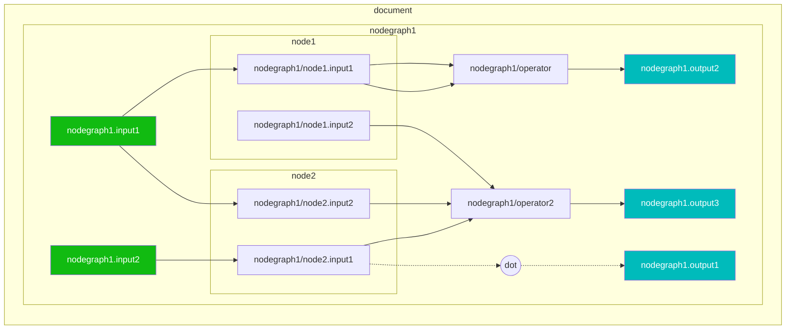
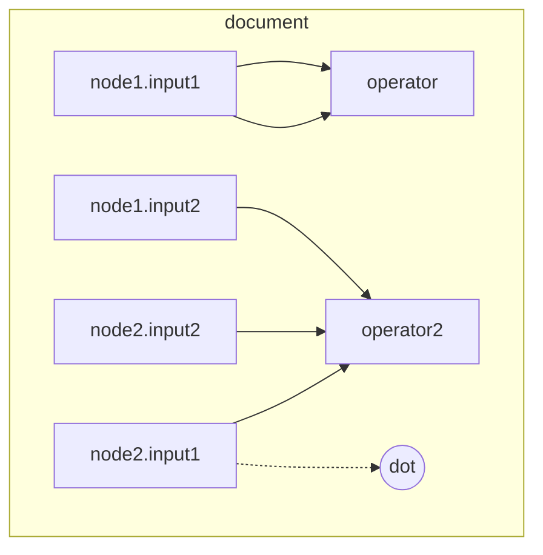
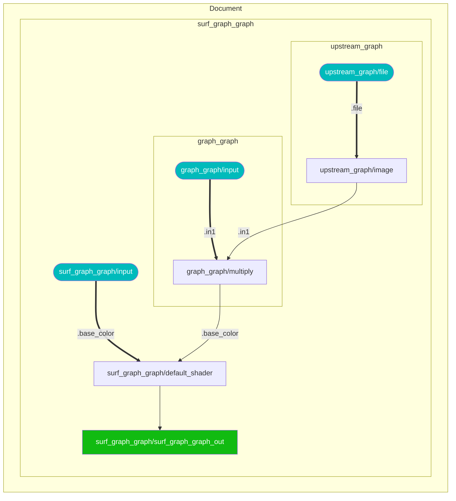
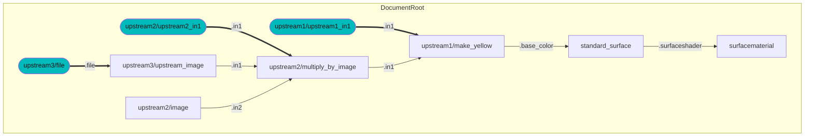
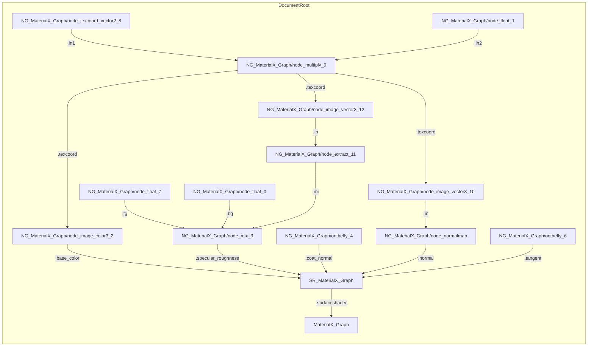

### Interface Building / Publishing Interfaces

The act of adding or removing `nodegraph` `input`s and `output`s can be thought of as **publishing** the public interface for the graph. 

A `node` should **never** have inputs / outputs added or removed which are not part of their definition -- in fact this will be tagged a node instance which has no matching definition if a validation check is performed. 

## Compound and Functional Nodegraphs and "Flattening" and "Publishing"

If node is implemented by a nodegraph, then the nodegraph is called a **functional nodegraph**. Otherwise it is called a **compound nodegraph**.

Thus a more complete definition of a shader graph is that:
1. It is composed of a series of connected nodes and compound nodegraphs.
2. One or more of these nodes may be implemented as  **functional graphs**. 
3. If the node instance is replaced with the functional graph implementation then the node essentially "becomes" a compound graph. This operation is called **flattening** a node instance.
4. If all nodes are taken out of the scope of their parent nodegraphs then all that is left is a series of connected nodes. This operation is is called **flattening** a nodegraph.
5. The reverse operation to add nodes to nodegraphs allows users to logically group nodes and/or publisih it's public interface. 
If a new definition `<nodedef>` is created and the nodegraph becomes a **functional graph** then can be thought of as  **publishing** a new definition.

### Flattening Example

if flattened would look something like this if the parent of the nodegraph was a document. The interface `<input>` and `<output>` elements are not present as this is disallowed within the document scope.

The reverse process could create a nodegraph, with inputs and outputs added to create the public interface for the nodegraph.

## Shader Generation Graphs
When dealing with shader generation shader graphs are simplified to having only nodes with inputs and outputs **"ports"**. 

The key components are:
* Shader Node: Basically corresponds to a node.
* Shader Port: A connectable attribute of a Shader Node. Can either be Input or Output Ports.
* Public Ports: Are bindable as shader code inputs or exposed as the root for evaluation as an output.
* Private Ports: Inputs and Outputs which are not exposed.

All original nodes are flattened to remove the notion of a graph hierarchy
and replace any nodes which are represented as functional graphs.

## Upstream Traversal

Upstream traversal is fairly simple where the root to start from should be an `<output>` on a node or nodegraph. Traversal will naturally only follow direct connections. 

This is straightforward when:

  1. There are no nodegraphs within the shader graph. 
  2. Or all of the nodes reside within a single nodegraph.

In this case only node inputs connect to upstream outputs.

# Examples

Interior of nodegraph to upstream nodegraphs and nodes

Cascading nodegraph to nodegraph

Sample AMD material

------

## Workflows

* Logically a both a Document and a NodeGraph are considered to be containers of nodes or a "node graph".
* However a Node which may have an implementation as a graph is not considered to be a container. This means
traversal up and downstream from a given node requires special casing.
* Another issue is that in order to keep a minimal size, only those inputs and which are explicit connected to or
assigned non-default values will exist on the instance of a Node or Nodegraph, even though they are part of the
interface definition.
* Any connections which within Nodegraphs which connect interior Node inputs to Nodegraph inputs also currently have
special syntax.
* All connections are specified on a downstream input instead of as a structure which provides both the input and output. This makes downstream traversal much less straightforward to perform than upstream.
* Materials as of 1.38 are nodes and traversal can find upstream shaders to allow a  full material graph to be traversed.

## Recommendations
* In order to create a "complete" graph, when instances are created all inputs and outputs should be instantiated. This can be done via utilities which scan the associated NodeDef (definition) and add inputs and outputs with default values.
* An NodeGraph itself should have all of it's inputs specified even if it's a functional graph for the same reason.
* 