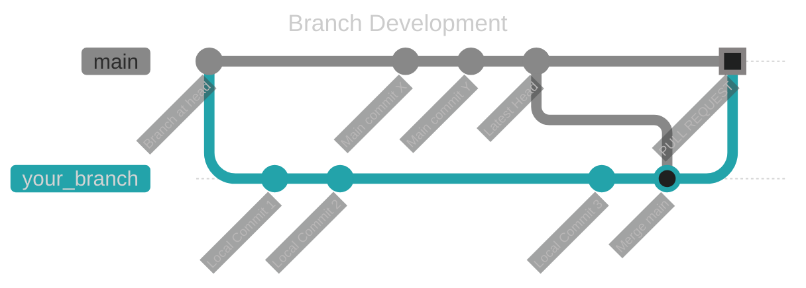
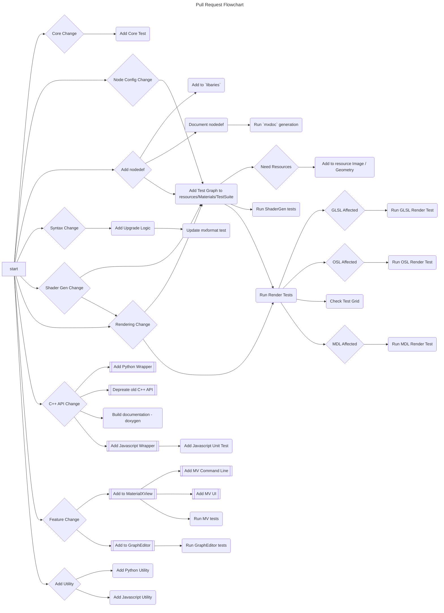

# Guide for Change Submissions

The following is a brief guide for what to include when submitting a change (pull request)

All submissions should be from a local branch off of a fork the main repo. 

