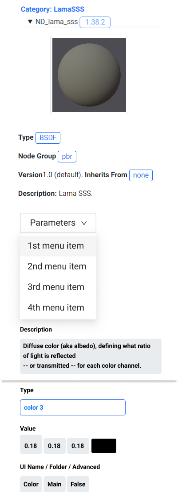
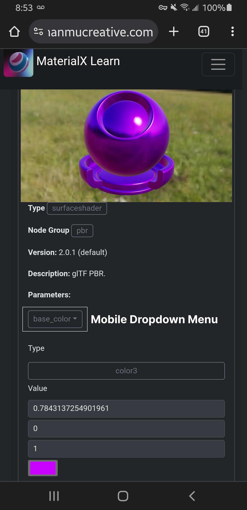
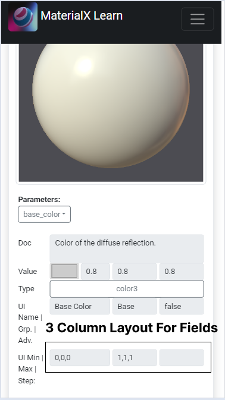
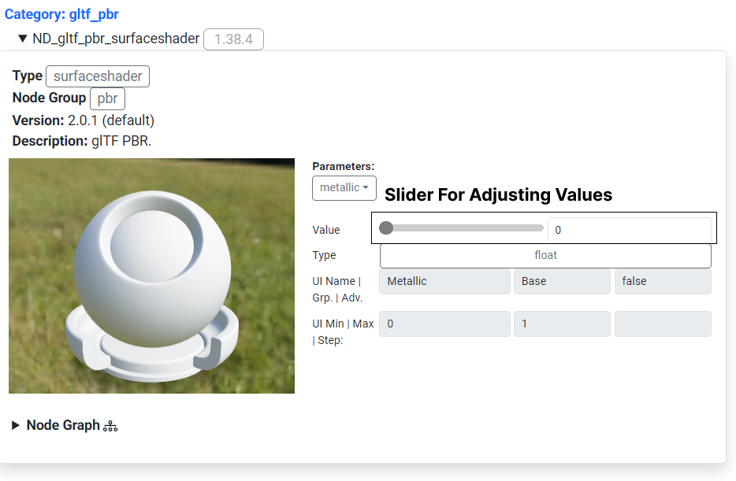

<!--Start-->
# Property Editor UX

The original version of the layout for a given material is shown above. Parameters are displayed as a series of tabs. Various issues arose from using tabs such as taking up to much screen space which makes it hard to find the editable field information. 

## Issues With the Existing Property Editor
The original property editor had various readability and usability issues on both desktop and mobile. For desktop there were too many parameters being shown at once and sections were too spread out. This made it hard to discern how and where to edit values to change a model's appearance.

On mobile there were similar issues. The section for editing parameter values was not visible on the same screen as the model editor. In addition parameters were displayed as a series of tabs which took up additional horizontal space on a mobile screen. This made it cumbersome to find the editable parameter fields, with users needing to scroll downward through many parameter tabs to get to the parameter values.

## Redesign Goal

The main goal with the redesign of the property editor UI was to compact the model viewer and property editor controls to be viewable and editable within the same area on dekstop and mobile. Other tasks were to shift the location of content sections such as the description to place more focus on the viewer and its property controls.

## User Interface Options Considered

Alternative user interfaces for the property editor were explored when looking for methods to minimize the user interface size. These included radial menus for selection, tabbed menus, overlaying UI and having the UI as part of the model viewer.

Radial UI was used previously in projects for AR/VR to edit attributes of a virtual avatar. There needed to be a efficient visual way to select from a limited set of modifiable parts with minimal text instruction. Radial UI was not chosen for the redesign of the property editor due to the need to present a series of modifable form fields and text which are hard to layout in a radial menu without too much visual clutter.

Tabbed menus were another option considered to simplify property display. This method would help seperate properties by category and save screen space by sectioning off related material property information. This option was not chosen as it is 
simpler to compact the screen space taken up by the current user interface.

Overlay UI was considered, with the property editor controls directly overlaid on top of the model. This method was not chosen as it would be cumbersome to use the viewer while trying to
not edit property values at the same time. Additionally the text overlaid produces makes it difficult to see adjustments to the model.

The final option considered was having the user interface embedded as a part of the model viewer. This was used in projects such as digital cards were various parts could be interacted with such as the name of the card, and card "moves" to show additional content. This option was not chosen as you would need a larger minimum interactable space to have context specific interactable areas/menus on both desktop and mobile. 

## Drafting the Redesign

### Desktop Mockup

#### Current Problems:
Too much screen space is being taken up by the parameter tabs making it hard to find the form fields. Content not related to the parameter values needs to be relocated so the viewer, parameter, and parameter fields are visible within the same screen. 

#### Solution:
The proposed desktop mockup makes improvements to the way parameters and titles for form fields are displayed. 

Parameters are moved into a scrollable dropdown menu. This resolves the screen clutter issues with too many parameters being displayed that information could be displayed off the viewable screen area. 

Additionally, the parameter dropdown menu is displayed as a single row to improve readability on smaller screens.The titles for form fields are moved to the top of the form field to save screen space.

### Mobile Mockup

#### Current Problems:
Parameter tabs take up too much vertical screen space and editable fields take up too much vertical screen space. Information such as the description can be shifted to a different location to better display the model viewer and its editable properties. 

#### Solution:

The mobile mockup makes similar improvements to parameter and form field title display. The parameters are grouped into a dropdown menu row. The form fields are shown as a series of columns per area to reduce the size of the user interface. This gives users ample viewing and interaction area for browsing parameters or to change the values in the form fields. 

## Using a Parameter Menu

Following the mockup design the main changes made were to move material parameters into a scrollable dropdown menu. The other change made was to compact the grid layout to have the model preview to the left, with description and parameter information located beside it. This helps to convey the same information while increasing the viewing area for the viewer and parameter controls

Parameters are shifted to a dropdown menu. The desciption info is located beside the viewer to save screen space. 

<table>
<tr>
<td>

</td>
<td>

</td>
</tr>
</table>

The first mobile iteration moves parameters to a scrollable dropdown menu which saves screen space. The titles for fields are shifted to be above the form fields to be more readable and to save screen space. 

### Adjusting Property Control UI on Mobile

<table>
<tr>
<td>

</td>
<td>

</td>

</tr>
</table>

The next version of the property editor takes further steps to reduce the screen space taken up by the form controls. Now when browsing on a mobile device the property fields are displayed as a series of columns of equal width, similar to the interface of the desktop version. The same information is presented and the fields are wide enough to be selectable.  

### Adding a Slider for Parameter Controls

<table>
<tr>
<td>

</td>
<td>

</td>
<td>

</td>

</tr>
</table>

The next version makes editing properties such as "metallness" clearer by using a slider instead of an editable fields. The slider is easier to manipulate on both desktop and mobile and the changes to the model by adjusting this value are easier to discern. 

### Adding Editable Form Fields to the Slider Area 

Snapshots from Samsung Galaxy S8 Phone
<table>
<tr>
<td>

</td>

</tr>
</table>

 This version adds the ability to edit form values of a property manually or by using the form field arrows. This option is provided for users for more precise data entry allowing for exact values to be entered for model parameters such as "metalness". 

### Adding Viewer Options

The viewer's background was changed to be a transparent background. This allows users to focus on the model and its shading without any distractions.

To allow for the ability to still view the background, a toggle was added to the viewer options. This allows users to switch between a transparent background and a background image.

Additionally a reset camera button was added to the viewer options. This allows users to reset the camera to its default position.

Both buttons are overlayed on the viewer This allows users to easily select  options without having to navigate to a different part of the user interface.

<table>
<tr>
<td>
Initial display without background showing.
</td>
<td>
    
<td>   
</tr>
<tr>
<td>
 
Toggling of background display 
</td>
<td>
    
<td>   
</tr>
<tr>
<td>
 
Reset camera parameters 
</td>
<td>
    
<td>   
</tr>
</table>

<!--End-->