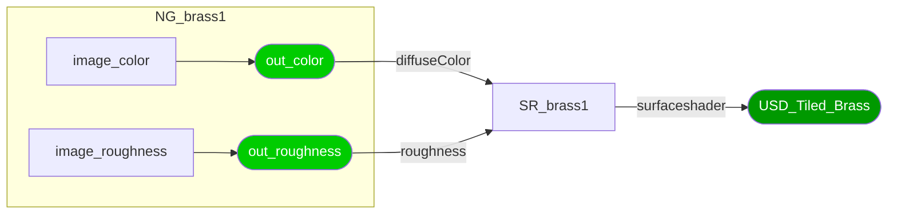

```mermaid
graph LR
    subgraph NG_brass1
    style NG_brass1_out_color  fill:#0C0, color:#FFF
    NG_brass1_out_color([out_color])
    style NG_brass1_out_roughness  fill:#0C0, color:#FFF
    NG_brass1_out_roughness([out_roughness])
    NG_brass1_image_color[image_color]
    NG_brass1_image_roughness[image_roughness]
    end
    SR_brass1[SR_brass1]
    style USD_Tiled_Brass  fill:#090, color:#FFF
    USD_Tiled_Brass([USD_Tiled_Brass])
    NG_brass1_image_color --> NG_brass1_out_color
    NG_brass1_image_roughness --> NG_brass1_out_roughness
    NG_brass1_out_color --"diffuseColor"--> SR_brass1
    NG_brass1_out_roughness --"roughness"--> SR_brass1
    SR_brass1 --"surfaceshader"--> USD_Tiled_Brass
```