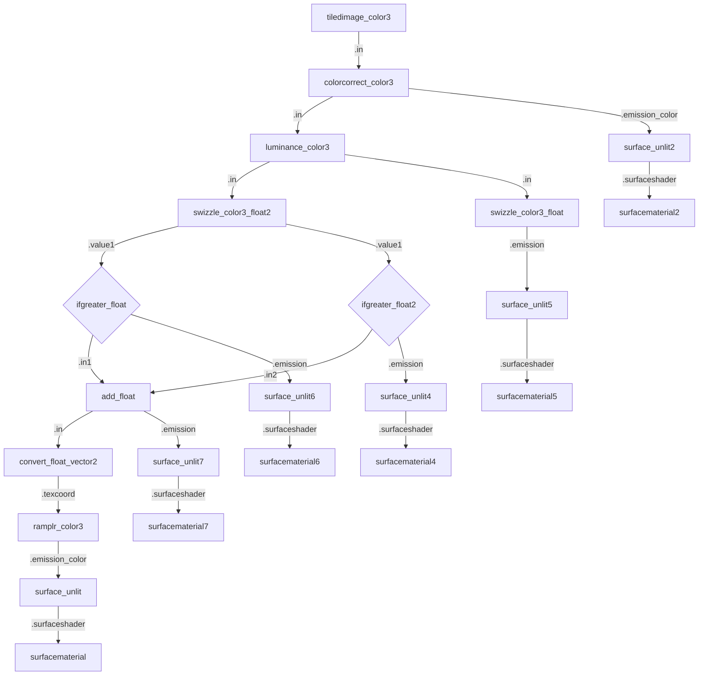

```mermaid
graph TB;
    surface_unlit[surface_unlit] --".surfaceshader"--> surfacematerial[surfacematerial]
    ramplr_color3[ramplr_color3] --".emission_color"--> surface_unlit[surface_unlit]
    convert_float_vector2[convert_float_vector2] --".texcoord"--> ramplr_color3[ramplr_color3]
    add_float[add_float] --".in"--> convert_float_vector2[convert_float_vector2]
    ifgreater_float{ifgreater_float} --".in1"--> add_float[add_float]
    swizzle_color3_float2[swizzle_color3_float2] --".value1"--> ifgreater_float{ifgreater_float}
    luminance_color3[luminance_color3] --".in"--> swizzle_color3_float2[swizzle_color3_float2]
    colorcorrect_color3[colorcorrect_color3] --".in"--> luminance_color3[luminance_color3]
    tiledimage_color3[tiledimage_color3] --".in"--> colorcorrect_color3[colorcorrect_color3]
    ifgreater_float2{ifgreater_float2} --".in2"--> add_float[add_float]
    swizzle_color3_float2[swizzle_color3_float2] --".value1"--> ifgreater_float2{ifgreater_float2}
    surface_unlit2[surface_unlit2] --".surfaceshader"--> surfacematerial2[surfacematerial2]
    colorcorrect_color3[colorcorrect_color3] --".emission_color"--> surface_unlit2[surface_unlit2]
    surface_unlit4[surface_unlit4] --".surfaceshader"--> surfacematerial4[surfacematerial4]
    ifgreater_float2{ifgreater_float2} --".emission"--> surface_unlit4[surface_unlit4]
    surface_unlit5[surface_unlit5] --".surfaceshader"--> surfacematerial5[surfacematerial5]
    swizzle_color3_float[swizzle_color3_float] --".emission"--> surface_unlit5[surface_unlit5]
    luminance_color3[luminance_color3] --".in"--> swizzle_color3_float[swizzle_color3_float]
    surface_unlit6[surface_unlit6] --".surfaceshader"--> surfacematerial6[surfacematerial6]
    ifgreater_float{ifgreater_float} --".emission"--> surface_unlit6[surface_unlit6]
    surface_unlit7[surface_unlit7] --".surfaceshader"--> surfacematerial7[surfacematerial7]
    add_float[add_float] --".emission"--> surface_unlit7[surface_unlit7]
```