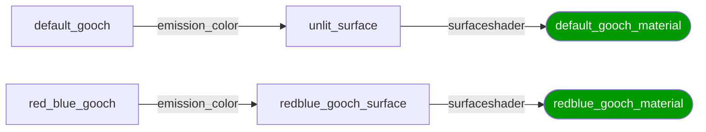

```mermaid
graph LR
    default_gooch[default_gooch]
    unlit_surface[unlit_surface]
    style default_gooch_material  fill:#090, color:#FFF
    default_gooch_material([default_gooch_material])
    red_blue_gooch[red_blue_gooch]
    redblue_gooch_surface[redblue_gooch_surface]
    style redblue_gooch_material  fill:#090, color:#FFF
    redblue_gooch_material([redblue_gooch_material])
    default_gooch --"emission_color"--> unlit_surface
    unlit_surface --"surfaceshader"--> default_gooch_material
    red_blue_gooch --"emission_color"--> redblue_gooch_surface
    redblue_gooch_surface --"surfaceshader"--> redblue_gooch_material
```