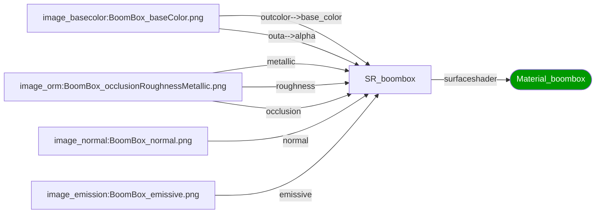

```mermaid
graph LR
    image_basecolor[image_basecolor:BoomBox_baseColor.png]
    image_orm[image_orm:BoomBox_occlusionRoughnessMetallic.png]
    image_normal[image_normal:BoomBox_normal.png]
    image_emission[image_emission:BoomBox_emissive.png]
    SR_boombox[SR_boombox]
    style Material_boombox  fill:#090, color:#FFF
    Material_boombox([Material_boombox])
    image_basecolor --"outcolor-->base_color"--> SR_boombox
    image_basecolor --"outa-->alpha"--> SR_boombox
    image_orm --"metallic"--> SR_boombox
    image_orm --"roughness"--> SR_boombox
    image_orm --"occlusion"--> SR_boombox
    image_normal --"normal"--> SR_boombox
    image_emission --"emissive"--> SR_boombox
    SR_boombox --"surfaceshader"--> Material_boombox
```