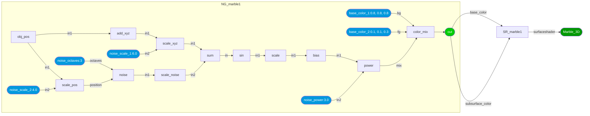

```mermaid
graph LR
    subgraph NG_marble1
    style NG_marble1_base_color_1  fill:#09D, color:#FFF
    NG_marble1_base_color_1([base_color_1:0.8, 0.8, 0.8])
    style NG_marble1_base_color_2  fill:#09D, color:#FFF
    NG_marble1_base_color_2([base_color_2:0.1, 0.1, 0.3])
    style NG_marble1_noise_scale_1  fill:#09D, color:#FFF
    NG_marble1_noise_scale_1([noise_scale_1:6.0])
    style NG_marble1_noise_scale_2  fill:#09D, color:#FFF
    NG_marble1_noise_scale_2([noise_scale_2:4.0])
    style NG_marble1_noise_power  fill:#09D, color:#FFF
    NG_marble1_noise_power([noise_power:3.0])
    style NG_marble1_noise_octaves  fill:#09D, color:#FFF
    NG_marble1_noise_octaves([noise_octaves:3])
    style NG_marble1_out  fill:#0C0, color:#FFF
    NG_marble1_out([out])
    NG_marble1_obj_pos[obj_pos]
    NG_marble1_add_xyz[add_xyz]
    NG_marble1_scale_xyz[scale_xyz]
    NG_marble1_scale_pos[scale_pos]
    NG_marble1_noise[noise]
    NG_marble1_scale_noise[scale_noise]
    NG_marble1_sum[sum]
    NG_marble1_sin[sin]
    NG_marble1_scale[scale]
    NG_marble1_bias[bias]
    NG_marble1_power[power]
    NG_marble1_color_mix[color_mix]
    end
    SR_marble1[SR_marble1]
    style Marble_3D  fill:#090, color:#FFF
    Marble_3D([Marble_3D])
    NG_marble1_obj_pos --"in1"--> NG_marble1_add_xyz
    NG_marble1_add_xyz --"in1"--> NG_marble1_scale_xyz
    NG_marble1_noise_scale_1 --"in2"--> NG_marble1_scale_xyz
    NG_marble1_obj_pos --"in1"--> NG_marble1_scale_pos
    NG_marble1_noise_scale_2 --"in2"--> NG_marble1_scale_pos
    NG_marble1_noise_octaves --"octaves"--> NG_marble1_noise
    NG_marble1_scale_pos --"position"--> NG_marble1_noise
    NG_marble1_noise --"in1"--> NG_marble1_scale_noise
    NG_marble1_scale_xyz --"in1"--> NG_marble1_sum
    NG_marble1_scale_noise --"in2"--> NG_marble1_sum
    NG_marble1_sum --"in"--> NG_marble1_sin
    NG_marble1_sin --"in1"--> NG_marble1_scale
    NG_marble1_scale --"in1"--> NG_marble1_bias
    NG_marble1_bias --"in1"--> NG_marble1_power
    NG_marble1_noise_power --"in2"--> NG_marble1_power
    NG_marble1_base_color_1 --"bg"--> NG_marble1_color_mix
    NG_marble1_base_color_2 --"fg"--> NG_marble1_color_mix
    NG_marble1_power --"mix"--> NG_marble1_color_mix
    NG_marble1_color_mix --> NG_marble1_out
    NG_marble1_out --"base_color"--> SR_marble1
    NG_marble1_out --"subsurface_color"--> SR_marble1
    SR_marble1 --"surfaceshader"--> Marble_3D
```