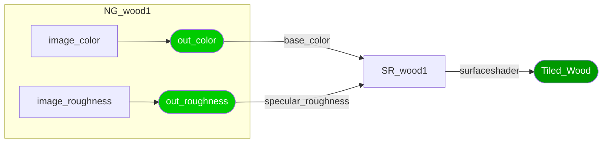

```mermaid
graph LR
    subgraph NG_wood1
    style NG_wood1_out_color  fill:#0C0, color:#FFF
    NG_wood1_out_color([out_color])
    style NG_wood1_out_roughness  fill:#0C0, color:#FFF
    NG_wood1_out_roughness([out_roughness])
    NG_wood1_image_color[image_color]
    NG_wood1_image_roughness[image_roughness]
    end
    SR_wood1[SR_wood1]
    style Tiled_Wood  fill:#090, color:#FFF
    Tiled_Wood([Tiled_Wood])
    NG_wood1_image_color --> NG_wood1_out_color
    NG_wood1_image_roughness --> NG_wood1_out_roughness
    NG_wood1_out_color --"base_color"--> SR_wood1
    NG_wood1_out_roughness --"specular_roughness"--> SR_wood1
    SR_wood1 --"surfaceshader"--> Tiled_Wood
```