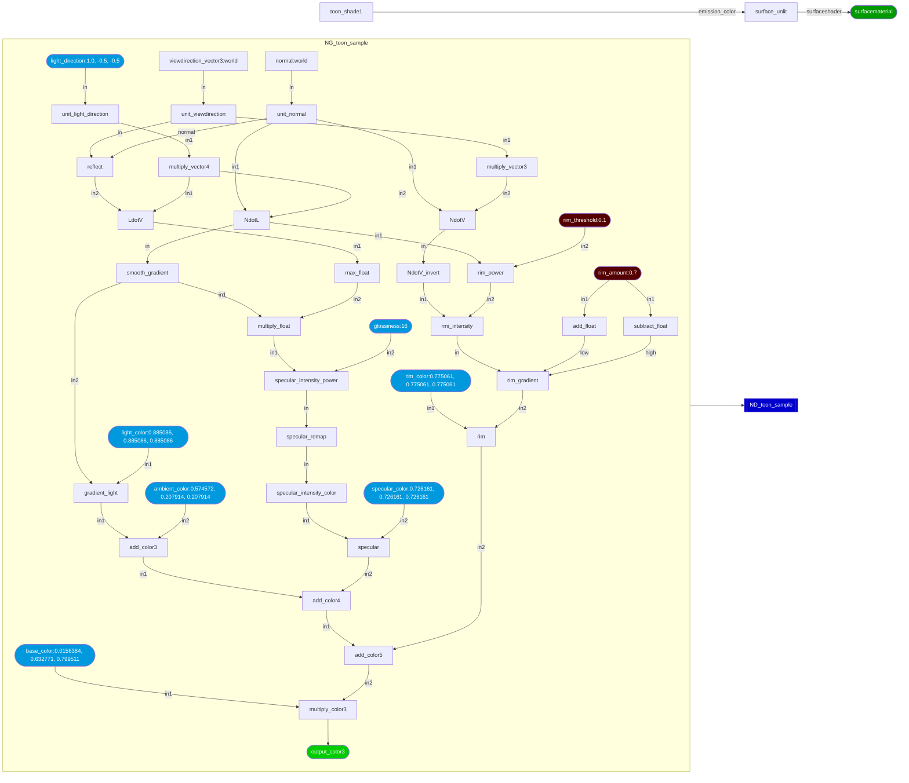

```mermaid
graph LR
    surface_unlit[surface_unlit]
    style surfacematerial  fill:#090, color:#FFF
    surfacematerial([surfacematerial])
    style ND_toon_sample  fill:#00C, color:#FFF
    ND_toon_sample[[ND_toon_sample]]
    toon_shade1[toon_shade1]
    subgraph NG_toon_sample
    style NG_toon_sample_base_color  fill:#09D, color:#FFF
    NG_toon_sample_base_color([base_color:0.0156384, 0.632771, 0.799511])
    style NG_toon_sample_ambient_color  fill:#09D, color:#FFF
    NG_toon_sample_ambient_color([ambient_color:0.574572, 0.207914, 0.207914])
    style NG_toon_sample_specular_color  fill:#09D, color:#FFF
    NG_toon_sample_specular_color([specular_color:0.726161, 0.726161, 0.726161])
    style NG_toon_sample_glossiness  fill:#09D, color:#FFF
    NG_toon_sample_glossiness([glossiness:16])
    style NG_toon_sample_rim_color  fill:#09D, color:#FFF
    NG_toon_sample_rim_color([rim_color:0.775061, 0.775061, 0.775061])
    style NG_toon_sample_light_direction  fill:#09D, color:#FFF
    NG_toon_sample_light_direction([light_direction:1.0, -0.5, -0.5])
    style NG_toon_sample_light_color  fill:#09D, color:#FFF
    NG_toon_sample_light_color([light_color:0.885086, 0.885086, 0.885086])
    style NG_toon_sample_output_color3  fill:#0C0, color:#FFF
    NG_toon_sample_output_color3([output_color3])
    NG_toon_sample_normal[normal:world]
    NG_toon_sample_NdotL[NdotL]
    NG_toon_sample_unit_light_direction[unit_light_direction]
    NG_toon_sample_multiply_color3[multiply_color3]
    NG_toon_sample_add_color3[add_color3]
    NG_toon_sample_smooth_gradient[smooth_gradient]
    NG_toon_sample_viewdirection_vector3[viewdirection_vector3:world]
    NG_toon_sample_unit_viewdirection[unit_viewdirection]
    NG_toon_sample_multiply_float[multiply_float]
    NG_toon_sample_specular_intensity_power[specular_intensity_power]
    NG_toon_sample_specular_intensity_color[specular_intensity_color]
    NG_toon_sample_add_color4[add_color4]
    NG_toon_sample_multiply_vector3[multiply_vector3]
    NG_toon_sample_specular_remap[specular_remap]
    NG_toon_sample_specular[specular]
    NG_toon_sample_NdotV[NdotV]
    NG_toon_sample_NdotV_invert[NdotV_invert]
    NG_toon_sample_add_color5[add_color5]
    NG_toon_sample_rim_gradient[rim_gradient]
    style NG_toon_sample_rim_amount  fill:#500, color:#FFF
    NG_toon_sample_rim_amount([rim_amount:0.7])
    NG_toon_sample_add_float[add_float]
    NG_toon_sample_subtract_float[subtract_float]
    NG_toon_sample_rmi_intensity[rmi_intensity]
    style NG_toon_sample_rim_threshold  fill:#500, color:#FFF
    NG_toon_sample_rim_threshold([rim_threshold:0.1])
    NG_toon_sample_rim_power[rim_power]
    NG_toon_sample_multiply_vector4[multiply_vector4]
    NG_toon_sample_unit_normal[unit_normal]
    NG_toon_sample_rim[rim]
    NG_toon_sample_gradient_light[gradient_light]
    NG_toon_sample_reflect[reflect]
    NG_toon_sample_LdotV[LdotV]
    NG_toon_sample_max_float[max_float]
    end
    toon_shade1 --"emission_color"--> surface_unlit
    surface_unlit --"surfaceshader"--> surfacematerial
    NG_toon_sample --> ND_toon_sample
    NG_toon_sample_multiply_color3 --> NG_toon_sample_output_color3
    NG_toon_sample_unit_normal --"in1"--> NG_toon_sample_NdotL
    NG_toon_sample_multiply_vector4 --"in2"--> NG_toon_sample_NdotL
    NG_toon_sample_light_direction --"in"--> NG_toon_sample_unit_light_direction
    NG_toon_sample_base_color --"in1"--> NG_toon_sample_multiply_color3
    NG_toon_sample_add_color5 --"in2"--> NG_toon_sample_multiply_color3
    NG_toon_sample_gradient_light --"in1"--> NG_toon_sample_add_color3
    NG_toon_sample_ambient_color --"in2"--> NG_toon_sample_add_color3
    NG_toon_sample_NdotL --"in"--> NG_toon_sample_smooth_gradient
    NG_toon_sample_viewdirection_vector3 --"in"--> NG_toon_sample_unit_viewdirection
    NG_toon_sample_smooth_gradient --"in1"--> NG_toon_sample_multiply_float
    NG_toon_sample_max_float --"in2"--> NG_toon_sample_multiply_float
    NG_toon_sample_multiply_float --"in1"--> NG_toon_sample_specular_intensity_power
    NG_toon_sample_glossiness --"in2"--> NG_toon_sample_specular_intensity_power
    NG_toon_sample_specular_remap --"in"--> NG_toon_sample_specular_intensity_color
    NG_toon_sample_add_color3 --"in1"--> NG_toon_sample_add_color4
    NG_toon_sample_specular --"in2"--> NG_toon_sample_add_color4
    NG_toon_sample_unit_viewdirection --"in1"--> NG_toon_sample_multiply_vector3
    NG_toon_sample_specular_intensity_power --"in"--> NG_toon_sample_specular_remap
    NG_toon_sample_specular_intensity_color --"in1"--> NG_toon_sample_specular
    NG_toon_sample_specular_color --"in2"--> NG_toon_sample_specular
    NG_toon_sample_unit_normal --"in1"--> NG_toon_sample_NdotV
    NG_toon_sample_multiply_vector3 --"in2"--> NG_toon_sample_NdotV
    NG_toon_sample_NdotV --"in"--> NG_toon_sample_NdotV_invert
    NG_toon_sample_add_color4 --"in1"--> NG_toon_sample_add_color5
    NG_toon_sample_rim --"in2"--> NG_toon_sample_add_color5
    NG_toon_sample_rmi_intensity --"in"--> NG_toon_sample_rim_gradient
    NG_toon_sample_add_float --"low"--> NG_toon_sample_rim_gradient
    NG_toon_sample_subtract_float --"high"--> NG_toon_sample_rim_gradient
    NG_toon_sample_rim_amount --"in1"--> NG_toon_sample_add_float
    NG_toon_sample_rim_amount --"in1"--> NG_toon_sample_subtract_float
    NG_toon_sample_NdotV_invert --"in1"--> NG_toon_sample_rmi_intensity
    NG_toon_sample_rim_power --"in2"--> NG_toon_sample_rmi_intensity
    NG_toon_sample_NdotL --"in1"--> NG_toon_sample_rim_power
    NG_toon_sample_rim_threshold --"in2"--> NG_toon_sample_rim_power
    NG_toon_sample_unit_light_direction --"in1"--> NG_toon_sample_multiply_vector4
    NG_toon_sample_normal --"in"--> NG_toon_sample_unit_normal
    NG_toon_sample_rim_color --"in1"--> NG_toon_sample_rim
    NG_toon_sample_rim_gradient --"in2"--> NG_toon_sample_rim
    NG_toon_sample_smooth_gradient --"in2"--> NG_toon_sample_gradient_light
    NG_toon_sample_light_color --"in1"--> NG_toon_sample_gradient_light
    NG_toon_sample_unit_viewdirection --"in"--> NG_toon_sample_reflect
    NG_toon_sample_unit_normal --"normal"--> NG_toon_sample_reflect
    NG_toon_sample_reflect --"in2"--> NG_toon_sample_LdotV
    NG_toon_sample_multiply_vector4 --"in1"--> NG_toon_sample_LdotV
    NG_toon_sample_LdotV --"in1"--> NG_toon_sample_max_float
```