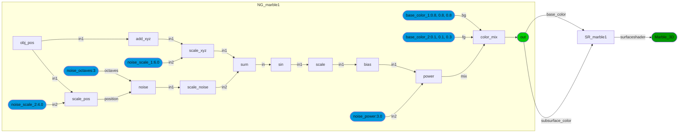

```mermaid
graph LR
    subgraph NG_marble1
    NG_marble1/base_color_1([base_color_1:0.8, 0.8, 0.8])
    style NG_marble1/base_color_1  fill:#09D, color:#111
    NG_marble1/base_color_2([base_color_2:0.1, 0.1, 0.3])
    style NG_marble1/base_color_2  fill:#09D, color:#111
    NG_marble1/noise_scale_1([noise_scale_1:6.0])
    style NG_marble1/noise_scale_1  fill:#09D, color:#111
    NG_marble1/noise_scale_2([noise_scale_2:4.0])
    style NG_marble1/noise_scale_2  fill:#09D, color:#111
    NG_marble1/noise_power([noise_power:3.0])
    style NG_marble1/noise_power  fill:#09D, color:#111
    NG_marble1/noise_octaves([noise_octaves:3])
    style NG_marble1/noise_octaves  fill:#09D, color:#111
    NG_marble1/out([out])
    style NG_marble1/out   fill:#0C0, color:#111
    NG_marble1/obj_pos[obj_pos]
    NG_marble1/add_xyz[add_xyz]
    NG_marble1/scale_xyz[scale_xyz]
    NG_marble1/scale_pos[scale_pos]
    NG_marble1/noise[noise]
    NG_marble1/scale_noise[scale_noise]
    NG_marble1/sum[sum]
    NG_marble1/sin[sin]
    NG_marble1/scale[scale]
    NG_marble1/bias[bias]
    NG_marble1/power[power]
    NG_marble1/color_mix[color_mix]
    end
    SR_marble1[SR_marble1]
    Marble_3D([Marble_3D])
    style Marble_3D   fill:#090, color:#111
    NG_marble1/obj_pos --"in1"--> NG_marble1/add_xyz
    NG_marble1/add_xyz --"in1"--> NG_marble1/scale_xyz
    NG_marble1/noise_scale_1 --"in2"--> NG_marble1/scale_xyz
    NG_marble1/obj_pos --"in1"--> NG_marble1/scale_pos
    NG_marble1/noise_scale_2 --"in2"--> NG_marble1/scale_pos
    NG_marble1/noise_octaves --"octaves"--> NG_marble1/noise
    NG_marble1/scale_pos --"position"--> NG_marble1/noise
    NG_marble1/noise --"in1"--> NG_marble1/scale_noise
    NG_marble1/scale_xyz --"in1"--> NG_marble1/sum
    NG_marble1/scale_noise --"in2"--> NG_marble1/sum
    NG_marble1/sum --"in"--> NG_marble1/sin
    NG_marble1/sin --"in1"--> NG_marble1/scale
    NG_marble1/scale --"in1"--> NG_marble1/bias
    NG_marble1/bias --"in1"--> NG_marble1/power
    NG_marble1/noise_power --"in2"--> NG_marble1/power
    NG_marble1/base_color_1 --"bg"--> NG_marble1/color_mix
    NG_marble1/base_color_2 --"fg"--> NG_marble1/color_mix
    NG_marble1/power --"mix"--> NG_marble1/color_mix
    NG_marble1/color_mix --> NG_marble1/out
    NG_marble1/out --"base_color"--> SR_marble1
    NG_marble1/out --"subsurface_color"--> SR_marble1
    SR_marble1 --"surfaceshader"--> Marble_3D
```