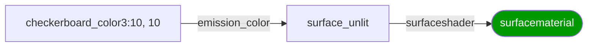

```mermaid
graph LR
    surface_unlit[surface_unlit]
    style surfacematerial  fill:#090, color:#FFF
    surfacematerial([surfacematerial])
    checkerboard_color3[checkerboard_color3:10, 10]
    checkerboard_color3 --"emission_color"--> surface_unlit
    surface_unlit --"surfaceshader"--> surfacematerial
```