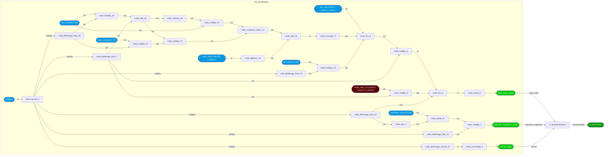

```mermaid
graph LR
    subgraph NG_BrickPattern
    style NG_BrickPattern_brick_color  fill:#09D, color:#FFF
    NG_BrickPattern_brick_color([brick_color:0.661876, 0.19088, 0])
    style NG_BrickPattern_hue_variation  fill:#09D, color:#FFF
    NG_BrickPattern_hue_variation([hue_variation:0.083])
    style NG_BrickPattern_value_variation  fill:#09D, color:#FFF
    NG_BrickPattern_value_variation([value_variation:0.787])
    style NG_BrickPattern_roughness_amount  fill:#09D, color:#FFF
    NG_BrickPattern_roughness_amount([roughness_amount:0.853])
    style NG_BrickPattern_dirt_color  fill:#09D, color:#FFF
    NG_BrickPattern_dirt_color([dirt_color:0.56372, 0.56372, 0.56372])
    style NG_BrickPattern_dirt_amount  fill:#09D, color:#FFF
    NG_BrickPattern_dirt_amount([dirt_amount:0.248])
    style NG_BrickPattern_uvtiling  fill:#09D, color:#FFF
    NG_BrickPattern_uvtiling([uvtiling:3])
    style NG_BrickPattern_base_color_output  fill:#0C0, color:#FFF
    NG_BrickPattern_base_color_output([base_color_output])
    style NG_BrickPattern_specular_roughness_output  fill:#0C0, color:#FFF
    NG_BrickPattern_specular_roughness_output([specular_roughness_output])
    style NG_BrickPattern_normal_output  fill:#0C0, color:#FFF
    NG_BrickPattern_normal_output([normal_output])
    NG_BrickPattern_node_multiply_5[node_multiply_5]
    NG_BrickPattern_node_mix_8[node_mix_8]
    style NG_BrickPattern_node_color_11  fill:#500, color:#FFF
    NG_BrickPattern_node_color_11([node_color_11:0.263273, 0.263273, 0.263273])
    NG_BrickPattern_node_multiply_9[node_multiply_9]
    NG_BrickPattern_node_rgbtohsv_12[node_rgbtohsv_12]
    NG_BrickPattern_node_combine3_color3_13[node_combine3_color3_13]
    NG_BrickPattern_node_add_16[node_add_16]
    NG_BrickPattern_node_hsvtorgb_17[node_hsvtorgb_17]
    NG_BrickPattern_node_subtract_18[node_subtract_18]
    NG_BrickPattern_node_multiply_14[node_multiply_14]
    NG_BrickPattern_node_multiply_15[node_multiply_15]
    NG_BrickPattern_node_clamp_0[node_clamp_0]
    NG_BrickPattern_node_multiply_1[node_multiply_1]
    NG_BrickPattern_node_max_1[node_max_1]
    NG_BrickPattern_node_divide_21[node_divide_21]
    NG_BrickPattern_node_mix_6[node_mix_6]
    NG_BrickPattern_node_multiply_23[node_multiply_23]
    NG_BrickPattern_node_multiply_25[node_multiply_25]
    NG_BrickPattern_node_add_19[node_add_19]
    NG_BrickPattern_node_multiply_20[node_multiply_20]
    NG_BrickPattern_node_normalmap_3[node_normalmap_3]
    NG_BrickPattern_node_convert_1[node_convert_1]
    NG_BrickPattern_node_tiledimage_vector3_27[node_tiledimage_vector3_27]
    NG_BrickPattern_node_tiledimage_float_22[node_tiledimage_float_22]
    NG_BrickPattern_node_tiledimage_float_10[node_tiledimage_float_10]
    NG_BrickPattern_node_tiledimage_float_7[node_tiledimage_float_7]
    NG_BrickPattern_node_tiledimage_float_26[node_tiledimage_float_26]
    NG_BrickPattern_node_tiledimage_float_24[node_tiledimage_float_24]
    end
    N_StandardSurface[N_StandardSurface]
    style M_BrickPattern  fill:#090, color:#FFF
    M_BrickPattern([M_BrickPattern])
    NG_BrickPattern_node_mix_6 --"in1"--> NG_BrickPattern_node_multiply_5
    NG_BrickPattern_node_tiledimage_float_7 --"in2"--> NG_BrickPattern_node_multiply_5
    NG_BrickPattern_node_multiply_5 --"fg"--> NG_BrickPattern_node_mix_8
    NG_BrickPattern_node_multiply_9 --"bg"--> NG_BrickPattern_node_mix_8
    NG_BrickPattern_node_tiledimage_float_10 --"mix"--> NG_BrickPattern_node_mix_8
    NG_BrickPattern_node_color_11 --"in1"--> NG_BrickPattern_node_multiply_9
    NG_BrickPattern_node_tiledimage_float_7 --"in2"--> NG_BrickPattern_node_multiply_9
    NG_BrickPattern_brick_color --"in"--> NG_BrickPattern_node_rgbtohsv_12
    NG_BrickPattern_node_multiply_14 --"in1"--> NG_BrickPattern_node_combine3_color3_13
    NG_BrickPattern_node_multiply_15 --"in3"--> NG_BrickPattern_node_combine3_color3_13
    NG_BrickPattern_node_combine3_color3_13 --"in1"--> NG_BrickPattern_node_add_16
    NG_BrickPattern_node_rgbtohsv_12 --"in2"--> NG_BrickPattern_node_add_16
    NG_BrickPattern_node_add_16 --"in"--> NG_BrickPattern_node_hsvtorgb_17
    NG_BrickPattern_node_add_19 --"in1"--> NG_BrickPattern_node_subtract_18
    NG_BrickPattern_node_subtract_18 --"in1"--> NG_BrickPattern_node_multiply_14
    NG_BrickPattern_hue_variation --"in2"--> NG_BrickPattern_node_multiply_14
    NG_BrickPattern_node_add_19 --"in1"--> NG_BrickPattern_node_multiply_15
    NG_BrickPattern_node_multiply_20 --"in2"--> NG_BrickPattern_node_multiply_15
    NG_BrickPattern_node_mix_8 --"in"--> NG_BrickPattern_node_clamp_0
    NG_BrickPattern_node_divide_21 --"in1"--> NG_BrickPattern_node_multiply_1
    NG_BrickPattern_node_tiledimage_float_22 --"in2"--> NG_BrickPattern_node_multiply_1
    NG_BrickPattern_node_tiledimage_float_10 --"in1"--> NG_BrickPattern_node_max_1
    NG_BrickPattern_roughness_amount --"in1"--> NG_BrickPattern_node_divide_21
    NG_BrickPattern_node_max_1 --"in2"--> NG_BrickPattern_node_divide_21
    NG_BrickPattern_dirt_color --"fg"--> NG_BrickPattern_node_mix_6
    NG_BrickPattern_node_hsvtorgb_17 --"bg"--> NG_BrickPattern_node_mix_6
    NG_BrickPattern_node_multiply_23 --"mix"--> NG_BrickPattern_node_mix_6
    NG_BrickPattern_dirt_amount --"in1"--> NG_BrickPattern_node_multiply_23
    NG_BrickPattern_node_tiledimage_float_24 --"in2"--> NG_BrickPattern_node_multiply_23
    NG_BrickPattern_hue_variation --"in1"--> NG_BrickPattern_node_multiply_25
    NG_BrickPattern_node_tiledimage_float_26 --"in2"--> NG_BrickPattern_node_multiply_25
    NG_BrickPattern_node_multiply_25 --"in1"--> NG_BrickPattern_node_add_19
    NG_BrickPattern_node_tiledimage_float_7 --"in2"--> NG_BrickPattern_node_add_19
    NG_BrickPattern_value_variation --"in1"--> NG_BrickPattern_node_multiply_20
    NG_BrickPattern_node_tiledimage_float_26 --"in2"--> NG_BrickPattern_node_multiply_20
    NG_BrickPattern_node_tiledimage_vector3_27 --"in"--> NG_BrickPattern_node_normalmap_3
    NG_BrickPattern_uvtiling --"in"--> NG_BrickPattern_node_convert_1
    NG_BrickPattern_node_convert_1 --"uvtiling"--> NG_BrickPattern_node_tiledimage_vector3_27
    NG_BrickPattern_node_convert_1 --"uvtiling"--> NG_BrickPattern_node_tiledimage_float_22
    NG_BrickPattern_node_convert_1 --"uvtiling"--> NG_BrickPattern_node_tiledimage_float_10
    NG_BrickPattern_node_convert_1 --"uvtiling"--> NG_BrickPattern_node_tiledimage_float_7
    NG_BrickPattern_node_convert_1 --"uvtiling"--> NG_BrickPattern_node_tiledimage_float_26
    NG_BrickPattern_node_convert_1 --"uvtiling"--> NG_BrickPattern_node_tiledimage_float_24
    NG_BrickPattern_node_clamp_0 --> NG_BrickPattern_base_color_output
    NG_BrickPattern_node_multiply_1 --> NG_BrickPattern_specular_roughness_output
    NG_BrickPattern_node_normalmap_3 --> NG_BrickPattern_normal_output
    NG_BrickPattern_base_color_output --"base_color"--> N_StandardSurface
    NG_BrickPattern_specular_roughness_output --"specular_roughness"--> N_StandardSurface
    NG_BrickPattern_normal_output --"normal"--> N_StandardSurface
    N_StandardSurface --"surfaceshader"--> M_BrickPattern
```