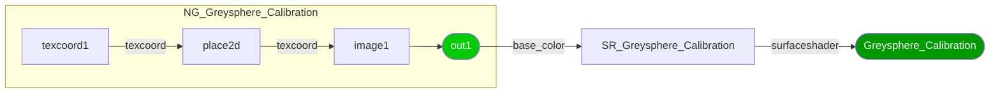

```mermaid
graph LR
    subgraph NG_Greysphere_Calibration
    style NG_Greysphere_Calibration_out1  fill:#0C0, color:#FFF
    NG_Greysphere_Calibration_out1([out1])
    NG_Greysphere_Calibration_texcoord1[texcoord1]
    NG_Greysphere_Calibration_place2d[place2d]
    NG_Greysphere_Calibration_image1[image1]
    end
    SR_Greysphere_Calibration[SR_Greysphere_Calibration]
    style Greysphere_Calibration  fill:#090, color:#FFF
    Greysphere_Calibration([Greysphere_Calibration])
    NG_Greysphere_Calibration_texcoord1 --"texcoord"--> NG_Greysphere_Calibration_place2d
    NG_Greysphere_Calibration_place2d --"texcoord"--> NG_Greysphere_Calibration_image1
    NG_Greysphere_Calibration_image1 --> NG_Greysphere_Calibration_out1
    NG_Greysphere_Calibration_out1 --"base_color"--> SR_Greysphere_Calibration
    SR_Greysphere_Calibration --"surfaceshader"--> Greysphere_Calibration
```