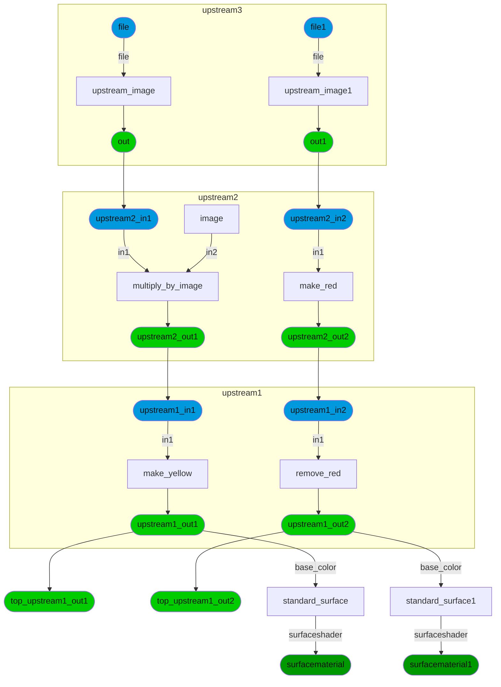

```mermaid
graph TB
    subgraph upstream3
    upstream3/file([file])
   style upstream3/file  fill:#09D, color:#111
    upstream3/file1([file1])
   style upstream3/file1  fill:#09D, color:#111
    upstream3/out([out])
   style upstream3/out   fill:#0C0, color:#111
    upstream3/out1([out1])
   style upstream3/out1   fill:#0C0, color:#111
    upstream3/upstream_image[upstream_image]
    upstream3/upstream_image1[upstream_image1]
    end
    subgraph upstream2
    upstream2/upstream2_in1([upstream2_in1])
   style upstream2/upstream2_in1  fill:#09D, color:#111
    upstream2/upstream2_in2([upstream2_in2])
   style upstream2/upstream2_in2  fill:#09D, color:#111
    upstream2/upstream2_out1([upstream2_out1])
   style upstream2/upstream2_out1   fill:#0C0, color:#111
    upstream2/upstream2_out2([upstream2_out2])
   style upstream2/upstream2_out2   fill:#0C0, color:#111
    upstream2/multiply_by_image[multiply_by_image]
    upstream2/make_red[make_red]
    upstream2/image[image]
    end
    subgraph upstream1
    upstream1/upstream1_in1([upstream1_in1])
   style upstream1/upstream1_in1  fill:#09D, color:#111
    upstream1/upstream1_in2([upstream1_in2])
   style upstream1/upstream1_in2  fill:#09D, color:#111
    upstream1/upstream1_out1([upstream1_out1])
   style upstream1/upstream1_out1   fill:#0C0, color:#111
    upstream1/upstream1_out2([upstream1_out2])
   style upstream1/upstream1_out2   fill:#0C0, color:#111
    upstream1/make_yellow[make_yellow]
    upstream1/remove_red[remove_red]
    end
    top_upstream1_out1([top_upstream1_out1])
   style top_upstream1_out1   fill:#0C0, color:#111
    top_upstream1_out2([top_upstream1_out2])
   style top_upstream1_out2   fill:#0C0, color:#111
    standard_surface[standard_surface]
    standard_surface1[standard_surface1]
    surfacematerial([surfacematerial])
   style surfacematerial   fill:#090, color:#111
    surfacematerial1([surfacematerial1])
   style surfacematerial1   fill:#090, color:#111
    upstream3/file --"file"--> upstream3/upstream_image
    upstream3/file1 --"file"--> upstream3/upstream_image1
    upstream3/upstream_image --> upstream3/out
    upstream3/upstream_image1 --> upstream3/out1
    upstream3/out --> upstream2/upstream2_in1
    upstream3/out1 --> upstream2/upstream2_in2
    upstream2/upstream2_in1 --"in1"--> upstream2/multiply_by_image
    upstream2/image --"in2"--> upstream2/multiply_by_image
    upstream2/upstream2_in2 --"in1"--> upstream2/make_red
    upstream2/multiply_by_image --> upstream2/upstream2_out1
    upstream2/make_red --> upstream2/upstream2_out2
    upstream2/upstream2_out1 --> upstream1/upstream1_in1
    upstream2/upstream2_out2 --> upstream1/upstream1_in2
    upstream1/upstream1_in1 --"in1"--> upstream1/make_yellow
    upstream1/upstream1_in2 --"in1"--> upstream1/remove_red
    upstream1/make_yellow --> upstream1/upstream1_out1
    upstream1/remove_red --> upstream1/upstream1_out2
    upstream1/upstream1_out1 --> top_upstream1_out1
    upstream1/upstream1_out2 --> top_upstream1_out2
    upstream1/upstream1_out1 --"base_color"--> standard_surface
    upstream1/upstream1_out2 --"base_color"--> standard_surface1
    standard_surface --"surfaceshader"--> surfacematerial
    standard_surface1 --"surfaceshader"--> surfacematerial1
```