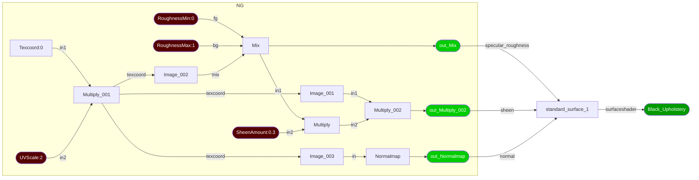

```mermaid
graph LR
    subgraph NG
    style NG_out_Mix  fill:#0C0, color:#FFF
    NG_out_Mix([out_Mix])
    style NG_out_Multiply_002  fill:#0C0, color:#FFF
    NG_out_Multiply_002([out_Multiply_002])
    style NG_out_Normalmap  fill:#0C0, color:#FFF
    NG_out_Normalmap([out_Normalmap])
    style NG_RoughnessMin  fill:#500, color:#FFF
    NG_RoughnessMin([RoughnessMin:0])
    style NG_RoughnessMax  fill:#500, color:#FFF
    NG_RoughnessMax([RoughnessMax:1])
    NG_Texcoord[Texcoord:0]
    style NG_UVScale  fill:#500, color:#FFF
    NG_UVScale([UVScale:2])
    NG_Multiply_001[Multiply_001]
    NG_Image_002[Image_002]
    NG_Mix[Mix]
    NG_Image_001[Image_001]
    style NG_SheenAmount  fill:#500, color:#FFF
    NG_SheenAmount([SheenAmount:0.3])
    NG_Multiply[Multiply]
    NG_Multiply_002[Multiply_002]
    NG_Image_003[Image_003]
    NG_Normalmap[Normalmap]
    end
    standard_surface_1[standard_surface_1]
    style Black_Upholstery  fill:#090, color:#FFF
    Black_Upholstery([Black_Upholstery])
    NG_Texcoord --"in1"--> NG_Multiply_001
    NG_UVScale --"in2"--> NG_Multiply_001
    NG_Multiply_001 --"texcoord"--> NG_Image_002
    NG_RoughnessMin --"fg"--> NG_Mix
    NG_RoughnessMax --"bg"--> NG_Mix
    NG_Image_002 --"mix"--> NG_Mix
    NG_Multiply_001 --"texcoord"--> NG_Image_001
    NG_Mix --"in1"--> NG_Multiply
    NG_SheenAmount --"in2"--> NG_Multiply
    NG_Image_001 --"in1"--> NG_Multiply_002
    NG_Multiply --"in2"--> NG_Multiply_002
    NG_Multiply_001 --"texcoord"--> NG_Image_003
    NG_Image_003 --"in"--> NG_Normalmap
    NG_Mix --> NG_out_Mix
    NG_Multiply_002 --> NG_out_Multiply_002
    NG_Normalmap --> NG_out_Normalmap
    NG_out_Mix --"specular_roughness"--> standard_surface_1
    NG_out_Multiply_002 --"sheen"--> standard_surface_1
    NG_out_Normalmap --"normal"--> standard_surface_1
    standard_surface_1 --"surfaceshader"--> Black_Upholstery
```