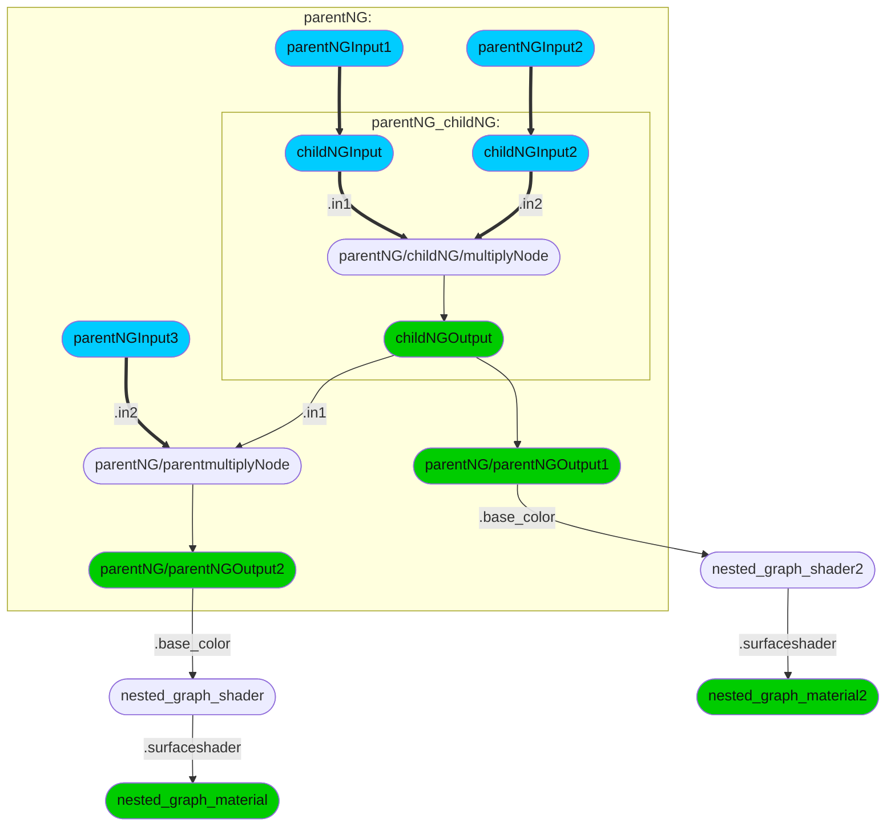

```mermaid
  graph TB;
    parentNG_childNG_childNGInput2([childNGInput2]) ==".in2"==> parentNG_childNG_multiplyNode
    parentNG_childNG_childNGOutput([parentNG/childNG/childNGOutput]) --".in1"--> parentNG_parentmultiplyNode([parentNG/parentmultiplyNode])
    parentNG_childNG_multiplyNode([parentNG/childNG/multiplyNode]) --> parentNG_childNG_childNGOutput([childNGOutput])
    parentNG_childNG_childNGInput([childNGInput]) ==".in1"==> parentNG_childNG_multiplyNode
    parentNG_parentmultiplyNode([parentNG/parentmultiplyNode]) --> parentNG_parentNGOutput2([parentNGOutput2])
    parentNG_childNG_childNGOutput([childNGOutput]) -->
    parentNG_parentNGOutput1([parentNGOutput1])
    
    parentNG_parentNGInput1([parentNGInput1]) ==> parentNG_childNG_childNGInput
   parentNG_parentNGInput2([parentNGInput2]) ==> parentNG_childNG_childNGInput2
   parentNG_parentNGInput3([parentNGInput3]) ==".in2"==> parentNG_parentmultiplyNode

    parentNG_parentNGOutput2([parentNG/parentNGOutput2]) --".base_color"--> nested_graph_shader([nested_graph_shader])
    parentNG_parentNGOutput1([parentNG/parentNGOutput1]) --".base_color"--> nested_graph_shader2([nested_graph_shader2])

    nested_graph_shader([nested_graph_shader]) --".surfaceshader"--> nested_graph_material([nested_graph_material])
    nested_graph_shader2([nested_graph_shader2]) --".surfaceshader"--> nested_graph_material2([nested_graph_material2])

%% Subgraphs
subgraph parentNG:
   parentNG_parentmultiplyNode
   parentNG_parentNGOutput1
   parentNG_parentNGOutput2
   parentNG_parentNGInput1
   parentNG_parentNGInput2
   parentNG_parentNGInput3
subgraph parentNG_childNG:
   parentNG_childNG_childNGInput
   parentNG_childNG_multiplyNode
   parentNG_childNG_childNGOutput
   parentNG_childNG_childNGInput2
end
end
%% Style
    style parentNG_parentNGInput1 fill:#0CF, color:#111
    style parentNG_parentNGInput2 fill:#0CF, color:#111
    style parentNG_parentNGInput3 fill:#0CF, color:#111
    style parentNG_childNG_childNGInput fill:#0CF, color:#111
    style parentNG_parentNGOutput2 fill:#0C0, color:#111
    style parentNG_parentNGOutput1 fill:#0C0, color:#111
    style parentNG_childNG_childNGInput2 fill:#0CF, color:#111
    style nested_graph_material2 fill:#0C0, color:#111
    style nested_graph_material fill:#0C0, color:#111
    style parentNG_childNG_childNGOutput fill:#0C0, color:#111
```
