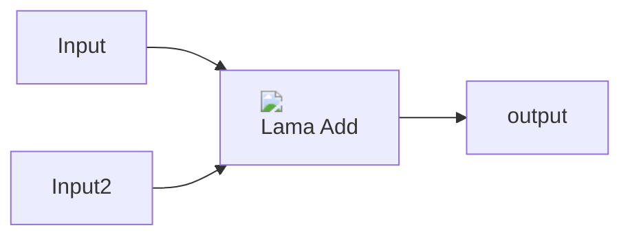

## Sample Mermaid Graph With Image in Node

```mermaid
graph LR;
a[Input] -->  test --> output
b[Input2] --> test

test[<img src='https://kwokcb.github.io/MaterialX_Learn/documents/images/nodes/material_lama_add_bsdf_out_osl.png' width='64'/> Lama Add]

```