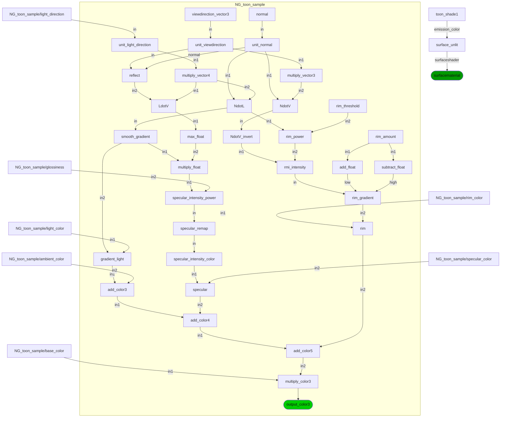

```mermaid
graph TB
    surface_unlit[surface_unlit]
    surfacematerial([surfacematerial])
   style surfacematerial   fill:#090, color:#111
    toon_shade1[toon_shade1]
    subgraph NG_toon_sample
    NG_toon_sample/output_color3([output_color3])
   style NG_toon_sample/output_color3   fill:#0C0, color:#111
    NG_toon_sample/normal[normal]
    NG_toon_sample/NdotL[NdotL]
    NG_toon_sample/unit_light_direction[unit_light_direction]
    NG_toon_sample/multiply_color3[multiply_color3]
    NG_toon_sample/add_color3[add_color3]
    NG_toon_sample/smooth_gradient[smooth_gradient]
    NG_toon_sample/viewdirection_vector3[viewdirection_vector3]
    NG_toon_sample/unit_viewdirection[unit_viewdirection]
    NG_toon_sample/multiply_float[multiply_float]
    NG_toon_sample/specular_intensity_power[specular_intensity_power]
    NG_toon_sample/specular_intensity_color[specular_intensity_color]
    NG_toon_sample/add_color4[add_color4]
    NG_toon_sample/multiply_vector3[multiply_vector3]
    NG_toon_sample/specular_remap[specular_remap]
    NG_toon_sample/specular[specular]
    NG_toon_sample/NdotV[NdotV]
    NG_toon_sample/NdotV_invert[NdotV_invert]
    NG_toon_sample/add_color5[add_color5]
    NG_toon_sample/rim_gradient[rim_gradient]
    NG_toon_sample/rim_amount[rim_amount]
    NG_toon_sample/add_float[add_float]
    NG_toon_sample/subtract_float[subtract_float]
    NG_toon_sample/rmi_intensity[rmi_intensity]
    NG_toon_sample/rim_threshold[rim_threshold]
    NG_toon_sample/rim_power[rim_power]
    NG_toon_sample/multiply_vector4[multiply_vector4]
    NG_toon_sample/unit_normal[unit_normal]
    NG_toon_sample/rim[rim]
    NG_toon_sample/gradient_light[gradient_light]
    NG_toon_sample/reflect[reflect]
    NG_toon_sample/LdotV[LdotV]
    NG_toon_sample/max_float[max_float]
    end
    toon_shade1 --"emission_color"--> surface_unlit
    surface_unlit --"surfaceshader"--> surfacematerial
    NG_toon_sample/multiply_color3 --> NG_toon_sample/output_color3
    NG_toon_sample/unit_normal --"in1"--> NG_toon_sample/NdotL
    NG_toon_sample/multiply_vector4 --"in2"--> NG_toon_sample/NdotL
    NG_toon_sample/light_direction --"in"--> NG_toon_sample/unit_light_direction
    NG_toon_sample/base_color --"in1"--> NG_toon_sample/multiply_color3
    NG_toon_sample/add_color5 --"in2"--> NG_toon_sample/multiply_color3
    NG_toon_sample/gradient_light --"in1"--> NG_toon_sample/add_color3
    NG_toon_sample/ambient_color --"in2"--> NG_toon_sample/add_color3
    NG_toon_sample/NdotL --"in"--> NG_toon_sample/smooth_gradient
    NG_toon_sample/viewdirection_vector3 --"in"--> NG_toon_sample/unit_viewdirection
    NG_toon_sample/smooth_gradient --"in1"--> NG_toon_sample/multiply_float
    NG_toon_sample/max_float --"in2"--> NG_toon_sample/multiply_float
    NG_toon_sample/multiply_float --"in1"--> NG_toon_sample/specular_intensity_power
    NG_toon_sample/glossiness --"in2"--> NG_toon_sample/specular_intensity_power
    NG_toon_sample/specular_remap --"in"--> NG_toon_sample/specular_intensity_color
    NG_toon_sample/add_color3 --"in1"--> NG_toon_sample/add_color4
    NG_toon_sample/specular --"in2"--> NG_toon_sample/add_color4
    NG_toon_sample/unit_viewdirection --"in1"--> NG_toon_sample/multiply_vector3
    NG_toon_sample/specular_intensity_power --"in"--> NG_toon_sample/specular_remap
    NG_toon_sample/specular_intensity_color --"in1"--> NG_toon_sample/specular
    NG_toon_sample/specular_color --"in2"--> NG_toon_sample/specular
    NG_toon_sample/unit_normal --"in1"--> NG_toon_sample/NdotV
    NG_toon_sample/multiply_vector3 --"in2"--> NG_toon_sample/NdotV
    NG_toon_sample/NdotV --"in"--> NG_toon_sample/NdotV_invert
    NG_toon_sample/add_color4 --"in1"--> NG_toon_sample/add_color5
    NG_toon_sample/rim --"in2"--> NG_toon_sample/add_color5
    NG_toon_sample/rmi_intensity --"in"--> NG_toon_sample/rim_gradient
    NG_toon_sample/add_float --"low"--> NG_toon_sample/rim_gradient
    NG_toon_sample/subtract_float --"high"--> NG_toon_sample/rim_gradient
    NG_toon_sample/rim_amount --"in1"--> NG_toon_sample/add_float
    NG_toon_sample/rim_amount --"in1"--> NG_toon_sample/subtract_float
    NG_toon_sample/NdotV_invert --"in1"--> NG_toon_sample/rmi_intensity
    NG_toon_sample/rim_power --"in2"--> NG_toon_sample/rmi_intensity
    NG_toon_sample/NdotL --"in1"--> NG_toon_sample/rim_power
    NG_toon_sample/rim_threshold --"in2"--> NG_toon_sample/rim_power
    NG_toon_sample/unit_light_direction --"in1"--> NG_toon_sample/multiply_vector4
    NG_toon_sample/normal --"in"--> NG_toon_sample/unit_normal
    NG_toon_sample/rim_color --"in1"--> NG_toon_sample/rim
    NG_toon_sample/rim_gradient --"in2"--> NG_toon_sample/rim
    NG_toon_sample/smooth_gradient --"in2"--> NG_toon_sample/gradient_light
    NG_toon_sample/light_color --"in1"--> NG_toon_sample/gradient_light
    NG_toon_sample/unit_viewdirection --"in"--> NG_toon_sample/reflect
    NG_toon_sample/unit_normal --"normal"--> NG_toon_sample/reflect
    NG_toon_sample/reflect --"in2"--> NG_toon_sample/LdotV
    NG_toon_sample/multiply_vector4 --"in1"--> NG_toon_sample/LdotV
    NG_toon_sample/LdotV --"in1"--> NG_toon_sample/max_float
```