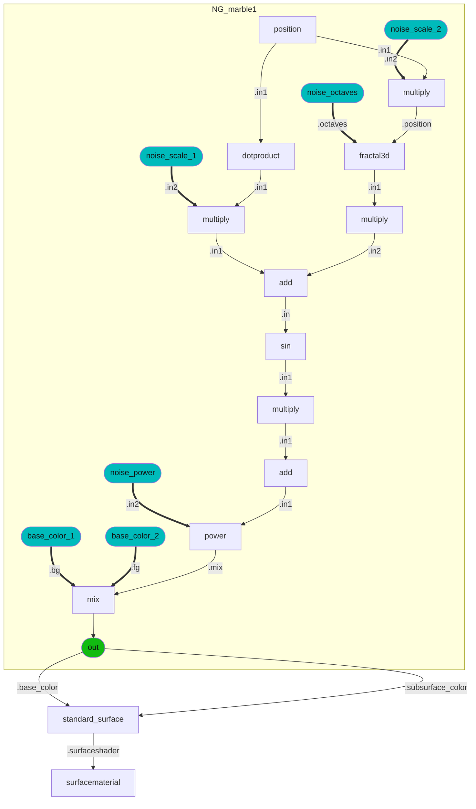

```mermaid
graph TB;
    SR_marble1[standard_surface] --".surfaceshader"--> Marble_3D[surfacematerial]
    NG_marble1_color_mix[mix] --> NG_marble1_NG_marble1_color_mixout([out])
    style NG_marble1_NG_marble1_color_mixout fill:#1b1, color:#111
    NG_marble1_NG_marble1_color_mixout --".base_color"--> SR_marble1[standard_surface]
    NG_marble1_base_color_1INT([base_color_1]) ==.bg==> NG_marble1_color_mix[mix]
    style NG_marble1_base_color_1INT fill:#0bb, color:#111
    NG_marble1_base_color_2INT([base_color_2]) ==.fg==> NG_marble1_color_mix[mix]
    style NG_marble1_base_color_2INT fill:#0bb, color:#111
    NG_marble1_power[power] --".mix"--> NG_marble1_color_mix[mix]
    NG_marble1_noise_powerINT([noise_power]) ==.in2==> NG_marble1_power[power]
    style NG_marble1_noise_powerINT fill:#0bb, color:#111
    NG_marble1_bias[add] --".in1"--> NG_marble1_power[power]
    NG_marble1_scale[multiply] --".in1"--> NG_marble1_bias[add]
    NG_marble1_sin[sin] --".in1"--> NG_marble1_scale[multiply]
    NG_marble1_sum[add] --".in"--> NG_marble1_sin[sin]
    NG_marble1_scale_xyz[multiply] --".in1"--> NG_marble1_sum[add]
    NG_marble1_noise_scale_1INT([noise_scale_1]) ==.in2==> NG_marble1_scale_xyz[multiply]
    style NG_marble1_noise_scale_1INT fill:#0bb, color:#111
    NG_marble1_add_xyz[dotproduct] --".in1"--> NG_marble1_scale_xyz[multiply]
    NG_marble1_obj_pos[position] --".in1"--> NG_marble1_add_xyz[dotproduct]
    NG_marble1_scale_noise[multiply] --".in2"--> NG_marble1_sum[add]
    NG_marble1_noise[fractal3d] --".in1"--> NG_marble1_scale_noise[multiply]
    NG_marble1_noise_octavesINT([noise_octaves]) ==.octaves==> NG_marble1_noise[fractal3d]
    style NG_marble1_noise_octavesINT fill:#0bb, color:#111
    NG_marble1_scale_pos[multiply] --".position"--> NG_marble1_noise[fractal3d]
    NG_marble1_noise_scale_2INT([noise_scale_2]) ==.in2==> NG_marble1_scale_pos[multiply]
    style NG_marble1_noise_scale_2INT fill:#0bb, color:#111
    NG_marble1_obj_pos[position] --".in1"--> NG_marble1_scale_pos[multiply]
    style NG_marble1_NG_marble1_color_mixout fill:#1b1, color:#111
    NG_marble1_NG_marble1_color_mixout --".subsurface_color"--> SR_marble1[standard_surface]
  subgraph NG_marble1
    NG_marble1_NG_marble1_color_mixout
    NG_marble1_add_xyz
    NG_marble1_base_color_1INT
    NG_marble1_base_color_2INT
    NG_marble1_bias
    NG_marble1_color_mix
    NG_marble1_noise
    NG_marble1_noise_octavesINT
    NG_marble1_noise_powerINT
    NG_marble1_noise_scale_1INT
    NG_marble1_noise_scale_2INT
    NG_marble1_obj_pos
    NG_marble1_power
    NG_marble1_scale
    NG_marble1_scale_noise
    NG_marble1_scale_pos
    NG_marble1_scale_xyz
    NG_marble1_sin
    NG_marble1_sum
  end
```