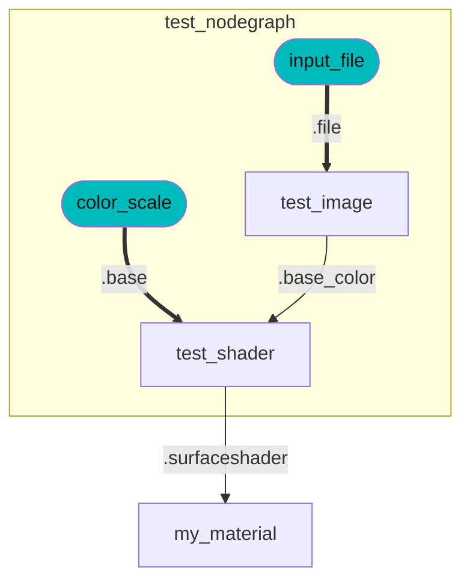

```mermaid
graph TB;
    test_nodegraph_test_shader[test_nodegraph_test_shader] --".surfaceshader"--> my_material[my_material]
    test_nodegraph_color_scaleINT([color_scale]) ==.base==> test_nodegraph_test_shader[test_nodegraph_test_shader]
    style test_nodegraph_color_scaleINT fill:#0bb, color:#111
    test_nodegraph_test_image[test_image] --".base_color"--> test_nodegraph_test_shader[test_shader]
    test_nodegraph_input_fileINT([input_file]) ==.file==> test_nodegraph_test_image[test_image]
    style test_nodegraph_input_fileINT fill:#0bb, color:#111
  subgraph test_nodegraph
    test_nodegraph_color_scaleINT
    test_nodegraph_input_fileINT
    test_nodegraph_test_image
    test_nodegraph_test_shader    
  end
```