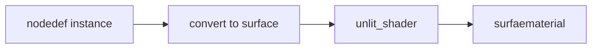

# Document for Rendering

The files in this folder were generated based on the node definitions available in the core libraries which come with
MaterialX. The contents are up-to-date as much as possible with the main branch of the ASWF MaterialX repo. 

This can include definitions which are ot part of an official release yet.

The current development release being tracked is: 1.38.9

## Per Document Information

Each document has an instantiation of a `nodedef` + a `convert` node to convert from the definitions output type to a `surface shader`. If there
is more than one output then multiple `convert` node are generated. The root connected to each surface shader is a `surfacematerial` which 
is used for rendering.

