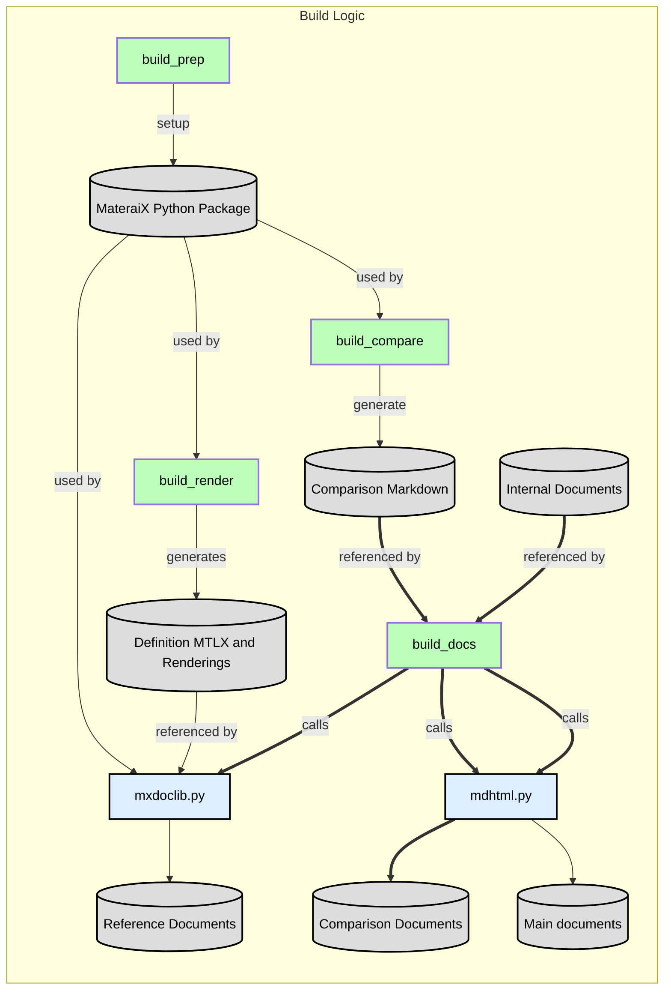

<!--Start-->
## Building This Site

This site is generated using the scripts provided in this folder.

All reference content is generated procedurally based on information provided
by a MaterialX distribution. The current minimal version requirement is 1.38.8.
Reference content prior to this has been cached but can also be rebuilt using
a provided script.

The "core" scripts for site generation (as well as some static data content) reside in
the `pymaterialx` folder.

### Content

Learning content is provided as static content and / or is procedurally generated.
Interactive content such as `Jupyter` notebooks are executed to generate results.

Static is comprised of either `Markdown` or `HTML` files. 
- All HTML content can assume usage of `Bootstrap`. The current version used is `5.3.1`. 
- `Mermaid` is used for MaterialX node graph diagram generation (including `SVG` export). The version of used is `9`.
- All other diagrams are created using `draw.io`. Log an issue as required for any desired changes.
- Images can be converted to `webp` format to optimize image sizes for better website performance.
- Rendered images such as "shader balls" have not been optimized to avoid possible artifacts.

### Build Requirements

All scripts are written in Python. It is recommended to work using a virtual environment using `venv`. 
With the following packages assumed to be installed:

- `pip` : For package management. This is available when setting up a virtual environment. This can
also be installed separately if desired.
- <a href="https://pypi.org/project/MaterialX/" target="_blank">MaterialX</a>: The desired release version should be installed This can be a local builds or pre-release versions to allow for increment site
update between / before official releases.
- <a href="https://pypi.org/project/Markdown/" target="_blank">Markdown</a>: For conversion from Markdown to HTML.

Some `Jupyter` notebooks require additional packages. They should be installed as needed (e.g. `pxr` for the
`OpenUSD` notebook). Dependencies are explicitly mentioned in each notebook.

Image optimization is not scripted. Conversion us performed using `cwebp` from the <a href="https://developers.google.com/speed/webp/download" target="_blank">WebP library</a>. 

### Script Breakdown

- `buid_prep.sh` : Optional script to install (using `pip`) and copy over MaterialX Python libraries to publishing area under `pymaterialx`.

- `build_compare` : Just runs the version comparison between the standard node library. Requires current
version to copied under `pymaterialx`.

- `build_render.sh` : Creates a sample node graph for every node definition which has an implementation. Uses a renderer to generate all sample swatches for reference pages. The default is to use the Python based OpenGL renderer which performs the equivalent logic to the MaterialX renderer used for test suite rendering. This script can be modified to use other renders. The output is expected to be squire. The default size is 512x512 png files.

- `build_docs.sh` Calls `build_compare` to build comparisons. Prepares all internal content for publishing. This includes using the templated component files found in the utilities folder. These should not be modified for branches / forks without notifying the authors of this site. The main scripts used are:

  - `mxdoclib.py` : A extensively enhanced version of the simple example script provided as part of the MaterialX distribution. Generates all dynamica content found in the top level `documents` folder. That folder's contents should never be directly modified as it will be replaced via this script. Assumes that all swatches have been generated before hand. All Mermaid diagrams are referenced but not converted to static SVG as this process is very slow for hundreds of diagrams.

  - `mdhtml.py` : Performs publishing of Markdown / HTML content to final HTML content. Requires the `Markdown` package to be installed. 

-----------------------------------

-----------------------------------

<!--End-->