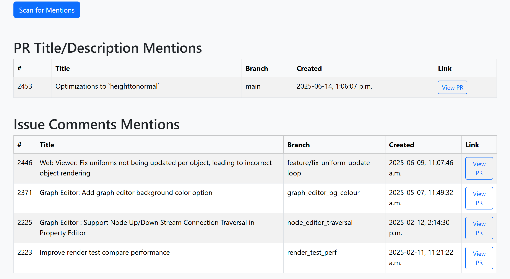
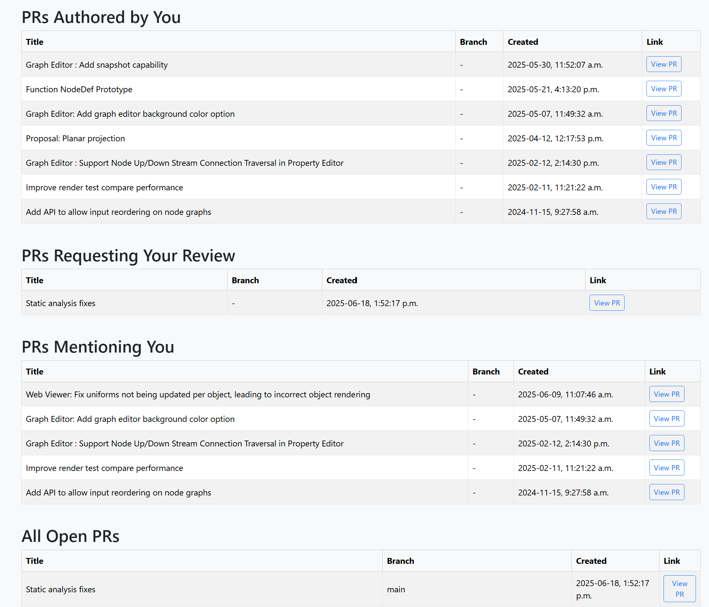

# Github Utilities

## Web `gh` Rest API Query
- mx_gh_mentions.html : Page to find places where user name is mentioned using @.

- mx_gh_status.html : Page to get PR status.

## Shell `gh` API Query
- mx_gh.sh : Shell script to get github status.
- mx_gh_md.sh : Shell script to get github status and output Markdown
    - sample_output.md : Sample Markdown output.

## Python Request Query
- mx_gh.py : Python query. Handles PR and issue query via command line options
- Sample Markdown output:

    ## Github Query
    - User: kwokcb
    - Repository: AcademySoftwareFoundation/MaterialX
    - 5 pr items found. Query type: mentioned

    | Title | Link |  Created By | Created At |
    | --- | --- |  --- | --- |
    | Web Viewer: Fix uniforms not being updated per object, leading to incorrect object rendering | [2446](https://github.com/AcademySoftwareFoundation/MaterialX/pull/2446) |  hybridherbst | 2025-06-09 15:07 |
    | Graph Editor: Add graph editor background color option | [2371](https://github.com/AcademySoftwareFoundation/MaterialX/pull/2371) |  kwokcb | 2025-05-07 15:49 |
    | Graph Editor : Support Node Up/Down Stream Connection Traversal in Property Editor | [2225](https://github.com/AcademySoftwareFoundation/MaterialX/pull/2225) |  kwokcb | 2025-02-12 19:14 |
    | Improve render test compare performance | [2223](https://github.com/AcademySoftwareFoundation/MaterialX/pull/2223) |  kwokcb | 2025-02-11 16:21 |
    | Add API to allow input reordering on node graphs | [2116](https://github.com/AcademySoftwareFoundation/MaterialX/pull/2116) |  kwokcb | 2024-11-15 14:27 |

